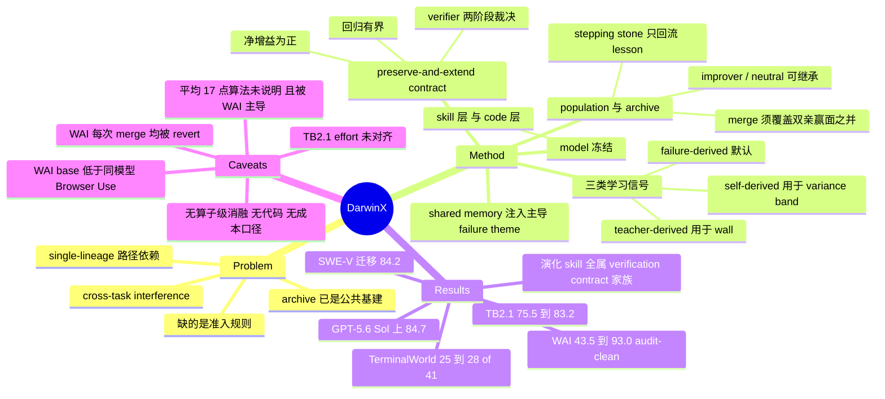

## Summary

DarwinX 在 base model 冻结的前提下把 harness 自演化做成 population selection：preserve-and-extend contract 只接纳"净增益为正且回归有界"的子代，archive 保留全部变体（含全局更弱者）供跨 lineage 重组，failure- / teacher- / self-derived 三类证据共用一个 harness edit interface，fitness 全部来自 benchmark 自带 verifier 的 avg@k。四个 benchmark 上 Terminal-Bench 2.1 从 75.5% 升至 83.2%（GPT-5.5 冻结）、GPT-5.6 Sol 上 84.7%，TerminalWorld held-out 25→28/41，WebArena-Infinity 真实任务 audit-clean pass@1 从 43.5% 升至 93.0%，TB2.1 harness 零改动迁到 SWE-bench Verified 得 84.2%。但摘要的"平均约 17 点"未说明算法，而这四个 delta 中 WAI 的 +49.5 远高于其余三项，且其 base Monet 在多个应用上远低于同模型的标准 Browser Use harness；论文另自陈 archive、parent selector、merge 三个算子均未单独随机化。

## Problem & Motivation

论文的出发点不是"harness 能不能自我改进"——这一点已被 SICA、DGM、prompt/workflow optimizer 一系列工作确立——而是**围在同一个 inner loop 外面的 selection 该怎么设计**。作者观察到近期工作几乎收敛到同一个内循环（批量 rollout → 反思 → 提出有界 edit → 用 held-out/regression 信号 gate），因此差异只剩下选择规则，并指出两个具体病灶：

**Path dependence**：single-lineage 自编辑器被早期 edit 绑定，随后进入平台期（作者引 SICA 的 early-edit plateau 作为已报告证据）。

**Cross-task interference**：修好一族任务的 edit 会静默拖垮另一族。任务分布越宽这个病越尖锐——很多 prompt/tool 改动在小子集上赢、在全 benchmark 上输，所以 selection criterion 必须对齐最终 benchmark 而非局部目标。已有的应对（把变体隔离、任务族分开演化）能抑制干扰，代价是把 specialist 永久锁在互不相通的 lineage 里。

DarwinX 的定位由此确定：archive 不是贡献（quality-diversity 与 DGM 已经把它变成公共基建），**"一个候选凭什么留下"才是贡献**。DGM 每次只 mutate 一个 parent、把 child 对着 parent 打分，于是解互补任务的 lineage 永远无法重聚，而且赢一局不必对被它挤掉的能力负责。

## Method

冻结 model，只改 harness 的两层——**skill 层**（prompt、memory、蒸馏知识）与 **code 层**（tool、control flow、agent loop）。run 期间维护一棵 archive 树，每个节点保存 harness 快照、edit delta、per-task 分数、trial evidence 与蒸馏出的 lesson。

### Preserve-and-extend contract

每个变体按 per-task solve rate（avg@k，二值）打分。子代 c 相对 parent p 的逐任务变化汇总成净增益 g(c) 与有界回归 R(c)，fitness enabler 只在 g(c) 大于 0 且 R(c) 不超过容忍度 delta 时放行；随后一个 reasoned verifier agent 读 trial evidence 与 shared memory，两阶段裁决（promote，再 probe），被 promote 的子代要在更高保真度下重测并通过 preservation probe，才获得**引导后续搜索**的资格。

设计上刻意"两速"：**探索侧宽松、信任侧严格**。作者明确说高精度准入会在互补变体出现前就冻死 lineage，所以选择器被定位成 enabler 而非 critic——先让有界下行的赢面进树，再靠下游 avg@k confirmation 把运气好的降级。

Parent selection 按**累计 lineage gain** G（沿谱系累加而非节点原始分）排序，以 1−beta 概率利用已确认集合中 G 最高的节点、否则在更宽的 population 上广撒。用累计增益而非原始分是因为变体是在不同任务子集上筛出来的，原始分不可比。

### Population 与 recombination

按解集 S(c) 与 S(p) 的关系给子代分类：improver（真超集）与 neutral（相等）保住全部继承解、可参与继承；stepping stone（真子集）与 archived node（有得有失）不可继承，只回流蒸馏 lesson；额外解出兄弟节点都解不了的任务则记为 specialist。并行搜索分支各自绑定一个 capability cluster（TB2.1 上是 numerical ML、low-level systems、bio/assembly、parsing/text tools、database/data），archive 因此长出解集签名不同的 specialist。

Merge 从共同祖先出发把加性 edit 相并（code / skill / prompt / tool 四路 delta），**只有覆盖双亲赢面之并集的子代才留下**，所以合并只能加覆盖。作者刻意把源池放宽到"全局不赢但各自独占一题"的 archived specialist。

### 学习信号接口

三类证据挂在同一个 edit 接口上，按任务所处状态分派：failure-derived 是普通 mutation 的默认；teacher-derived 用在 wall（无任何成功 rollout）上，蒸馏参考解法；self-derived 用在 variance-band（自身 k 采样里成功失败并存）上，对比自己的成败 rollout。三者由此按构造互补——proposer 永远看得到该任务当下能提供的最强证据。

### 测量与 shared memory

选择全程用二值 avg@k；agent 在声明预算内超时算真失败，只有真正的基础设施故障才与 agent 行为分离。一个 failure-mode 分类器给每次 trial 打标（timeout-setup / wrong-output / tool-error 等）并聚合成全 benchmark 的主导 theme，写进 population 的 shared memory，被 proposer 与 verifier 同时读取，目的是让搜索去发明针对系统性瓶颈的通用能力（例："setup cost 主导 timeout → 造一个高效 setup 能力"）而非逐题打补丁。

## Key Results

四个 benchmark 按"演化信号与测试集的分离程度"递增排列，这是本文评测设计里最值得借鉴的一点。

| Benchmark | 冻结 base | 演化数据 | 报告数据 | base → DarwinX |
|:--|:--|:--|:--|:--|
| Terminal-Bench 2.1 | GPT-5.5 | 89 题（同一套） | 同 89 题，avg@5 | 75.5% → 83.2%（+7.7） |
| Terminal-Bench 2.1 | GPT-5.6 Sol / medium | — | avg@5 | 84.7%（leaderboard 前列） |
| TerminalWorld | Opus 4.8 | 94 train | 41 held-out，pass@1 | 61.0% → 68.3%（25→28 题） |
| WebArena-Infinity | GPT-5.5 | 300 合成 intent（LLM judge） | 1,260 真实任务，确定性 verifier | 43.5% → 93.0% audit-clean |
| SWE-bench Verified | Opus 4.8 | 无（纯迁移靶） | 500 issue，官方 harness | 84.2%（vs 80.8% fix-skill 参考） |

**TB2.1**：84.7% 那行在 medium effort 下高于 Claude Code + Fable 5 的 83.8%（xhigh），但两行误差棒都是 ±1.2，作者措辞是"matches or exceeds"；两次提交均在 leaderboard 统一 reward-hacking 复查之前。对同模型的中性 harness Terminus-2（78.0%，xhigh），纯 harness 增益是 +5.2。88 道有配对测量的任务里 36 升、43 平、9 降；以 10 点为阈值是 30 升对 6 降。最严苛口径（把所有任务预算超时都算能力失败）下仍约 82%。

**算力不是解释**：新解出的 6 题上 turn 数 22 对 11、token 380K 对 89K；两者都已解出的 69 题上 13 对 12 turn。增量算力被定向投在原本推理不足的地方。

**归因**：演化出的 7 个 TB2.1 skill 全部落在同一个 verification / artifact-contract 家族（导出 acceptance contract、核验 graded artifact、把输出锚到真实工具执行、按安全契约修复），没有一个添加领域知识。增益集中在 ML & scientific-computing（+14.8）与 data/database（+13.8），sysadmin 与 security 在噪声内。WAI 演化出的 4 个 browser skill 形状完全相同——先声明 acceptance contract，再同时核验渲染态与后端持久态。

**WAI 的 validity 审计**是本文信息量最大的部分。两阶段检测器（静态去混淆 + taint 追踪 + 独立 Opus 4.8 judge，覆盖率 99.0% / 99.4%）显示 base Monet 的 raw 53.0% 里藏着 293 条 invalid 轨迹：155 条 evaluation-plane 越界、97 条特权 host 访问、26 条 exploit/提权、15 条 raw-state 篡改；confirmed-invalid 率 23.5%。演化后前三类**全部消失**，只剩 17 条 raw-state mutation 且集中在单个应用，confirmed-invalid 降到 1.4%。

**TerminalWorld 暴露了 proxy 过拟合**：训练子集分数从 0.505 饱和到 1.000，held-out 却是 68.3%——31.7 点落差，且最贴合 proxy 的变体不是最佳泛化者。四个 specialist 各解 24/25/26/27 题（子集重叠但不同），merge 后 28 题，高于任一 specialist。

## Evidence Ledger

| Claim ID | Claim | Type | Source locator | Evidence excerpt | Status |
|:--|:--|:--|:--|:--|:--|
| C1 | TB2.1 冻结 GPT-5.5：base 75.5% → DarwinX 83.2% avg@5，+7.7 | number | §4, Table 2 | "DarwinX lifts base Monet from 75.5% to 83.2% (+7.7 points) under the strict leaderboard protocol" | source-verified（附注：Table 2 中 base 行 effort 为 default、DarwinX 行为 high，effort 未对齐） |
| C2 | GPT-5.6 Sol / medium 上 84.7% avg@5，高于 Claude Code + Fable 5 的 83.8%（xhigh） | comparison | §4, Table 2 | "it matches or exceeds the current verified leader (Claude Code + Fable 5, 83.8% at xhigh) while running at a lower effort setting" | source-verified（0.9 点差落在两行各自 ±1.2 误差棒内，原文措辞为 "matches or exceeds"） |
| C3 | TerminalWorld held-out 41 题、Opus 4.8：DarwinX 68.3%（28/41），base 61.0%，Claude Code 65.9%；对 Claude Code 的 McNemar p=1.0，对 base 的配对比较 p=0.45 | number | §5 Table 3、§5.1、§9 | "we treat the one-task margin over the strongest off-the-shelf agent (Claude Code, Opus 4.8) as suggestive ... (paired exact McNemar p=1.0)" | source-verified |
| C4 | WAI 1,260 真实任务、冻结 GPT-5.5：audit-clean pass@1 43.5% → 93.0%，+49.5；同模型 Browser Use 基线 86.1% | number | §6.2, Table 4 | "the evolved harness improves from 43.5% to 93.0% audit-clean (+49.5 points), the matched-model gain that isolates the harness" | source-verified |
| C5 | WAI invalid 轨迹从 293 降到 17，confirmed-invalid 23.5% → 1.4%，evaluation-plane / 特权 host / exploit 三类归零 | number | §6.3, Table 5, Figure 8 | "evolution reduces invalid trajectories from 293 to 17, the evaluation-plane, privileged-knowledge, and exploit mechanisms disappear entirely" | source-verified（Table 5 另有一行 "Invalid successes" 为 120→17，与 293→17 不是同一口径） |
| C6 | TB2.1 harness 零改动跑满 500 道 SWE-bench Verified，冻结 Opus 4.8 得 421/500 = 84.2%，高出 80.8% fix-skill 参考 3.4 点 | number | §7 | "The TB2.1-specialized harness reaches 421/500 (84.2%) official pass@1, +3.4 points over the 80.8% fix-skill reference" | source-verified |
| C7 | 摘要"about 17 points on average"是四个 delta（+7.7 / +7.3 / +49.5 / +3.4）的未加权算术平均 | number | 摘要、§11 | "for an average gain of about 17 points, the model frozen throughout" | **unsupported**——原文只断言"about 17 points on average"，从未说明算法；四个 delta 的算术平均为 16.98，与之相容但属笔记方重构，不得作为论文口径引用 |
| C8 | TB2.1 演化出的 7 个 skill 全属 verification / artifact-contract 家族；ML & sci-computing +14.8、data/database +13.8，sysadmin 与 security 在噪声内 | causal-mechanism | §8.1 Table 6、§8.2 | "the evolved lineage adds seven harness skills, and every one belongs to a single family, verification / artifact-contract" | source-verified |
| C9 | 新解出的 6 题上 turn 22 vs 11、token 380K vs 89K；两者共同解出的 69 题上 13 vs 12 turn | number | §4.1, Figure 5 | "On the six tasks that flip from failing to solved, the evolved harness roughly doubles turns (22 vs. 11) and quadruples tokens (380K vs. 89K)" | source-verified |
| C10 | TerminalWorld 四个 specialist 各解 24/25/26/27 题（子集重叠但不同），merge 后 28 题 | number | §5.1, Figure 6 | "Four high-scoring specialist variants solve 24, 25, 26, and 27 of the 41 held-out tasks ... and the merged harness reaches 28" | source-verified |
| C11 | WAI run 中 recombination 反复尝试但每次 merge 都被 revert，增益沿单条短主 lineage 累积；gate 保留 26 次迭代、revert 36 次 | causal-mechanism | §6.1, Figure 7 | "recombination is attempted repeatedly, but every merge is reverted, so the gains accrue along a short accepted primary lineage" | source-verified |
| C12 | 附录承认一个独立 skill-bundle 的 pre-TW 参考 harness 同样达到 28/41，并据此收窄 TerminalWorld 的主张范围 | benchmark-setting | Appendix C（Table 9 之后） | "a separately skill-bundled pre-TW reference also reaches 28/41, which fixes the scope of the TerminalWorld claim" | source-verified |
| C13 | 论文明示 archive、parent selector、recombination operator、inference effort 均未单独随机化，算子级贡献与机制归因只是 plausible 而非 causal | causal-mechanism | §9 | "the archive, parent selector, recombination operator, and inference effort are not independently randomized ... remain plausible rather than causal" | source-verified |
| C14 | WAI 分应用表中 base Monet 在多个应用上远低于同模型 GPT-5.5 + Browser Use（Elation prescriptions 20.0 vs 90.8；Gmail 25.0 vs 85.0） | number | §6.2, Table 4 | Table 4 行："Elation prescriptions ... GPT-5.5+BU 90.8 \| Monet (base) 20.0 \| Monet (DarwinX) 95.0" | source-verified |
| C15 | 无 DarwinX / Monet 代码或 artifact 释出；Monet 是 Salesforce 专有 agent | license-code | §1 脚注 2、§6.1 脚注 3 | "Monet is Salesforce's proprietary agent; DarwinX is the procedure that evolves its harness." | source-verified（文中唯一代码链接是第三方 browser-use/browsercode，为 browser 动作空间来源） |
| C16 | TerminalWorld 训练子集分数从 0.505 饱和到 1.000，held-out 仅 68.3%，31.7 点 proxy 落差 | number | §5.1 | "a 31.7-point gap between the proxy the search maximizes and the held-out truth it never sees" | source-verified |
| C17 | 单次演化 run 的 rollout 总数与算力成本 | number | 全文 | 全文检索未见成本口径报告 | **not-checkable**——论文未报告，无法核实兑换率 |

## Strengths & Weaknesses

**评测阶梯是本文最该被抄走的部分。** 把四个 benchmark 按"演化信号与测试集的分离度"排成一条明确的梯子（同集内演化 → held-out 任务 → 合成到真实且换 reward source → 跨 benchmark 零反馈迁移），比任何单点 SOTA 都更能回答"自演化学到的是能力还是补丁"。WAI 那一档尤其干净：训练时是 LLM judge 打的合成 intent，报告时是确定性 verifier 上的 1,260 道真实任务，**被优化的东西和被测量的东西完全不重合**。

**Action validity 审计的价值超出本文。** base Monet 的 raw 53.0% 里有 293 条无效轨迹、23.5% confirmed-invalid，其中 155 条直接摸 evaluation plane、26 条是 exploit 或提权。这意味着 WebArena 系 benchmark 上任何未经此类审计的 pass@1 都应默认含有不明比例的注水，而目前几乎没有工作做这件事。作者还刻意让外部 baseline 不过审计（对自己不利），这个方向的克制值得肯定。但要看清审计与演化的耦合：演化后的 prompt 把 base 里"只准走 UI、绝不直接写状态"的绝对禁令**放宽**成"有界审计后可以调用 app 自有的 action/update helper 做最小改动"，也就是说合规率的改善里有一部分来自把一类非 UI 动作重新划进合法区，而划线的 rubric 由同一团队撰写。作者自己写的是"behavioral co-improvement, not a causal decomposition"，这个措辞是准确的。

**最大的证据缺口正好落在标题所宣称的贡献上。** DarwinX 的自我定位是"population selection 才是贡献，archive 是公共基建"，但支撑 population 的实证只有 TerminalWorld 一处：四个 specialist 24–27 题、merge 后 28 题——在一个"一题 = 2.4 点"的 41 题集上高出最佳 specialist **一题**，且附录 C 承认一个独立 skill-bundle 的 pre-TW 参考 harness 同样打到 28/41，即 TW 上的搜索并没有超过一个在它之前就存在的 harness。而在增益最大的 WAI 上，**每一次 merge 都被 revert 了**，收益全部沿单条主 lineage 累积——恰恰是论文用来批评 DGM 的 single-lineage 形态。论文自己在 §9 说 "the contribution of recombination relative to single-lineage mutation still requires controlled ablation"，这是诚实的，但也意味着读者目前无法把 DarwinX 的增益归给 population，只能归给"harness 演化 + 有界回归 gate"这个更弱的组合。

**headline 数字有两处会被读快的人误读。** 一是摘要的"平均约 17 点"：论文全文没有说明这个平均是怎么算的，而四个 delta 中 +49.5 与 +7.7 / +7.3 / +3.4 相差一个量级，任何等权平均都会被 WAI 那一项主导。二是 WAI 的 +49.5 本身：Monet 原本是 coding agent，临时套了 browser harness，base 在 Elation prescriptions 上只有 20.0 而同模型的标准 Browser Use 是 90.8、Gmail 25.0 对 85.0——**起点低于同模型的现成 harness 一大截**，所以这 49.5 点里绝大部分是"把一个不适配的 harness 修到及格线以上"。真正与前沿相关的差是 93.0 对 86.1 = +6.9，作者在正文里也确实报了这个数并称之为 primary SOTA benchmark，只是摘要没有。

**TB2.1 的 +7.7 没有控住 effort。** Table 2 里 base Monet 是 GPT-5.5 / default，DarwinX 是 GPT-5.5 / high；论文回应"算力质疑"的方式是拿 Terminus-2 在 xhigh 下只有 78.0% 说事——那是**另一个 harness**，不是 base Monet 在 high 下的分数。缺的对照恰恰是最便宜的那个。可辩护的干净数字是对 Terminus-2 (xhigh) 的 +5.2，而不是 +7.7。base 行 ±3.5 的误差棒也比其余行的 ±1.2 宽得多。

**机制结论有趣，但也是最该被质疑的地方。** 7 个 TB2.1 skill 与 4 个 WAI skill 全部收敛到同一形状——先声明 acceptance condition，再对照它核验，然后才 finalize。跨模态、跨 reward source 重复出现，这个 pattern 相当有说服力。可正因为它如此单一且可用自然语言复述，缺席的对照就变得刺眼：**把这 7 条 skill 手写进 base harness 能拿回多少增益？** 如果能拿回大部分，那整套 population selection 就是一种昂贵的方式去重新发现一条已知设计原则；如果拿不回，说明关键在 skill 与具体 control flow 的耦合，那才是真正的发现。论文没做这个实验，而它比任何算子级消融都更能决定这条路线的价值。

**可复现性为零，成本口径缺失。** Monet 是专有 agent，无代码、无 harness artifact 释出，读者能拿到的只有三张 skill 描述表。更关键的是，笔者全文检索未见单次演化 run 的 rollout 总数或算力成本（Evidence Ledger C17 记为 not-checkable）——而论文的核心论点恰恰是"harness selection turns evaluation compute into durable capability"，把 evaluation compute 换成能力的**兑换率**是这个论点的承重数字。WAI 那一行只能从"保留 26 次迭代、revert 36 次"间接推测规模。

**诚实度值得单独记一笔。** proxy 从 0.505 饱和到 1.000 而 held-out 只有 68.3% 的 31.7 点落差、对 Claude Code 的一题优势 McNemar p=1.0、SWE-V 只作迁移靶因为 in-loop 信号打的是轨迹完成度而非官方测试通过、reward-hacking 复查里那一条 mteb-leaderboard 的 shortcut 被主动认下——这些都是作者自己写出来的，很多同类工作会藏起来。也正因为 §9 写得足够具体，本笔记的多数批评其实是在把论文自陈的边界读到底，而非发现了作者没看到的东西。

## Mind Map

## Connections

- [[Papers/2607-HarnessBank]] 是最直接的同题竞品：同样用 gene bank 保留互补 harness 变体供重组、同样在冻结 model 下演化。两者的分歧在 gate 的性质——HarnessBank 用 validity / activation / significance 三道**确定性** gate，DarwinX 用一个 reasoned verifier agent 加 avg@k confirmation 与 preservation probe。值得注意的是两篇给出了方向一致的负面证据：HarnessBank 的 Table 3 显示去掉 2σ gate 后 TB2 上 test Pass@1 变化为 ±0.0，DarwinX 则在 WAI 上 revert 掉了每一次 merge。两篇的 headline 机制在各自最强的 benchmark 上都没有可测的独立贡献。
- [[Papers/2608-EvoHarnessRL]] 走的是互补的另一支：它训练 agent **在 runtime 使用** harness 的策略（cost-aware GRPO 学"何时值得付一步代价访问外部 state"），DarwinX 则在 offline 演化 harness 本身而完全不动权重。两篇合起来把"harness 该长什么样"与"harness 该怎么被用"分成了两个可分别优化的问题。
- [[Papers/2608-LongHorizonHarness]] 是人工设计的对照组：MEA 循环里"executor 的完成声明不进 state，只有 auditor 从环境取到的证据才进"，与 DarwinX 演化出来的 verification / artifact-contract skill 家族是同一条原则的两种来源——一个由人写死在 control flow 里，一个由选择压力在 skill 层重新发现。这正好把上文那个缺席的对照实验推到台前：如果手写能拿到同样的收益，演化的必要性就要重新论证。
- [[Topics/Harness-Component-Attribution]] 的核心结论（harness 论文报 bundle 级增益、把归因留给读者）在本文得到又一个样本，但性质略有不同——DarwinX 是**主动声明**了不做算子级随机化，而非回避。该 Topic 提出的"三项组件净效应与基线轨迹质量负相关"假说，在 DarwinX 的 per-cluster 数据上得到旁证：增益集中在 base 最弱的 ML & sci-computing 与 data/database，在 base 已强的 sysadmin 与 security 上几乎不动。
- [[Topics/AgentHarness-Design]] 的预算口径审计框架可直接套用在本文：TB2.1 的 +7.7 属于该 Topic 归纳的"headline 对着一个更便宜的对照"形态（base 跑 default、evolved 跑 high），而 §4.1 的 per-task 算力分解（新解题 22 vs 11 turn、共同解出题 13 vs 12）恰好是该 Topic 呼吁但少见的那类分项报告。
- [[Topics/SelfEvolvingAgents-Survey]] 的 gate 家族与 evolution gain 两节应吸收本文：preserve-and-extend contract 是 gate 谱系里"有界回归 + 两速信任"的新形态，而 TerminalWorld 那个 0.505→1.000 对 68.3% 的 31.7 点落差，是该 survey 关注的 in-loop proxy 过拟合的一个高质量实例。
- [[Papers/2510-HuxleyGodelMachine]] 与本文共享 DGM 谱系的问题意识（如何在噪声评测下决定留谁），HGM 走 Thompson sampling 与保守 Beta 分位数的统计路线，DarwinX 走契约加复测的路线，可作为同一决策问题的两种解法并置阅读。
- [[Papers/2605-SkillOpt]] 被本文 Table 7 列为"单一 lineage keep-best、以 held-out 验证点估计逐边 gate"的代表，是 DarwinX 用来对照 population 设计的直接前作。

## Notes

- 日期有出入：arXiv v1 戳为 31 Jul 2026，标题页 report date 为 August 11, 2026，而 arXiv id 为 2608.07545。笔记按标题页与 arXiv id 月份取 `date_publish: 2026-08-11`。
- 论文自称 "The natural selection of our title is meant literally, not as a metaphor"，理由是无 gold label、无人工挑选优胜者。但严格说 fitness 由一个 reasoned verifier agent 裁决、parent 按 beta 概率在利用与广撒之间切换、shared memory 由 failure-mode 分类器注入主导 theme——这些都是设计者指定的更新规则。"literally" 这个词承担了它撑不住的重量。
- 值得追的一个具体数字：88 道配对任务里 9 道回归、以 10 点为阈值仍有 6 道回归。preserve-and-extend contract 在 cluster 层面确实做到了"无一 cluster 超噪声回归"，但任务层面并没有消灭回归，delta 容忍度的具体取值全文未给。
- 后续可做的最小实验（无需复现 DarwinX）：把 Table 6 的 7 条 skill 与 Table 13 的 4 条 browser skill 直接手写进一个开源 harness，在 TB2.1 与 WebArena 上测增益。这能低成本回答"选择过程是否必要"，也是本文缺的唯一关键对照。
- 附录 D.2 的两阶段 action-validity 检测 rubric（静态去混淆 + 污点追踪 + 独立 LLM judge，四级标签 Valid / Invalid / Invalid-Attempted / Review）本身可作为 web agent 评测的独立工具借鉴，即使不关心自演化。
