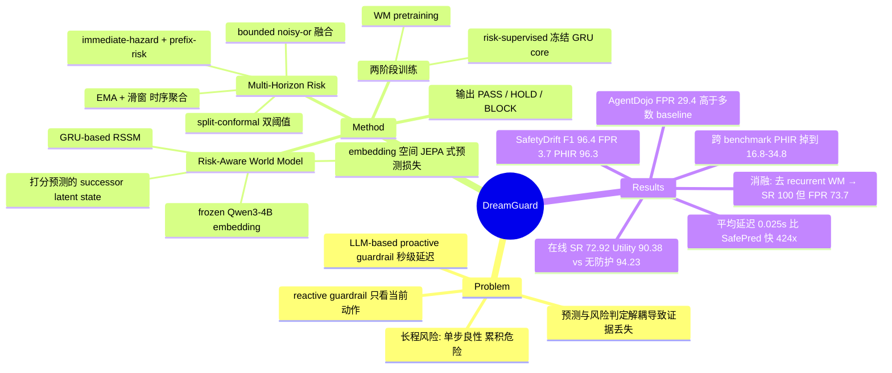

## Summary

DreamGuard 把 DreamerV3 式的 recurrent latent world model 搬进 LLM agent 的 runtime guardrail：GRU-based RSSM 在 frozen Qwen3-4B embedding 之上维护固定维度的轨迹状态，对候选动作预测 successor latent state，从中读出 immediate-hazard 与 prefix-risk 两路分数，经 noisy-or 融合与 split-conformal 标定后在执行前给出 PASS/HOLD/BLOCK。四个 agent safety benchmark 上平均端到端延迟 0.025 s/call（比 GuardAgent 快 250.6×、比 SafePred 快 424.0×），在长程风险 benchmark SafetyDrift 上 F1 96.4% / FPR 3.7% / PHIR 96.3%。但模型只在 SafetyDrift 上训练与标定、阈值零样本迁移，跨 benchmark 后 PHIR 掉到 16.8–34.8%、AgentDojo FPR 达 29.4%，"多视野风险"这一卖点主要成立于同分布内。

## Problem & Motivation

LLM agent 调用外部工具会造成不可逆的外部状态改变，因此 runtime guardrail 需要在动作执行前拦截。作者指出既有 guardrail 多是 reactive 的：只评估当前动作本身看起来安不安全，不建模风险如何沿轨迹演化。这留下长程盲区——"定位内部文件 → 移入工作区 → 创建公开分享链接"每一步单看都正常，累积起来才构成数据泄露。

已有的 proactive 方案（SafePred、TRACES、SafeMCP 等）转向轨迹上下文或 look-ahead 预测，但作者归纳出三个未解问题：(i) 用 LLM 反复处理增长的轨迹历史受 context window 与自回归推理成本约束，常达秒级延迟；(ii) "先预测未来状态、再交给独立 safety judge 判定"的解耦让风险判断依赖一个并非为风险判别而学的预测，证据可能已在预测阶段丢失；(iii) 长程证据在危害显性化之前普遍很弱，而即时危害要求在动作边界果断干预，两类信号需要标定后融合，否则不是漏报就是误报泛滥。

## Method

**问题形式化**（§3.1）：每步执行前，guardrail 接收 (任务指令 e, 轨迹前缀 H_t, 候选动作 a_t)，输出 d_t ∈ {PASS, HOLD, BLOCK}。PASS 放行，HOLD 在证据弱或反映累积风险时做保守中断，BLOCK 直接阻止。评价目标是在首个 hazard step t^haz 之前触发干预，同时压低安全轨迹上的误报。

**Risk-Aware World Model**（§3.3）。RSSM 六个组件：sequence model（GRU）h_t = f(h_{t-1}, z_{t-1}, a_{t-1})、representation model q(z_t | h_t, o_t)、dynamics predictor p(ẑ_t | h_t)、observation predictor、immediate-hazard predictor、prefix-risk predictor。关键点是**两个 risk head 读的是预测出来的 successor prior state ŝ_{t+1} = (h_{t+1}, ẑ_{t+1})，而不是当前 posterior state**——即在动作执行之前先"想象"其效果再打分。

作者刻意不做原始观测重建：prediction loss 定义在 embedding 空间，用 batch-centered 的余弦损失让 observation predictor 预测执行后观测的 embedding（JEPA 风格），理由是像素级/文本级精确重建代价高且并不直接决定动作是否安全。

**两阶段训练**。Stage 1 world model pretraining 用 L_pred + L_dyn + L_rep（后两者是带 free-bits 的对称 KL，stop-gradient 方向相反）学轨迹潜动态。Stage 2 risk-supervised training 用两个 BCE 目标塑形潜状态：immediate-hazard 用硬标签 y^haz；prefix-risk 对首个 hazard step 之前 K 步内的前驱步赋衰减软标签 exp(−(t^haz − t − 1)/ρ)。这一阶段**只解冻通往两个 risk head 的计算路径，GRU transition core 保持冻结**，作者称这样才让潜动态"risk-aware 而非仅仅预测通用下一状态"。

**Multi-Horizon Risk Estimation**（§3.4）。prefix-risk 分数对弱前驱证据敏感，先用 EMA 与滑动窗口两个统计量平滑，再与 immediate-hazard 分数一起过 bounded noisy-or 得到融合分 S_t。干预规则是两条阈值：p^haz ≥ λ_block 则 BLOCK，否则 S_t ≥ λ_hold 则 HOLD，否则 PASS。两个阈值都用 split-conformal 分位数在安全轨迹上标定——取每条安全校准轨迹的逐步最大分 M_i，排序后取第 ⌈(n+1)(1−α)⌉ 位，因此控制的是**轨迹级**误报率（一条安全轨迹只要任一步触发就算误报），λ_block 用更严的误报预算。

**实现**（Appendix C.1）：frozen Qwen3-4B-Instruct-2507 第 31 层池化成 2560 维特征；deterministic latent 1024 维，stochastic latent 32×32 factorized categorical + straight-through；prefix-risk horizon 3、decay temperature 1.5；单张 H100 训练。

**步级标注**（Appendix B.2、C.9）：四个 benchmark 大多只有轨迹级标签，作者统一转成步级格式并标注首个 hazard step。SafetyDrift 用原生步级标签，其余三个用 GPT-5.1 预标 + 两名标注者独立复核 + 分歧裁决。

## Key Results

- **主表（Table 1，轨迹级 F1/SR/FPR/Latency）**：SafetyDrift 96.4 / 96.3 / 3.7 / 0.027 s；AgentDojo 74.9 / 76.9 / 29.4 / 0.034 s；ASB 82.1 / 74.2 / 13.6 / 0.023 s；ASSE-Security 82.9 / 77.2 / 9.8 / 0.016 s。四个 benchmark 上延迟均最低，平均 0.025 s/call。
- **不是全面最优**：AgentDojo 上 F1 74.9 低于 AgentDoG-1.5 的 80.0 和 Llama-Guard-4-12B 的 78.3（DreamGuard 只赢在 SR 76.9），且 FPR 29.4% 高于该 benchmark 上除 GuardAgent 外的所有 baseline（SafePred 5.1、Llama-Guard 6.3、AgentDoG 19.6、TRACES 20.0、PolicyGuard 24.7）。
- **速度**：比 TRACES 快 3.3×、比 PolicyGuard 快 3.6×、比 GuardAgent 快 250.6×、比 SafePred 快 424.0×。
- **时序指标（Table 2，PHIR/MAS）**：SafetyDrift 96.3 / 3.63，最优；但 AgentDojo 16.8 / 0.33、ASB 17.3 / 0.27、ASSE-Security 34.8 / 0.61——ASSE 上 PHIR 低于 TRACES 的 48.4。跨分布后"提前干预"能力显著衰减。
- **在线评测（§4.4，Table 8）**：ASSE-Security 派生的 100 例子集（48 unsafe / 52 benign，按 risk_type 分层采样），GPT-5.1 function-calling agent，最多 6 步，guardrail 作为 pre-action hook。DreamGuard Safety Rate 72.92% / Utility Rate 90.38%，在受测 guardrail 中构成 Pareto 最优（TS-Guard 66.67/90.38、TRACES 56.25/90.38、PolicyGuard 50.00/80.77、SafePred 41.67/67.31）。但**无防护基线的 Utility 是 94.23%**，即 DreamGuard 仍付出约 3.85 pp 的 utility 代价，且 90.38% 与 AgentDoG-1.5 / TRACES / TS-Guard 完全持平，不是唯一最高。
- **消融（Table 3，ASSE-Security）**：去掉 recurrent WM → F1 74.7、SR 100.0、FPR 73.7；去掉 WM pretraining → F1 70.3、SR 100.0、FPR 92.0。两个"SR 100%"变体都是无差别过度拦截。去掉 hazard predictor 掉幅最大（F1 52.1、PHIR 13.0）；去掉 prefix-risk predictor F1 尚可（80.9）但 FPR 升到 24.9、PHIR 掉到 25.8；去掉 risk-supervised training 则 FPR 低至 2.4% 但 SR 只剩 64.1、PHIR 9.8，退化为过度保守。
- **标注可靠性（Table 10）**：非原生步级标签的三个 benchmark 上，首 hazard step 精确一致率 79.6%（ASSE-Security）～88.1%（AgentDojo），within-1 步一致率 89.6%～95.1%，裁决改动比例 4.8%～8.9%。
- **稳定性（Appendix D）**：三个随机种子重复，主表指标标准差均 ≤0.7；与各 benchmark 上最强非 DreamGuard baseline 的配对 Wilcoxon 检验 p < 0.05 或 p < 0.01。

## Evidence Ledger

| Claim ID | Claim | Type | Source locator | Evidence excerpt | Status |
|:--|:--|:--|:--|:--|:--|
| C1 | SafetyDrift 上 F1 96.4 / SR 96.3 / FPR 3.7，F1 与 FPR 为受测 guardrail 最优 | number | Table 1; Sec 4.2 | "DreamGuard achieves the best F1 of 96.4% and the highest SR of 96.3%, while reducing FPR to 3.7%" | source-verified |
| C2 | 平均端到端延迟 0.025 s/call，四个 benchmark 上均为最低 | number | Abstract; Sec 4.2; Table 1 | "DreamGuard is the most low-latency guardrail in Table 1, with an average end-to-end latency of 0.025 s per call" | source-verified |
| C3 | 比 TRACES 快 3.3×、比 GuardAgent 快 250.6×、比 SafePred 快 424.0× | comparison | Sec 4.2 | "it is 3.3× faster than TRACES ... 250.6× faster than GuardAgent and 424.0× faster than SafePred" | source-verified |
| C4 | SafetyDrift 上 PHIR 96.3%、MAS 3.63，即 96.3% 的不安全轨迹中干预严格早于首个 hazard step | number | Table 2; Sec 4.3; Appendix A.2 | "On SafetyDrift, DreamGuard achieves the highest PHIR (96.3%) and MAS (3.63)" | source-verified |
| C5 | 其余三个 benchmark 上 PHIR 大幅下降：AgentDojo 16.8、ASB 17.3、ASSE-Security 34.8 | number | Table 2 | "DreamGuard 96.3 / 3.63 ... 16.8 / 0.33 ... 17.3 / 0.27 ... 34.8 / 0.61" | source-verified |
| C6 | FPR 并非一致偏低：AgentDojo 29.4、ASB 13.6，且 AgentDojo 上多个 baseline FPR 更低 | number | Table 1 | "DreamGuard 96.4 96.3 3.7 0.027 74.9 76.9 29.4 0.034 82.1 74.2 13.6 0.023" | source-verified |
| C7 | 运行时输出是 {PASS, HOLD, BLOCK} 三值阈值判决；全文未描述向 agent 输出理由/证据链或供 agent 查询与修正的接口 | causal-mechanism | Sec 3.1 Eq.2; Sec 3.4 Eq.14; Algorithm 1 | "d_{i,t}=G(x_{i,t}) ∈ {PASS,HOLD,BLOCK}"；Algorithm 1 输出为 "Decision log D" of (t,d_t) | source-verified |
| C8 | world model 是学出来的：RSSM + GRU transition，建于 frozen Qwen3-4B-Instruct-2507 第 31 层 2560 维特征之上，两阶段训练，单卡 H100 | causal-mechanism | Sec 3.3; Sec 4.1; Appendix C.1 Table 4 | "frozen Qwen3-4B-Instruct-2507 representations from layer 31, pooled into 2560-dimensional features ... RSSM with a GRU transition" | source-verified |
| C9 | 风险打分作用于执行前预测的 successor latent state；"w/o successor prediction" 变体 F1 从 82.9 降到 76.3、FPR 从 9.8 升到 25.4 | causal-mechanism | Sec 3.3/3.4; Table 3; Table 5 | "Removing successor-state prediction also degrades F1 and increases FPR" | source-verified |
| C10 | 仅在 SafetyDrift 上训练与标定，决策阈值零样本迁移到另外三个 benchmark | benchmark-setting | Sec 4.1; Sec 5 | "DreamGuard is currently calibrated exclusively on SafetyDrift and transfers its decision thresholds zero-shot to other benchmarks" | source-verified |
| C11 | 在线评测 Safety Rate 72.92% / Utility Rate 90.38%，为受测 guardrail 中最优权衡；设置为 ASSE-Security 派生 100 例（48 unsafe / 52 benign）、GPT-5.1 agent、最多 6 步 | number | Sec 4.4; Appendix C.5; Table 7 | "highest Safety Rate (72.92%) while maintaining high Utility Rate (90.38%)"；"Sample size: 100 cases ... Agent: GPT-5.1 ... Max online steps: 6" | source-verified |
| C12 | 无防护基线 Utility 94.23%，高于 DreamGuard 的 90.38%；90.38% 与 AgentDoG-1.5 / TRACES / TS-Guard 持平 | comparison | Appendix C.5 Table 8; Appendix D Table 13 | "w/o defense 18.75 94.23 ... TRACES 56.25 90.38 TS-Guard 66.67 90.38 DreamGuard 72.92 90.38" | source-verified |
| C13 | "w/o recurrent WM" SR 100.0 / FPR 73.7，"w/o WM pretraining" SR 100.0 / FPR 92.0 | number | Table 3; Sec 4.5 | "w/o recurrent WM 74.7 100.0 73.7 61.7 1.16 ... w/o WM pretraining 70.3 100.0 92.0 63.0 1.18" | source-verified |
| C14 | 三个 benchmark 的步级 hazard 标签由作者用 GPT-5.1 预标 + 两名标注者独立复核生成，精确步一致率 79.6%–88.1% | benchmark-setting | Appendix B.2; Appendix C.9 Table 10 | "we use GPT-5.1 for initial prelabeling, followed by independent review by two human annotators"；"exact-step agreement ranges from 79.6% to 88.1%" | source-verified |
| C15 | 论文自陈局限：只在执行前干预，不生成安全替代动作 | causal-mechanism | Sec 5 | "DreamGuard focuses on intervention before action execution rather than generating safe replacement actions" | source-verified |
| C16 | 未公开 DreamGuard 自身代码仓库 URL，文中 GitHub 链接均属第三方 benchmark | license-code | Appendix B.1; Appendix C.6; arXiv abs | "Exact prompt text is provided with the code and data package accompanying this submission"（无 URL） | source-verified |

## Strengths & Weaknesses

**Strengths**

把 guardrail 从"LLM 反复读整条轨迹"换成"固定维度 recurrent state + 轻量 head"，这是本文最扎实的部分。25 ms 是真正把 pre-action check 放进实时执行循环的量级，而 SafePred 的 7.7–19.4 s、GuardAgent 的 5.3–7.0 s 在生产 agent 里基本无法逐步调用。这个论证不靠新概念，靠架构选择本身，属于 simple 且可 scale 的方向。

Risk-supervised 阶段冻结 GRU core、只解冻通往 risk head 的路径，是个有品味的设计：既让安全监督塑形潜表示，又不让分类信号把动态模型带塌。相应的消融也做了——"w/o successor prediction"（保留 recurrent state 但改打分当前状态）正好是 [[2607-SeerGuard]] 缺失的那个关键对照，DreamGuard 补上了，且结果支持"预测后状态比打分当前状态更可靠"（FPR 9.8 → 25.4）。

Prefix-risk 的软衰减标签是个务实的构造：把"距离首个 hazard step 还有几步"编码成 exp 衰减目标，等于给弱前驱证据一个可学的连续监督，而不是硬要模型从二值标签里自己发现累积结构。

误报侧的报告比同类工作诚实。FPR 是轨迹级定义（安全轨迹任一步触发即算误报），split-conformal 标定也直接对齐这个定义；在线实验还单独报了 benign 例上的 Utility Rate。Appendix C.9 的标注一致性审计（含 Cohen's κ 和裁决改动比例）在 agent safety 论文里少见。

**Weaknesses**

**"多视野风险"的主 claim 只在同分布内成立。** 模型训练、阈值标定全在 SafetyDrift，而 SafetyDrift 恰是唯一的长程风险 benchmark。跨到另外三个即时危害 benchmark 后，PHIR 从 96.3% 掉到 16.8–34.8%，MAS 从 3.63 掉到 0.27–0.61——0.27 步的"提前量"实质等于卡在动作边界拦截，与 reactive guardrail 无法区分。作者把这写成"stringent evaluation of transfer robustness"，但更准确的读法是：prefix-risk 通道所依赖的累积模式没有迁移出去。想验证"risk-aware latent dynamics 能捕捉一般的风险累积"，至少需要第二个长程 benchmark 上的 leave-one-out。

**世界模型的"世界"极其稀薄。** observation predictor 只在训练期用于一个 embedding 空间的余弦辅助损失，推理期完全不产出可读的后状态。所以这个 world model 既不预测环境会变成什么样，也不产出任何可被人或 agent 检查的中间物——它本质是一个带时序归纳偏置的风险分类器，"world model"更多是架构血统而非功能事实。这也让作者自己提出的挑战 (ii)（"预测应保留风险证据"）的解法变成了同义反复：把预测直接用风险标签监督，当然就保留了风险证据，代价是这个预测不再有独立于标签的语义。

**在线实验的 Pareto claim 需要按脚注读。** 72.92 / 90.38 确实在受测 guardrail 中支配 TS-Guard 和 TRACES，但样本只有 100 例（48 unsafe / 52 benign），48 例上的 72.92% 意味着约 35 例拦截成功——±2.08 的标准差正好是一例的粒度。更值得注意的是无防护基线 utility 94.23%：DreamGuard 换到 54 pp 安全率的同时付出约 4 pp utility，这个数字只出现在附录表里，主文 Figure 2 的 frontier 叙述没有把它作为参照线。

**两个"SR 100%"消融变体暴露了指标的脆弱性。** 去掉 recurrent WM 得到 SR 100.0 / FPR 73.7，去掉 WM pretraining 得到 SR 100.0 / FPR 92.0，且这两个变体的 PHIR（61.7 / 63.0）反而**高于**完整模型（34.8）。也就是说 PHIR 和 SR 都可以靠"早拦、多拦"刷上去，只有联合 FPR 才有意义。论文正确地指出了这点，但也说明单看 SR/PHIR 的跨方法比较（包括主表里 DreamGuard 自己的 SR 优势）需要同时读 FPR 列。

**步级标签是本文自己造的。** 四个 benchmark 里三个的首 hazard step 由 GPT-5.1 预标 + 人工复核产生，精确一致率最低到 79.6%（ASSE-Security）。PHIR 和 MAS 直接定义在这个边界上，而 ASSE-Security 恰好也是消融和在线实验的主场。作者做了一致性审计值得肯定，但 20% 的边界分歧对"提前 0.61 步"这种量级的结论是有实质影响的。

## Mind Map

## Notes

### 与 Agent-Facing Environment Runtime 的对偶关系

本 vault 的 primary direction 已确立一条约束：verify affordance 应当是 post-execution 的取证信道，而不是成功/失败标签。DreamGuard 正好落在完全对偶的位置上——pre-execution 预测 + 标签输出——因此值得逐条对照。

**(a) 执行前预测，world model 是学出来的。** DreamGuard 严格在动作执行前判决：sequence model 先"想象"动作效果得到 h_{t+1}，dynamics predictor 给出 successor prior ẑ_{t+1}，两个 risk head 读的是这个预测态而非当前态（§3.3、Algorithm 1 Phase 1–3）。world model 完全是学出来的：GRU-based RSSM 建在 frozen Qwen3-4B-Instruct-2507 第 31 层 2560 维特征上，先 world-model pretraining 再 risk-supervised training，没有任何规则库或检索组件。

但要注意"学出来的 world model"在这里的实际形态：观测预测只在训练期作为 embedding 空间的余弦辅助损失存在，推理期不产出任何可读的后状态。所以它预测的不是"环境会变成什么"，而是"一个被风险标签塑形过的潜向量"。这与我们方向上"取证信道读的是真实执行后的文件/配置/系统状态"是两种完全不同的证据来源：一边是学出来的先验，一边是环境的事实。前者的精度天花板由训练分布决定，而 Table 2 的跨 benchmark PHIR 崩塌（96.3 → 16.8）正是这个天花板的实测值。

**(b) 判决是纯标签，agent 无法追问也无法据此修正。** 输出空间就是 {PASS, HOLD, BLOCK}（§3.1 Eq.2），由两个标量分数过阈值产生（§3.4 Eq.14），Algorithm 1 的返回值是 (t, d_t) 的 decision log。全文没有任何机制向 agent 返回理由、证据定位或被触发的风险类别，也没有"为什么被拦"的查询接口。§5 自陈"focuses on intervention before action execution rather than generating safe replacement actions"，等于确认了闭环缺失——agent 被拦下之后拿不到任何可用于修正的信息。

这里有一个结构性原因，值得记进方向笔记：**pre-execution 的判决在原理上就难以给出取证式证据**。它的全部依据是一个 32×32 categorical 潜变量加 1024 维 deterministic state，这些量对 agent 和人都不可读；不像 post-execution 取证信道可以直接回答"文件权限现在是 0644""这个 key 已经出现在响应体里"。DreamGuard 的证据不可解释不是工程疏忽，是把风险判断放在执行前、且用潜表示承载证据的必然结果。对照 [[2607-SeerGuard]]：它的 instruction-level 筛查会输出 rationale，action-level 判定基于文本语义的 next-state 描述，可读性反而更好——代价是每步都要跑 8B VLM。这构成一个清楚的权衡曲面：延迟、证据可读性、跨分布鲁棒性三者当前不可兼得。

对我们的设计有两点直接启示：其一，若 AFE 的 verify affordance 也退化成返回一个 verdict，就会掉进同一个坑，agent 拿到 verdict 后除了重试无事可做；其二，DreamGuard 的 HOLD 语义（"证据弱或反映累积风险时的保守中断"）其实已经在呼唤一个证据接口——HOLD 之后系统需要有人或有机制去查明到底怎么了，而论文把这一步留空了。

**(c) 误报代价有报，但报得不完整。** 这一条 DreamGuard 做得比同类工作好：FPR 是四个 benchmark 的一等指标（轨迹级定义：安全轨迹任一步触发即算误报），split-conformal 阈值标定直接以安全轨迹误报率 α 为预算，在线实验还单独报了 52 个 benign 例上的 Utility Rate 90.38%。作者也主动指出 "w/o recurrent WM" 的 SR 100.0 是靠 FPR 73.7 换来的。

不完整之处有三。第一，离线 FPR 只测"是否触发干预"，不测"触发之后任务是否因此失败"——真正的代价是任务失败率上升，只有在线的 Utility Rate 部分捕捉到。第二，无防护基线的 Utility 94.23% 只出现在 Appendix C.5 Table 8，主文 §4.4 的 frontier 叙述没有把这条参照线画进讨论；实际代价是 −3.85 pp，且 90.38% 与 AgentDoG-1.5、TRACES、TS-Guard 三家完全持平，DreamGuard 赢的是同等 utility 下的 safety，而非帕累托意义上的双赢。第三，AgentDojo 上 29.4% 的 FPR 在正文里被"identify immediate hazards while avoiding excessive false alerts"一句带过，但该 benchmark 上 SafePred（5.1）、Llama-Guard（6.3）、AgentDoG-1.5（19.6）、TRACES（20.0）、PolicyGuard（24.7）的 FPR 都更低。

结论：DreamGuard 是"报了 false-positive 代价"的正面样本，但它的 utility 侧证据只来自一个 100 例子集，无法支撑"拦截不损害任务"这种强度的断言。**如果 AFE-MiniSuite 要做 budget-matched 对照，DreamGuard 的报告口径（轨迹级 FPR + 独立 benign 集上的 Utility Rate + 无防护参照线）值得直接借用，但参照线必须画进主文而不是附录。**

### 其他

- **PolicyGuard 在这里是被打败的 baseline**，值得与 [[2606-PolicyGuard]] 的笔记对读：PolicyGuard 在 ASSE-Security 上 F1 79.1 / SR 85.1（SR 高于 DreamGuard 的 77.2）但 FPR 32.5，在 SafetyDrift 上则只有 F1 26.4。两篇笔记合起来说明当前 runtime verifier 的能力高度分布依赖，没有一个方法在长程与即时两类风险上同时稳。这对 agenda 里"judge/RM precision 普遍 70–85%"那条 insight 是新的支持证据。
- **与 [[2411-WebDreamer]] 的谱系关系**：WebDreamer 用 LLM 当 world model 做 look-ahead 规划以提升任务成功率，DreamGuard 把同一 look-ahead 结构调转目标去做安全拦截，并把 LLM 换成轻量 RSSM。同一机制在"提能力"和"防风险"两个方向上的分叉，值得在 WorldModel domain map 里记一笔。
- **与 [[2606-CodeSelfReviewCollapse]] 的连接**：DreamGuard 的步级 hazard 标签有三个 benchmark 靠 GPT-5.1 预标（人工复核后精确一致率 79.6%–88.1%），而在线评测的 agent 也是 GPT-5.1、judge 同样是 LLM。标注器、被评测 agent、judge 同源，属于 CodeSelfReviewCollapse 警示的那类自评闭环风险。论文的人工复核缓解了标注侧，但 judge 侧没有同等审计。
- **与 [[2608-LongHorizonHarness]] / [[2605-TeamBench]] 的对照**：DreamGuard 的长程能力只在 SafetyDrift 一个 benchmark 上验证，而 harness 系列反复显示长程可靠性问题在不同任务族上形态差异极大。把 prefix-risk 机制放到 harness 类长程环境里测一次，是个便宜且有信息量的后续。
- **repo**：论文未给出 DreamGuard 自身的公开代码 URL，Appendix C.6 只说随投稿附带 code and data package。因此无法做 repo-digest；若后续放出仓库，RSSM 的 head adapter 设计与 split-conformal 标定实现值得看。
- **可延伸的问题**：prefix-risk 的软衰减标签需要 ground-truth 的首个 hazard step，这在真实部署里恰恰是拿不到的。论文靠 benchmark 的事后标注绕过了这一点，但一个不依赖 hazard-step 标注、改从执行后的取证证据反向蒸馏 prefix-risk 监督的方案，正好把本文的 pre-execution 判决和我们方向的 post-execution 取证信道接上——取证信道提供的是**真实**的后果证据，而它恰恰可以当作 world model 的监督源。这可能比"再造一个 guardrail"更有意思。
