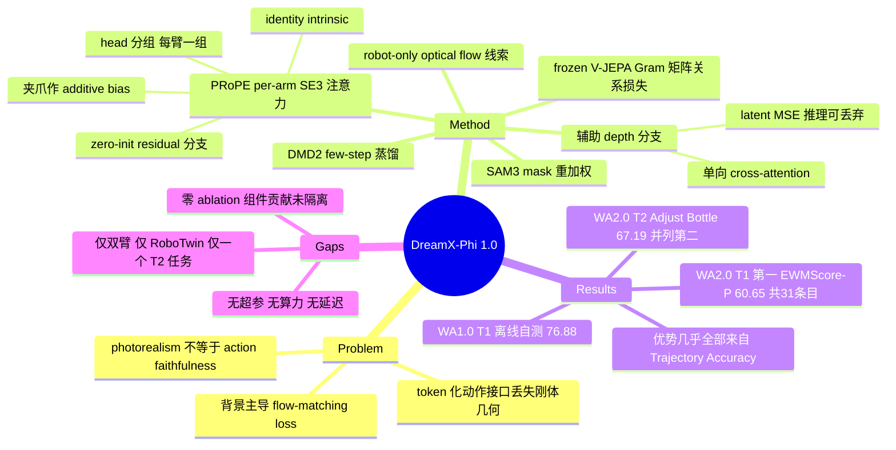

## Summary

DreamX-Phi 1.0 是一个 forward dynamics model 形态的 action-conditioned video world model：在 Wan2.2-TI2V-5B 上把每条手臂的 SE(3) 相对变换按 attention head 分组注入（PRoPE 式几何编码），再用辅助 depth 分支、SAM3 mask 重加权与 frozen V-JEPA 的 Gram 矩阵关系损失约束场景几何与被操作物体，最后用 DMD2 蒸馏出 few-step student。在 2026-08-12 的 WorldArena 2.0 leaderboard 快照上，31 个 Track 1 条目中排第一（EWMScore-P 60.65），Track 2 的 Adjust Bottle 成功率 67.19% 并列第二。论文明确自陈没有 matched ablation，五个组件（PRoPE / depth / SAM3 / V-JEPA / DMD）各自的贡献一个都未被隔离。

## Problem & Motivation

论文的问题陈述很干净：**photorealism ≠ action faithfulness**。一段视觉上令人信服的 rollout 仍然可能动错手臂、抓空目标、或把 grasp 和 release 弄反。给定固定初始观测，不同的 prescribed trajectory 应当诱导出对应的机器人运动与物体交互，同时保持 action-irrelevant 的场景内容不变——现有方法缺的正是这种敏感性。

作者把病因归到**动作条件接口的表示形式**上：主流做法（IRASim、Vid2World、HMA）把动作压成低维 token 或 feature-wise modulation 注入，这类接口灵活但把 end-effector 轨迹内部的刚体几何关系留给模型隐式推断，也不指示"这段运动应该出现在图像的哪里"。另一类做法（OSCAR 渲染 kinematic skeleton、Robot-Factored WM 渲染机器人几何、FlowWAM 用 optical flow）把动作转成图像对齐的条件，能定位运动但不直接保留每条手臂连续的刚体轨迹。论文的判断是这两类各占一半，应当**同时提供**：结构化轨迹编码"how the robot moves in 3D"，稠密运动线索编码"where that motion appears in the image"。

第二层动机是：正确的手臂运动本身不保证 rollout 忠实——场景几何和被操作物体的状态演化同样需要监督。因为 flow-matching 目标在所有 future token 上取平均，而机械臂与被操作物体在画面里往往只占很小比例，静态背景会淹没决定交互是否物理合理的 contact-local 误差。

## Method

**基座**：Wan2.2-TI2V-5B video diffusion transformer，第一帧 latent 提供视觉上下文，未来帧 latent 在 flow-matching 目标下学习。条件为 (观测帧, 语言指令, 双臂末端位姿+夹爪状态序列)。

**PRoPE 控制（核心接口）**。PRoPE 原本用于相机相对位姿；这里作者明确说"end effector 不被当作物理相机"，只复用它的 group-action attention 机制。三处适配：

1. **共同坐标系**：帧 t 的第 k 臂由位置、四元数（转 SO(3)）、夹爪标量描述，先构造末端执行器坐标系，再统一表达为相对于**第 1 臂初始位姿**的变换；平移用单一 motion-amplitude 因子归一化（论文的理由是：用运动幅度而非绝对工作空间尺度归一，可以避免两臂间静止距离主导 scale）。
2. **per-arm 持久表示**：把 attention head 划成固定连续组 {H_k}，每条手臂一组。采用 identity intrinsic K=I₃，PRoPE 投影矩阵退化为 P=A（即纯 SE(3) 相对变换），token 变换为 Q'=Dᵀ Q、K'=D⁻¹K、V'=D⁻¹V、O=D·Attn(...)，其中 D=I_{d_h/4}⊗A。同帧同臂的所有 patch 共享 D，因此一对 token 通过**相对运动**耦合而非绝对坐标系。
3. **夹爪单独注入**：夹爪开度是标量，无法作为 SE(3) 元素，在逆几何映射之后作为该组 head 的 per-arm additive bias 注入。

整个分支是与预训练 self-attention 并行的 residual 分支，夹爪 adapter 与输出投影均 **zero-init**，训练初期保持静默。另有一路 action-derived 的 robot-only optical-flow 线索提供图像平面的运动条件（论文将其与 PRoPE 并列为"互补的几何 / 图像平面动作条件"）。

**辅助 depth 分支（3D 一致性）**。借鉴 X-WAM 的 depth adaptation：把单通道 depth map 复制成 pseudo-RGB，用**同一个 frozen video VAE** 编码得到 latent depth 目标（depth 来自 Depth Anything 3，仅在 Figure 2 caption 中注明）。复制 RGB transformer 的末尾若干 block 构成辅助分支（各 block 从对应 RGB block 初始化），每层通过 cross-attention 让 depth 通路读取 RGB 表示。**连接是单向的**：depth 读 RGB，RGB 永不读 depth——因此 RGB 前向计算不变，depth 预测在推理时可丢弃。监督为 latent-space MSE，而非另起一条带噪 diffusion 序列。

**物体中心的物理一致性**。两个互补信号：

- **SAM3 mask 重加权**：离线跑 SAM3 得到被操作物体的二值 mask 视频，投影到 latent grid 后给 token 加权 w̃=1+(λ_m−1)m，再按均值归一化（稳定 loss scale，无有效 mask 的片段退化为均匀权重）。**mask 只用于训练监督**，SAM3 不联合微调，推理不需要 mask。
- **V-JEPA 关系对齐**：frozen V-JEPA teacher，按时间分层采样 masked teacher token（有上限），把 video model hidden token 插值到相同坐标。关键设计是**对齐 Gram 矩阵而非直接匹配特征坐标**，理由是不把 student 绑死在 teacher 的特征基上。带双门控：mask token 数 ≥ M_min 且 flow-matching 噪声 σ ≤ σ_max 的样本才计入，否则贡献零；训练初期只更新 projector（梯度在 video-model hidden state 处截断），之后线性放开。

**Few-step 后训练**：按 DMD2 蒸馏，条件 y 除文本外还含观测帧与时间对齐的双臂动作轨迹；student、frozen teacher、online fake-score denoiser 共享同一 y，对抗分类头作用在 denoiser 的 bottleneck 特征上。目标为 L_DMD + λ_adv·L_adv^G，配 noised non-saturating GAN 项。student 训练与推理用同一固定 N 步 schedule，backward simulation 下只对采样步回传梯度。

> **未报告的部分**：全文没有给出任何数值超参（λ_m、λ_adv、M_min、σ_max、复制的 block 数、蒸馏步数 N 全部保持符号形式），也没有训练算力、分辨率、帧数、推理延迟或 NFE。

## Key Results

**WorldArena 2.0 Track 1**（1,000 episode，2026-08-12 快照 commit cb8f9c2；EWMScore-P = 15 项归一化分量的算术平均，0–100 分制）：

| Model | EWMScore-P | Trajectory Acc | Image Quality | Semantic Align |
|:--|--:|--:|--:|--:|
| DreamX-Phi-1.0-FDM-0730 | **60.65**（31 条目中第 1） | **57.15** | 63.25 | 90.53 |
| Alpha-World | 60.13 | 49.22 | **64.59** | 91.84 |
| FlowWAM-FiveAges | 59.72 | 49.76 | 64.31 | **92.06** |
| Ctrl-World | 56.24 | 45.24 | 53.78 | 88.45 |
| WoW / GigaWorld-0 / Vidar / IRASim | 52.10 / 48.06 / 47.13 / 44.97 | 21.39 / 15.24 / 16.99 / 22.68 | — | — |

**WorldArena 2.0 Track 2**（策略在提交的 world model 内用组织方提供的初始化 π₀.₅ 与固定 reward model 优化，再在 RoboTwin 2.0 held-out Adjust Bottle episode 上评测）：WOVR-PLUS 68.75 > **DreamX-Phi 67.19 = Lute 67.19**（并列第 2）> CtrlWorld 62.50 > IRASim 61.33 > RoboScape 60.74 > OpenSora 60.16 > Cosmos-Predict-2.5 (action) 59.38 > iVideoGPT 56.25。

**WorldArena 1.0 Track 1**（Clean-50 协议：50 任务 × 10 held-out episode）：DreamX-Phi **离线自测** EWMScore-P 76.88，对比 2026-07-15 快照的官方榜首 UNIS 73.64（+3.24）、SisyphusWorld 73.06、BWM-Fast 72.71。分量上 DreamX-Phi 的 Dynamic Degree 88.71 / Flow Score 100.00 / Trajectory Accuracy 58.98 大幅领先，但 Interaction Quality 77.90 < UNIS 87.30、Instruction Following 84.92 < 93.86、Perspectivity 96.30 < 98.84、Motion Smoothness 92.22 < 95.51。

**训练语料**（Table 1）：Ego4D 3,700 h（action-free egocentric）、AgiBot World 2026 1,900 h、InternData-A1 78 h real + 3,747 h simulated、Cosmos3-DROID 350 h、RoboCOIN 618 h、RoboTwin 2.0 25,000 条带动作标注 clip。清洗时删除以移动底盘、灵巧手为主或静止的轨迹（过滤后 AgiBot 模仿学习分片剩 178.7 h），**刻意保留失败执行**。RoboTwin 视频先用自研 DreamX-Refiner 超分后才进入 action-conditioned 微调池。

**论文自陈的局限**：评测仅限 WorldArena/RoboTwin，Track 2 只覆盖 Adjust Bottle 一个任务，对其他任务/本体/真机的泛化未验证；leaderboard 分数评的是整系统，不隔离单个组件的贡献；模型从外部给定动作预测视频，不生成动作，也未作为闭环控制器评测。

## Evidence Ledger

| Claim ID | Claim | Type | Source locator | Evidence excerpt | Status |
|:--|:--|:--|:--|:--|:--|
| C1 | WA2.0 Track 1 于 cb8f9c2 / 2026-08-12 快照上 31 个条目中排第 1，EWMScore-P 60.65 | number+sota | Sec 5.3 段落 + 脚注 1 | "On the complete 31-entry Track 1 leaderboard, our entry ranks first with an EWMScore-P of 60.65." | source-verified |
| C2 | WA2.0 Track 2 Adjust Bottle 67.19%，与 Lute 并列第 2，WOVR-PLUS 68.75 居首 | number+comparison | Sec 5.3, Table 3 及其后段 | "ties for second place in the full snapshot" | source-verified |
| C3 | WA1.0 的 76.88 是**离线自测**、非该快照 leaderboard 条目；榜首 UNIS 73.64，边际 3.24 | benchmark-setting | Sec 5.4 + 脚注 3–4, Table 4(b) | "was evaluated offline ... and is not an entry in this pinned leaderboard snapshot" | source-verified |
| C4 | 脚注承认按四位小数重算 15 项均值得 76.89，论文仍沿用自报的 76.88 | number | 脚注 4 | "Averaging the 15 component values ... yields 76.89 after rounding; we reproduce the reported aggregate" | source-verified |
| C5 | 全文无任何 ablation；leaderboard 分数评整系统、不隔离组件 | causal-mechanism | Sec 6 Limitations；Sec 7 | "The leaderboard scores evaluate the full system and therefore do not isolate the contribution of individual components." | source-verified |
| C6 | Track 2 只覆盖 Adjust Bottle；策略用组织方初始化 + 固定 reward model 在提交的 WM 内优化 | benchmark-setting | Sec 5.1 末段；Sec 6 | "The submitted world model serves as the rollout environment for optimizing a policy using an organizer-provided initialization and a fixed reward model." | source-verified |
| C7 | 基座为 Wan2.2-TI2V-5B，未来帧 latent 用 flow-matching 目标 | number | Sec 4.1, Eq.(1) 下文 | "using a Wan2.2-TI2V-5B video diffusion transformer ... learned under a flow-matching objective" | source-verified |
| C8 | PRoPE 按 attention head 分固定连续组（每臂一组），identity intrinsic；夹爪标量不能作 SE(3) 元素故另作 per-arm bias 注入；adapter 与输出投影 zero-init | causal-mechanism | Sec 4.2 Geometric Attention / Gripper and Residual, Eq.(4)(5) | "We partition the attention heads into fixed contiguous groups, with one group assigned to each arm." | source-verified |
| C9 | depth 分支单向（depth 读 RGB，RGB 不读 depth），推理时可选；latent MSE 对 frozen VAE 编码的 depth 目标监督 | causal-mechanism | Sec 4.3, Eq.(6)(7)；Fig.2 caption（DA3 来源） | "the depth branch can consume RGB features, but the RGB branch never consumes depth features" | source-verified |
| C10 | SAM3 mask 仅训练期重加权（不联合微调、推理不需要）；frozen V-JEPA 用 **Gram 矩阵**关系对齐而非直接特征匹配，且带双门控 | causal-mechanism | Sec 4.4, Eq.(8)(9)(10) | "Rather than matching feature coordinates directly, we align their Gram matrices" | source-verified |
| C11 | 语料规模：Ego4D 3,700h / AgiBot 1,900h / InternData-A1 78h real + 3,747h sim / Cosmos3-DROID 350h / RoboCOIN 618h / RoboTwin 25,000 clips；过滤后 AgiBot IL 分片 178.7h | number | Sec 3, Table 1 + Curation 段 | "the filtered AgiBot imitation-learning split contains 178.7 hours" | source-verified |
| C12 | RoboTwin 训练视频经自研 DreamX-Refiner 超分；WorldArena 评测集同样由组织方从 RoboTwin 2.0 轨迹 curate | benchmark-setting | Sec 3 Action-Conditioned Fine-Tuning；Sec 5.1 首句 | "we apply our video refinement model, DreamX-Refiner, to super-resolve the RoboTwin videos" | source-verified |
| C13 | WA2.0 Track 1 分量优势不均匀：Image Quality 63.25 与 Aesthetic 43.38 低于 Alpha-World / FlowWAM，Semantic Alignment 90.53 低于两者，Depth Accuracy 98.55 低于 FlowWAM 98.99；明确领先项是 Trajectory Accuracy 57.15 vs 49.22 / 49.76 | comparison | Sec 5.3, Table 2(a)(b) | Instruction Following 列："DreamX-Phi 61.62 \| Alpha-World 60.58 \| FlowWAM 58.06" | source-verified（已修正） |
| C14 | 代码/权重为**条件性发布**：明言在 WorldArena 2.0 IROS Challenge 结束后才公开 | license-code | 脚注 1（首页）+ 标题块 GitHub 链接 | "Model weights and inference code will be made publicly available after the WorldArena 2.0 IROS Challenge concludes." | source-verified |
| C15 | WA2.0 Track 1 含 1,000 episode；WA1.0 Track 1 用 Clean-50 协议（50 任务 × 10 held-out episode） | benchmark-setting | Sec 5.1 前两段 | "WorldArena 2.0 Track 1 contains 1,000 episodes." | source-verified |
| C16 | checkpoint 名 DreamX-Phi-1.0-FDM-0730；官方 Track 1 / Track 2 提交标识分别为 JF_World 与 DreamX-Phi | benchmark-setting | Sec 5.3 + 脚注 2 | "the corresponding submission identifiers as JF_World and DreamX-Phi, respectively" | source-verified |
| C17 | 清洗刻意保留失败执行，删除移动底盘 / 灵巧手 / 静止主导的轨迹 | number | Sec 3 Curation and Normalization | "deliberately retaining failed task executions because they expose informative failure modes" | source-verified |
| C18 | WA1.0 分量同样不均匀：UNIS 在 Interaction Quality（87.30 vs 77.90）、Perspectivity（98.84 vs 96.30）、Instruction Following（93.86 vs 84.92）上更优；DreamX-Phi 优势集中在 Dynamic Degree 88.71 / Flow Score 100.00 / Trajectory Accuracy 58.98 | comparison | Sec 5.4, Table 4(a)(b) | UNIS "87.30 / 98.84 / 93.86" vs DreamX-Phi "77.90 / 96.30 / 84.92" | source-verified |
| C19 | WA2.0 对 Dynamic Degree / Flow Score / Motion Smoothness 按 ground-truth 封顶后再聚合——**因此 76.88(WA1.0) 与 60.65(WA2.0) 不同尺度、不可比** | benchmark-setting | Sec 5.2 Metrics | "WorldArena 2.0 additionally caps Dynamic Degree, Flow Score, and Motion Smoothness by their ground-truth reference values before aggregation." | unsupported（仅前半句 source-verified；"WA1.0 未封顶"与"两分不可比"是本笔记的推断，论文未作此陈述，见下） |
| C20 | 论文不主张 PRoPE 本身的 novelty，明确归功于 Li et al. 2025a / Miyato et al. 2024；自述贡献是几何感知动作表示 + manipulation-aware 监督 | sota-novelty | Sec 2；Sec 4.2 开头；Sec 1 contributions | "Our use of PRoPE differs from its original camera setting... we reuse only the group-action attention mechanism" | source-verified |

**Verifier 修正记录**：C13 初稿把 Instruction Following 也列为落后项，verifier 定位 Table 2(b) 后指出 DreamX-Phi 的 61.62 实为三者最高，落后的是 Semantic Alignment（90.53）——已按原文更正。C19 的"不可比"结论被判为读者推断而非原文陈述，已在正文中显式标注为推导。

**代码库状态（verifier 于 2026-08-18 经 GitHub API 核查）**：`AMAP-ML/DreamX-Phi` 仓库建于 2026-08-13、最后 push 2026-08-14，仓库体积 4 KB，只含 `.gitignore`、`LICENSE`（MIT）、`README.md`，**无代码、无权重、零 release**，README 逐字重复了条件性发布的句子。因此本笔记不把它列为 repo-digest 候选。

## Strengths & Weaknesses

**真正有信息量的设计**

把 PRoPE 从"相机相对位姿"迁移到"末端执行器轨迹"是这篇报告最干净的一步，而且作者把适配的代价说清楚了：必须统一坐标系、必须给每条手臂留持久的注意力容量、夹爪标量必须旁路注入。这三条不是包装，是把"相机 ≠ 末端执行器"这个不匹配拆解成了可执行的工程约束。zero-init residual 分支与单向 depth cross-attention 属于同一类纪律——**辅助监督不得污染主推理通路**，代价只在训练期。V-JEPA 用 Gram 矩阵而非直接特征匹配也有明确理由（不把 student 绑在 teacher 的特征基上）。

**"第一名"到底说明了什么——本笔记的分解推导**

论文自报领先第 2 名 Alpha-World 0.52 分。我按 Table 2 的 15 项逐项相减（输入值已由 C13/C18 核对）：15 项差值之和为 7.79，除以 15 得 0.519，与论文自报的 0.52 一致（复算即可自校验）。其中 **Trajectory Accuracy 一项就贡献 +7.93/15 = +0.53**，其余 14 项差值合计 **−0.14**，即净负。

结论很清楚：**这个第一名完全由轨迹忠实度撑起，在其余 14 项视频质量指标上 DreamX-Phi 合起来还略微落后于 Alpha-World**。这与论文的核心主张（realism ≠ faithfulness）高度自洽，甚至是对它最有力的实证——但论文自己没有把这层拆出来写，反而以"strong system-level performance in video prediction"作结，比证据允许的更宽。

同样的分解用在 WA1.0：3.24 分的领先中，Dynamic Degree（+15.01）与 Flow Score（+13.98）两项合计贡献 1.93 分，约 60%；再加 Trajectory Accuracy（+17.09）达 3.07 分，即 95%。而 WA2.0 恰恰对 Dynamic Degree、Flow Score、Motion Smoothness 三项按 ground-truth 参考值封顶（C19 前半，source-verified），同一模型在 WA2.0 下这两项变成 22.90 / 5.81。【推断，论文未如此陈述】WA1.0 领先幅度中最大的一块，正来自 WA2.0 认为需要封顶的两个"动得越多分越高"的指标；因此 76.88 与 60.65 不在同一尺度上，跨版本引用 EWMScore-P 是有风险的。

**方法论上的空洞**

- **零 ablation**。verifier 全文检索确认 "ablation" 一词只在 Conclusion 出现一次（"matched ablations are still needed"）。PRoPE、robot-only flow、depth 分支、SAM3 重加权、V-JEPA 关系损失、DMD 六个组件，没有一个被隔离。论文最响亮的方法论主张——"结构化几何接口优于 token 化接口"——因此**完全没有受控证据**，唯一支撑是整系统的 leaderboard 名次。对一份自称贡献是"新动作表示"的报告，这是最贵的一处缺失。
- **efficiency 主张未量化**。DMD 蒸馏的唯一动机是 "efficient deployment"，但全文没有步数 N、没有延迟、没有 NFE、没有速度-质量权衡曲线，也没说 leaderboard 提交用的是多步 teacher 还是 few-step student（checkpoint 名 FDM-0730 不含此信息）。
- **无 failure case 分析**。只有 Figure 3 的定性 rollout，且是作者挑选的。考虑到论文开篇就以"抓空、移错臂、grasp/release 混淆"立论，缺少针对这些失效模式的定量诊断格外可惜。
- **无任何数值超参与算力**。所有阈值与权重保持符号形式，复现门槛实质上为零可行。

**适用边界（多为本笔记从公式与清洗规则推出）**

1. **硬编码双臂**：动作张量为 A ∈ R^{2×T_lat×4×4}，head 分组在训练时固定，缺失手臂用 identity 位姿 + g=0 表示。这不是可配置的 n 臂设计；再加上数据清洗明确删除灵巧手与移动底盘轨迹，方法的适用域就是**固定底座 + 双臂 + 平行夹爪**。灵巧手的高自由度手指状态无法塞进"一个标量 bias"。
2. **需要标定过的末端位姿**：所有手臂必须表达在共同坐标系中。相比 FlowWAM 的 optical-flow 接口（只需视频），这个接口更强但前提也更硬——真机部署时依赖可靠的正运动学与手眼标定。
3. **相机静止的隐含前提**：intrinsic 置为 identity 后 PRoPE 退化为纯 SE(3) 相对变换，通道里没有为相机运动留位置。WorldArena/RoboTwin 是固定相机，移动/手眼相机场景未验证。
4. **D = I_{d_h/4} ⊗ A 要求 head 维度可被 4 整除**，换基座时是一个实打实的约束。
5. **训练与评测同源，且论文未说明是否不相交**：25,000 条 RoboTwin 2.0 clip 进训练池，而 WA1.0/2.0 的评测集也由组织方从 RoboTwin 2.0 轨迹 curate。论文**没有**说明这 25k 与评测 episode 的划分关系（**这是"论文未说明"，不是"已知污染"**）。叠加 RoboTwin 训练视频经自研 DreamX-Refiner 超分而评测输入是否同样处理亦未说明，WA1.0 那个"超过官方榜首 3.24 分"的离线数字应当保守解读。
6. **action-agnostic 预训练池（Ego4D 3,700h + 3,747h 仿真等）远大于 action-conditioned 池，但没有任何实验说明它是否必要**。这本可以是一个便宜且有价值的 ablation。

**Track 1 与 Track 2 的关系（可见条目 n=3，证据很弱）**

两表中同时出现的模型只有 DreamX-Phi（60.65 → 67.19）、Ctrl-World（56.24 → 62.50）、IRASim（44.97 → 61.33）。序关系保持，但映射被大幅压缩：Track 1 上 15.68 分的 EWMScore-P 差距只换来 Track 2 上 5.86 个百分点的策略成功率差距。注意论文展示的是 "Top 3 + 选定开源参考模型" 而非完整榜单，所以不能据此推断整体相关性——但至少提示 **Track 2 对 world model 质量的区分度远低于 Track 1**，一个 Track 1 垫底的 IRASim 仍能拿到 61.33%。这对"用 leaderboard 名次论证 world model 可用作 policy 训练环境"是一个需要警惕的信号。

**领域影响的判断**：作为 challenge 技术报告，它的价值不在结论而在接口设计——per-arm SE(3) 注意力是一个之前没被明确写清楚的动作条件形式，且论文诚实地把 PRoPE 归功于前人、把"没有 ablation"写进 Limitations 两次。但在缺少受控实验的前提下，"结构化几何接口 > token 化接口"目前只是一个**有吸引力但未经检验的假设**。

## Mind Map

## Connections

- **[[2607-FlowWAM]]——同基座、同病灶、不同药方，且分数口径直接冲突。** 两者都建在 Wan2.2-TI2V-5B 上，都识别出"背景主导 loss"这一问题：FlowWAM 用 motion-aware reweighting（按 flow latent 相对参考帧的偏差加权，α=2.0），DreamX-Phi 用 SAM3 语义 mask 加权（w̃=1+(λ_m−1)m）——一个用运动幅度、一个用物体语义，谁更好没有任何交叉实验。更重要的是**数字对不上**：FlowWAM 笔记记录其 WorldArena EWMScore 63.71、Trajectory Accuracy 64.26"全场最佳"，Ctrl-World 59.98（TrajAcc 48.20）、IRASim 56.15（TrajAcc 35.92）；而 DreamX-Phi 的 WA1.0 表给出 CtrlWorld **63.72**、IRASim **59.63**——**Trajectory Accuracy 两边完全一致（48.20 / 35.92），但 EWMScore 差 3.5–3.7 分**。这说明同一 benchmark 名下至少流通着两套聚合口径。到了 WA2.0 快照，FlowWAM-FiveAges 的 TrajAcc 掉到 49.76、EWMScore-P 59.72，被 DreamX-Phi 的 57.15 / 60.65 反超——与 FlowWAM 自报的"TrajAcc 64.26 全场最佳"形成强烈反差，最可能的解释是版本 + 封顶规则变更而非模型退化。**跨论文引用 WorldArena 总分必须标注版本与快照。** 另外 DreamX-Phi 把 FlowWAM 式的 flow 接口降格为两个条件通道之一（"robot-only optical-flow cue"），主通道换成 PRoPE——这是对 FlowWAM 核心主张（"optical flow 作为统一动作表示"）的直接不同意见，但同样没有对照实验。
- **[[2608-WorldSimProbe]]——同一个命题，一个建模一个证伪。** WorldSimProbe 的 Observable Simulator Contract（action-realization consistency + interaction-response consistency）几乎就是 DreamX-Phi 开篇动机的形式化版本。但 WorldSimProbe 的 Table 1 明确把 **WorldArena 列为缺 causal probe 与 interaction 分解的 benchmark 之一**——按它的标准，DreamX-Phi 的 Track 1 第一名并不能证明 simulator faithfulness，只能说明在 15 项聚合指标下更好，其中 Trajectory Accuracy 属于 action-realization 一侧、而 interaction-response 一侧（contact 是否被真实运动物理支持）根本没被单独测。尤其相关的是 WorldSimProbe 的审计结论：50 个观察到的 grounding failure **50/50 全是 contact hallucination（幻觉出接触，而非漏掉接触）**——这正是 DreamX-Phi 用 SAM3 + V-JEPA 想压制的失效模式，但论文没做任何针对性的接触诊断。**把 DreamX-Phi 放进 WorldSimProbe 的 T4 Interaction Grounding probe，是一个现成且高价值的验证实验。**
- **[[2608-JEPAWAM]]——frozen V-JEPA 监督的两种对齐目标之争。** JEPA-WAM 用 frozen V-JEPA 2.1 的 joint current–future 表示作预测目标，损失是 **patch-wise cosine distance**（直接特征匹配，保留 24×24 patch 级对应）；DreamX-Phi 明确拒绝直接匹配特征坐标，改**对齐 Gram 矩阵**，理由是不把 student 绑在 teacher 的特征基上。两者目标不同（JEPA-WAM 要 policy 的表示、DreamX-Phi 要物体演化的时空关系），但这是一个可以直接对照的设计分歧，而两篇都只做了各自的消融、没有互测。共同点是**部署时零推理开销**（JEPA-WAM 移除 target branch 与 prediction head；DreamX-Phi 的 depth 分支单向、mask 仅训练期用）——这个"辅助监督不进推理路径"的范式正在成为共识。
- **[[2406-IRASim]]——benchmark 口径审计的活样本。** 同一个 IRASim 在三处得到三个 EWMScore：FlowWAM 报的 WorldArena 56.15、DreamX-Phi 报的 WA1.0 59.63、WA2.0 44.97，而 Trajectory Accuracy 在前两处都是 35.92。做 world model benchmark 横向表时，IRASim 可以当作对齐口径的锚点。
- **[[2506-VJEPA2]]** 是 DreamX-Phi 所用 teacher 的原始工作，本文只把它当 frozen 关系监督源，未验证 V-JEPA 表示本身是否适合刻画接触时刻的物体状态突变。
- **[[Topics/WorldModel-Survey]]** 的 benchmark 表当前只有一行 "WorldArena | 121 帧 @24fps | EWMScore / Trajectory Accuracy | FlowWAM 63.71 / TrajAcc 64.26"，这隐含了"跨版本可比"的错误预设。该行需要拆成 WA1.0 / WA2.0 两行，并注明 WA2.0 对 Dynamic Degree / Flow Score / Motion Smoothness 的 ground-truth 封顶规则——否则后续任何引用都会把 76.88 与 60.65 放在同一列比较。
- **[[DomainMaps/WorldModel]]** 的 "Video World Model（主流）" 路线：DreamX-Phi 属于其中"动作条件接口"这一子问题，可与 Pattern 3（video world model 的 memory 有问题）并列记一条"动作条件接口的几何结构化"。

## Notes

- **论文未列作者机构**。arXiv abs 页与全文均无 affiliation，作者按姓氏字母序排列且声明顺序不代表贡献。代码仓库归属 GitHub 组织 `AMAP-ML`，前作 DreamX-World 1.0（arXiv:2606.16993，同为 "DreamX Team"，作者重叠 Rui Chen / Xiangxiang Chu / Geng Li / Jifan Li / Qingfeng Shi / Jing Tang / Jun Wang / Pengfei Zhang）也未标机构。**frontmatter 的 institute 因此留空，不作推断。**
- **技术谱系值得记一笔**：前作 DreamX-World 1.0 已经引入 **E-PRoPE**（PRoPE 的轻量变体，用于**相机**控制）。也就是说 PRoPE 机械装置是这个团队既有的家当，DreamX-Phi 的动作是把它从相机重定向到末端执行器，residual 分支的设计也明确引用自己的前作。这既让"迁移代价被讲清楚"这件事更可信（他们熟悉这套东西），也意味着这个方向的探索深度可能被团队已有的技术栈框定——比如为什么不试试把相机位姿与手臂位姿统一编进同一个 PRoPE 通道（他们显然有这个能力），论文没有讨论。
- **DreamX-World 1.0 尚无 vault 笔记**，若要理解 E-PRoPE → PRoPE-for-arms 的演化，值得补一篇。
- **待解疑问**：(1) leaderboard 提交用的是多步 teacher 还是 few-step student？这直接决定 DMD 那一节是否参与了报告的全部结果。(2) 25,000 条 RoboTwin 训练 clip 与 WorldArena 评测 episode 是否严格不相交？(3) V-JEPA 的 Gram 对齐相比 patch-wise 直接匹配（JEPA-WAM 的做法）是否真的更好，还是只是回避了投影头的对齐难题？
- **不建议派 repo-digest**：仓库经核查仅含 `.gitignore` / `LICENSE`(MIT) / `README.md`，无实现可读。待 IROS challenge 结束后代码放出，本条可重新评估。
