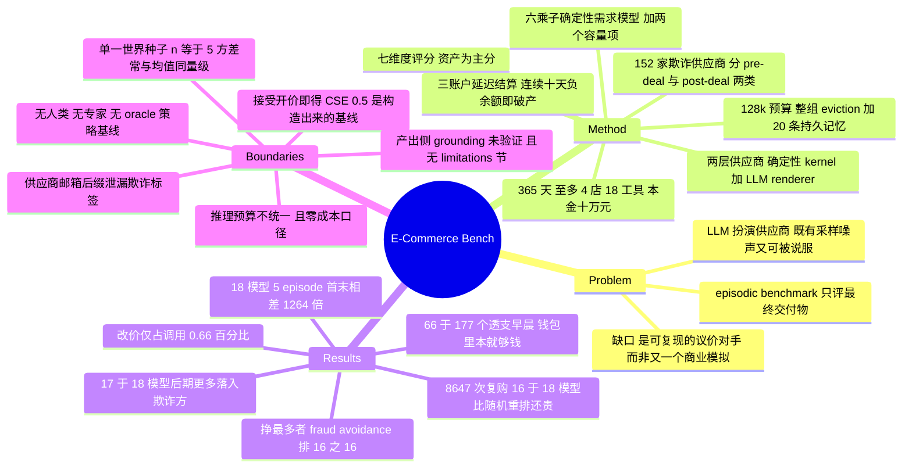

## Summary

E-Commerce Bench 把"经营一年电商生意"做成 continuing 长时程评测：agent 以 ¥100,000 起步，在 365 个模拟日里同时运营至多 4 家店，用 18 个工具选品、与 576 家供应商（其中 152 家欺诈）多轮议价、定价发货并管现金流。它区别于同期同类环境的关键设计是把供应商拆成两层——确定性 bargaining kernel 定死每一次报价、让步与接受/拒绝，LLM 只负责把 kernel 的决策渲染成对话——从而在保留多轮议价的同时把 counterpart 侧的采样噪声与"话术攻破供应商"的可能性一并消掉。18 模型 × 5 episode 的结论是七个维度上没有模型全面领先（GPT-5.6 Sol 把本金做到 14 倍却在 fraud avoidance 上排 18 之 16），而最可复用的产出是 AnchorRatio：在 8,647 次"同供应商同 SKU"复购上，16/18 模型的重复报价比把它自己已谈成的价格随机重排还贵。

## Problem & Motivation

论文的切入点是 Sutton-Barto 的 episodic / continuing 二分。Episodic benchmark（SWE-bench、OSWorld、GDPval）在目标达成的一刻结束，评的只是最终交付物的质量，因此测不出跨数百个子任务的依赖追踪、意外失败后的恢复，以及"把累积的历史变成更好的决策"。Continuing 任务没有终止状态，累积一个分数，业务经营是其中最自然的一类——决策高风险且不可逆，财务健康会复利。

真正有价值的是它对已有工作的诊断，落点很精确：**Vending-Bench 系列有多轮议价，但供应商完全由 LLM 扮演**，于是价格逐 run 漂移、而且供应商是"可被说服"的——一个足够能言善辩的 agent 能把对方谈到它自己的底线以下，评测就退化成 jailbreak 比赛。反方向上，YC-Bench 是确定性的但没有 sourcing，MerchantBench 与 RetailBench 有真实数据与开源代码，却把议价和对抗性动态整个丢掉了。所以缺口不是"再做一个商业模拟"，而是：**如何在保留一个会讨价还价的对手的同时，让对手的经济行为可复现**。这个 problem formulation 比环境本身更值得记，因为它对所有"用 LLM 扮演环境中的另一方"的评测都成立。

## Method

四层架构。

**Agent loop layer。** 一次 model call 产出一批 tool call，按给定顺序逐个执行。除"跳到明天"外每个工具都花模拟分钟，从 08:00–18:00 的 600 分钟工作日里扣：查余额 10 分钟、开店 60 分钟、一条 chatbox 消息 30 分钟（发给一家和发给十家同价），所以工具表是预算而不是菜单。episode 上限 4,000 turn，连续三轮不调工具即提前结束；实测最长 3,599 turn，90 个 episode 没有一个撞上限。上下文用统一 tokenizer 计数，所有模型共享 128,000 token 预算；达到 120,000 触发 eviction，释放目标 60,000，按 tool-call group（一条 assistant 回复及其全部 tool response 算一组）从旧到新整组丢弃，保留 system message、第一条 user turn 与最新两组，且这套 policy 连阈值一起逐字告诉 agent。eviction 够不到的是一个最多 20 条的 persistent memory store，读回花的分钟很少但重新占 token、并再次可被 evict。90 个 episode 共触发 1,495 次 eviction。

**Tool layer。** 18 个工具分七组覆盖商家后台。只有 `chatbox` 能生成采购单，所有库存都得靠自由文本里的 fenced `negotiate` block 谈出来。

**Sales and economy engine。** 12 种店型（一型至多一家、同时至多 4 家），开店 ¥500、日运营 ¥60–130。三账户延迟结算：成本当天从银行扣，销售先不给钱只生成待发货，发货后净收入（扣 2% 佣金）进 escrow，9 天后成熟进平台钱包，还要显式 `withdraw` 才回到付成本的银行账户；银行余额连续 10 天为负即破产。需求是确定性六乘子模型——价格响应 × 周末 × 促销 × 季节 × 日历事件 × 店铺声誉——再乘两个容量项（品类与店铺各一个日吸收上限），最后按货架库存截断，小数取整用共享 seed 的随机数。四个弹性族之一是**关于参考价对称的二次族**，即在这些品类里低于参考价打折反而掉需求。退货率由四条通道决定：品类自然率、供应商次品、定价高于参考价（1.3× 参考价则 ×1.50）、物流档位（慢件再 ×1.30），其中两条归 agent 管，因此退货率被部分记为管理结果而非商品属性。日历上 10 个 market event 与 8 个促销按固定日期改需求与时效，方向不一致（一场风暴抬食品、压服装鞋履）；促销提前一周只公告名字，不给日期和幅度。供应商按**完成订单数**退出（10–20 单）而非按日期，所以一个刚被摸清底价的对手可能在下次补货前消失。

**Deterministic negotiation engine。** 一个 (supplier, SKU) 对应一个 kernel 实例，reservation price 与 opening quote 由 data layer 算出，是 SKU 的属性而非抽样；接受与走人是随机的但由 kernel seed 决定；counter-offer 回应的是 **agent 自己的让步速度**而不是轮次，让得快就遇到更硬的对手。Layer 2 的 NPC renderer 只能转述 kernel 的价格与决策、只从 sentiment cue 取语气：一次 accept 若价格与 kernel 的 standing quote 差超过 ±0.005 就直接不成交，反方向上 agent 的报价/接受/拒绝由确定性 parser 从自由文本里解析。唯一走 prose 的经济动作是会员费入会，由 intent classifier 识别并收 ¥1,000。诚实供应商分六个行为模板，模板与"诚实/欺诈"标签都对 agent 不可见，且在发布的 roster 里固定而非逐 episode 重抽。跨 session 上，同一 (supplier, SKU) 的下一次开新 kernel 实例、新 seed，但沿用同一 persistent type 与 reservation price，所以**已谈成的最好价格是该底价的上界且只会收紧**——这正是 learning 维度要测的东西。

**Adversarial fraud。** 576 家里 152 家欺诈，五种脚本化 scam 分两类。Pre-deal 把 floor 抬向诚实成本的 1.5×（受 scam cap 约束，60 个品类实测平均溢价 1.218×），但抬高后的报价仍落在诚实供应商可能报出的区间内，所以只有叙事能暴露它；post-deal 用诚实报价，在履约时短交（付款量的 60–70%）或发次品（退货率取 0.40 与自然率两倍的较大者，上限 0.95），且次品率按 SKU 库存池摊薄，任何观测到的退货率都指不回具体供应商。唯一稳定的行为线索是让步速率——欺诈 kernel 比最硬的诚实模板还能扛——但这个信号只存在于多轮交互的形状里，早接受的 agent 就把它丢了。

**Data layer。** 6,886 商品 / 60 品类 / 576 供应商。商品、品类、品类退货率档、月销带、节假日历直接从真实平台脱敏；四个弹性族、季节曲线、声誉参数、供应商属性是"按日志分析手工合成"的。促销名字是虚构的，防止模型认出双 11 直接按记忆定价——这个细节值得学。

**指标。** 主分是年终总资产（银行 + 钱包 + 未结算 escrow）对 ¥100,000 的倍数，破产 run 照样进均值。六个能力维度各由一个指标排序：CSE+（议价，成交价覆盖了"参考价 → 成本底"这段距离的多少）、BadSpend%（欺诈规避，采购支出流向欺诈方的比例）、peak drawdown / peak assets（现金流）、profit per tool call（效率）、controllable return rate（执行，自身定价高于参考价多带来的退货百分点，剔除欺诈次品）、AnchorRatio（学习，复购超额支付除以"把该 pair 的成交价随机重排"的 permutation null）。

## Key Results

**主表（18 模型 × 5 episode，单一固定世界；资产单位千元人民币）**

| 模型 | 终局资产 | std | CSE+ ↑ | BadSpend% ↓ | Drawdown/peak ↓ | ¥/tool call ↑ | 可控退货 pp ↓ | AnchorRatio ↓ | 破产 |
|:--|--:|--:|--:|--:|--:|--:|--:|--:|:--|
| GPT-5.6 Sol (max) | 1,431 | 314 | 0.672 | 18.48 | 0.278 | 363 | 4.46 | 1.217 | 0/5 |
| Fable5 (max) | 805 | 188 | 0.772 | 3.46 | 0.141 | 479 | 0.22 | 1.573 | 0/5 |
| GPT-5.5 | 702 | 616 | 0.700 | 16.59 | 0.591 | 192 | 0.90 | 1.043 | 2/5 |
| Claude Opus 4.8 (max) | 498 | 231 | 0.662 | 5.41 | 0.130 | 266 | 0.20 | 1.309 | 0/5 |
| Qwen3.8-Max-Preview | 416 | 111 | 0.713 | 6.13 | 0.242 | 173 | 0.38 | **0.834** | 0/5 |
| GLM 5.2 (high) | 301 | 124 | 0.693 | 1.99 | 0.127 | 137 | 0.59 | 1.434 | 0/5 |
| Kimi K3 | 265 | 110 | 0.632 | 5.87 | 0.247 | 123 | 2.01 | 1.507 | 0/5 |
| Claude Opus 4.7 (max) | 259 | 111 | **0.811** | **0.12** | 0.189 | 156 | 1.75 | 1.421 | 0/5 |
| Claude Opus 4.6 (max) | 258 | 266 | 0.649 | 14.98 | 0.587 | 129 | 0.76 | 1.268 | 2/5 |
| Gemini 3.5 Flash | 190 | 79 | 0.777 | 2.13 | 0.450 | 36 | 0.38 | 0.918 | 0/5 |
| GLM 5.2 (max) | 115 | 71 | 0.632 | 19.68 | 0.360 | 10 | 2.24 | 1.362 | 0/5 |
| Kimi K2.6 | 70 | 14 | 0.596 | 17.22 | 0.377 | −27 | 0.42 | 1.548 | 0/5 |
| Qwen3.5-Plus | 1.1 | 11 | 0.625 | 20.11 | 0.979 | −92 | 5.88 | 1.860 | 4/5 |

（略去 GLM 5.1、DeepSeek-V4-Pro-Preview、Qwen3.7-Max、Gemini 3.1 Pro、Qwen3.6-Plus 五行以保持可读；完整 18 行见原文 Table 2。）

- **量级与破产。** 首末相差 1,264 倍。90 个 episode 里 10 个破产，全部来自 GPT-5.5、Claude Opus 4.6、Gemini 3.1 Pro、Qwen3.5-Plus 四个模型，其中 6 个出自闭源模型。两个 GPT-5.5 episode 在第 17 天就破产，此时一分钱收入都还没结算。
- **排名交叉是核心结论。** 挣得最多的 GPT-5.6 Sol 在 BadSpend% 上排 18 之 16，且每次工具调用的收益（¥363）低于 Fable5（¥479，且少用 59.9% 的调用）。Claude Opus 4.7 同时是最佳议价者（CSE+ 0.811）与最干净的买家（BadSpend% 0.12），资产却只排第 8。七轴雷达图上没有一个模型填满多边形。
- **学习失败（本文最硬的负面结果）。** 8,647 次同供应商同 SKU 复购中，只有 Qwen3.8-Max-Preview（0.834）与 Gemini 3.5 Flash（0.918）低于 1.0，即只有这两个的报价序列比"把自己已谈成的价格随机重排"更便宜；field median 1.369，15 个模型在昂贵方向上偏离自身 permutation null 超过两个标准差。另一读法一致：16/18 模型在 episode 后半段捕获的 surplus 少于前半段。论文诚实地说，三个候选机制（eviction 抹掉了记着价格的 tool result、memory store 几乎没人用、episode 内没有梯度）它一个也没分离。
- **对手选择随时间劣化。** 17/18 模型在年后期成交的 session 中欺诈供应商占比高于年前期——沿时间轴移动的东西朝错误方向移动。
- **欺诈的经济学。** 每个模型都往欺诈方送钱，跨度超过 160 倍。53.4% 的钱损失在次品批次上，短交次之；会员费诈骗几乎不奏效（全评测仅 3 笔 ¥1,000）。真正的分野不在"联系了谁"而在"下单给谁"：欺诈供应商在各模型的外联里都接近其名单占比，而外联转成下单的比例从 Claude Opus 4.7 的 4.0% 到 GPT-5.6 Sol 的 31.7%。1,141 笔欺诈成交中有 943 笔落在"同一 supplier-item 对成交两次及以上"——短交/次品从不被追责回对手，于是下次补货照原样再来一遍。
- **议价的天花板很低。** 12,060 个已结束的诚实 session 里只有 73 个没成交，其中 72 个是 agent 自己拒绝；每个模型至少成交 96%。所以排名完全取决于"成交价有多好"。而最硬的诚实模板（424 家里的 48 家）只拿走 ¥55.1M 诚实采购额的 4.8%，其余五个较软模板每个至少 14%——**agent 系统性地绕开难谈的对手**。58/90 个 episode 里至少出现过一次"原封不动接受开价"。
- **现金流的失败大多不是没钱，是没提现。** 90 个 episode 中 17 个曾在早晨查账时为负，共 177 个负值日；其中 **66 天平台钱包里的钱本就够补上缺口**。没有任何工具报告连续负值天数，agent 数不清自己已经欠了几个早晨。
- **工具预算的形状。** 发货、跳日、提现、上架四件事吃掉全部 18 模型 71.8% 的调用；读状态 14.7%、供应商对话 6.0%——唯一能改变进货成本的通道占不到十五分之一的努力。**改价只占 0.66%**，9/18 模型全年平均调不到 3 次改价，任凭季节、促销与声誉在下面推动需求。memory store 占 2.1%，Qwen3.5-Plus 五个 episode 一次都没写过。
- **三个常被归咎的失败模式不成立。** 开关店频率不区分模型；参加促销更多的模型更富；"后期崩溃"只成立一半——增速在第一季度后下降（paired t = −3.95），但收尾窗口是持平而非继续恶化。失败模式散布在全场而非集中在弱模型：每个模型都触发至少 5 条检测规则，Gemini 3.1 Pro 触发全部 10 条，而触发更少并不更富。

## Evidence Ledger

| Claim ID | Claim | Type | Source locator | Evidence excerpt | Status |
|:--|:--|:--|:--|:--|:--|
| C1 | 6,886 商品 / 60 品类 / 576 供应商（424 诚实 + 152 欺诈）；12 店型至多 4 家同营；18 工具；365 天；本金 ¥100,000 | benchmark-setting | §3.6.1 / §3.4.1 / §3.3 / §3.1 | "ships 6,886 products in 60 categories, served by 576 suppliers, 424 of them honest and 152 fraudulent" | source-verified |
| C2 | 18 模型 × 5 episode = 90，单一固定世界；provider 默认采样、thinking 强制开启；4,000 turn 上限，最长 3,599，无一撞上限 | benchmark-setting | §4.1 | "Each model received five independent episodes, 90 in all, under one fixed world" | source-verified |
| C3 | Table 2 的 GPT-5.6 Sol 行：1,431 / 314 / 0.672 / 18.48 / 0.278 / 363 / 4.46 / 1.217 / 3,668 / 1,367 / 0-5 | number | Table 2 | "1,431 | 314 | 0.672 | 18.48 | 0.278 | 363 | 4.46 | 1.217" | source-verified |
| C4 | Table 2 的 Fable5 行：805 / 188 / 0.772 / 3.46 / 0.141 / 479 / 0.22 / 1.573 / 1,469 / 0-5 | number | Table 2 | "805 | 188 | 0.772 | 3.46 | 0.141 | 479 | 0.22 | 1.573" | source-verified |
| C5 | GPT-5.6 Sol 把 ¥100,000 做到 ¥1,431,425（约 14×）却在 fraud avoidance 排 16/18；Qwen3.8-Max-Preview 以 ¥416,252 领跑开源、高出 GLM 5.2 (high) 38%，AnchorRatio 0.834 为全场最优 | number | Abstract / Table 2 / §4.3.6 | "growing the ¥100,000 opening stake into ¥1,431,425, yet it ranks 16th of 18 on fraud avoidance" | source-verified（0.834 是 ↓ 向指标的列最小值；"最强 learning" 的表述在 §4.3.6 而非 abstract） |
| C6 | 首末相差 1,264 倍；90 个 episode 中 10 个破产、6 个出自闭源；破产集中于 GPT-5.5 / Opus 4.6 / Gemini 3.1 Pro / Qwen3.5-Plus 四个模型 | number | §4.2 | "A factor of 1,264 separates GPT-5.6 Sol at the top from Qwen3.5-Plus … Ten of the ninety episodes ended insolvent" | source-verified |
| C7 | 8,647 次复购中 16/18 模型无降价迹象；field median AnchorRatio 1.369；15 个模型在昂贵方向偏离自身 permutation null 超 2 std；仅 0.834 与 0.918 两个低于 1.0 | number | §1 / §3.5.5 / §4.3.6 | "The field median is 1.369 … Fifteen models miss their own permutation null by more than two standard deviations" | source-verified |
| C8 | 环境侧仅两个残余随机来源：LLM renderer 的措辞、以及在 episode seed 之外抽取的供应商标称到货天数 | benchmark-setting | §3.5.2 | "Two sources of run-to-run variance survive. The Layer 2 renderer is an LLM sampled at its provider's default decoding, and the delivery days" | source-verified（**范围限定**：同段另行承认 agent 侧 policy sampling noise；§1 更松地写成"只有 renderer 措辞变化"） |
| C9 | 全部 60 品类满足 wr = round(0.5 + 0.5·cfr, 2)，故"接受开价"精确得 CSE+ = 0.5（四舍五入前），所有 CSE+ 都读在这个基线上 | benchmark-setting | App D.2 | "Accepting the opening quote therefore scores (1-wr_j)/(1-cfr_j), exactly 0.5 before rounding" | source-verified |
| C10 | CSE+ 从 Claude Opus 4.7 的 0.811 到 Kimi K2.6 的 0.596；全场比"接受首次报价"高 0.10–0.31；跨六个行为模板的离散度 0.051，跨模型 0.204 | number | §4.3.1 | "spreads 0.051 across the six behavior templates against 0.204 across models" | source-verified |
| C11 | supplier_search 返回的邮箱 local part 以供应商 id 结尾，且**每一个** 60 品类内诚实供应商的 id 都低于欺诈供应商——按数字后缀排序即可零成本筛掉欺诈方 | benchmark-setting | App B.5 item 2 | "inside every one of the 60 categories the honest suppliers hold lower identifiers" | source-verified |
| C12 | 20/60 品类的定性退货率措辞写作 low / very low，而其数值区间高至 20%–35%，这些品类占全部 SKU 的 25.5% | benchmark-setting | App B.5 item 1 | "a sentence reading low or very low against a numeric band reaching 20% to 35% … holding 25.5% of all SKUs" | source-verified |
| C13 | 全文与附录中**不存在**任何 human / expert / rule-based / oracle **策略基线**，因此 18 个模型的资产数字没有任何外部难度刻度 | benchmark-setting | 全文 + App A–G 检索 | 仅有 "%Oracle compares the same surplus against closing every honest deal at the supplier's floor" | source-verified（**范围限定**：%Oracle 是议价指标内部的 per-deal 归一化量，不是资产层面的策略基线） |
| C14 | 没有独立的 Limitations 节；无 token / 美元成本核算，§4.3.4 明言经济体内不对工具调用收费、部署账单落在评分之外 | benchmark-setting | 目录 / §4.3.4 / App E.4 | "the bill falls on whoever deploys the agent and the score stays blind to it" | source-verified（**范围限定**：虽无 Limitations 节，但 §3.5.5、E.4、B.5 有分散的局部限制段落） |
| C15 | grounding 二分：商品/品类/退货率档/月销带/节假日历直接脱敏自真实平台；四个弹性族、季节曲线、声誉参数、供应商属性系按日志分析**合成**；促销名虚构 | benchmark-setting | §3.6.1 | "Desensitization maps the products, the categories, the per-category return-rate tiers, the monthly-sales bands and the holiday calendar straight off a real e-commerce platform" | source-verified |
| C16 | 次品批次占流向欺诈方全部资金的 53.4%；会员费诈骗全评测仅 3 笔 ¥1,000；1,141 笔欺诈成交中 943 笔落在成交≥2 次的 supplier-item 对；外联转下单比例 4.0%–31.7% | number | §4.3.2 / §4.4 / App D.5 | "Defective lots take 53.4% of everything reaching fraudulent suppliers" | source-verified |
| C17 | BadSpend% 的五 episode 标准差在 18 个模型中有 15 个超过其自身均值 | number | §4.3.2 | "the standard deviation of the share exceeds its own mean for 15 of the 18 models" | source-verified |
| C18 | 发货/跳日/提现/上架占全部调用 71.8%；改价仅 0.66%；memory store 2.1%；9/18 模型全年改价调用不足 3 次 | number | §4.3.4 | "Shipping, advancing the day, withdrawing settled revenue and publishing inventory absorb 71.8% of all 18 models' calls" | source-verified |
| C19 | 共享 128,000 token 预算；120,000 触发 eviction、释放目标 60,000，整组从旧到新丢弃，保留 system / 首条 user / 最新两组；memory store 至多 20 条；90 episode 共 1,495 次 eviction | benchmark-setting | §3.2.2 / §3.2.3 | "A context eviction is triggered whenever the count reaches 120,000 tokens, taking 60,000 as its release target" | source-verified |
| C20 | 除跳日外每个工具都从 600 分钟工作日（08:00–18:00）扣模拟分钟：查余额 10、开店 60、一条 chatbox 消息 30（无论发给几家） | benchmark-setting | §3.2.1 / §3.3 | "Every tool but the day jump costs simulated minutes: 10 for a balance check and 60 for opening a store" | source-verified |
| C21 | 17/18 模型在年后期成交 session 中欺诈方占比高于年前期；16/18 模型后半年捕获的 surplus 少于前半年 | number | §4.3.6 | "Fraudulent suppliers take a larger share of concluded sessions late in the year than early for 17 of the 18 models" | source-verified |
| C22 | 12,060 个已结束诚实 session 仅 73 个未成交、其中 72 个是 agent 自己拒绝；每个模型至少成交 96%；该比率不含 10.9% 中途开启后再未回访的 session | number | §4.3.1 | "Of the 12,060 concluded honest sessions, 73 end without a deal, and 72 of those are the agent's own rejection" | source-verified |
| C23 | 最硬的诚实模板覆盖 424 家中的 48 家，只拿走 ¥55.1M 诚实采购的 4.8%，而五个较软模板每个至少 14% | number | §4.3.1 | "those 48 take 4.8% of the ¥55.1M of honest procurement" | source-verified |
| C24 | arXiv:2608.30730v1 [cs.LG] 2026-08-31；11 位作者；单位为 Qwen Team (Alibaba)、HKUST CSE、Taobao & Tmall Group；代码 https://github.com/QwenLM/E-CommerceBench | metadata | arXiv abs 页 / 首页 | "arXiv:2608.30730v1 [cs.LG] 31 Aug 2026"；"[v1] Mon, 31 Aug 2026 13:03:57 UTC" | source-verified（primary cs.LG，cross-list cs.CL） |
| C25 | 作者自述 novelty：首个把多轮对手议价与动态事件统一进一年期经营的开源 benchmark；Table 1 断言它是 5 个对比对象中唯一同时具备六项属性者 | sota-novelty | Abstract / §1 / §2.2 Table 1 | "the first open-source benchmark that integrates multi-round counterpart negotiation and dynamic events into a year-long business operation" | source-verified（仅表示原文确有此断言，未独立核验其穷尽性） |
| C26 | 三个常被归咎的长时程失败模式不成立：开关店不区分模型、参加促销更多者更富、"后期崩溃"只成立一半（首季后增速下降 paired t = −3.95，收尾窗口持平） | causal-mechanism | §4.4 | "growth dropping after the first quarter at a paired t=-3.95" | source-verified |
| C27 | 152/576 欺诈，五种 scam 分两类；pre-deal 底价抬向 1.5× 诚实成本（60 品类实测平均溢价 1.218×）；短交交付付款量的 60%–70%；次品退货率取 0.40 与自然率两倍的较大者、上限 0.95 | benchmark-setting | §3.5.4 / App D.2 / Table 9 | "reservation price inflated toward 1.5× the honest cost floor"；"the overpayment multiple averages 1.218" | source-verified |

## Strengths & Weaknesses

**亮点。**

- **两层供应商是这篇真正的贡献，而且是可移植的。** "把对手的经济决策交给确定性 kernel，只让 LLM 负责措辞"解掉了一个通用难题：任何在环境里放 LLM 扮演对手的评测，都同时买进了采样噪声和可被说服性。这里的执行也很扎实——不是靠提示词约束 renderer，而是靠硬校验：成交价与 kernel standing quote 差超过 ±0.005 就拒绝成交，agent 侧的报价/接受/拒绝由确定性 parser 抽取。这个模式对谈判、客服、面试、多方博弈类评测都直接适用，比环境本身更有复利价值。
- **AnchorRatio 是本文最值得被搬走的产出。** 它便宜、可移植到任何重复交易场景，而且 null 选得对——不是拿别人的价格比，是把**同一 pair、同一 agent 自己**的成交价随机重排。这样构造出来的结论（16/18 模型的复购比自己价格的随机排列还贵）几乎无法用"任务难度不同"解释掉；论文还额外核对了该 pair 的成本底与名义批发参考价在 8,647 次复购中保持不变，只诚实承认 kernel 每轮重抽的开价没有存档。这与 MerchantBench 的 SWR 是同一类东西：一个廉价、单数字、能把"长时程有没有真的变长"量化出来的指标。
- **对自己环境的缺陷做了公开自审。** Appendix B.5 主动披露供应商邮箱后缀泄漏欺诈标签、以及 20 个品类的退货率措辞与数值区间不符——并明确指出前者与 §3.6.2 "供应商列表不含任何区分诚实与欺诈的排序"这句话相冲突。benchmark 论文自曝可利用泄漏是罕见的，应当鼓励。
- **信息不对称被系统地设计而非顺手留白。** Table 7 逐行把"可观测量 / 隐藏量 / 发现路径与代价"对上，且不同隐藏参数的可学习速度被刻意拉开：供应商底价可由历史成交单调收紧，SKU 自然退货率买过一次就能读，弹性参数因为四个未打印的乘子叠加而全年不可辨识，店型收益上限要经营满一年才知道。于是"如何分配探索"本身成了任务的一部分，而不是背景噪声。
- **诚实的口径披露。** CSE+ 不按订单量加权、且分母是 agent 自选的 session 集合，论文自己写明并要求配合成交量一起读；BadSpend% 的 std 在 15/18 模型上超过均值，论文写出来了；AnchorRatio 的 population std 与其他 sample std 不可比，也写出来了。§4.4 更是主动推翻了三个"常被归咎"的失败叙事（开关店、忽视促销、后期崩溃），这种自我证伪在 benchmark 论文里不常见。

**局限。**

- **没有任何策略基线，是最严重的缺口。** 全文没有人类、没有专家/启发式策略、没有 oracle 策略，于是"14 倍本金"这个数字没有分母：我们不知道 14× 是接近可得上限还是远远不及。这个环境本身完全支持算出一个上界（按底价进货、按参考价出货、不碰欺诈方），成本极低却没做。对照组的存在正是姊妹工作的价值所在——Business Arena 的专家策略给出"最佳模型均值的两倍"、MerchantBench 的人类给出"最佳 LLM 只有 27.3%"，两者都把 leaderboard 从纯序数变成有刻度的。这里只剩序数，因此**唯一站得住的结论是"没有模型全面领先"，而不是任何关于绝对能力水平的判断**。
- **单一世界种子 + n=5，而离散度常与均值同量级。** GPT-5.5 是 702±616、Claude Opus 4.6 是 258±266、Gemini 3.1 Pro 是 130±130、Qwen3.7-Max 的五年从 ¥6,290 到 ¥358,790。论文正确指出环境给定动作序列是确定性的，所以这些方差全部来自 agent policy——但这恰恰意味着五次采样的均值在刻画一个高方差策略分布，主榜的多数 pairwise 名次并无统计支持。论文在 learning 轴上做了正确的事（153 个模型对里只有 53 对被 2 SE 分开，明说了），却没有把同样的纪律施加到主榜上。而且只有一个世界，跨市场实现的稳健性未测——与 Business Arena 同病。
- **CSE+ 的量表是构造出来的，读数要打折。** App D.2 显示全部 60 品类满足 wr = 0.5 + 0.5·cfr，所以"接受开价"精确得 0.5 分。全场落在 0.596–0.811，也就是说 **18 个模型全部处在"接受首次报价"与"谈掉一半剩余空间"之间**。再叠加两条口径：session 中途放弃不进任何分母（10.9% 的 session 被开启后再未回访），且成交率普遍 ≥96%——一个模型完全可以靠"只谈好谈的、难的悄悄放弃"抬高 CSE+。§4.3.1 自己的数据佐证了这一点：最硬的模板占 424 家中的 48 家，却只拿到 4.8% 的采购额。
- **两处已披露的泄漏，其中一处直接击穿一整个评测轴。** 若按邮箱数字后缀排序就能在每个品类内分开诚实与欺诈，那么 fraud avoidance 轴衡量的就不是"能否从叙事里识别骗局"，而是"有没有碰巧发现这个后缀规律"。论文说是否有模型利用了它要从 §F.3 的外联阶段去读，但没有给出结论性判定。这条必须修，否则该轴在环境开源后会立刻失效。
- **推理预算不统一，且完全没有成本口径。** Table 10 显示 reasoning effort 混着 max / xhigh / high / fixed high / not sent / unset：GPT-5.6 Sol 在 max，而作者自家的 Qwen3.8-Max-Preview 在 unset。同时 §4.3.4 明说调用不计费、部署账单落在评分之外。于是主榜同时混合了模型能力、推理预算与 harness 适配度三件事，按 AgentsThatMatter 的标准，cost-accuracy Pareto 完全缺位。**顺带一个论文自己没提的观察**（我的读法，依据 Table 2 + Table 10）：GLM 5.2 在 high 下拿 ¥301k、在 max 下只有 ¥115k，同一模型提高推理预算反而少赚 2.6 倍——如果这个方向可复现，它比整张榜都更有意思，因为它直指"更多思考在长时程经营里未必更好"。
- **产出侧 grounding 依旧缺席，且这次连 limitations 都没写。** 输入侧确有真实成分（商品、品类、退货档、月销带、节假日历），但"agent 决策 → 利润"的映射全部是设计出来的：六乘子需求模型、两个容量项、四个弹性族（其中一族关于参考价对称，即降价反而掉需求）、以及把成本底与批发价直接写成参考价的仿射函数（wr = 0.5 + 0.5·cfr）。**没有任何证据表明真实商家执行同样策略会得到近似结果**，而这个环境甚至没有一节承认这一点。这是 MerchantBench / Business Arena / E-Commerce Bench 三篇共有的结构性空白。
- **需求模型里权重最大的那一项恰好不可学。** §3.4.3 给的例子里，两个容量项把一个 SKU 在促销周六的复合期望 128.2 单压到实际卖出的 9 单，其中仅品类项就吃掉 7.5 倍。也就是说 agent 能控制的六个乘子被两个它看不见、也无法从任何工具读到的饱和项压过。这直接给"市场策略"这类能力的可测量上限设了顶——一个把定价做到最优的 agent 与一个随便定价的 agent，在容量项绑定的区间里区别有限。这或许也是"改价只占 0.66% 调用"却仍能挣钱的部分原因。
- **环境的确定性同时是它的过拟合面。** 供应商 roster、行为模板、欺诈标签、事件日历全部在发布时固定，世界只有一个。可复现性是买来了，但代价是这个 benchmark 一旦进入训练数据就会被记住：供应商底价可以被背下来，learning 轴会退化成检索题。论文没有留任何 held-out world 或可重抽 roster 的机制。

**潜在影响。** 我判断这篇的长期价值有两件：一是 deterministic kernel + LLM renderer 这个模式（它解的是"环境里放 LLM 会带来什么"这个通用问题），二是 AnchorRatio 与它支撑的负面结果——**在一个反复与同一对手交易的长时程环境里，前沿模型的重复报价系统性地比自己价格的随机排列更贵**。第二件对 agentic RL 的 credit assignment 有直接含义：如果 in-context 的经验累积在这种"低频、延迟、需要跨 eviction 存活"的信号上是失效的，那么依赖 in-context self-improvement 的路线在长时程经营类任务上没有依据。

## Mind Map

## Connections

- [[2607-MerchantBench]]：同为 365 天卖家侧电商模拟，且都出自阿里体系。分工清晰——MerchantBench 强在**人类与 rule-based 基线**（最佳 LLM 只有人类的 27.3%，6/16 配置跑不过一条几十行规则）与订单级 mixed-latency 反馈的形式化，但供应商只是随机事件、没有议价，且人机对照混进了接口带宽（人走 dashboard、agent 走 26 工具文本 API）。E-Commerce Bench 恰好互补：counterpart 侧控制得最好，却一个基线都没有。两篇的共同空白完全相同——**产出侧 grounding 从未与真实商家结果对照**。
- [[2608-BusinessArena]]：三篇里方法学最完整的一篇（专家策略上界 + 9 组 mechanism ablation + ICC/split-half 可靠性分析），但只有 30 模拟日、无议价对手、环境未开源。把三篇并排看能得到一个干净的三角：**BusinessArena 会做效度实验但环境窄，MerchantBench 有人类刻度但接口混淆，E-Commerce Bench 有最干净的对手但没有刻度也没有 ablation**。任何一篇单独看都会高估自己的结论强度。
- [[2407-AgentsThatMatter]]：E-Commerce Bench 满足了"报告方差"这一条（每个均值都带 std），却在成本维度上完全落空——推理预算逐模型不同、无 token/美元核算，且论文 §4.3.4 自己引用了这篇并承认"分数对账单是盲的"。承认问题但不解决。
- [[2607-AgentBenchmarkBudget]]：主榜是 n=5、单世界、多个模型的 std 与均值同量级，正落在其"pairwise decision 不被证据支持"的靶心上。反过来说，本文 learning 轴上"153 个模型对里只有 53 对被 2 SE 分开"的自报，正是那篇主张的正确做法——同一篇论文里两个轴的统计纪律不一致。
- [[2607-LongHorizonTerminalBench]] / [[2608-LongHorizonHarness]]：三种不同的"长时程失败形状"——LH-TerminalBench 是 wall-clock 预算耗尽时 agent 还在干活，MerchantBench 是没人催的时候 agent 自己停下来（SWR 低至 10.6%），E-Commerce Bench 是 agent 一直在干活（71.8% 的调用是日常循环）但**干的事不随经验改进**。第三种形状是新的，也最难用"加个 harness"解决。LH-Harness 的 Manage-Execute-Audit 把 task state 外置，正对本文"eviction 抹掉了记着价格的 tool result"这条候选机制，是一个现成的组合实验。
- [[2608-AgentMemoryDistill]] / [[Topics/AgentHarness-Design]]：memory store 只占 2.1% 调用、Qwen3.5-Plus 五个 episode 一次没写过，而 eviction 一年跑了 1,495 次——这是"给了记忆接口但 agent 不用"的一个高质量实证数据点，且环境明确把 eviction policy 逐字告诉了 agent。对 memory 相关工作而言，这比"记忆能提升多少"更值得解释：**在什么条件下 agent 会主动使用一个已知存在、已知规则、代价很低的外部记忆？**
- [[Topics/Harness-Component-Attribution]]：本文比 MerchantBench 干净（全模型共享同一套 18 工具、同一上下文预算、同一 eviction 策略），但仍是单一 harness 下的模型比较，且推理预算不统一。GLM 5.2 high 与 max 的 2.6 倍反向差距是这条线上一个值得追的观察。

## Notes

- **与 BusinessArena / MerchantBench 的重复性判定：不是近似重复。** 三者的场景、时长、对手模型、评测手段都不同（30 天跨境 B2B 无议价 / 365 天单店代发无议价 / 365 天四店 + 确定性议价 + 对抗欺诈），本文的区分性贡献是 negotiation kernel 与 fraud 轴。但值得单独记一笔的是**元层面的现象**：同一家公司体系在五周内（07-31、08-09、08-31）发布了三个互不兼容的电商 agent 环境——接口不同、评分不同、数据源不同（1688 / Alibaba.com / Taobao & Tmall），三份结果无法互相组合或复用。这本身是 agent 评测领域碎片化的一个清晰样本，值得写进 survey 的方法学一节。
- **发现一处内部口径不一致（我的核对，非论文所述）**：Appendix H.1 给 agent 的 task brief 写的是 "maximize your total balance (bank account + platform wallet)"，而 §3.7 的主分是"银行 + 钱包 + **未结算 escrow**"。也就是说 agent 被告知的目标与它被评分的目标不完全相同，差一个 escrow 项。影响大概率很小（终局会做 finalization 把 escrow 排空），但方向上会让 agent 低估年末在途收入的价值。
- **最该做而没做的两个实验**：(1) 算一条环境内的 oracle 资产上界（按底价进货、按参考价出货、不碰欺诈方、按容量项配货），成本几乎为零，却能立刻把 leaderboard 从序数变成有刻度——这正是 Business Arena 已经证明可行的做法；(2) 补一个 memory-oracle 条件：把已成交价格历史直接注入观测（绕开 eviction），看 AnchorRatio 是否回到 1.0 以下。第二个实验能一次性分离论文自己列出的三个候选机制里的前两个（eviction 抹掉记录 vs. 模型不会用记忆），而论文明说"the evaluation separates none of them"。
- **一个未被论文当作发现的发现**：66/177 个透支早晨里，平台钱包本就有足够的钱补上缺口。这不是"没钱"，是"没提现"——而 `withdraw` 只花 10 模拟分钟、不花钱。同时没有任何工具报告连续负值天数。这条把"长时程失败"落到了一个极具体的形态上：**agent 在一个它完全有能力避免、且规则已被逐字告知的死亡条件上被动死亡，因为它没有维护一个跨天的计数器**。这比任何 leaderboard 名次都更适合作为 agent memory / state tracking 工作的动机例证。
- **供应商按完成订单数（10–20 单）退出这一设定与 learning 轴存在张力**：环境刻意周期性地销毁 agent 已校准好的价格锚点。这不是 bug（真实市场确实会这样），但意味着 AnchorRatio 能奖励的累积长度被设计上限住了，跨模型比较时这个上限对所有人相同、因而公平，但绝对值不宜外推。
- **repo_candidate**: https://github.com/QwenLM/E-CommerceBench —— 典型的环境类工作，贡献主要在实现里。值得另起一轮 repo-digest 核实三件事：(1) negotiation kernel 的让步函数与 Appendix D.1/D.3 的参数表是否一致、fraud kernel 的 κ_B 是否真的低于最硬的诚实模板；(2) 发布的供应商 roster 里邮箱后缀泄漏（App B.5）是否已修；(3) 六乘子需求模型里两个容量项的实际参数——论文示例显示它们能把 128.2 单压到 9 单，若代码里这个饱和强度可配置，那么"策略空间被容量项压平"这一点就可以直接量化验证。
