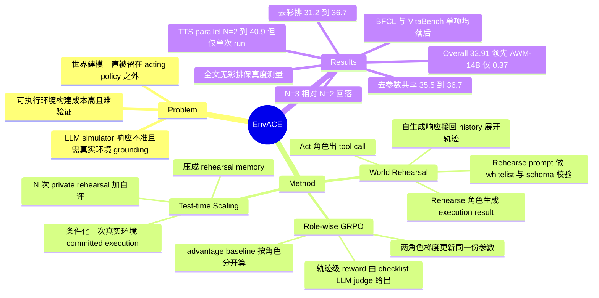

## Summary

EnvACE 让同一个 policy 交替扮演两个角色——先出 tool call，再以 Rehearse 角色生成这个 tool call 会 induce 的环境响应，把自生成的响应接回 history 继续下一步，从而在训练期完全不接触外部环境或外部 simulator，用 role-wise GRPO 对两个角色联合优化。在 BFCL-v4 / τ²-Bench / VitaBench 三个 benchmark 的算术平均上 EnvACE-8B 取得 32.91%，略高于 EnvScaler-8B（31.92%）与 AWM-14B（32.54%），但在 BFCL-v4 与 VitaBench 单项上均不占优。推理期该内化的 world model 被用作"先私下彩排、再单次真实提交"的 test-time scaling 机制。

## Problem & Motivation

Long-horizon tool-use agent 的 RL 训练受制于环境供给：可执行环境（合成或真实）构建成本高、正确性随复杂度上升越来越难验证；LLM-based simulator 成本低但响应可能不准、不一致，而要把它 ground 住又得回头依赖真实环境的监督。作者的判断是——这两条路都把"环境建模"留在 acting policy 之外，policy 只学会消费别人递过来的 observation。

论文由此提出一个更激进的立场：一个合格的 agent policy 不该只学 how to act，还应该学 how the environment responds to its actions；与其把 world modeling 外包给单独的 simulator，不如把它吸收进 policy 参数本身。这一动机线索承接 Chen et al. 2025（self-play finetuning 内化 world model）与 Guo et al. 2025（world modelling improves LM agents），但把辅助预测目标升级成"直接用彩排出来的响应展开 on-policy 轨迹"。

## Method

**1. World Rehearsal（§4.1）** — 共享参数的单个 policy $\pi_\theta$ 被赋予两个角色。给定 history $h_t$，Act 角色先出动作 $a_t \sim \pi_\theta(\cdot \mid h_t, \textsc{Act})$；Rehearse 角色再条件在 $(h_t, a_t)$ 上生成环境响应 $\hat{o}_t \sim \pi_\theta(\cdot \mid h_t, a_t, \textsc{Rehearse})$；history 按 $h_{t+1} = h_t \oplus (a_t, \hat{o}_t)$ 更新。整条训练轨迹由 policy 自己展开，不查询任何外部环境。

Rehearse 角色的行为完全由 prompt 规定（附录 "World Rehearsal Prompt for Agentic Tool Execution"）：它被要求扮演 *precise tool simulator*，按四步执行——(i) 检查 tool call 是否包在 `<tool_call>` 标签内且 JSON 合法；(ii) 检查工具名是否在 candidate tools whitelist 内；(iii) 检查参数是否满足 input schema（required 字段、primitive 类型、enum 值）；(iv) 三关全过才生成 `<execution_result>`，且**若 few-shot 段落里存在同名、参数相近的历史调用，直接复用其 execution result**，否则生成一个满足 schema 且与 few-shot pattern 事实一致的结果。也就是说彩排的 grounding 来自 prompt 里注入的静态 ground-truth 参考数据，而不是运行时环境。

**2. Role-wise GRPO（§4.2）** — 每条 rollout 的所有 policy output 继承同一条轨迹级 reward $R_i$（可验证 outcome evaluator 或 checklist LLM judge 给出），但 advantage 相对**同角色**的输出算 baseline：$\mu_{x,r}$ 只在角色 $r$ 的输出集合上取均值，$A_{i,m} = R_i - \mu_{x, r_{i,m}}$。两个角色的梯度共同更新同一份 $\theta$，这正是"内化"的机制载体。

**3. Test-time scaling（§4.3）** — 训练完成后，面对新指令先做 $N$ 次 private rehearsal：parallel 模式下 $N$ 次彩排从同一初始 context 独立采样；sequential 模式下第 $n$ 次能看到前 $n-1$ 次的想象轨迹及其 self-evaluation。每次彩排后 policy 自评产出 assessment + 修改建议，最后把所有彩排与自评压成一份 rehearsal memory $m_x$，Act 角色条件在 $m_x$ 上在**外部真实环境**里做一次 committed execution。彩排本身是私有的，不改变外部环境状态。

> 一处正文与附录不自洽：§4.3 的形式化写的是"每次 attempt 从同一初始 task context 出发、产出一条完整想象轨迹 $\tilde\tau^{(n)}$"，即整条轨迹级的前置彩排；而 Figure 7/8 的 case study 描述的是"每次 tool 执行前先彩排该次调用"的逐步彩排。论文没有说明两者关系。

**训练配置**：Qwen3-8B，CM2 数据集，470 步，lr 1e-6，batch 16，每 prompt 4 rollouts，KL 系数 1e-4，entropy 0.0，每步采 64 个实例，最大输入 12,000 / 输出 8,000 token，最多 30 轮交互，Qwen3-30B-A3B 作 LLM judge，verl 框架，16 张 NVIDIA H20。

## Key Results

**主表（Table 1）** — Overall 定义为 BFCL V4 Avg. / τ²-Bench Avg. / VitaBench Avg. 三者的算术平均：

| Method | BFCL V4 Avg. | τ²-Bench Avg. | VitaBench Avg. | Overall |
|:--|--:|--:|--:|--:|
| Qwen3-8B | 44.04 | 30.0 | 11.4 | 28.48 |
| TOUCAN-7B | 35.33 | 22.4 | 2.8 | 20.18 |
| Simulator-8B | 19.78 | **38.5** | 1.8 | 20.03 |
| AWM-8B | 44.29 | 31.2 | 10.2 | 28.56 |
| EnvScaler-8B | 47.07 | 32.9 | 15.8 | 31.92 |
| AWM-14B | **47.32** | 30.7 | **19.6** | 32.54 |
| ScaleEnv-8B | – | **38.5** | 15.0 | – |
| EnvACE-1.7B | 31.81 | 15.3 | 3.2 | 16.77 |
| **EnvACE-8B** | 46.04 | 36.7 | 16.0 | **32.91** |

EnvACE-8B 的 Overall 领先幅度很小：比 EnvScaler-8B 高 0.99、比参数量更大的 AWM-14B 高 0.37。分项上它**没有**拿下 BFCL V4（46.04 落后 EnvScaler-8B 的 47.07 与 AWM-14B 的 47.32）与 VitaBench（16.0 落后 AWM-14B 的 19.6）；τ²-Bench 的 36.7 也只是第二高，Simulator-8B 与 ScaleEnv-8B 均为 38.5。ScaleEnv-8B 因缺 BFCL V4 数据（表中为 "–"）未参与 Overall 排名。

**FinMCP-Bench（Table 2）** — EnvACE-8B 拿到最高 TF1 46.78% 与最高 tool precision 54.04%，但 tool recall 41.23% 低于 Qwen3-8B（43.18%）、AWM-8B（46.43%）与 EnvScaler-8B（49.35%）。收益形态是"少调错工具"而非"多找到该调的工具"。

**组件归因（§5.3，正文引作 Figure 4，实际对应 Figure 3 的 ablation 图；τ²-Bench Avg.）**：

| 对照臂 | τ²-Bench Avg. | Δ |
|:--|--:|--:|
| standard GRPO（无 world rehearsal） | 31.2 | — |
| Per-role Policy（有彩排，但 Act / Rehearse 各用一份独立 policy） | 35.5 | +4.3 |
| EnvACE（彩排 + 参数共享） | 36.7 | +1.2 |

**Scale（§5.4）** — 1.7B → 8B：BFCL V4 从 31.81 到 46.04（+14.23），τ²-Bench 从 15.3 到 36.7（+21.4）；两个 scale 上 EnvACE 都优于 standard GRPO，8B 上差距更明显。

**训练动态（Figure 5）** — τ²-Bench 离线评测分从 step 50 的 30.0% 上升到 step 470 的 36.7%，中间有波动，最高分出现在最后一个 checkpoint。

**Test-time scaling（Table 3，N=2，Overall = τ²-Bench Avg. 与 BFCL Multi-Turn Avg. 的算术平均）**：

| 设置 | 彩排 policy | τ²-Bench Avg. | BFCL Multi-Turn Avg. | Overall |
|:--|:--|--:|--:|--:|
| Non-TTS | – | 31.4 | 41.9 | 36.7 |
| TTS parallel | base model | 32.2 | 41.4 | 36.8 |
| TTS parallel | EnvACE | **38.0** | **43.9** | **40.9** |
| TTS sequential | base model | 31.0 | 38.8 | 34.9 |
| TTS sequential | EnvACE | 34.8 | 42.3 | 38.5 |

用 base model 彩排在 parallel 下只有 +0.1、在 sequential 下（34.9）反而低于 Non-TTS——这条对照说明增益不是单纯多花推理算力换来的，而绑定在训练所内化的环境响应知识上。彩排预算从 1 到 2 有增益，**N=3 时性能相对 N=2 下降**（仍高于对应的 base-model 彩排），作者归因于额外彩排轨迹拉长输入、逼近或超出有效 context 范围。

**口径注意**：非 TTS 结果为 Avg@4（四次独立 run 平均），**TTS 结果只跑了一次 run**；且 Table 3 的实验中 Act 与 Rehearse 角色都用 temperature 1.0 / top-p 1.0（其余实验 Act 角色用 0.6 / 0.95）。这也解释了为什么 Table 3 的 Non-TTS τ²-Bench Avg.（31.4）显著低于 Table 1 的 36.7——两张表不是同一采样配置，不可直接互比。

**Limitation（§7，作者自述）** — 受算力限制只评到 8B；评测集中在 tool-interactive 任务。

## Evidence Ledger

| Claim ID | Claim | Type | Source locator | Evidence excerpt | Status |
|:--|:--|:--|:--|:--|:--|
| C1 | EnvACE-8B Overall 32.91%（三 benchmark 平均），高于 EnvScaler-8B 31.92% 与 AWM-14B 32.54% | number/comparison | Table 1 + §5.2 | "EnvACE achieves an Overall score of 32.91%… surpasses EnvScaler-8B and AWM-14B by 0.99% and 0.37%" | source-verified |
| C2 | BFCL V4 上 46.04 低于 EnvScaler-8B 47.07 与 AWM-14B 47.32；VitaBench 上 16.0 低于 AWM-14B 19.6 | comparison | Table 1（BFCL V4 Avg. / VitaBench Avg. 列） | "EnvACE-8B … 46.04 … 16.0"; EnvScaler-8B "47.07"; AWM-14B "47.32 … 19.6" | source-verified |
| C3 | τ²-Bench 上 36.7 仅第二高，Simulator-8B 与 ScaleEnv-8B 均 38.5；ScaleEnv-8B 无 BFCL 数据故无 Overall | comparison/benchmark-setting | §5.2 + Table 1 | "On τ²-Bench, it obtains the second-highest average of 36.7%" | source-verified |
| C4 | 8B 受控对照：world rehearsal 把 τ²-Bench 均分从 31.2%（standard GRPO）抬到 36.7%，+5.5 | number | §5.3 "World Rehearsal Improves Policy Learning" | "EnvACE improves the average score from 31.2% to 36.7%" | source-verified |
| C5 | 参数共享把 τ²-Bench 均分从 35.5%（Per-role Policy，Act/Rehearse 各一份独立 policy）抬到 36.7%，+1.2 | number/causal-mechanism | §5.3 "Internalizing Environment Dynamics" | "parameter sharing improves the average score from 35.5% to 36.7%, a gain of 1.2%" | source-verified |
| C6 | 训练期无任何外部环境/外部 simulator 交互，全部 observation 由同一 policy 的 Rehearse 角色生成并接回 history | causal-mechanism | Abstract；§4.1 Eq.4–5 | "This allows the policy to unfold its own training trajectories without querying an external environment." | source-verified |
| C7 | 推理期仍使用真实外部环境：N 次 private rehearsal → rehearsal memory → 一次 committed execution；彩排不改变外部环境 | causal-mechanism | §4.3 | "conditions on mx during a single committed execution in the external environment. The rehearsals … do not alter the external environment." | source-verified |
| C8 | N=2 parallel 彩排把 Overall 从 36.7% 抬到 40.9%（+4.2）；sequential 到 38.5% | number | Table 3 + §5.5 | "Parallel rehearsal with EnvACE achieves the best Overall score of 40.9%, improving the Non-TTS result of 36.7% by 4.2%" | source-verified |
| C9 | 非 TTS 为 Avg@4，TTS 仅单次 run；Table 3 实验 Act 与 Rehearse 角色均用 temperature 1.0 / top-p 1.0 | benchmark-setting | §5.1 Implementation Details | "we report Avg@4 results averaged over four independent runs… we report results from a single run only" | source-verified |
| C10 | N=3 时 test-time 性能相对 N=2 下降，但仍高于对应的 base-model 彩排 | number | §5.5 "Effect of Rehearsal Budget" / Figure 6 | "At N=3, performance decreases relative to N=2 but remains above the corresponding base-model rehearsal" | source-verified |
| C11 | FinMCP-Bench 上 TF1 46.78% 与 tool precision 54.04% 最佳，但 tool recall 41.23% 低于 Qwen3-8B 43.18 / AWM-8B 46.43 / EnvScaler-8B 49.35 | number/comparison | Table 2 | EnvACE-8B "41.23 / 54.04 / 46.78"; EnvScaler-8B "49.35" | source-verified |
| C12 | Rehearse 角色由 prompt 指定为 "precise tool simulator"，须校验 whitelist 与 JSON schema，并在 few-shot ground-truth 段落有同名近参调用时复用其 execution result | causal-mechanism | 附录 "World Rehearsal Prompt for Agentic Tool Execution" | "You are a precise tool simulator… validate … against the candidate tools whitelist and the JSON schema"；"reuse its execution result content" | source-verified |
| C13 | 全文（含附录）没有任何对彩排保真度的直接测量——从未量化 $\hat{o}$ 与真实环境响应的接近程度 | benchmark-setting（缺席性断言） | 全文含 Appendix A、Tables 1–3、Figures 3–6 | 最接近的只有定性表述："This case illustrates how world rehearsal enables more reliable and efficient tool use." | source-verified |
| C14 | Qwen3-8B / CM2 数据集 / 470 步 / lr 1e-6 / batch 16 / 4 rollouts per prompt / KL 1e-4 / 30 轮 / Qwen3-30B-A3B judge / verl / 16×H20 | number | §5.1 Implementation Details | "470 training steps … batch size of 16, and four rollouts per prompt … verl … 16 NVIDIA H20 GPUs" | source-verified |
| C15 | 代码公开于 https://github.com/Within-yao/EnvACE | license-code | Abstract | "Our code is publicly available at https://github.com/Within-yao/EnvACE." | source-verified |
| C16 | 作者自述局限：只评到 8B；评测集中在 tool-interactive 任务 | benchmark-setting | §7 Limitation | "we evaluate EnvACE only up to the 8B scale… evaluation focuses primarily on tool-interactive tasks" | source-verified |
| C17 | §5.3 把 ablation 引作 "Figure 4"，但 caption 为 "Ablation results on τ²-Bench" 的是 Figure 3，Figure 4 的 caption 讲的是跨 scale 性能——正文交叉引用与图注不一致 | benchmark-setting | §5.3 与 Figure 3 / Figure 4 图注 | "Figure 4 provides a controlled comparison with standard GRPO"; caption: "Figure 3: Ablation results on τ²-Bench." | source-verified |
| C18 | 论文未说明受控对照中 "standard GRPO" baseline 的 observation 由什么环境提供（真实环境 / 合成可执行环境 / 外部 simulator） | benchmark-setting（缺席性断言） | §5.1 Baselines、§5.3、§5.4 全部 GRPO 提及处 | "as well as Qwen3 models trained with standard GRPO."（无进一步说明） | source-verified |

## Strengths & Weaknesses

**Strengths**

- **Per-role Policy 这条对照臂做对了事**。它把"有没有彩排"与"彩排是否与 acting 共享参数"两个变量分开，这正是论文标题里 *Internalizing* 一词的可证伪化。绝大多数同类工作只会拿自己跟 vanilla GRPO 比，拿不出这条臂。
- **TTS 里的 base-model 彩排对照有真实排除力**。sequential 模式下用 base model 彩排（34.9）反而低于 Non-TTS（36.7），这个负向结果比正向结果更有信息量——它排除了"多花推理算力就能涨"的平凡解释，把增益锚在训练所得的响应知识上。
- **Rehearse 角色的 prompt 被完整披露**，可以看清它究竟在建模什么（schema 校验 + few-shot 复用），而不是停留在"policy 内化了环境动力学"这种不可检验的措辞。这一点在同类工作里少见。
- 失败案例（Figure 8）给出了一个具体、可读的收益机制：彩排预判到 `update_reservation_flights` 在信息不全时会被环境拒绝，于是改成只读查询，避开一次非法写操作。

**Weaknesses**

- **标题主张与归因证据不匹配**。论文卖点是"内化"，但归因表显示：从 GRPO 到 EnvACE 的 5.5 分里，只有 1.2 分来自参数共享（即真正的"内化"），另外 4.3 分来自"存在一条自生成的 rollout 通道"——而后者用一个独立的 simulator 同样能提供，这正是 Per-role Policy 臂所代表的、也是 [[Papers/2511-DreamGym]] / [[Papers/2606-QwenAgentWorld]] 这一族方法的形态。换言之，论文最新颖的那部分只贡献了约 22% 的可测增益，且只在一个 benchmark 上测了一次、没有报方差。
- **主表的胜负靠聚合方式撑着**。分项上 EnvACE 在 BFCL V4 与 VitaBench 都输，τ²-Bench 是第二；Overall 领先 AWM-14B 仅 0.37，而 Overall 是三个 benchmark 均分的算术平均——把以单轮 function calling 为主的 BFCL 与更难的多轮服务场景等权相加。考虑到非 TTS 结果虽是 Avg@4 但**全表未报标准差**，0.37 的领先无法与 run 间噪声分离。
- **"world rehearsal 优于真实环境交互"这一潜台词并未被证实**（C18）。standard GRPO baseline 的环境来源全文未交代。如果这个 baseline 本身就是在某个合成环境上训的，那 +5.5 说明的是"自彩排优于某个特定合成环境"，而不是"优于真实交互"；DreamGym 至少明确写了对手是真实环境 RL。
- **完全没有测彩排保真度**（C13）。整篇论文对"内化了环境动力学"的支持全部是下游任务分数，没有一处量化 $\hat{o}$ 与真实 $o$ 的差距。这恰好落在 [[Papers/2606-EnvEngineeringSurvey]] 点名的空白上——环境质量四维里只有 correctness 成熟，fidelity 严重欠研究。而这是个便宜实验：拿 τ²-Bench 的真实执行结果与彩排结果逐条比对即可。
- **grounding 从"环境交互"偷偷搬到了"静态参考数据"**（C12）。Rehearse prompt 明确要求在 few-shot ground-truth 段落里有同名近参调用时直接复用其结果。所以"训练期不接触外部环境"在字面上成立（transition 通道确实断了），但环境知识的来源并没有凭空产生——它来自 CM2 预先采集的调用/返回对，外加 Qwen3-30B-A3B 这个外部 LLM judge 提供的 reward 通道。论文对 reward 通道的外部依赖没有做任何讨论。
- **TTS 结果只有单次 run 且用了 temperature 1.0**（C9）。+4.2 的 Overall 增益建立在一次采样上，而同一配置下 N=3 就掉了（C10）——这种非单调性本身就是高方差的征兆。更关键的是**没有 budget-matched 对照臂**：parallel N=2 实际消耗约 3 条轨迹 + 自评 + 汇总的推理量，而对照只有"用 base model 做同样的彩排"，没有"把同等算力花在真实环境里多跑几次 / best-of-N / self-consistency"。
- 图表交叉引用错误（C17）以及 Table 1 与 Table 3 采样配置不同却共用 "36.7" 这个数字（前者是 τ²-Bench Avg.，后者是两 benchmark 的 Overall），对读者相当不友好。
- 顺带一个读表观察（**推测，非论文结论**）：Simulator-8B 在 τ²-Bench 拿 38.5、Irrelevance detection 拿全表最高的 86.54，但 BFCL Multi-Turn 只有 1.47、VitaBench 只有 1.8——这个组合更像一个高度倾向拒答/不动作的退化策略，而非真正强的 agent。把它列为 τ²-Bench 上的"更优者"来衬托 EnvACE 只拿第二，其实低估了 EnvACE。

## Mind Map

## Notes

### 与本 vault primary direction（Agent-Facing Environment Runtime）的关系

AFE 的赌注是：把环境后台已有的 state / reset / fork / verify 能力**向上**暴露成 agent 可调用的一等 affordance。EnvACE 走的是完全相反的方向——把环境响应**向内**压进 policy 权重。这让它成为一个有价值的对照物，但细读之后它并不构成对 AFE 的反驳，反而在两处替 AFE 说了话。

**(a) 它内化的是哪些环境动力学信息？彩排用的是真实环境还是学出来的 world model？**

内化的是**离散 tool-call → tool-execution-result 的映射**，而且从 Rehearse prompt（C12）看，这个映射被拆成四个层次：tool call 的格式合法性（是否包在 `<tool_call>` 内、JSON 是否可解析）、工具名是否在 candidate whitelist 内、参数是否满足 input schema（required / 类型 / enum）、以及最后的返回内容生成。前三层本质上是**接口契约的内化**——学的是"这个调用会不会被环境拒绝"；只有第四层才是真正意义上的 state transition 建模，而这一层被 prompt 明确要求"能抄就抄"（few-shot 段落里有同名近参调用时直接复用其 execution result），抄不到才生成一个 schema 合法、与 few-shot pattern 事实一致的结果。

§3 的 POMDP 里 $\mathcal{O}$ 同时包含 tool outputs 与 user responses，但论文披露的彩排 prompt 只覆盖 tool execution，**是否也彩排 user 轮次没有说明**——这在 τ²-Bench 这种带 user simulator 的 dual-control 环境里是个不小的空白。

至于"真实环境还是 world model"：两者都不是。彩排既不是真实环境，也不是一个独立训练的 world model，而是**同一份 $\pi_\theta$ 换个 role tag**——这正是论文相对 [[Papers/2511-DreamGym]]（独立 experience model）、[[Papers/2606-QwenAgentWorld]]（独立 Language World Model）的差异点，也正是 Per-role Policy 那条对照臂想隔离的变量。但要说清楚的是：**训练期"零外部环境"只对 transition 通道成立**。reward 通道仍依赖外部的 Qwen3-30B-A3B checklist judge，observation 通道的 grounding 仍来自 CM2 预采集的调用/返回对。所以准确的表述是"把环境交互替换成了静态数据 + 外部 judge"，而不是"凭空长出了环境知识"。论文在这一点上的措辞（"replaces external environment interaction"）比它实际做到的更强。

**(b) 内化之后推理期还能不能查询/回滚环境状态？还是彻底 open-loop？**

**不是 open-loop——真实环境在推理期依然在场**（C7）。§4.3 的流程是：N 次私下彩排 → 汇总成 rehearsal memory → 在外部真实环境里做**一次** committed execution。所以被拿掉的不是环境，而是环境在**审议阶段**的可交互性：agent 既不能查询真实 state，也不能撤销一次已发生的真实 action，它只能拿 N 条想象轨迹去顶替 fork / rollback 本该提供的信息。

这个设计压力 [[Papers/2411-WebDreamer]] 早就点破过——真实网站上动作不可逆、reset/undo 不可行，所以 tree search 用不了，只能在执行前"做梦"。EnvACE 的 TTS 就是 WebDreamer 的 simulate-before-commit，只不过把 simulator 从 GPT-4o 搬进了 policy 权重。**它是环境不提供 rollback 时被迫得到的解，而不是对"环境该不该提供 rollback"这个问题的回答。**

论文自己的 case study 把这层意思坐实了：Figure 8 里彩排的全部价值，就是预判到一次 `update_reservation_flights` 写操作会失败、从而改成只读查询——**它花了 N 条想象轨迹去买的，正是"能撤销一次写"这个能力的替代品**。如果环境本身就暴露 fork/rollback，这份算力可以省下来，而且拿到的是真实响应而非彩排响应。顺着 AFE 的口径读，这是一条支持性证据：真实长程瓶颈确实在 verify / recover，而不在 grounding。

还有一个**可做而未做的对照臂**，恰好就是 AFE 关心的那个：TTS 的对照只有"换个 policy 来彩排"（base model vs EnvACE），没有"把同等预算花在真实环境里多跑几次并复位"。τ²-Bench 与 BFCL multi-turn 跑在本地状态机上（**背景推断，论文未讨论其可复位性**），这条臂在原理上可行。缺了它，"必须靠内化的 world model 才能拿到这 4.2 分"就没有被证明——完全可能是"任何形式的 N 次试错都能拿到，只是真实试错更准"。这条缺失与 vault 里那条 **validated 的 budget-matched 对照** insight 是同一个问题。

**(c) 有没有做组件级归因？**

有，两条臂，都在 τ²-Bench 上（C4 / C5）：

| 拿掉什么 | 剩下什么 | τ²-Bench Avg. |
|:--|:--|--:|
| 拿掉彩排 | standard GRPO | 31.2 |
| 拿掉参数共享（保留彩排） | Per-role Policy，两个角色各一份 policy | 35.5 |
| 什么都不拿掉 | EnvACE | 36.7 |

这个分解比多数同期工作干净，但结论对论文自己不利：**"内化"只值 1.2 分，"有条自生成 rollout 通道"值 4.3 分**。而后者不是本文的新东西。

三处仍缺的归因：
1. **role-wise GRPO 没有被单独隔离**。Eq.7 的分角色 baseline 是一处独立的优化改动，但从未与 world rehearsal 分开测——完全可能有一部分增益来自"两个角色的 reward 尺度被分开归一化"这个纯优化效应。
2. **没有彩排保真度这一维**（C13）。整条因果链"彩排更准 → 决策更好"的中间环节从未被测量，全部靠端到端分数背书。
3. **standard GRPO 的环境来源未定义**（C18），使得"去掉彩排"这条臂的对照物本身是模糊的。

这个"缺中间量测"的毛病在 harness/系统类工作里是反复出现的形态：[[Papers/2608-LongHorizonHarness]] 也是主张 auditor 是承重件却一个 role-level ablation 都没有；[[Papers/2607-StateAct]] 则做了逐项 ablation 并诚实报出 bash-only 仍低于 screenshot baseline。EnvACE 处在两者之间——做了归因，但归因的方向恰好把自己的卖点做小了。

### 与已有笔记的连接

- [[Papers/2511-DreamGym]] — 最直接的对照。同样彻底替换真实 rollout，但用独立 experience model + replay buffer + 课程任务生成器，且明确以真实环境 RL 为对手（WebArena GRPO 7.3→13.3）。EnvACE 的 Per-role Policy 臂在架构上最接近这一族；两者的差值（1.2）就是"内化"相对"外挂 simulator"的全部可测收益。
- [[Papers/2606-QwenAgentWorld]] — 另一端：把 Language World Model 做成独立的、最大 397B-A17B 的 simulator，跨七个 domain。EnvACE 是这条路线的反面命题（不要独立 simulator），但它只在 8B 上验证过，两条路线的规模区间并不重叠，谈不上直接反驳。
- [[Papers/2411-WebDreamer]] — TTS 部分的思想前身，且把"为什么必须靠想象"的前提（真实动作不可逆、reset 不可用）说得比 EnvACE 更明白。
- [[Papers/2608-WorldProxy]] — 它的"对 agent 介入深度"三级（L1 推理期提示 / L2 训练期信号 / L3 共演化）正好给 EnvACE 定位：EnvACE 同时占 L2（world rehearsal 承重训练期 rollout）与 L1（rehearsal memory 提示推理期），但没有 L3 的环境侧演化。WorldProxy 主张 world model 应按"让查询它的 agent 变好多少"评价而非按保真度——EnvACE 是这条主张的一个极端执行样本：它**只**报了下游收益，一点保真度都没报，结果就是机制链条无从检验。两篇合读能看出"decision-centric evaluation"被推到头之后的代价。
- [[Papers/2606-EnvEngineeringSurvey]] — 环境质量四维（correctness / diversity / complexity / **fidelity**）里 fidelity 欠研究这一判断，被 EnvACE 精确命中（C13）。
- [[Papers/2604-AgentWorld]] / [[Papers/2605-EnvFactory]] — 论文 Related Work 里 Dong et al. 2026 与 Xu et al. 2026 即这两篇，属于它要取代的 environment-synthesis 路线；Agent-World 的对手表里也有 EnvScaler / AWM，两篇的 baseline 集合有重叠，值得做一次跨论文数字对账。
- [[Papers/2606-PolicyGuard]] — 同样在 τ²-bench airline 上做"执行前拦截"，但拦截器是一个**读真实对话与真实 policy 文本**的 sub-agent verifier（Pass⁴ +6~12pp）。它与 EnvACE 的 Figure 8 案例在做同一件事——阻止一次会失败的 mutating tool call——但一个靠外部取证、一个靠内部想象。这两条路线在同一个 benchmark 上的正面比较目前还没人做，是个现成的实验缺口。
- [[Papers/2607-ObjectCentricEnv]] — 另一种"内化"形态：把环境模型固化成可执行的 Python object model 而非权重。与 EnvACE 相比它可审计、可维护，这恰好是 EnvACE 最弱的地方（权重里的动力学无法检查、无法定位错误）。
- [[Papers/2604-AgenticWorldModel]] — L1 Predictor / L2 Simulator / L3 Evolver 的能力层级里，EnvACE 的 Rehearse 角色停在 L1~L2 之间：它能预测响应并展开轨迹，但没有独立可查询的 simulator 接口。
- [[Topics/CUA-Survey]] — 本篇非 GUI/CUA 工作，不进 CUA canonical survey；但"环境能力全部服务 trainer/evaluator、无人暴露给 agent"这一需求侧判断在本篇上再次成立：EnvACE 把环境能力压进权重之后，agent 反而更查不到环境了。

### 可追的开放问题

1. **彩排保真度 vs 下游收益的关系曲线**。拿 τ²-Bench 真实执行结果与 $\hat{o}$ 逐条对账，看保真度和任务分是不是单调相关。若不单调（很可能——schema 校验层的收益不需要内容正确），那"内化环境动力学"这个叙事就得改写成"内化接口契约"，这是个弱得多、但可能更真的 claim。
2. **把 rehearsal 换成 fork/rollback affordance 的对照**。在同一 backbone、同一预算下比三条臂：(i) N 次内部彩排（EnvACE TTS）、(ii) N 次真实环境试错 + 复位、(iii) 一次执行 + 执行后取证（PolicyGuard/IRA 式）。这正好是 AFE-MiniSuite 想回答的问题，而 τ²-Bench 是个比 GUI 环境便宜得多的验证场地。
3. **role-wise GRPO 的独立效应**。做一个"world rehearsal + 标准单一 baseline GRPO"的臂，把优化改动与环境改动分开。
4. **repo 值得看的两处**：few-shot ground-truth reference data 具体怎么构造与注入（决定了多少真实环境 grounding 从后门溜了回来），以及 standard GRPO baseline 的 env 实现（决定了 +5.5 这个数字对着谁）。这两点是论文最关键的两处未交代，而且都只能在实现里找到答案。
