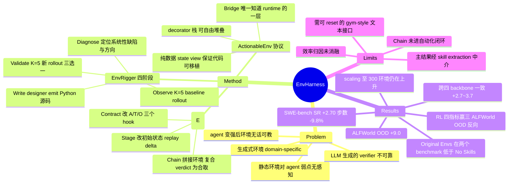

## Summary

EnvHarness 把 agent harness 的"外挂层"思路搬到 agent-environment loop 的另一侧：用 Stage / Contract / Chain 三类 plug-in component，只经由标准 `reset`/`step` 接口包装一个冻结的静态环境，改写初始状态、单步交互规则与多环境串接，而底层实现与人工编写的 verifier 完全不动。配套的 EnvRigger 把目标 policy 当黑盒，从 rollout 诊断行为缺陷、写出组件、再用新 rollout 验证接受与否。五个 benchmark 上相对 Original Envs 最高 +9.0 分（ALFWorld OOD），SWE-bench Verified 平均步数少 9.8%。

## Problem & Motivation

LLM agent 的学习信号来源正从静态语料转向可交互环境，但这些环境是手写死的：它们对具体 agent 的弱点一无所知，且在 agent 变强后很快无话可教。作者把这条局限拆成两点——缺乏针对特定 policy 弱点的定向信号，以及现有任务被解完后环境失去信息量。

针对这一点已有的解法是自动生成环境，作者指出它有两个结构性缺陷。其一，生成 pipeline 天然是 domain-specific 的：为 web navigation 写的生成器搬不到 programming 或 tool use，因为生成器必须伸进环境内部去构造 verifier。其二，正确性保障既贵又不可靠：环境与 verifier 都由 LLM 生成，实践中只能靠过量生成加重度过滤，仍不能保证正确。

EnvHarness 的 reframe 是：与其从零 authoring 新环境，不如把环境构造降为 wrapping 问题。只在接口层做变换，就同时买到两件事——domain-agnostic（一套实现跨 benchmark 复用）与 verifier 保真（原任务不动，原始人工 verifier 仍然有效）。

## Method

### EnvHarness：接口层的环境变换

论文把环境建模为 $E=(\mathcal{S},\mathcal{A},\mathcal{O},T,R,s_0)$，一个 EnvHarness component 就是 environment-agnostic 的变换 $w$，满足 $E'=w(E)$。$w$ 严格在接口层重塑环境，不修改底层 simulator backend，因此 ground-truth 评分逻辑被保留。

三类具体组件：

| 组件 | 形式 | 改动的量 | 作用 |
|:--|:--|:--|:--|
| **Stage** | $w_{\mathrm{stage},\delta}$，参数为动作序列 $\delta=(a_1,\dots,a_k)$ | 仅 $s_0$ | `reset()` 后把 $\delta$ 逐步 replay 过去，得到新的起始状态。可制造障碍（把 mug 藏进抽屉逼迫搜索），也可预先完成子目标以缩短 horizon |
| **Contract** | $w_{\mathrm{contract},r}$，参数为三元组 $r=(f_A,f_T,f_O)$ | $\mathcal{A}',\mathcal{O}',T'$ | 逐步改写动作空间、转移动力学与观测。用于强制动作前置条件、遮蔽/增广观测、对特定结果挂结构化反馈 |
| **Chain** | $w_{\mathrm{chain},\ell}$，参数为 $\ell=(E_{\mathrm{ext}},g)$ | $\mathcal{S}',\mathcal{A}',\mathcal{O}',T',R',s_0'$ | 用组合逻辑 $g$ 把两个环境拼成一个延长的 episode，空间取并集，$R'$ 为复合 reward |

组件共享同一接口因而可自由堆叠，$E'=w_{\mathrm{chain}}(w_{\mathrm{contract}}(w_{\mathrm{stage}}(E)))$，且明确指出堆叠不可交换（$w_1\circ w_2 \neq w_2\circ w_1$），嵌套顺序决定约束作用在初始化阶段还是交互阶段。

### 接口协议（Appendix C）——这是本文可复用的地基

抽象基类 `ActionableEnv` 固定了所有环境必须满足的 contract：Gymnasium 风格的 `reset(seed, options)` / `step(action)` → `EnvResponse`（Pydantic 包装的 5-tuple），外加 `evaluate()`、`observe()`、`get_env_state()`，以及 `save_state()` / `from_state()` 两个持久化方法。

两个设计决定值得单独记：

1. **`observe()` 与 `reset()` 刻意分离**。组件可能在 `reset` 返回后、policy 动作前修改环境，`observe()` 让外层不必再付一次 `reset` 的代价就能重读世界。
2. **`get_env_state()` 只暴露 runtime-safe 的纯数据视图**（无 Docker handle、browser page、socket），且这是组件 hook 唯一被允许读取的状态。这条限制正是生成代码可移植的原因——同一个 hook 既能跑在内存里的谜题上，也能跑在容器化仓库上。

三层结构：底层是 **Bridge**（benchmark 对 `ActionableEnv` 的直接实现，系统里唯一知道底层 runtime 的一层，共实现 7 个 Bridge 覆盖 4 类 runtime：纯内存算术游戏 Toy24、TextWorld 文字引擎、每实例 Docker 容器、Playwright 浏览器）；中层是 **decorator 栈**（`Rules(Setups(Toy24Bridge))` 仍是一个 `ActionableEnv`，policy 无法观察到底下叠了几层）；代码里三个组件类名为 `Setups` / `Rules` / `Link`。

`Rules` 的实现细节暴露了 designer agent 的实际产物形态：designer 直接 emit 一段 Python 源码（`_Rules(Rules)` 子类，重写 `filter_action` / `modify_transition` / `filter_observation` 三个 hook），组件的 saved state 就是这段源码字符串，加载时在只暴露抽象数据类型的 namespace 里重新编译，并在**每 episode 独立子进程**中执行，使得生成代码出错只崩一个 episode 而不是整个框架。被 block 的动作不触碰环境，返回重新观测并经 $f_O$ 过滤的当前状态加上 block 理由，保证拒绝不会把 policy 卡死。

`Link` 的复合判据是 $R'=R_A \wedge R_B$，两个因子各由对应子环境自己的 verifier 决定；它屏蔽子环境的终止信号、在 handoff 处惰性 reset $B$、在边界缓存各段结果避免重跑昂贵 scorer。因为 `Link` 只调用 `ActionableEnv` contract 内的东西，任意两个已注册环境都能链接，包括跨 benchmark 配对。

### EnvRigger：task-policy-conditioned 自动化

单个组件是 policy-agnostic 的（$w$ 只是环境的变换），但组件的选择与参数化必须同时依赖任务 $t$ 与 policy $\pi$ 的观测行为，于是定义 $E'=\mathcal{H}(E,t;\pi)=(w_k\circ\cdots\circ w_1)(E)$。EnvRigger 四阶段实现 $\mathcal{H}$：

- **Observe**：在当前环境上跑 $K=5$ 次 baseline rollout。失败暴露弱点，成功则界定弱点边界。prompt 里显式要求 designer 读三件事——policy 能否解、解法留下多少 headroom、实际用到环境的哪些部分。
- **Diagnose**：定位重复动作循环、长观测解析失败、误读工具约束等系统性成因，并决定改造方向。若 policy 已达满分，则诊断为"环境太宽容"，转向注入更难的场景。
- **Write**：合成一个或多个组件作为候选集，集合大小不设上限，整体接受或整体拒绝。
- **Validate**：用 $K=5$ 次新 rollout 判定，依据是聚合的成功率、失败分布与超时计数，绝不看单条轨迹。三种结果：接受、拒绝（不可解或不具挑战）、退回 Write 修订。write-validate 循环每实例最多 5 轮，超预算则该实例不产出组件。

Designer backbone 与 policy 同型，用以排除"从更强外部模型蒸馏"的解释。此外论文明确假设 base environment 在 validation 阶段支持确定性 reset，以保证 Stage 的初始状态可复现。

### 实验设置

主实验走 skill-based learning：在 EnvRigger 生成的环境中收集轨迹，按 ReasoningBank 抽取 skill，再在**原始未改造的** held-out 实例上评测带 skill 的 policy。训练与评测 episode 在每个 benchmark 上严格不相交。

Chain 被排除在主实验的自动 pipeline 之外（论文措辞是 EnvRigger "难以"观察被拼接环境的内部状态），单独在 Section 5 分析。

## Key Results

**主表（skill-based learning）**

| Skill Source | ALFWorld In-Dist | ALFWorld OOD | WebArena Avg | SWE-verified SR | SWE-verified Avg Step ↓ | OfficeQA EM | SpreadsheetBench Pass@1 |
|:--|--:|--:|--:|--:|--:|--:|--:|
| No Skills | 62.6 | 60.7 | 38.7 | 47.67 | 53.58 | 54.23 | 46.44 |
| Original Envs | 63.3 | 61.4 | 38.5 | 49.88 | 55.01 | 54.40 | 45.88 |
| Domain baseline | 63.3 (GenEnv) | 61.9 (GenEnv) | 39.6 (VeriEnv) | 50.12 (SWE-smith) | 54.72 | – | – |
| **EnvHarness** | **66.2** | **70.4** | **41.6** | **52.58** | **49.61** | **56.20** | **49.15** |

最有信息量的一行不是 EnvHarness，而是 Original Envs：在 WebArena（38.5 vs 38.7）与 SpreadsheetBench Pass@1（45.88 vs 46.44）上，从未改造环境抽出来的 skill **低于完全不给 skill 的 baseline**，在 SWE-bench 上还把轨迹拉长（55.01 vs 53.58）。这支撑了作者的核心论断——静态环境只让 agent 反复练它已经会做的事，抽出的往往是冗余或次优 skill。

**其余结果**

- **RL（Qwen3-8B-base + GRPO）**：ALFWorld in-dist 87.9 vs 81.4（+6.5），WebShop score 79.2 vs 75.6、SR 67.4 vs 66.0；但 ALFWorld OOD 反向，88.8 vs 89.6。四个指标中赢三个。
- **环境 scaling（SWE-bench Verified，Figure 5）**：同预算下 EnvHarness 从 47.67 爬到 54.79（+7.12）且在 300 个环境处仍在上升，原始环境只到 52.13、生成环境只到 50.37。这是全文最有说服力的一张图——两个 baseline 的环境批次独立于学习者抽取，而 EnvHarness 每批都针对已装备既有 skill 的 policy 合成。
- **Chain 单独效应（Table 5）**：Chain-only 的 SR 49.63 略低于 Original 的 49.88，但平均步数从 53.58 压到 41.96；与 Stage/Contract 合并后取得最佳 SR 54.30 与 43.12 步。
- **跨 backbone（Table 9 / Figure 6）**：Gemini 3.1 Flash-Lite / Qwen3.6 27B / Gemini 3.5 Flash / Claude Sonnet 4.6 四个 policy 上，EnvHarness skill 一致优于 original-env skill，幅度 2.7–3.7 绝对点，而 no-skill SR 跨度从 30.7 到 67.2。
- **算力对账（Table 11）**：EnvHarness 在 ALFWorld 上花 1.46M design token，GenEnv 只花 38K；但与同样在真实环境执行 rollout 的 VeriEnv 相比，WebArena 总 token 基本持平（137.3M vs 137.8M）。GenEnv 总量低 3.5×，代价是 rollout 由 LLM 模拟而非真实执行。
- **目标指标定向（Table 12）**：把 per-task SR 压进 [0.4,0.6] 的任务占比从 6.0% 升到 80.0%（mean SR 0.74 → 0.48），平均步数落进 [25,35] 的占比从 18.0% 升到 53.0%。
- **留一泛化（Table 10）**：ALFWorld 六类任务留一评测，EnvHarness 在 4/6 类上更优、均值 +3.1，`clean` 上 +16.4，但 `heat` 上倒退 8.7。

## Evidence Ledger

| Claim ID | Claim | Type | Source locator | Evidence excerpt | Status |
|:--|:--|:--|:--|:--|:--|
| C1 | ALFWorld OOD：EnvHarness 70.4 vs Original Envs 61.4，+9.0 | number | Table 2 | "Original Envs ... 61.4 ... EnvHarness Envs ... 70.4 ... Improvement ... +9.0" | source-verified |
| C2 | WebArena：Original Envs 38.5 avg 低于 No Skills 38.7 avg，EnvHarness 41.6 | number | Table 2 | "No Skills ... 38.7 2.3 \| Original Envs ... 38.5 3.1 \| ... EnvHarness Envs ... 41.6 1.8" | source-verified |
| C3 | SWE-bench Verified：SR 52.58 vs 49.88（+2.70）；avg step 49.61 vs 55.01（−5.40） | number | Table 3 | "Original Envs \| 49.88 \| 55.01 ... EnvHarness Envs \| 52.58 \| 49.61" | source-verified |
| C4 | Abstract 的 "9.8% fewer execution steps" 是相对 Original Envs 的 SWE-bench 步数降幅，非相对 No Skills | number | §1 + Table 3 | "achieving up to 9.0 points of improvement ... while using 9.8% fewer interaction steps (Table 3)" | source-verified |
| C5 | SpreadsheetBench：Original Envs Pass@1 45.88 低于 No Skills 46.44 | number | Table 3 | "No Skills ... 46.44 0.15 ... Original Envs ... 45.88 1.19" | source-verified |
| C6 | 主表为三次独立运行均值，且 SWE-bench SR / OfficeQA EM / WebArena Avg 三处增益均小于所报 std | number | Table 2/3 caption | 修正：仅 Table 2 caption 写明 "mean over three independent runs"，Table 3 caption 只说有 std 未说明重复次数；仅 OfficeQA EM 的 +1.80 同时小于两侧 std（1.84/2.34） | unsupported |
| C7 | EnvRigger 与 policy 在每个 benchmark 上同 backbone（ALFWorld/WebArena 用 Gemini-3.1-Flash-Lite，其余用 Gemini-3.5-Flash） | benchmark-setting | §4.1 | "EnvRigger and the policy agent utilize the same model backbone on each benchmark" | source-verified |
| C8 | 所有 baseline 共享 seed instance、环境数量、抽取 pipeline 与 policy model；skill 抽取遵循 ReasoningBank | benchmark-setting | §4.1, App. E.2 | "all baselines share the same seed instances, environment count, extraction pipeline, and policy model" | source-verified |
| C9 | 评测只在原始未改造任务上进行，训练/评测 episode 严格不相交 | benchmark-setting | §4.1, App. E.1 Table 7 | "evaluation uses only original, unreshaped tasks" | source-verified |
| C10 | Chain 被排除在主结果的自动 pipeline 外，因为 EnvRigger **无法**观察被拼接环境的内部状态 | benchmark-setting | §4.1 | 修正：原文措辞为 "difficult for EnvRigger to observe"，是"困难"而非"无法" | unsupported |
| C11 | 组件实现为 Gymnasium 风格抽象接口 ActionableEnv 上的 decorator，hook 只能读 runtime-safe 纯数据状态视图 | causal-mechanism | App. C.1/C.3 | "get_env_state() exposes a runtime-safe view ... the only state that component hooks are permitted to read" | source-verified |
| C12 | Chain(Link) 的复合判据为 $R'=R_A\wedge R_B$，各因子由对应子环境自身 verifier 决定 | causal-mechanism | App. C.3 | "The composite verdict is the conjunction R′=RA∧RB, each factor decided by the corresponding sub-environment's own verifier" | source-verified |
| C13 | RL（Qwen3-8B-base + GRPO）：ALFWorld in-dist 87.9 vs 81.4，WebShop 79.2 vs 75.6，但 ALFWorld OOD 88.8 低于 89.6 | number | Table 4, §5 | "87.9 compared to 81.4 ... 79.2 (versus 75.6) ... (88.8 versus 89.6)" | source-verified |
| C14 | 环境 scaling：EnvHarness 47.67 → 54.79（+7.12）@300 envs，vs 原始 52.13、生成 50.37 | number | Figure 5, §5 | "climbs from 47.67 to 54.79 (a 7.12-point gain) ... only 52.13 on original environments and 50.37 on generated ones" | source-verified |
| C15 | 跨四个 backbone，EnvHarness 一致优于 original-env skill，幅度 2.7–3.7 点，no-skill SR 跨度 30.7–67.2 | comparison | Figure 6, App. F.4 Table 9 | "outperform real environment skills on all four policies, by 2.7 to 3.7 absolute points" | source-verified |
| C16 | Token：ALFWorld design token 1.46M vs GenEnv 38K；WebArena 总量 vs VeriEnv 137.3M vs 137.8M；GenEnv 低 3.5× 但 rollout 为模拟 | number | App. G Table 11 | "1.46M vs. 38K on ALFWorld ... the totals are essentially the same (137.3M vs. 137.8M)" | source-verified |
| C17 | 目标指标定向：SR 落在 [0.4,0.6] 的任务占比 6.0% → 80.0%；avg step 落在 [25,35] 的占比 18.0% → 53.0% | number | App. G Table 12 | "raising in-band coverage from 6.0% to 80.0% ... coverage still rises from 18.0% to 53.0%" | source-verified |
| C18 | ALFWorld 留一泛化：4/6 类更优，均值 +3.1，clean +16.4，heat −8.7 | number | App. G Table 10 | "on four of the six types and by 3.1 points on average, with the largest gain of 16.4 points on clean" | source-verified |
| C19 | 论文明确列出局限：需要可 reset 的 gym-style 接口（排除 live-service 与物理机器人）、仅支持文本动作/观测、Chain 本文只用纯串行组合 | causal-mechanism | App. H | "EnvHarness assumes a reset/step interface over textual actions and observations ... excludes environments backed by a live service" | source-verified |
| C20 | 代码开源于 github.com/google-research/envharness，另有项目站 www.envharness.com | license-code | 标题页脚注 | "github.com/google-research/envharness      www.envharness.com" | source-verified |
| C21 | ALFWorld 上超过 GenEnv 均值 5.7 点、OOD 8.5 点；SWE-bench 上超过 SWE-smith 2.46 点且少 5.11 步 | comparison | §4.2 | "surpass GenEnv by 5.7 points on average and by 8.5 points in out-of-distribution settings" | source-verified |
| C22 | 9.0 点与 9.8% 两个 headline 数字来自不同 benchmark（分别是 ALFWorld OOD 与 SWE-bench Verified） | number | §1, Table 2/3 | "up to 9.0 points of improvement on held-out tasks (Table 2) while using 9.8% fewer interaction steps (Table 3)" | source-verified |
| C23 | SWE-bench 效率提升由"Contract/Stage 打断重复动作循环并过滤冗长观测"这一机制**被实验证实** | causal-mechanism | §4.2, Table 5 | 修正：原文为 "directly correlates with"，属解释性归因；无隔离该机制的消融，Table 5 只把 Chain 与 Stage/Contract 作为整组对比 | unsupported |

**降级说明**（独立 verifier 判定为 `unsupported`，正文已按修正后的表述改写）：

1. **C6** — 只有 Table 2 的 caption 写明"三次独立运行均值"，Table 3 的 caption 仅说明有 std 而未说明重复次数；把"三次独立运行"当作全部主表的属性是超出原文的。方差对比也只有 OfficeQA EM 成立：+1.80 同时小于两侧 std（1.84 / 2.34）；SWE-bench SR 的 +2.70 小于 EnvHarness 侧 std 2.72 但大于 Original 侧 2.59；WebArena Avg 的 +3.1 等于 Original 侧 std 3.1 而大于 EnvHarness 侧 1.8。正文只保留 OfficeQA 一例。
2. **C10** — 原文说排除 Chain 是因为 EnvRigger "难以"观察被拼接环境的内部状态，不是"无法"。正文已改用"难以"。
3. **C23** — 效率提升的机制归因是作者的解释（措辞 "directly correlates with"），不是被消融隔离的结论。正文已明确标为解释性归因并列入 Weaknesses。

## Strengths & Weaknesses

### 亮点

**抽象层次选对了，这是全文最硬的部分。** "只在接口层做变换"这一条约束同时买到三样东西：domain-agnostic（一套 loop 跨五个 benchmark，新增环境只需写一次轻量 Bridge）、verifier 保真（原任务与人工 scorer 不动，绕开了生成式环境的正确性难题）、以及组件的可组合性（decorator 栈，policy 观察不到底下叠了几层）。生成式环境路线为了造新任务必须伸进环境内部并自造 verifier，正确性成本就是从这里来的；EnvHarness 用"不造新任务、只改暴露给 agent 的那一层"绕开了整个问题。这是一个 simple 且 generalizable 的选择。

**`get_env_state()` 的纯数据视图约束是让 LLM 生成的组件代码可移植的真正机制。** 组件 hook 只能读无 runtime handle 的状态快照，所以同一段 designer 生成的 Python 既能跑在内存谜题上也能跑在容器化仓库上；配合"每 episode 独立子进程执行生成代码"，把 LLM 写错代码的爆炸半径限制在单个 episode。这两条对任何要让模型自己写环境侧代码的系统都是可直接照抄的地基。

**scaling 曲线与 token 对账两处主动排除了替代解释。** Figure 5 让三种来源共享同一环境预算、同一抽取与检索协议，只有 EnvHarness 的每批环境针对已装备既有 skill 的 policy 合成，结果是两个 baseline 在 300 环境处已平掉而它仍在上升——这比主表任何单点差值更能支撑"针对学习者当前能力边界"这个论点。Table 11 则主动回答了"是不是靠多花算力赢的"：与同样真实执行 rollout 的 VeriEnv 相比总 token 基本持平。

**Appendix G 的 objective metric targeting 是对"难度漂移"最直接的回应。** 能把 per-task SR 从强双峰（多数任务要么恒解要么恒不解，mean 0.74）压进 [0.4,0.6] 并使 in-band 覆盖率从 6% 升到 80%，说明"难度校准"在这套系统里是被显式控制、可测量的目标量，而不是改造过程的不受控副作用。

### 局限

**1. 效应量小，且缺显著性检验。** 除 ALFWorld OOD 的 +9.0 外，主表增益普遍是个位数点：SWE-bench +2.70、OfficeQA EM +1.80、SpreadsheetBench Mean Score +1.01。OfficeQA EM 的 +1.80 同时小于两侧标准差（1.84 / 2.34）。论文没有报任何显著性检验，Table 2 说明是三次独立运行均值，Table 3 的 caption 只说有 std 而未交代重复次数。

**2. 效率提升的因果归因是解释而非消融。** 论文把 SWE-bench 步数下降归给"针对性的 Contract 与 Stage 打断重复动作循环、过滤冗长观测"，措辞是 "directly correlates with"。唯一相关的消融（Table 5）只把 Chain 与 Stage/Contract 作为两组来分，没有隔离"打断循环"或"过滤观测"这两条具体机制。这是全文归因最弱的一处。

**3. 更根本的混淆：主结果的因果链上挂着一层 skill extraction。** 所有主表比较都走"环境 → 轨迹 → ReasoningBank 抽 skill → 带 skill 的冻结 policy"这条链，测的是"从改造环境里抽出的 skill 更好"，而不是"改造环境本身更好"。环境改造的贡献与 skill 抽取/检索对不同轨迹分布的敏感性没有被分开。作者用 baseline 共享抽取 pipeline 来控制这一点，这排除了 pipeline 差异，但排除不掉"轨迹分布变了导致抽取器表现变了"这条通路。Table 4 的 RL 实验是唯一绕开 skill 层的证据——但只覆盖两个环境、四个指标，其中 ALFWorld OOD 一项还是反向的（88.8 vs 89.6，作者称之为 negligible）。想主张"harness 提供更好的优化信号"，RL 这条线的证据密度明显不够。

**4. 主结果实际只验证了三个组件里的两个。** Chain 被排除在自动 pipeline 之外（EnvRigger 难以观察被拼接环境的内部状态），而单独用 Chain 时 SR 反而略降（49.63 vs 49.88），只有与 Stage/Contract 合并才拿到最佳 54.30。也就是说三组件里最"新"的那个，恰恰是唯一没能进自动化闭环、且单独使用时不涨主指标的。

**5. 接口假设是硬边界，而且正好卡在本 vault 关心的方向上。** 作者自己列明：binding constraint 是 `reset`——Stage 要把环境置入选定初始状态、Chain 要在子任务间回到已知状态，两者都预设环境可被恢复而非只能前进。这排除了 live service 后端（已发出的邮件、已下的单不可撤销）与物理机器人。对 GUI / computer-use 环境，Stage 的"replay 动作序列到目标初始状态"这一实现路径在真实浏览器或 OS 上不成立：副作用不可逆、转移非确定。论文把 visual / GUI / embodied 明确列为 future work，所以不能把这套结论直接外推到 GUI agent 环境。

**6. Designer 能力上限即 policy 能力上限，而跨模型结果对此的解释未被检验。** 同 backbone 的设定干净地排除了蒸馏更强模型，但也意味着诊断质量受限于被诊断者。跨模型实验显示增益幅度与 policy 强度基本无关（一律 2.7–3.7 点，尽管 no-skill SR 从 30.7 跨到 67.2），这其实有点反直觉——若诊断质量随 backbone 变强，增益应当呈现系统性变化。作者的解释是"能力等级改变的是诊断的内容而非 loop 的适用性"，说法可信但没有被任何实验检验（比如交叉配对强 designer + 弱 policy）。

**7. 泛化并非一致。** ALFWorld 留一评测里 `heat` 类倒退 8.7 分，说明改造环境抽出的 skill 不是均匀地更 general；作者只解释了正例（"把 policy 推离记忆化套路"），没有解释这个回归。

### 对领域的意义

把环境构造从 authoring 问题 reframe 为 wrapping 问题，这一步比论文里任何一个数字都重要。它意味着环境供给的边际成本不再是"写一个新环境 + 写一个新 verifier"，而是"在已有 benchmark 上叠一层组件"，且 verifier 免费继承。如果这个 reframe 站得住，环境规模化的瓶颈就从"造环境"移到了"诊断 policy 弱点"——而后者是可以用同一个模型自举的。

## Mind Map

## Notes

- **与本 vault 主线的关系**：这是 [[Topics/AgentHarness-Design]] 三条设计轴的对偶面——那边研究"怎么给冻结的模型加外挂层"，这边研究"怎么给冻结的环境加外挂层"。论文 Figure 2 和 Table 1 明确把两者并置。对 [[Projects/AFE-MiniSuite]] 而言，Appendix C 的三层协议（Bridge / decorator stack / data-only state view）是可以直接照搬的地基，尤其是"组件 hook 只能读纯数据状态视图"这条约束——它是让 LLM 生成的环境侧代码跨 runtime 复用的必要条件，而不只是工程洁癖。
- **与 [[2512-GenEnv|GenEnv]] 的对照**：GenEnv 是本文在 ALFWorld 上的直接 baseline（62.6 avg vs EnvHarness 68.3）。两者的分歧点是"新任务从哪来"：GenEnv 用 simulator model 生成难度对齐的新任务，EnvHarness 不造新任务、只改暴露面。Table 11 的 token 分解给出了这个分歧的代价结构——GenEnv 总量低 3.5× 但 rollout 是模拟的，EnvHarness 多花的钱花在"真实执行 + 可信 verifier"上。
- **待查**：论文声称 Stage 的 replay 会调用 `notify_replay_complete()` 让内层环境回退 per-episode 计数（step budget、重复动作守卫），这意味着 Stage 制造的"障碍"不计入 policy 的步数预算。这个设计在与 baseline 比较 average step 时是否引入不对称？主表的 average step 是在**原始未改造**任务上测的，所以不直接受影响，但值得在读 repo 时确认。→ 适合另起一轮 `repo-digest`。
- **一个可追的缺口**：全文最弱的一环是"环境改造的效果"与"skill 抽取的效果"没被分开（见 Weaknesses 3）。一个干净的实验是固定 skill bank 只换环境、或固定环境只换抽取器，做 2×2。作者没做，而这恰好是环境侧 harness 研究里最容易被含糊过去的地方。
- **对 GUI 方向的边界**：作者把 visual / GUI / embodied 明确列为 future work，且 `reset` 依赖对真实浏览器/OS 不成立。若要把这套抽象搬到 computer-use 环境，Stage 需要一个不依赖动作 replay 的状态构造机制（快照/虚拟机 checkpoint），这本身就是一个独立问题。
