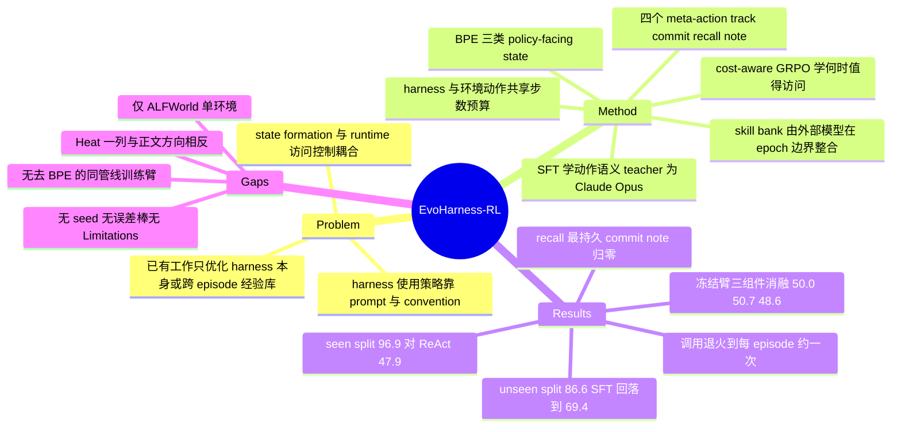

## Summary

EvoHarness-RL 把 agent 对 external harness state 的读写变成可训练的动作：将异构 harness 抽象为 Belief / Progress / Experience 三类 policy-facing state 与 track / commit / recall / note 四个 meta-action，先用 Claude Opus teacher 轨迹做 SFT 教会动作语义，再用 cost-aware GRPO 学「何时值得付一步代价去访问外部 state」。在 ALFWorld seen split 上 Qwen3-8B 达 96.9% 平均成功率（ReAct 基线 47.9%），unseen split 86.6%，且训练收敛后 harness 调用退火到约每 episode 一次。

## Problem & Motivation

Long-horizon agent 越来越依赖 external harness（memory、tool、state tracker、verifier、execution log）来维持状态、跟踪进度、复用经验。作者把「有效使用 harness」拆成两个耦合问题：**从 noisy interaction trace 中形成 state**，以及 **runtime 对 external-state 访问的控制**。

现有做法把两者都交给 prompt、heuristic 或 domain convention——external workspace 和它的使用策略都是手工工程出来的。文章把已有工作分成两支并各指一个缺口：harness engineering 一支（Harness-1、Meta-Harness、HarnessX、AutoHarness）把 harness 当作**环境侧构件**或离线搜索/trace 驱动适配的对象；self-evolving agent 一支（Reflexion、Voyager、SkillOS）只优化**跨 episode 的经验库**，与 episode 内的 belief / progress 维护是分离的。两支都没有触及的是：agent 自己的 runtime harness 使用策略从未被训练过——"agent 被有用的外部支持包围，却很少被训练去决定何时形成、访问、更新、整合这些支持"。

## Method

### BPE 统一抽象

每步渲染 $\mathcal{H}_t=(B_t,P_t,E_t)$：

| 角色 | 内容 | 对应失败模式 |
|:--|:--|:--|
| Belief $B_t$ | 从交互推断的任务相关事实：物体状态、位置、空间关系 | 丢失「当前环境里什么为真」 |
| Progress $P_t$ | subgoal-status 记录 $(g_i,\sigma_i)$，可见已尝试 / 待办 / 受阻 | 忘记做过什么、下一步该做什么 |
| Experience $E_t$ | 跨 episode 的 skill、failure mode、search prior、高层策略 | 反复重新发现同样的流程与错误 |

### Agent-Harness 动作协议

$\mathcal{A}_{\mathrm{bpe}}=\{\text{track},\text{commit},\text{recall},\text{note}\}$，与环境动作合并为 $\mathcal{A}=\mathcal{A}_{\mathrm{env}}\cup\mathcal{A}_{\mathrm{bpe}}$。两类动作**共享同一步数预算**（$T_{\max}=70$），这是本文成本机制的地基：harness 调用不是免费附加物。

### ALFWorld 环境适配器（关键：几乎全部 deterministic）

- **Belief / track**：rule-based 的 action–observation parser 在后台更新物体状态标志与 object-location 关系，**不调 LLM**；state 默认不暴露，policy 只能主动发 `track[object]` 或 `track[world]` 读取。
- **Progress / commit**：上限 8 条的 committed subgoal 列表，仅在 policy 发 `commit` 时更新。
- **Experience / recall + note**：四类 skill store（general / task-specific / common mistakes / object-location search priors），每类容量 80，keyword-overlap 检索（top-3/类），LFU 按 usage count 淘汰。`recall` 会顺带增加被检条目的使用计数；`note` 只写入临时 buffer。

### 两阶段训练

1. **Supervised harness fine-tuning**：Claude Opus teacher 用同一 BPE 接口在 500 局 ALFWorld 训练游戏上跑，只保留成功 episode，得到 87 条轨迹 / 1,153 个 next-action 对，平均 26.5 turn。Teacher 共 405 次 harness call（约占全部 turn 的 18%，分布 commit 202 / recall 114 / note 55 / track 34）。目标格式 `<think>...</think><action>...</action>`。
2. **Cost-aware GRPO**：
   $$R(\tau)=R_{\mathrm{succ}}+\lambda_{\mathrm{eff}}R_{\mathrm{eff}}+\lambda_{\mathrm{div}}(u)R_{\mathrm{div}}-\lambda_{\mathrm{spam}}R_{\mathrm{spam}}-\lambda_{\mathrm{inv}}R_{\mathrm{inv}}$$
   其中 $R_{\mathrm{succ}}=10\cdot\mathbf{1}[\text{solved}]$；效率项 $R_{\mathrm{eff}}=\max(0,1-|\tau|/T_{\max})$ **仅在成功时发放**，因而天然惩罚冗余 harness 查询；多样性项按 cosine 从 $\lambda_{\mathrm{div}}^{\max}=0.5$ 退火到 0，早期鼓励探索 harness 动作、后期强制专精。group size 8、150 epoch、lr $1\times10^{-6}$、KL 系数 0.01、8×H200。
3. **Experience 演化在 rollout 之外**：rollout 期间 skill store 冻结，note buffer 与轨迹摘要只累积；epoch 边界由外部 Claude Opus consolidation model 执行 add / update / remove。

## Key Results

**Table 1（ALFWorld seen split，140 任务，SR %）**

| 方法 | Backbone | Pick | Look | Clean | Heat | Cool | Pick2 | Avg | Δ |
|:--|:--|--:|--:|--:|--:|--:|--:|--:|--:|
| ReAct | Claude Opus 4.5 | 100.0 | 92.3 | 96.3 | 100.0 | 88.0 | 100.0 | 96.4 | – |
| + EvoHarness-Base | Claude Opus 4.5 | 100.0 | 100.0 | 100.0 | **93.8** | 96.0 | 100.0 | 98.5 | +2.1 |
| ReAct | GPT-4.1 | 82.9 | 61.5 | 44.4 | 43.8 | 4.0 | 41.7 | 47.9 | – |
| + EvoHarness-Base | GPT-4.1 | 82.9 | 61.5 | 63.0 | 75.0 | 72.0 | 62.5 | 70.0 | +22.1 |
| ReAct | GPT-5 | 74.3 | 53.8 | 48.1 | 62.5 | 60.0 | 58.3 | 60.7 | – |
| + EvoHarness-Base | GPT-5 | 97.1 | 76.9 | 85.2 | 93.8 | 88.0 | 62.5 | 85.0 | +25.7 |
| ReAct | Qwen3-8B | 78.1 | 46.2 | 33.3 | 37.5 | 29.3 | 47.2 | 47.9 | – |
| GRPO | Qwen3-8B | 87.5 | 71.4 | 72.7 | 70.0 | 48.1 | 43.5 | 65.6 | +17.7 |
| SkillOS† | Qwen3-8B | 95.2 | 71.8 | 74.1 | 72.9 | 77.3 | 77.8 | 80.2 | +32.3 |
| SkillRL‡ | Qwen2.5-7B | 97.9 | 71.4 | 90.0 | 90.0 | 95.5 | 87.5 | 89.9 | +42.0 |
| **EvoHarness-Base** | Qwen3-8B（冻结） | 71.4 | 53.8 | 63.0 | 50.0 | 48.0 | 41.7 | 56.4 | +8.5 |
| **EvoHarness-SFT** | Qwen3-8B | 80.0 | 53.8 | 88.9 | 75.0 | 40.0 | 62.5 | 68.6 | +20.7 |
| **EvoHarness-RL** | Qwen3-8B | 100.0 | 92.9 | 95.5 | 100.0 | 92.6 | 100.0 | **96.9** | +49.0 |

†/‡ 为 SkillOS / SkillRL 原文报告值，非本文重跑。冻结基线 ExpeL 49.3 / ReasoningBank 55.7 / MemP 49.7 / Dynamic Cheatsheet 52.1 / ACE 51.4 / SkillOS-base 53.1。

**Table 2（BPE 组件消融——只在冻结的 inference-time harness 上做）**

| 变体 | Pick | Look | Clean | Heat | Cool | Pick2 | Avg |
|:--|--:|--:|--:|--:|--:|--:|--:|
| EvoHarness-Base（完整 BPE） | 71.4 | 53.8 | 63.0 | 50.0 | 48.0 | 41.7 | 56.4 |
| w/o Belief | 74.3 | 53.8 | 40.7 | **75.0** | 20.0 | 37.5 | 50.0 |
| w/o Progress | 68.6 | 53.8 | 44.4 | **68.8** | 32.0 | 37.5 | 50.7 |
| w/o Experience | 65.7 | 53.8 | 40.7 | **62.5** | 28.0 | 41.7 | 48.6 |

注意 Heat 一列：三个消融臂全部**高于**完整 BPE。96.9% 的 EvoHarness-RL 策略本身没有任何组件消融。

**Table 3（unseen split，134 任务）**：ReAct 50.0 → EvoHarness-Base 77.6 → EvoHarness-SFT **69.4**（低于 prompt-time）→ EvoHarness-RL 86.6。作者解释 SFT 回落是因为模仿 teacher 的 harness 使用模式而未优化「在新环境里访问是否值得」。

**训练动态**：GRPO 过程中 harness 调用从 SFT 初始的高频快速下降并稳定在约**每 episode 一次**；动作级看，`recall` 最持久，`commit` 与 `note` 迅速衰减到接近零，`track` 居中。同期训练 reward 全程高于 standard GRPO。Skill bank 早期快速扩张、后期通过合并与淘汰趋于紧凑。

## Evidence Ledger

| Claim ID | Claim | Type | Source locator | Evidence excerpt | Status |
|:--|:--|:--|:--|:--|:--|
| C1 | ALFWorld 140 任务 seen split 上 EvoHarness-RL (Qwen3-8B) 96.9%，比 ReAct 基线 47.9% 高 +49.0 | number | §3.2 / Table 1 | "EvoHarness-RL on Qwen3-8B achieves state of the art performance with a 96.9% average success rate, yielding a +49.0 absolute improvement" | source-verified |
| C2 | 同 split 上 EvoHarness-Base 56.4%、EvoHarness-SFT 68.6% | number | §3.2 / Table 1、Table 2 | "The progression from prompt time scaffolding (56.4%) to SFT (68.6%) and finally GRPO (96.9%)" | source-verified |
| C3 | SkillOS 80.2 / SkillRL 89.9 为原论文报告值而非本文重跑；standard GRPO 65.6 | benchmark-setting | Table 1 caption + rows | "†/‡ indicate results reported by SkillOS/SkillRL, respectively." | source-verified |
| C4 | prompt-time BPE 使 GPT-4.1 +22.1、GPT-5 +25.7，而 Claude Opus 4.5 仅 +2.1 且 Heat 从 100.0 掉到 93.8 | number | Table 1 frontier block + §3.2 | "boosting GPT-4.1 by +22.1 and GPT-5 by +25.7" | source-verified（原文算术不一致：85.0−60.7=24.3≠+25.7，Table 1 其余 Δ 均自洽） |
| C5 | Table 2 的 B/P/E 消融只作用于冻结的 inference-time harness（56.4% 基），不覆盖训练后策略 | benchmark-setting | Table 2 caption + rows | "the bottom block removes one component at a time from the Qwen3-8B inference time harness" | source-verified |
| C6 | Table 2 中三个消融臂的 Heat 分数（75.0 / 68.8 / 62.5）全部高于完整 BPE（50.0），与正文「去 Experience 重创 Heat」方向相反 | number | Table 2 Heat 列 + §3.3 | "yielding the lowest overall average success rate (48.6%) and heavily impacting complex state-change tasks like Heat" | source-verified |
| C7 | unseen split：ReAct 50.0 / Base 77.6 / SFT 69.4 / RL 86.6，SFT 低于 prompt-time | number | Table 3 + §3.4 | "the prompt-time BPE harness improves zero-shot performance to 77.6% ... EvoHarness-SFT drops to 69.4%" | source-verified |
| C8 | harness 动作空间恰为 track / commit / recall / note 四个；全文未定义 rollback、snapshot、fork 或 verify / audit affordance | causal-mechanism | §2.2 Eq.(2)、§2.3、附录 10.1 | "The system prompt below defines both the environment action set and the four harness meta-actions {commit, track, recall, note}" | source-verified |
| C9 | skill bank 的 add / update / remove 由 rollout 之外的 Claude Opus consolidation model 在 epoch 边界执行；Claude Opus 同时是 SFT teacher | benchmark-setting | 附录 9 "Model roles"、附录 10.2 | "We use Claude Opus as the teacher for SFT trajectory collection and as the consolidation model for the experience store." | source-verified |
| C10 | GRPO 后 harness 调用退火并稳定在约每 episode 一次；recall 最持久，commit / note 衰减至近零 | number | §4.1 + Fig.3、附录 7 + Fig.5 | "usage drops quickly and stabilizes near one call per episode"; "Recall remains the most persistent action" | source-verified |
| C11 | 全文无「同一 SFT+GRPO 管线但去掉 BPE」的对照臂；无 seed、无误差棒 / CI / 显著性检验、无 token 或步数配平对照、无 Limitations 节 | negative / methodology | §3.1 Baselines + 全文关键词扫描 | verifier 报告："no random seeds ... no error bars, std, CIs, or significance tests ... no Limitations section"；最接近的仅为 standard GRPO 65.6，非同管线去 BPE | source-verified |
| C12 | SFT 数据：500 局训练游戏取成功 episode → 87 轨迹 / 1,153 pair，平均 26.5 turn；teacher 405 次 harness call 约占 18% turn | number | 附录 9 | "This yields 87 trajectories and 1,153 next-action conversation pairs, with an average length of 26.5 turns per episode." | source-verified |
| C13 | 接收于 LLA@COLM 2026；2026-08-05 提交；机构为 UIUC 与 Meta AI；全文未提供代码库链接 | license-code | arXiv abs 页 Comments / Submitted 行 + HTML 作者块 | "Comments: Accepted to LLA@COLM 2026"; "[Submitted on 5 Aug 2026]" | source-verified |
| C14 | 论文从未给出 seen / unseen split 的家族题数；冻结臂的 Avg 不是家族未加权均值（Base 家族均值 54.65 vs 报告 56.4） | benchmark-setting | Table 1 + §3.1 | "success rate on the standard validation set as Ouyang et al. (2026)"；唯一给出的家族计数属 SFT 训练集 | source-verified |
| C15 | 关键超参：$T_{\max}=70$、progress 上限 8、experience 每类 80 + LFU、recall top-3、GRPO group 8、150 epoch、lr 1e-6、KL 0.01、8×H200；belief tracker 为 rule-based 不调 LLM | number | 附录 9 + Table 4 | "The belief tracker is a rule-based parser over action–observation pairs ... without an LLM call." | source-verified |

## Strengths & Weaknesses

**Strengths**

- **问题切得准**：整个 harness 文献都在优化 harness 本身（结构、内容、版本），本文指出真正没人碰的是**策略侧的使用决策**。这是一个 first-principles 式的重新切分，不是又一个组件。
- **成本机制内生而非外挂**：harness 动作与环境动作共享同一步数预算，效率奖励只在成功时发放。相比 [[Papers/2606-SkillMemoryBudget]] 揭示的「memory/skill 模块在 token-matched 对照下增益被追平」，本文至少在**步数**这一维上把成本写进了优化目标，而不是把组件当免费附加物。副作用是 Table 2 的降幅方向偏保守——去掉一个组件反而释放步数给环境动作，因此观察到的下降是下界。
- **动作级退火曲线是这篇里最有信息量的东西**：训练收敛后 `recall` 存活、`commit` 与 `note` 归零、`track` 居中。这给出了「哪类 external state 在策略内化之后仍有边际价值」的一个直接读数，而整个 harness 文献几乎没有这类可测量量。作者也没有过度推广，明确写了这个分布是 environment-dependent。
- **frontier block 的设计干净**：同一 harness、同一 benchmark、只换 backbone，三个模型给出三个增益点，是难得的受控横截面。

**Weaknesses**

- **归因不可分离，且这次的混淆特别重**。没有「同管线 SFT+GRPO 但去掉 BPE」的臂（C11）。最接近的 standard GRPO 65.6% 同时缺 SFT 初始化、缺 Opus 轨迹蒸馏、缺 BPE，是三重变更。而三条本文自己的数据把这个缺口顶成了核心问题：(i) 收敛后 harness 只用约 1 次/episode（C10），而 SFT teacher 是 18% 的 turn ≈ 4.7 次/episode（C12），推理期 harness 的信息注入量降了近 80%；(ii) SFT teacher 是 Claude Opus，其自身 ReAct-only 在同一 split 上就有 96.4%（C4），学生最终 96.9% 与教师基线几乎相等；(iii) 论文对 annealing 的解读是「内化」，但「harness 只是训练期 curriculum、推理期贡献接近零」是同样兼容全部现有数据的读法。用本文数据无法区分这两者。
- **Table 2 与正文冲突**。正文说去掉 Experience "heavily impact[s] ... Heat"，但表里三个消融臂的 Heat 都比完整 BPE 高（C6）。正文说去 Progress 对 Pick2 这类依赖型任务 "disproportionately degrades"，实测 Pick2 上 w/o Progress 与 w/o Belief 同为 37.5（各 −4.2），远小于 Cool 的 −16.0。按标准 seen-split 家族容量，Heat 只有 16 题，50.0→75.0 只是 4 题之差；全文无 seed、无误差棒、无显著性检验（C11），这些方向性解读没有统计支撑。
- **评测口径存疑（本笔记推算，非原文陈述）**。verifier 独立确认全文从未披露 seen split 的家族题数（C14）。按标准 ALFWorld seen 容量（Pick 35 / Look 13 / Clean 27 / Heat 16 / Cool 25 / Pick2 24 = 140）反算：ReAct Qwen3-8B 各族分数可在 3 次 run 下精确还原、EvoHarness-Base 可在 1 次 run 下精确还原（79/140 = 56.43），两者的 Avg 都是**题数加权**；但两个可训练行还原不出来——EvoHarness-RL 的 Look 92.9、Clean 95.5、Cool 92.6 在 1–3 run 假设下都不是任何 $k/n$（分别更像 13/14、21/22、25/27），GRPO 行六族全部如此。而且 96.9 恰等于六族**未加权**均值 96.83，而题数加权应为 97.1。两个可训练行与冻结行很可能不在同一评测口径上。这不推翻结论方向（+49.0 的量级远超这些差异），但让跨行比较和 "state of the art" 的精度打折。
- **"state of the art" 站不住**。本文把 SkillRL（89.9）当最强对手，但 [[Papers/2605-Skill1]]（2026-05，Qwen2.5-7B）在 ALFWorld 上报 97.5%、并引 RetroAgent 94.9%，本文均未引。公平地说，Skill1 的 per-family 数字（如 Look 98.6）同样无法用标准家族容量还原——所以更稳妥的结论不是「本文不是 SOTA」，而是 **ALFWorld 上这批 95%+ 的数字彼此不可比**：backbone、split 容量、聚合口径三层都没对齐，这个 benchmark 已经不能承载 SOTA 声明。
- **单环境**。只有 ALFWorld：纯文本、6 个任务族、动作由 ADMISSIBLE COMMANDS 枚举、belief tracker 可以 rule-based 写死。BPE 的通用性主张（"环境适配器换掉、接口不变"）在第二个环境上一次都没被检验，而附录 7 自己承认动作分布是 environment-dependent。
- **Experience 采纳没有验收判据**。skill bank 的 add / update / remove 完全由 Claude Opus 读 note 文本自行决定（C9），加 LFU 淘汰，无 held-out 验证。这恰好是 [[Papers/2605-GRASP]] 与 [[Papers/2606-SkillNb]] 证明 gate 承重的配置（持久且跨任务复合的产物），本文未测。
- 无 Limitations 节，无代码（C11、C13），+25.7 存在算术不一致（C4）。

**Impact**：给 harness 文献补上了缺失的「可训练策略」一臂，这个 framing 值得跟进。但作为该方向的基石证据它还不够——需要 harness-free 训练对照与至少第二个环境。

## Mind Map

## Notes

### (a) 学到的 harness policy 究竟控制哪些 external-state 操作

**恰好四个 meta-action，两读两写，全部单调累加**（C8）：

| 动作 | 方向 | 目标 | 谁真正控制 |
|:--|:--|:--|:--|
| `track[object]` / `track[world]` | 读 | Belief | policy 只有读权；写由 rule-based parser 后台完成 |
| `commit[subgoal]` | 写 | Progress | policy 直接写，上限 8 条 |
| `recall[query]` | 读 | Experience | policy 读，keyword-overlap 检索 top-3/类 |
| `note[insight]` | 写 | Experience buffer | policy 只写进临时 buffer，**不决定是否采纳** |

**不含 rollback、snapshot / checkpoint、fork / branch，也不含任何 verify / audit affordance**（C8，verifier 独立核查 §2.2、§2.3 与附录 10.1 运行时 prompt 后确认）。这是它与本 vault harness 主线最大的结构差异：[[Papers/2608-LongHorizonHarness]] 的 read-only auditor、[[Papers/2607-StateAct]] 的 finish gate、[[Papers/2607-HarnessBank]] 的 2σ 验收 gate、[[Papers/2606-SkillNb]] 的执行式 gate，在 EvoHarness-RL 里全都没有对应物。它选择的是**纯 state-formation + access-control** 这条轴，把验证轴整个删掉了。

更值得注意的是写权限的分配：真正决定 skill bank 内容的 add / update / remove 由 rollout 之外的 Claude Opus consolidation model 在 epoch 边界执行（C9），再叠加按 usage count 的 LFU 淘汰。也就是说，**被训练的那个策略并不控制 Experience 的持久化**——它只提交证据，不决定采纳。Belief 同理：policy 只有读权。真正 policy-controlled 的写只剩 `commit`（8 条上限的 subgoal 列表）和 `note`（buffer）。所以「学习 harness policy」的实际范围比标题窄：学的主要是**何时读**，以及**何时提交一条待审证据**。

按 [[Topics/Harness-Component-Attribution]] 的两轴定位：Experience 是跨 episode 持久且会复合的产物（高持久性），采纳判决由异族模型（Opus vs Qwen3-8B）做（中等独立性剂量），但**没有任何 held-out 验收判据**。这正是 GRASP 与 SkillNb 证明闸门承重的那个格子，而本文未测。

### (b) 有没有做组件级归因

**有，但只覆盖 prompt-time 冻结臂**（C5）。Table 2 逐一移除 Belief / Progress / Experience，全部在 56.4% 的 EvoHarness-Base 上做；**96.9% 的 EvoHarness-RL 策略没有任何消融**。

缺的关键对照臂是「同样的 SFT+GRPO 管线但去掉 BPE」——verifier 全文扫描确认不存在（C11）。这个缺口在本文里比在多数 harness 论文里更致命，理由已在 Weaknesses 展开：退火到约 1 次/episode + teacher 自身 ReAct 就有 96.4%，两条一起使得「增益来自 harness」与「增益来自 Opus 蒸馏 + GRPO，harness 只是训练期 curriculum」无法区分。

这个实验在本文献里是标准操作而非苛求：[[Papers/2607-SESA]] 就做了 SESA-Off（训练时用 skill bank、推理时关掉），并据此得出「大部分增益已进入策略参数」的结论。EvoHarness-RL 只要在 96.9% 的 checkpoint 上关掉 $\mathcal{A}_{\mathrm{bpe}}$ 再跑一遍 seen split 即可，属 [[Topics/Harness-Component-Attribution]] 分层里的 **L1 空白**——不需要新方法，只需重跑现有 setup。第二个同级空白是把 Table 2 的三臂消融搬到 RL checkpoint 上重做。

同时应当承认它比 [[Papers/2606-RecursiveAgentHarness]]（明确声明不做消融）走得远：至少在冻结臂上给了三个组件的独立移除，且降幅方向保守。

### (c) 与已有笔记的证据是否一致或冲突

**一致（四条）**

1. **增益与基线质量负相关**——[[Topics/Harness-Component-Attribution]] §4 的收敛发现在这里以更干净的形式复现：同一 harness、同一 benchmark、只换 backbone，ReAct 47.9 的 GPT-4.1 得 +22.1，60.7 的 GPT-5 得 +25.7，而 96.4 的 Claude Opus 4.5 只得 +2.1，且 Opus 的 Heat 一族从 100.0 掉到 93.8（C4）。「在已成功轨迹上净效应为负」在这里拿到了一个家族级的具体实例，和 [[Papers/2605-TeamBench]] 的五分位分层、[[Papers/2608-LongHorizonHarness]] 的 Desktop 域 mean score 反降同型。**建议把这一行加进该 Topic 的证据矩阵**。
2. **bundle 级增益的结构性特征**——与 [[Papers/2606-RecursiveAgentHarness]]、[[Papers/2608-LongHorizonHarness]] 同型：主结果是 bundle，归因留给读者。
3. **预算维度**——[[Papers/2606-SkillMemoryBudget]] 证明 token-matched vanilla 会追平 memory/skill 增益。本文在**步数**维上做了内生控制（共享 $T_{\max}=70$、效率奖励只在成功时发），这是相对该文献的一个方法学优点；但主结果（96.9 vs 65.6）仍无任何 token 或步数配平对照（C11）。
4. **「自演化」的增益常来自上下文保留而非可复用抽象**——[[Papers/2608-ContinualSkillBench]] 测得纯 in-context learning 与显式 skill 维护几乎持平（0.605 vs 0.602）。本文 Figure 4 只给 skill bank 规模与构成的演化曲线，没有「skill bank 冻结 vs 演化」的对照臂，因此 harness evolution 这条 claim 与 ContinualSkillBench 的否定性结果之间还没有可比证据。这是第三个 L1 空白。

**冲突 / 需保留（两条）**

5. **"state of the art" 与 vault 证据冲突**：[[Papers/2605-Skill1]] 在 ALFWorld 上报 97.5%（Qwen2.5-7B，2026-05），并引 RetroAgent 94.9%；本文均未引，且把 SkillRL 89.9 当最强对手。但 Skill1 的 per-family 数字同样无法用标准家族容量还原，所以正确的结论是**双向的**：ALFWorld 这批 95%+ 数字彼此不可比，该 benchmark 已不足以支撑 SOTA 声明。这一点也波及 [[Papers/2606-LatentSkill]]（同 Qwen3-8B、seen 74.3%）与 [[Papers/2601-MemRL]] 等 vault 内其他 ALFWorld 结果的横向引用——**后续任何跨论文的 ALFWorld 数字比较都应先核对 split 容量与聚合口径**。
6. **验证轴的缺席是个可预测的风险，而非中性设计选择**：[[Papers/2606-CodeSelfReviewCollapse]] 的 Theorem 2.3 说明同源信号门控退化为不门控；[[Papers/2605-TeamBench]] 测得同能力层验证者假接受 49.4%。EvoHarness-RL 的 consolidation model 是 Opus 而 policy 是 Qwen3-8B，属**异族**（中等独立性剂量），这一点比 LongHorizon-Harness 的同模型 auditor 强；但它完全没有 held-out 判据，采纳与否只靠 LLM 读 note 文本判断。与 [[Papers/2606-SkillNb]] 去 gate 后回归率从 3.3% 爆到 18.6% 对照，本文既没测 consolidation 的判决质量，也没测 skill bank 里 stale/错误条目的比例——附录 8 的 case study 恰好展示了一条被 recall 出来的**错误** prior（kettle 在 countertop，实际在 stoveburner），作者把它当作 self-correction 的正面例证，但它同时说明错误 prior 确实进入过 bank 且能被检索出来。**bank 污染率是一个该文可测而未测的量**。

**同组关联**：第一作者 Xuying Ning 与多位资深作者（Hanghang Tong、Jingrui He、Yinglong Xia、Dongqi Fu、Tianxin Wei）与 [[Papers/2605-CodeAgentHarness]]（Code as Agent Harness，2605.18747）重合。后者是该组的 position 类工作，本文可视为其「executable / verifiable / stateful」三主张里 **stateful** 一支的首个实证落地——verifiable 那一支在本文中反而缺席。

**最小决定性实验（承接 Topic §7 的四臂设计）**：在 ALFWorld seen split 上跑四臂，全部步数预算配平：(a) Qwen3-8B 直接 GRPO；(b) 用同一批 Opus teacher 轨迹（但去掉 harness 动作）做 SFT + GRPO；(c) 完整 EvoHarness-RL 但推理期关闭 $\mathcal{A}_{\mathrm{bpe}}$；(d) 完整 EvoHarness-RL。(b) 对 (a) 给出 Opus 蒸馏的净贡献，(d) 对 (c) 给出推理期 harness 的净贡献，(c) 对 (b) 给出 harness 作为训练期 curriculum 的净贡献。三个差值合起来才能支撑标题里的 "Learning Self-Evolving Runtime Harness"。
