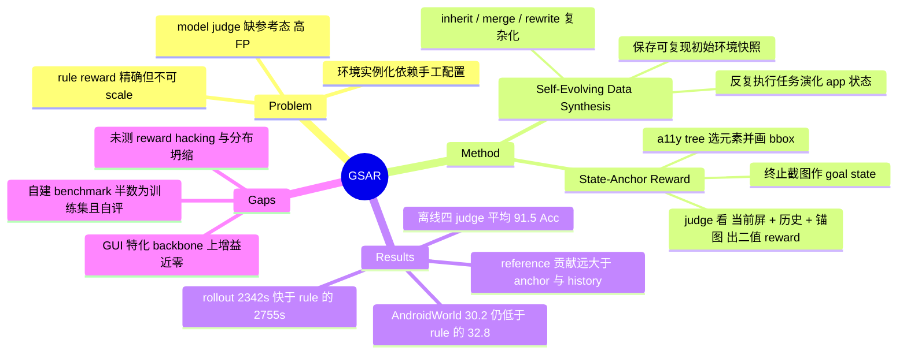

## Summary

GSAR 把 mobile GUI agent 的 model-based reward 从"只看动作历史"改成"额外看一张画了框的目标态截图"：用 self-evolving data synthesis 在真机上反复执行任务、演化 app 状态并保存初始环境快照，取成功轨迹的终止截图、由 GPT-4o 从 a11y tree 选出任务相关元素并把 bbox 画上去，作为 VLM judge 的参考答案。离线轨迹判定上四个 judge 平均 91.5% Acc / 91.8% F1，但在 AndroidWorld 的 online RL 头对头中，GSAR 训出的 UI-TARS-7B-DPO 达 30.2% SR，仍低于 rule-based reward 的 32.8%。

## Problem & Motivation

RLVR 训 GUI agent 卡在两处：一是任务与环境的规模化实例化——把 LLM 生成的开放指令落成可执行 episode 需要配置对应初始环境，而这一步目前高度依赖手工配置，导致无法自动产出多样的 environment-task pair；二是奖励信号——rule-based reward 需要为每个任务手写验证脚本，精确但无法跟自动生成的任务一起 scale；model-based evaluator 可扩展，却"frequently suffer from instability, hallucination, or insufficient coverage of edge cases"。

作者对 model-based judge 失效原因给了一个具体假设：judge 只拿到 action history 时缺少"任务完成后长什么样"的显式参照，而 GUI 场景里视觉相似的状态常对应语义不同的结果，于是 false positive 高发。GSAR 的全部设计都是这个假设的直接落地——给 judge 一份 ground-truth answer。

需要先说清 GSAR 的定位：它仍是 **model-based / VLM-as-judge** 的奖励，reward 由 Qwen3-VL-32B 这类 judge 模型对截图做二值判定（C21），并不查询文件、系统配置等环境状态；所谓 "grounding" 只是多了一张带标注框的参考图片。这与 [[2607-InteractiveRewardAgent]] 那类真正回到环境里调工具核验的路线是两回事。

## Method

### Self-Evolving Data Synthesis

四条原则串成一个迭代循环（Algorithm 1，Appendix B）：

1. **Simulation of Real-World Usage**：刚装的 app 内容贫瘠，靠反复执行任务来修改 app 状态，让环境本身随迭代变复杂。每轮 iteration 从设备 pull 出环境 E_t，收任务、再 push 回去执行。
2. **Automatic Task Generation**：先随机交互得到探索轨迹 T=(s_0,a_0,...,s_n)，VLM 对每个观测 s_i 生成候选任务集 Q_i，并把当时的环境 e 存为初始快照，构成 task-environment pair。**保存可复现的初始环境快照是这套 pipeline 与 OS-Genesis 等前作的关键差别**——前作依赖手工预配置环境且不提供可复现初始态。
3. **Trajectory Collection and Filtering**：用 GPT-4o 执行任务拿轨迹，同时顺带改变 app 状态；沿用 [[2412-OSGenesis]] 的 filtering strategy F 剔除 task-trajectory 不匹配，得到 (q, e, τ) 三元组。
4. **Progression from Simple to Complex**：对上一轮成功的三元组做 task complexification，三选一：M_inherit（从本轮环境 e_T 起生成后继任务）、M_merge（在原环境上把源任务与额外子任务合并）、M_rewrite（只改参数、保持结构）。

AndroidWorld 应用固定跑 6 轮；额外开源应用先随机探索一次、按轨迹中 unique page 数映射到 1-6 轮。任务生成、复杂化、执行三步全部由 GPT-4o 承担。

### State-Anchor Reward

**Goal-State Acquisition**：目标态就是成功轨迹的终止观测 s_g = s_T。注意一个被"human-free"措辞掩盖的例外：对采集阶段模型没做出来、因而被 filter 掉的困难任务，作者用**人工执行**补 goal state。

**Automatic Reward Annotation**：给定 s_g 与其 a11y tree A_g，先把元素 index 叠到截图上（操作 I），用 VLM 选出任务相关元素 index 集 K_g，再取这些元素的 bbox 在目标态截图上画框，得到 goal-state-anchor reference G。整个标注环节无人参与。

**Reward for Training**：在第 t 步，evaluator E 接收当前状态 s_t、动作历史 τ_0:t 与锚定参考 G，输出二值 y_t，r_t = 1 当且仅当 y_t = 1。该机制可在执行的任意 step 触发。

值得点明的是 G 的物质形态：它是**在单张参考截图上画的视觉高亮**，不是符号化的状态谓词。judge 做的仍然是像素级比对，只是注意力被框引导了一下。这个事实解释了后面两个现象——Delete 类任务上框太大反而变差、以及"完成态不具视觉表达"的任务无法处理。

## Key Results

**合成数据质量（Table 1）**：Qwen2.5-VL-7B 上 LoRA SFT 6,331 步数据（20 个 AndroidWorld app 的 aw-app + 40 个开源 app 的 extra-app），AndroidControl-Low EM 85.0→90.2（+5.2），AndroidControl-High EM 62.9→66.1（+3.2），GUI-Odyssey TM 59.5→65.8（+6.3）。同表 Aguvis-7B 的 AC-Low EM 已是 89.4，与 90.2 相差不大。

**离线轨迹判定（Table 2）**：315 条 AndroidWorld 轨迹（164 正 / 151 负），来自 GUI-Owl-7B 与 Qwen2.5-VL-7B 的评测记录。四个 judge（Qwen3-VL-8B/32B、GPT-4o、Gemini-2.5-Pro）平均：GSAR 91.5/91.8，GSA-Only 86.3/86.5，GS-Only 83.0/83.2，StepCritic 77.6/81.8，DistRL 75.0/74.5，DigiRL 68.3/62.8。GSAR 是唯一在全部 judge 上 Acc 与 F1 双双过 90 的方法。

一个作者没强调的细节：GPT-4o 作 judge 时 GS-Only（78.1）反而低于 StepCritic（81.3），说明**只给参考图不给框未必更好，anchor 与 reference 是耦合而非叠加的**。另外强 judge 下差距收窄——Gemini-2.5-Pro 上 StepCritic 已到 87.9/88.3，与 GSAR 的 92.7/92.7 只差 4.8 点。

**Ablation（Table 3）**：Qwen3-VL-8B / 32B 上，w/o reference 掉到 64.4/74.1 与 76.8/81.0，w/o anchor 为 87.3/88.0 与 90.5/90.7，w/o history 为 87.6/88.2 与 86.4/86.9。参考图是主导因素（8B 上值 ~26 点），anchor 与 history 各值几点。

**Online RL（Figure 3）**：自建 86 query benchmark（半数为 training split），UI-TARS-7B-DPO 在 training split +23.2%、全任务集 +8.1%；GUI-Owl-7B 对应 +18.6% / +8.2%。RL 用 GRPO，judge 为 Qwen3-VL-32B，80 步、8 rollout、max 20 turn，两台 8×H100、共 128 台 Android emulator。

**与 rule-based 头对头（Figure 6a、Table 5）**：AndroidWorld 上取 42 个任务作训练集、全 benchmark 评测。UI-TARS-7B-DPO baseline 26.7%，GSAR 训后 30.2%（+3.5），rule-based reward 训后 32.8%（+6.1）——**GSAR 低于 rule-based 2.6 点**。但 rollout 更快：每训练步平均 rule-based 2754.92 s、GSAR 2342.02 s（本人计算约低 15%），作者归因于 rule-based 反复 ADB 访问设备的开销高于 judge 推理。

**标注准确率（Table 4）**：GPT-4o 自动锚定在 82 个任务上整体 91.5%，Delete 100.0%（n=15，删除对象消失、无需细粒度定位）、Answer 90.0%（n=20）、Normal 89.4%（n=47）。

**数据利用率（Table 11）**：aw-app 993 任务中 45.7% 的轨迹达 R≥4 阈值可用于 SFT，extra-app 960 任务中 32.5%。

**换 backbone 后增益萎缩（Table 8）**：UI-TARS-7B-SFT 上 AC-Low EM 91.52→91.53、AC-High EM 71.21→71.97、GUI-Odyssey EM 66.98→68.01。作者自己解释为 UI-TARS 已针对 GUI 特化、baseline 高、提升空间小。

## Evidence Ledger

| Claim ID | Claim | Type | Source locator | Evidence excerpt | Status |
|:--|:--|:--|:--|:--|:--|
| C1 | GSAR 离线轨迹判定四 judge 平均 91.5% Acc / 91.8% F1 | number | Table 2 / §4.2 | "GSAR 90.2 91.0 92.1 92.4 91.1 91.3 92.7 92.7 91.5 91.8" | source-verified |
| C2 | 同表 baseline 平均：StepCritic 77.6/81.8，DistRL 75.0/74.5，DigiRL 68.3/62.8 | number | Table 2 | "DigiRL ... 68.3 62.8 DistRL ... 75.0 74.5 StepCritic ... 77.6 81.8" | source-verified |
| C3 | GSAR 是唯一在开源与闭源 judge 上 Acc 与 F1 均过 90 的方法 | sota-novelty | §4.2 | "being the only method to surpass 90% in both accuracy and F1 for both open-source and closed-source models" | source-verified |
| C4 | 离线评测集为 315 条轨迹（164 正 / 151 负），源自 GUI-Owl-7B 与 Qwen2.5-VL-7B 的 AndroidWorld 评测轨迹，goal state 取末步截图由 GPT-4o 锚定 | benchmark-setting | Appendix C | "we constructed a total of 315 trajectories, including 164 positive samples and 151 negative samples" | source-verified |
| C5 | AndroidWorld 上 UI-TARS-7B-DPO baseline 26.7%，GSAR 训后 30.2%（+3.5），rule-based 训后 32.8%（+6.1）——GSAR 低于 rule-based | comparison | §5.3 / Figure 6(a) | "GSAR increases the performance to 30.2% (+3.5%), while rule-based rewards achieve 32.8% (+6.1%)" | source-verified |
| C6 | 每训练步平均 rollout 时间 rule-based 2754.92 s、GSAR 2342.02 s | number | Table 5 / §5.3 | "Rule-based 2754.92 GSAR (Model-based) 2342.02" | source-verified |
| C7 | 合成数据 SFT 相对 Qwen2.5-VL-7B 基线：AC-Low EM +5.2、AC-High EM +3.2、GUI-Odyssey TM +6.3 | number | Table 1 / §4.2 | "the low and high splits of AndroidControl (+5.2% and +3.2%, respectively) and on the TM metric for GUI-Odyssey (+6.3%)" | source-verified |
| C8 | SFT 训练集 6,331 步，数据来自 20 个 AndroidWorld app 与 40 个精选开源 app | benchmark-setting | Appendix C / §4.2 | "the training dataset contains 6,331 steps"; "20 AndroidWorld apps and further scaled using data from 40 selected open-source apps" | source-verified |
| C9 | GSAR 作 reward：UI-TARS-7B-DPO training split +23.2% / 全任务集 +8.1%；GUI-Owl-7B +18.6% / +8.2% | number | §4.2 / Figure 3 | "a 23.2% improvement on the training split and an 8.1% improvement on the full task set" | source-verified |
| C10 | 自建 benchmark 为 86 个 query 配初始环境快照与目标态参考，半数用作 training split，成功率由人工与 GSAR 双重核验 | benchmark-setting | §4.1 / §4.2 | "86 queries with their corresponding initial environment snapshots and annotated reference goal states. Half ... used as the training split" | source-verified |
| C11 | GPT-4o 自动锚定标注准确率整体 91.5%（82 任务）：Answer 90.0%（20）、Delete 100.0%（15）、Normal 89.4%（47） | number | Table 4 / §5.1 | "Type Answer Delete Normal Total / Count 20 15 47 82 / Accuracy 90.0 100.0 89.4 91.5" | source-verified |
| C12 | Ablation：w/o reference 64.4/74.1 与 76.8/81.0；w/o anchor 87.3/88.0 与 90.5/90.7；w/o history 87.6/88.2 与 86.4/86.9；full 90.2/91.0 与 92.1/92.4 | number | Table 3 / §4.3 | "w/o reference 64.4 74.1 76.8 81.0 / w/o anchor 87.3 88.0 90.5 90.7 / w/o history 87.6 88.2 86.4 86.9" | source-verified |
| C13 | 作者把 StepCritic 在线 RL 表现弱归因于高 false positive 导致奖励过度乐观，而非 false negative | causal-mechanism | §5.2 / Figures 4-5 | "StepCritic exhibits relatively low false negative rates ... suffers from a notably high false positive rate ... overly optimistic" | source-verified |
| C14 | 作者自陈局限：只以单一终态为成功判据（任务可能有多解），QA 类任务奖励可能在正确答案产生前就触发 | causal-mechanism | Limitations | "considers only a single final state as the success criterion ... may assign a correct reward before the actual correct answer is produced" | source-verified |
| C15 | 全文（含附录）未给出任何 code / data / project 发布链接 | license-code | 全文 incl. appendices | 正文外链全部为 api.semanticscholar.org 引用链接，无仓库或项目页 | source-verified |
| C16 | 数据利用率：aw-app 993 任务中 45.7% 达 R≥4，extra-app 960 任务中 32.5% | number | Table 11 / Appendix E.1 | "aw-app 44 281 214 126 328 45.7% extra-app 110 342 196 83 229 32.5%" | source-verified |
| C17 | self-evolving 迭代对页面复杂度提升幅度有限：edge density 0.0240→0.0295、entropy 1.90→2.11、UI 元素 22.68→24.56，作者自述为 "slightly higher" | number | Table 9 / Appendix E.1 | "Early (Iter 1–2) 0.0240 1.90 22.68 Later (Iter 5–6) 0.0295 2.11 24.56"; "slightly higher edge density" | source-verified |
| C18 | 全文无针对 self-evolving 合成循环的分布坍缩实验，也无对 GSAR reward 被策略 hack 的评估 | causal-mechanism | 全文 incl. appendices | 检索 collapse / hack / gaming / Goodhart 均无命中；最接近的 Table 9 只测 page complexity | source-verified |
| C19 | Table 3 的 "w/o reference" 与 Table 2 的 StepCritic 数值完全相同，"w/o history" 与 GSA-Only 完全相同 | number | Tables 2 and 3 | Table 2 "StepCritic 64.4 74.1 76.8 81.0"; Table 3 "w/o reference 64.4 74.1 76.8 81.0" | source-verified |
| C20 | UI-TARS-7B-SFT 上增益萎缩：AC-Low EM 91.52→91.53、AC-High EM 71.21→71.97、Odyssey EM 66.98→68.01；作者归因于 UI-TARS 已 GUI 特化 | number | Table 8 / Appendix D | "UI-TARS-7B-SFT – 95.05 91.52 79.10 71.21 80.71 66.98 / GSAR (aw-app) 94.99 91.53 80.33 71.97 81.78 68.01" | source-verified |
| C21 | Online RL 用 UI-TARS-7B-DPO 与 GUI-Owl-7B 作 backbone、GRPO 优化、Qwen3-VL-32B 作 judge；80 步、8 rollout、max 20 turn、两节点 8×H100、128 台 Android emulator | benchmark-setting | §4.1 / Table 7 / Appendix C | "we adopt UI-TARS-7B-DPO and GUI-Owl-7B as the backbone models ... with Qwen3-VL-32B serving as the judge model" | source-verified |

## Strengths & Weaknesses

### Strengths

**机制简单且几乎零成本。** 核心操作就是"在成功轨迹的终止截图上按 a11y tree 画几个框，连同动作历史一起塞给 judge"——不训 reward model、不改 judge 权重、不往环境里发查询。Table 3 显示这一 prompt 层改动在 Qwen3-VL-8B 上值约 26 个准确率点。符合"简洁方法解决重要问题"的取向。

**做了同 backbone 的 rule-vs-model 奖励头对头，而且如实报告自己输。** C5 是这篇论文最有信息量的一个数字：同一 UI-TARS-7B-DPO、同一 AndroidWorld 训练子集，rule-based 拿 +6.1，GSAR 只拿 +3.5。绝大多数 model-based reward 论文回避这个对照，或只比 offline agreement。**那 2.6 点就是残余奖励噪声的实测价格。**

**报了 rollout 墙钟时间，并且结论反直觉。** Table 5 显示 model-based judging 比 rule-based verification 更快（2342 vs 2755 秒/步），原因是 rule-based 要反复走 ADB 访问设备。这推翻了"模型奖励=昂贵选项"的默认假设，对做 GUI RL 基建的人是有用的一手数据。

**失效模式的分解是干净的。** StepCritic = 低 FN / 高 FP，GSA-Only = 低 FP / 残余 FN，两者互补——这个 FP/FN 分解（Figure 5）比单一 accuracy 数字更有指导意义，也直接解释了为什么二者结合有效。Table 12 的按类别拆分进一步暴露了 anchor 的边界：Delete 任务上 GSA-Only（88.1）反而低于 GS-Only（91.5），作者解释为框覆盖屏幕面积过大、把模型注意力引到无关元素。

### Weaknesses

**最关键的一条：论文证明的是"reward 与成功相关"，不是"reward 可以安全地被优化"。** 91.5% 这个数字（C1、C4）是在 315 条**离策略**轨迹上测的——那些轨迹来自 GUI-Owl-7B 与 Qwen2.5-VL-7B 的评测记录，是一个从未承受过优化压力的固定分布。而 GSAR 的判据本质是"当前屏是否匹配这张画框的参考图"，最直接的攻击面——**策略学会到达视觉上匹配 anchor、实质未完成任务的屏幕**——全文没有任何测试（C18）。唯一触及 optimize-safety 的证据是 C5 的头对头，而那里 GSAR 输了 2.6 点，恰恰说明残余噪声确实有代价。这类论文常见的 "correlates" 与 "safe to optimize" 混淆，在这里没有被跨过去。

**self-evolving 循环从未在同数据量下与非演化合成对照，"多迭代"与"多数据"不可分离。** Table 1 比的是 fine-tuned vs base；Table 9/10 只说明后期页面略复杂、复杂化任务更长。要支撑"自演化本身有价值"，需要的是"固定 6,331 步预算下，evolve 6 轮 vs 只随机探索"的对照，论文没做。而且 Table 9 的量级很弱——edge density 0.0240→0.0295、UI 元素 22.68→24.56（C17），作者自己用词是 "slightly"。没有任何多样性或坍缩度量，迭代上限固定为 6 也意味着长程演化的行为完全未知。

**线上 RL 的主打数字建立在自建 benchmark 上，且部分由 GSAR 自己判分。** 86 个 query，半数是 training split，所谓 "full task set" 的 +8.1%（C9）包含了这 43 条训练任务；成功率"由人工与 GSAR 双重核验"（C10），但一致率没有量化，论文只写 "some metrics closely matching human judgments"。用被评估的奖励模型去评估该奖励模型训出的策略，是有循环性的。相比之下，唯一外部定义的 benchmark（AndroidWorld）给出的是更小的 +3.5。

**Ablation 与 baseline 表是同一批数字的重排。** C19：Table 3 的 "w/o reference" 与 Table 2 的 StepCritic 逐位相同，"w/o history" 与 GSA-Only 逐位相同。这不算错误（w/o reference 本就退化成 history-only judge），但意味着 anchor 贡献只有一次独立测量，没有第三方对照。

**换到 GUI 特化 backbone 后合成数据增益几乎归零。** C20：UI-TARS-7B-SFT 上 AC-Low EM 从 91.52 到 91.53。作者诚实地披露并解释了，但这界定了 claim 的适用范围——这套 pipeline 主要是把通用 VLM 拉到 GUI 特化模型的水平，而非推过去。

**"human-free" 有例外，且标注误差有下界。** 采集阶段失败的困难任务，goal state 靠人工执行补齐；Table 4 的 91.5% 标注准确率（C11）意味着约每 12 份参考里有 1 份是错的，而这个误差会污染针对该任务算出的**每一步** reward。论文没测"锚定错误如何传导到下游 reward 与策略"。

**单终态判据是结构性天花板。** 作者自陈（C14）：多解任务、QA 任务提前触发、以及完成态无视觉表达的任务都处理不了。结合"anchor 只是截图上的视觉高亮而非符号谓词"这一事实，GSAR 的上限注定低于 rule-based——与观察到的 2.6 点差距一致。

**无代码发布**（C15），pipeline 不可独立复跑。

### 对领域的意义

放在 vault 的 GUI reward 谱系里，GSAR 与 [[2607-InteractiveRewardAgent]] 构成一组对照：两者都想补 passive VLM judge 的信息缺口，但补法相反——IRA 回到环境里调工具查真实状态，GSAR 只在提示里多塞一张画框的参考图。两者的 online 结论高度一致：IRA 在 OSWorld 拿 34.0% vs script 的 34.9%，GSAR 在 AndroidWorld 拿 30.2% vs rule 的 32.8%。**"model reward 接近但仍低于 rule reward"正在成为一个跨论文的稳定 pattern**，而且 GSAR 这条更便宜的路线差距反而更大（2.6 点 vs 0.9 点）——这个对比本身就是一个可检验的假设：信息补得越"廉价"（提示层 vs 环境查询），残余噪声代价越高。

另一条脉络是"用未来/终态帧作为特权信息"：[[2608-GatedHindsight]] 把 next screenshot 当训练期 privileged information 蒸馏给 student，GSAR 把 terminal screenshot 当 judge 的参考答案。同一个直觉在监督侧与奖励侧各出现一次，说明"离线轨迹里已经躺着的未来帧被系统性浪费了"是一个真实且尚未被吃透的结构性机会。

## Mind Map

## Notes

- **可直接引用的对照数字**：AndroidWorld 同 backbone 下 rule-based +6.1 / GSAR +3.5，以及 rollout 2754.92 s vs 2342.02 s。前者可进 [[Topics/CUA-Survey]] 的 reward 可靠性小节，后者是罕见的奖励成本实测，可挑战"model reward 昂贵"的常见默认。
- **与 [[2607-InteractiveRewardAgent]] 的跨论文 pattern**：model reward 与 rule/script reward 的残余差距（0.9 vs 2.6 点）疑与"信息补充的深度"相关。这是一个可做的对照实验设计——在同一环境同一 backbone 上，把"参考图"与"环境查询"作为两个独立维度做 2×2。
- **[[2608-GatedHindsight]] 的耦合点**：两篇都在消费离线轨迹里已存在的未来帧，一篇用于监督蒸馏、一篇用于奖励参照。若把 GSAR 的 anchor 引入 GHD 的 teacher context（teacher 已看 o_{t+1}，再给终态 anchor），是否能进一步收紧 gate？未见有人做。
- **未解问题（可作为 idea 种子）**：GSAR 的 anchor 是像素级视觉高亮，Delete 类任务上因框太大反而变差（Table 12）。把 anchor 从"画框"升级为"元素级符号谓词集合 + 期望取值"，理论上能同时解决大框噪声与非视觉完成态两个失效模式——但这就滑向 rule-based 的表达力，需要论证它仍然可自动生成。这个 trade-off 边界值得单独想清楚。
- **待核实的量化空白**：论文称自建 benchmark 结果由人工与 GSAR 双重核验，但未给一致率。若后续有 v2，优先看这个数字。
