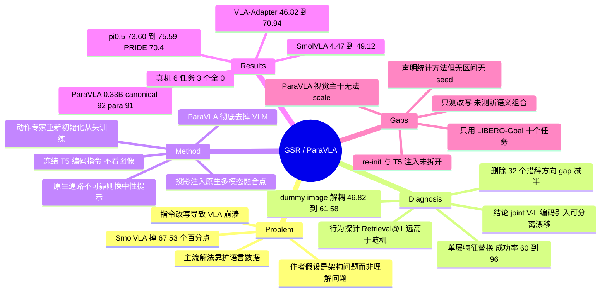

## Summary

用因果干预定位 VLA "指令一改写就崩" 的失效位置：任务语义在语言主干里保留完好（π0.5 Retrieval@1 0.941，chance 0.1），失效发生在动作策略对 joint vision-language 编码引入的特征漂移过度敏感——把 paraphrase rollout 中进入最后一个 Bridge-Attention block 的语言特征换成 canonical 版本，配对成功率 60%→96%。据此提出 Grounded Semantic Re-binding（GSR）：冻结 T5-large 单独编码指令、投影后注入各架构原生的多模态融合点、动作专家重新初始化从头训练，只用 canonical demonstration 就把 LIBERO-Para Full Para 成功率从 46.82→70.94（VLA-Adapter）、4.47→49.12（SmolVLA）、73.60→75.59（π0.5，PRIDE 70.4）。附带给出 0.33B 的原生解耦模型 ParaVLA，canonical/paraphrase 为 92.0/91.0，但作者自陈其视觉主干放大后不再出现 VLM 式 scaling。

## Problem & Motivation

VLA 在 manipulation benchmark 上的高分建立在 benchmark 用的那套僵化 canonical 指令模板上。换成语义等价的改写，成功率断崖式下跌——SmolVLA 从 Goal SR 72.0 掉到 Full Para 4.47，落差 67.53 个百分点（C2/C39）。VLA-Adapter 的下跌尤其反直觉：它的设计初衷就是尽量不动 VLM 主干，按理该继承 VLM 的语言鲁棒性，实际却掉了 51.38 个百分点。

主流应对是把语言覆盖面做大——instruction relabeling、counterfactual 标注、语义/视觉增强、consistency training。作者的切入点是先问这笔数据成本是否必要：如果模型内部根本没保住任务语义，那扩数据是对的；如果保住了只是没用上，那扩数据就是在用蛮力修一个架构问题。

论文用两步把答案钉死。第一步是**行为层探针**：固定观测，把 paraphrase 指令产出的 action chunk 和全部 N 个任务的 canonical action chunk 比距离，看最近邻是不是正确任务。三个模型的 Retrieval@1 分别是 0.675 / 0.516 / 0.941，全部远高于 chance 0.1；wrong-task 距离与 paraphrase 距离之比为 2.752 / 1.872 / 4.051（C20）。第二步是**因果干预**：只替换进入 VLA-Adapter 最后一个 Bridge-Attention block 的 Qwen 输出特征，视觉与状态 token 一律不动，消掉了 96.8% 的动作差异，配对成功率 60%→96%（C17）。

这就把问题从"模型不懂指令"改写成了"模型懂但翻译不出来"。再往下追一层，作者做了两个控制实验定位漂移来源：（a）把辅助 Qwen 分支收到的图像换成固定 dummy image（主视觉通路仍是真实观测），Full Para 从 46.82 涨到 61.58，换成固定自然图像也有 +7.17（C18）；（b）用 5-fold task-disjoint 交叉验证估出 32 个把 canonical 和 paraphrase 分开的特征方向，在两个 held-out 任务上删掉这些分量，action gap 从 0.4361 降到 0.2282，而同范数随机方向只降到 0.4386，闭环成功率 55%→90%（C19）。结论是：**把动态图像和指令措辞喂进同一个编码过程，才是特征漂移的来源**；措辞变化不破坏任务语义，只是在特征空间引入了一个系统性、可分离的偏移，而下游动作策略对这个偏移毫无免疫力。

## Method

GSR 不是一个固定模块，而是一条三步的架构改造流程（Fig. 3）。

**1. 稳定语义源。** 冻结 T5-large 编码真实指令，取 token-level 最后一层 encoder hidden states 并 mask padding。T5 **不接收任何图像或机器人状态**——这正是要绕开的耦合（C12）。

**2. 注入进原生融合点。** 不外挂一个刚性模块，而是先找出目标架构本身在哪一步做"任务信息 × 视觉场景 × 机器人状态"的核心融合，把投影后的 T5 token 注入那里。注入点随架构而变：
- **VLA-Adapter**：T5 token 投影到 action head 宽度，作为 sidecar K/V 供给每个 `MLPResNetBlock_Pro`，有独立的 attention softmax 和 per-block gate，与 block 原生的 action update 相加。关键在于 Qwen 的视觉/任务条件与 T5 语义在动作策略内部**仍然可分别寻址**，而不是拼成一条 prefix。
- **SmolVLA**：先试了 VLA-Adapter 式的后端 sidecar，**彻底失败**——canonical 保住 76%，paraphrase 只有 13.49%。作者的解释是把孤立语言特征直接送到 action head 会剥夺视觉 grounding。改成把 T5 输出注入 SmolVLM 原本的 language input 位置（8 头 grounding attention，gate 初始化为 1.0），让纯语义先经原生多模态层与图像充分交互，paraphrase 才升到 49.12%（C37）。
- **π0.5**：T5 token grounding 到动态检测出的 PaliGemma task-token 位置，mask 从首个 instruction token 起、到 `State:` 分隔符前止，不覆写 image token / BOS / EOS / padding / state token。

**3. 动作专家重新初始化。** 不微调预训练权重，而是从随机初始化重训，让策略从头学 T5 条件、视觉特征、机器人状态三者如何共同决定动作，而不是保留一套已经拟合到原语言输入的动作映射。T5 与 VLM 主干全程冻结，只训投影和动作策略。

**4. 原生语言输入怎么处理，取决于它可不可靠。** 先用配对的 canonical/paraphrase 指令测原生通路：不可靠（VLA-Adapter、SmolVLA）就把原文本换成固定中性句 `perform the task`，逼模型只依赖 T5；已经可靠（π0.5）就保留真实指令，T5 作为补充语义源（C13）。这条判据有实测支撑——route-conflict 实验里给 VLA-Adapter 的原生通路喂错误指令，成功率从 47.31 崩到 5.11，而只把 T5 换错才掉到 44.0（C21），说明不可靠的原生编码器仍然会劫持控制权。

**ParaVLA**（Sec. 5）把这个思路推到极端：完全不要 VLM，指令走冻结 T5-large（每任务编码一次并缓存）、图像走共享 DINOv2-Large（只训最后四个 block 与 patch embedding），二者只在最终的 flow-matching action expert 里通过各自独立的 attention 通路汇合，8 个 16-head block，pre-fusion 模块的 V-L gate 全程关闭（C40）。0.33B 参数 per control step，16 步 action chunk，执行 8 步后重规划。

**训练口径**：全部只用 canonical demonstration，无任何 paraphrase 蒸馏 / 一致性损失 / K-V matching 目标；仿真部分全部在 LIBERO-Goal 子集（428 episodes，52,042 transitions）上训练与评测（C10/C11）。硬件：VLA-Adapter GSR 与 ParaVLA 用 8×RTX 4090 跑 50k step，SmolVLA GSR 8×RTX 4090 跑 25k step，π0.5 用 8×A800，Native matched control 与 matched GSR 同为 6,250 step，GSR\* 为 12,500 step（C35）。

## Key Results

**LIBERO-Para 全量 4,092 episode**（870 Act / 259 Obj / 2,963 Comp；只改指令文本，物理任务、初始状态、成功判据全部保持不变——C9）。PRIDE 是官方的改写偏离度加权成功率，α=0.5。

| Model | Config | Goal SR ↑ | Full Para SR ↑ | Drop ↓ | PRIDE ↑ |
|:--|:--|--:|--:|--:|--:|
| OpenVLA-OFT† (Goal) | Reported | 97.9 | 64.7 | 33.2 | 58.8 |
| SmolVLA | Native | 72.0 | 4.47 | 67.53 | 2.6 |
| SmolVLA | Native + T5 | 76.0 | 13.49 | 62.51 | 7.9 |
| **SmolVLA** | **GSR** | 78.0 | **49.12** | 28.88 | 41.4 |
| X-VLA† | Reported | 97.8 | 62.1 | 35.7 | 52.7 |
| VLA-Adapter | Native | 98.2 | 46.82 | 51.38 | 36.7 |
| VLA-Adapter | Native + T5 | 97.0 | 47.31 | 49.69 | 37.1 |
| **VLA-Adapter** | **GSR** | 98.0 | **70.94** | 27.06 | 62.0 |
| Xiaomi-Robotics-0† | Reported | 98.8 | **76.0** | 22.8 | 69.2 |
| π0.5† | Reported | 97.6 | 71.4 | 26.2 | 65.4 |
| π0.5 | Native | 93.0 | 73.60 | 19.40 | – |
| **π0.5** | **GSR** | 91.0 | 75.59 | 15.41 | **70.4** |
| **π0.5** | **GSR\*** (2× steps) | 96.0 | 75.76 | 20.24 | 70.3 |

† 行是 LIBERO-Para 论文报告的数字，非本文重训（C6）。摘要"提升至多 44.6 percent"对应 SmolVLA 的 4.47→49.12，是**百分点差**而非相对提升（C5）；同理引言的"下跌至多 67.53%"是 72.0−4.47 的百分点差（C39）。

三条口径值得单独记：**(a)** Xiaomi-Robotics-0 的 Full Para 76.0 高于 π0.5 GSR 的 75.59，论文正文明确承认，GSR 的领先只在 PRIDE 这一项（C4）；**(b)** π0.5 GSR 在 matched schedule 下 canonical Goal SR 从 Native 的 93.0 掉到 91.0，要靠训练步数翻倍的 GSR\* 才回到 96.0——而 GSR\* 的 PRIDE 反而是 70.3、Drop 反而扩大到 20.24（C7/C8）；**(c)** π0.5 Native 一行的 PRIDE 是 "–"，所以"GSR 把 π0.5 推上 PRIDE 新高"的对照只能是被引用的 π0.5 reported 65.4，而非作者自己复现的基线。

**贡献归属的消融，做得比多数同类论文干净。**

- 保留原生指令只加 T5（Native + T5）几乎无效：46.82→47.31（C14）。增益不来自"多了一个语言编码器"。
- 容量对照：只加可训练参数而不加语言模型、或把 T5 换成 Qwen-VL，Full Para 都是**一模一样的 46.82%**（C15）；Goal-100 诊断上三个对照的 paraphrase 成功率同为 56%，只有 Neutral Native + Frozen T5 升到 75%（C16）。增益不来自容量。
- Fig. 8(b)：在 Neutral Native + Frozen T5 配置下把 T5 源关掉 → 10%，喂错误源 → 0%，说明 GSR 之后任务控制权完全转移到了 T5 通路。

**架构差异的分层证据（Fig. 4）。** VLA-Adapter 的最后一个 Bridge-Attention block 单层就恢复 96.8% 的动作差异，注入错误任务特征则预测直接偏向那个错误任务；SmolVLA 和 π0.5 的最佳单层恢复率只有 10.5% 和 31.3%，任务语义是分布式纠缠的（C22）。附录 D.3 还预先定义了三条"跨架构通用语义断点"的判据（retention drop ≥0.10 且 bootstrap 下界为正、精确 action-gap recovery ≥0.50、显著的 wrong-task 动作身份控制），并明说**没有任何模型同时满足三条**——这是全文最克制的一处表述（C23）。

**ParaVLA**（Table 4）：0.33B，canonical 92.0 / paraphrase 91.0（drop 仅 1 点），Full Para 72.51，PRIDE 66.9；同架构里把 T5 换成 SmolVLM decoder，canonical 还有 85.0 但 paraphrase 塌到 41.0（C29）。作者自陈的局限是把 DINO 放大后系统不再出现 VLM 那种 scaling（C30）。

**真机（AgileX PiPER 双臂）：只能读作 pilot。** 8 个任务各 40 条遥操作演示训练（320 episodes），评测 6 个任务，每任务每指令条件 5 trial，即每条 policy-instruction 路线 30 trial。Native VLA-Adapter 在 canonical 与 paraphrase 下**全部 0%**，GSR 为 50% / 40%（C24）。但逐任务表显示 GSR 在 6 个任务里有 3 个（task 3/5/6）在两种条件下均为 0%（C25），且所谓 OOD 改写是极轻的词汇替换——"pick up"→"grasp"、"the leftmost cube"→"the cube that is leftmost"（C26）。

## Evidence Ledger

| Claim ID | Claim | Type | Source locator | Evidence excerpt | Status |
|:--|:--|:--|:--|:--|:--|
| C1 | GSR 把 VLA-Adapter Full Para SR 从 46.82 提到 70.94，Goal SR 98.2→98.0 | number | p.6 Table 2 | "VLA-Adapter Native 98.2 46.82 51.38 36.7 ... VLA-Adapter GSR 98.0 70.94 27.06 62.0" | source-verified |
| C2 | GSR 把 SmolVLA Full Para SR 从 4.47 提到 49.12，Goal SR 72.0→78.0 | number | p.6 Table 2 | "SmolVLA Native 72.0 4.47 67.53 2.6 ... SmolVLA GSR 78.0 49.12 28.88 41.4" | source-verified |
| C3 | GSR 把 π0.5 Full Para SR 从 73.60 提到 75.59，PRIDE 70.4；π0.5 Native 的 PRIDE 为 "–" | number | p.6 Table 2；Sec 3.2 | "π0.5 Native 93.0 73.60 19.40 – ; π0.5 GSR 91.0 75.59 15.41 70.4" | source-verified |
| C4 | Xiaomi-Robotics-0 的 Full Para 76.0 高于 π0.5 GSR 的 75.59；GSR 只在 PRIDE 领先，论文正文明说 | comparison | p.6 Sec 3.2；Table 2 | "Xiaomi-Robotics-0 has the highest Full Para success among the reported systems at 76.0%, narrowly above 75.59% for GSR" | source-verified |
| C5 | 摘要 "up to 44.6 percent" 对应 SmolVLA 4.47→49.12，是 44.65 个百分点而非 44.6% 相对提升 | number | p.1 abstract；p.6 Table 2 | "GSR improves success rates by up to 44.6 percent" | source-verified（论文未标注单位；相对提升应为约 999%） |
| C6 | Table 2 中带 † 的六行（OpenVLA-OFT ×2、X-VLA、VLA-Adapter、Xiaomi-Robotics-0、π0.5）是 LIBERO-Para 报告的数字 | benchmark-setting | p.6 Table 2 caption | "Rows marked † are reported by LIBERO-Para." | source-verified（caption 未使用"非本文重训"字样，此为对 Configuration = Reported 的读解） |
| C7 | matched schedule 下 π0.5 GSR 的 canonical Goal SR 为 91.0，低于 Native 的 93.0；翻倍训练的 GSR\* 才回到 96.0 | number | p.6 Table 2 + Sec 3.2；p.14 Table 10 | "When trained for twice the original number of steps, the canonical Goal SR of π0.5 fully recovers to 96.0%." | source-verified |
| C8 | 最高 PRIDE 70.4 属于 canonical Goal SR 只有 91.0 的 π0.5 GSR；GSR\* 的 PRIDE 为 70.3、Drop 为 20.24 | number | p.6 Table 2 | "π0.5 GSR 91.0 75.59 15.41 70.4 ; π0.5 GSR∗ 96.0 75.76 20.24 70.3" | source-verified |
| C9 | LIBERO-Para 只改指令文本，保持物理任务/初始状态/成功判据；4,092 episode = 870 Act + 259 Obj + 2,963 Comp | benchmark-setting | p.5 Sec 3.1；p.11 Table 5 | "Full Para comprises 4,092 episodes (870 Act, 259 Obj, 2,963 Comp)." | source-verified |
| C10 | 仿真训练与评测只用 LIBERO-Goal 子集（episodes 379–806，428 episodes，52,042 transitions），无其他 LIBERO suite | benchmark-setting | p.11 App A.1 | "episodes 379–806, inclusive, totaling 428 episodes and 52,042 transitions. It is the LIBERO-Goal subset" | source-verified（附录 D.1 另用一个 four-suite canonical corpus 拟合归一化统计量，非训练/评测） |
| C11 | 全部 GSR 配置只用 canonical demonstration 训练，训练中不用任何 LIBERO-Para 或人工 paraphrase | benchmark-setting | p.5 Sec 3.1；p.11 A.1；p.13 C.1 | "No LIBERO-Para rewrite or manually generated paraphrase is used during training" | source-verified |
| C12 | GSR 机制：冻结 T5-large 无图像无状态编码指令 → 投影注入原生多模态融合点 → 动作专家重新初始化从头训练；T5 与 VLM 主干冻结 | causal-mechanism | p.5 Sec 3.1；p.7 Sec 3.3；p.12-13 App B | "T5 receives no image or robot state ... We inject the projected T5 semantics directly into this existing integration point." | source-verified（"重新初始化"对 VLA-Adapter 与 π0.5 明写；B.3 对 SmolVLA 未明写） |
| C13 | VLA-Adapter/SmolVLA 的原生文本输入被替换为固定中性句 "perform the task"；π0.5 保留真实指令 | causal-mechanism | p.5 Sec 3.1；p.6 Sec 3.2；p.12 B.1/B.3 | "receives the same fixed sentence, \"perform the task,\" for every training and evaluation sample" | source-verified |
| C14 | 保留原生指令只加 T5（Native + T5）对 VLA-Adapter 几乎无效：46.82→47.31 | number | p.5 Sec 3.1；p.6 Table 2 | "simply adding T5 while retaining the original Qwen instruction provides little improvement (46.82%→47.31%)" | source-verified |
| C15 | 只加可训练参数而无语言模型、或把 T5 换成 Qwen-VL，paraphrase 成功率都是同样的 46.82% | number | p.8 Sec 4.2 | "Simply adding extra trainable parameters without a language model, or replacing T5 with Qwen-VL, yields the exact same 46.82% success rate." | source-verified |
| C16 | Fig 8(a) Goal-100：paraphrase 成功率 Native Qwen 56 / Native+Learned Tokens 56 / Neutral Native+Qwen-VL 56 / Neutral Native+Frozen T5 75；canonical 94/98/92/98 | number | p.16 Fig 8(a) | "94 / 56 Native Qwen; 98 / 56 Native + Learned Tokens; 92 / 56 Neutral Native + Qwen-VL; 98 / 75 Neutral Native + Frozen T5" | source-verified |
| C17 | 只替换进入最后一个 Bridge-Attention block 的 Qwen 输出特征，消除 96.8% 动作差异，配对成功率 60%→96% | number / causal-mechanism | p.4 Sec 2.2 | "this single feature replacement eliminates 96.8% of the discrepancy in the predicted actions and raises the paired success rate from 60% to 96%" | source-verified |
| C18 | 把辅助 Qwen 分支的图像换成固定 dummy image，Full Para 46.82→61.58（+14.76 配对）；固定自然图像 +7.17 | number | p.4 Sec 2.3 | "raises the full Para success rate from 46.82% to 61.58% (a 14.76-point paired gain)" | source-verified |
| C19 | 删除 32 个估计出的 wording 方向，action gap 0.4361→0.2282（同范数随机方向 0.4386）；20 条闭环 episode 成功率 55%→90% | number | p.5 Sec 2.3；p.15 D.5 | "reduces this action gap from 0.4361 to 0.2282, whereas removing 32 random directions (with the same norm) leaves the gap at 0.4386" | source-verified |
| C20 | Table 1 Retrieval@1：VLA-Adapter 0.675 / SmolVLA 0.516 / π0.5 0.941；chance = 1/N = 0.1 | number | p.4 Table 1；p.14 D.1 | "VLA-Adapter 0.675 ... SmolVLA 0.516 ... π0.5 0.941"；"Chance Retrieval@1 is 1/N = 0.1." | source-verified |
| C21 | Table 3 的 route-conflict 行是 "+ T5" 配置：VLA-Adapter C/C = 47.31、SmolVLA C/C = 13.49（对应 Table 2 的 Native+T5 行而非 GSR 行 70.94 / 49.12）；π0.5 的 75.59 与其 GSR 行一致 | benchmark-setting | p.8 Table 3；p.6 Table 2 | "π0.5 + T5 75.59 2.88 74.0 ...; VLA-Adapter + T5 47.31 5.11 44.0 ...; SmolVLA + T5 13.49 2.25 3.23" | source-verified |
| C22 | 分层干预：VLA-Adapter 最后一个 Bridge-Attention block 单层恢复 96.8%；SmolVLA / π0.5 最佳单层恢复率仅 10.5% / 31.3% | number | p.8 Sec 4.1 | "Their best single-layer recovery rates are merely 10.5% and 31.3% respectively." | source-verified |
| C23 | 附录预设了"跨架构通用语义断点"的三条判据，并声明没有任何模型同时满足 | causal-mechanism | p.15 App D.3 | "No model satisfied all three conditions for a universal cross-architecture semantic breakpoint." | source-verified |
| C24 | 真机：AgileX PiPER 双臂，训练 8 任务共 320 episodes / 27,648 transitions，评测 6 任务，每任务每条件 5 trial（每路线 30 trial）；Native 两种条件均 0%，GSR 为 50% / 40% | number / benchmark-setting | p.9 Sec 4.3；p.16 E.1-E.4；p.18 Table 13 | "five trials per task and instruction condition, giving 30 trials for each policy–instruction route" | source-verified |
| C25 | 逐任务真机结果中 GSR 在 6 个任务里有 3 个（task 3/5/6）在两种指令条件下均为 0% | number | p.18 Table 13 | "3 0% 0% 0% 0% ... 5 0% 0% 0% 0% ... 6 0% 0% 0% 0%" | source-verified |
| C26 | 真机 OOD 改写是极小的词汇替换，如 "pick up the larger red object" → "grasp the larger red object" | benchmark-setting | p.18 Table 12 | "Use your right arm to pick up the larger red object. / Use your right arm to grasp the larger red object." | source-verified（task 3 甚至只调语序，保留 "pick up"） |
| C27 | 附录声明会报 McNemar 检验与 task-stratified bootstrap 95% CI，但全文 23 页无任何 p 值、置信区间、标准差或误差棒；每个配置只用一个固定训练 seed | benchmark-setting (negative) | p.12 A.5；p.5 Sec 3.1；全文 p.1-23 | "We report exact two-sided McNemar tests from paired success/failure outcomes. Where available, task-stratified bootstrap 95% confidence intervals" | source-verified（verifier 逐页确认 Table 1-13、Fig 1-8 均无区间或误差棒） |
| C28 | ParaVLA 每控制步 0.33B 活跃参数，LIBERO-Goal canonical 92.0 / paraphrase 91.0，Full Para 72.51，PRIDE 66.9；T5 每任务跑一次并缓存 | number | p.9 Sec 5；p.10 Table 4 | "ParaVLA achieves 92.0% canonical and 91.0% paraphrase success with 0.33B parameters active per control step." | source-verified |
| C29 | 同架构内把 T5 换成 SmolVLM decoder：canonical 保持 85.0%，paraphrase 塌到 41.0% | number | p.9 Sec 5 | "While canonical success remains at 85.0%, paraphrase success collapses to 41.0%." | source-verified |
| C30 | 作者自陈局限：放大 ParaVLA 的视觉基础模型（如更大的 DINO）后，系统不再表现出 VLM 常见的强 scaling | causal-mechanism | p.10 "Limitation and Future Research" | "such as upgrading to a larger DINO variant, the system fails to exhibit the strong scaling capabilities typically observed in VLMs" | source-verified |
| C31 | 全文没有把"动作专家重新初始化"与"注入 T5 语义"拆开的消融；最接近的是分块训练对照：只训最后一块 34%、最后四块 49%，均低于完整策略配 T5 条件的 75% | benchmark-setting (negative) | p.8 Sec 4.1；全文 p.1-23 | "training only this final block achieves 34% paraphrase success, while training the final four blocks reaches 49%. Both remain below the 75%" | source-verified（但 p.13 C.1 写明 π0.5 三个配置**均**重新初始化 gemma_300m 动作专家，故 π0.5 的 Native-vs-GSR 对照已把 re-init 控制为常量，该对照确实隔离了 T5 的贡献） |
| C32 | 全文没有关于 GSR 在什么条件下会 bind 错任务语义的 failure-case 分析；仅有的冲突/污染分析是 Table 3 的 route-conflict 与 Fig 8(b) 的 source-off / wrong-source | benchmark-setting (negative) | p.8 Table 3；p.16 Fig 8(b) | — | **unsupported** — 否定核心（无 GSR bind 错的 failure-case 分析）经 verifier 逐页确认成立，但枚举不全：Fig 4 下栏另有 wrong-task patch 的 action-identity flip 实验，Table 6 的 Goal-100 诊断也贯穿使用 cyclic wrong-task 指令。verifier 另发现附录 D.4 声明了五种 route-conflict 条件，而 Table 3 只报告了三种（"两路都错"与"中性 native / T5 关闭"从未报告） |
| C33 | 代码 https://github.com/AutoLab-SAI-SJTU/GSR-ParaVLA | license-code | p.1 摘要下方 | "https://github.com/AutoLab-SAI-SJTU/GSR-ParaVLA" | source-verified |
| C34 | 作者 Zhaokai Yin、Zhipeng Zhang；机构为 AutoLab, School of AI, SJTU 与 Research Lab, Anyverse Dynamics；2026-08-03 提交，cs.RO，23 页 8 图 | number | p.1 author block；arXiv abs 页 | "1AutoLab, School of Artificial Intelligence, Shanghai Jiao Tong University, 2Research Lab, Anyverse Dynamics" | source-verified（脚注注明第一作者为 SJTU AutoLab 实习期间工作） |
| C35 | 训练配置：VLA-Adapter GSR 与 ParaVLA 8×RTX 4090 / 50,000 step；SmolVLA GSR 8×RTX 4090 / 25,000 step；π0.5 8×A800，Native 与 matched GSR 同为 6,250 step，GSR\* 12,500 step | benchmark-setting | p.13 Tables 7-9；p.14 Table 10 | "Native control: 6,250; GSR matched: 6,250; GSR∗ extended: 12,500" | source-verified |
| C36 | π0.5 GSR 中给 PaliGemma 喂别的任务指令，成功率 75.59→2.88；只把 T5 指令换错仍有 74.0 | number | p.6 Sec 3.2；p.8 Table 3 | "When PaliGemma is given an instruction for a different task, success decreases from 75.59% to 2.88%, whereas changing only the T5 instruction leaves 74.0%" | source-verified |
| C37 | 对 SmolVLA 套用 VLA-Adapter 式后端 sidecar 失败：canonical 76%、paraphrase 仅 13.49%；改注入 SmolVLM 原生 language 位置后为 paraphrase 49.12% / canonical 78% | number | p.5-6 Sec 3.2；p.12 B.3 | "While it preserves a 76% success rate on canonical instructions, it achieves a mere 13.49% on paraphrases." | source-verified（命名不一致：76.0 / 13.49 这组在 Table 2/3 中标为 "Native + T5"即保留原生指令，而 Sec 3.2 描述为"与 VLA-Adapter 相同的改造方式"即中性提示；论文未调和二者） |
| C38 | 改造版 GSR 策略在线计算冻结 T5 特征，ParaVLA 每任务只跑一次 T5 并缓存 token 特征 | causal-mechanism | p.14 App C.2 | "The retrofitted GSR policies compute frozen-T5 features online, whereas ParaVLA evaluates T5 once per task and caches its token features." | source-verified |
| C39 | 引言"下跌至多 67.53%"对应 SmolVLA 的 Goal SR 72.0 减 Full Para SR 4.47 | number | p.1 Sec 1；p.2 Fig 1；p.6 Table 2 | "suffer catastrophic performance drops of up to 67.53% when canonical instructions are simply reworded" | source-verified（论文对 Drop 的定义即 Goal SR 减 Full Para SR，为百分点差） |
| C40 | ParaVLA 用共享 DINOv2-Large @224 编码双视角，只训最后四个 DINO block 与 patch embedding；V-L 融合发生在 8 个 16-head 的 flow-matching action expert 内，pre-fusion 模块的 V-L gate 全程关闭 | causal-mechanism | p.17 App F.1/F.2 | "Both are encoded by a shared DINOv2-Large backbone at 224 resolution ... earlier DINO blocks remain frozen" | source-verified |

> **Evidence boundary**：C32 状态为 `unsupported`，其否定核心（论文未做 GSR 绑错语义的 failure-case 分析）成立，但"仅有两处冲突分析"的枚举被 verifier 推翻——Fig 4 与 Goal-100 诊断均含 wrong-task 注入。正文对该点只保留否定核心，不写成"论文完全没做错误注入实验"。另需注意附录 D.4 声明的五种 route-conflict 条件中有两种（两路都错、T5 关闭）在正文与附录均未报告结果，故 Table 3 不是完整的 route authority 画像。
> C27 已确认全文无区间估计与多 seed，故本笔记内任何"提升显著"的措辞均指数值差，不含统计显著性；真机的 50% vs 40% 对应 15/30 与 12/30，落在该样本量的噪声范围内。

## Strengths & Weaknesses

**Strengths**

- **问题定位方式值得学。** 大多数"VLA 语言鲁棒性"论文的路径是"发现掉点 → 加数据/加损失 → 掉点变少"。本文先花两节回答"到底哪一步坏了"，而且用的是**因果干预**而非相关性：只换最后一个 block 的语言特征、其他一律不动，成功率 60→96（C17）。这个实验设计本身就把结论从"我们的方法有效"抬升到了"我们知道为什么有效"。Wording-subspace 那组也是同一风格——估计方向、删除、和同范数随机方向对照（C19），随机对照的存在让"删掉的确实是措辞维度而非任意扰动"这个结论站得住。
- **容量与来源被彻底分离。** 加参数不加语言模型 → 46.82；T5 换 Qwen-VL → 46.82；保留原生指令只加 T5 → 47.31；换成中性提示 + 冻结 T5 → 70.94（C14/C15/C16）。三个对照都落在同一个数上，这不是"我们也做了 ablation"，而是把"增益来自容量"这条竞争解释彻底排除了。VLA 领域里能做到这一步的论文不多。
- **对自己不利的数字没有藏。** Xiaomi-Robotics-0 的 Full Para 76.0 高于自己的 75.59，写在正文（C4）；π0.5 GSR 的 canonical Goal SR 从 93.0 掉到 91.0，也写在正文并解释成动作专家重初始化需要更多步数（C7）；附录 D.3 更是主动声明"跨架构通用语义断点"的预设判据**无一模型满足**，明确把主文的说法限定为 model-specific bottleneck（C23）。预注册式的判据加上"我们没达到"的结论，在这个方向的论文里相当罕见。
- **SmolVLA 上的失败被完整保留。** 先套 VLA-Adapter 的做法失败（paraphrase 13.49%），再改注入点才成功（C37）。这个负结果直接支撑了"注入点必须随架构走、固定 patch 必然失效"的核心主张——如果只报成功配置，这条主张就只是一句口号。
- **ParaVLA 的 scaling 失败没有被写成 future work 敷衍过去**，而是明确标为该范式的结构性瓶颈（C30），并且给出了同架构 T5→SmolVLM 的对照（paraphrase 91.0→41.0，C29），说明"解耦"本身不够、语义源必须是纯文本编码器。

**Weaknesses**

- **标题的 "Instruction Generalization" 大于实测的 paraphrastic invariance。** LIBERO-Para 只改写措辞（动作表达 / 物体指称），物理任务、初始状态、成功判据完全不变（C9）；真机的所谓 OOD 改写是 "pick up"→"grasp" 这一级的词汇替换，task 3 甚至只调了语序（C26）。**新物体、新动作、新组合、新场景一个都没测。** 摘要用的 "paraphrastic invariance" 是准确的，标题和"robust semantic grounding"这类表述则超出了证据。
- **最要命的替代解释没被排除：T5 在这里可能只是一个稳定的 10 路任务码。** 全部仿真实验都在 LIBERO-Goal 的 10 个任务上，而这 10 个任务共享同一个视觉场景（作者主动选它正是为了逼模型依赖语言，C10）。一个 paraphrase-invariant 的句子编码在 10 个固定任务上，其功能与一个 10 类分类器难以区分。Fig 8(b) 显示关掉 T5 源 → 10%（恰好接近 1/10 随机）、喂错误源 → 0%，与"T5 承担了全部任务选择"完全一致。论文的容量对照（learned tokens）并**不是** task-ID 对照——learned token 不读指令，本来就无法选任务。要把"稳定语义"与"稳定任务码"分开，需要的恰恰是组合式或开放词表指令，而这正是缺席的那类实验。**（推测）** 这一点与 [[2607-TurboVLA]] 的 Table 3 相呼应：那篇把语义指令换成可学习 task-ID embedding，在 LIBERO 上只掉 2.3 个点。两篇论文从相反方向指向同一个 benchmark 性质。
- **贡献归属对 VLA-Adapter / SmolVLA 并未闭合。** GSR 捆绑了三件事：注入外部语义源、中性化原生文本输入、重新初始化动作专家。论文对"外部语义源"的隔离做得很好（C15），对"中性化"也有 route-conflict 的间接支撑（C21），但**没有"注入 T5 且微调而非重初始化动作专家"这一条件**（C31）。Sec 4.1 的分块训练对照（34% / 49% / 75%）方向相近但不等价。**唯一的例外是 π0.5**——附录 C.1 写明三个配置**都**重新初始化了 gemma_300m 动作专家，因此 π0.5 的 Native-vs-GSR 对照确实把 re-init 控制成了常量。可惜 π0.5 恰好是增益最小的那个（+1.99 点），归属最干净的对照同时也是效应最弱的对照。
- **统计口径写了但没执行。** 附录 A.5 明确写会报 exact two-sided McNemar 检验和 task-stratified bootstrap 95% CI，全文却找不到任何 p 值、区间、标准差或误差棒，且每个配置只用一个固定训练 seed（C27）。这不是"没做统计"的普通疏漏，而是"声明了方法却不给数字"，比不提更容易误导。在这个约束下，π0.5 的 73.60→75.59（+1.99）与 GSR\* 的 75.76 几乎不可能与噪声区分。
- **真机部分不足以支撑任何比较结论。** 每条路线 30 trial，无 seed 无区间；GSR 的 50% / 40% 实为 15/30 与 12/30，且 6 个任务里 3 个在两种条件下**全 0%**（C25）——总成功率完全由另外 3 个任务撑起，读作"GSR 在真机上有 50% 成功率"是错的，更准确的读法是"6 个任务里有 3 个能做、3 个完全不能做"。更麻烦的是 Native baseline 在全部 6 个任务、两种条件下都是 0%（C24）：一个在仿真里 canonical 能到 98.2% 的模型在真机上一次都不成功，更像是训练配置或数据规模不足（8 任务 × 40 条演示）导致的塌陷，而非"native 通路无法用冻结 VLM 特征区分任务"这一诊断的干净证据。0% vs 50% 的对比看起来悬殊，恰恰因为分母侧崩塌得太彻底而失去了信息量。
- **PRIDE 新高的对照链是断的。** π0.5 Native 一行的 PRIDE 是 "–"（C3），所以"GSR 把 π0.5 推上 70.4"只能与被引用的 π0.5 reported 65.4 比，而那是 LIBERO-Para 论文训练的另一个 π0.5——作者自己复现的 π0.5 在 Goal SR 上是 93.0 vs reported 97.6，两者并不同源。同时 70.4 属于 canonical 掉到 91.0 的那个配置，训练充分的 GSR\* 反而是 70.3（C8）。把 "highest reported PRIDE" 当作方法优越性的证据，需要接受这条不完整的对照链。
- **口径与命名有未调和之处。** Table 2/3 里标为 "SmolVLA Native + T5" 的 76.0 / 13.49 配置，按标签应保留原生指令，而 Sec 3.2 却把它描述为"与 VLA-Adapter 相同的改造方式"（后者用中性提示）（C37）。另外附录 D.4 声明了五种 route-conflict 条件，Table 3 只报了三种，"两路都错"与"T5 关闭"的结果从未出现（C32 verifier 补充）——后两者恰恰是判断 T5 通路真实权重的关键条件。
- **成本没有被诚实计价。** 论文的对立面是 "brute-force data scaling"，但 GSR 的代价是**把动作专家整个重训**——VLA-Adapter 50k step / 8×RTX 4090，π0.5 6,250 step / 8×A800，若要恢复 canonical 性能还得翻倍到 12,500（C35/C7）。改造后的 GSR 策略还要在线跑冻结 T5（C38，只有 ParaVLA 能缓存）。这算不上"轻量干预"，与"扩数据"的成本对比论文也没有量化。
- **没有 failure-mode 分析。** 论文测了"喂错误指令会怎样"，没测"什么样的改写会让 T5 语义偏移到相邻任务"（C32）。LIBERO-Goal 里 `put the bowl on the stove` / `put the bowl on the plate` / `put the bowl on top of the cabinet` 三者语义高度相邻，T5 句向量在这类近邻上的分辨率恰恰是这套机制最可能出错的地方，而 Comp 类改写占了 4,092 条中的 2,963 条。

**领域影响（推测）**：这篇的价值大概率不在 GSR 这个具体改造，而在它把"VLA 语言鲁棒性"从数据问题重新表述成了**信息路由问题**，并给出了一套可复用的诊断流程：行为层 Retrieval@1 探针 → 单层特征替换定位瓶颈 → 措辞子空间删除确认漂移来源 → 路由冲突测控制权归属。这套流程可以直接搬到任何 VLA 上，比 GSR 本身更容易被后续工作采用。反过来说，如果后续有人在真正需要组合泛化的 benchmark 上重做这组对照，最可能的结果是"稳定语义源"的收益大幅缩水——因为那时 T5 embedding 不能再退化成任务码。

## Mind Map

## Notes

- 与 [[2607-TurboVLA]] 构成一组对照，值得放在一起读。TurboVLA 用 DINOv3 + BERT + 双向 cross-attention 把 LLM 从执行通路里删掉，本文的 ParaVLA 用 DINOv2 + 冻结 T5 + flow-matching expert 做了几乎同样的架构押注。TurboVLA 笔记里当时标记的最大空缺正是"没有任何改写指令 / OOD 泛化实验"——ParaVLA 恰好补上了这个数据点：**原生解耦确实把 canonical/paraphrase 落差压到 1 个百分点**（C28）。但两篇也共同暴露了同一个天花板：TurboVLA 的 task-ID 消融只掉 2.3 点，本文的 ParaVLA 放大视觉主干后不再 scale（C30）。合起来看更像是同一件事的两面——解耦架构在**任务集合封闭**时既够用又稳定，而它是否还有语义泛化能力，两篇都没测。
- 与 [[2504-Pi05|π0.5]] 的关系值得注意：π0.5 是全表里唯一原生语言通路已经稳健的模型（route-conflict 中改错 T5 只掉 1.6 点，改错 PaliGemma 掉 72.7 点，C21/C36），GSR 在它身上只能加 1.99 点。这其实是本文最强的间接论据之一——**大规模异构 co-training 确实买到了语言鲁棒性**，只是很贵。GSR 的定位因此更准确地说是"给买不起 co-training 的小模型的替代方案"，而非与之正交的通用增益。
- [[2602-XiaomiRobotics0]] 在 Table 2 里是 Full Para 的实际最高分（76.0），本文只在 PRIDE 上超过它。若要在 vault 里横向比较 VLA 的语言鲁棒性，PRIDE 与 Full Para SR 会给出不同排序，引用时须写明用的是哪个指标。
- **值得追踪的跨论文 pattern**：本文（LIBERO-Goal 10 任务共享场景）与 TurboVLA（task-ID embedding 只掉 2.3 点）从两个方向指向同一件事——**现有 manipulation benchmark 可能无法区分"语言条件化"与"任务索引"**。如果在 vault 里系统统计各 VLA 论文的"去语言 / 换 task-ID / 改写指令"三类消融，很可能能形成一条有分量的判断：LIBERO 系列作为语言泛化 benchmark 的有效性本身需要被质疑。这比任何单篇的方法改进更值得写成 Topics 里的一节。
- **方法论可复用**：Sec 2 的四步诊断流程（行为层 Retrieval@1 探针 → 单层特征替换定位瓶颈 → 措辞子空间删除 → 路由冲突测控制权）与具体的 GSR 改造完全解耦，可以直接用来审计 vault 里任何一个 VLA 的语言通路。附录 D.3 那种"预设判据 + 报告未满足"的写法也值得作为 evidence discipline 的正面样本记下来。
- 代码已开源（AutoLab-SAI-SJTU/GSR-ParaVLA）。本文属于"贡献主要在架构改造与诊断脚本里"的类型，若要核实注入点、re-init 边界与 route-conflict 的五种条件（Table 3 只报了三种），值得另起一轮 repo-digest。
- **待验的开放问题**：LIBERO-Goal 的 Comp 类改写占 4,092 条中的 2,963 条，而该 suite 内 `put the bowl on the stove` / `on the plate` / `on top of the cabinet` 三者语义高度相邻。冻结 T5 句子表示在这类近邻任务上的分辨率是 GSR 最可能失效的地方，论文没测。这既是本文的空缺，也是一个成本很低、可直接在公开代码上做的后续实验。
