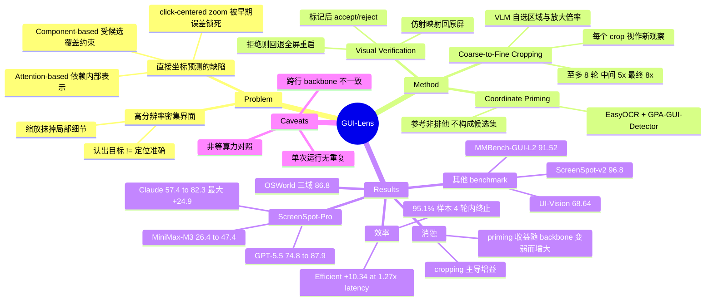

## Summary

提出 GUI-Lens，一个 training-free 的 GUI grounding 框架：把 OCR 与 UI detector 的输出作为坐标参考提供给通用 VLM，由 VLM 自主选择每轮裁剪的区域与放大倍率，并对每个 crop/click 提议做一次视觉校验，最后把局部坐标映射回原屏坐标系。在 ScreenSpot-Pro 上把 Claude Opus 4.7 从 57.4 提到 82.3（+24.9，即摘要所称的最大增幅），GPT-5.5 从 74.8 提到 87.9。需要注意增益的对照是同 backbone 的单次调用 baseline，而非等推理预算 baseline。

## Problem & Motivation

GUI grounding 要把指令映射到可点击的屏幕坐标，难点不在"认出目标"而在"定位得足够准"：高分辨率、控件密集的界面上目标往往很小且与邻近元素外观相似，缩放输入图像又会抹掉区分它们所需的局部细节，于是 VLM 认对了控件却把点击落到相邻控件上。

作者把已有的定位辅助手段归为两类并各自指出边界。Component-based（Set-of-Mark、OmniParser、GUI-Actor）把检测到的区域暴露成候选集合，动作空间因此受候选覆盖率与 parser 质量约束——候选里没有的目标就选不出来（Figure 1 里 Set-of-Mark 恰好漏掉了被问的 toolbar 控件）。Attention-based（TAG、GUI-AIMA）从模型内部响应推位置，但最强注意力响应未必落在真正可点击的元素上，且依赖模型特定的内部表示。

两类方法的共同点是最终仍归结为一次直接的坐标预测，早期的视觉歧义或不准的初始估计会直接传播到结果。已有的 zoom-based refinement（如 ZoomClick）虽然做多步定位，但每一轮新视图都以上一次 click 预测为中心，一旦早期定位偏了，后续观察就被锁死在错误区域。本文的问题设定由此而来：能否让 VLM 在给出最终坐标之前，主动选择一串逐步聚焦的观察？动机上作者接的是 recurrent models of visual attention（Mnih et al. 2014）的 active visual attention 思路。

## Method

GUI-Lens 把 grounding 从一次性预测改写成"在逐步聚焦的视图上做序贯视觉定位"，三个组件：

**1. Coordinate Priming（坐标引导）**。用 EasyOCR（英文 + 简体中文）抽文本参考，用 Hugging Face 上的 GPA-GUI-Detector（confidence 阈值 0.1，NMS IoU 0.3）抽组件参考，两者互补——OCR 给带文字目标的语义线索，detector 覆盖无可读标签的图标与控件。合并成参考集合 $R(I)=\mathcal{O}(I)\cup\mathcal{D}(I)$，每条参考记录 id、label、原屏 bounding box、来源类型（text / component），序列化进 prompt。关键设计是这些参考**非排他**：VLM 仍从图像本身决定裁剪与最终点击，参考只用于把可见内容与大致屏幕位置关联起来，因此 detector 框不准或目标不在候选集时不会被锁死。这是与 component-selection 方法的主要分野。

**2. Coarse-to-Fine Cropping（由粗到细裁剪）**。第 $r$ 轮先按与当前 crop 区域相交筛出可见参考 $R_r$，然后 VLM 根据 $(g, I_r, R_r, r)$ 输出动作 $a_r \in \{\texttt{crop}, \texttt{click}\}$ 及对应的空间提议。与 click-centered zooming 的区别在于**区域和放大倍率都由 VLM 选**，而不是围绕一个临时点击点展开——每个 crop 被当作一个新的视觉观察而非对旧估计的细化。早期 crop 保留版面上下文，后期 crop 聚焦到目标控件。

**3. Visual Verification（视觉校验）**。把提议的框或点标记到当前观察上得到 $\tilde{I}_r$，用同一 backend 的另一套 prompt 判 accept / reject。crop 提议查"标记区域是否含目标"，click 提议查"标记点是否命中被问控件"。接受的 crop 映射回原屏、加 padding、与屏幕边界求交后作为下一轮区域；**拒绝则回退到全屏重启裁剪序列**（而非局部微调），这是 Case Study 里从错误中间 crop 恢复的机制。接受的最终 click 用仿射变换 $\Phi_r$ 映回原屏。

**配置**（Appendix B/D）：GPT-5.5 与 Claude Opus 4.7 最多 8 轮裁剪，MiniMax-M3 最多 5 轮；中间 crop 最多放大 5×、最终 crop 8×；prompt 携带至多 60 条参考（最终 grounding 调用 80 条）；crop 框每边加 8% 上下文 padding；校验重试上限 GPT-5.5/Claude 为 6、MiniMax-M3 为 3。crop proposal、visual verification、final grounding 是对同一 backend 的三类独立调用，响应走受约束的 JSON schema。整套流程 training-free、backbone-agnostic。

## Key Results

**ScreenSpot-Pro（Table 1，同 backbone 对照）**——三个 backbone 全部提升，且提升幅度与 backbone 原生定位能力反相关：

| Backbone | 单次调用 baseline (Avg.) | GUI-Lens (Avg.) | Δ |
|:--|:--|:--|:--|
| GPT-5.5 | 74.8 | **87.9** | +13.1 |
| Claude Opus 4.7 | 57.4 | 82.3 | **+24.9** |
| MiniMax-M3 | 26.4 | 47.4 | +21.0 |

表中最强的先前 grounding system 是 KV-Ground（80.9），最强 specialized GUI model 是 Holo2-235B-A22B（70.6）。值得单独记一笔：**GPT-5.5 的单次调用成绩 74.8 本身就已高于表中全部 specialized GUI model**，框架是在一个很强的起点上再加 13.1。

**其他静态 benchmark（仅用 GPT-5.5）**：ScreenSpot-v2 平均 96.8，作者称超出最强 baseline 1.5 分，Icon 列在 Mobile / Desktop / Web 三个平台上分别领先 1.0 / 3.5 / 3.0 分；UI-Vision 平均 68.64（Basic 73.08 / Functional 67.04 / Spatial 66.05）；MMBench-GUI-L2 平均 91.52。作者据此称在难度更高的 Spatial 与 Advanced 设定上退化更小。

**OSWorld（Table 3，Claude Opus 4.7）**：Chrome 93.5 / Multi-App 80.0 / OS 100.0 / Overall 86.8。同 backbone 的最近参照 Pointer Agent（Claude Opus 4.7）为 83.6，且 GUI-Lens 在三个域上均更高。**评测限定在 Chrome、Multi-Apps、OS 三个域，交互步数上限 15**。

**消融（Table 4，ScreenSpot-Pro 分层抽样 300 例，seed 42，三 backbone 共用同一 manifest）**：

| 配置 | GPT-5.5 | Claude Opus 4.7 | MiniMax-M3 |
|:--|:--|:--|:--|
| Full GUI-Lens | 88.7 | 82.3 | 47.6 |
| w/o Coordinate Priming | 87.7 (−1.0) | 80.3 (−2.0) | 40.3 (−7.3) |
| w/o Cropping | 78.3 (−10.4) | 41.0 (−41.3) | 32.0 (−15.6) |
| w/o Visual Verification | 87.0 (−1.7) | 80.7 (−1.7) | 42.8 (−4.8) |

裁剪是主要增益来源，三个 backbone 上去掉它的掉分都最大。另外两个组件呈现清晰的规律：**coordinate priming 的收益随 backbone 变弱而变大**（GPT-5.5 −1.0，MiniMax-M3 −7.3），verification 同向但更平缓。

**效率（ScreenSpot-Pro 300 例子集 + 1581 例全量跑，GPT-5.5）**：Efficient（≤2 crop、无校验）在 1.27× 延迟下比单次调用高 10.34 分；Balanced（≤2 crop + 校验）与 Quality（≤4 crop + 校验）差 0.33 分，但延迟低 25.6%、VLM 调用少 30.2%。全量跑中 95.1% 的样本在 4 轮裁剪内终止，仅 0.25% 触到 8 轮上限。作者说明延迟覆盖完整 pipeline，而**成本只以"可观测的 VLM 调用次数"衡量，因为 token usage 不可得**。

**Figure 2 的受控对比**：在同一评测设定下，coarse-to-fine cropping 在每一个非零 refinement 设定上都优于 click-centered zooming。这是本文最干净的一个方法学证据。

## Evidence Ledger

| Claim ID | Claim | Type | Source locator | Evidence excerpt | Status |
|:--|:--|:--|:--|:--|:--|
| C1 | ScreenSpot-Pro 上 GUI-Lens (GPT-5.5) 平均 87.9，同 backbone 单次调用为 74.8 | number | Table 1, GUI-Lens (GPT-5.5) 行与 GPT-5.5 行 Avg. 列 | GUI-Lens (GPT-5.5) Avg. 87.9；General Models GPT-5.5 Avg. 74.8 | source-verified |
| C2 | 摘要"up to 24.9 percentage points"对应 Claude Opus 4.7 在 ScreenSpot-Pro 上 57.4→82.3 | number | Abstract 末句 + Table 1 Avg. 列 | "improves overall grounding accuracy by up to 24.9 percentage points" | source-verified |
| C3 | 87.9 为 Table 1 最高值，高于最强先前系统 KV-Ground 的 80.9；作者宣称 ScreenSpot-Pro SOTA | sota-novelty | Table 1 Avg. 列 + §1 第三条 contribution | "with GPT-5.5 achieving state-of-the-art performance on ScreenSpot-Pro" | source-verified |
| C4 | 静态评测为 ScreenSpot-Pro / ScreenSpot-v2 / MMBench-GUI-L2 / UI-Vision + 交互 OSWorld；三 backbone 仅在 ScreenSpot-Pro 上全测，其余三个静态 benchmark 只用 GPT-5.5 | benchmark-setting | §3.1 Datasets + Implementation Details | "ScreenSpot-Pro is used for multi-backend evaluation, while GPT-5.5 is used for ScreenSpot-v2, MMBench-GUI-L2, and UI-Vision." | source-verified |
| C5 | 单次调用 baseline 是 backbone-matched（同 backend 直接从全屏预测点击）但**非等算力**：GUI-Lens 用至多 8 轮裁剪 + 独立的 proposal / verification / final grounding 调用，文中没有等调用数或等 token 预算的 baseline | benchmark-setting | Appendix A "Static grounding comparisons" + Appendix B | "the matched single-shot result is obtained by asking the same backend to predict the click directly from the full screenshot" | source-verified |
| C6 | Table 1 中非 GUI-Lens 行取自各自论文或官方 leaderboard、跑在各自 backbone 上，未在统一基座上重跑 | comparison | §3.1 Baselines + Appendix A | "Results for the remaining methods are taken from their papers or the official benchmark leaderboard under the reported model configuration." | source-verified |
| C7 | Efficient 配置 +10.34 分 @ 1.27× 延迟；Balanced 与 Quality 相差 0.33 分，延迟低 25.6%、VLM 调用少 30.2%（300 例子集，GPT-5.5） | number | §3.4 + Figure 4 | "Efficient improves single-shot accuracy by 10.34 points at 1.27× the latency, while Balanced remains within 0.33 points of Quality" | source-verified |
| C8 | OSWorld 上 Chrome 93.5 / Multi-App 80.0 / OS 100.0 / Overall 86.8，且评测限定 Chrome、Multi-Apps、OS 三域、步数上限 15，非全量 OSWorld 任务集 | benchmark-setting | Table 3 + §3.1 + Appendix A 末段 | "Evaluation uses a 15-step interaction limit on the Chrome, Multi-Apps, and OS domains." | source-verified |
| C9 | OSWorld baseline 取自 OSWorld-Verified leaderboard，作者自承该表不是受控 backbone 对比；Pointer Agent 因同用 Claude Opus 4.7 而是最近参照 | comparison | Appendix A "Interactive computer-use comparisons" + §3.3 | "the table reports their published end-to-end performance rather than treating every row as a controlled backbone comparison" | source-verified |
| C10 | 消融中去掉 cropping 掉分最大：GPT-5.5 −10.4、Claude Opus 4.7 −41.3、MiniMax-M3 −15.6（300 例子集） | number, causal-mechanism | Table 4 + §3.6 | "Removing coarse-to-fine cropping causes the largest performance degradation for all three backbones" | source-verified |
| C11 | ScreenSpot-v2 上 GUI-Lens (GPT-5.5) 平均 96.8，作者称超出最强 baseline 1.5 分 | number | Table 5 + Appendix C | "The resulting 96.8 average exceeds the strongest reported baseline by 1.5 points." | source-verified |
| C12 | Table 2 中 UI-Vision 平均为 68.64（Basic / Func. / Spatial 三分项），MMBench-GUI-L2 平均为 91.52（6 平台 × Basic/Adv.） | number | Table 2 表头（UI-Vision colspan=4，MMBench-GUI-L2 colspan=13）+ GUI-Lens (GPT-5.5) 行 | GUI-Lens (GPT-5.5)：73.08 / 67.04 / 66.05 / 68.64 …… 87.91 / 91.52 | source-verified |
| C13 | 每个数字来自对每个样本/任务的单次评测，未对重复 API 运行取平均；同时 Table 1/2 caption 报告双侧 McNemar 显著性（p<0.05） | benchmark-setting | Appendix D "Evaluation protocol" + Table 1/2 caption | "the paper does not average repeated API runs"；"All gains over matched single-shot baselines are significant (two-sided McNemar test, p<0.05)" | source-verified |
| C14 | 代码发布于 github.com/Fzkuji/GUI-Agent-Harness，补充材料含 pipeline、benchmark adapter、配置与复现说明，不含凭据与缓存的模型响应 | license-code | Abstract 的 Code 行 + Appendix D "Reproducibility assets" | "excludes credentials, cached model responses" | source-verified |
| C15 | Coordinate priming 由 EasyOCR（英文 + 简体中文）与 GPA-GUI-Detector（conf 0.1、NMS IoU 0.3）构成，且参考非排他——VLM 不被限制在候选集内选择 | causal-mechanism | §2.2 末段 + §3.1 + Appendix D "Screen perception" | "Coordinate references guide localization without defining a closed set of target regions." | source-verified |
| C16 | Figure 2：coarse-to-fine cropping 在每个非零 refinement 设定上都优于 click-centered zooming（ScreenSpot-Pro，GPT-5.5） | comparison | §1 第 4 段 + Figure 2 | "coarse-to-fine cropping achieves higher accuracy under every nonzero refinement setting" | source-verified |
| C17 | 1581 例全量跑中 95.1% 样本在 4 轮裁剪内终止，仅 0.25% 耗尽 8 轮预算 | number | §3.4 + Figure 4b | "95.1% of samples terminate within four crop rounds and only 0.25% exhaust the eight-round budget" | source-verified |
| C18 | 13 位作者，2026-08-04 提交（arXiv:2608.03270v1, cs.CV）；正文**未展开**机构标记 1/2/3 的具体名称，仅有 Tencent 实习脚注 | benchmark-setting | 标题/作者块 + 脚注 + arXiv abs 头 | "Work done during an internship at Tencent." | source-verified |

> 全部 18 条高风险 claim 由独立 verifier 定位原文核对，状态均为 `source-verified`。这只表示原文确实包含这些信息，不表示结果已被独立复现——本文所有数字均为单次评测，未做重复运行取平均（C13）。

## Strengths & Weaknesses

**亮点**

- **Figure 2 是全文最有价值的部分，而它不是 main result。** "由 VLM 自选区域与尺度"对比"围绕临时 click 点缩放"，在同一评测设定下每个非零 refinement 步数上都更优。这才是把本文与一堆 zoom-based 方法区分开的机制性证据：多步 refinement 的收益不来自"看得更细"，而来自"不把早期点估计当作后续观察的锚"。作者把它放在 Introduction 当动机图，实际上它比 Table 1 的 SOTA 更值得引用。
- **消融给出了一个可迁移的规律。** Coordinate priming 的收益与 backbone 原生定位能力反相关（GPT-5.5 −1.0 / Claude −2.0 / MiniMax-M3 −7.3），cropping 也大致同向（Claude 掉 41.3 是因为它的原生单次调用本来就弱）。这支持一个更一般的判断：**inference-time 脚手架主要在替补 backbone 缺失的能力，而不是在其之上叠加新能力**。这个规律有直接的预测含义——见 Notes。
- 训练无关、backbone-agnostic、代码已放出，工程上可直接接进现有 agent；OSWorld 一节说明它能作为 grounding 模块嵌入完整 agent 而非只刷静态 benchmark。
- Appendix 相当诚实：明说 Table 1 跨行不可控（C6）、OSWorld 表不是受控对比（C9）、未做重复运行（C13）、token 成本不可得因而只数调用次数。这些披露在同类工作里并不常见。

**局限**

- **核心问题：增益与算力没有解耦。** 单次调用 baseline 只花 1 次 VLM 调用，Quality 配置最多 8 轮裁剪、每轮还有独立的 proposal 与 verification 调用（校验重试上限 6）。文中没有任何等调用数或等 token 预算的对照——例如"给单次调用 baseline 同样多次采样再投票/自洽"。§3.4 的效率分析部分缓解了这一点（Efficient 在 1.27× 延迟下 +10.34），但它对照的是延迟而非等预算 baseline，且 headline 的 87.9 用的是高预算配置。因此"+13.1 / +24.9"不能读成方法本身的净收益。
- **SOTA 声明被 backbone 严重混淆。** Table 1 里 KV-Ground、MVP（Qwen3-VL-32B）、AdaZoom-GUI 等系统跑在体量小得多的开源模型上，GUI-Lens 用的是 GPT-5.5。更能说明问题的是：GPT-5.5 单次调用的 74.8 已经压过表中所有 specialized GUI model（最好 70.6）。所以 87.9 这个数字里有多少来自框架、多少来自基座，从表里读不出来。真正干净的对照只有同 backbone 那三组，而它们又受上一条算力问题影响。
- **OSWorld 的 Overall 86.8 存在未澄清的可比性缺口。** 论文明确 GUI-Lens 只在 Chrome / Multi-Apps / OS 三个域上评测（C8），但未说明 leaderboard 上其他系统的 Overall 是否也限定在同样三域。若基线是全量任务集，则 Overall 一列跨行不可比。相对可信的只有与 Pointer Agent 的同 backbone 对照。
- **单次运行 + McNemar 的组合偏乐观。** McNemar 检验的是同一次运行内的配对差异，处理不了 API 采样带来的运行间方差；对一个每样本要发起十余次模型调用的 pipeline，这个方差不小。
- 方法本身是已知部件的组装（OCR/detector 参考 + 迭代裁剪 + 自校验），概念增量有限；且超参不少（8 轮上限、5×/8× 放大、60/80 参考上限、8% padding、6 次重试），文中没有敏感性分析。
- **没有 Limitations 节，也没有系统的失败分析。** 只有一个成功恢复的 case study，没有讨论 OCR/detector 完全失效时会怎样，也没有 verification 误拒（把正确 crop 判 reject）的代价统计——而 reject 会回退到全屏重启，代价是整轮重来。

**对领域的影响判断（推测）**。短期内这类 inference-time grounding 脚手架仍有用，尤其对定位能力弱的开源 backbone。但按上面那条"脚手架替补缺失能力"的规律外推，随着基座原生 grounding 变强，三个组件里有两个的边际价值会持续收缩（coordinate priming 对 GPT-5.5 已只值 1.0 分）。真正可能长期留下的是 cropping 这条——它对最强的 GPT-5.5 仍值 10.4 分，说明"主动选择观察"解决的是高分辨率输入下的信息瓶颈，而不只是模型能力缺陷。

## Mind Map

## Notes

- **与库内工作的关系。** 这篇落在库里已经很密的"inference-time GUI grounding 脚手架"簇中：[[2605-AutoFocus]]（用 token-level perplexity 作不确定性信号驱动自适应 zoom-in）和 [[2510-VisualTestTime]] 是最直接的同类，[[2500-MegaGuiMultiStage]] 走多阶段增强路线，[[2606-DRSGUI]]（dynamic region search，本文 §4.2 引用）与 [[2606-BAMI]] 是 training-free 细化的另两条线。感知侧 [[2601-GUI-Eyes- Tool-Augmented Perception for Visual Grounding in GUI Agents]] 的 tool-augmented perception 与本文 Coordinate Priming 几乎是同一想法的两种实现，值得并排读。被本文当作对照类别的两支代表分别是 [[2500-GuiActorCoordinateFree]]（component/patch selection）与 [[2511-GuiAima]]（attention-based），benchmark 侧对应 [[2504-ScreenSpotPro]] 与 [[2410-OSAtlas]]（ScreenSpot-v2 出处）。
- **值得单独提炼的 pattern：脚手架收益 ≈ backbone 能力缺口。** 本文三个组件在三个 backbone 上的消融给出了一组难得的定量证据（priming: −1.0 / −2.0 / −7.3；verification: −1.7 / −1.7 / −4.8）。库内 [[2605-AutoFocus]] 在 UI-Venus-7B 上报 50.3→67.8 的大幅提升，同样是"弱 backbone + 强脚手架"的组合。如果把这些点放在一起，可以做一个跨论文的检验：**把各篇 training-free grounding 方法的增益对其 backbone 的单次调用基线作图，看是否呈现系统性的负相关**。若成立，它对整条技术路线是个不利信号（收益随基座进步而蒸发），也能给 CUA-Survey 里"inference-time scaling vs. 训练专用 grounder"的取舍提供一个量化论据。这个分析只需要各篇论文已公开的数字，不需要复现。
- **一个反例式的例外值得注意。** 上述规律对 cropping 不成立：即使在 GPT-5.5 这个已经很强的基座上，去掉裁剪仍掉 10.4 分。这提示 cropping 解决的可能是输入分辨率/token 预算导致的信息瓶颈（一个架构层面的约束），而 priming 与 verification 解决的是模型能力缺陷。若这个区分成立，那么"哪些 inference-time 技巧会随基座进步而过时"是可以事先判断的——判据是它补的是信息瓶颈还是能力缺口。
- **未解的核查点（非本文可核实范围）。** OSWorld Table 3 中其他系统的 Overall 是否同样只统计 Chrome / Multi-Apps / OS 三域，需要查 OSWorld-Verified leaderboard 本身才能确定；本文未说明。在引用 86.8 这个数字时应带上"三域、15 步上限"的限定。
- **机构信息的证据边界。** v1 的作者块只有数字标记 1/2/3，全文未展开对应机构名称，唯一明确的机构线索是脚注 "Work done during an internship at Tencent."（Xian Wu 标记为 2）。frontmatter 的 `institute` 因此只填 Tencent，标记 1 与 3 对应的机构留待正式版确认，不做推断。
- 代码库 `github.com/Fzkuji/GUI-Agent-Harness` 同时是论文的实验 harness（"All experiments are implemented in GUI-Agent-Harness"），属于贡献在实现里的类型，可考虑另起一轮 `repo-digest` 看 crop/verify 循环的实际控制流与提示词。
