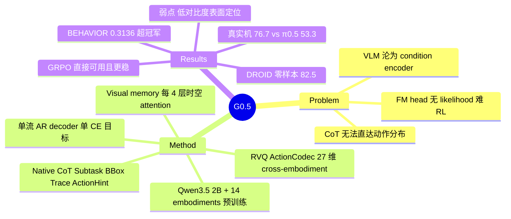

## Summary

Galaxea 的 G0.5 反对主流 VLA 的 "预训练 VLM + 独立 flow-matching action expert" 配方，让单个 transformer decoder 在共享 token vocabulary 上以单一 next-token cross-entropy 目标同时生成 CoT 推理与离散动作码。使其在 foundation 规模可行的是三个组件：cross-embodiment RVQ action tokenizer（27 维统一动作空间 + active-part 预测）、原生 CoT 流（Subtask / BBox / Trace / ActionHint）、在 ViT 内插 factorized spatial-temporal attention 的 visual memory。7 个评测 regime 全面领先：真实机微调 76.7%（π0.5 53.3%、GR00T-N1.7 24.4%）、2025 BEHAVIOR Challenge 0.3136（超挑战赛冠军）、DROID 零样本 82.5%、LIBERO 98.9%、RoboTwin 2.0 93.3%、SimplerEnv-Bridge 87.3%。

## Problem & Motivation

当前主流 VLA（π0 / π0.5、GR00T-N1.x、SmolVLA 等）把预训练 VLM 当特征提取器，动作生成放在单独参数化、单独目标（flow matching）的 action expert 里。论文的核心批评：这让 VLM 从 decision-maker 退化为 context encoder，其自回归推理能力被一个压缩的 conditioning bottleneck 隔离在动作生成之外。代价体现在三处：（1）CoT、in-context learning、prompt steering 只能塑造条件，不能直接 reshape 下一步动作分布；（2）flow-matching head 不暴露 likelihood，ratio-based RL 算法（如 GRPO）无法直接套用；（3）VLM 预训练获得的指令跟随能力难以传导到物理行为。作者要回答的问题是：单流自回归路线在 foundation-model 规模是否 tractable，以及它相对 VLM-as-encoder 架构的优势是结构性的还是偶然的。

## Method

**单流架构**。以多视角图像、指令、proprioception、embodiment identifier 为条件，单个 decoder（自 Qwen3.5 2B 初始化）生成 optional CoT span + 离散 action codes，全程一个 next-token cross-entropy 目标（Eq. 1）。ActionCodec 把 action codes 解码为连续电机指令。

**Structured action tokenization**（Sec 3.1）。把每个机器人分解为独立 motion parts（left control / right control / lower body 等），各 part pad 到共享最大维度后训练 residual vector quantization（RVQ）模型，并加 temporal contrastive 目标提升相邻动作的 token 一致性。所有数据源映射进单一 27 维统一动作空间：left_control(9)、left_gripper(1)、right_control(9)、right_gripper(1)、lower_body(7)。推理时 active-part tokenization 只预测被激活的部件；动作序列展开为 R 个 residual rounds（DoF-group markers + action codes）。与 FAST 固定 DCT 管线的区别：codec 端到端学习且 by design cross-embodiment（分组策略取自 FASTer，训练配方取自 ActionCodec）。

**Native chain-of-thought**（Sec 3.2）。四类 self-describing targets——任务分解（Subtask:）、关键物体定位（BBox:）、运动规划（Trace:）、动作提示（ActionHint:）——的任意子集构成 8 种 CoT format；训练时每个 robot 样本按权重随机采一种（subtask-text 权重更高）。CoT 监督由 autolabeling 管线生成：规则化时序切分后调用多模态 API（Gemini 3、Doubao Seed 2.0 Pro）产出 action hints / 原子任务描述 / episode 级指令；视觉 grounding 用多模态基础模型 + SAM3 tracking 出逐帧 bbox；2D end-effector traces 由 forward kinematics 计算 3D 轨迹后投影到头部相机平面。

**Visual memory**（Sec 3.3）。循 π0.7 与 MEM 的做法，在 Vision Transformer 每 4 层插入 factorized spatial / temporal attention 模块融合多秒历史帧；训练时随机 drop 历史帧作正则，保证无历史时性能不退化。

**Pre-training**（Sec 4）。单阶段训练：机器人数据覆盖 14 个 embodiment（真实 + 仿真，不含 DROID），与 web VQA、embodied VQA 及 in-house 标注按 action-heavy 比例混合共训，以保留语言能力并强化空间感知。

## Key Results

| Regime | G0.5 | 对比 baseline | 备注 |
|:--|:--|:--|:--|
| 真实机微调 R1-Lite/R1-Pro（6 个 task-embodiment 设定） | 76.7%（process score 129.2） | π0.5 53.3%；GR00T-N1.7 24.4% | 同数据同算力（各 16 H20 GPU、同 wall-clock 4-10h）、同观测/动作/控制设置 |
| 2025 BEHAVIOR Challenge（50 长程家务移动操作任务） | 0.3136（4 epochs）；0.2904（1 epoch） | π0.5（4 epochs）0.2626；冠军 RLC 0.2605 | 1 个 post-training epoch 即超 π0.5 四轮与冠军 |
| DROID post-training 后零样本（10 任务） | 82.5% | π0.5-DROID 57.5%；MolmoAct2-DROID 52.0% | DROID 不在预训练；评测环境与物体 held-out；10/10 任务胜 π0.5-DROID |
| LIBERO（4 suites） | 98.9%（Long suite 最强） | Xiaomi-Robotics-0 98.7%；π0.5 96.9% | benchmark 已饱和，优势仅 0.2pp |
| RoboTwin 2.0（clean / randomized） | 93.7 / 92.8，平均 93.3% | LingBot-VA 92.2%；π0.5 79.8% | 对次优优势 1.1pp |
| SimplerEnv-Bridge（4 任务） | 87.3% | Xiaomi-Robotics-0 79.2%；π0.5 57.1% | abstract 只引 π0.5 对比；实际次优是 79.2% |
| PP Bench（R1-Lite 实机，64 类物体 + 3 类容器） | zero-shot LF 65.6% / TS 59.4%；50H 后 84.4% / 75.0% | π0.5（50H）68.8% / 65.6% | 零样本语言跟随接近 π0.5 的 50H 后水平（辨析见 C15） |

机制层面三组实验支撑 "AR 接口有结构性红利" 的论点：

- **CoT 推理时开关**（同一 checkpoint，Sec 5.6）：单阶段 PP Bench 上 CoT 最多带来约 1.6pp（AR 65.6→67.2）；五阶段长程任务上 AR+CoT 的 progress score 从 2.4 升到 3.8（Air Fryer）、1.5 升到 3.4（Bacon）。作者措辞谨慎地报告 AR head "appears to" 比额外训练的 flow-matching head 更贴合 CoT。
- **RL 直接可用**（Sec 5.7）：AR policy 暴露精确 token-level log-probability，GRPO 可直接套用；FM head 须按 RLinf 引入 SDE 把去噪过程当 Markov 过程近似 log-prob。在 4 个 LIBERO 任务（每任务 1 条演示 post-train 起点、初始成功率相当）上，AR policy 收敛更快、最终成功率更高、跨 seed 方差更低（Fig 12）。
- **视觉对比度失败模式**（Sec 5.1.2）：半透明白色抽屉无 marker 时 G0.5-DROID 仅 60%（π0.5-DROID 90%、MolmoAct2-DROID 80%）；贴橙色高对比 marker 后升到 100%，而 π0.5 几乎不受影响。

## Evidence Ledger

| Claim ID | Claim | Type | Source locator | Evidence excerpt | Status |
|:--|:--|:--|:--|:--|:--|
| C1 | 真实机微调六设定平均 76.7% vs π0.5 53.3% vs GR00T-N1.7 24.4%（process score 129.2/105.2/68.9） | number | Sec 5.4 / Fig 8 / Abstract | "average success rate of 76.7%, compared with 53.3% for π0.5 and 24.4% for GR00T-N1.7" | source-verified |
| C2 | 5.4 三模型同微调数据、对齐算力（16 H20、同 wall-clock 4-10h）、同观测/动作/控制设置 | benchmark-setting | Sec 5.4 protocol | "fine-tuned on the same training data with an aligned compute budget … 16 H20 GPUs" | source-verified |
| C3 | BEHAVIOR：G0.5 0.3136（4ep）/0.2904（1ep）vs π0.5 0.2626、RLC 0.2605、Comet 0.1830 | number | Sec 5.3 / Table 4 | "RLC 0.2605; Comet 0.1830; π0.5 0.2626; G0.5 1-epoch 0.2904; 4-epoch 0.3136" | source-verified |
| C4 | DROID 10 任务平均 82.5% vs 57.5% / 52.0%，且 10/10 任务胜 π0.5-DROID | number | Sec 5.1.2 / Fig 6 | "average of 82.5%, outperforming π0.5-DROID (57.5%) … MolmoAct2-DROID (52.0%)" | source-verified |
| C5 | DROID 数据不在 foundation 预训练；评测环境与物体实例 held-out | benchmark-setting | Sec 4 / Sec 5.1 | "DROID data are not part of this foundation pre-training mixture" | source-verified |
| C6 | LIBERO 平均 98.9%（Long 最强）；次优 Xiaomi-Robotics-0 98.7；π0.5 96.9 | number | Sec 5.2.3 / Table 3 | "average success rate of 98.9% … strongest performance on the challenging Long suite" | source-verified |
| C7 | RoboTwin 2.0：93.7/92.8/93.3 vs LingBot-VA 92.2、Fast-WAM 91.8、π0.5 79.8 | number | Sec 5.2.2 / Table 2 | "G0.5 (Ours) 93.7 92.8 93.3" | source-verified |
| C8 | SimplerEnv-Bridge 平均 87.3% vs 次优 Xiaomi-Robotics-0 79.2、π0.5 57.1 | number | Sec 5.2.1 / Table 1 | "G0.5 achieves the highest average success rate of 87.3%" | source-verified |
| C9 | 单 decoder 共享 vocabulary 单目标；主流配方使 VLM 沦为 context encoder | causal-mechanism | Abstract / Sec 1 / Eq 1 | "a single transformer decoder emits reasoning and action tokens under a single objective" | source-verified |
| C10 | motion-part 分解 + RVQ + temporal contrastive；27 维 partition；active-part 预测 | causal-mechanism | Sec 3.1 / Sec 4 | "pad each part to a shared maximum dimensionality before training a residual vector quantization (RVQ) model" | source-verified |
| C11 | CoT 四类 targets；每样本从 8 种 format 加权采一 | causal-mechanism | Sec 3.2 / Sec 4 | "four self-describing targets—Subtask:, BBox:, Trace:, ActionHint:" | source-verified |
| C12 | ViT 每 4 层插 factorized spatial/temporal attention；训练随机 drop 历史帧 | causal-mechanism | Sec 3.3 | "inserting factorized spatial and temporal attention modules every four layers within the Vision Transformer" | source-verified |
| C13 | Qwen3.5 2B 初始化；单阶段 14-embodiment + VQA action-heavy 混合；称释出 pretrained backbone | license-code | Sec 3 / Sec 4 / Conclusion | "initialized from Qwen3.5 2B … covers 14 embodiments … the released pretrained backbone" | source-verified（释出仅为论文声明，实际可得性未查证） |
| C14 | PP Bench：zero-shot 65.6/59.4；1H/10H/50H LF 62.5/71.9/84.4、TS 57.8/65.6/75.0；π0.5 50H 68.8/65.6 | number | Sec 5.5 / Fig 10 | "language following rate of 65.6% and a task success rate of 59.4%" | source-verified |
| C15 | Conclusion 称 G0.5 zero-shot LF 超过 post-trained π0.5 baseline | comparison | Sec 6 vs Sec 5.5 / Fig 10 | "zero-shot language-following rate of G0.5 exceeds the post-trained π0.5 baseline" | contradicted（π0.5 50H LF 68.8% > 65.6%；仅对 1H/10H 规模成立） |
| C16 | CoT 开关：单阶段最多约 1.6pp；Air Fryer 2.4→3.8、Bacon 1.5→3.4 | number | Sec 5.6 | "AR moves from 65.6 to 67.2 … progress score lifts from 2.4 to 3.8" | source-verified |
| C17 | AR 暴露 token log-prob 可直接 GRPO；FM 需 SDE 重构；AR 收敛更快更稳更高 | causal-mechanism | Sec 5.7 / Fig 12 | "exposes exact token-level log-probabilities … converges substantially faster" | source-verified |
| C18 | drawer 无 marker 60% vs π0.5 90%、MolmoAct2 80%；加 marker 后 G0.5 达 100% | number | Sec 5.1.2 | "π0.5-DROID: 90%, MolmoAct2-DROID: 80%, G0.5-DROID: 60% … improves … to 100%" | source-verified |

## Strengths & Weaknesses

**Strengths**

- 架构论点配了 apples-to-apples 证据，而非只靠排行榜：5.4 把三个模型放在同数据、同算力、同控制栈下微调（C2），这在 VLA 论文里少见，让 76.7% vs 53.3% 的差距可归因于架构而非训练预算。
- "AR 接口的红利是结构性的" 有三条独立证据链：CoT 在长程任务的推理时增益（C16）、GRPO 免重构直接可用且优化更稳（C17）、零样本语言跟随的强先验（C14）。每条都指向同一机制——动作与推理共享 likelihood 参数化。
- BEHAVIOR Challenge 用第三方 ranking metric，1 个 epoch 超过四 checkpoint 的冠军方案（C3），是预训练先验质量的有力外部信号。
- 失败模式披露诚实：低对比度表面的定位缺陷用受控实验量化（C18），并明确 visual memory 只覆盖数秒、lower body 未单独评测。

**Weaknesses**

- Conclusion 存在一处内部 overclaim：声称 zero-shot 语言跟随超过 "post-trained π0.5"，但自家 Fig 10 显示 π0.5 在 50H post-training 后 LF 为 68.8%，高于 G0.5 零样本的 65.6%（C15，verifier 判 contradicted）；该说法只对 1H/10H 规模成立。
- 仿真 benchmark 证据力有限：LIBERO 对次优仅 0.2pp、RoboTwin 1.1pp，均近饱和；abstract 在 Bridge 上只引 π0.5（57.1%）作对比而实际次优是 79.2%，选择性对比放大了观感优势。真正有区分度的是真实机、BEHAVIOR 与 DROID 三个 regime。
- 对低对比度、半透明表面的敏感性（60% vs π0.5 的 90%）提示离散 action-token 化的策略可能在精细视觉伺服上弱于连续 head——这是我的推测，论文只归因于预训练数据分布，未做机制分析。
- CoT 增益局限于长程 stage-conditioned 场景，单阶段任务上约 1.6pp 接近噪声；"prompt steering" 证据目前是定性观察，作者自己也承认需要系统性研究。
- 2B 规模单一 size，没有 scaling 分析；Fig 1 提到 inference latency 对比，但正文提取部分未见具体延迟数字，AR 逐 token 解码的实时性代价未在本笔记核查范围内。

对领域的影响：这是继 FAST/ECoT 之后对 "自回归路线 vs flow-matching expert 路线" 之争最系统的一次正面交锋，且把 RL 可微调性（likelihood 接口）作为架构选型论据摆上台面。若 backbone 如声明释出，可能成为 AR-VLA 路线的参考基座。

## Mind Map

## Notes

- LIBERO / Bridge 榜上的次优 baseline 是 Xiaomi-Robotics-0，可与 [[2602-XiaomiRobotics0]] 对照其架构路线；与 [[2608-InContextVLA]]、[[2608-VLAProprioception]] 的观测/条件设计也值得后续交叉阅读。
- 值得追踪的开放问题：AR 逐 token 解码的推理延迟 vs flow-matching 单次积分的实测对比（论文 Fig 1 声称覆盖，未在本笔记核查）；prompt-level motion steering 的系统性量化。
- 该工作与 "action tokenizer 会损失控制精度" 的常见反对意见正面冲突（drawer 失败案例或是佐证），是跨论文矛盾信号，值得在 VLA survey 中记一笔。
