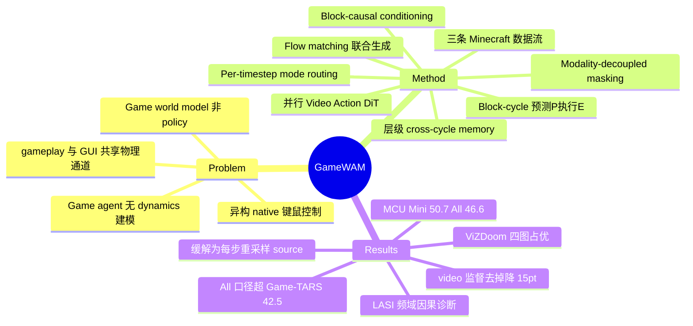

## Summary

GameWAM 是（论文自称）首个面向 native closed-loop gameplay 与 GUI 控制的 World Action Model：并行 Video/Action DiT 以 flow matching + block-causal conditioning 联合生成未来观测与可执行键鼠轨迹，per-timestep mode router 区分 gameplay/GUI 两套动作分布，block-cycle 控制（预测 P 步、只执行 E<P 步）加层级 cross-cycle memory 支撑长时程交互。在 MCU 的 800+ Minecraft 任务上平均 ASR Mini 50.7 / All 46.6，ASR All 口径超过最强 baseline Game-TARS（42.5）且成功 episode 步数更少。论文另发现并因果定位了 LASI（Low-Frequency Action Source Imprinting）failure mode——固定 conditioning 下采样 action source 的低频成分会系统性控制生成的粗粒度相机运动。

## Problem & Motivation

现有两条路线各缺一半：game agent 直接从视觉与任务上下文映射到动作，缺显式 world dynamics 建模；interactive game world model 在给定动作下预测视觉未来，但不充当任务 policy。游戏环境同时具备第一人称感知、快速视觉变化、持久世界状态与异构 native 控制——并发离散按键、连续相机运动、稀疏鼠标事件混合；GUI 交互（游戏内菜单/inventory）复用同一物理键鼠通道做光标移动、点击、滚动，"identical action dimensions can have different semantics, scales, and conditional distributions across regimes"。目标是在一个生成过程中统一 task-directed action 与其视觉后果，并原生处理这种控制异构性。

## Method

**1. 并行 Video/Action DiT + flow matching。** 两个模态各自有独立噪声流（X_σ = (1−σ)X₀ + σε），并行 DiT 从噪声模态、噪声水平与因果上下文估计两个 vector field；rollout 时从 σ=1 积分 ODE 到 0，联合产出未来视频块与键鼠轨迹块。

**2. Block-causal conditioning 与 modality-decoupled masking。** 条件 Γ = (周期内 clean 观测上下文, 语言指令, 跨周期视觉历史 H_c, 可选 proprioceptive state)。未来块按块级因果分解，只 condition 于 clean prefix 与因果在前的块；两模态共享同一 clean prefix（共享 K/V），但彼此的噪声变量互不可见，防止未观测未来的跨模态泄漏。

**3. 异构控制的 per-timestep mode routing。** Action DiT 每个 timestep 同时预测 gameplay 专用与 GUI 专用两个 action flow 加一个 routing logit，sigmoid 阈值选择分支；连续动作坐标按 gameplay/GUI 各自统计归一化，离散坐标共享归一化。训练时用观测到的真实 mode 选监督分支并作 routing target，rollout 用预测 route，允许单条轨迹内切换模式。

**4. Block-cycle control（预测长、执行短）。** 每个 planning unit 预测 P 个动作但只提交执行前 E<P 个，随后观测并 replan——更长 look-ahead 同时保持高频反馈。训练时同一轨迹上每 E 步锚定的 overlapping P 步 plan 在 block-causal 可见性下并行 teacher-forced，避免串行 rollout。

**5. 层级 cross-cycle memory。** 两级历史 H_c = [M_c; R_c]：recent buffer 用 Conv3D(VAE(·)) 压缩已执行观测、FIFO 保留最近 K_R 段；溢出段经 attention pooling 更新固定 slot 的 long-term memory，不同 slot 按不同 half-life 多时间尺度更新（短时间尺度对新段权重大）。辅以 relative-time embedding 与一个 history 正则 loss（压缩历史需保持对当前视觉特征可预测）。

**6. 训练数据。** 三条 Minecraft 流：regular VPT 轨迹（广覆盖）、event-anchored VPT（围绕状态转换事件密集采样 clip）、scripted GUI 轨迹（扩界面交互覆盖）；统一到同步的 observation/state/native 键鼠动作时间线并带 control-mode label。总 loss = video flow + action（连续/离散分开加权）+ mode BCE + history 正则。

## Key Results

- **MCU（800+ 任务，Embodied/GUI/Combat 三类；ASR Mini 每任务 10 runs，ASR All 每任务 5 runs）**：GameWAM 平均 ASR Mini 50.7、ASR All 46.6，为全表最高，且所有类别成功 episode 步数显著更少。分类别（Mini/All）：Embodied 70.0±32.2 / 47.5±36.0，GUI 43.0±32.9 / 60.0±38.6，Combat 39.0±25.9 / 32.2±30.2。最强 baseline Game-TARS 未报 ASR Mini（表中为 "–"），ASR All 为 50.4±20.7 / 39.1±27.5 / 38.1±24.6，平均 42.5——严格可比口径是 All 上 46.6 vs 42.5。其余 baseline 含 VPT、STEVE-1、ROCKET-1、JARVIS-VLA、OpenHA 系列等。
- **ViZDoom（4 张地图，每图 50 episodes 平均 reward）**：一致优于 Game-TARS，相对其他多模态 agent "competitive or leading"（具体 reward 数字未在本次抓取中获得）。
- **Ablation（MCU Mini 平均）**：full 50.7 → action-only supervision（去掉 future-video 监督）35.7、coarser temporal sampling 36.7（论文称此二者退化最大）→ 去 event-anchored 采样 38.0 → unified action distribution（不分模式）38.3 → P=E 41.3 → 去 cross-cycle history 46.7（但 Embodied 类反升至 75.0±30.1，高于 full 的 70.0）。
- **LASI 因果诊断（DCT 频域三步干预）**：固定条件下 yaw DCT0 source-output 相关 r=0.890；仅替换 source 低频 modes 0–2 使对应 yaw DCT0 输出在 94.8% trials 中跟随 donor；同一低频带置零消除 99.25% 相关输出方差。闭环中复用同一 sampled source 会使**部分 realization** 出现持续方向性相机偏转与原地反复旋转；采用的缓解是每个 replanning step 重采样 action source，"mitigates coherent episode-level accumulation without removing the underlying source sensitivity"。
- **可复现性**：承诺公开 training/evaluation code、data-processing scripts、constructed datasets、模型权重与配置（受第三方 license 约束）；模型参数量、初始化来源、训练算力在本次抓取的正文/附录内容中未披露。

## Evidence Ledger

| Claim ID | Claim | Type | Source locator | Evidence excerpt | Status |
|:--|:--|:--|:--|:--|:--|
| C1 | 论文自称 "first WAM for native closed-loop gameplay and GUI control" | sota-novelty | Abstract + Sec.1 | "We introduce GameWAM, to our knowledge the first WAM for native closed-loop gameplay and GUI control." | source-verified |
| C2 | MCU 平均 ASR Mini 50.7 / All 46.6 为全表最高，且成功步数显著更少 | number/comparison | Table 1 + results text | "highest average success rates (ASR) on both the Mini and full task sets while requiring substantially fewer steps" | source-verified |
| C3 | 分类别：Embodied 70.0±32.2 Mini；GUI 43.0±32.9 Mini / 60.0±38.6 All；Combat 39.0±25.9 Mini | number | Table 1, GameWAM row | "Embodied 70.0±32.2 (ASR Mini); GUI 43.0±32.9 (Mini), 60.0±38.6 (All); Combat 39.0±25.9 (Mini)" | source-verified |
| C4 | Game-TARS 分类别数字 50.4±20.7 / 39.1±27.5 / 38.1±24.6 为 ASR Mini（原稿） | number | Table 1, Game-TARS row | "ASR Mini: –, –, –; ASR All: 50.4±20.7, 39.1±27.5, 38.1±24.6; Avg All 42.5" | contradicted → 已纠正：该三数属 ASR All 列，Mini 列为 "–"；正文已改为 All 口径比较（46.6 vs 42.5） |
| C5 | LASI 定义：固定 conditioning 下 source 低频成分系统性控制粗粒度相机运动；闭环复用同一 source 致部分 realization 持续偏转/原地旋转 | causal-mechanism | Sec. 5.5 | "Reusing the same sampled source across replanning cycles caused some realizations to induce persistent directional camera bias and repeated in-place rotation" | source-verified |
| C6 | LASI 因果证据：yaw DCT0 r=0.890；swap modes 0–2 → 94.8% donor-following；置零消除 99.25% 方差 | number/causal-mechanism | Sec. 5.5 + Fig. 5 | "yaw DCT0 reaching r=0.890 ... follow the donor in 94.8% of trials ... removes 99.25% of the associated output variance" | source-verified |
| C7 | 缓解=每 replanning step 重采样 source，不消除底层敏感性 | causal-mechanism | Sec. 5.5 | "resample the action source at each replanning step ... without removing the underlying source sensitivity" | source-verified |
| C8 | Ablation：action-only 35.7、coarser sampling 36.7，为最大退化 | number | Table 2 + text | "removing future-video supervision or using coarser temporal sampling produces the largest performance degradation" | source-verified |
| C9 | Ablation：unified action distribution 38.3；P=E 41.3；full 50.7 | number | Table 2 | "Unified action distribution ... Avg 38.3; Matched prediction–execution horizon (P=E) ... Avg 41.3" | source-verified |
| C10 | 去 cross-cycle history 平均 46.7，Embodied 反升 75.0±30.1 | number | Table 2 | "No cross-cycle history: Embodied 75.0±30.1 ... Avg 46.7" | source-verified |
| C11 | ViZDoom 四图、每图 50 episodes；一致优于 Game-TARS，competitive or leading | benchmark-setting/comparison | ViZDoom section / Fig. 4 | "consistently improves over Game-TARS ... across all four scenarios"; "average reward for each map is calculated over 50 episodes" | source-verified |
| C12 | MCU 800+ 任务三类；Mini 10 runs/任务，All 5 runs/任务 | benchmark-setting | Table 1 caption | "over 800 tasks ... ASR Mini is calculated by averaging 10 runs per task, and the ASR All is calculated by averaging 5 runs" | source-verified |
| C13 | 训练数据三条流统一到同步时间线 + control-mode label | benchmark-setting | Sec. 4 data | "All streams are standardized on a common interaction timeline into synchronized observations, state, and native keyboard–mouse actions with a control-mode label" | source-verified |
| C14 | 承诺公开 code/scripts/datasets/weights/configs，受第三方 license 约束 | license-code | Reproducibility Statement | "publicly release the training and evaluation code, data-processing scripts, constructed datasets, trained GameWAM model weights" | source-verified |
| C15 | Block-cycle：预测 P 个动作只执行前 E<P 个，随后观测并 replan | causal-mechanism | Method (block-cycle) | "A plan contains P actions, whereas only its first E actions form the committed execution block ... E<P" | source-verified |

## Strengths & Weaknesses

**Strengths**：
- **LASI 是超出本文的通用发现**：对任何 flow-matching/diffusion 生成式 action policy，sampled noise source 不只是 diversity 来源——低频成分构成一条隐藏控制通道，闭环复用会相干累积成行为偏差。三步频域干预（关联 → swap → zeroing）的因果诊断方法论本身可直接迁移到 robotics WAM 与 diffusion-head VLA 的检查中。
- **Ablation 信息量大**：去掉 future-video 监督平均掉 15pt（50.7→35.7），是"视频生成对 policy 有实质贡献"的少见正面定量证据；mode routing 相对统一分布 +12.4pt，证明异构控制不能用单一动作分布硬吞。
- 在 800+ 任务上做闭环任务成功率评测而非 offline 视频指标，问题设定（统一 world model 与 policy 于一个生成过程 + native 键鼠动作空间）比多数游戏 world model 工作更接近可用 agent。

**Weaknesses / 适用边界**：
- 环境仅 Minecraft + ViZDoom；此处 "GUI" 是游戏内界面（inventory、菜单），到 OS 级 computer-use 的迁移是**推测**，论文未测。
- 模型参数量、Video DiT 初始化来源（是否用预训练视频模型）、训练算力在抓取到的正文与附录内容中均未披露（Appendix C/D 有相关标题但数字未见）——可复现性承诺与信息披露之间有落差。
- ASR 方差极大（±25~±39），Mini 每任务仅 10 runs；GUI 类 ASR All（60.0）反高于 Mini（43.0），提示 Mini 子集与全集分布差异不小，单一平均数的稳健性存疑（推测：子集构成差异，论文未解释）。
- 最强 baseline Game-TARS 未报 ASR Mini，"Mini 全表最高"对其不可比；严格可比的只有 All 口径 46.6 vs 42.5（+4.1pt）。
- LASI 缓解是 per-step 重采样的**规避**而非修复——论文明说底层 source 敏感性仍在，开放问题。
- 去掉层级记忆平均只掉 4pt 且 Embodied 反升 5pt：cross-cycle memory 的收益高度不均匀，主要组件复杂度是否值回票价存疑。

## Mind Map

## Notes

- **与 vault 内 WAM 笔记的关系（均为不同工作，同挂 WAM 名）**：[[2608-SimWAM]]（driving）与 [[2608-MobileWAM]]（mobile manipulation）都在**推理时丢弃 video 分支**；GameWAM 相反，rollout 全程保留联合视频生成。注意这与 SimWAM 并不构成直接矛盾：GameWAM 的 ablation 去掉的是**训练期** future-video 监督（掉 15pt），SimWAM 保留训练期监督、只去推理期生成。真正未被测的组合是"保留训练监督、推理期丢弃生成"在游戏域是否成立——一个现成的开放对照实验。[[2608-JEPAWAM]] 则在 frozen latent 空间做 transition，不生成像素。[[2602-DreamZero]] 被本文 related work 明确引用为先行的 joint video+action closed-loop WAM，因此 "first" claim 完全依赖 "native gameplay + GUI control" 的域限定，不是范式层面的 first。
- **GUI Agent 兴趣关联**：gameplay/GUI 共享物理通道但条件分布迥异的 mode-routing 问题，是 computer-use 中跨应用异构控制的微缩版；LASI 型 source-sensitivity 对任何带 diffusion/flow action head 的 GUI agent 同样值得做频域检查——这可能是个可移植的诊断工具而非游戏特有现象（推测）。
- Project page 标注 "12.51 Hz Online execution frequency"（单 NVIDIA H200），但本次正文抓取未检索到该数字，未经 verifier 核查，仅记录来源为 project page。
- 代码库 https://github.com/yunncheng/GameWAM 已建（release 状态未确认）；若权重/数据如 reproducibility statement 释出，可作 repo-digest 候选。
