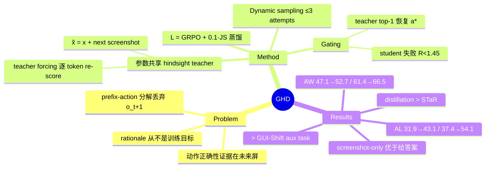

## Summary

GHD（Gated Hindsight Distillation）针对 mobile GUI agent 离线训练中的 supervision gap——prefix-action 分解丢弃了下一屏截图，也就丢弃了"该动作为何正确"的证据——把成功轨迹中真实观测到的 next screenshot o_{t+1} 作为训练期 privileged information：一个与 student 共享参数的 teacher 额外看到 o_{t+1}，对 student 的 on-policy rollout 做逐 token teacher-forcing re-score，且只在"student 失败、hindsight teacher 能恢复 demonstrated action"时才施加蒸馏。在 AndroidWorld / AndroidLab 上对 Qwen2.5-VL-7B 与 Qwen3-VL-8B 两个 backbone 均稳定超过 GRPO（AW 47.13→52.73 / 61.35→66.47；AL 31.93→43.10 / 37.43→54.11），部署时 teacher、未来帧与 gate 全部丢弃、零推理开销。

## Problem & Motivation

GUI agent 主流离线训练把成功轨迹分解为 prefix-action pair：从当前屏与历史预测 demonstrated action，后续观测被丢弃。这带来双重缺陷：(1) 目标只监督"选哪个动作"而不监督"为什么"，app-specific rationale 从不是训练目标，模型可能采到正确动作却配一个不接地的 rationale；(2) 即使显式监督 reasoning，正确 rationale 所需的证据往往只出现在动作之后的屏幕上（例：开启 Soft Wrap 需先点 Edit 或 View，但菜单打开前无任何线索）。作者的核心表述：条件在下一帧上把 hard prediction 变成 easy inference——"What should I do?" 问的是不确定的 prior p(z|s)，"What must I have done?" 问的是几乎确定的 posterior p(z|s,s')。与 GUI world model（推理时预测未来）和 action-effect verification（推理时检查 realized next screen）不同，GHD 从不预测未来，只在训练期消费离线轨迹里已有的真实未来帧，部署侧不带任何 world model 或 verifier。

## Method

**Privileged hindsight teacher（参数共享）**。student 观测部署时可得的 context x_t（instruction + 截图/动作历史 + 当前屏）；teacher 用 x̃_t = (x_t, o_{t+1})，与 student 共享同一套参数，唯一优势是多看一帧真实的 next screenshot。teacher 不单独训练、不自回归解码。

**逐 token re-score（teacher forcing）**。对 π_old 采出的每条 student response y，把其 token 附加到两个 context 后各跑一次 forward：位置 j 上 student 分布 π_S^j = π_θ(·|x_t, y_<j) 可训练，teacher 分布 π_T^j = sg[π_θ(·|x̃_t, y_<j)] 带 stop-gradient。两者条件在同一条（可能有错的）student prefix 上，故 teacher 提供的是沿 student 自身 rollout 的 dense 逐 token 修正。蒸馏损失 follow SDPO，用 generalized Jensen-Shannon divergence（α=0.5），为效率只在 student top-K=100 tokens + 一个剩余词表 mass bucket 上计算，覆盖 reasoning 与 tool-call 全部 token。

**Gating——privileged 信号必须自证有效**。M(y)=1 需同时满足：(1) prefix-only student 失败，R(y) < τ_succ = 1.45（step verifier reward R = ½type + ½value + ½format ∈ [0,1.5]，坐标用 normalized 1000×1000 grid 上的距离相似度）；(2) teacher 在 y 的每个位置取 top-1 token、拼接后能解析出与 demonstrated action a_t* 匹配的动作 â_T（click/long_press/swipe 坐标容差 δ=20，type/answer 用精确或 normalized edit-similarity，离散参数精确匹配，格式不合法直接拒绝）。因为 Eq.5 与 Eq.8 用的是同一 teacher 分布、同一 student prefix，gate 直接检验的就是将被蒸馏的那个信号。

**Dynamic sampling**。一个 batch 可能没有"student 失败且 teacher 可纠正"的样本：同一批 prompt 最多重采 3 组 rollout（期间不更新模型），首个含被接受样本的 attempt 即停，全失败则保留最后一组。全程平均 2.69 attempts/batch。

**联合目标**。L = L_GRPO + λ·L_GHD，λ=0.1；GRPO 无额外 KL 惩罚。推理时只保留 prefix-conditioned student。

**训练设置**。Qwen2.5-VL-7B / Qwen3-VL-8B 各自按 [[2604-OpenMobile|OpenMobile]] recipe 复现 SFT（截图 resize 到 420×896，视觉 token 约减 3×，初始分低于官方 checkpoint）；训练数据为 OpenMobile 轨迹的 hard subset（过滤 SFT 一次即解样本后，27,360 → 7B 6,968 / 8B 5,982 条）；G=8、lr 1e-6、200 optimization steps、4×A100 或 RTX PRO 6000。

## Key Results

- **主对照（Table 3，三次独立 run）**：AndroidWorld Pass@1 上 GHD-7B 52.73±1.51 vs GRPO 47.13±0.65（SFT 46.55）；GHD-8B 66.47±0.68 vs GRPO 61.35±1.08（SFT 59.05）。AndroidLab 上增幅更大：GHD-7B 43.10±0.66 vs GRPO 31.93±1.12；GHD-8B 54.11±1.11 vs GRPO 37.43±0.42——注意 GRPO-8B 在 AndroidLab 上**低于 SFT**（37.43 vs 39.13），GHD 却比 SFT 高近 15 分。
- **组件消融（Table 2，7B AW）**：+Gate（teacher 无 privileged 信息）+0.71，+DS 累计 +2.43，完整 GHD +5.60；next screenshot 是最大单项增量（+3.17），说明主要收益来自 future-grounded 监督而非额外采样机会。
- **Privileged 信息形式（Table 4，8B AW，SFT 59.05）**：只给 reference action 反而 -0.43；action+reasoning +1.29；action+reasoning+o_{t+1} +5.62；**只给 next screenshot 最佳 +7.42（66.47）**。作者解释：screenshot-only gate 还能过滤 reject-sampling 合成轨迹中偏离 query 的冗余步骤——这类步骤靠抄 reference action 能骗过 gate，但下一屏提供不了 rationale 时会被拒。
- **Transfer 机制（Figure 3，8B）**：三种 privileged signal（CoT+Action / Highlight GT / next screenshot）下，distribution-level distillation 全部优于 STaR-style off-policy maximum-likelihood self-training。
- **对比 GUI-Shift-style inverse dynamics（Table 6，7B AW）**：同一 SFT 起点，辅助 inverse-dynamics 任务仅 +0.28（47.41），GHD +5.60（52.73）——未来观测转成对当前决策的定向监督比作为独立辅助任务有效得多。
- **同预算对照（Table 5，8B）**：不开 DS、与 GRPO 生成预算相同，GHD 仍 +2.29（AW）/ +14.50（AL）；DS 再加 +2.83 / +2.18。
- **Table 1（各系统原始设定，作者自述仅示 competitiveness）**：open-data 组内 7B/8B 平均 Pass@1 均最佳（47.9 vs OpenMobile-7B 37.2；60.3 vs OpenMobile-8B 58.1）。
- **按 app 拆分（Table 7，8B 单 run）**：9 个 AndroidLab app 中 7 个胜 GRPO，最大增益 Bluecoins（26.67→60.00）、Contacts（33.33→66.67）；例外 Calendar 与 Zoom（后者仅 5 任务）。

## Evidence Ledger

| Claim ID | Claim | Type | Source locator | Evidence excerpt | Status |
|:--|:--|:--|:--|:--|:--|
| C1 | next screenshot 作训练期 privileged info；teacher 与 student 共享参数，仅多看 o_{t+1}；部署只留 prefix-only student | causal-mechanism | Method §Privileged Hindsight Distillation; Discussion | "The teacher shares the student's parameters; its only advantage is the next observation" | source-verified |
| C2 | teacher forcing 逐 token re-score student rollout；teacher 分布带 stop-gradient，不单独训练、不自回归解码 | causal-mechanism | Method Eq.5 | "we append its tokens to each context and run teacher forcing… neither separately trained nor autoregressively decoded" | source-verified |
| C3 | gate = student 失败（R(y)<τ_succ=1.45）且 teacher 逐位置 top-1 拼接解析的动作匹配 demonstrated action（δ=20） | causal-mechanism | Method Eq.8-9; GHD Implementation Details | "prefix-only student must fail: R(y)<τ_succ… every coordinate must be within δ=20" | source-verified |
| C4 | L = L_GRPO + 0.1·L_GHD；generalized JS divergence α=0.5，top-K=100 + 剩余 mass bucket，follow SDPO | benchmark-setting | Method Eq.6-7, 10 | "Following SDPO… generalized Jensen–Shannon… K=100… λ=0.1" | source-verified |
| C5 | AW Pass@1：GHD-7B 52.73±1.51 vs GRPO 47.13±0.65；GHD-8B 66.47±0.68 vs GRPO 61.35±1.08 | number | Table 3 | "mean and std of Pass@1 (%) over three independent runs" | source-verified |
| C6 | AL Pass@1：GHD-7B 43.10±0.66 vs GRPO 31.93±1.12；GHD-8B 54.11±1.11 vs GRPO 37.43±0.42；GRPO-8B 低于 SFT-8B 39.13 | number | Table 3 | "AL: 8B SFT 39.13, GRPO 37.43±0.42, GHD 54.11±1.11" | source-verified |
| C7 | 消融：+Gate +0.71、+DS +2.43、完整 GHD +5.60；next screenshot 增量最大（+3.17） | comparison | Table 2 | "next screenshot then provides a further 3.17-point improvement, the largest incremental gain" | source-verified |
| C8 | base 为 Qwen2.5-VL-7B / Qwen3-VL-8B；SFT 按 OpenMobile recipe、截图 420×896；hard subset 27,360→6,968/5,982 | benchmark-setting | Experimental Setup | "resized to 420×896… yields 6,968 examples for SFT-7B and 5,982 for SFT-8B" | source-verified |
| C9 | privileged 消融（8B AW）：只给 action -0.43；+reasoning +1.29；全给 +5.62；只给 next screenshot +7.42 最佳 | comparison | Table 4 | "+Action 58.62; +Reasoning 60.34; Full 64.67; Ours 66.47" | source-verified |
| C10 | 三种 privileged signal 下 distillation 均优于 STaR-style self-training | comparison | Figure 3 及正文 | "Distillation outperforms STaR under every privileged signal" | source-verified |
| C11 | GUI-Shift-style inverse dynamics 辅助任务仅 +0.28（47.41），GHD +5.60（52.73） | comparison | Table 6 | "+GUI-Shift Aux. Task 47.41 (+0.28); Ours Distillation 52.73 (+5.60)" | source-verified |
| C12 | 同生成预算下 GHD w/o DS 仍超 GRPO：AW +2.29、AL +14.50；DS 再加 +2.83/+2.18，平均 2.69 attempts/batch | comparison | Table 5; Discussion | "improves over GRPO by 2.29… and 14.50… under the same generation budget" | source-verified |
| C13 | code/checkpoints 声明将开源，全文无具体 URL | license-code | Abstract | "The code and checkpoints will be made available." | source-verified |
| C14 | AL 按 app：9 中 7 胜 GRPO，最大增益 Bluecoins/Contacts，例外 Calendar/Zoom（5 任务） | number | Table 7 | "outperforms GRPO on seven of the nine AndroidLab applications" | source-verified |
| C15 | open-data 组 7B/8B 平均 Pass@1 均最佳；作者自述 Table 1 仅示 competitiveness 而非隔离 GHD 贡献 | sota-novelty | Table 1 caption; Main Results | "intended to establish overall competitiveness rather than to isolate the contribution of GHD" | source-verified |
| C16 | 论文中不存在名为 "Contrastive Calibration" 的组件（negative claim，防误传） | benchmark-setting | 全文 grep + HTML 复核 | contrastive/calibrat 全文零命中 | source-verified |

## Strengths & Weaknesses

**Strengths**

- **问题定位干净**：把"离线训练丢弃 o_{t+1} = 丢弃动作正确性的证据"提炼为 future-dependence problem，prior p(z|s) vs posterior p(z|s,s') 的表述把方法动机压缩到一句话。方法本身 simple——不加模型、不加推理开销、不预测未来，只是让已有数据里被扔掉的一帧重新进入训练信号。
- **gate 的自洽设计是亮点**：Eq.5（蒸馏用的 teacher 分布）与 Eq.8（gate 检验用的 top-1 动作）来自同一分布、同一 student prefix，gate 检验的恰好就是将被蒸馏的信号本身，而非一个代理指标。
- **消融有对照意识**：+Gate/+DS 两个 control 都不给 teacher 任何 privileged 信息，把"未来信息"与"额外采样机会/过滤机制"的贡献分离（Table 2）；Table 5 进一步固定生成预算。Table 4 中"只给 reference action 反而掉分（-0.43）、只给 next screenshot 优于全给（66.47 vs 64.67）"是全文最有信息量的结果——"给答案"不等于"给证据"，且 screenshot-only gate 顺带过滤合成轨迹的冗余步骤。
- **AndroidLab 上的反差有诊断价值**：GRPO-8B 低于 SFT（37.43 vs 39.13）而 GHD 达 54.11，说明在 hard subset 上 sparse verifier reward 本身信号不足甚至有害，dense token-level hindsight 监督提供的是 RL 拿不到的那部分信号。

**Weaknesses / 适用边界**

- **只用 t+1 一帧**：证据出现在多步之后的场景（延迟反馈、跨屏事务）机制上覆盖不到，论文未讨论向 o_{t+k} 的扩展。
- **gate 锚定单一 demonstrated action**：R(y) 与 match_δ 都对着 a_t* 比对，多解步骤（多个动作都正确）会被 gate 误拒或误纳；teacher top-1 token 逐位拼接是非自回归启发式，可解析性依赖 student rollout 的结构，论文没有报 gate 通过率或假阳/假阴率（推测这是超参 τ_succ=1.45、δ=20 敏感性的隐藏面）。
- **验证面窄**：仅 mobile（AndroidWorld/AndroidLab）+ 仅 Qwen 系两个 backbone + 200 optimization steps + ~6-7k hard 样本；桌面/网页（动作后果可能视觉变化微弱或延迟）与更大训练规模下是否成立未知。
- **GRPO baseline 的强度存疑**：AndroidLab 上 GRPO-8B 退化于 SFT，GHD 相对 GRPO 的部分增幅可能来自 baseline 在该设置下本身欠调；不过同预算对照（Table 5）与 7B 结果缓解了这一担忧。
- Table 1 的跨系统对比（UI-Venus-1.5-8B 73.7 AW 等 open-weight 模型更高）显示 GHD 系统绝对分并非 SOTA；贡献应读作"可叠加在任意 offline RL recipe 上的训练信号"，而非新 SOTA 系统。

## Mind Map

## Notes

- **与 vault 内工作的关系**：
  - [[2604-OpenMobile]]：GHD 的直接上游——SFT recipe 与全部训练轨迹都来自 OpenMobile；GHD 可读作"OpenMobile 数据配方之上的 post-RL 增强层"。
  - [[2606-MIRAGE]]：同样认定 next screenshot 携带决定性信息，但走 world model 路线（推理时内部预测下一屏，"thinking forward"）；GHD 反向操作——从不预测未来，只在训练期消费离线数据里的真实未来。两者构成"预测的未来 vs 观测的未来"对照。
  - [[2608-StepReflect]]：用 realized next screen 做 inference-time 的 transition reflection/verification，付推理成本换在线纠错；GHD 把同类信息全部移到训练期，部署零开销。两者是"未来信息在何时消费"这条轴的两端，理论上可叠加。
  - [[2607-UIMOPD]]：同为 GUI on-policy distillation，但 teacher 优势来自 capacity（32B platform expert）；GHD 的 teacher 优势来自 information（同参数 + 未来帧）。"informational advantage 替代 capacity advantage"是 GHD 在蒸馏谱系里的区分轴。
- **与 HER 家族的区别**（推测性归纳）：hindsight relabeling 改写 goal/标签，GHD 不改写任何标签，只改变 teacher 的条件分布——privileged information 进的是 re-scorer 而非数据。
- **开放问题**：gate 通过率与训练动态未报告；τ_succ/δ 的敏感性未知；o_{t+k}（k>1）与桌面端（视觉变化微弱的动作）是自然的延伸方向。
- 勿与 [[2608-ScreenshotsOrTools]]（arXiv 2608.03327，GUI-MCP hybrid context 管理）混淆，两者仅标题含 "screenshot" 相似。