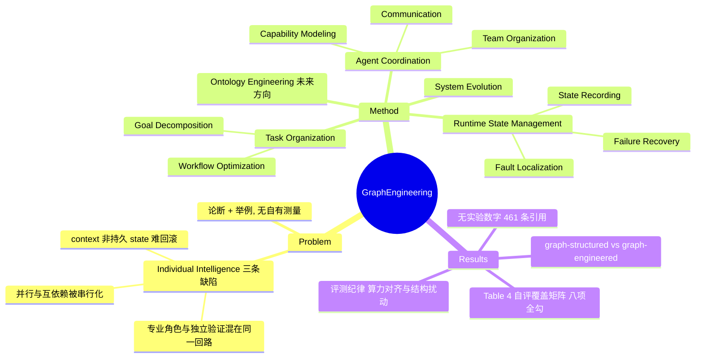

## Summary

这篇 35 作者、461 条引用的 survey 提出 Graph Engineering：把 Prompt → Context → Harness → Loop 的既有工程演进线接到一个新阶段，主张单 agent 的组织能力存在上限，需要用显式图结构组织 Task Organization / Agent Coordination / Runtime State Management 三个系统层视图，才能得到所谓 System Intelligence。全文没有实验，novelty 论证依赖附录 Table 4 的自评覆盖矩阵；真正对 vault 有用的不是这套 taxonomy，而是 §6.1/§7.4 的评测纪律与 §9.7 的 graph-structured 与 graph-engineered 之分。

## Problem & Motivation

论文的动机链是三段式。第一段说 Model Intelligence 被单次推理的边界限制住，于是有了 `Agent = Loop(LLM + Harness)`；Harness Engineering 决定 agent 能碰到哪些资源，Loop Engineering 决定每一轮结果之后往哪走，两者合起来叫 Individual Intelligence。第二段是全文的支点：§3.5 断言 Individual Intelligence 面对复杂任务有三条结构性缺陷——并行与互依赖子任务被压成串行、专业化角色与独立验证被塞进同一个控制回路（写代码的和评代码的是同一个 agent，于是把"自己觉得对"当成"确实对"）、context 不是有组织的持久 state 所以错误一旦进入回路就难以定位与回滚。第三段说这三条缺陷不是"给 agent 更多能力/更长 context"能解决的，必须把智能分布到多个专门 agent 上并在系统层组织，即 System Intelligence。

需要说清楚的是这个支点的证据地位。§3.5 的三条缺陷各配一组引用加一个假设性例子（软件故障诊断、自评代码、长跑 web/coding 任务），论文本身不给任何测量（C6）。也就是说"individual intelligence 有上限"在本文是**论证 + 举例**，不是**实证**；而且论证的形式是"当前单 agent 系统在这些任务上表现不好"，没有排除这是当前模型能力与 harness 成熟度的函数而非架构必然。更尴尬的是论文自己在 §6.1 给出了拆穿这类推理的工具：它说 end-task 成绩的提升可能来自更强的基座、更长的 context、更多采样或更多算力，而非系统组织（C10）。同一把尺子反向量过来，"单 agent 做不好所以是架构问题"同样没有被这些混淆项排除。

## Method

论文把 Graph Engineering 定义成"用图结构显式外化 task、component、runtime state 三者之间关系"的工程范式，展开为三个视图加一条演化轴：

**Task Organization（做什么）**。Goal Decomposition 把目标表示成子目标 + 依赖边的图，从 HuggingGPT/ReWOO 的显式依赖，到 LLMCompiler/Plan-over-Graph 的可调度 DAG，再到 TDAG/Flow 的执行中动态改图。Workflow Optimization 把子目标编译成可执行算子图并让图本身成为优化对象：GPTSwarm、ADAS、AFlow、A2Flow、MermaidFlow、VFlow 是静态搜索一支，DyFlow、EvoFlow、QualityFlow、FlowSteer 是执行期自适应一支。

**Agent Coordination（谁来做）**。分三层：Agent Capability Modeling（DyLAN、MasRouter、AutoAgents、SkillGraph、MaAS——论文指出这些表示大多为单次任务构造，缺跨任务可复用的持久 capability graph）、Agent Team Organization（链式 MetaGPT/ChatDev、路由式 Magentic-One/WorkTeam、fan-out/fan-in 的 Mixture-of-Agents/MacNet、动态式 Puppeteer/AgentNet/SwarmAgentic）、Multi-agent Communication（G-Designer、AMAS 构造拓扑，AgentPrune、AgentDropout 剪连接，DyTopo、CARD、QueenBee 用反馈改拓扑）。

**Runtime State Management（系统怎么跑）**。这是三个视图里最有工程实质的一节，被拆成 State Recording（Magentic-One 的 Task/Progress Ledger、Graph of States、PatchBoard 的 schema+权限校验、MemTX 的 tentative write 与 transactional commit 之分、Collaborative Memory 的 scoped visibility、event sourcing）、Fault Localization（MAGE 的层次 state tree、Who & When、MAST、TraceElephant、TDAD、Cordon；论文明确写"把故障原因当假设，不假定时间或结构关联就是因果"）、Failure Recovery（MAGE/ALAS/CausalFlow 的局部修复，AgentGit/Shepherd/DART 的 replay/rollback/branch，SagaLLM/RAC/Atomix 处理不可回滚的外部副作用）。

**System Evolution** 是横切这三个视图的第四条轴：把执行经验转成持久的结构改动，并要求这些改动可验证、可回滚。

§5 列开放问题（graph-native capability substrate、self-evolving graph system、graph-native agent OS、隐私伦理），§6 把 Ontology Engineering 提为下一步方向，§7–§9 是 benchmark、开源库、应用三张表。

## Key Results

Survey 没有实验数字，可核查的"结果"是三类判断：

**1）自评覆盖矩阵（附录 Table 4）**。论文用 Harness / Loop / Planning / Workflow / MAS / State / Self-Evolution / Ontology 八个维度对比十篇代表性 survey，"Ours"是唯一八项全 ✓ 的行（C1）。其中 harness survey `Agent Harness'26` 在 Harness / Loop / Planning / MAS / State 五项已是 ✓，Workflow 与 Self-Evolution 为 ∘、Ontology 为 –（C2）。论文也承认最近的 `Self-evolving agents as dynamic graph transformation`（arXiv:2608.18104，早本文三天）与自己视角"特别接近"，并把区别定位为"organizing question and system scope"而非机制差异（C3）。

**2）跨应用域的成熟度判断（§9.7）**。Work Organization 与 Agent Team Engineering 在实际应用中已经常见，显式 Runtime State Management 正在变得可见，而 Persistent System Evolution 仍然罕见——多数系统在预定的组织结构内自适应，而不会依据累积证据永久修改该结构。由此论文提出 **graph-structured 与 graph-engineered 之分**：当代系统确实通过显式的 work/team/state 结构执行，但这些结构通常是人工选定并在执行前固定的（C9）。这是本文最接近可证伪判断的一处，但它是对 Table 3 应用清单的定性归纳，不是测量。

**3）评测纪律（§6.1 + §7.4）**。end-task 成功率不足以判定系统是否具备 System Intelligence；未来 benchmark 应提供 matched execution budgets、versioned graph artifacts、完整 trace 与 state snapshot、受控的结构扰动、以及跨任务跨时间的重复评测（C10）。§7.4 另外点名三个缺口：系统级增益必须与更强模型/更长 context/更多工具/重试/算力带来的增益分离；现有资源在 work organization、coordination、runtime state、evolution 四块之间割裂；structural credit assignment 仍然薄弱。

## Evidence Ledger

| Claim ID | Claim | Type | Source locator | Evidence excerpt | Status |
|:--|:--|:--|:--|:--|:--|
| C1 | 附录 Table 4 用 8 个维度对比 10 篇 survey，"Ours" 是唯一 8 项全 ✓ 的行 | sota-novelty | Appendix §11.1, Table 4 | "Topic coverage of representative surveys related to LLM agents and agent systems"；Ours 行八格全 ✓ | source-verified |
| C2 | Table 4 中 `Agent Harness'26` 行为 ✓✓✓∘✓✓∘–，即 Ours 仅在 Workflow / Self-Evolution / Ontology 三项严格高于它 | comparison | Appendix §11.1, Table 4 | "Agent Harness'26 [224]: ✓ ✓ ✓ ∘ ✓ ✓ ∘ –" | source-verified |
| C3 | 论文承认 dynamic-graph 视角的 self-evolving agents survey 与本文视角"特别接近"，区别定位为 organizing question 与 system scope | sota-novelty | Appendix §11.2 | "particularly close to this perspective... distinction is primarily one of organizing question and system scope" | source-verified |
| C4 | Harness/Loop 边界由一个测试失败的例子给出：harness 返回失败日志，loop 决定改实现/查依赖/换能力/回滚/求助/终止 | causal-mechanism | §3.4 | "the harness can return the failure log, but the loop can decide whether to revise the implementation..." | source-verified |
| C5 | §3 未给出任何判定某组件属于 Prompt / Context / Harness / Loop 的量化指标、决策流程或经验测试，四类仅由散文定义与引用举例区分 | causal-mechanism | §3.2–§3.4 | 全为 prose 定义与引用列表；"no metric or decision procedure found" | source-verified |
| C6 | §3.5 的三条限制各配引用 + 一个假设性例子，未报告作者自己的任何实验、测量或 benchmark 数字 | causal-mechanism | §3.5 | 三条 ❶❷❸ 各带 "For example, ..."；"no author experiment reported" | source-verified |
| C7 | §4.1 称"graphs provide a natural structure"，必要性语言挂在 relationship governance 上而非图本身；节内无与非图表示的对比 | causal-mechanism | §4.1 | "graphs provide a natural structure for modeling the system-level relationships"；"no non-graph comparison found" | source-verified |
| C8 | 全文未声明所综述的论文数量；参考文献编号至 [461] | number | Abstract / §1 / References | "No 'we review N papers' sentence found anywhere; last reference entry is [461]" | source-verified |
| C9 | §9.7 称 Work Organization 与 Agent Team 已常见、Persistent System Evolution 仍罕见，并区分 graph-structured 与 graph-engineered | comparison | §9.7 | "Persistent System Evolution, however, remains rare... distinction between being graph-structured and being graph-engineered" | source-verified |
| C10 | 论文自陈 end-task 成绩不足以判定 System Intelligence，要求 matched execution budgets、versioned graph artifacts、完整 trace、受控结构扰动与重复评测 | causal-mechanism | §6.1, §7.4 | "End-task success alone is insufficient..."；"matched execution budgets, versioned graph artifacts, complete traces and state snapshots, controlled structural perturbations" | source-verified |
| C11 | Abstract 声明资源集合在 DEEP-JLU/Awesome-Graph-Engineering；论文未发布自有 Graph Engineering 系统的代码实现 | license-code | Abstract；§8–§9 | "All the related resources... are collected for the community at https://github.com/DEEP-JLU/Awesome-Graph-Engineering" | source-verified |

11 条高风险 claim，全部 source-verified，由独立 verifier 完成；`source-verified` 仅表示原文确实包含该表述，不表示结论已被独立复现或形成领域共识。

## Strengths & Weaknesses

**这套 taxonomy 是修辞的，不是可操作的。** 判据很简单：给我一个组件，这套框架能不能告诉我它归哪一类。答不了。§3 通篇是散文定义加引用清单，没有指标、没有判定流程、没有经验检验（C5）。论文给出的最锋利的一条边界是 Harness/Loop（C4）——测试失败时 harness 返回日志、loop 决定下一步——作为直觉这是对的，作为边界它立刻漏：一个失败自动重试的 harness 同时落在两边；一个把重试策略写进工具描述的实现更是无法归类。Prompt 与 Context 之分（"该做什么" vs "有什么信息"）同样不可判定：一条既是 few-shot 示例又是检索证据的内容属于哪边？这不是吹毛求疵，而是决定这套框架能否用于归因——vault 的 [[Topics/Harness-Component-Attribution]] 要回答"外置 state、fresh context、独立验证哪一个在起作用"，而一套无法把组件唯一归类的分类学对这个问题零贡献。

**"individual intelligence 上限"是论断加举例，不是实证。** C6 已核实 §3.5 没有任何自有测量。更关键的是论证形式的问题：三条缺陷讲的是"当前单 agent 系统在这些任务上做得不好"，跳到"这是单 agent 架构的固有上限"缺一步——需要排除它是当前模型能力与 harness 成熟度的函数。论文自己在 §6.1 提供了这一步的方法（把系统级增益与更强基座/更长 context/更多算力的增益分离），却只把它用在评价别人的多 agent 结果上，没有反向用在自己的动机上。vault 里 [[Papers/2608-LongHorizonHarness]] 恰好是反例证据：它靠单 agent + 外置 task state + fresh-context executor + 只读 auditor，把 WeaveBench 从 51.8% 推到 80.7%——"独立验证"和"持久 state"这两条被本文列为单 agent 做不到的事，在那里是在单 agent 回路内做到的。所谓上限的位置，很可能取决于 harness 怎么写，而不取决于 agent 数量。

**Novelty 论证是覆盖矩阵，而覆盖矩阵在算数上暴露了问题。** Table 4 是论文唯一的 novelty 依据，形式是自评自打分，"Ours"八项全 ✓（C1）。逐列读这张表（以下为我对已核实表格的算术推论，非原文断言）：Harness、Loop、Planning、Workflow、MAS、State、Self-Evolution 七列都已有至少一篇前作拿 ✓——Harness/Loop 归 `QA-to-Task Completion'26` 与 `Agent Harness'26`，Workflow/State/Self-Evolution 归 `Dynamic Graph Transform.'26` 等。**唯一没有任何前作拿 ✓ 的列是 Ontology**，而 Ontology 恰恰是 §6 的内容，标题写着 "Future Direction"。换言之，按论文自己的记分板，它相对已有 survey 的增量 = 若干已有覆盖面的并集 + 一节未来工作。这正是 34 作者委员会式 survey 的典型形态：广度替代了论点。论文对最接近的竞品（arXiv:2608.18104，早三天）的切割也停在"提问角度与系统范围不同"（C3），而非指出对方机制上做不到什么。

**图是被断言为自然，不是被论证为必要。** 这一点论文其实比预期诚实（C7）：§4.1 用的是 "graphs provide a natural structure"，而把 requires 挂在"系统必须治理 task/component/state 之间的关系"上——后者是真命题，且不蕴含图。但它也没有对比任何非图表示（关系表、event log、类型化 schema、hierarchical task network），所以"为什么必须是图"始终没被回答。实践上多数被综述的系统本来就用 DAG/依赖图，"图"更像是对既有工程做法的重命名而非主张。

**真正有价值的两处都不在 taxonomy 里。** 第一是 §9.7 的 graph-structured 与 graph-engineered 之分（C9）：结构是人工选定并在执行前固定的，就只是 graph-structured；只有当结构目标、图级可观测性、受控变异，以及"成功的结构改动能跨任务持久与迁移"的证据齐备，才算 graph-engineered。这条给了一个可用的检验，且能直接施加到 vault 的 harness 论文上——按此标准 [[Papers/2608-LongHorizonHarness]] 与 [[Papers/2606-RecursiveAgentHarness]] 都只是 graph-structured。第二是 §6.1 + §7.4 的评测纪律（C10），与 [[Topics/Harness-Component-Attribution]] 的核心诉求逐条对应（算力对齐、结构消融、把系统级增益与基座/context/重试的增益分离）。这条要求来自图/MAS 社群而非 harness 社群，构成一个独立的收敛信号：归因缺口不是 harness 文献的局部疏忽，而是被跨社群识别的系统问题。

**领域影响判断。** 作为索引它有用：461 条引用覆盖了 harness / loop / workflow / MAS / runtime state / evolution 六块，且与 vault 已消化的多篇 harness 论文对齐（`Code as Agent Harness` = [[Papers/2605-CodeAgentHarness]]、`Harness Handbook` = [[Papers/2607-HarnessHandbook]]、`LongHorizon-harness` = [[Papers/2608-LongHorizonHarness]]），可当作 harness 方向的外部覆盖度体检。作为框架它不改变任何人会 build 什么：taxonomy 不做可证伪预测，不给归因工具，也不说清在什么条件下图结构会失效。按 vault 的标准（分类学只有在做出可证伪预测或改变构建决策时才有价值），这套 taxonomy 不合格；不合格的是 taxonomy，不是这篇论文的全部——§6.1 和 §9.7 值得单独引用。

## Mind Map

## Notes

- **对 vault 的两条可用产出**。（1）§9.7 的 graph-structured / graph-engineered 判据可以作为 [[Topics/AgentHarness-Design]] 的一条新审计轴：harness 的结构改动是否来自证据、是否跨任务持久。（2）§6.1 + §7.4 的评测要求与 [[Topics/Harness-Component-Attribution]] 的"算力对齐 + 结构消融"诉求同构，可作为跨社群收敛的外部引证。

- **可复用的反例。** 本文把"独立验证"与"持久 state"列为单 agent 做不到的事，而 [[Papers/2608-LongHorizonHarness]] 在单 agent 回路内用外置 task state + 只读 auditor 实现了两者。这个冲突值得记进 harness survey：ceiling 的位置取决于 harness 设计而非 agent 数量。注意该反例本身也未做消融，不能反过来当作"单 agent 足够"的证明。

- **待查**。论文列出的 harness 相关引用中，`What makes a harness a harness: necessary and sufficient conditions for an agent harness`（arXiv:2606.10106）直接冲着 vault 关心的边界问题去，vault 尚未消化，值得单独 digest——它可能给出 C5 指出的那个缺失判据。

- **元数据缺口**。arXiv HTML 渲染未包含 affiliation 块，故 `institute` 留空；通讯作者邮箱域为 jlu.edu.cn、资源仓库在 DEEP-JLU 组织下，但 34 位作者显然横跨多家机构，不宜只填一家。

- **repo 性质**。`code` 字段指向的是 awesome-list 式资源汇编，不是可运行系统实现（C11），不适合走 repo-digest。
