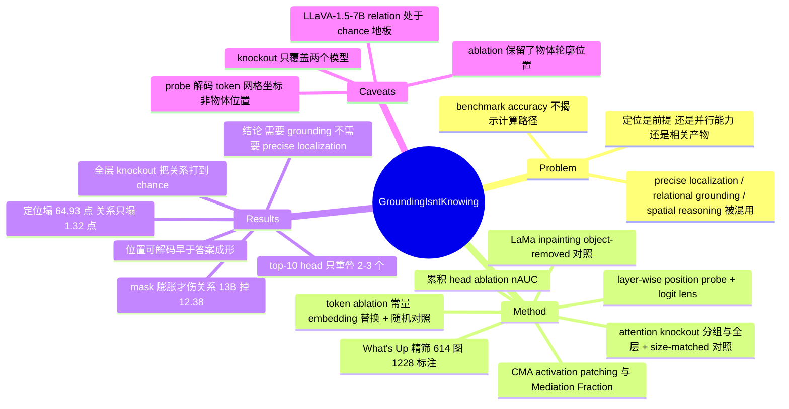

## Summary

这篇论文问的是一个机制问题而非榜单问题：VLM 回答"A 在 B 左边"时，是否必须先精确定位这两个物体。答案是否定的——把 target 物体内部的 visual token 换成常量 embedding 后，target localization accuracy 掉 5.37 / 27.90 / 64.93 点（LLaVA-1.5-7B / 13B / Qwen2.5-VL-7B），而 relation accuracy 最多只掉 1.32 点；但把 mask 向外扩一格、吃进周边 context 时 relation 才开始塌（LLaVA-1.5-13B 掉 12.38 点）。作者的限定结论是：VLM 需要 object grounding，但不需要 precise localization，粗粒度的 object-centered layout 才是承载关系判断的证据。

## Problem & Motivation

Benchmark accuracy 只告诉你模型预测了什么，不告诉你它怎么算出来的。同一个正确的空间关系答案，可以来自物体级视觉证据、粗糙场景布局、上下文规律，或纯语言先验。这个区分之所以重要，是因为整条 explicit grounding 路线（coordinate-based instruction tuning、localized visual tokenization、专用 localization head）隐含假设"先定位、再推关系"是必经的计算链条。已有工作只证明了 localization 可以被学到、被 elicit 出来、被从表示中解码出来，没有证明它是关系推理的必要中间量——因为 grounding 监督和输出接口总是被一起引入，二者混在一起。

作者把三件常被混用的事情拆开：precise localization 要恢复物体边界，relational grounding 要把 target 和 reference 绑定到有空间锚点的表示上，spatial reasoning 要把这些表示转成一个有方向的关系。中心问题因此变成：VLM 必须先精确定位两个物体才能判关系，还是可以直接从更粗的 object-grounded layout 信号得到正确决策。

## Method

**数据**。从 What's Up 精筛：Subset A 去掉 on / under 只留 left-right，Subset B 的 front / behind / left / right 全留，并补标 bounding box 与 segmentation mask，最终 1,228 个 object annotation、614 张图（A 206、B 408）。为排除"模型只凭背景 context 幻觉出物体"，另用 LaMa inpainting 造 object-removed 对照集，只保留"原图认得出、inpaint 后认不出"的图像对。

**两个任务共用同一张图、不同 prompt**：localization 输出 bbox，指标是 IoU 0.5 / 0.7 / 0.9 三档成功率的平均；spatial reasoning 用 What's Up 原生的 four-way 多选协议，保留其 subset-specific distractor。

**四层递进干预**：

1. **Token ablation**。干预点在 multimodal projection 之后、position encoding 之前：把 segmentation mask 命中的 visual token 替换成一个在 ImageNet val 上算一次的全局平均 visual embedding（保留 embedding 统计量、去掉图像内容）。mask 侵蚀/膨胀 1 个 token 用来测边界敏感度与 context 依赖。对照是等数量随机 token 替换，3 seed 平均。
2. **Position decoding**。每个 decoder 层训一个线性分类器，预测每个 image token 的二维 grid 坐标（x、y 独立预测，joint 需两者都对），在 5 万张 ImageNet 图上训 10 epoch，在 What's Up 图上评。答案侧用 training-free 的 logit lens 读最后一个 prompt token 在各层的答案 logit。
3. **Attention knockout**。阻断所有 post-image token 对 object-aligned visual token 的 attention，按连续 4 层一组分组阻断，另做全层阻断作为全局干预，并配 size-matched random-token 对照。
4. **CMA + head ablation**。每个模型取 ≤50 组 source / base 对（source 有物体，base 用 LaMa 抹掉），逐 head 把 source 的 prompt-token activation patch 进 base run；在 teacher forcing 下用 mean token-level NLL 定义 Mediation Fraction，MF 约等于 1 表示该 head 补回了大部分 source-base 差距，MF 小于 0 表示干扰。再按 MF 排序做累积 head ablation（置零），用 normalized AUC 汇总敏感度，对照组是 low-importance head 与 negative-MF head。

## Key Results

**1. 定位塌了，关系没塌（token ablation，Table 1）**

| 模型 | Rel. baseline | Loc-T baseline | Target ablation ΔLoc-T | Target ablation ΔRel. | Target +1 dilation ΔRel. |
|:--|:--|:--|:--|:--|:--|
| LLaVA-1.5-7B | 24.82 | 10.15 | −5.37 | −0.23 | −0.25 |
| LLaVA-1.5-13B | 40.23 | 29.91 | −27.90 | −0.18 | −12.38 |
| Qwen2.5-VL-7B | 96.11 | 84.53 | −64.93 | −1.32 | −6.37 |

Reference-token ablation 同样把 Loc-R 打掉 7.70 / 36.70 / 61.07 点，而未被 ablate 的另一个物体的定位保持稳定；等量随机 token 对照的变化幅度小得多。侵蚀与膨胀的响应是**不对称的**：侵蚀削弱定位效果有限，膨胀却越来越伤关系判断。这是全文最有信息量的一处——它把"关系推理依赖的是什么"从"物体内部"推到了"物体周边的粗布局"。

**2. 位置可解码得早，答案成形得晚（position decoding + logit lens）**

位置 probe 精度快速上升，分别在第 14（LLaVA-7B）、12（LLaVA-13B）、10（Qwen-7B）层附近见顶后缓慢回落。logit lens 的答案动态完全不同：Qwen2.5-VL 前段近 chance，第 19 层后陡升，末层约 97%；LLaVA-1.5-13B 缓慢升到约 40%；LLaVA-1.5-7B 全程近 chance。作者据此说位置表示先于关系决策形成，措辞是 "consistent with a staged process"（正文用的是这个 hedge，abstract 里升级成了断言）。

**3. 定位与关系的层区只部分重叠（attention knockout）**

> 该实验只覆盖 LLaVA-1.5-13B 与 Qwen2.5-VL-7B 两个模型，LLaVA-1.5-7B 未参与（独立核查确认 Figure 4 只有这两个 panel）。

LLaVA-1.5-13B 的定位在第 16–19 层组阻断时下降最大，Qwen2.5-VL-7B 在第 16–23 层最敏感；relation 在多数局部干预下相对稳定，但 Qwen 侧受若干早中层组影响。**全层阻断是本文的 positive control**：LLaVA-1.5-13B 上定位降到接近零、关系降到接近 chance；Qwen 上论文只说"两个任务都退化最强"，且强于匹配的随机对照。这一端很关键——它排除了"关系判断根本不依赖 object token"这种更强也更廉价的解释。

**4. 中介稀疏且高度任务特化（CMA + head ablation）**

高 MF head 集中在 LLaVA-1.5 的早中层与 Qwen2.5-VL 的中后层；LLaVA-1.5-13B 两个任务的最强效应都在 11–16 层，但层内依赖的 head 差异很大。top-10 head 中定位与关系只共享 3 个（LLaVA-1.5-13B）和各 2 个（LLaVA-1.5-7B、Qwen2.5-VL-7B），top-50 的重叠是 3、7、3。累积 head ablation 证实这些 head 是必要而非相关：去掉任务重要 head 比去掉低重要度 head 伤害大得多，且**去掉 localization-important head 也会显著拉低 relation accuracy**——说明两个任务复用了共同的 object-grounded 中间表示，只是下游转换路径分开了。去掉 negative-MF head 只产生渐进的、模型相关的下降，没有一致的性能提升，因此负 MF 反映的是孤立 patching 时的不兼容，而非正常推理中的有害角色。

需注意任务口径在文中不统一：Table 1 用 What's Up 原生 four-way 多选，CMA 与 head ablation 用的是 binary spatial-relation query。

## Evidence Ledger

| Claim ID | Claim | Type | Source locator | Evidence excerpt | Status |
|:--|:--|:--|:--|:--|:--|
| C1 | 精筛数据集含 1,228 个 object annotation、614 张图（Subset A 206、B 408），A 只留 left/right | number | Preliminaries > Base Dataset and Filtering | "the dataset contains 1,228 object annotations across 614 images, including 206 images from Subset A and 408 images from Subset B" | source-verified |
| C2 | Relation baseline: LLaVA-1.5-7B 24.82%、13B 40.23%、Qwen2.5-VL-7B 96.11% | number | Table 1, Baseline row (cols 5/8/12) | "Baseline \| 0 \| 10.15 \| 14.81 \| 24.82 \| 29.91 \| 39.03 \| 40.23 \| 0 \| 84.53 \| 86.64 \| 96.11" | source-verified |
| C3 | Loc-T baseline 10.15 / 29.91 / 84.53，Loc-R baseline 14.81 / 39.03 / 86.64，均为 IoU 0.5/0.7/0.9 平均 | number | Table 1 Baseline; Preliminaries > Localization | "mean success rate at IoU thresholds of 0.5, 0.7, and 0.9" | source-verified |
| C4 | Target ablation 使 Loc-T 降 5.37 / 27.90 / 64.93 点；reference ablation 使 Loc-R 降 7.70 / 36.70 / 61.07 点 | number | Visual Information Ablation > Result | "reduces Loc-T by 5.37, 27.90, and 64.93 points... reduces Loc-R by 7.70, 36.70, and 61.07 points" | source-verified |
| C5 | 原始（未加 padding）mask 下 relation accuracy 最多降 1.32 点 | number | Visual Information Ablation > Result | "relation accuracy drops by at most 1.32 points under the original masks despite large localization losses" | source-verified |
| C6 | Target mask +1 膨胀使 relation 降 12.38（13B，40.23→27.85）与 6.37（Qwen，96.11→89.74），7B 仅降 0.25 | number | Table 1, Target 组 "+1 Padding" 行 | "+1 Padding \| ... \| 24.57 ↓0.25 \| ... \| 27.85 ↓12.38 \| ... \| 89.74 ↓6.37" | source-verified |
| C7 | 存在等数量随机 token 替换对照（3 seed 平均），其变化幅度远小于 object-token ablation | benchmark-setting | Method (ii) Random Tokens; Table 1 Random block | "we replace an equal number of randomly selected visual tokens for each object-aligned intervention. Results are averaged over three seeds." | source-verified |
| C8 | 位置 probe 预测的是**每个 image token 自身的 2D grid 坐标**，在 5 万张 ImageNet 图上训 10 epoch，在 What's Up 上评 | benchmark-setting | Position Decoding > Method | "predict the two-dimensional grid position of every image token... trained for 10 epochs on 50,000 ImageNet images" | source-verified |
| C9 | 位置 probe 精度在第 14（7B）、12（13B）、10（Qwen）层附近见顶后回落 | number | Position Decoding > Results | "peaking around layer 14 for LLaVA-7B, layer 12 for LLaVA-13B, and layer 10 for Qwen-7B before gradually declining" | source-verified |
| C10 | logit lens: Qwen 第 19 层后陡升至末层约 97%；LLaVA-1.5-7B 全程近 chance；13B 渐升至约 40% | number | Position Decoding > Results / Figure 3(c) | "Qwen2.5-VL remains near chance in early layers but rises sharply after layer 19, reaching approximately 97% accuracy at the final layer" | source-verified |
| C11 | knockout 配 size-matched random-token 对照；全层阻断使定位接近零、relation 接近 chance（该句仅就 LLaVA-1.5-13B 陈述；Qwen 侧论文只说"两任务退化最强"） | causal-mechanism | Figure 4 caption; Attention Knockout > Results | "Object-token knockout is compared with a size-matched random-token control." / "reduces localization to nearly zero and lowers relation accuracy toward chance level" | source-verified |
| C12 | 定位下降最大的层组为 LLaVA-1.5-13B 的 16–19 层、Qwen2.5-VL-7B 的 16–23 层 | number | Attention Knockout > Results | "largest localization decline in layers 16–19" / "most sensitive to interventions in layers 16–23" | source-verified |
| C13 | top-10 MF head 中两任务只共享 3（13B）、2（7B）、2（Qwen）个；top-50 重叠为 3、7、3 | number | Causal Mediation Analysis > Results | "share only 3 heads in LLaVA-1.5-13B and 2 heads each... overlaps among the top 50 heads are only 3, 7, and 3" | source-verified |
| C14 | CMA 每模型 ≤50 组 source/base（base 为 LaMa 抹除 target），teacher forcing 下用 mean token-level NLL 计分，relation 侧为 binary query | benchmark-setting | Causal Mediation Analysis > Method | "we curate up to 50 source-base pairs... ground-truth answer token for a binary spatial-relation query" | source-verified |
| C15 | 累积 head ablation 中，移除 localization-important head 也会显著拉低 relation accuracy；移除 negative-MF head 只产生渐进下降而非一致提升 | causal-mechanism | Head Ablation Analysis > Results | "Relation accuracy also drops strongly when localization-important heads are removed... rather than consistent improvements" | source-verified |
| C16 | 全文只评了 LLaVA-1.5-7B/13B 与 Qwen2.5-VL-7B；论文明言 crowded scene、3D relation、temporal reasoning 的推广性仍开放 | benchmark-setting | Table 1 header; Conclusion | "Whether this mechanism generalizes to crowded scenes, 3D relations, and temporal reasoning remains open." | source-verified |
| C17 | 论文结论为：VLM 需要 object grounding 但不需要 precise localization，只要粗粒度 object-centered layout 在，关系判断能挺过严重定位失败 | causal-mechanism | Conclusion | "VLMs require object grounding, but not precise localization. Spatial relations can survive severe localization failures" | source-verified |
| C18 | Table 1 的 relation 任务用 What's Up 原生 four-way 多选（保留 subset-specific distractor），CMA / head ablation 用 binary relation query | benchmark-setting | Preliminaries > Spatial Reasoning; CMA > Method | "We use the original four-way multiple-choice protocol from What's Up, preserving its subset-specific distractors." | source-verified |
| C19 | 被 ablate 的 token 被替换为 ImageNet val 上算一次的全局平均 visual embedding，干预点在 multimodal projection 之后、position encoding 之前 | benchmark-setting | Visual Information Ablation > Method | "after the multimodal projection but before positional encodings... a global average visual embedding computed once over the ImageNet validation set" | source-verified |
| C20 | object-removed 对照集只保留"原图识别正确、inpaint 后识别失败"的图像对 | benchmark-setting | Preliminaries > Object-Removed Control Set | "We retain only those image pairs for which a model correctly identifies the object in the original image but fails to do so in the inpainted counterpart." | source-verified |
| C21 | attention knockout 实验只覆盖 LLaVA-1.5-13B 与 Qwen2.5-VL-7B，LLaVA-1.5-7B 未参与 | benchmark-setting | Figure 4 panel labels | "Llava-1.5 13B" / "Qwen2.5-VL 7B"（Figure 4 内仅此两个 panel） | source-verified |
| C22 | Method 声明 mask 会 shrink/dilate 1 或 2 个 token，但 ±2 结果与详细 prompt 都在 Supplement，arXiv v1 无附录 | benchmark-setting | Visual Information Ablation > Method；"See detailed prompts in Supplement" | "we shrink or dilate the mask by 1 or 2 token padding" | not-checkable |

> C22 的 ±2 padding 结果与 prompt 细节在可获取版本中无法核查，本笔记不引用任何 ±2 数字。C18 中"four-way 的 chance 约为 25%"是我依据协议推出的，论文全文未写出任何 chance 数值。

## Strengths & Weaknesses

**亮点**

问题 formulation 是对的。把 precise localization、relational grounding、spatial reasoning 三件常被当作可互换的事拆开，并且给出的是**限定回答**（需要 grounding，不需要 precise localization），而不是"定位无用"这种更响亮也更容易被证伪的强版本。这是本文比同类"VLM 其实没在看图"叙事更值得读的地方。

因果工具的对照做到了两端夹逼。一端是 matched control：token ablation 有等量随机替换 × 3 seed，knockout 有 size-matched random-token 对照，所以"任何干预都会掉点"这个平凡解释被排除了。另一端是 positive control：全层 knockout 把 relation 打到 chance，所以"关系判断压根不依赖 object token、纯语言先验"这个更强的解释也被排除了。有了这两端，中间那个"精确定位不必要但粗 grounding 必要"的结论才有落脚点。

侵蚀/膨胀的不对称响应是最有信息量的单个结果，因为它是方向性可证伪的预测而不是事后叙事：如果关系判断靠的是精确边界，侵蚀应该伤关系；实际是膨胀伤关系。

**弱点**

**1. 三个模型里只有一个真的在做这个任务。** LLaVA-1.5-7B 的 relation baseline 是 24.82%，而 four-way 多选的 chance 是 25%（这个数是我推的，论文没写）。它在 Table 1 里所有 Rel. 变化都 ≤0.40 点，这是**地板效应**，不是"关系判断稳健"的证据。LLaVA-1.5-13B 的 40.23% 也只是略高于 chance。真正承载结论的是 Qwen2.5-VL-7B 一个模型，而它 96.11% 逼近天花板，−1.32 点同样落在难与噪声区分的区间。论文没有为任何一个 delta 报显著性。所谓"两个 representative model families"，在支撑力上更接近 n=1。

**2. 这套 ablation 保留了物体的轮廓与位置。** 被替换的 token 是按 segmentation mask 选出的**连通区域**，替换值是一个常量 embedding。也就是说物体的外观身份被抹掉了，但"此处有一块统计异常的区域"及其精确位置被完整保留下来——而这恰恰就是论文所说的 coarse anchor。等量随机 token 对照打散在全图，形状与位置都不匹配，无法排除这个混淆。因此一个同样融贯的解释是：干预破坏了 bbox 回归所需的外观线索，但没有破坏关系判断所需的位置线索，结论就不是"关系推理不需要精确定位"，而是"这个干预没触及关系推理依赖的东西"。要排除它需要形状匹配的对照——例如把 mask 区域整体平移到别处，或用同面积异形连通区域替换。论文没有做。这是我对本文最主要的保留。

**3. position probe 解码的不是被问物体的位置。** Finding 3 写成 "Object positions become decodable in intermediate layers"，但 Method 明确说 probe 预测的是 "the two-dimensional grid position of **every image token**"，且 probe 在 ImageNet 上训练。这基本是在测"position encoding 的信息在第几层还剩多少"，与"模型知道 target 在哪"是两件事，措辞比证据强一档。这与 [[Papers/2606-DecodableNotGrounded]] 指出的是同一个陷阱：decodable ≠ used。公平地说作者自己意识到了（正文写 "probes reveal when spatial information is accessible, but not whether later computations actually use it"），并用 knockout 补上使用侧证据；但 abstract 里 "staged grounding-to-reasoning process" 的阶段边界，主要还是从 probe 见顶层（10/12/14）与 logit-lens 起跳层（Qwen 19）的落差读出来的——而 logit lens 在 LLaVA-1.5-7B 上全程近 chance，那个模型上根本定不出 answer-emergence 层，阶段说法在那里无从检验。stage 是从曲线读出来的，不是被独立测量或干预出来的。

**4. abstract 与正文口径不一致。** abstract 写 "a small set of attention heads mediates the causal effects of **both** localization and spatial reasoning"，读起来像共享回路；正文数字是 top-10 只重叠 2–3 个 head，结论是 "largely distinct attention heads"。引用时以正文为准。

**5. 覆盖有缺口。** attention knockout 只做了两个模型（7B 缺席）；Method 说 mask 会 ±1 或 ±2，Table 1 只有 ±1；prompt 与 inpainting 细节都在没随 v1 放出的 Supplement 里；无代码链接。

**6. 评测面窄。** 单一 benchmark（What's Up 的桌面家居物体、2D 左右前后）、614 张图、双物体、无遮挡、无 crowded scene、无 3D、无 temporal。这些论文自己在 Conclusion 里承认为 open。因此从这里读出的不应是关于"VLMs"的普遍结论，而是"在简单双物体场景下、对 1D learnable absolute 与 2D-RoPE 这两种 position encoding 方案而言"的机制。

**对领域的意义**。如果结论在更复杂场景成立，它对 grounding-supervision 路线是一个负面信号：用坐标监督去撬动 spatial reasoning，可能是在优化一个不必要的中间表示，收益要么来自别的通路，要么根本不该期待。它也顺带解释了为什么会观察到"grounding benchmark 分数高"与"关系判断塌"稳定共存——两者在 head 层面本来就走不同路径。但基于上面第 1、2 条，我不认为现有证据强到足以据此调整 grounding 训练的资源分配；它的价值在于**给出了一个可复用的实验设计**，而不是一个可直接采信的结论。

## Mind Map

## Notes

**与 vault 的连接**

- [[Papers/2606-DecodableNotGrounded]] — 同一个方法论断层（probe decodability vs behavioral dependence），但从相反方向切入：DecodableNotGrounded 用灰图 arbiter 在**行为侧**判定证据依赖，本文用 token / head 级干预在**机制侧**判定。两者合起来可以拼成一份"证据依赖性"检查清单：先用灰图分出 grounded / prior / inverted，再用 masked-token ablation 分出依赖外观还是依赖位置。值得注意但不构成直接冲突的一点：DecodableNotGrounded 报告 vertical 轴是 prior（不依赖视觉），本文报告全层 object-token knockout 会把 relation 打到 chance（即确实依赖视觉证据）——但两者的 benchmark、关系类型和干预粒度都不同。
- [[Papers/2604-CoTDegradesSpatial]] — No-Image++（全灰图 + "Cannot determine" 选项）是同族的 positive control 设计思路，本文的全层 knockout 起同样作用。
- [[Ideas/EvidenceDependence-GUIGrounding]] — 本文给这个 idea 提供了机制侧先例和一个可直接迁移的实验设计：GUI 版本可以做"把目标控件区域的 visual token 替换成 UI 背景统计均值 embedding，分别看点击坐标精度和关系型指令（如'搜索框右边那个按钮'）掉多少"。Action Collapse Rate 正好对应本文的 ΔRel.。**但必须吸取本文第 2 条弱点的教训**：对照不能只做 count-matched，必须做 shape-matched / position-shifted，否则测出来的"关系判断稳健"可能只是"干预没破坏位置线索"。这一点反而是该 idea 相对本文的差异化空间。
- [[Ideas/ScaleInvariant-Grounding-GUI]] — 若本文"关系判断不依赖 exact boundary"能迁移到 GUI，那么多尺度架构的收益应当是**不对称**的：主要落在坐标精度上，而非关系理解上。这是该 idea 可以预注册的一条可证伪预测，也是一个便宜的 sanity check——如果 scale-invariant 模型在关系型指令上也大幅提升，说明收益来源与假设的机制不符。

**待查**

- Supplement 中的 prompt 模板与 ±2 padding 结果（v1 未放出）。
- 作者是否会放代码；v1 全文与 abs 页均无链接。
- 一个值得自己动手的对照：把 target mask 区域整体平移到图像中另一位置再做常量替换，看 relation accuracy 是否才真正下降。这一步能直接判定弱点 2 是否成立，成本很低。
