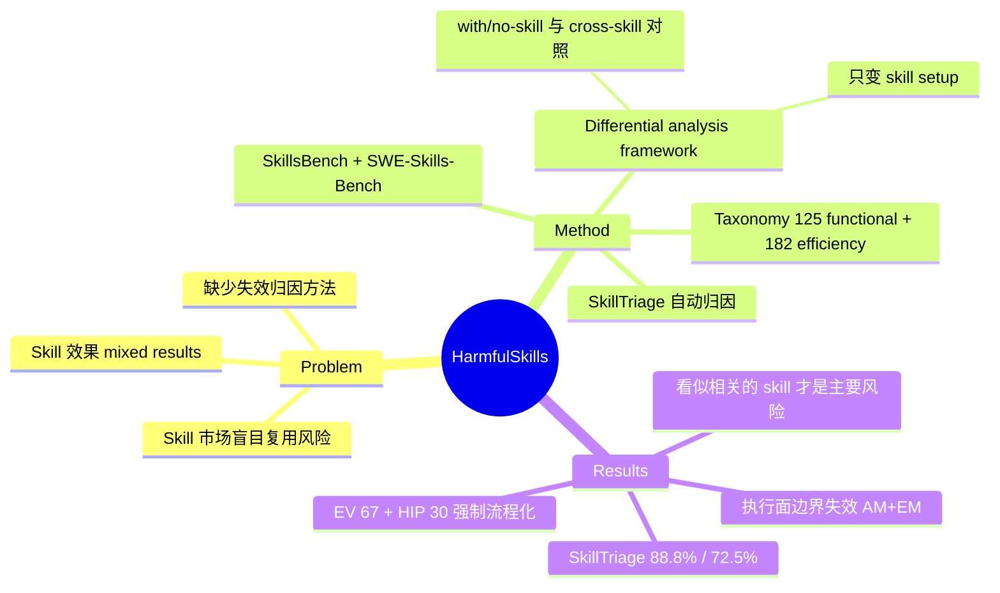

## Summary

对 LLM agent 的 skill-induced failures 做系统 empirical study：提出 differential analysis framework，在固定 task、verifier、agent framework、model、repository/container state 与 input data 的条件下，把 skill-guided target run 与 no-skill 或 semantically matched skill 的 reference run 配对比较，将失效与成本回归归因到具体 skill。在 SkillsBench 与 SWE-Skills-Bench 上确认 307 例 skill-induced failures（125 functional + 182 efficiency），并构建 taxonomy 与自动归因工具 SkillTriage。核心发现：functional failures 很少来自明显不相关的 skill，多是"看似相关"的 skill 导致错误实现或遗漏任务必需元素；efficiency regression 不能单用 prompt 长度解释，最大来源是 skill 把 verification checklist 与 implementation pipeline 变成强制作业。

## Problem & Motivation

Agent skills（可复用的指导文档/程序包）已成为扩展 LLM agent 能力的事实机制，能影响 planning、tool use、problem-solving 与 validation 全流程。但先前工作对 skill 的效果报告不一：有的提升任务成功率，有的毫无作用，甚至增加 token 消耗与执行时间、降低成功率。问题在于缺少系统性的归因方法——一次任务失败或成本膨胀究竟是否由某个已加载 skill 引起、由 skill 的哪类内容引起，此前只有零散轶事而无可复核的证据。随着公开 skill 市场（smithery.ai、skillsmp.com 等）扩张，盲目复用 skill 的功能与成本风险都在放大，这使"skill 何时有害、如何有害"成为值得系统回答的问题。

## Method

**Differential analysis framework**。借鉴 differential testing 的对照设计：target run（加载被审计 skill）与 reference run（no-skill 或语义匹配的替代 skill）配对执行，配对内保持 task、verifier、agent framework、model、repository/container state、input data 全部固定，只改变 skill setup。两类对照：with/no-skill 与 cross-skill。判定口径：

- **Functional failure**：target run 未通过 verifier 而 reference run 通过。
- **Efficiency regression**：双 PASS 配对满足 min(r_tok, r_time) > 1.0 且 max(r_tok, r_time) > T（主阈值 T=2.0），即 token 与时间比率同时变差、且至少一项超过 2 倍。

**数据管线**。在 SkillsBench（84 tasks、11 domains）与 SWE-Skills-Bench（490 个 repository-based SWE instances）上实例化，agent framework 为 OpenCode 1.15.1，model 为 Claude Opus 4.6。用 all-MiniLM-L6-v2 embedding（cosine ≥ 0.7）从 smithery.ai 与 skillsmp.com 检索语义匹配的公开 skill，把 potential paired comparisons 从 826 扩展到 20,664（约 25 倍；此为 evaluation 前的比较空间口径）。执行评估后得 665 个 labeled candidates（315 functional + 350 efficiency），经 refinement 精筛为 307 例 confirmed skill-induced failures。root-cause 标签由人工逐例检查后经 group consensus 定稿。

**失效 taxonomy**（307 例）：

| 类别 | 子类与计数 |
|:--|:--|
| Functional（125） | Task-Implementation Fault 86（内含 Incorrect Required-Element Fill 46、Required-Element Omission 36、Obstructive Workflow Guidance 4）；Artifact Misplacement 24；Environment Mismatch 13；Applicability Mismatch 2 |
| Efficiency（182） | Excessive Procedure 114（内含 Excessive Verification 67、Heavy Implementation Pipeline 30、Excessive Exploration 17）；Context Overhead 46；Dependency Resolution 22 |

**SkillTriage**。taxonomy-guided 自动归因工具，三阶段：配对 case 归一化 → 差分证据抽取（functional failures 计算 DS1–DS5 信号，分别检验环境/运行时状态变化、变化是否 skill 指定、写入路径、产物是否产出、错误实现 vs 遗漏；efficiency regressions 用 phase/action-tag 成本证据）→ root-cause attribution（选择最能解释 target 结局与轨迹分歧的根因）。归因用 GPT-5.5 以 2-of-3 majority vote 执行。

## Key Results

- **Finding 1（functional failures 的反直觉来源）**：125 例 functional failures 中仅 2 例（1.6%）是 Applicability Mismatch（明显不相关的 skill）；Task-Implementation Fault 占 86 例（68.8%），其中 IRF+RRO 合计 82 例——真正危险的不是"用错了 skill"，而是"看似相关"的 skill 让 agent 错误实现或遗漏任务必需元素。
- **Finding 2（执行面边界）**：相当比例 functional failures 发生在 execution-surface boundaries，即 skill 改变了 verifier 观察的环境状态或产物位置：Artifact Misplacement 24 例（19.2%）、Environment Mismatch 13 例（10.4%）。
- **Finding 3（efficiency 非 prompt 长度可解释）**：context-overhead 的 46 例中 43 例由 mandatory skill-body text 造成；但更大头是 Excessive Procedure 114/182（62.6%），其中 excessive verification 67 例、heavy implementation pipelines 30 例——skill 把验证清单和构建配方变成了强制工作。
- **SkillTriage 评测**：functional failures 上 exact subcategory accuracy 111/125（88.8%）、category accuracy 117/125（93.6%）；efficiency regressions 上 exact 132/182（72.5%）、category 145/182（79.7%）。
- **Discussion 提出三个方向**：skill-task compatibility checks（提取任务需求、对冲突默认值预警）、cost-aware skill packaging and selection（加载前估计边际 context 成本）、budget-aware execution policies（按任务不确定性与剩余预算调节 verification 范围与 pipeline 深度）。

## Evidence Ledger

| Claim ID | Claim | Type | Source locator | Evidence excerpt | Status |
|:--|:--|:--|:--|:--|:--|
| C1 | 共确认 307 例 skill-induced failures：125 functional + 182 efficiency | number | Sec III-D / Table II / Abstract | "the final analysis dataset contains 307 confirmed skill-induced failures: 125 functional failures and 182 high-confidence efficiency regressions" | source-verified |
| C2 | 配对固定 task/verifier/framework/model/repo state/input data，只变 skill setup | causal-mechanism | Sec III-A, Fig. 2 | "paired executions keep the task, verifier, agent framework, model, repository or container state, and input data fixed, and vary only the skill setup" | source-verified |
| C3 | SkillsBench（84 tasks、11 domains）+ SWE-Skills-Bench（490 instances），OpenCode 1.15.1 + Claude Opus 4.6 | benchmark-setting | Sec III-B, III-C | "84 evaluated tasks across 11 domains … 490 repository-based software-engineering task instances … OpenCode 1.15.1 and Claude Opus 4.6" | source-verified |
| C4 | Applicability Mismatch 仅 2/125（1.6%），Task-Implementation Fault 86/125（68.8%） | number | Sec IV Finding 1 / Table III | "Only 2 of 125 functional failures are classified as Applicability Mismatch (1.6%) … Task-Implementation Fault accounts for 86 of 125 (68.8%)" | source-verified |
| C5 | 46 例 context-overhead 中 43 例由 mandatory skill-body text 造成 | number | Sec V-A Finding 3 / Table IV | "Skill-Body Context Bloat (SBCB) accounts for 43 of the 46 context-overhead cases" | source-verified |
| C6 | Excessive Procedure 114/182（62.6%），EV 67 例、HIP 30 例 | number | Sec V-B Finding 4 / Table IV | "Excessive Procedure accounts for 114 of 182 efficiency regressions (62.6%) … Excessive Verification contributes 67 cases and Heavy Implementation Pipeline 30" | source-verified |
| C7 | SkillTriage（GPT-5.5、2-of-3 vote）exact subcategory：functional 111/125（88.8%）、efficiency 132/182（72.5%） | number | Sec VI-B, VI-C / Tables V–VI | "GPT-5.5 … 2-of-3 majority vote … exact subcategory for 111/125 cases (88.8%) … 132/182 cases (72.5%)" | source-verified |
| C8 | Efficiency regression：PASS/PASS 且 min(r_tok,r_time)>1.0 且 max>T=2.0；functional failure：target fail 而 reference pass | benchmark-setting | Sec III-A, III-D | "min(r_tok,r_time)>1.0 ∧ max(r_tok,r_time)>T … T=2.0 as the primary threshold" | source-verified |
| C9 | 经公开 skill 市场语义检索（all-MiniLM-L6-v2，cos≥0.7），potential paired comparisons 从 826 扩到 20,664（约 25 倍） | number | Sec III-C / Table I | "from 826 to 20,664 potential paired comparisons, a roughly 25× expansion" | source-verified |
| C10 | Artifact Misplacement 24 例（19.2%）、Environment Mismatch 13 例（10.4%），发生在 execution-surface boundaries | number | Sec IV-D Finding 2 / Table III | "Environment Mismatch accounts for 13 cases (10.4%), while Artifact Misplacement accounts for 24 cases (19.2%)" | source-verified |

## Strengths & Weaknesses

**亮点**（已知，基于原文）：
- 对照设计干净：配对内只变 skill setup，其余全部固定，使"skill 引起"的归因有可复核口径，而非事后归纳轶事。这把"skill 有时有害"从 mixed results 变成了可计数、可分类的证据。
- 核心发现有反直觉价值：失效主要来自"看似相关"的 skill（APM 仅 1.6%），意味着靠相关性检索/匹配来筛 skill 基本挡不住风险；efficiency 损耗主要不是 context 长度而是行为改变（EV 67 + HIP 30），指向"skill 会把建议性 checklist 升格为强制流程"这一机制。
- efficiency regression 与 functional failure 并列为一等公民，且给出可操作的量化口径（T=2.0 双比率判据），这在 agent 失效分析里少见。

**局限**：
- （已知，作者自认）单一 agent framework（OpenCode 1.15.1）+ 单一 model（Claude Opus 4.6），结论对 task distribution、harness、model、skill ecosystem 的外推性存疑。
- （已知）root-cause 标注靠人工 group consensus，未见 inter-rater agreement 统计；SkillTriage 被同时用作"独立一致性检查"，但其 taxonomy 即出自同一批人工标签，独立性有限。
- （推测）cross-skill 对照中 reference skill 来自公开市场的语义检索，匹配质量本身可能引入 confound——reference skill 更差不代表 target skill 无害。
- （已知）T=2.0 阈值是作者选定的主阈值，效率回归计数对阈值敏感；182 例的口径依赖该选择。
- （已知，截至抓取时）未见 code/dataset release URL，307 例数据集暂无法复用。

## Mind Map

## Notes

- 与本 vault 自身的 skills/ 体系直接相关：EV（excessive verification）与 HIP 的发现提示 SKILL.md 里的 Guard/Verify 清单可能被 agent 当成无条件强制流程执行，在简单任务上造成成本回归——"budget-aware execution policies" 方向值得对照自查。
- 与 [[2608-SkillJack]]（skill 作为攻击面）互补：本文是无恶意前提下的失效归因，SkillJack 是恶意注入；两者合起来覆盖 skill 复用的 safety 与 reliability 两面。
- 与 [[2606-SkillMemoryBudget]]（skill/memory 的 context 成本）和 [[2608-ContinualSkillBench]]（skill 演化评测）构成 skill 生态可靠性的三个观察点；本文的独特贡献是配对归因口径。
- 悬而未决：307 例全部出自 Claude Opus 4.6 + OpenCode，"seemingly relevant skills 最危险"这一结论是否随模型能力变化（更强模型是否更能抵抗 skill 的错误默认值）是显然的后续问题。
