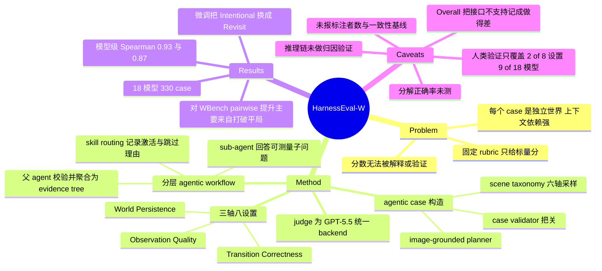

## Summary

HarnessEval-W 把 world model 评测从固定 rubric 改写成 agentic harness：按 case 路由到 skill library 中的评测技能，把每个技能拆成可测量的子问题交给 sub-agent，父 agent 校验证据后聚合成可回溯的 evidence tree，在 330 个 case 上给 18 个 world model 打出 8 维分数。评测器自身的可信度用 9 个模型、5000 条人类 A/B 偏好做锚：Intentional / Physical Transition 上模型级 Spearman ρ=0.93 / 0.87，相对 WBench 对应协议的 pairwise accuracy 从 60.2% / 31.9% 提到 77.8% / 71.7%。但这套可信度证据只覆盖 8 个设置中的 2 个、18 个模型中的 9 个，未报标注者人数与标注者间一致性，因此没有人类上限可以参照。

## Problem & Motivation

论文的起点是一个关于评测本身的判断：benchmark 交付的不该只是一个标量，让评测可信的是支撑这个分数的推理。world model 尤其如此——判断一段 rollout 是否合格，要求判断物理、因果与世界状态是否正确演化，而现有 benchmark 的指标是 brute-force 算出来的，既解释不了也验证不了分数，更说不清模型在哪里、为什么失败。

作者由此引入 LLM 生态的 evaluation harness 概念：人类评测本身就是一套工作流——定位物体、跨时间追踪 object permanence、核验因果与几何约束——既然是工作流，就可以被 harness 化。核心动机不是换一个更强的 judge 模型，而是把 agency 放在**评测轨迹的控制权**上：由评测器自己决定测什么、从哪里取证据、用什么工具落地。这一点作者在 Related Works 里说得很清楚——model-based judge 只是"用模型替换指标"，仍在固定 prompt 下评判给定输出；agentic evaluation 才是选择、执行并随证据积累修正探针。

驱动这个设计的具体理由是 world model 评测的 context dependence：每个 case 实例化一个独立的世界，动作、时间结构、可观测状态都不同，统一 rubric 要么问了无关问题，要么漏掉 case-critical 的上下文。

## Method

**形式化与三条评测轴。** 论文把 interactive world model 写成给定历史观测与动作序列后未来观测的分布，通过对隐状态边缘化分解为观测似然 S(oᵢ|sᵢ)、状态转移 T(sᵢ|sᵢ₋₁,aᵢ₋₁) 与初始状态分布三项。这个分解直接对应三条评测轴与八个细分设置：

| 轴 | 设置 | 核心世界状态问题 |
|:--|:--|:--|
| Observation Quality | Render Quality / Physical Observation | rollout 是否连贯稳定、可读到足以充当证据；每帧是否结构与物理上可信 |
| Transition Correctness | Exploratory / Intentional / Physical Transition | 视角变化是否发生且世界仍兼容；指定目标是否改变而受保护状态不变；物理干预是否产生对应动力学响应 |
| World Persistence | Drift Resistance / Revisit Consistency / Offscreen Evolution | 不变物体能否熬过长 rollout；离开再返回后地点或实体是否仍兼容；未被观测的内生过程是否继续而非冻结或重置 |

Persistence 的定义值得单独记一笔：论文明确说这不要求世界静止，而是稳定属性保持不变、动态属性随动作与时间继续一致演化。

**分层 agentic 工作流。** 评测分三步。第一步 case-specific skill routing：读入初始图像、动作 prompt 与评测设置，从可扩展的 skill library 里选出能够合法评测这个 case 的技能，并为每个被激活与被跳过的技能都记录一条基于证据的理由（Figure 2 的例子是"所有请求的动作都在视野内，故跳过 Offscreen Evolution Verifier"）。作者强调 routing 只依赖 case 上下文与评测意图、与被评模型无关，因此同一 case 对所有模型施加同一套 routing。第二步 sub-agent reasoning：每个技能把自己的评测问题拆成一组可测量子问题，各交一个 sub-agent 回答，返回离散分数加诊断信息。论文以 Intentional Change Verifier 为例——先由一个 sub-agent 从 case 上下文推理出期望结果作为规范，再并行派出 sub-agent 检查 target visibility、visible transition occurrence、target correctness，另有分支查 final state、anchor preservation、extra events 与 overall judgeability，共八个子问题。第三步父 agent 校验并聚合证据，输出 evidence tree 而非单一标量。整条流水线可以递归，sub-agent 可以再派自己的调查。

**case 构造也是 agentic 的。** 先从六轴 scene taxonomy（Environment / Foreground / Midground / Scene Density / Appearance / Perspective）采样一个初始世界设定，再指派一个 probe family（对应 Transition Correctness 与 World Persistence 的六个设置；Observation Quality 每个 case 都评，不单列 family）。随后三个 agent 接力：Image Generator 把元数据转成结构化 prompt 生成初始图像；Image-grounded Planner 在可见世界里落地具体动作，产出文本指令、相机轨迹、控制序列、rollout plan 与物理参数条件，且不得改动已指派的 probe family、不得引入图中不存在的实体；Case Validator 审计 image–action 对，核验目标可见可辨、动作在所描绘世界中可行、期望结果足够具体、rollout 将包含该 probe 所需的证据，不合格的候选退回重采样而非静默保留。最终得到 330 个冻结的 case。

**评测配置。** 所有 sub-agent 使用同一 backend、同一温度、同一抽帧配置的 VLM；论文在与 WBench 对比时点名 backend 为 GPT-5.5。18 个被评模型按 conditioning interface 分三组：Prompt I2V 十个、Native action 三个、Camera pose 五个。同一 case 的交互被翻译成各模型的原生输入形式（文本指令、相机轨迹或控制序列）。八项指标原始范围 0–1，归一化到 1–100；Obs-R 与 Obs-P 在全部 330 个 case 上平均，其余六项只在对应 probe family 的子集上平均；Overall 是 330 个 case 级分数的算术平均。

## Key Results

**主榜（Table 2，列内 # 为全 18 模型排名）。**

| Model | Interface | Obs-R | Obs-P | Trans-E | Trans-I | Trans-P | Pers-D | Pers-R | Pers-O | Overall |
|:--|:--|--:|--:|--:|--:|--:|--:|--:|--:|--:|
| Seedance 2.0* | Prompt I2V | 83.6 #2 | 61.8 #7 | 80.2 #7 | 81.8 #3 | 63.5 #4 | 79.8 #1 | 76.8 #5 | 68.9 #2 | **75.5 #1** |
| Wan 2.7* | Prompt I2V | 80.9 #8 | 58.8 #16 | 78.7 #9 | 83.6 #1 | 71.1 #1 | 74.3 #16 | 68.5 #15 | 65.9 #8 | 75.0 #2 |
| Kling 3.0* | Prompt I2V | 82.1 #4 | 60.6 #12 | 79.1 #8 | 82.6 #2 | 63.2 #5 | 77.2 #9 | 75.4 #7 | 66.2 #6 | 74.4 #3 |
| MiniMax H3 | Prompt I2V | 81.5 #6 | 61.3 #9 | 77.7 #11 | 81.7 #4 | 66.9 #2 | 77.0 #11 | 72.3 #9 | 67.2 #4 | 74.3 #4 |
| Grok Imagine 1.5* | Prompt I2V | 85.1 #1 | 60.6 #12 | 76.4 #14 | 80.2 #5 | 66.7 #3 | 79.1 #4 | 70.9 #11 | 64.5 #10 | 73.4 #5 |
| FLUX 3* | Prompt I2V | 81.7 #5 | 61.6 #8 | 76.4 #14 | 79.0 #6 | 63.2 #5 | 77.1 #10 | 70.2 #13 | 67.4 #3 | 72.2 #6 |
| Cosmos3-Super | Prompt I2V | 83.5 #3 | 61.0 #10 | 77.9 #10 | 75.1 #7 | 60.2 #7 | 77.6 #6 | 70.6 #12 | 66.8 #5 | 71.9 #7 |
| HunyuanVideo 1.5 | Prompt I2V | 80.0 #11 | 59.0 #15 | 77.6 #12 | 73.2 #8 | 57.2 #8 | 76.5 #12 | 69.5 #14 | 63.2 #12 | 70.3 #8 |
| Wan 2.2 | Prompt I2V | 80.4 #10 | 58.6 #17 | 77.2 #13 | 62.0 #9 | 55.1 #9 | 76.0 #14 | 66.5 #17 | 63.4 #11 | 67.7 #11 |
| LTX-2.3 | Prompt I2V | 78.4 #16 | 54.5 #18 | 73.8 #16 | 60.4 #10 | 53.3 #10 | 72.4 #17 | 63.3 #18 | 57.7 #15 | 64.6 #16 |
| SANA-WM | Native action | 81.0 #7 | 62.3 #6 | 82.5 #2 | 50.6 #13 | 47.6 #13 | 78.9 #5 | 78.8 #3 | **72.3 #1** | 68.7 #10 |
| ABot-World | Native action | 77.7 #17 | 60.8 #11 | **83.5 #1** | 49.0 #16 | 45.7 #15 | 76.3 #13 | 72.0 #10 | 60.8 #14 | 66.1 #14 |
| DreamX-World | Native action | 78.5 #15 | 60.6 #12 | 81.8 #4 | 50.0 #14 | 47.4 #14 | 77.5 #8 | 73.1 #8 | 65.4 #9 | 66.8 #13 |
| LingBot World v2 | Camera pose | 80.5 #9 | 63.3 #3 | 81.5 #5 | 56.8 #11 | 49.8 #11 | 79.5 #2 | 75.8 #6 | 66.1 #7 | 68.8 #9 |
| Lyra 2 | Camera pose | 79.5 #12 | 64.0 #2 | 80.7 #6 | 48.9 #17 | 45.1 #18 | 77.6 #6 | 79.7 #2 | 56.4 #16 | 65.5 #15 |
| Fantasy-World | Camera pose | 74.1 #18 | 62.7 #5 | 73.2 #17 | 52.4 #12 | 48.9 #12 | 69.9 #18 | 68.4 #16 | 53.8 #18 | 62.1 #17 |
| HY-WorldPlay 1.5 | Camera pose | 79.4 #13 | **64.6 #1** | 82.0 #3 | 49.9 #15 | 45.5 #17 | 79.3 #3 | **81.9 #1** | 61.1 #13 | 67.1 #12 |
| InSpatio-World | Camera pose | 79.0 #14 | 63.0 #4 | 70.7 #18 | 48.6 #18 | 45.6 #16 | 74.5 #15 | 77.0 #4 | 54.0 #17 | 61.4 #18 |

Overall 前八名全部是 prompt 驱动的通用视频生成器，作者归因于大规模文本条件训练带来的 grounding 与预测能力，而这恰是 Intentional / Physical Transition 所要求的。

**评测器自身的三项检验（Sec 5.3）。** 人类参照来自 9 个代表性模型上的 5000 条 A/B 判断，用 Bradley–Terry 聚合成每模型强度分。模型级 Spearman 为 Intentional ρ=0.93（τ=0.82）、Physical ρ=0.87（τ=0.74）。与 WBench 最接近的两个协议（Intentional 对 Event Edit、Physical 对 Causal Fidelity）在同一批视频、同一 GPT-5.5 backend、同一温度与抽帧下重跑，只有协议不同：

| 设置 | 指标 | WBench | HarnessEval-W |
|:--|:--|--:|--:|
| Physical | pairwise accuracy | 31.9% | 71.7% |
| Physical | draw rate | 52.2% | 1.8% |
| Intentional | pairwise accuracy | 60.2% | 77.8% |
| Intentional | draw rate | 36.1% | 11.1% |

Brier score 两个设置都是 HarnessEval-W 更低，但正文未给数值。稳定性方面，同一 GPT-5.5 backend 在温度 0 下跑三轮，拟合的 score-to-human 曲线斜率落在 9.6–10.8、与人类强度的相关落在 0.928–0.964、三次拟合的包络只有 0.33 个 Bradley–Terry 单位；WBench 斜率从 11.2 跳到 21.0、相关在 0.646–0.780、包络 1.61 个单位，是前者的 4.9 倍宽。

**轴间相关（Sec 5.4.1，18 模型上的 Pearson）。** Render Quality 与 Physical Observation 几乎无关（r=−0.04）；Intentional 与 Physical Transition 强耦合（r=0.98）；Exploratory 与二者都近乎无关（r=−0.15 / −0.18）。

**微调后的能力再分配（Sec 5.4.2）。** Wan 2.2 → DreamX-World：Exploratory +4.8、Revisit +7.8、Offscreen +3.5，Intentional −11.9、Physical −7.2。HunyuanVideo 1.5 → HY-WorldPlay 1.5：Revisit +8.4，Intentional −24.2、Physical −11.2。两对同向：微调后更擅长回访已见过的地方，更不擅长处理物理交互。作者假设这源于微调数据偏重探索式轨迹而非受命干预。

## Evidence Ledger

| Claim ID | Claim | Type | Source locator | Evidence excerpt | Status |
|:--|:--|:--|:--|:--|:--|
| C1 | 在 18 个 world model、330 个 case 上运行 | number | Abstract; §5.1; §5.2 | "We apply HarnessEval-W to 18 representative world models over 330 evaluation cases." | source-verified |
| C2 | 模型级 Spearman ρ=0.93（τ=0.82）Intentional、ρ=0.87（τ=0.74）Physical | number | §5.3 Human Alignment | "Spearman rank correlation of ρ=0.93 (Kendall τ=0.82) on Intentional Transition and ρ=0.87 (τ=0.74) on Physical" | source-verified |
| C3 | 人类参照 = 9 个模型上 5000 条 A/B 判断，Bradley–Terry 聚合 | benchmark-setting | §5.3 Human Alignment | "we collect 5000 such A/B judgments across nine representative models... with a Bradley–Terry model" | source-verified |
| C4 | 全文未报标注者人数，也未报任何标注者间一致性统计量 | benchmark-setting | 全文（无 appendix） | 未检索到；已搜 annotator / inter-annotator / agreement / kappa / Fleiss / Cohen / Krippendorff | source-verified |
| C5 | 对 WBench：Physical 31.9%→71.7%、draw 52.2%→1.8%；Intentional 60.2%→77.8%、draw 36.1%→11.1% | number | §5.3 Comparison with WBench; Fig. 6(b) | "raises pairwise accuracy from 31.9% to 71.7% while cutting the draw rate from 52.2% to 1.8%" | source-verified |
| C6 | 对比在同一批视频、同一 GPT-5.5 backend / 温度 / 抽帧下重跑，只有协议不同 | benchmark-setting | §5.3 Comparison with WBench | "re-run on the same videos with the same GPT-5.5 backend, temperature, and frame sampling as our benchmark" | source-verified |
| C7 | 稳定性：斜率 9.6–10.8、相关 0.928–0.964、包络 0.33 BT 单位；WBench 11.2–21.0 / 0.646–0.780 / 1.61 单位（4.9×） | number | §5.3 Robustness; Fig. 8 | "slopes... stay within 9.6–10.8, the correlations... 0.928–0.964, and the envelope... spans only 0.33 Bradley–Terry units" | source-verified |
| C8 | 稳定性实验只重复同一 GPT-5.5 backend（温度 0，三轮），未报第二个 VLM backend 的结果，尽管 §5.3 开篇写的是 "robustness under different VLMs" | benchmark-setting | §5.3 开篇 + Robustness; Fig. 8 caption | "running GPT multiple times with the same GPT-5.5 backend at temperature 0"; "We run the benchmark three times" | source-verified |
| C9 | Seedance 2.0 以 75.5 居首，其后 Wan 2.7 75.0、Kling 3.0 74.4、MiniMax H3 74.3，四者均为文本驱动通用视频生成器 | number | §5.2; Table 2 | "Seedance 2.0 ranks first with an Overall score of 75.5, followed by Wan 2.7 (75.0), Kling 3.0 (74.4)" | source-verified |
| C10 | Trans-I 列上十个 Prompt I2V 模型占据 #1–#10，全部 Native action / Camera pose 模型排 #11 之后；非 Prompt I2V 最高 56.8 对 83.6 | number | Table 2, Trans-I 列 | Prompt-I2V Trans-I ranks #1–#10; best non-Prompt-I2V "56.8 #11"; top "83.6 #1" | source-verified |
| C11 | 微调 delta：DreamX-World +4.8/+7.8/+3.5，−11.9/−7.2；HY-WorldPlay +8.4 Revisit，−24.2 Intentional、−11.2 Physical | number | §5.4.2; Fig. 10 | "gains 4.8 points in Exploratory, 7.8 in Revisit, and 3.5 in Offscreen, while losing 11.9 in Intentional and 7.2 in Physical" | source-verified |
| C12 | 18 模型上 Pearson：Obs-R×Obs-P r=−0.04；Trans-I×Trans-P r=0.98；Trans-E×Trans-I r=−0.15、×Trans-P r=−0.18 | number | §5.4.1; Fig. 9 | "little correlation with Physical Observation (r=−0.04)... strongly coupled (r=0.98)... (r=−0.15 and r=−0.18)" | source-verified |
| C13 | 全文没有在固定 rubric 下隔离"分层 sub-agent 分解"贡献的 ablation（如同 backend、同问题的单体 judge 对照）；分解的唯一证据是与 WBench 协议的对比，而后者的 rubric 与分解方式同时不同 | causal-mechanism | 全文（无 appendix） | 未检索到；已搜 ablat* / monolithic / single-agent / holistic；仅 §5.3 的 WBench 对比支撑分解 | source-verified |
| C14 | 全文未测 skill routing 或子问题分解本身的错误率／正确率 | causal-mechanism | 全文；§3.4 | 未检索到；已搜 routing / route / skill selection accuracy / error rate；routing 仅在 §3.4、§5.2、§6 描述性出现 | source-verified |
| C15 | 全文未对 evidence tree／推理链做定量的 faithfulness 或归因验证，推理 trace 只以定性方式呈现（Fig. 7） | causal-mechanism | §5.2（Fig. 7）；全文 | "We then qualitatively inspect the complete reasoning traces"；已搜 faithful* / attribution / trace accuracy，无定量验证 | source-verified |
| C16 | 人类对齐只覆盖 8 个设置中的 2 个、18 个模型中的 9 个；另外六项指标无任何人类对齐数值 | benchmark-setting | §5.3 开篇与 Human Alignment; Fig. 6(a) | "We use two aspects for evaluation: Intentional and Physical Transition"；Fig. 6(a) 为 9 个点 | source-verified |
| C17 | case 为机器生成：初始图像由 agentic 构造流水线中的生成模型产出，论文未点名该图像生成模型 | benchmark-setting | §4 Agentic Case Authoring; Fig. 4 | "fed to a generation model to create the initial image"；Fig. 4 该框仅标 "Text-to-Image Generation" | source-verified |
| C18 | Overall 是 330 个 case 分数的算术平均；Obs-R/Obs-P 在全部 330 case 上平均，其余六项只在对应 probe family 子集上平均 | benchmark-setting | Table 2 caption; §5.1 Evaluation Metrics | "Overall is the arithmetic average of the 330 cases"; "other metrics are only averaged over the subset" | source-verified |
| C19 | 提供 code 与 project page 链接，许可为 CC BY-NC-SA 4.0 | license-code | 论文 header metadata; arXiv abs | "[Code]https://github.com/mirros-lab/harnesseval-w"; "License: CC BY-NC-SA 4.0" | source-verified |
| C20 | 无专门的 Limitations 节；§6 为 "Future Work: Toward Self-Evolving Harness for Evaluation"，含 test-time scaling、skill library 扩展、递归自改进三条 | benchmark-setting | TOC; §6 及其三个子节 | 已搜 "Limitation"，无此节 | source-verified |
| C21 | routing 只依赖 case 上下文与评测意图、与被评模型无关，同一 case 对所有模型施加同一 routing | causal-mechanism | §3.4 Case-specific Skill Routing | "routing process depends only on the case context... independent of the world model being evaluated" | source-verified |

> 独立 verifier 另注：Fig. 4 / 6 / 8 已作为图像下载核读；Fig. 1/3/5/7/9/10 未开图，按正文 caption 核对，且均非 C4/C13/C14/C15 这几条缺席型 claim 的预期所在。全文无 appendix。

## Strengths & Weaknesses

**真正新的地方是 routing 层，不是 judge 层。** 把 evaluation 写成 harness 这个说法本身可以是包装，但这里有一处具体的、别处没有的机制：skill routing 为**每个被激活和被跳过的技能**留下基于证据的理由，Figure 2 的例子是"所有请求动作都在视野内，故跳过 Offscreen Evolution Verifier"。这让"这个 case 没有被测什么"变成可审计对象，而不是隐藏在固定 rubric 的沉默里。配套的两条约束也是对的：routing 与被评模型无关（C21），所以路由本身不会被某个模型的输出反向影响；skill 显式定义 applicability，把"证据不足所以测不了"和"模型真的做错了"分开记账，前者不进分数，后者作为负证据保留。这是我在 vault 里见过的第一个把"评测器自己该不该开口"做成一等对象的 WM benchmark。

**(a) 增益是怎么测的：口径比数字重要。** 两个口径要分开看。ρ=0.93 / 0.87 是**模型级**的 rank correlation，n=9 个点，测的是"整体排序对不对"；一个 benchmark 完全可以在大量单 case 上判错、却仍拿到很高的模型级 rank correlation，因为聚合会把噪声平掉。真正贴近"单次判断可不可信"的是 pairwise accuracy 的 71.7% / 77.8%，这个数离人类不算近。

问题在于**没有人类上限可比**。论文没报标注者人数、也没报任何标注者间一致性（C4）——所以 77.8% 究竟是逼近天花板还是差得远，从这篇论文里读不出来。这是这套证据链上最要命的一处缺口，而它恰恰是"agentified 是否更可信"的裁决点。对照 vault 里一周前的 [[2608-WorldExam]]：同样用 GPT-5.5 做 judge，但报了 800 实例 / 5,793 个 checklist item / 3 名标注者多数票，并给出分任务最低值（Social Interaction 0.7019）。HarnessEval-W 在评测器可信度这条轴上的证据强度是**弱于**它的。

再看对 WBench 的那个 +39.8pp。用论文自己给的数字反推一下（下列为本人推导，非原文结论）：把 draw 视为未命中，则 Physical 上 Causal Fidelity 的 wrong = 100 − 31.9 − 52.2 = 15.9%，在它**肯出结论**的 47.8% 的对里正确率是 66.7%；HarnessEval-W 在它出结论的 98.2% 里正确率是 73.0%。Intentional 上更反直觉：Event Edit 的 wrong 只有 3.7%，在它出结论的 63.9% 里正确率 94.2%，高于 HarnessEval-W 的 87.5%。

| 设置 | 协议 | 决断率 | 决断内正确率（推导） |
|:--|:--|--:|--:|
| Physical | Causal Fidelity（0–3 单分） | 47.8% | 66.7% |
| Physical | HarnessEval-W | 98.2% | 73.0% |
| Intentional | Event Edit（5 个二元问题求和） | 63.9% | 94.2% |
| Intentional | HarnessEval-W | 88.9% | 87.5% |

必须带上的 caveat：这是选择效应下的条件正确率，一个只在容易的对上出结论、难的对一律打平的评测器天然占便宜，所以**不能**倒过来说 Event Edit 更准。但它足以说明 headline 的 39.8pp / 17.6pp 主要买到的是"敢不敢分出胜负"（分辨率），而不是"分对了多少"（准确率）。Causal Fidelity 用一个 0–3 的整数分压缩整段 rollout，52.2% 的打平几乎是刻度本身逼出来的——这个对比的一大半是刻度粒度差异，不是分解与否。唯一能同时吸收决断率与置信度的指标是 Brier score，而正文对它只说"我们更低"，没给数字。

顺带一提，"decomposing one global judgment into many separately grounded sub-questions" 这个归因在 Intentional 那一侧站不太住：Event Edit 本身就是五个二元子问题求和，也是分解的。所以两侧的自变量并不一致——Physical 那侧是"分解 vs 单体"，Intentional 那侧是"8 个带工具与期望规范的子问题 vs 5 个裸二元问题"。论文没有做把 rubric 固定、只切换分解与否的 ablation（C13）。

**(b) 分解正确性没有被测，误差确实只是被搬了家。** 论文完整回答了"分数怎么从子分数聚合上来"，但完全没有回答"这些子问题是不是该问的子问题"——skill routing 与子问题分解本身的错误率一次都没测（C14）。C21 那条"routing 与被评模型无关"能挡住一类偏差（不会对某个模型特别优待），但挡不住系统性偏差：如果某类 case 被一致地路由到错误技能，所有模型会被一致地测错，而模型级 rank correlation 对这种一致偏移**恰恰不敏感**——这也解释了为什么 ρ=0.93 与"分解可能是错的"可以同时成立。另外 Intentional Change Verifier 的八个子问题里有一个是 overall judgeability，而 Related Works 明确说该机制"keeps unsupported or invalid measurements out of the score"；judgeability 是逐 rollout 判定的，也就是说不同模型在同一个"冻结的 330 case"上，实际计入分数的有效 case 集合可能并不相同。论文没有给任何关于排除频率的统计。

**(c) self-judging：模型身份上没有，但构造–评测同源是真问题。** judge 是 GPT-5.5，被评的是 Seedance / Wan / Kling 这些视频生成模型，所以不存在"某个 world model 给自己打分"的直接问题。但风险在另一层：case 构造流水线本身也是 agentic 的（Image Generator + Image-grounded Planner + Case Validator），而论文没有交代这三个 agent 的 backend。如果 Case Validator 与评测 sub-agent 共用 GPT-5.5，那么被保留下来的 case 恰好是"这个 VLM 认为可判的 case"——benchmark 的难度上限被 judge 自己的感知能力封顶，且封顶动作发生在数据构造期，事后无法从分数里读出来。C17 另指出初始图像的生成模型未被点名，而 FLUX 3 本身就在 18 个被评模型之列；如果初始图来自同族生成器，会存在分布上的便宜。这两条都**无法**从论文确认，只能标为未交代。

**(d) 可检视的推理链没有被验证为真实归因。** 需要把两个层次分开。**算术层**上归因是结构性成立的：最终分数由子分数按结构聚合而来，所以"哪个子问题拉低了分"是可回溯的，这一点不需要额外验证。**语义层**上则完全没有证据：每个 sub-agent 返回的自然语言 reasoning 是否真的是它输出那个离散分数的原因，还是事后合理化，论文没有做任何 faithfulness 或 counterfactual 归因测试，推理 trace 只在 Figure 7 定性展示（C15）。摘要那句 "whose complete reasoning chain justifies the result" 在语义层上是未经检验的。这是 LLM CoT unfaithfulness 那条老问题在评测器上的直接复现，且因为这里的产物被当作"给研究者的可 actionable 诊断"，不忠实的代价比在 policy 上更高。

**最重的问题：Overall 榜单大半在测 interface–probe 匹配度。** Table 2 的分轴冠军几乎完全沿 interface 分组切开：Trans-I 的 #1–#10 全是 Prompt I2V，#11 之后全是 action / camera（C10）；反过来 Trans-E 的前六名里五个是 action / camera（ABot-World 83.5、SANA-WM 82.5、HY-WorldPlay 82.0、DreamX-World 81.8、LingBot 81.5），Pers-R 前三也全是 camera / action 组。这个结构有一个比"能力差异"更简洁的解释：每类模型在自己接口能表达的那条轴上赢。一个只接受相机位姿的模型，无论世界模型多好，都无法把"把方块拿起来"表达成一条相机轨迹——它在 Trans-I 上的 48.6 度量的是接口表达力，不是世界建模能力。而 Overall 是 330 个 case 的无权算术平均（C18），列内排名跨全部 18 个模型给出，于是这个榜单在结构上把"接口不支持"记成了"做得差"。

同样的重解释也适用于 Figure 9。论文把 Trans-I × Trans-P 的 r=0.98 归因于"两者都要求理解干预语义"，把 Trans-E 的 r≈−0.15/−0.18 归因于"探索性续写不蕴含语义与物理 grounding"。但 18 个模型在 interface 上是双峰分布的，Trans-I 与 Trans-P 都被这个分组同向切开（prompt 组高、action/camera 组低），Trans-E 则没有被同向切开——两个被同一个二值分组主导的变量之间的 Pearson 相关本来就会接近 ±1。也就是说 Figure 9 的相关结构与"接口分组"这个单一因子完全兼容，论文给出的能力语义解释并不是唯一读法。

这一点在 vault 内部尤其刺眼：一个月前的 [[2608-WorldExam]] 处理的是同一个困难，做法正相反——**不出全局总分**，两条 track 分开，camera-driven 因接口只控相机整体而被整体排除在 dynamic track 之外，并明确拒绝把"接口不支持"记成"做得差"。这条界线同时也是 [[2607-Wonder]] 划出的 camera-controllable renderer 与 action-conditioned simulator 之分。HarnessEval-W 在评测机制上更精巧，却在这条更基础的口径纪律上退了一步。

**同一个 confound 也吃掉了论文最有意思的那个结果。** §5.4.2 的微调 delta（HY-WorldPlay 相对 HunyuanVideo 1.5 的 Intentional −24.2）看起来是很强的证据，因为它控制住了 base model。但两对里 base 都是 Prompt I2V，微调后一个变成 Native action、一个变成 Camera pose——**接口随微调一起变了**。所以"微调把能力从干预重分配到回访"与"新接口表达不了受命干预"在这份数据里分不开。作者自己的假设（微调数据偏重探索式轨迹）只是两个解释中的一个，且论文未讨论另一个。这个结果如果要被引用，必须带上这条边界。

**其他。** §5.3 开篇说要评估"robustness under different VLMs"，实际做的是同一 GPT-5.5 在温度 0 下跑三轮（C8）——温度 0 的重复只能测服务栈的非确定性，是可以做的稳定性测试里最弱的一种，与"不同 VLM"完全不是一回事。对照 [[2608-WorldExam]] 做了几何后端从 VGGT-Ω 换到 Depth Anything 3 的敏感性分析并给出平均绝对相对变化，这里的缺口是明确的。另外全文没有 Limitations 节（C20），§6 是三条扩张性的 Future Work（test-time scaling、skill library 扩容、递归自改进），把上面这些口径问题一条都没有列出来——对一篇主张"让评测可被检视"的论文，这是个不小的自我审视缺位。

**放回 vault：真实增量在哪。** [[Topics/WorldModel-Survey]] 的 Datasets & Benchmarks 里已有 WorldArena、WorldExam、WMBench、Physics-IQ 等一批 WM 评测；WM-as-evaluator 那一支（[[2607-GigaWorld1]]、[[2604-dWorldEval]]）评的是 robot policy，与本文的 evaluator-of-WM 不是一回事，不构成重复。相对这批工作，HarnessEval-W 的真实增量是三条：**逐 case 自适应路由 + 显式 skip 理由记录**（vault 内首见，把"没测什么"变成可审计对象）；**skill library 作为可增长的评测知识载体**，这与 vault 的 harness 线（[[2607-HarnessBank]] 的 gene bank、[[2607-HarnessHandbook]] 的可读可改 harness）是同一个思路在评测侧的落点；以及一份覆盖 18 个当前 WM、按 interface 分组的八维读数。它**不**构成增量的是评测器可信度的证据强度——在标注者披露、跨 backend 敏感性、接口口径纪律三项上都不如同期的 WorldExam。综合看，rating 4 给的是它的机制新意与对 vault 核心问题的直接相关性，不是给它的结论可靠性；引用其榜单排名时必须带上 interface confound 这条边界。

## Mind Map

## Notes

- 论文 HTML 与 arXiv abs 页均未列 affiliation（LaTeX 用 `\metadata` 代替了标准 author block），故 `institute` 留空。项目方自称 MirroS / MirroS Lab（blog `mirros.ai`，GitHub org `MirroS-Lab`）。
- 2026-08-21 访问项目页：leaderboard 显示 "Coming Soon" / "No matching rows"，330 case 标为 2026-07 快照。摘要与结论里的 "open-source the full pipeline as a live benchmark"（C19 已核 code URL 与 CC BY-NC-SA 4.0 许可）在访问时点上还是承诺态，落地程度待复查。
- 小瑕疵：Table 2 表头写 `Obs-Q`，§5.1 定义写 `Render Quality (Obs-R)`，同一指标两个缩写。
- 待查：若 Case Validator 与评测 sub-agent 共用 GPT-5.5，则 case 集合被 judge 自身感知力封顶；这一点只能靠读实现确认。
- `repo_candidate`: https://github.com/MirroS-Lab/HarnessEval-W —— 值得起一轮 repo-digest 核实构造流水线的 backend 配置、judgeability 的排除逻辑与频次、skill library 的实际规模。
- 可写的对照实验：固定 rubric、固定 backend，只切换"单体 judge vs 分层 sub-agent"，并在同一批 A/B 对上同时报 pairwise accuracy、draw rate 与决断内正确率——这是论文缺的那个 ablation（C13），做起来不贵，能把"分解"与"刻度粒度"两个自变量分开。
- 更根本的一条：任何 agentified evaluator 的可信度上限受制于**分解正确率**，而这个量在本文与 vault 现有工作里都没被测过。可以借鉴 [[2608-WorldExam]] 的做法反过来用——让人类只标注"这个 case 该问哪些子问题"，与 routing 输出比对，直接给分解本身一个错误率。这是评测器可信度这条线上目前最明显的空缺。
