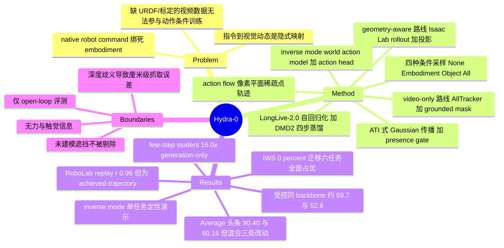

## Summary

Hydra-0 把机器人动作重新表示为图像平面上的稀疏点轨迹（action flow），用这一共享的像素运动接口替代 embodiment 相关的关节/末端指令，让同一个 video world model 能跨机器人形态、任务与 video backbone 训练；部署时先在 Isaac Lab 里把候选指令跑成 link transform，再按相机标定投影成 action flow 作为条件。同一接口反向使用时构成 world action model：只给 desired object flow，模型生成兼容的机器人运动，再由一个 action head 把 DiT latent 读出成可执行指令。

## Problem & Motivation

现有 action-conditioned video world model 大多绑死在训练用的那个 embodiment 上。根因是它们直接吃 native robot command：joint-space 指令本身就编码了机器人结构；同一条 end-effector 指令在运动学不同的机器人上会产生不同的关节轨迹与可见连杆运动。两种表示都没有指定"图像平面上会发生什么运动"，于是 video model 必须额外学一个 embodiment 相关的"指令到视觉动态"的映射，多形态混训与迁移都被卡住。

另一条线（Motion Prompting、ATI、Wan-Move）已经证明 image-plane motion 可以当作通用视觉条件，但这些轨迹是用户手画的、与可执行指令无关。本文要补的正是中间那一环：把共享的视觉运动表示锚定到真实可执行的机器人指令上。

## Method

**Action flow 的两条构造路线。** 表示统一为 `N` 条轨迹，每条含 `H+1` 个时刻的像素位置与可见性二值标记。

- *Geometry-aware（有机器人几何与相机标定时，也是部署时唯一路线）*：在初始帧可见的机器人表面采样点，用 link transform 传播，再经相机内外参投影。可见性判据是投影点深度为正、落在图像内、且与 rendered depth buffer 在 1.2 cm 容差内一致（取 3x3 邻域避免轮廓边界误杀）。部署时 link transform 由 Isaac Lab 执行候选指令的 controller + physics rollout 产生。
- *Video-only（大规模数据集缺 URDF 与标定时的训练路线）*：用 AllTracker 在 128x128 query grid 上跑稠密 track，再用 grounded mask（SAM 3 / 文本提示）把 track 切成 embodiment、object、unassigned 三类。

**训练期四种条件采样模式**：None / Embodiment / Object / All，canonical I2V 概率为 (0.05, 0.40, 0.40, 0.15)。模式只决定哪些轨迹填进共享 motion tensor，不引入额外 learned token。Embodiment 是主要的动作条件；Object 在推理时可以改喂"期望物体运动"，从而反向诱导出兼容的机器人运动——这正是 inverse mode 的训练来源。

**条件注入**沿用 ATI 的 Gaussian 传播 + Wan-Move 的首帧 VAE 特征沿轨迹复制：把 image-space 轨迹池化到 latent 帧，双线性采样首帧 latent 特征作为 source feature，用 Gaussian locality (beta=220) 传播到未来 latent 网格，每个目标格子只保留权重最大的 2 条轨迹、不做 softmax 归一化；权重和 clip 到 [0,1] 得到 presence gate，让 backbone 能区分"被运动条件覆盖的位置"与原始视觉上下文。backbone 权重冻结，只训 DiT patch embedding 与 q/k/v/o 加两个 FFN 投影上的 rank-64 LoRA。

**高效因果 rollout**：按 LongLive-2.0 做 autoregressive conversion，把 latent 序列切成 chunk 并用 KV cache 复用；motion 条件在全窗口坐标下算一次、按绝对 chunk offset 切片，避免轨迹在 chunk 边界被重新锚定。再用 DMD2 蒸馏出每 chunk 四步去噪的 student。

**Inverse mode（world action model）**：只喂 object flow、不给 gripper flow，从 pretrained causal model 出发 post-train rank-32 self-attention LoRA + motion input projection + 轻量 action/state head，损失为 flow-matching loss 加上 masked Huber 的 action/state 项与速度平滑项。训练数据是真实机器人的 paired rollout（成功与失败都用），因为每条都关联了"实际运动"与"产生它的指令"。

## Key Results

**跨 backbone 的条件表示对比（Table 2，五个验证集各 100 clip）。** 最佳配置 Ours (Wan2.2 A14B 4-step) 在 Average 行的 gripper EPE 3.29、object EPE 5.27，相对作者自建的 Cosmos 2.5 原生 6D 末端动作 baseline（34.28 / 13.23）分别低 90.40% 与 60.16%——这就是摘要里的头条数字。但**这个对比同时换掉了三样东西**：动作表示、video backbone（Cosmos 2.5 2B 换成 Wan2.2 A14B）、以及 4-step 蒸馏。真正只换表示的受控对比是 Ours (Cosmos 2.5 2B) 对 Cosmos 2.5：gripper EPE 34.28 到 13.80（约 59.7%），object EPE 13.23 到 6.27（约 52.6%），量级明显小于头条。

同一张表里还有一个更能说明问题的数字：零样本的 ATI 与 Wan-Move 在 Average 行的 gripper EPE 分别是 4.62 与 4.67，比作者精调过的 Cosmos 2.5 baseline（34.28）好一个数量级。这两个模型没有做过任何 multi-embodiment mid-training，唯一优势是"轨迹条件本来就以像素坐标给出"。因此 gripper EPE 在很大程度上度量的是"模型有没有照抄条件"，而不是动力学预测能力；跨表示比较 gripper EPE 结构性地偏袒 flow 条件方法。object EPE 才是更有信息量的那一列（zero-shot 基线在这列是 23.19 / 21.53，明显差于所有 flow 条件的 Ours 变体）。

**数据效率（IWS 六个任务，IWS 被排除在 mid-training 之外）。** 0% 任务数据时，Ours (MT) 在全部六个任务上的 LPIPS、object-flow EPE、FVD 点估计都优于 Ours (PT)；100% 时 Ours (MT) 在六个任务上 LPIPS 与 FVD 最低、flow EPE 在四个任务上最低。20% 到 100% 之间每任务变化不超过 3.4% LPIPS / 6.7% flow EPE / 6.8% FVD，作者据此说大部分收益在 20% 数据处就到位（并自己声明 FVD 每点只用 40 clip、方差大，不足以论证严格收敛）。

**推理速度（Table 3，单张 H100、bf16、batch 1、81 帧 480x832）。** bidirectional teacher 20.92 s/clip，autoregressive teacher 12.48 s（1.68x），few-step student 1.31 s / 61.98 FPS（16.0x）。作者明确标注这是 generation-only、关掉 guidance、不含 VAE/pixel decoding，"不是端到端加速"；且 world action model 用的是 50 步 autoregressive teacher，不是这个 student。

**RoboLab open-loop policy evaluation。** 5 个预训练 policy x 6 个任务 x 每对 10 rollout（300 episode），replayed 与 reference 成功率的 Pearson r=0.96、Spearman rho=0.93、MAE 5.7 个百分点，按任务平均后能复现全部五个 policy 的排名。**关键设定**：action flow 来自"录制好的真实末端轨迹"（achieved-trajectory replay），policy 从不在生成的观测上被 query。换句话说这是"给定已执行轨迹，模型重渲染出来的视频里成败判读是否一致"，不是"模型能否预测某个 policy 在新状态下会怎么做"。作者在 Limitations 里也承认评测只覆盖 open-loop。另外相关系数的 n 在全文任何位置都没有明写：Sec. 4.5 说是"across policy-task pairs"（暗示 30 点），摘要与 contributions 却写成"across 5 RoboLab policies / across those aggregates"（读起来像 5 点），二者不自洽。

**Inverse mode。** 摘要称"uncover an emergent inverse mode"，但正文里它是被训出来的：Object 条件在 mid-training 中以 0.40 的概率采样，world action model 又额外 post-train 了 rank-32 LoRA 与 action/state head。真机结果是**单个 flexible-pipe-bending 任务的定性演示**（Figure 9），没有成功率、没有试验次数、没有任何量化指标；contributions 一节自己的措辞是 "proof-of-concept"。

**训练语料**：7 个来源、178,187 episode、过滤后 1,565,634 window、2,201.7 小时。语料被刻意子集到以可形变物体交互为主（cloth / cable / rope / bag / paper）。Wan2.2 I2V-A14B 训了 5 天 / 40,000 步 / 32 张 H100。

## Evidence Ledger

| Claim ID | Claim | Type | Source locator | Evidence excerpt | Status |
|:--|:--|:--|:--|:--|:--|
| C1 | 头条 90.40% / 60.16% 对应 Table 2 Average 的 Ours (Wan2.2 A14B 4-step)（3.29 / 5.27）对 Cosmos 2.5 baseline（34.28 / 13.23），同时更换了动作表示、backbone 与 4-step 蒸馏 | number/comparison | Table 2 Average block；Sec. 1；Sec. 4.2 Results | "Cosmos 2.5 ... 13.23 / 34.28"; "Ours (Wan2.2 A14B 4-step) ... 5.27 / 3.29"（obj / grip） | source-verified（行归属由 Table 2 反推，(34.28-3.29)/34.28=90.402%、(13.23-5.27)/13.23=60.166% 与正文完全吻合；论文本身未标注对应行） |
| C2 | 被比较的 action-conditioned baseline 是作者自己用 Cosmos 2.5 原生 relative 6D 末端动作表示、在相同轨迹与数据混合上精调的模型 | benchmark-setting | Sec. 4 intro；Sec. 4.2 | "We fine-tune the Cosmos 2.5 baseline using its native relative 6D end-effector action representation" | source-verified |
| C3 | 受控（同 backbone）对比下 Average 行为 gripper EPE 34.28→13.80、object EPE 13.23→6.27，约 59.7% / 52.6%，小于头条数字 | number | Table 2 Average block | "Ours (Cosmos 2.5 2B) ... 6.27 / 13.80" vs "Cosmos 2.5 ... 13.23 / 34.28"（obj / grip） | source-verified（百分比为表内数值的算术换算；论文只定性描述该受控对比） |
| C4 | 零样本 ATI / Wan-Move 的 Average gripper EPE 为 4.62 / 4.67，远优于精调过的 Cosmos 2.5 baseline 的 34.28 | number | Table 2 Average block（gray rows） | "ATI ... 4.62"; "Wan-Move ... 4.67"; "Cosmos 2.5 ... 34.28" | source-verified |
| C5 | Table 2 的五个验证集同时也是 Table 1 训练语料来源；每集用 100 个 held-out validation clip | benchmark-setting | Table 1；Table 2 caption；Sec. 4.2 | "All methods use the same 100 validation clips per dataset across five held-out sets" | source-verified |
| C6 | RoboLab 评测中 action flow 来自录制好的真实末端轨迹（replay），policy 不在生成观测上被 query | benchmark-setting | Sec. 4.5 Protocol | "receives causal action flow derived from the recorded robot end-effector trajectory; the policy is not queried on generated observations" | source-verified |
| C7 | RoboLab 设定为 5 policy x 6 task x 10 rollout（300 episode），报告 r=0.96、rho=0.93、MAE 5.7 个百分点，Figure 7 每点聚合 10 trial | number/benchmark-setting | Sec. 4.5 Protocol/Results；Fig. 7 caption | "five pre-trained policies on six tasks with 10 rollouts per policy-task pair (300 episodes)"; "Each point aggregates 10 trials" | source-verified |
| C8 | 全文从未明写进入 Pearson 相关的点数 n；Sec. 4.5 写 "across policy-task pairs"（暗示 30），摘要/引言/contributions 写 "across 5 RoboLab policies / those aggregates"（读作 5） | benchmark-setting | Abstract；Sec. 1；Contribution 3；Sec. 4.5；Fig. 7 caption | "we compare reference and generated success rates across policy-task pairs using Pearson correlation" | source-verified（verifier 全文含附录检索 n= / points / pairs，确认无显式 n） |
| C9 | 摘要所称 "emergent inverse mode" 实为训练所得：Object 条件在 mid-training 以 0.40 概率采样，world action model 另行 post-train rank-32 LoRA 与 action/state head | causal-mechanism | Sec. 4.1 Training；App. 8.3；Sec. 2.4 | "canonical I2V probabilities (0.05,0.40,0.40,0.15)"; "we post-train rank-32 self-attention LoRA adapters ... and the lightweight action and state heads" | source-verified |
| C10 | Inverse mode 真机结果是单一 flexible-pipe-bending 任务的定性演示，无成功率/试验次数/量化指标 | benchmark-setting | Sec. 4.6；Fig. 9；App. 8.1 | "We qualitatively test whether the world action model ... We illustrate the model on one flexible-pipe-bending task" | source-verified |
| C11 | 摘要/引言的 "zero-shot composition" 在正文没有任何专门章节、图表或量化结果 | sota-novelty | 全文检索 "composition"，仅命中 Abstract 与 Sec. 1 两处 | "including zero-shot composition of robot-action grounding with human-demonstrated deformation dynamics" | source-verified（verifier 确认全文仅两处提及；最接近的 Fig. 6 0% 点被描述为 "zero-shot evaluation with no target-task adaptation"，非 composition） |
| C12 | few-step student 1.31 s/clip、61.98 FPS、16.0x，且为 generation-only、关 guidance、不含 VAE 解码、非端到端；world action model 用的是 50 步 teacher | number | Table 3；Sec. 4.4 Protocol/Results | "excludes guidance and VAE/pixel decoding and is not an end-to-end speedup"; "uses the 50-step autoregressive teacher rather than the few-step student" | source-verified |
| C13 | 训练语料 7 源、178,187 episode、过滤后 1,565,634 window、2,201.7 小时，且刻意子集到以可形变物体为主 | number | Table 1 Total row；Sec. 3 Preprocessing | "Total ... 178,187 / 1,879,296 / 1,565,634 / 2,201.7"; "we keep mainly deformable-object interaction data" | source-verified |
| C14 | IWS 六任务：0% 时 Ours (MT) 三项指标全面优于 Ours (PT)；100% 时 LPIPS/FVD 六任务最低、flow EPE 四任务最低；20%→100% 变化不超过 3.4/6.7/6.8% | number/comparison | Sec. 4.3 Results；Sec. 3 | "At 0%, Ours (MT) has better LPIPS, object-flow EPE, and FVD point estimates than Ours (PT) across all six tasks" | source-verified |
| C15 | 4 步蒸馏 student 在 Average 行的全部七项指标点估计均优于其 50 步 A14B teacher | number | Table 2 Average block | 4-step: "21.84 / 0.830 / 5.27 / 3.29 / 18.7 / 155.9 / 4.23" vs A14B: "20.76 / 0.805 / 6.00 / 3.83 / 20.7 / 193.7 / 3.98" | source-verified |
| C16 | Limitations 承认厘米级抓取误差、推测源于深度感知不足、抓取/接触状态歧义、腕部相机仅定性、评测限于 open-loop | causal-mechanism | Sec. 6 Limitations | "centimeter-scale grasp imprecision ... limited depth awareness ... limited to a qualitative DROID proof of concept ... limited to open-loop" | source-verified |
| C17 | Wan2.2 I2V-A14B 训练 5 天 / 40,000 步 / 32 张 H100；backbone 冻结，仅训 DiT patch embedding 与 rank-64 LoRA | number | Sec. 4.1 Training；Sec. 2.2 | "five days and 40,000 steps using 32 NVIDIA H100 GPUs"; "train rank-64 low-rank adaptation (LoRA) modules" | source-verified |
| C18 | 代码未发布：项目页显示 "Code — coming soon"，arXiv comments 只给项目页而非代码仓库 | license-code | 项目页 hydra-0；arXiv abs Comments | "Code — coming soon"; abs Comments: "Project page: this https URL" | source-verified |

## Strengths & Weaknesses

**亮点。**

问题形式化是干净的：既然 video model 的输出空间是像素，那么把动作也放进像素空间，就消掉了"指令到视觉动态"这一层 embodiment 相关的隐式映射。这个 reformulation 简单、可扩展，而且给出了一个别人没同时做到的性质——同一份表示既能从有几何有标定的机器人指令**正向合成**（Isaac Lab rollout + 投影），又能从只有视频的大规模数据集**反向恢复**（tracker + grounded mask）。这直接解锁了 DROID / EgoDex / ABC-130k 这类缺 URDF 与标定的语料参与多形态混训，是本文最实的贡献。

工程上有两处值得记的细节：motion 条件在全窗口坐标下算一次、按绝对 chunk offset 切片，避免了自回归 chunk 边界处轨迹被重新锚定（这是 causal 化 motion-conditioned video model 的一个真实坑）；以及 presence gate 让 backbone 能显式区分"被条件覆盖的区域"与原始上下文，而不是靠 backbone 自己从被污染的 latent 里猜。

多 backbone 复现（Cosmos 2.5 2B / Wan2.2 5B / Wan2.2 A14B）确实支撑了"这是可移植的条件接口而非某个模型的补丁"这一论断，这是比单点 SOTA 更有价值的证据类型。

**局限。**

*头条数字的可比性有问题。* 90.40% 混合了三处改动，受控数字是 59.7%。更根本的是 gripper EPE 这个指标本身：flow 条件方法直接以像素坐标拿到了机器人应该走的轨迹，复现它接近于"抄条件"；6D 末端指令 baseline 必须自己推断图像平面运动。零样本、未做任何 mid-training 的 ATI/Wan-Move 在这一列（4.62/4.67）碾压作者精调的 baseline（34.28），本身就是这个指标退化为"条件复制度"的直接证据。object EPE 才是这套实验里真正度量动力学预测的列，而它的受控增益是 52.6%——仍然显著，但和摘要给人的印象不是一个量级。（补充推测，无正文依据：Table 2 用哪种 conditioning mode 评测，正文没有明说；从 Sec. 2.4 的 forward mode 描述推断是 embodiment/gripper flow。若确实如此，object EPE 是真正的外推指标。）

*"generalist" 的证据主要不在 Table 2。* 五个验证集全部来自训练语料，是 held-out clip 而非 held-out 数据集/形态。真正的跨分布证据只有 IWS 的 0% 点（六个任务）。同时语料被刻意子集到可形变物体交互，H1-Fold-Clothes 只有 38 episode / 0.1 小时——"generalist world model" 目前更准确的读法是"以可形变操作为中心的多形态 world model"。

*r=0.96 不支撑"世界模型已可用于 policy evaluation"。* 这是 achieved-trajectory replay：真实执行轨迹被完整地喂给模型，policy 从未在生成观测上闭环。它证明的是"给定动作序列，模型渲染出的视频保留了成败信号"，这是 policy evaluation 的**必要条件**而非充分条件。加上 n 在全文不自洽（30 还是 5 说不清）、每点只有 10 次 rollout（成功率被量化到 10% 步长，MAE 5.7pp 不到一个量化步）、以及 policy-task pair 上的相关系数会被任务难度差异撑高（若跨任务方差主导，高 r 只说明模型分得清难易，未必分得清同任务下的 policy 差别，此为推测），这个数字应该按"open-loop 一致性的初步证据"来引用，不能当作评测器可替代真机的依据。作者自己在 Limitations 里的措辞也比摘要克制。

*"emergent" 是明确的措辞过度。* Object-flow 条件是以 0.40 概率训出来的四种模式之一，world action model 还额外做了 LoRA + head 的 post-train，且真机只有一个任务的定性演示。摘要说 "uncover an emergent inverse mode"，contributions 说 "proof-of-concept"，两者不该并存。"without requiring task-specific expert robot demonstrations" 也需要小心读：它训练用的是真实机器人 paired rollout（含失败），只是不要求专家水平，并不等于零真机数据。摘要里的 "zero-shot composition" 更是全文只出现在摘要与引言，没有任何对应实验。

*像素运动表示的失效边界（部分为推断）。* 论文自身给出的边界是：厘米级抓取误差，作者推测源于深度感知不足；生成 rollout 里抓取/接触状态歧义；建议未来引入 depth、tactile、force。附录 8.2 还暴露了一个更硬的边界——可见性判据依赖 rendered depth buffer 与已知静态几何/solid-body proxy，"unknown or unmodeled object occlusions are not explicitly removed"，即被未建模物体遮挡时 flow 会给出错误的"可见"点，而现实桌面场景恰恰充满未建模遮挡物。此外（以下为我的推断，非论文论断）：2D 投影天然丢失沿视线方向的运动，这正好解释作者观察到的深度类误差；力/力矩、夹持力、刚度完全不在这个接口里，因此擦拭、插拔、拧紧这类以力为主的任务无法用 action flow 指定；对可形变体，稀疏点轨迹能表达"物体表面点往哪走"，但表达不了拓扑与层次变化（布料折叠后哪一层在上），而这恰恰是本文的主战场。相机标定误差的影响只有定性说法（"moderate calibration error perturbs the condition; large projection errors can degrade spatial correspondence"），没有量化实验。

*一处反常值得追。* 4 步蒸馏 student 在 Average 行的七项指标上**全面优于**它自己的 50 步 teacher。蒸馏通常损失保真度。合理解释可能是 DMD2 减少了 flow-matching 采样的模式平均导致的模糊，从而同时抬高 PSNR/FID/FVD（推测）；但另一种解释是 teacher 本身欠训。论文没有讨论，这是我最想看到的一个 ablation。

**对领域的影响。** 如果 action flow 这条接口成立，最直接的后果是 world model 的训练数据不再受限于"有 URDF + 有标定 + 有同构动作空间"的机器人数据，人类第一视角视频与手持夹爪数据可以直接进入同一个动作条件空间。这对 world model 的 scaling 是实质性的解绑。反过来，本文没有回答的核心问题是：一个只能表达可见像素运动、不含力与深度的接口，其能力上限在哪里——从 Limitations 反推，答案很可能就卡在接触发生的那一刻。

## Mind Map

## Notes

- 项目页 <https://nvidia-isaac.github.io/video_to_data/hydra-0/>，代码标注 "Code — coming soon"，暂无仓库可做 repo-digest。项目页隶属 NVIDIA Isaac 的 `video_to_data` 系列，值得留意该系列后续工作。
- 与 vault 的连接点：这是 [[Topics/WorldModel-Survey]] 里"action 条件表示"这一分支的一个明确候选锚点。可对照的邻近工作在 Related Work 里被点名的有 ContactFlow（arXiv:2607.26579，同样宣称跨形态迁移的 video action conditioning）、Wan-Move、ATI、IWS、DINO-WM。ContactFlow 与本文的正面对比是缺失的，值得单独查。
- 一个待检验的判断：本文把 world model 的 action 接口问题转成了"运动表示的可见性问题"。这条路线的天花板取决于"任务意图能否被可见运动完全指定"。对 pick-place、fold、push 大致成立；对任何以力/刚度/接触状态为目标的任务不成立。这可能是一个值得追的 idea 方向——如何在保持像素接口通用性的同时，补上一个低维的、同样跨形态的接触/力通道。
- Table 2 使用哪种 conditioning mode 评测，正文未明说；若后续引用此表的 object EPE 作为"预测能力"证据，需先确认 object flow 未被作为条件输入。
