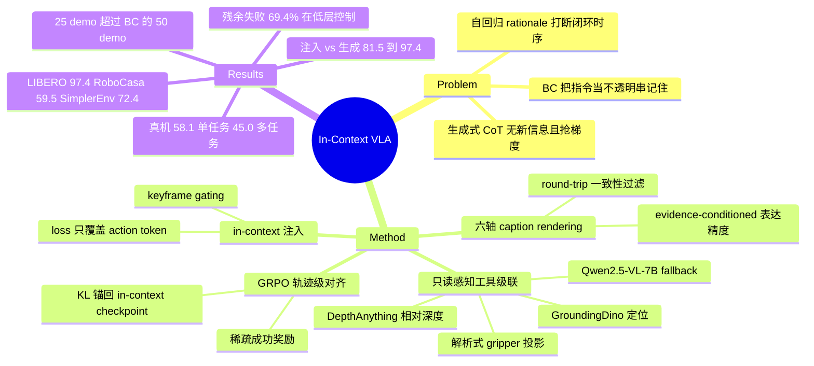

## Summary

论文（方法名 VLA-Talker）主张 VLA 需要的是读懂语言而不是生成语言：把 open-vocabulary 检测、单目深度、解析式 gripper 投影和 VLM fallback 组成的只读感知工具链产出的结构化空间证据，以 `<spatial>` 标签注入 prompt，loss 只作用在 action token 上，再用 GRPO 做轨迹级对齐。在 LIBERO、RoboCasa-GR1、SimplerEnv 与 AgiBot G1 上八个真机子任务上都报告了最好的平均成功率。全文最有信息量的证据不是 SOTA 表，而是证据完全相同、只改「生成 vs 注入 + 监督掩码」的三行对照：81.5% → 89.7% → 97.4%。

## Problem & Motivation

VLA 几乎都用 behavior cloning 训练，指令被当成一个不透明的条件串记住而不是被理解，换个同义词就掉点；观测走单次前馈，policy 没有主动补齐缺失信息的手段。社区的常规解法是加 textual chain-of-thought，但作者认为生成式 CoT 在低层控制上至少无益：rationale 由 action head 已经看到的同一批特征生成，期望上不带新信息，一旦幻觉就变成误导性前缀；语言 token 数量远超 action token，单一自回归 loss 里梯度被「说得像回事」主导；推理时每次决策多生成几百 token，闭环时序被打断，前缀里的早期错误会污染 action 后缀。

作者由此拆开生成式 CoT 混在一起的两件事——获取证据和使用证据，把前者外包给工具链，policy 只学后者。

## Method

**工具链**（只读感知，无任何改变环境状态的工具）。每个 keyframe 上，GroundingDino 从指令里解析出的目标/目的地名称做 open-vocabulary 定位，DepthAnything 给出归一化到 [0,1] 的相对深度（1 近 0 远），gripper 位置直接由 proprioception 的世界坐标经相机内外参解析投影到像素（无需学习），检测器不确定或失败时级联到 Qwen2.5-VL-7B locator。产出是一条结构化 evidence tuple：`((u_g, v_g, d_g, grip state), {(u_o, v_o, d_o)}, relations)`。

**Caption rendering**。同一条 tuple 沿六个轴渲染成多个表层形式：参照模态（绝对坐标 / 相对偏移 / 定性）、参照系（egocentric / allocentric / object-relative）、词法句法改写、深度表述（数值 / 比较 / 可操作提示）、详略度、以及 evidence-conditioned content（检测器成功才给坐标，fallback 路径只给定性描述）。渲染器不是自由续写，输入永远是精确的数值 tuple，输出被限制在固定 slot 语法内，且每条候选都要经过 round-trip 过滤：用规则解析回 (offset, depth-comparison)，与原 tuple 偏差超过 5 px 或 0.02 归一化深度即丢弃。

**In-Context Post-Training**。训练序列是 `[指令, <image>, c_t, a_{t:t+H}]`，loss 只加在 action token（外加它前面那个 separator）上，指令与 `<spatial>` token 全部 mask 掉。模型因此从不学习产生证据，只学在预测动作时去 attend 它。

**Keyframe gating**。证据只在初始帧、gripper 开合状态变化帧和周期性检查点注入，其余步为空上下文，此时模型就是一个普通 VLA。推理时沿用同一调度。

**轨迹级 RL**。在 in-context checkpoint 之上跑 GRPO：稀疏成功奖励加一个 tool-call 语法的 format 正则项，group-relative advantage 归一化，KL 锚回 in-context 策略。只有 action token 进入 importance ratio，注入的证据 token 始终不被生成。

## Key Results

仿真侧 backbone 是 OpenVLA-OFT，训练与推理只用单个第三人称 RGB，无腕部相机。Gen-CoT 是作者自建的 matched-evidence 基线：同一套工具链证据，但生成并监督成文本。

| Benchmark | VLA-Talker | Gen-CoT | 最强已发表基线 |
|:--|:--|:--|:--|
| LIBERO 四 suite 平均 | 97.4 | 96.2 | VLA-Thinker 97.0 / π0.5 96.9 |
| RoboCasa-GR1（24 任务平均） | 59.5 | 46.5 | ABot-M0 58.3 |
| SimplerEnv（4 held-out WidowX） | 72.4 | 54.7 | LangForce 66.5 |

监督方式对照（Table 3，证据完全一致）：生成并监督文本 81.5% / 4.6× 延迟；注入但仍对证据计 loss 89.7% / 1.0×；注入且只监督 action 97.4% / 1.0×。

训练阶段消融（Table 4）：backbone 90.4 → in-context SFT 95.6 → 完整两阶段 97.4；单独跑 GRPO 而不做 in-context 冷启动只有 87.8，低于 backbone。

数据效率（Table 6，全部从同一初始化重训）：25 demo/task 的 VLA-Talker 拿到 92.8%，超过 50 demo 的 BC（90.4%）；Gen-CoT 在 5/10/25/50 每一档都低于 BC。

分布外（Table 7）：seen 97.4 → 未见物体 85.1 → 加干扰物 80.3；BC 是 90.4 → 54.8 → 47.6。

组件消融（Table 12）：去 depth 93.2，去 VLM fallback 92.8，每步注入 95.1，去掉整个 tool loop 改为模型自猜 84.3。

推理（Table 10，单卡 A100，batch 1）：VLA-Talker 78 ms / 12.8 Hz，Gen-CoT 约 256 个 rationale token / 359 ms / 2.8 Hz，无推理的 action-only 策略 73 ms / 13.6 Hz。

失败归因（Table 15）：VLA-Talker 的残余失败 69.4% 是 control error、21.4% grounding、9.2% perception；Gen-CoT 则 57.9% 是 grounding error。

真机（AgiBot G1，八个桌面子任务，每任务 20 trials，backbone 换成 JoyAI-RA-0.1）：Baseline 41.9 单任务 / 28.1 多任务，+CoT 41.9 / 29.4，+In-Context 58.1 / 45.0。

## Evidence Ledger

| Claim ID | Claim | Type | Source locator | Evidence excerpt | Status |
|:--|:--|:--|:--|:--|:--|
| C1 | LIBERO 四 suite 平均 97.4%，Gen-CoT 96.2%、VLA-Thinker 97.0%、π0.5 96.9% | number | Table 1 | "VLA-Talker 98.2 99.2 98.4 93.6 97.4" | source-verified |
| C2 | 监督方式三行对照 81.5%@4.6× / 89.7%@1.0× / 97.4%@1.0× | comparison | Table 3 | "(a) Generate + supervise text 81.5 4.6×; (c) Inject + action-only (ours) 97.4 1.0×" | source-verified |
| C3 | backbone 90.4 → SFT-only 95.6 → GRPO-only 87.8（低于 backbone）→ full 97.4 | number | Table 4 | "degrades accuracy to 87.8%—below even the backbone" | source-verified |
| C4 | Table 2 的 Avg 是全部 24 个任务的平均；展示的 4 个任务里 VLA-Talker 在 Bottle/Cup/Milk 上都不是最优 | benchmark-setting | Table 2 + "RoboCasa-GR1." 段 | "Table 2 reports four representative pick-and-place tasks; the average is computed over all 24 tasks." | source-verified |
| C5 | SimplerEnv 平均 72.4 最优，但单任务 Carrot 56.3 低于 VLA-JEPA 70.8 / GR00T N1.5 65.5 / π0.5 64.7 | comparison | Table 5 | "VLA-Talker 91.7 56.3 47.9 93.8 72.4" | source-verified |
| C6 | 真机三配置平均 41.9/28.1、41.9/29.4、58.1/45.0；每子任务 20 trials；backbone 为 JoyAI-RA-0.1 | number | Table 8 + Appendix B | "success rate (20 trials per subtask)"; "all policies built on the JoyAI-RA-0.1 vision-language-action backbone" | source-verified |
| C7 | 工具全为只读感知工具，无改变环境状态或 reset/undo/fork 的工具 | causal-mechanism | "Implementation." + "Agentic Tool Use" | "Tools are an open-vocabulary detector (GroundingDino), a depth estimator (DepthAnything), and a VLM locator fallback (Qwen2.5-VL-7B)" | source-verified |
| C8 | loss 只作用在 action token，instruction 与 `<spatial>` token 全部 mask | causal-mechanism | "In-Context Post-Training" | "the loss is applied only to the action tokens ... with all instruction and \<spatial\> tokens masked out" | source-verified |
| C9 | 上下文由工具链自动产出无人工标注；renderer 离线跑 Qwen2.5-VL-7B，round-trip 过滤掉约 3–4%，每 tuple 24 个 realization | benchmark-setting | Appendix A + L + Table 16 | "this filters out roughly 3–4% of LLM-expanded candidate paraphrases per benchmark" | source-verified |
| C10 | 25 demo 达 92.8% 超过 50 demo 的 BC 90.4%；Gen-CoT 每一档都低于 BC | number | Table 6 | "BC 50.6 63.1 77.4 90.4; Gen-CoT 48.2 59.7 74.3 87.6; VLA-Talker 71.4 84.6 92.8 97.4" | source-verified |
| C11 | 未见物体与干扰物：97.4 → 85.1 → 80.3；BC 90.4 → 54.8 → 47.6 | number | Table 7 | "VLA-Talker 97.4 85.1 80.3" | source-verified |
| C12 | 78 ms / 12.8 Hz vs Gen-CoT 359 ms / 2.8 Hz；无推理 action-only 73 ms / 13.6 Hz | number | Table 10 + Appendix D | "VLA-Talker runs at 12.8 Hz—about 4.6× faster than the Gen-CoT baseline" | source-verified |
| C13 | 组件消融：去 tool loop 84.3、去 depth 93.2、去 VLM fallback 92.8、每步注入 95.1 | number | Table 12 | "w/o tool loop (self-guess) 84.3" | source-verified |
| C14 | VLA-Talker 69.4% 失败为 control error；Gen-CoT 57.9% 为 grounding error | number | Table 15 | "Gen-CoT 18.5 57.9 23.6; VLA-Talker 9.2 21.4 69.4" | source-verified |
| C15 | 仿真侧只用单个第三人称 RGB，无腕部相机 | benchmark-setting | "Backbone and baselines." | "we use only a single third-person RGB view and the language instruction (no wrist camera)" | source-verified |
| C16 | Gen-CoT 是作者自建的 matched-evidence 变体，不是已发表系统 | comparison | "Backbone and baselines." | "report a generative-CoT (matched evidence) variant, denoted Gen-CoT, that uses the identical evidence tuples from the same tool loop" | source-verified |
| C17 | 3 seed；VLA-Talker vs Gen-CoT 在 LIBERO 平均上双尾 Welch t 检验 p<0.01 | number | Appendix E | "A two-sided Welch's t-test between VLA-Talker and Gen-CoT on the LIBERO average across seeds gives p<0.01" | source-verified |
| C18 | 工具失败时 policy 不收到 error code：级联到 VLM；两者都失败时只描述可见部分，不编造坐标 | causal-mechanism | Appendix A "Occlusion and multi-object scenes." | "the renderer falls back to the purely qualitative modality, describing only what is visible" | source-verified |
| C19 | 全文未给出任何公开代码库或 project page；arXiv HTML 标注 CC BY 4.0 | license-code | 全文 URL 扫描 + HTML 头 | "License: CC BY 4.0" | source-verified |
| C20 | 论文正文称去掉 tool loop 会让 VLA-Talker 退回 BC 水平 | causal-mechanism | Appendix D "Component Ablations" 正文 vs Table 12 / Table 6 | "Removing the tool loop entirely ... reduces VLA-Talker to BC-level performance" | contradicted |
| C21 | Table 4 的 backbone 行 90.4% 低于既有记录中 OpenVLA-OFT 单视角配置的 95.3% | comparison | 本文 Table 4 + [[Papers/2502-OpenVLA-OFT]] Table I | "OpenVLA-OFT (backbone) 90.7 94.6 89.8 86.3 90.4" | not-checkable |

C20 的更正：Table 12 该行是 84.3%，Table 6 的 BC（50 demos）是 90.4%，相差 6.1 分，不是「BC 水平」。本笔记不复述作者这一措辞。

C21 的边界：OpenVLA-OFT 的 95.3% 取自 vault 内的二手记录，本轮未回 OpenVLA-OFT 原文核对，两处的 demo 数、chunk size、评测 trial 数是否可比也未验证。该对比只作为待核问题保留，不作为结论。

## Strengths & Weaknesses

**站得住的部分。** Table 3 是全文的承重件：同一批 evidence tuple、同一 backbone，只改注入还是生成、以及 loss 是否覆盖证据 token，三行拉开 15.9 分。它把「注入 vs 生成」和「监督掩码」两个变量分开测了，第二行（注入但仍监督文本，89.7）恰好隔离出监督掩码单独值 7.7 分，这比只报一个端到端 SOTA 有用得多。Table 12 把 tool loop 换成模型自猜掉到 84.3，说明起作用的是证据的内容而非上下文这个形式。数据效率曲线（Table 6）三个方法从同一初始化重训，25 demo 超过 50 demo 的 BC，是 data-matched 的。真机部分把 backbone 换成 JoyAI-RA-0.1 后结论方向不变，且相同证据的 +CoT 臂几乎没有增益（41.9 → 41.9 单任务），这条跨 backbone 的复现比仿真里的 SOTA 表更有说服力。三个 seed 加 Welch 检验、检测器丢弃率与像素噪声两条 stress test、失败归因表，工程完整度在同类工作里偏上。

**站不住或未被隔离的部分。** SOTA 框架建立在不 matched 的对照上。Tables 1/2/5 里的 GR00T N1.5、π0.5、VLA-Thinker、LangForce、ABot-M0 各用各的 backbone 和训练数据，LIBERO 上 97.4 对 97.0 / 96.9 的 0.4–0.5 分差，在没有这些方法的 seed 方差时不构成可用结论——论文的三 seed 只覆盖它自己的 BC / Gen-CoT / VLA-Talker。Table 1 里没有列 OpenVLA-OFT 本身，而它正是本文的 backbone；backbone 的成绩只在 Table 4 出现一次（90.4），比既有记录中 OpenVLA-OFT 单视角配置的 95.3 低约 5 分（C21，未回原文核）。如果 95.3 是可比口径，注入证据的净增益会从 +7.0 缩到 +2.1，全文的量级判断会变。

Gen-CoT 这条基线在每个数据预算上都低于纯 BC（Table 6），在 seen 分布上也低于 BC（87.6 vs 90.4）。「生成式 CoT 有害」这个论断完全压在这条自建基线上，而一个连 BC 都跑不过的 CoT 实现，更可能说明它没调好，而不是说明生成式 CoT 本身有害。要让这个论断立住，最小检验是拿一个已发表的 CoT-VLA 权重在同 backbone、同数据上重训，与 Gen-CoT 对齐后再比。

「objective interference」被写成机制解释（语言 token 数量压倒 action token，梯度被叙述主导），但论文从头到尾没有测过梯度质量的分配，也没有报过语言/动作 token 的比例。Table 3 第二行是目前最接近的间接证据，只能支持「去掉证据上的 loss 有 7.7 分收益」，不能支持梯度归因的具体机制。

Table 2 展示四个任务、却让 Avg 列报 24 个任务的均值，而展示的四个里 VLA-Talker 在 Bottle（76.0 vs ABot-M0 86.0）、Cup（48.0 vs 52.0）、Milk（58.0 vs GR00T N1.5 60.0）都不是最好；SimplerEnv 的 Carrot（56.3）也低于四个基线。这种排版让读者从可见的数字里得不到与 Avg 一致的印象。

Table 10 只给 per-decision latency，没有单列 tool loop 自身的 wall-clock（GroundingDino + DepthAnything，以及在 8.8–16.4% 的 keyframe 上调用的 7B VLM）。12.8 Hz 与 action-only 13.6 Hz 之间 6% 的差距是否已经包含这部分，原文没有说明。

**对领域的影响。** 论文把「VLA 的 reasoning」这个问题重新拆成了两个可分别处理的部分：证据从哪来（外包给现成感知模型），证据怎么用（policy 学）。这个拆法比继续把 CoT 塞进自回归序列更容易 scale，因为它不需要任何人工 reasoning 标注。真正的天花板被推到了现成检测器的分布覆盖和相机标定上，而这两项都有独立的改进路径。

## Mind Map

## Notes

### 工具是什么，失败时 policy 拿到什么

四个工具全部是只读感知工具，没有一个会改变环境状态，也没有 reset / undo / fork（C7）。所以这不是一个 act affordance 的工作，而是一个 observe affordance 的工作。

失败反馈的设计比 error code 有意思。检测器不确定时级联到 VLM locator；两者都失败（检测置信度低于阈值且 VLM abstain）时，renderer 只描述可见的东西（比如 gripper 自己的位置），不为被遮挡物体编造坐标（C18）。policy 因此拿到的始终是可读的结构化空间信息，只是精度降级，而不是一个「工具挂了」的信号。

这条正好落在 vault 已确立的约束上——affordance 应该给可据以修正的结构化状态，不是成功/失败标签。但它和 AFE 关心的 verify affordance 作用点不同：本文的注入是 pre-action 的（keyframe 触发，用来决定下一步怎么动），AFE 的 verify 是 post-execution 的取证（用来判断上一步的效果）。本文验证的是「结构化状态比自生成叙述更可用」，没有触及「post-execution 取证能否提升 recovery」。

一个反向警告值得单独记：Table 12 里注入模型自猜的证据只有 84.3%，比根本不注入的 backbone（90.4%）低 6 分。affordance 返回不可靠值时，agent 会比没有这个 affordance 更差。AFE-MiniSuite 的对照设计里应该有一条对应臂——不是「有 affordance vs 无 affordance」，而是「可靠 affordance vs 噪声 affordance vs 无 affordance」。

### provenance 的一个独立数据点

renderer 的 prompt 里带 `source={detector|vlm_fallback}` 字段，而「evidence-conditioned content」轴强制：检测器成功才允许出坐标，fallback 路径只给定性描述（Appendix A、Appendix L）。也就是说 provenance 直接决定了 affordance 返回值的表达精度，接口不允许在证据不可靠时制造虚假精确。

这与 vault 中「observe affordance 须携带 provenance / freshness 元数据」的判断形态一致，而且是第一个来自 embodied 域的例子（此前的 [[Papers/2607-GUIStateBelief]] 与 [[Papers/2605-EnvTrustBench]] 都在 GUI 域）。但只能算形态收敛，不能算因果证据：这一轴从未被单独消融，Table 12 的 "w/o VLM fallback"（92.8）测的是级联本身而不是 provenance 编码。另外这里的 provenance 是隐式编码在表层形式里的（有坐标 / 无坐标），不是一个 policy 可以显式查询的类型化字段。

### in-context 的粒度与可 scale 性

粒度是 keyframe 级：初始帧、gripper 开合状态变化帧、周期性检查点，每 episode 实际注入 3.6（SimplerEnv）到 6.8（RoboCasa-GR1）次。

上下文内容全部由环境和现成模型产出，无人工标注（C9）。simulator 给相机内外参，proprioception 给 gripper 世界坐标，GroundingDino 与 DepthAnything 给目标与深度。Qwen2.5-VL-7B 只出现在两处：在线 fallback（占 keyframe 的 8.8%–16.4%）和离线改写，且改写被限制在 slot 语法内并经 round-trip 过滤。没有「更强模型标注 reasoning」这一环，标注成本不随任务数增长——这是它比 [[Papers/2407-ECoT]] 那条路线更容易 scale 的地方。

可 scale 的真实瓶颈有两个，都被 Appendix N 承认：gripper 投影依赖已知相机内外参（sim 免费，真机需要每个 rig 一次性标定）；注入证据的质量上界就是现成感知栈的分布覆盖。第三个瓶颈作者也点了——keyframe gating 是手工设计的固定触发器，什么时候该重新取证并没有被学出来。GRPO 阶段学到的只是少调用（Figure 10：每 episode 工具调用从约 3.4 降到约 1.8），不是学会在什么条件下调用。

### 增益来自哪

论文内部的对照是 backbone-matched 且 data-matched 的，这部分结论可用：Table 3 三行同证据同 backbone 只改注入/生成与掩码（81.5 → 89.7 → 97.4），Table 12 把 tool loop 换成自猜掉到 84.3，Table 6 三个方法从同一初始化重训。合起来支持增益来自外部证据加上只监督 action，而不是更大的 backbone 或更多数据。

跨方法的部分不成立。Tables 1/2/5 里的已发表基线各用各的 backbone 与数据，没有任何 matched 重训（C16）。LIBERO 上 97.4 与 VLA-Thinker 97.0 的差距落在 vault 反复确认的「+0.3% SOTA 不是 insight」区间里。更需要核的是 C21：Table 4 的 backbone 行 90.4 比既有记录中 OpenVLA-OFT 无 wrist 配置的 95.3 低约 5 分，而 Table 1 干脆没列 OpenVLA-OFT。若 95.3 是可比口径，净增益从 +7.0 缩到 +2.1。这一条本轮未回 OpenVLA-OFT 原文核对，最小检验是拿 OpenVLA-OFT 公开 checkpoint 在本文的单视角、同 demo 数配置下重跑 LIBERO。

### 与 vault 已有笔记的关系

[[Papers/2407-ECoT]] 是最直接的对照组。ECoT 同样用 Grounding DINO 与 OWLv2 离线合成 grounded reasoning（含 gripper 像素和物体 bbox），但让 policy 去**生成**它；本文用几乎同一套证据源，改成注入加只监督 action。两篇的差别恰好就是本文 Table 3 的 (a) 行和 (c) 行。

[[Papers/2606-ERVLA]] 独立得到方向一致的结论：ECoT 作为 autoregressive action prefix 不可靠 scaling，应把 CoT 降格为 representation-shaping supervision。本文更激进，连 representation-shaping 的语言 loss 也去掉了。两篇在「生成语言对低层控制无益」上构成第二个独立数据点，且用的是不同 backbone 和不同规模的数据。

[[Papers/2607-VisualAccessBoundary]] 在 VLM QA 侧测出 CoT 的增益来自对已写入 hidden state 的更长语言计算，而非持续回看图像。这与本文「rationale 由同一批特征生成因而期望上不带新信息」的论证同向，但域不同（QA vs control），只能算旁证。

[[Papers/2606-SpaceTools]] 被本文引用，走的是相反路线：用 double interactive RL 训 VLM 学会多轮选工具、排工具顺序、从工具错误中恢复。本文把工具编排固定成手写级联，policy 完全不学 tool selection。哪条路线更好，两篇都没有直接对照，这是一个具体的空白。

[[Papers/2506-CoTVLA]] 与 [[Papers/2606-ACoTVLA]] 是 Table 1 里 CoT 路线的两个代表（前者用未来 subgoal image 做 visual CoT，后者把 CoT 移到 action space）。[[Papers/2606-ActiveVLA]] 也做主动感知，但它主动选的是虚拟视角，本文主动选的是查询哪个物体。[[Papers/2502-OpenVLA-OFT]] 是本文的仿真 backbone。

### 待办

1. 核 C21：用 OpenVLA-OFT 公开 checkpoint 在本文单视角配置下重跑 LIBERO，确认 90.4 这个 backbone 数字是否偏低。
2. Gen-CoT 这条基线在每个预算上都输给纯 BC，值得对照一个已发表 CoT-VLA 权重在同 backbone 上重训后再比。
3. Table 12 的 84.3 < backbone 90.4 这个负收益，是 AFE observe affordance 设计里最该先复现的现象——它决定了 affordance 在低可靠度下要不要静默降级为空。
