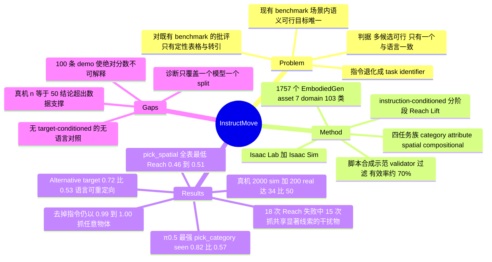

## Summary

论文提出 instruction-following 评测应当 text-indispensable——同一场景里多个动作在视觉与物理上都可行，只有一个与语言一致——并按这个原则在 Isaac Lab 上造了一个 pick-and-place benchmark：1,757 个 curated asset、四个任务族（category / attribute / spatial / compositional）、约束式布局保证目标唯一、instruction-conditioned 的分阶段 Reach/Lift 指标（C1、C2、C5、C6）。四个 VLA（π0 / π0.5 / GR00T N1.7 / Motus）在每任务 100 条 demo 上微调后，普遍卡在"定位对了但抓不起来"，最强的 π0.5 在 pick_category seen 上 Reach 0.82 / Lift 0.57（C3、C7）。最有信息量的结果是 counterfactual 诊断：把指令换成 generic / empty / absent 之后 π0.5 仍以 0.99–1.00 的比例去抓某个物体，说明语言能改写抓哪个，却不能门控要不要抓（C11）。

## Problem & Motivation

作者的论点是一个 problem-formulation 层面的批评，而非榜单批评：VLA 的核心承诺是"不同指令在同一视觉场景下导致不同动作"，但多数 manipulation benchmark 的场景里语义上说得通的目标物或放置点只有一个，于是正确动作可以纯靠视觉推断出来，指令退化成一个 task identifier 而非必需的 grounding 信号。据此他们提出的判据是：一个 episode 必须包含至少两个物理上可执行的候选目标，其中只有一个与指令一致（形式化为 `|G| >= 2`，`g* ∈ G`，只有 `g*` 匹配 `l`）。

这个判据本身是对的，也正是 vault 关心的那类批评。但要注意它在本文里的证据地位：作者对既有 benchmark "不 text-indispensable" 的指控，靠的是 Table 1 那张 ✓/▲/✗ 的**设计目标**对照表，加上引用 LIBERO-CF（Fang et al. 2026，"When vision overrides language"）已有的发现；他们自己没有在 RLBench / CALVIN / VIMA / LIBERO / VLABench / SimplerEnv / RoboTwin 中任何一个上跑过 language-blind 或 language-ablated 策略来实测（C13、C14，独立核查者对全文正文与附录做了关键词穷举，这些 benchmark 名只出现在 Table 1、Related Work 与参考文献）。也就是说，"现有 benchmark 测不出语言依赖"这个前提在本文里是**断言加转引**，不是本文的实验结果。

另一层需要看清的：same-scene counterfactual 这条轴在 Table 1 里 LIBERO-CF 也拿了 ✓，InstructMove 在这一格并不独占；本文相对 LIBERO-CF 的增量在于把这条轴做成闭环 manipulation 的训练-评测基建，而不是首次提出这个诊断。

## Method

**Benchmark 实例化流水线**（Isaac Lab + Isaac Sim）由三块对齐的组件构成：

1. **Asset library**。从 EmbodiedGen 生成的 3,253 个物体里筛出 1,757 个用于 benchmark 实例化，覆盖 7 个 domain / 18 个 super-category / 103 个 fine-grained category，平均每类约 17 个实例，另有 20 个 receptacle/destination 类别（C1、C2）。标注链路是 GPT-4o 从六个 canonical 视角出结构化属性，再叠三层人工设计的标注（grasp affordance、capability tag、referring expression），质量控制针对两类靠任务成功率查不出的错误——尺度错误（对照 VLM 预测范围与类别常识先验）和抓取可行性错误（每个 asset 在 Isaac Sim 里跑 100 次试抓）；语义元数据由 GPT-5.4 与 Claude Sonnet 4.6 交叉校验，只有冲突项才进人工复核。
2. **Task-and-layout library**。两个 primitive template（Pick、Pick-and-Place）实例化成四个任务族。Pick Category 是 1 个目标加 5 个跨类干扰物；Pick Attribute 是 1 个目标加 2 个同类但颜色/尺寸/形状/材质不同的干扰物；Pick Spatial 是 1 个参照物、1 个目标和 1 个**同类**干扰物，关系词表为 left of / right of / in front of / behind / near / far from，全部按 robot-centric 坐标系定义，布局生成保证恰好一个候选满足该关系；Compositional Pick-Place 让"拿什么"和"放哪里"同时有歧义（C6）。指令由 template-level paraphrase（每个任务族一组语义等价变体）与 object-level referring expression（LLM 为每个 asset 生成多个 caption 候选）组合生成。
3. **Expert trajectory dataset**。示范轨迹是**脚本合成**而非人工遥操：任务被拆成 Pick / Move / Place 原子动作，抓取位姿从初始 pose 扰动 roll/pitch/yaw 采样、按 IK 可行性与关节空间代价筛选，再做带碰撞约束的运动规划；rollout 之后过一遍 task specification 里声明的 validator（可达性、抬起、稳定性、无碰撞、目标区域放置），不合格的丢弃，四个任务实例上的有效合成率约 70%（Franka 与 PiperX 都是）（C4）。注意 sim 数据是脚本合成，而 Table 5 里那 200 条真机示范是 ALOHA 式人工遥操，两者来源不同。

**评测协议**是 train-eval：在 benchmark 自己生成的示范上微调，在同任务族但布局、物体实例、属性、类别 held-out 的 episode 上评。指标刻意不用最终成功率，而是 instruction-conditioned 的分阶段分数：pick-only 用 `S_pick = 0.5*I[Reach] + 0.5*I[Lift]`，pick-and-place 用四项各 0.25 的 `S_pnp`（ReachPick / LiftPick / ReachPlace / Place）（C5）。关键在于 Reach 是相对**指令一致的目标**定义的——所以"物理上完成了一次漂亮的抓取，但抓错了物体"记为 Reach 失败。这是整套设计里最有用的一个决定。

## Key Results

**训练规模先看清楚**：每个任务的数据集只有 100 条训练 episode，每个报告指标在 100 条 held-out episode 上评；四个模型统一微调 5,000 步、8 卡、不做 checkpoint 选择，π0/π0.5 只训 LoRA（从 OpenPI pi0_base / pi05_base 出发），GR00T N1.7 冻 LLM 与视觉主干、只更新 projector/diffusion/VL-norm，Motus 不用 LoRA 但冻 Qwen3-VL（C3、C16）。作者称 compact training set 是为"有限 post-training、保留预训练能力"而刻意选择的。

**Table 2（Reach/Lift，括号内为阶段分）**（C7、C8、C9）：

| Model | pick_category Seen | pick_attribute | pick_spatial | place_a2b |
|:--|:--|:--|:--|:--|
| π0 | 0.34/0.04 (0.19) | 0.44/0.05 (0.24) | 0.36/0.02 (0.19) | 0.64/0.07/0.05/0.03 (0.19) |
| π0.5 | 0.82/0.57 (0.69) | 0.81/0.62 (0.71) | 0.46/0.15 (0.30) | 0.88/0.48/0.37/0.36 (0.52) |
| GR00T N1.7 | 0.76/0.17 (0.47) | 0.76/0.07 (0.41) | 0.50/0.01 (0.25) | 0.60/0.06/0.05/0.05 (0.19) |
| Motus | 0.41/0.10 (0.26) | 0.69/0.17 (0.43) | 0.51/0.02 (0.26) | 0.57/0.02/0.02/0.01 (0.16) |

前两列在 PiperX 上评，后两列在 Franka 上评。Reach 与 Lift 的落差是这张表最主要的信息：GR00T N1.7 在 pick_attribute 上 Reach 0.76 而 Lift 只有 0.07，π0 与 Motus 的 Lift 全线在 0.01–0.17。作者据此说 Reach 主要考 grounding、Lift 主要考控制，但这个落差量级更像是 100 条 demo 训不出这套 action space（见 Strengths & Weaknesses）。pick_spatial 是全表最低的一族，π0.5 / GR00T / Motus 的 Reach 分别为 0.46 / 0.50 / 0.51，作者称空间关系 grounding 是主要瓶颈。

**Table 3（pick_category 泛化，PiperX）**（C10）：π0.5 在 unseen-instance 0.74/0.48 (0.61)、unseen-category 0.81/0.54 (0.67)，与 seen 分（0.82/0.57）基本持平；GR00T N1.7 为 0.70/0.09 (0.40) 与 0.67/0.18 (0.43)；π0 为 0.32/0.05 与 0.34/0.05；Motus 为 0.45/0.06 与 0.63/0.09。unseen-category 反而略高于 unseen-instance 这一点作者没有解释。

**Table 4，counterfactual 语言依赖诊断**（π0.5，100 个固定的 pick_category unseen-instance 场景，每个场景在五种指令条件下各评一次）（C11）：

| 指令条件 | Target Reach/Lift (S_pick) | Any-object Reach | Any-object Lift |
|:--|:--|:--|:--|
| Normal | 0.74/0.48 (0.61) | – | – |
| Alternative target | 0.72/0.53 (0.62) | – | – |
| Generic object（"object"） | – | 1.00 | 0.66 |
| Empty（去掉指令） | – | 1.00 | 0.64 |
| Absent object（点名场景里没有的物体） | – | 0.99 | 0.66 |

Alternative target 条件是这套诊断里真正有说服力的一格：场景不动，只把指令改成指向另一个可见物体，并把该物体当作新的一致目标，target-conditioned 分数 0.72/0.53 与 Normal 的 0.74/0.48 基本一致——语言确实能重定向目标选择。而 generic / empty / absent 三条只报"抓了任意物体"的比例，0.99–1.00 的 Any-object Reach 说明策略在没有有效目标时照样发起抓取，作者的结论是"语言能改写目标选择，但不能门控抓取是否发起，反映出很强的抓取先验"。作者自己也指出这两类数字不可直接比较：无有效目标的条件跑满整个 horizon，而目标特定的 episode 可能在成功抬起后提前终止。

**Table 5，sim-to-real 迁移**（π0.5，双臂 PiperX，50 次 trial 覆盖 5 个目标物，每次至少 5 个视觉或语义相似的干扰物）（C15）：200 real → Reach 19/50、Lift 11/50；200 sim → 26/50、11/50；2,000 sim → 28/50、15/50；2,000 sim + 200 real → 34/50、18/50（混合配置每个 batch 按 sim:real = 9:1 采样）。

**失败模式分析**（C18）：π0.5 在 pick_category seen 上的 18 次 Reach 失败中，多数仍在干扰物上完成了一次物理上有效的抓取，且 18 次里有 15 次抓的干扰物与目标共享颜色、形状、几何或 affordance 这类显著线索。作者把这解释为"部分 grounding 但 referent binding 不可靠"——策略响应了 referring expression 里的某一个显著属性（比如"yellow lemon"里的 yellow，抓了黄色的 lotion 瓶），但没有把整个指称短语绑定到正确的物体类别上。

作者在 Limitations 里明确写了：现有实验**未能建立** sim 中的模型排名或绝对分数是否与真机表现相关（C19）。

## Evidence Ledger

| Claim ID | Claim | Type | Source locator | Evidence excerpt | Status |
|:--|:--|:--|:--|:--|:--|
| C1 | Asset library 从 3,253 个物体中筛出 1,757 个用于 benchmark 实例化 | number | §3.2 | "built from a curated collection of 3,253 objects from which InstructMove selects 1,757 for benchmark instantiation" | source-verified |
| C2 | 语料覆盖 7 domain / 18 super-category / 103 fine-grained category，平均每类约 17 个实例，另含 20 个 receptacle/destination 类别 | number | §A.2 "Asset corpus" + Table 6 + Fig. 6 | "covers 7 domains, 18 super-categories, and 103 fine-grained categories, with roughly 17 generated instances per category on average" | source-verified |
| C3 | 每个任务数据集 100 条训练 episode；Table 2/3 的每个指标在 100 条 held-out episode 上评 | benchmark-setting | §4.1 "Data scale and evaluation splits" | "Each task dataset contains 100 training episodes." / "evaluated over 100 held-out episodes" | source-verified |
| C4 | 示范由脚本化 motion generation 合成（IK 可行性筛选 + 运动规划）而非人工遥操，validator 过滤后有效合成率约 70%（Franka 与 PiperX） | benchmark-setting | §A.1 Motion Generation / Post-Processing | "the valid synthesis rate is approximately 70% for both Franka and PiperX embodiments" | source-verified（限 sim 数据；§4.4/§A.5 的 200 条真机示范为 ALOHA 人工遥操） |
| C5 | 成功由 task specification 声明的 validator 判定；阶段分为 `S_pick = 0.5*I[Reach] + 0.5*I[Lift]`、`S_pnp` 四项各 0.25，Reach/Place 相对指令一致目标定义 | benchmark-setting | §3.4 Eq. (4)(5) + §A.1 Task Specification | "validator-based success criteria such as reachability, lifting, stability, collision freedom, and target-region placement" | source-verified |
| C6 | 干扰物配置：Pick Category 1 目标 + 5 跨类干扰；Pick Attribute 1 目标 + 2 同类干扰；Pick Spatial 参照物 + 目标 + 1 同类干扰，6 个关系词按 robot-centric 定义 | benchmark-setting | §3.3 | "one target object and five cross-category distractors"; "one target and two same-category distractors" | source-verified |
| C7 | Table 2 pick_category Seen 与 pick_attribute 全部 8 个单元格（π0 0.34/0.04(0.19) … Motus 0.69/0.17(0.43)） | number | Table 2, cols 1–2 (PiperX) | "0.82/0.57(0.69)" / "0.81/0.62(0.71)" | source-verified（核查者自建 header 顺序：Model \| pick_category Seen \| pick_attribute \| pick_spatial \| place_a2b） |
| C8 | Table 2 pick_spatial：π0 0.36/0.02(0.19)、π0.5 0.46/0.15(0.30)、GR00T 0.50/0.01(0.25)、Motus 0.51/0.02(0.26) | number | Table 2, col 3 (Franka) | "0.50/0.01(0.25)" / "0.51/0.02(0.26)" | source-verified |
| C9 | Table 2 place_a2b：π0 0.64/0.07/0.05/0.03(0.19)、π0.5 0.88/0.48/0.37/0.36(0.52)、GR00T 0.60/0.06/0.05/0.05(0.19)、Motus 0.57/0.02/0.02/0.01(0.16) | number | Table 2, col 4 (Franka) | "0.88/0.48/0.37/0.36(0.52)" | source-verified |
| C10 | Table 3 泛化：π0.5 unseen-inst 0.74/0.48(0.61)、unseen-cat 0.81/0.54(0.67)；GR00T 0.70/0.09(0.40) 与 0.67/0.18(0.43)；π0 0.32/0.05 与 0.34/0.05；Motus 0.45/0.06 与 0.63/0.09 | number | Table 3 | "0.74/0.48(0.61) \| 0.81/0.54(0.67)" | source-verified |
| C11 | Table 4 counterfactual：Normal 0.74/0.48(0.61)、Alternative target 0.72/0.53(0.62)、Generic 1.00/0.66、Empty 1.00/0.64、Absent 0.99/0.66 | number | Table 4 | "Normal 0.74/0.48(0.61)"; "Alternative target 0.72/0.53(0.62)"; "Empty 1.00 / 0.64" | source-verified |
| C12 | 语言依赖诊断只在 π0.5 一个模型、pick_category unseen-instance 一个 split 上做；Generic/Empty/Absent 三条只报 any-object 比例，全文未报告任何"去语言条件下 target-conditioned 成功率掉到 chance"的测量 | benchmark-setting | §4.3 + Table 4（全文穷举检索） | "For the other conditions, we report whether the policy reaches or lifts any object." | source-verified（核查者检索 counterfactual/ablat/blind/shuffl/withheld/chance 等词，Table 4 的 Target 列在三条无效指令行上均为 "–"） |
| C13 | 对既有 benchmark "非 text-indispensable" 的指控只由 Table 1 的设计目标打分与引用 LIBERO-CF [7] 支撑；作者未在任何既有 benchmark 上自行跑 language-blind / 语言消融策略 | comparison | §2 + Table 1（全文穷举检索） | "LIBERO-CF highlights this gap by showing that strong vision-language-action policies may follow vision-induced priors under counterfactual instructions" | source-verified（RLBench/CALVIN/VIMA/LIBERO/VLABench/SimplerEnv/RoboTwin 等名称仅出现在 Table 1、§2 与参考文献，§3–§5 与附录零出现） |
| C14 | Table 1 "Text-indispensable episodes" 行：InstructMove ✓，SimplerEnv-Instruct 与 LIBERO-CF ▲，其余八个 ✗；"Same-scene counterfactual instructions" 行只有 LIBERO-CF 与 InstructMove 为 ✓ | comparison | Table 1, rows 11–12 | Text-indispensable 行 "✗ ✗ ✗ ✗ ✗ ✗ ▲ ✗ ▲ ✗ ✓"；counterfactual 行 "✗ ✗ ✗ ✗ ✗ ✗ ✗ ✗ ✓ ✗ ✓" | source-verified（核查者自建列序：RLBench, CALVIN, VIMA, LIBERO, VLABench, SimplerEnv, SimplerEnv-Instruct, RoboTwin, LIBERO-CF, Spatial VL, InstructMove） |
| C15 | Table 5 真机迁移（π0.5，PiperX，50 trial / 5 物体 / 每次 ≥5 相似干扰物）：200 real 19/50 与 11/50；200 sim 26/50 与 11/50；2,000 sim 28/50 与 15/50；2,000 sim + 200 real 34/50 与 18/50；混合 batch 按 9:1 采样 | number | Table 5 + §4.4 | "19/50 11/50"; "34/50 18/50"; "samples simulation and real-world demonstrations at a 9:1 ratio" | source-verified |
| C16 | 四个策略统一微调 5,000 步、不做 checkpoint 选择；π0/π0.5 仅 LoRA，GR00T N1.7 冻 LLM 与视觉主干只更新 projector/diffusion/VL-norm，Motus 不用 LoRA 但冻 Qwen3-VL | benchmark-setting | §4.1 + §C.1/§C.2 + Table 7 | "all models are trained for 5,000 steps and evaluated at the final checkpoint; no checkpoint selection is performed" | source-verified（"8× RTX 5090" 出自 §4.1 全局句；附录 C 仅对 π0/π0.5 点名 5090，对 GR00T 与 Motus 只写 "8 GPUs"） |
| C17 | 论文称重复评测的差异不超过 5 个百分点 | number | §4.2 | "Benchmark stability tests show that repeated evaluations vary by no more than five percentage points" | source-verified |
| C18 | π0.5 在 pick_category seen 上 18 次 Reach 失败，多数仍在干扰物上完成抓取，其中 15 次所抓干扰物与目标共享颜色/形状/几何/affordance 等显著线索 | number | §B.1 | "Across the 18 Reach failures, 15 lifted distractors share salient cues with the target, such as color, shape, geometry, or affordance." | source-verified |
| C19 | 作者在 Limitations 中声明：现有实验未能确立 sim 中的模型排名或绝对分数是否与真机表现相关 | benchmark-setting | §5 Limitations | "the current experiments do not establish whether model rankings or absolute evaluation scores in simulation correlate with real-world performance" | source-verified |
| C20 | 代码开源于 github.com/HorizonRobotics/RoboOrchardSim | license-code | abstract / arXiv abs 页链接 | "Code: https://github.com/HorizonRobotics/RoboOrchardSim" | source-verified |

## Strengths & Weaknesses

**判据本身是对的，而且落到了指标层面。** 这篇最值得留下的不是 benchmark，而是"Reach 相对指令一致目标定义"这个决定：它把"物理上完成了一次干净抓取但抓错物体"直接记为失败。传统最终成功率会把这种情况的信息抹掉——要么算成功（因为抓起来了），要么算失败但归因不明（是没抓稳还是没听懂）。Appendix B 的失败分析证明这个指标确实在做事：18 次 Reach 失败里 15 次抓的是与目标共享显著线索的干扰物（C18），这给出了一个可检验的机制假设——**策略响应 referring expression 里的单个显著属性，但不做完整的 referent binding**。这是全文最有价值的一条经验结论，而且它只有在有同类/同色干扰物的场景里才测得出来，正好反过来支撑了 text-indispensability 的必要性。

**Counterfactual 诊断的关键一格被做成了 any-object。** 按论文自己的判据，决定性证据应该是：撤掉或打乱语言后，**target-conditioned** 成功率掉到随机水平（pick_category 是 6 选 1，chance 约 0.17）。论文没有报这个数——Generic / Empty / Absent 三条只有 any-object Reach/Lift，Table 4 的 Target 列在这三行上是"–"，全文与附录都没有别处补上（C12，核查者做了穷举检索）。作者自己也承认 any-object 与 target-conditioned 的口径不可比。所以严格讲，text-indispensability 在这篇里是**构造保证的，不是测量出来的**。

真正起了控制作用的是 Alternative target 一格：同场景换指令指向另一可见物，target-conditioned 分数 0.72/0.53 对 Normal 的 0.74/0.48（C11）。这条确实排除了"策略完全无视语言"这个假设，是有效证据——但它只覆盖 π0.5 一个模型、pick_category unseen-instance 一个 split（C12），其余三个模型和另外三个任务族的语言依赖性一概未测。Table 2 里 π0 和 Motus 的分数极低，它们究竟是抓不起来还是根本没在听指令，这套诊断没有回答。

**批评既有 benchmark 的部分缺证据。** "现有 benchmark 允许策略不 grounding 指令就成功"是关于第三方工作的实证断言，本文没有实测支撑，只有 Table 1 的 ✓/▲/✗ 打分和对 LIBERO-CF 的转引（C13、C14）。这里成本其实很低：在 LIBERO 上跑一遍空指令策略、报一个成功率，就能把这个前提坐实。不做这件事，Table 1 就只是作者对他人工作设计意图的主观归类，而这类表格历来是 benchmark 论文里最容易自利的部分。

**绝对分数几乎不可解释，跨模型比较也不干净。** 每任务 100 条 demo、5,000 步、π0/π0.5 只训 LoRA（C3、C16）。π0 的 Lift 在四个任务上是 0.04/0.05/0.02/0.07（C7–C9）——一个在真机上能完成 pick-and-place 的模型退化到这个量级，更像是没适配这套 action space，而不是"grounding 失败"。作者把 compact training set 说成刻意选择（保留预训练能力），但代价是无法区分"benchmark 难"与"baseline 欠训"，而这恰是 benchmark 论文最该排除的混淆。四个模型的适配方式还各不相同（LoRA-only vs 更新 projector/diffusion/VL-norm vs 冻 Qwen3-VL），排名里混进了适配质量这一项。稳定性只给了"重复评测差异不超过 5 个百分点"（C17），而 Table 2 里 GR00T 与 Motus 在 pick_spatial 的 Reach 差 0.01、在 place_a2b 的 S_pnp 差 0.03——这些比较落在噪声带内。

**真机部分的结论强于数据能支撑的程度**（以下为我基于已核实数字的推算，非论文结论）：Table 5 是 n=50 的二项计数。"同数据量下 sim 优于 real"是 19/50 对 26/50，差 0.14，两独立二项比例之差的标准误约 0.10——达不到常规显著性。"sim 从 200 扩到 2,000 带来进一步增益"更弱：Reach 26/50→28/50 只差 2 次 trial（C15）。作者用这两处得出"仿真的类内实例多样性有利于 grounding"和"扩仿真数据继续涨"两个结论，都超出了 50 次试验能支撑的范围。真机实验还只覆盖 1 个模型、1 个任务族、5 个物体。作者在 Limitations 里主动写明 sim 排名与绝对分数是否与真机相关尚未建立（C19），这个自陈很诚实，但它同时也削弱了整套 benchmark 作为评测工具的当前效力。

**"只有一个候选与指令一致"在 spatial 一族最脆弱。** near / far from 这类关系的唯一性依赖阈值，论文只说布局生成保证恰好一个候选满足指定关系（C6），没有给人工一致性检查或歧义率。而 pick_spatial 恰是全表最低的一族（Reach 0.46–0.51）——这个低分里有多少是空间 grounding 难、多少是关系本身在某些布局下本来就有歧义，无法分离。同理，object-level referring expression 由 LLM 批量生成（"the red ceramic mug"这类），它们在 6 个跨类干扰物面前是否真的唯一指称，也没有独立校验。

**基建的复用价值可能高于 benchmark 本身。** asset pipeline 有几处做得扎实：针对"任务成功率查不出"的两类错误（尺度错误、抓取可行性）做专门检查，每个 asset 跑 100 次试抓，语义元数据由两个模型交叉校验后只把冲突项送人工；不可变 snapshot 加 seeded sampler 保证同一 seed 复现同一 episode 分配。代码开源在 RoboOrchardSim（C20）。对 vault 而言，这套 asset + layout + validator 基建可以脱离 InstructMove 的四个任务族被复用，这大概是这篇更耐用的部分。

## Mind Map

## Notes

- 与 [[2608-GSRParaVLA]] 是同一问题的两面，值得放在一起读。GSR-ParaVLA 测的是**指令改写**下 VLA 崩不崩（语义在语言主干里保住了，失效在动作策略对特征漂移过敏），InstructMove 测的是**同一指令换目标 / 撤掉指令**时策略是否还依赖语言。两篇的结论可以拼起来：语言通路里的信息是在的、也能改写目标选择，但它对动作生成的控制权既不稳（GSR-ParaVLA 的 paraphrase 崩塌）也不完整（InstructMove 的 empty-instruction 照抓不误）。GSR-ParaVLA 笔记里已经记下一条待验 pattern——"现有 manipulation benchmark 可能无法区分语言条件化与任务索引"——InstructMove 正是冲着这条 pattern 去的，但它给出的是构造性方案而非对该 pattern 的实测确认。
- 四个被评测的模型 vault 里都有笔记：[[2410-Pi0]]、[[2504-Pi05]]、[[2503-GR00TN1]]、[[2512-Motus]]。Motus 与本文共享 Horizon Robotics 这个作者机构（Zhizhong Su 同时是两篇的通讯/作者），Table 2 里 Motus 并不占优，这一点上没有明显的自家模型偏袒。
- **最该补的一个实验，成本极低**：在 InstructMove 自己的 pick_category 上，报告 empty / shuffled instruction 条件下的 **target-conditioned** Reach，与 6 选 1 的 chance（约 0.17）对照。这一个数字就能把"text-indispensable"从构造性主张变成可测量属性，也是任何后续引用这篇时应当先问的问题。同样低成本的是把 Alternative target 这一格铺到另外三个模型和另外三个任务族。
- **可迁移的方法论**：instruction-conditioned 的阶段指标（把"抓错物体但抓得很干净"记为 grounding 失败）不依赖这个 benchmark，可以直接用来重评 vault 里已有的 VLA 结果。如果要在 Topics 里写一节"manipulation benchmark 是否在测语言"，这套指标定义加上 GSR-ParaVLA 的四步诊断流程，构成一个现成的审计工具箱。
- 与 [[2608-GroundingIsntKnowing]] 有一个耐人寻味的张力：那篇发现 VLM 做空间关系判断时不需要精确定位、粗粒度 object-centered layout 就够；本篇的 pick_spatial 恰是最难的一族。如果 VLM 侧的空间关系能力并不依赖精确定位，那 VLA 在 pick_spatial 上的低分究竟卡在感知、语言绑定还是控制，是一个可以设计干预实验去分离的问题。
- code 已开源（HorizonRobotics/RoboOrchardSim），且本文贡献大量落在实现里（asset pipeline、约束式布局引擎、validator 定义、seeded sampler）。**repo_candidate**：值得另起一轮 repo-digest，重点核实三件事——布局引擎如何保证 spatial 关系的唯一性（阈值与判据）、validator 里 Reach 的"predefined distance"具体取值、以及 referring expression 的唯一性是否有自动校验。
