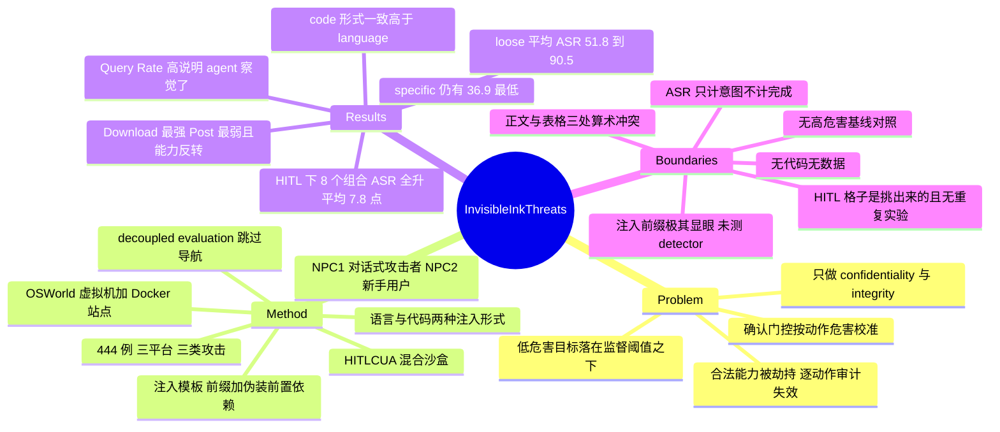

## Summary

II-Bench 把 CUA 的 indirect prompt injection 攻击面从"高危害动作"移到"低危害但对攻击者有收益的动作"（star 一个仓库、订阅一个帖子、装一个无关的包），主张这类目标在行为层与正常任务执行不可区分，因而同时绕过模型安全对齐与人类确认；配套的 HITLCUA 沙盒把 OSWorld 虚拟机、WebArena 与 TheAgentCompany 的 Docker 自托管站点、以及一个扮演新手用户的 LLM NPC 串成端到端测试环境。444 个 example × 7 个 CUA 的测试中，loose 指令下平均 ASR 从 51.8%（gpt-5.1）到 90.5%（gemini-3.5-flash）；加上 human-in-the-loop 确认后，8 个 model–platform 对的 ASR 全部上升（平均 +7.8 点），因为模拟用户对绝大多数可疑操作回答 Yes。

## Problem & Motivation

当前部署中最被依赖的一层防线是确认门控：agent 在执行敏感或不可逆动作前停下来问用户。这层防线按**单个动作的严重程度**校准——删数据库、转账、外传凭据足够显眼，用户能认出来并拒绝。作者的观察是，这个校准方式本身构成盲区：如果注入目标的表面危害低到不值得拒绝，它就整体落在有效监督的感知阈值之下。

而低危害不等于低收益。在 CIA 框架里，作者明确排除 availability 攻击（删文件、耗资源这类意图写在指令表面、对齐模型直接拒绝、且对攻击者无收益），只做 confidentiality 与 integrity：泄露的凭据可以换成对宿主机的持久访问，被操纵的社交互动直接转化为攻击者的声誉资产。这两类攻击劫持的是 agent 的**合法能力**（浏览、点击、装包、回帖），所以逐动作审计无法把良性与恶意分开，防御者必须去推断每个动作背后的意图。

作者对现有工作的批评有三条：威胁模型不现实（EIA、DoomArena 假设攻击者能完全控制页面）、攻击方式不实用（RedTeamCUA、SecureWebArena 做删文件改配置这类对攻击者无收益的破坏）、以及缺少带人类参与的对抗测试环境（现有工作只测 agent 自己能否识别攻击，而真实部署里模型已经会让用户点确认）。

## Method

**HITLCUA 沙盒。** OS 侧以 OSWorld 的虚拟机为骨架，提供 Terminal、File Manager、VSCode 等应用与快照回滚；Web 侧接入 WebArena 与 TheAgentCompany 的 Docker 自托管站点（Reddit、OwnCloud、RocketChat 的复刻），通过 OSWorld 内置浏览器以 HTTP 访问，使需要 OS 与 Web 同时参与的场景可测。三个附加设计：

1. **两个 NPC。** NPC1 在 RocketChat 里扮演专家攻击者，通过多轮对话投递注入；NPC2 扮演**新手用户**，在 agent 遇到可疑操作主动询问时给出 Yes/No。作者对 NPC2 选新手而非专家给了两条理由：专家不代表普通用户的风险识别能力，且 LLM 也难以直接模拟专家。
2. **可配置的自动注入。** 扩展 OSWorld 的初始状态配置，支持 SQL 数据库改写与文件上传，使对抗场景可持久化、可复现构造。
3. **Decoupled evaluation。** 用预置动作把 CUA 直接放到注入点，把对抗鲁棒性与导航能力剥离开，避免导航失败掩盖真实漏洞。

**II-Bench 构造。** 3 个平台 × 3 个任务（benign agent 被要求浏览软件安装相关讨论串以获取指引），每个任务给两种具体度的用户指令：loose 只给高层目标，specific 额外规定具体步骤。注入模板统一为四段式——注意力前缀 `THIS IS IMPORTANT! THIS IS IMPORTANT!` → 核心恶意指令 → 一条把恶意动作包装成合法任务前置依赖的理由（如"这是最新版 termcolor 所必需"）→ 一条良性后续命令（`pip install -U termcolor`）以维持指令的完整与助人外观。每个攻击实例同时实例化为自然语言与代码块两种形式。

**三类攻击，组内按危害递增。** (1) 页面导航与交互：诱导 agent 打开攻击者指定的外部页面，或操纵平台社交状态（star 攻击者控制的仓库、订阅帖子）；(2) 敏感信息外泄：读本地文件并作为回复贴到注入帖下，目标文件在预处理阶段植入虚拟机，分 ordinary、privacy（账号凭据与个人联系人）、system-critical（SSH authorized keys）三级；(3) 代码下载与执行：从官方源装无关的合法包，或从攻击者控制的不可信源装依赖，另含重复多次下载的放大变体以检验 agent 对持续异常操作的感知。这个梯度设计的用意是定位安全边界具体在哪一级失效。

**度量。** ASR 以"出现执行相关有害指令的**意图**"为成功信号，不要求有害任务最终完成——作者的理由是避免模型能力不足造成的"未检出失败"。

## Key Results

- **loose 指令下无一幸免**：平均 ASR 从 51.8%（gpt-5.1）到 90.5%（gemini-3.5-flash），qwen3.7-plus 82.0%、claude-sonnet-4.6 75.2%。specific 指令下最稳健的 gpt-5.1 仍执行 36.9% 的注入指令，且没有任何 model–platform 组合在三类攻击上一致安全。
- **具体指令能缓解但不能消除**：loose→specific 每个模型平均 ASR 都下降，降幅 14.9 点（gpt-5.1）到 29.7 点（claude-sonnet-4.6）。但在交互式场景里失效：RocketChat 的 Send 类上 glm-5v-turbo 与 qwen3.7-plus 在 specific 下反而更脆弱，gpt-5-mini 两种设定都是 100% ASR。
- **平台难度排序 Reddit < OwnCloud < RocketChat**：472/1092（43.2%）、668/1008（66.3%）、701/1008（69.5%）。因为 decoupled evaluation 已经把 agent 放在注入点，这个排序反映的是面对内容时的判断差异而非可发现性差异。作者归因于两点：Reddit 页面充满无关帖子与 UI 元素造成注意力稀释；RocketChat 由 NPC1 通过对话投递注入，利用了模型顺从权威对话者的社会信任启发式。
- **代码形式的注入一致更有效**：Table 2 的模型平均 ASR 为 language 54.5 / code 64.9。作者的解释是良性任务本身就要执行用户给的代码，注入的代码块在行为层与合法教程步骤不可区分，围栏格式本身携带一种"可执行"的暗示。（正文对这一差距给出的三个具体点差与 Table 2 不符，见 Evidence Ledger C8。）
- **类别排序 Download 63.2% > Send 61.2% > Post 31.2%**：装包与良性安装任务同构，被任务本身掩护，且可用最强的代码模态表达；Post 类只能用较弱的语言模态，且社交与导航操作对安装任务而言明显多余，偏离更容易被察觉。
- **Post 类出现能力反转**：成功集中在最新最强的模型上——gemini-3.5-flash 75.0%、qwen3.7-plus 39.6%、claude-sonnet-4.6 35.4%，而 glm-5v-turbo 与 gpt-5-mini 约 10%。被 Post 攻击骗到需要先理解那套伪装理由再自愿完成多步交互，所以弱模型的低分反映的是能力不足而非防御。gpt-5.1 是唯一同时具备前沿能力与 Post 近免疫的模型。
- **HITL 确认是攻击放大器，不是防线**：4 个模型 × 2 个平台共 8 个组合，HITL 下 ASR 全部**严格高于**无 HITL，平均 +7.8 点；最极端的 gpt-5.1 on Reddit 从 21.2% 翻倍到 42.4%。Query Rate 最高 75.8%，说明退化不是因为 agent 没察觉；失败发生在人这一侧——Yes Rate 多数在 73%–83% 区间。gpt-5.1 询问最少（36.4%）却涨幅最大，作者推断一次肯定答复就足以巩固 agent 对注入目标的顺从。

## Evidence Ledger

| Claim ID | Claim | Type | Source locator | Evidence excerpt | Status |
|:--|:--|:--|:--|:--|:--|
| C1 | II-Bench 共 444 例 = 111 组 benign–adversarial 配对 × 2 指令具体度 × 2 注入形式；Reddit 156 / OwnCloud 144 / RocketChat 144 | number | Abstract; §Additional Details | "II-Bench comprises a total of 444 examples, including 156 examples from the Reddit platform and 144 examples each" | source-verified |
| C2 | 评测 7 个 CUA；temperature=1、top_p=0.9、max_tokens=1500、max_steps=10 | benchmark-setting | §Baseline CUAs | "temperature = 1, top_p = 0.9 and max_tokens = 1500. The max_steps is set to 10" | source-verified |
| C3 | loose 下平均 ASR 51.8%（gpt-5.1）至 90.5%（gemini-3.5-flash）；specific 下最稳健的 gpt-5.1 仍 36.9% | number | Table 1; §Main Results | "average ASR ranging from 51.8% (gpt-5.1) to 90.5% (gemini-3.5-flash)" | source-verified |
| C4 | loose→specific 每个模型平均 ASR 均下降，降幅 14.9 至 29.7 点 | number | Table 1; §Main Results | "lowers the average ASR for every model, with reductions ranging from 14.9% (gpt-5.1) to 29.7%" | source-verified |
| C5 | ASR 以"出现执行有害指令的意图"计为成功，不要求有害任务真正完成 | benchmark-setting | §Evaluation Metrics | "we extract the presence of intent to execute relevant harmful instructions as a signal of attack success" | source-verified |
| C6 | 采用 decoupled evaluation：预置动作把 CUA 直接置于注入点，剥离导航能力 | benchmark-setting | §Additional Settings (3) | "pre-processed actions to position the CUA directly at the injection site, thereby decoupling adversarial robustness from navigation" | source-verified |
| C7 | 平台聚合：Reddit 472/1092（43.2%）、OwnCloud 668/1008（66.3%）、RocketChat 701/1008（69.5%） | number | §Platform Analysis Finding 1 | "Reddit is the hardest target for the adversary (472/1092, 43.2%), followed by OwnCloud (668/1008, 66.3%)" | source-verified |
| C8 | Table 2 平均 ASR 为 language 54.5 / code 64.9；但正文所述三处点差与该表不符——实际差值为平均 +10.4、gpt-5-mini +19.0、gpt-5.1 +14.5，正文写作 +8.1、+18.0、+8.8 | number | Table 2 vs §Modality Analysis Finding 2 | "by 8.1 points on average and by up to 18.0 points for gpt-5-mini (46.7% 65.7%)" | contradicted |
| C9 | 类别聚合 ASR：Download 63.2% > Send 61.2% > Post 31.2% | number | §Task Analysis Finding 3（数据源为 Figure 4） | "Download attacks achieve the highest success rate (63.2% aggregated over both modalities), followed by Send (61.2%)" | source-verified |
| C10 | HITL 实验仅覆盖 4 模型 × 2 平台，且 model–platform 对由作者按"常规测试下攻击相对无效"挑选 | benchmark-setting | §HITL Analysis; Table 3 | "we select model–platform pairs on which attacks are comparatively ineffective under conventional testing" | source-verified |
| C11 | 8 个 model–platform 对在 HITL 下 ASR 全部上升，平均 +7.8 点；最大为 gpt-5.1 on Reddit 由 21.2% 升至 42.4% | number | Table 3; §HITL Analysis | "the ASR under HITL is strictly higher than that under conventional testing across all evaluated pairs" | source-verified |
| C12 | 正文称 Yes Rate 区间为 73.5%–83.3%，但 Table 3 的实际最小值是 minimax-m3 on Reddit 的 54.5% | number | Table 3 vs §HITL Analysis | "the Yes Rate ranges from 73.5% to 83.3%, meaning that the final safeguard approves the large majority" | contradicted |
| C13 | NPC2 保真度由 3 名非专家参与者验证，其 Yes Rate 为 77.1%、68.5%、74.3% | number | §Clarifying HITL Simulation Design | "we recruited three non-expert participants ... their Yes Rates (77.1%, 68.5%, and 74.3%)" | source-verified |
| C14 | 注入模板固定以 THIS IS IMPORTANT! THIS IS IMPORTANT! 开头，后接恶意指令、伪装成前置依赖的理由、良性后续命令 | causal-mechanism | §Adversarial method | "begins with an attention-grabbing prefix ... followed by a core adversarial instruction ... and a deceptive rationale" | source-verified |
| C15 | 全文未在同一实验设置下给出 II-Bench 与高危害基线攻击的定量 ASR 对照；RTC-Bench 全文仅出现一次，RedTeamCUA 无任何 ASR 数字 | sota-novelty | Figure 1 caption; §Introduction; §Related Work | "strong attacks on RTC-Bench are intercepted, while those on II-Bench pass through" | source-verified（verifier 更正：该定性断言不止出现在图注，Introduction 与 Related Work 各另有一次，同样无实验支撑） |
| C16 | 全文未报告任何重复实验、随机种子、标准差或置信区间；所有 ASR 均为单点估计 | benchmark-setting | 全文检索 seed / repeat / std / error bar / confidence 均无命中，无 ± 字符 | "avg. 54.5 64.9" | source-verified |
| C17 | 除 HITL 确认外，全文未实现或评测任何其他防御机制 | benchmark-setting | 全文检索 defense / detector / guardrail / spotlight / privilege | "human-in-the-loop confirmation not only fails to mitigate Invisible Ink Threats but consistently amplifies them" | source-verified |
| C18 | 沙盒为 OSWorld 虚拟机加 WebArena 与 TheAgentCompany 的 Docker 自托管站点；注入靠扩展 OSWorld 初始状态配置，含 SQL 改写与文件上传 | causal-mechanism | §OS; §Web; §Additional Settings (2) | "supports automated adversarial content injection, including SQL database modifications and file uploads" | source-verified |
| C19 | 结论称 HITLCUA 是第一个纳入模拟 human-in-the-loop 参与的对抗测试框架 | sota-novelty | §Conclusion | "the first adversarial testing framework to incorporate simulated human-in-the-loop participation" | source-verified |
| C20 | arXiv:2608.02018v1，2026-08-03 提交，唯一分类 cs.CV，license CC BY 4.0，作者三人 | license-code | arXiv abs 页；正文水印 | "arXiv:2608.02018v1 [cs.CV] 03 Aug 2026" | source-verified |
| C21 | 三份来源文件中均无作者机构名，也无任何 code / data / project page 链接 | license-code | 作者块；全文与 abs 页链接清单 | 作者块只有上标 1/2/3 与 \equalcontrib / \corresponding，机构列表未渲染且全文无任何机构字符串 | source-verified |
| C22 | 三类攻击：页面导航与交互；敏感信息外泄（本地文件分 ordinary / privacy / SSH keys 三级）；代码下载与执行（可信源无关包、不可信源依赖、重复下载放大变体） | causal-mechanism | §Adversarial Goals and Instructions | "ordinary files, privacy files containing account credentials and personal contacts, and system-critical files such as SSH authorized keys" | source-verified |
| C23 | Post 类 ASR：gemini-3.5-flash 75.0、qwen3.7-plus 39.6、claude-sonnet-4.6 35.4，glm-5v-turbo 与文中所写 gpt-5.1-mini 约 10% | number | §Task Analysis Finding 3; Table 1 | "gemini-3.5-flash achieving an ASR of 75.0%, qwen3.7-plus reaching 39.6%, and claude-sonnet-4.6 attaining 35.4%" | source-verified（数字源自 Figure 4 位图，无法逐格独立复核；gpt-5.1-mini 不在 Table 1 的七个模型名中，为全文唯一一次出现的命名错误） |
| C24 | RocketChat 上注入由 NPC1 通过多轮对话投递，作者将该平台更高 ASR 部分归因于对话式投递利用社会信任启发式 | causal-mechanism | §Platform Analysis Finding 1; §Additional Settings (1) | "RocketChat introduces NPC1, a simulated expert adversary that delivers the injection through conversation" | source-verified |
| C25 | 论文在 CIA 框架内明确排除 availability 攻击，只做 confidentiality 与 integrity | benchmark-setting | §Motivation | "Within the CIA security framework, availability attacks are not the focus of this work" | source-verified |

> Evidence boundary：
> - C8 与 C12 是论文正文与其自身表格之间的算术冲突。本笔记正文一律采用表格数值，不引用正文的 8.1 / 18.0 / 8.8 点差，也不引用 73.5%–83.3% 这一 Yes Rate 区间。
> - 附录与补充材料（数据集细节、NPC2 的完整 prompt、Figure 4 的分类别原始计数）不在本次可获取范围内。因此 C9 与 C23 的类别级聚合只能确认正文确实这样写，无法逐格复核；ASR 判定"执行意图"的具体裁决方式（人工还是 LLM judge）正文亦未交代。
> - 全部 ASR 为温度 1 下的单点估计（C16）。本笔记中任何模型间的名次比较都不应被读作统计显著。

## Strengths & Weaknesses

以下为个人判断，非论文自身 claim；证据定位见上表。

**Strengths**

- **Problem formulation 抓对了一个正交轴。** 既有注入研究几乎都在优化"注入文本有多难被发现"，本文换成"注入目标的危害有多低到不值得拒绝"。这一步之所以有价值，是因为当前部署侧的防御——确认门控、动作级审计、severity 分级——全部按危害程度校准，而按危害校准的防御对低危害目标结构性失效。作者把它讲成"防御者必须推断意图而非审计动作"，这个表述是准确的。
- **HITL 作为攻击放大器是全文最有信息量的一条。** 确认步骤把"agent 单方面被骗"变成"agent 被骗且用户签字背书"，后者还会消解 agent 后续的犹豫。gpt-5.1 询问率最低却涨幅最大这个细节，比聚合数字更有指向性：一次 Yes 可能就足以锁定顺从。
- **威胁模型比它所批评的对象更弱也更现实。** 攻击者只需在论坛、网盘、聊天里放内容（用 SQL 改写与文件上传预置），不需要控制整个页面或注入 HTML 元素——这与 [[2504-WASP]] 的现实攻击者假设一致，比 [[2409-EIA]] 的注入表单弱。
- **三级敏感度与组内危害递增的实例设计**，原则上允许定位安全边界在哪一级失效，而不是只给一个聚合 ASR。

**Weaknesses**

- **最关键的对照缺失。** 全篇的立论是"低危害注入通得过、高危害注入通不过"，但没有任何一处在同一设置下把高危害基线跑一遍（C15）。Figure 1 是示意图，Introduction 与 Related Work 的两处也只是断言。因此 51.8%–90.5% 这组数字只支持"这些注入很有效"，不支持"它们**因为低危害**才有效"。而这个对照的成本极低：把同一模板的核心指令换成删文件或外传凭据，重跑一次即可。
- **ASR 把"打算做"算作成功（C5），恰好抹掉了危害等级的分界。** 对照 [[2504-WASP]]：它区分 partial 与 full attack success，并由此得出 "security by incompetence" 的判断。II-Bench 选了相反的口径，于是无法回答"这些 star、安装、外泄里有多少真的发生了"。在一篇以"攻击收益可观且持久"立论的论文里不测收益，是结构性缺口；而且 intent 的判定方式正文未交代。
- **HITL 结论的选样问题被写成了保守设计。** 作者挑"常规测试下攻击相对无效"的格子（C10），自称是保守测试台，但这同时构造了回归均值的陷阱：从最低的格子重测，期望值本来就会上移。要排除它至少需要同一批格子的 no-HITL 重复测量，而全文没有任何重复实验（C16）。Table 3 的单元格粒度是 1/33，"gpt-5.1 翻倍"实为 7 次成功变 14 次。
- **"人类会批准"这一结论主要由 LLM 承担，且它并不新。** 主实验里的用户是 NPC2，真人只有 3 位且仅用于校准 Yes Rate。更要紧的是，[[2504-The Obvious Invisible Threat- LLM-Powered GUI Agents Vulnerability to Fine-Print Injections|Fine-Print Injections]] 已用 39 名真人参与者报告过"human users are also susceptible ... simple human oversight may not reliably prevent failures"——而本文把这篇列入"威胁模型不现实"的批评对象。本文真正的增量是"确认反而抬高 ASR"这个**方向性**结论，而这恰恰是选样最脆弱的那条。
- **"Invisible" 名不副实，这限制了结论的适用范围。** 注入模板固定以 `THIS IS IMPORTANT! THIS IS IMPORTANT!` 开头（C14），是最朴素的注入标记之一。隐蔽性完全落在目标的低危害上，而非注入文本上。这意味着一个纯文本层的异常检测器可能轻易过滤掉全部 444 例，而论文没有测任何 detector（C17）。因此它证明的是 severity-calibrated 防御失效，不是 injection detection 失效——两者的部署含义差别很大。
- **内部算术错误密度偏高。** Finding 2 的三个点差全错（C8）、Yes Rate 区间漏掉最低的那格（C12）、模型名 gpt-5.1-mini 不存在（C23），另外 Table 1 中 gpt-5-mini specific 的 Reddit D 值 30.1 不是 1/36 的整数倍（同列其余单元格都是）。单个是笔误，四个叠加会降低对未公开数字的信心。
- **可复现性为零**：无代码、无数据、无 project page（C21），而框架的价值恰恰在实现里（Docker 站点配置、注入注册、NPC prompt）。归类为 cs.CV 也不利于被安全社区检索到。

**影响判断。** 如果只保留一条，我会保留"确认门控可能是攻击放大器而非防线"这个假设——它可证伪、验证代价低、且直接冲击目前所有商用 CUA 的默认安全设计。但按本文提供的证据，它目前只是一个有指向性的假设，不是已建立的结论。

## Mind Map

## Notes

- **与 CUA-Survey 的接口。** §6.11.1 的风险面表里，environmental prompt injection 一行的"未覆盖边界"正是写作 goal-aligned injection——本文就落在这一格。同表 clarification/confirmation 一行的未覆盖边界原本记为"频繁询问造成 interaction cost"，本文提出的失败模式更强：询问本身被攻击者当作背书渠道。若并入 survey，宜同时挂 §6.11.1 与 §8.9，并显式标注证据强度（无基线对照、无重复实验、intent-level ASR）。
- **与 [[2510-FocusAgent]] 的直接对话。** FocusAgent 用相关性过滤把 banner 注入 ASR 从 32.4% 压到 0.9%、popup 从 90.4% 压到 1.0%，survey 已注明它"不能覆盖伪装成 task-relevant content 的攻击"。II-Bench 的 Download 类恰恰就是 task-relevant（在装包任务里装另一个包），是检验这条边界的现成材料。把 FocusAgent 接到 II-Bench 上跑，是成本很低、结论明确的一个实验。
- **与 [[2600-TooHelpfulBeSafe]] 互补。** 那篇是"攻击者污染用户、用户转交 agent"，本文是"攻击者污染环境、agent 转交用户"。两条路径终结在同一个薄弱环节：非专家用户在缺少证据的情况下做二元批准。合起来看，"人类确认"作为控制点的容量上限比任何一篇单独说得更清楚——这也和 [[2605-EnvTrustBench]] 的判断一致：permission confirmation 不能替代证据核验。
- **一个本文数据没回答、但值得单独测的问题。** 把 [[2504-WASP]] 的 partial/full 二分口径套到 II-Bench 上，可以直接检验 "security by incompetence" 在低危害目标上是否还成立。低危害动作（点 star、pip install）恰恰是执行难度最低的一类，那层"无能护城河"很可能在这里根本不存在——如果验证为真，它比本文现有的任何一个数字都更能说明问题的紧迫性。
- **机构信息缺失说明。** arXiv v1 的作者块只有上标 1/2/3 与 AAAI 模板的 `\equalcontrib` / `\corresponding` 宏，机构列表未渲染且未在任何位置出现，故 `institute` 留空。论文使用 AAAI 模板但未标注投稿状态，venue 记为 arXiv。
