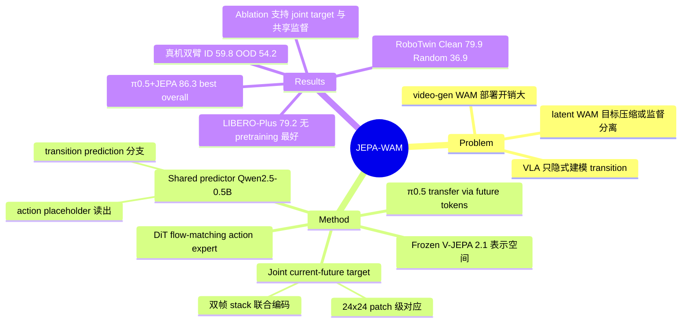

## Summary

JEPA-WAM 是一个建在 frozen V-JEPA 2.1 表示空间里的 latent world action model：用一个 shared predictor（Qwen2.5-0.5B）同时做 latent transition prediction 和 flow-matching action generation，预测目标是把当前帧与未来帧沿时间维 stack 后联合编码得到的 joint current–future target（保留 24×24 patch 级结构）。仅 0.5B backbone、无 robot-policy pretraining 的情况下在 LIBERO-Plus 达到 79.2%（该组别最好结果）；同一 transition supervision 作为辅助 loss 加到 pretrained π0.5 上，把 LIBERO-Plus 从 84.5% 提到 86.3%（论文称 best overall）。

## Problem & Motivation

VLA 的 action prediction 目标只隐式建模 state transition，分布偏移下鲁棒性受限；video-generation 类 WAM 显式生成未来帧但部署开销大。已有 latent WAM 回避了显式生成，但存在两个问题：(1) 预测目标要么复用视频生成器的中间特征（为逐帧生成而非表示状态变化优化），要么把未来压缩成少量 global latent tokens / subgoals（丢失细粒度空间结构）；(2) 与 policy 的整合方式要么把预测的未来表示直接喂给 action module（引入冗余信息），要么用独立的 prediction 分支（对 action 所依赖的表示影响弱）。JEPA-WAM 针对这两点分别给出设计：结构化的 transition target + 直接塑造 action backbone 的共享监督。

## Method

**Joint current–future target（预测什么）**：训练时把每个视角的当前观测 O_t 与 δ 步后的 O_{t+δ} 沿时间维 stack，由 frozen V-JEPA 2.1 encoder（300M ViT-L/16，384×384 输入）联合编码并 stop-gradient 得到目标 Y_{t,t+δ}。V-JEPA 的 video tokenizer 每两帧合成一个 temporal tubelet，因此双帧输入产出与单帧相同的 24×24 patch grid，目标与当前表示 Z_t 保持逐 patch 对应。与 future-only 目标不同，joint target 让 encoder 同时看到两个时间端点，编码"哪些区域稳定/变化、局部物体与空间关系如何演化"这种 task-shared 的时序结构，而非重建某个唯一的未来帧。δ 是 benchmark-specific 超参（LIBERO 31、RoboTwin 50）。

**Shared predictor（怎么用于 action）**：Qwen2.5-0.5B 同时接收 projected 视觉 token、任务指令和 64 个 action placeholder token，一次 forward 输出 (1) 视觉 token 位置的 hidden states Q_wm，经 token-wise MLP（896→2048→1024）映射回 V-JEPA 空间预测 Y_{t,t+δ}，loss 为 patch-wise cosine distance；(2) placeholder 位置的 C_t，条件化 16 层 DiT-L flow-matching action expert（velocity prediction；RoboTwin 用 x-prediction 更稳）。联合 loss L = L_act + 0.5·L_wm。训练时 V-JEPA、projector、Qwen base 均 frozen，只训 LoRA（rank 32）+ prediction head + action expert；projector 与 Qwen 事先在 LLaVA v1.5 上做过两个 epoch 的 vision–language 对齐。部署时移除 target branch 和 prediction head，零推理开销。

**Transfer 到 pretrained VLA（π0.5）**：在 VLM prefix 后附加 64 个 learnable future tokens（8×8 grid），其 hidden states 经 projection + bilinear upsample 到 24×24，与 frozen V-JEPA ViT-G joint target 做 patch-wise 对齐（λ_wm=0.1，前 1K steps warmup）。关键约束：action tokens 被 mask、不能 attend 到 future tokens，因此原 perception/action 通路完全不变，监督只通过 backbone 共享参数起作用。

## Key Results

| Benchmark | JEPA-WAM (0.5B, 无 pretraining) | π0.5+JEPA (vs π0.5) |
|:--|:--|:--|
| LIBERO (ID, 4 suites 联合训练) | 96.7% | 97.8% (vs 96.9%) |
| LIBERO-Plus (zero-shot, 无 OOD fine-tune) | **79.2%**（无 pretraining 组最好） | **86.3%** (vs 84.5%，best overall) |
| RoboTwin 2.0 Clean / Random（20 任务，仅 Clean 训练） | 79.9% / 36.9% | 84.6% / 37.5% (vs 75.4% / 37.2%) |
| 真机 AgileX Cobot Magic 双臂 5 任务 ID / OOD | 59.8% / 54.2%（π0 为 51.8% / 22.5%） | 90.3% / 84.7% (vs 77.5% / 72.5%) |

**Design analysis（Table 4，LIBERO-Plus）**：V-JEPA 表示本身就贡献 OOD 鲁棒性（无 transition prediction 时 77.0 vs DINOv2+SigLIP 73.2）；joint target 优于 future-only（79.2 vs 77.3）；破坏 patch 对应的 iREPA-style 卷积变换掉到 74.7；监督中间层（Lower-16）76.5；去掉 action placeholder、用全部 hidden states 条件化 action expert 掉到 73.1——支持"transition 监督塑造共享 backbone、action 走专用 readout"的设计。推理 85 ms/次（11.76 Hz，RoboTwin），快于 ABot-M0（125 ms）。

## Evidence Ledger

| Claim ID | Claim | Type | Source locator | Evidence excerpt | Status |
|:--|:--|:--|:--|:--|:--|
| C1 | LIBERO-Plus 79.2%，无 large-scale robot-policy pretraining 组别最好结果 | number + sota-novelty | Abstract; Sec 4.2; Table 2 | "JEPA-WAM achieves 79.2%, the best result without large-scale robot-policy pretraining" | source-verified |
| C2 | π0.5+JEPA 把 LIBERO-Plus 从 84.5% 提到 86.3%，best overall | number + sota-novelty | Abstract; Sec 4.2; Table 2 | "improves the pretrained π0.5 from 84.5% to 86.3%, achieving the best overall result" | source-verified |
| C3 | LIBERO 平均 96.7%；π0.5+JEPA 97.8%（基线 96.9%） | number | Sec 4.2; Table 1 | "average success rate of 96.7%… improves… from 96.9% to 97.8%" | source-verified |
| C4 | RoboTwin 2.0 仅 Clean 训练：Clean 79.9% / Random 36.9%；π0.5+JEPA 84.6% / 37.5%（vs 75.4% / 37.2%） | number + benchmark-setting | Sec 4.2; Table 3; B.2 | "79.9% on Clean and 36.9% on Random… from 75.4% to 84.6%… (37.5% vs. 37.2%)" | source-verified |
| C5 | 真机 5 任务：JEPA-WAM 59.8/54.2 vs π0 51.8/22.5；π0.5+JEPA 90.3/84.7 vs 77.5/72.5 | number | Sec 4.4; Figure 5; Table 15 | "59.8% under ID and 54.2% under OOD… 51.8% and 22.5% for π0… 77.5% to 90.3%" | source-verified |
| C6 | LIBERO-Plus 为 zero-shot 评测：四 suite 联合训练后不做 OOD fine-tuning 直接评测 | benchmark-setting | Sec 4.1; B.1 | "directly evaluate the same policy on LIBERO-Plus without OOD fine-tuning" | source-verified |
| C7 | Ablation：joint 79.2 / future-only 77.3 / V-JEPA-only 77.0 / DINOv2+SigLIP 73.2 / iREPA 74.7 / Lower-16 76.5 / Full-hidden 73.1 | comparison + number | Sec 4.3; Table 4 | Table 4: "73.2 / 77.0 / 77.3 / 74.7 / 76.5 / 73.1 / 79.2" | source-verified |
| C8 | V-JEPA 2.1（300M）全程 frozen；双帧 stack 联合编码（tubelet=2 保持 24×24 grid）；patch-wise cosine loss，λ_wm=0.5；部署移除 target branch | causal-mechanism | Sec 3.1–3.3; A.1; A.3; A.5 | "tubelet size of two… retains the same 24×24 spatial grid"; "λ_wm=0.5"; "target branch and prediction head are removed" | source-verified |
| C9 | π0.5 transfer：64 future tokens（8×8, d=2048）upsample 到 24×24 对齐 ViT-G target；action tokens 不能 attend future tokens；λ_wm=0.1 | causal-mechanism + benchmark-setting | Sec 3.4; A.4 | "append 64 learnable future tokens… action tokens are prevented from attending… warmed up… to λ_wm=0.1" | source-verified |
| C10 | 推理 85 ms（11.76 Hz），快于 ABot-M0 125 ms（7.99 Hz） | number + comparison | Sec 4.2; C.3 Table 12 | "85 ms per inference (11.76 Hz)… faster than ABot-M0 (125 ms, 7.99 Hz)" | source-verified |
| C11 | 项目页链接 GitHub repo，code 标注 "Coming soon"（尚未发布） | license-code | Abstract 链接; 项目页 | 项目页含 "github.com/SpriteWithoutIce/JEPA_WAM" 且标注 "Coming soon" | source-verified |

## Strengths & Weaknesses

**亮点**
- **简洁且部署免费**：核心 idea 只是"把两帧一起喂给 frozen V-JEPA 当预测目标"（利用 tubelet=2 的巧合使输出 grid 不变），训练时一个辅助 cosine loss，推理时完全移除——对 JEPA-WAM 和 π0.5 transfer 都不增加任何推理开销。0.5B backbone 在 LIBERO-Plus 上超过 2B 的 ResVLA/RoVLA，符合 simple & scalable 的品味。
- **Design analysis 组织得好**：围绕"用什么表示 / 预测什么目标 / 如何与 action 交互"三个问题各做受控对照（Table 4），每个设计选择都有 2–6 个点的可归因差异；其中 Full-hidden 掉 6.1 个点的结果对"预测的未来表示不应直接喂 action module"给出了直接证据。
- **π0.5 transfer 的隔离设计**：action tokens 被 mask 不能 attend future tokens，保证增益只能来自 backbone 参数被 transition 监督塑造，而非额外条件信息——这是干净的机制归因，也解释了它为何可以嫁接到任意 pretrained VLA。

**局限与边界**
- **分类别看，增益集中在 Camera，Language 鲁棒性明显差**：Table 2 中 JEPA-WAM 的 Camera 扰动 79.2（基线约 50–58）是平均分领先的主要来源，但 Language 扰动只有 68.2，显著低于 ResVLA（88.5）和 RoVLA（92.9）——与其 0.5B 小 LM 和 language-agnostic 的 transition target 一致。平均分掩盖了这个 tradeoff（推测，论文未讨论此列）。
- **Random 域随机化下辅助监督几乎不起作用**：π0.5+JEPA 在 RoboTwin Clean 上 +9.2 个点，但 Random 只从 37.2 到 37.5——transition 监督对强 appearance randomization 的帮助与其对 camera shift 的帮助不同源，边界值得注意。
- **目标与语言无关是承认的结构性局限**：同一观测在不同指令下应有不同 transition 时，task-shared 目标表达力不足（作者在 Limitations 中明确提出，指向 language-conditioned target 的后续工作）。
- **可复现性暂不可查**：code "Coming soon"；HTML 中 affiliation 未渲染、脚注是 "XYZ Embodied AI" 占位符（疑似匿名化残留），机构与算力背景不明。基线多为 2026 年同期工作（Fast-WAM、ResVLA、Being-H0.7 等），各自训练设置的可比性未在文中核对。
- 真机每任务仅 10 rollouts、用 normalized completion score，样本量小；δ（31/50）为逐 benchmark 手调超参，敏感性未报告。

## Mind Map

## Notes

- 与 vault 中 latent WAM 线的关系：本文把 [[2506-VJEPA2]] 的表示空间从"提供输入特征"（JEPA-VLA 路线）或"独立 world model 监督"（VLA-JEPA 路线）推进为"目标空间 + 共享 backbone 监督"，与 Fast-WAM（复用视频生成器特征，LIBERO 97.6）形成直接对照——两条路线在 ID 上打平，分化出现在 LIBERO-Plus 的 OOD 上。
- 值得追踪的开放问题：joint target 的 language-conditioning（作者自己指出）；Language 扰动列的短板是否随 LM 规模消失；transition 监督在强 domain randomization（RoboTwin Random）下失效的机制。
- Affiliation 待 v2 或正式版补充；code 发布后可考虑 repo-digest 核对 δ 敏感性与 LoRA 配置。
