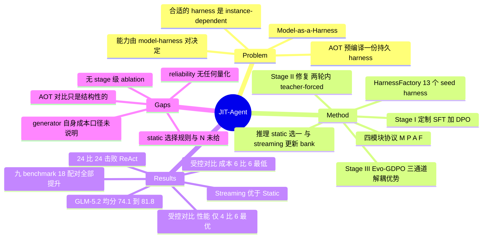

## Summary

JIT-Agent 把 agent harness 从"人写的持久工件"改成"按任务现场生成的产物"：先用 $(\mathbf{M},\mathbf{P},\mathbf{A},\mathbf{F})$ 四模块协议把 harness 约束成可执行程序空间、用 13 个手写 harness 作 seed bank，再以 Qwen3.6-27B 为底座三阶段训练一个 harness 生成器（SFT+DPO 学 task-conditioned 定制、teacher-forced 学两轮内修复、Evo-GDPO 学超越 archive frontier）。九个 benchmark 上替换默认 scaffold 后 18 个 backbone–benchmark 配对全部提升（GLM-5.2 均分 74.1→81.8，DeepSeek-V4-Flash 66.7→75.5），固定 backbone 的受控对比里 token 与成本在全部 6 个设置中最低（相对最便宜的固定 harness 平均降 36.0%），但性能只在 6 个设置中的 4 个居首。全文没有任何 stage 级 ablation，也没报生成 harness 的协议合法率与修复成功率——被写进"harness intelligence"定义的三条性质里，reliability 是唯一完全没有量化证据的一条。

## Problem & Motivation

论文的出发点是一句已经被这个文献族反复确认的观察：agent 能力由 model–harness 对决定，而非模型权重单独决定。它真正想推翻的是既有 harness 优化的**时机假设**——现有方法（论文归为 Ahead-of-Time，AOT）把 harness 当作一份要在经验流上优化出来的耐久工件，指望它泛化到未来的任务、领域与模型版本。作者的反例是任务先验本身就不同：wide-search 任务受益于并行证据探索，terminal 任务偏好精简的串行 ReAct 循环，deep-research 任务需要对检索证据的工作记忆，NL2Repo 类编码任务天然由文件系统中介。结论是"合适的 harness 不只 domain-dependent，而是 instance-dependent"，因此 AOT 是在见到问题结构之前就预编译 scaffold。

由此提出 **Model-as-a-Harness**：训练一个 meta-agent，在拿到任务时现场生成一份 harness，再由任意 off-the-shelf agentic LLM 在该 harness 下执行。作者把这件事要求的能力定义为 harness intelligence 的三条性质：**adaptivity**（harness 匹配任务与 backbone）、**reliability**（产出可执行行为并在合成失败时恢复）、**evolvability**（把执行反馈转成更强的后续 harness）。这个 formulation 的价值在于它把 harness 从"配置"降格成"每个 instance 的决策变量"，并给了它一个固定类型签名，使生成问题从开放式代码生成收窄成受约束的程序合成。

需要注意的是，AOT-vs-JIT 这条主线是**结构性论证而非实验对照**：Appendix A 自己写明该对比"is structural rather than a ranking of empirical performance"，全文没有把任何一个 AOT harness 优化方法（其 Table 4 列出的 AutoHarness / Meta-Harness / AHE / Harness-R1）跑在同样的 benchmark 上。

## Method

### 1. 协议约束下的 harness 设计空间

核心假设是每个协议合规的 harness 都可分解为四元组 $\mathbf{h}=(\mathbf{M},\mathbf{P},\mathbf{A},\mathbf{F})\in\mathfrak{M}\times\mathfrak{P}\times\mathfrak{A}\times\mathfrak{F}$，分别是 memory、planning、action、capability orchestration；概念上是四元组，运行期依赖序是 $\mathbf{M}\to\mathbf{P}\to\mathbf{F}\to\mathbf{A}$。协议 $\boldsymbol{\Pi}$ 固定模块 schema 与接口、生命周期、验证规则与共享执行语义，生成空间因此有嵌套结构 $\mathcal{G}\supseteq\mathcal{H}^{\mathrm{syn}}\supseteq\mathcal{H}_{\boldsymbol{\Pi}}\supseteq\mathcal{H}^{\mathrm{exec}}_{\boldsymbol{\Pi}}$。

状态被显式劈成两半：不可变事件历史 $\boldsymbol{\xi}_{<t}$ 与可变控制器状态 $\mathbf{s}_t$。每步的四个转换是 $\mathbf{v}_t=\mathbf{M}(\boldsymbol{\xi}_{<t},\mathbf{s}_t)$（history→view）、$\mathbf{d}_t=\mathbf{P}(\boldsymbol{\tau},\mathbf{s}_t,\mathbf{v}_t)$（view→local directive）、$\mathcal{C}_t=\mathbf{F}(\mathcal{C}_\tau,\mathbf{s}_t,\mathbf{v}_t,\mathbf{d}_t)$（directive 条件下的能力激活）、$(\mathbf{s}_{t+1},e_t)=\mathbf{A}(\cdot)$（控制更新与动作发射）。没有显式 planner 的 harness 通过 null directive $\mathbf{d}_\emptyset$ 保持类型一致，因此 ReAct 这类结构不需要特例。这个类型签名是全文最要紧的工程决定：它让"生成 harness"变成填四个已知槽位的结构化输出，而不是写一段任意 agent 程序。

### 2. HarnessFactory 与 seed bank

在同一协议与共用 kernel 下重实现 13 个代表性 scaffold，构成 $K_0=13$ 的 seed bank $\mathcal{B}_0$：ReAct、Plan-and-Execute、ReSum、Flash-Searcher、GAM、MemoBrain、AggAgent、OAgent、AgentFold、HiAgent、DeepAgent、ROMA、AOrchestra。Bank 双重用途——seed 锚定 Stage-I 合成，后续状态 $\mathcal{B}_n$ 作为新设计的对照种群；每条记录关联 (harness, task, reward, latency, cost)。

### 3. 三阶段训练

生成上下文统一为 $\mathbf{c}_\tau=(\boldsymbol{\tau},\boldsymbol{\Pi},\mathcal{C}_\tau,\mathcal{E}_\tau)$，$\mathcal{E}_\tau$ 是从 bank 检索的小参考集。

| Stage | 目标性质 | 数据 | 训练 |
|:--|:--|:--|:--|
| I 定制 | adaptivity | 冻结的更强 teacher $q_\phi$ 在 $\mathcal{E}_\tau$（task-type 匹配子集中抽的 3 个 scaffold）条件下生成，只保留通过协议验证与执行检查的样本 | 先 SFT 模仿；再在同 backbone 同 seed 下比较候选做 DPO，偏好关系要求 reward 严格改善、两条效率轴都不退化、且至少一条严格改善，权重为 $\Delta_{\mathrm{val}}$ |
| II 修复 | reliability | 失败 harness $\widetilde{\mathbf{h}}^{(0)}$ 配结构化诊断 $\mathbf{g}^{(0)}$（编译错误、接口不匹配、tool-call 失败、运行时异常）；teacher 提 patch $\Delta^{(k+1)}$，只保留两轮内变为可执行的轨迹（$K^\star\le 2$） | teacher-forced 模仿成功修订，条件是完整的 harness–diagnostic 历史 |
| III 演化 | evolvability | 在线抽任务，从 $\mathcal{B}_n$ 检索先验设计，采 $G>1$ 个候选，与被检索设计在同一冻结 executor、同预算、同 seed 下评测；incumbent $(b_r,b_\ell,b_\kappa)$ 取 reward 最高的被检索 harness（先比 latency 再比 cost 破平） | Evo-GDPO |

Evo-GDPO 的关键在两处。其一是**效率通道的门控**：$R^{\mathrm{rew}}_i=r_i+\lambda_{\mathrm{evo}}[r_i-b_r]_+$，而 $R^{\mathrm{lat}}_i$ 与 $R^{\mathrm{cost}}_i$ 各乘 $\mathbb{I}[r_i\ge b_r]$——只有保住 incumbent reward 时省时省钱才计分，堵住"生成一个什么都不做的廉价 harness"这条退化路径。其二是**三通道独立归一化**：$A_i^m$ 在候选组内按各自 mean/std 归一，再以 $w_{\mathrm{rew}}>w_{\mathrm{lat}}+w_{\mathrm{cost}}$ 聚合，避免三个量纲互相压制；聚合后再跨 batch 归一，进标准 clipped PPO，对冻结的 Stage-II checkpoint 加 token 级 KL。Bank 更新保守：候选须持平或超过当前 reward frontier，且在 reward/latency/cost 中至少一维严格改善。**修复自身的开销被计入**：bounded repair 之后仍不合法的候选拿最低 reward，但其 repair latency 与 cost 仍算进被测效率。

### 4. 推理架构

- **Static**：并行生成 $N$ 个 harness，选一个执行——只增候选多样性，不增环境 rollout 数。
- **Streaming**：第 $n$ 个任务从 $\mathcal{B}_n$ 检索、生成并选定 $\mathbf{h}^\dagger_n$、执行一次，环境反馈**只**用于决定是否按 Stage-III 保留规则更新 bank；不注入当前 rollout，也不更新 $\theta$。

即：部署期的自我改进完全走 bank 这条外部通道，模型参数冻结；单任务内的自纠错只有 bounded repair 循环。

## Key Results

### Table 2：九个 benchmark（0–100，越高越好）

| Model | BC+ | DSQA | xBench | AgentIF | Pinch | Shop | Travel | Office | Odyssey |
|:--|--:|--:|--:|--:|--:|--:|--:|--:|--:|
| GLM-5.2 | 72.0 | 89.2 | 76.0 | 63.0 | 87.0 | 78.2 | 62.8 | 63.0 | 75.3 |
| DeepSeek-V4-Flash | 68.1 | 76.2 | 70.1 | 58.4 | 81.7 | 59.1 | 54.8 | 61.0 | 71.0 |
| DeepSeek-V4-Pro | 71.4 | 72.4 | 79.0 | 56.5 | 61.1 | 71.1 | 55.2 | 62.0 | 72.0 |
| GPT-5.6 | 76.9 | 76.0 | 81.0 | 68.0 | 84.2 | 83.7 | **84.9** | 65.3 | 68.7 |
| Gemini 3.5 Flash | 75.0 | 88.0 | 85.0 | 64.0 | 74.2 | 76.2 | 50.3 | 63.3 | 78.0 |
| **JIT-Agent + GLM-5.2** | **78.0** | **93.9** | **88.0** | **69.9** | **93.3** | 83.4 | 83.0 | **68.4** | **78.7** |
| **JIT-Agent + DeepSeek-V4-Flash** | 74.0 | 85.1 | 82.0 | 63.8 | 92.9 | **83.9** | 61.3 | 63.4 | 73.0 |

- 18 个 matched backbone–benchmark 配对**全部**提升；均分 GLM-5.2 74.1→81.8（+7.7），DeepSeek-V4-Flash 66.7→75.5（+8.8）。
- 最大增益在 long-horizon planning：DeepPlanning-Shopping +24.8（DSV4-Flash 59.1→83.9）、DeepPlanning-Travel +20.2（GLM-5.2 62.8→83.0）。
- 摘要口径的"超越 GPT-5.6"具体是 DSQA +9.1（85.1 vs 76.0）与 OdysseyBench +4.3（73.0 vs 68.7）。
- JIT 系统领先 9 列中的 8 列，其中 JIT+GLM-5.2 独占 7 项第一；**唯一例外是 DeepPlanning-Travel**，83.0 落后 GPT-5.6 的 84.9，差 1.9。

### Table 3：固定 backbone 的受控对比（性能 / tokens(K) / \$per case）

| Backbone | Harness | DSQA | xBench-DS | AgentIF |
|:--|:--|:--|:--|:--|
| DeepSeek-V4-Flash | Claude Code | 79.6 / 625 / \$0.088 | 75.0 / 559 / \$0.079 | **66.9** / 808 / \$0.114 |
| | NanoBot | 80.4 / 924 / \$0.131 | 78.0 / 527 / \$0.075 | 53.1 / 1034 / \$0.147 |
| | OpenCode | 75.9 / 1832 / \$0.258 | 65.0 / 1157 / \$0.159 | 48.1 / 950 / \$0.135 |
| | **JIT-Agent** | **85.1** / **400** / **\$0.066** | **82.0** / **212** / **\$0.039** | 63.8 / **476** / **\$0.097** |
| Qwen3.6-Flash | Claude Code | 72.8 / 710 / \$0.140 | 58.0 / 650 / \$0.128 | 55.4 / 900 / \$0.177 |
| | NanoBot | **74.2** / 892 / \$0.197 | 63.0 / 597 / \$0.119 | 43.5 / 950 / \$0.187 |
| | Codex | 68.5 / 980 / \$0.193 | 52.0 / 874 / \$0.172 | 34.2 / 839 / \$0.170 |
| | **JIT-Agent** | 70.3 / **464** / **\$0.095** | **70.0** / **300** / **\$0.069** | **58.3** / **394** / **\$0.078** |

性能与效率两条结论强度不同，值得分开记：**性能只在 6 个设置中的 4 个居首**（DSV4-Flash 的 AgentIF 落后 Claude Code 3.1 分，Qwen3.6-Flash 的 DSQA 落后 NanoBot 3.9 分）；**token 与成本在 6/6 全部最低**，相对最便宜的固定 harness 单案例成本降 14.9%–54.1%、平均 36.0%。最干净的一格是 DSV4-Flash 的 xBench-DS：527K→212K token、\$0.075→\$0.039，同时分数 78.0→82.0。作者据此主张增益来自 task-conditioned scaffold 而非更长的轨迹——在这三列上，这个论证是成立的。

### Figure 4：跨模型族泛化

6 个 backbone（DeepSeek V4 / Qwen3.6 / Mimo-V2.5）× 4 个 benchmark，对照是固定 ReAct harness：**24/24 全胜**，平均 +7.6，族级增益 10.2 / 4.0 / 8.6。DSQA 受益最大（平均 +15.2，Mimo-V2.5-Pro +22.2、DSV4-Flash +19.0），DeepPlanning-Shopping 达 +24.8。此处评测用的是缩减子集：DSQA 100 题，其余三个各 50 题。

### Appendix B.1：test-time 演化

Streaming JIT（评测流中持续检索并更新 bank）在 DeepPlanning-Shopping / Travel / OfficeBench 三条流上的累计准确率终点均高于 Static JIT，且 API cost 与 tool-call 轨迹"remain task-dependent and of broadly similar scale"——即终点增益没有被更大的交互预算解释掉。这是全文唯一一处"有对照的机制证据"。

## Evidence Ledger

| Claim ID | Claim | Type | Source locator | Evidence excerpt | Status |
|:--|:--|:--|:--|:--|:--|
| C1 | JIT+DSV4-Flash 在 DSQA 超 GPT-5.6 9.1 分、OdysseyBench 4.3 分 | number | Abstract / §1 / Table 2 | "surpasses GPT-5.6 by 9.1 points on DeepSearchQA and 4.3 on OdysseyBench" | source-verified |
| C2 | 18 个 matched 配对全部提升；GLM-5.2 74.1→81.8、DSV4-Flash 66.7→75.5 | number | §5.2 | "improves all 18 matched backbone–benchmark pairs: the average score rises from 74.1 to 81.8 on GLM-5.2 (+7.7)" | source-verified |
| C3 | 最大增益 +24.8 Shopping（59.1→83.9）、+20.2 Travel（62.8→83.0） | number | §5.2 | "+24.8 on DeepPlanning-Shopping for DeepSeek-V4-Flash (59.1→83.9) and +20.2 on DeepPlanning-Travel" | source-verified |
| C4 | 受控对比中性能仅 4/6 最优，token 与成本 6/6 最低，成本降 14.9%–54.1%（均值 36.0%） | comparison | §5.3 / Table 3 | "best performance in four of six settings... lowest token consumption and cost in all six settings... 36.0% on average" | source-verified |
| C5 | 底座 Qwen3.6-27B；Stage I SFT+DPO、Stage II $K^\star\le2$ teacher-forced、Stage III clipped PPO + token 级 KL | causal-mechanism | §5.1 / §4.1 Eq.4–7 | "clipped PPO objective with a token-level KL penalty to the frozen Stage-II checkpoint" | source-verified |
| C6 | 作者主张这是第一个专为 JIT harness 生成而造的模型 | sota-novelty | Abstract | "To our knowledge, JIT-Agent is the first model purpose-built for just-in-time harness generation" | source-verified（仅证明论文如此宣称） |
| C7 | HarnessFactory 在共享协议下重实现 13 个 harness，$K_0=13$ | number | §3.2 / Table 1 | "re-implements 13 representative scaffolds... seed bank ℬ0 of size K0=13" | source-verified |
| C8 | Figure 4 中 24/24 全胜 ReAct，均值 +7.6，族级 10.2 / 4.0 / 8.6 | number | §5.5 / Fig.4 | "wins all 24 matched comparisons by 7.6 points on average, with family-level gains of 10.2, 4.0, and 8.6" | source-verified |
| C9 | Figure 4 用缩减子集：DSQA 100 题，其余三个各 50 题 | benchmark-setting | Fig.4 caption | "DeepSearchQA uses a 100-example subset; the other three benchmarks use 50-example subsets." | source-verified |
| C10 | 全文无 stage 级 ablation，也无协议合法率 / 生成失败率 / 修复成功率的任何数字 | benchmark-setting（缺失） | §§1–6 + Appendix A–C 全文检索 | 全文无 ablation 表，无 validity / failure / repair rate 数字 | source-verified |
| C11 | Table 3 / §5.3 / §5.4 未说明报告的 token 与成本是否含 JIT-Agent 生成器自身开销 | benchmark-setting（缺失） | Table 3 caption / §5.3 / §5.4 | "average token consumption per case in thousands (#Tokens (K)), and API cost per case in USD" | source-verified |
| C12 | static inference 的候选选择规则与 $N$ 取值均未给出 | benchmark-setting（缺失） | §4.2 | "generates N harnesses in parallel, selects one of them, and executes only the selected harness" | source-verified |
| C13 | teacher $q_\phi$ 未具名，训练任务量与样本量未报 | benchmark-setting（缺失） | §4.1 Stage I | "a frozen, stronger teacher qϕ"；"Training tasks come from existing agentic benchmarks and environments" | source-verified |
| C14 | Streaming JIT 在三条流上累计准确率终点均高于 Static JIT，成本与 tool-call 规模相当 | number | Appendix B.1 / Fig.6 caption | "Streaming JIT finishes with higher cumulative accuracy on all three benchmarks, while API-cost and tool-use trajectories remain task-dependent" | source-verified |
| C15 | Table 4 中 JIT-Agent 是唯一 JIT 构造且四项能力全具备者；Harness-R1 为 AOT + 无 instance synthesis | sota-novelty | Appendix A Table 4 | "Harness-R1 \| AOT (test-time editing) \| ✗ \| ✓ \| ✓ \| ✓"；"JIT-Agent (ours) \| JIT \| ✓✓✓✓" | source-verified |
| C16 | 代码 https://github.com/bingreeky/JIT ；机构为 NUS / EverMind AI / NTU | license-code | Abstract footer / Contributors | "Code: https://github.com/bingreeky/JIT" | source-verified（URL 返回 200，未核内容） |
| C17 | DeepPlanning-Travel 是唯一 JIT 未领先的列，83.0 vs GPT-5.6 的 84.9 | comparison | §5.2 / Table 2 | "DeepPlanning-Travel is the sole exception, where the JIT-equipped GLM-5.2 remains within 1.9 points" | source-verified |

> C6/C15 的 source-verified 只表示论文确实这样写与这样归类，不表示该 taxonomy 的判定已被独立核实。C10–C13 为缺失性 claim，由独立 verifier 全文检索后确认。

## Strengths & Weaknesses

### 值得记住的部分

**问题形式化本身是主要贡献。** 给 harness 一个固定类型签名 $(\mathbf{M},\mathbf{P},\mathbf{A},\mathbf{F})$ 并配 null directive 保证类型一致，是把"生成 harness"从开放式 agent 程序生成收窄成受约束结构化合成的关键一步。没有这层约束，Stage I 的 teacher 蒸馏与 Stage II 的"编译错误→patch"监督都无法定义。这个约束同时给出 13 个已有 scaffold 的统一坐标，使跨 harness 比较第一次落在同一 kernel 上——这是 [[AgentHarness-Design]] 反复抱怨的跨论文不可比问题的一种正面解法。

**效率轴的报告纪律高于该文献族平均水平。** Table 3 同时给性能、token、\$ 三列，且 6/6 全部最低这一结论是单调的，比 4/6 的性能结论稳。按 [[AgentHarness-Design]] 第 4 节的预算口径审计标准，这已属"部分对齐"的上档——它至少没有用更长轨迹换分数，反而是分数与成本同向改善。

**Evo-GDPO 的两个设计选择是对的默认值。** 效率通道乘 $\mathbb{I}[r_i\ge b_r]$ 堵住廉价退化 harness；bank 保留要求持平 frontier 且至少一维严格改善，是 Pareto 式而非贪心式的档案维护。训练期把 bounded repair 的 latency/cost 计入被测效率，也说明作者意识到了修复不是免费的。

**Appendix C 的九个生成 harness 是最有说服力的定性证据。** 它们的差异落在执行语义层而非 prompt 措辞层：Gearbox 的 phase register 由 `PhaseAction` 独占写权、`PhaseToolPolicy` 与 `PhaseAwareMemory` 读它切换工具面与 memory schema；Pegboard 用 candidate × clue 证据矩阵、空格与矛盾驱动检索；Turnstile 的 `DataStoreMemory` 是"覆盖契约"，`is_complete()` 不通过就不暴露 `final_answer`；Abacus 把聚合移出语言推理，从 stdout 抽 `RESULT_JSON` 写进 typed state。这批案例正面回应了对该类工作最自然的怀疑——"生成的 harness 是不是只是换了 prompt"。

### 关键缺口

**1. 没有 stage 级 ablation，方法的三段全部以 bundle 形式报告。** 三阶段是全部方法，没有一段有隔离的贡献数字。这把 JIT-Agent 直接放进 [[Harness-Component-Attribution]] 第 1 节所刻画的那一类——与 [[2608-LongHorizonHarness]]（无 role ablation）、[[2606-RecursiveAgentHarness]]（明确声明不做消融）同型。具体不可回答的问题是：24/24 击败 ReAct 的增益里，有多少只来自 Stage I 的 teacher 蒸馏？Evo-GDPO 相对普通 GRPO 的三通道解耦真的必要吗？

**2. reliability 被写进定义却完全没有量化。** harness intelligence 的三条性质里，adaptivity 有 Table 2/3、evolvability 有 Appendix B.1，reliability 一个数字都没有：没有协议合法率、没有生成失败率、没有修复成功率。而 Stage II 的全部正当性正建立在"生成会失败、失败可在两轮内修好"上。$K^\star\le2$ 的截断门槛是否够用、部署期有多大比例的任务需要走修复循环，都无从判断。

**3. AOT vs JIT 是结构性对比而非实验对比。** Appendix A 自陈这一点。Table 3 的五个固定 harness（Claude Code、Codex、OpenCode、Hermes、NanoBot）是人工工程化的生产 runtime，不是 AOT harness 优化的产物；用它们做对照，证明的是"生成的 harness 打得过手写 runtime"，不是"JIT 打得过 AOT"。要支撑标题里的范式主张，至少需要把 Harness-R1 或 AHE 这类方法在同 benchmark 同 backbone 上跑一遍。

**4. 成本口径的边界没说清，而这恰是效率结论的命门。** Table 3 只说"API cost per case"，未声明是否含 JIT-Agent-27B 自身的生成 pass；static 模式还要并行生成 $N$ 份、外加最多两轮修复。若不含，则 36.0% 的平均降幅测的是 executor 单侧，系统真实成本更高。反差在于：Stage-III 训练期明确把 repair 的 latency/cost 计入效率，评测期却对这件事沉默。这正是 [[AgentHarness-Design]] 审计出的典型形态——"router 自身开销从未测量"。

**5. static inference 的选择规则缺失。** "生成 $N$ 个、选一个、只执行选中的那个"——不执行就要判断哪个 harness 好，这本身是一个 harness 质量预测问题，也是这套方案里最难的一环，论文既没描述规则也没给 $N$。

**6. Table 2 的对照口径弱于 Figure 4。** Table 2 说"replace its default scaffold"，但从未说明 vanilla 行（含 GPT-5.6、Gemini 3.1 Pro/3.5 Flash）跑在什么 scaffold 下。"开源 backbone + JIT 打赢闭源前沿模型"这句话的强度完全取决于前沿模型拿到了什么 scaffold。Figure 4 用显式 ReAct 作对照，是同一比较的诚实版本；Table 2 不是。多个列的领先幅度也在容易被 scaffold 差异淹没的量级：BC+ 78.0 vs 76.9、Odyssey 78.7 vs 78.0、Shop 83.9 vs 83.7。

**7. 全文没有 seed、方差或置信区间，Table 2 的题量未报。** Figure 4 用的是 50–100 题子集，Table 2 的规模未说明。在这个量级上，1–2 分的差距不足以支撑排名叙述。

**8. teacher 未具名、训练规模未报。** 若 teacher 是前沿闭源模型，Stage I 实为蒸馏，"训练出的 27B 生成器"这个说法会低估能力来源。训练任务引用的四个来源（WebWalker、TaskCraft、ClawGym、EnvScaler）与九个评测 benchmark 的引用完全不重叠，污染风险因此不高，但论文没有任何显式的去重或污染检查声明。

### 与 vault 已有 harness 集群的关系

| 已有笔记 | 它优化的对象 | 与 JIT-Agent 的关键差别 |
|:--|:--|:--|
| [[2608-StateM]] | 人写 + 演化出的 YAML runbook 状态机，agent 与用户共同可读写 | StateM 的 harness 是**一份**针对 Terminal-Bench 演化出来的 control profile，冻结迁到别的 provider 就失效（DeepSeek-V4 82.7%→82.0%，花 \$37.02 适配才到 88.09%）；JIT-Agent 不迁移 harness，而是迁移**生成器**，每个任务重新合成，Figure 4 的 24/24 正是对这条差别的直接检验 |
| [[2607-HarnessBank]] | MAP-Elites 式 (where, why) 基因库 + 三道确定性 gate 演化 harness 变体 | 典型 AOT：无 learned generator，演化靠外部搜索算子；且其 cross-model 实验结论是演化出的 harness 是 model-specific correction。JIT-Agent 把搜索摊销进生成器参数，Table 4 正把这一族归为 AOT (search) |
| [[2609-HarnessDev]] | benchmark：让 creator LLM 从 weak seed 建并演化自己的 harness | 最尖锐的对照。HarnessDev 用 prompting 的 creator（不训练），发现 Evolution 增益大多落在 ±4.75 分噪声带内、64 次版本切换只有 2 次超噪声、可见反馈与 held-out 同向率仅 53.1%。JIT-Agent 的 Appendix B.1 报告的正向 streaming 演化没有噪声带估计，两者的结论差异有多少来自"训练 vs prompting"、有多少来自评测口径，目前无法判定——这是两篇之间最值得跟进的矛盾 |
| [[2608-EnvHarness]] | agent–environment loop 的**环境侧**：Stage/Contract/Chain 插件经 reset/step 包冻结静态环境 | 优化的是 loop 的另一侧，与 JIT-Agent 正交；两者的共同点是都把改动限制在一个固定接口上（$\boldsymbol{\Pi}$ vs `reset`/`step`），这个"用协议把改动空间封死"的模式值得单独记 |
| [[2608-EvoHarnessRL]] | 训练 **agent 本身**读写 external harness state 的 meta-action（track/commit/recall/note） | 被训练的是 executor 而非 harness 生成器；harness 结构由人给定，agent 只学何时调用它 |
| [[2608-StrongToWeakHarness]] | 强 builder 在 5% validation 上为冻结弱 target 迭代构建 inference-time harness | 结构上最接近 JIT-Agent 的 Stage I teacher，但 builder 是 prompting 的、per-benchmark 迭代的（AOT test-time editing），且不训练任何生成器 |
| [[2606-RecursiveAgentHarness]] | parent agent 现场写 Python 并行 spawn subagent harness | 同样是"运行时构造 harness"，但递归模式是人设计的固定结构，无训练、无 ablation、无 token matching |
| [[2608-HarnessEvalW]] | 用 agentic harness 做 world model **评测** | 只共享"harness"一词，问题不同，不构成对照 |
| [[AgentHarness-Design]] | 三条设计轴与预算口径审计 | JIT-Agent 的贡献是把三条轴一次性交给生成器决定；它在成本报告上高于该 topic 审计出的平均水平，但栽在同一个典型缺口上——meta 层自身开销的口径未说明 |
| [[Harness-Component-Attribution]] | 组件归因的证据矩阵 | JIT-Agent 应作为"bundle 报增益、无组件消融"的新条目入表，与 LongHorizonHarness / RecursiveAgentHarness 同档 |

从领域影响看，这篇的真正意义不在那些数字，而在它把 harness 变成了一个**可训练的输出空间**。如果 $(\mathbf{M},\mathbf{P},\mathbf{A},\mathbf{F})$ 这类协议约束能被后续工作接受为共同接口，harness 研究就有了第一份可比较的坐标系；反之，若各家继续各写各的协议，"harness intelligence"会和 [[2607-HarnessEvolution]] 揭示的现象一样——版本在演进，成本在涨，效果没有可验证的单调趋势。

## Mind Map

## Notes

- **最想做的一个实验**：把 Stage I 单独拿出来（只 SFT，不 DPO、不 Stage II/III）跑 Figure 4 的 24 组对照。如果 24/24 依然成立，那么"harness intelligence 需要三阶段训练"这个叙事就要重写成"teacher 蒸馏一个 harness 写手就够了"，Evo-GDPO 的必要性需要重新论证。
- **与 HarnessDev 的矛盾值得单独追**：[[2609-HarnessDev]] 的核心负面结论是 harness 自演化的增益普遍在噪声带内，且 creator 用可见反馈选版本的同向率只有 53.1%（几乎是抛硬币）。JIT-Agent 的 Streaming JIT 用的 bank 保留规则依赖的正是"用执行反馈判断 harness 好坏"这件事。两者要么在测不同的东西（HarnessDev 测 code domain 的 held-out 泛化，JIT-Agent 测同分布任务流的累计准确率），要么其中一个的噪声估计不对。Appendix B.1 没有噪声带，无法判定。
- **可迁移的机制**：Evo-GDPO 的"效率通道由 $\mathbb{I}[r\ge b_r]$ 门控"是一个通用配方，凡是多目标 agentic RL（性能 + 成本 + 延迟）都会遇到"优化器学会偷懒"的问题，这个门控 + 三通道独立归一化的组合比加权求和干净。可以直接搬到 GUI agent 的 step-cost 优化上。
- **一个未被论文利用的资产**：$\mathcal{B}_n$ 里每条记录都带 (task, harness, reward, latency, cost)。这实际上是一份"任务结构 → harness 先验"的标注数据。论文只把它当检索上下文用，没有分析过它——比如按任务类型聚类看生成的 harness 是否收敛到少数几个模式。如果收敛，那 JIT 的"instance-dependent"主张就弱化成"domain-dependent"，AOT 的适用范围反而变宽。这是个便宜且直接打在论文核心主张上的分析。
