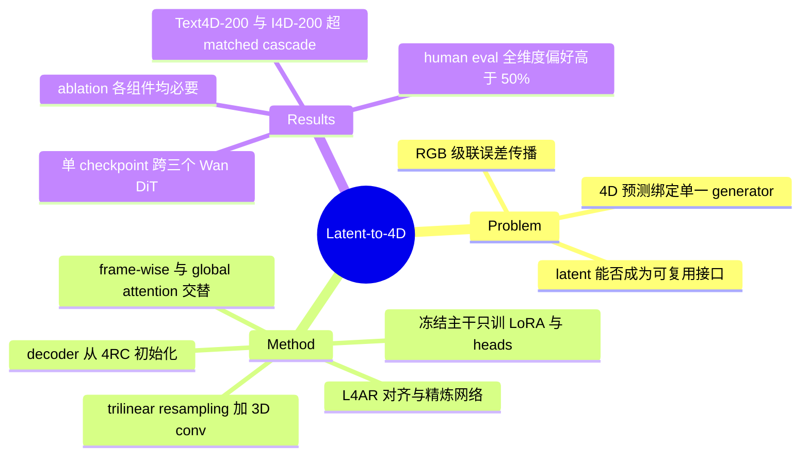

## Summary

提出 direct latent-to-4D generation：把共享同一 VAE 的 video diffusion transformer 的最终去噪 latent 当作可复用接口，经 L4AR 网络（trilinear resampling + 3D conv 对齐到 4RC 初始化的 4D decoder token grid，frame-wise 与 global spatiotemporal attention 交替精炼）直接输出显式 4D（per-frame camera + 世界系几何），绕过 RGB 解码与重建级联。仅用 1,143 个 reconstruction clips 训练 alignment/LoRA/heads，单一 checkpoint 免调跨 Wan2.1-T2V-14B / 1.3B / Wan2.2-I2V-A14B 三个 DiT；在 Text4D-200 / I4D-200 上 DINO-F1 比 matched same-latent Wan+4RC 级联高 2.88–3.45 / 5.81 点。

## Problem & Motivation

4D generation 从 text / image 条件合成动态 3D 场景，现有两条路线各有结构性缺陷：

1. **Generate-then-reconstruct**（Diffusion4D、4Diffusion、CAT4D）：先生成 RGB video，再交给单独训练的 4D reconstructor。RGB 接口在 video prior 与 4D 输出之间插入一个分布不匹配的独立模型，造成误差传播。
2. **绑定式 feed-forward**（4DNeX、Diff4Splat、WorldReel）：改造特定 video generator 直接预测 geometry。4D 预测被绑定到特定 generator 与 conditioning regime，换 generator 或换条件形式可能需要重新做 geometry-supervised 训练。

作者的问题重构：同一 VAE family 内各 video 模型的**最终去噪 latent**能否充当通往显式 4D 预测的可复用接口——若成立，4D 能力从 generator-level 定制变为 VAE-family-level 的可插拔模块。

## Method

**Pipeline**：video DiT 完成采样后取最终去噪 latent（不 decode 成 RGB）→ L4AR（Latent-to-4D Alignment and Refinement）网络 → 显式 4D 输出。

- **Alignment module（Eq. 5）**：固定的 trilinear resampling 算子 R 把 latent 重采样到 4D decoder 要求的时空分辨率，再经 learned 3D convolution S_phi，展平成 T×M×d 的 token grid（T 帧数、M 每帧空间 token 数、d 维度），与 pretrained 4D decoder 的输入网格对齐。
- **Spatiotemporal refinement**：31-block refinement hierarchy 与 prediction heads 从 4RC（feed-forward 4D reconstructor，query-based 地跨视点与时间恢复 camera 和 geometry）初始化。frame-wise attention 把 token 重排为 (BT, M, d)，先巩固每帧内的空间结构；global spatiotemporal attention 在 (B, TM, d) 上跨全部空间位置与时间步交换信息；先 frame-wise 建立 per-frame 结构，再两种 attention 交替，并融合多层级中间特征。
- **输出参数化（Eq. 6）**：per-frame camera 用 9D pose–field-of-view 参数化；世界系 geometry 经 depth 与 ray 预测。
- **训练（Eq. 7）**：L = L_unc + L_cam + L_geom（uncertainty-aware / camera / geometry 三项，metric 4D 标注监督）。冻结 video generators、VAE、4D decoder 原 Transformer 权重、camera 与 time tokens、motion decoder、tracking head；只训练 alignment module、rank-16 LoRA、geometry/camera prediction heads。多阶段渐进激活可训练组件，final stage 用来自六个 reconstruction 数据集的 1,143 clips（数据集构成细节在 Appendix）。

## Key Results

- **Text4D-200**（200-case locked benchmark）：DINO-F1 Ours(Wan2.1-14B latent) 57.01 vs Wan2.1-14B+4RC 53.56（+3.45）；Ours(Wan2.1-1.3B) 57.09 vs 54.21（+2.88）；CogVideoX-5B+4RC 53.27。辅助指标同向：Text CLIP 28.544 vs 28.116、RGB-ref CLIP-I 72.24 vs 71.20、DINO global 45.43 vs 42.45、valid-patch DINO matching 57.52 vs 54.31（对 14B 级联）。
- **I4D-200**：DINO-F1 61.60 vs matched Wan2.2-I2V-A14B+4RC 55.79（+5.81）；其他 baseline 含 4DNeX 及各 generator + π³ / Any4D 级联。
- **免调转移**：单一 checkpoint 服务共享 frozen Wan VAE 的三个 DiT（两个 text-to-video、一个 image-to-video）；两个 text DiT 上 DINO-F1 几乎一致（57.01 vs 57.09），支持"不重训即复用"。
- **Human preference**（Table 2）：50 名参与者，每 benchmark 抽 50 case，randomized anonymized pairwise，每 case 10 次评分，四维度（condition fidelity / geometry & completeness / temporal stability / overall quality）。偏好率 59.2%（Text-to-4D condition fidelity）至 72.1%（Image-to-4D geometry & completeness），八个 95% bootstrap 区间下界全部 >50%，geometry & completeness 偏好最强。
- **Ablation**（Table 3，Acc 误差单位 cm，越低越好）：7-Scenes Full 3.121；w/o Grid resampling 3.783；w/o 3D Conv 6.944；w/o Frame-wise attn 6.688；w/o Global attn 6.754。NRGBD 对应 5.202 / 5.823 / 12.439 / 12.367 / 13.818。每项移除都退化，最大退化来自移除 3D convolution 或任一 attention scope。
- **评测口径**：DINO-F1 等 projection-based 指标是 appearance-dependent proxy，作者明确其不代表 metric 4D accuracy。

## Evidence Ledger

| Claim ID | Claim | Type | Source locator | Evidence excerpt | Status |
|:--|:--|:--|:--|:--|:--|
| C1 | 最终去噪 latent 经 fixed trilinear resampling + learned 3D conv 对齐到 4RC 初始化的 4D decoder token grid，绕过 RGB 解码 | causal-mechanism | Sec. 3.3 (L4AR), Eq. 5; Experimental Setup | "a fixed trilinear resampling operator R... a learned 3D convolution... initialize the 31-block refinement hierarchy and prediction heads from 4RC" | source-verified |
| C2 | refinement 先 frame-wise attention（(BT,M,d) 巩固帧内结构），再与 global spatiotemporal attention（(B,TM,d)）交替 | causal-mechanism | Sec. 3.3, Spatiotemporal Refinement Module | "frame-wise attention reshapes them to (BT,M,d)... global attention operates on (B,TM,d)... first establishes per-frame structure... then alternates" | source-verified |
| C3 | 单 checkpoint 免调跨 Wan2.1-T2V-14B / 1.3B / Wan2.2-I2V-A14B（共享 frozen Wan VAE）；两 text DiT DINO-F1 57.01 vs 57.09 | benchmark-setting | Experimental Setup; Table 1 | "One checkpoint serves Wan2.1-T2V-14B, Wan2.1-T2V-1.3B, and Wan2.2-I2V-A14B, which share the frozen Wan VAE" | source-verified |
| C4 | 训练 final stage 用来自六个 reconstruction 数据集的 1,143 clips | number | Experimental Setup, Implementation Details | "the final stage using 1,143 clips from six reconstruction datasets" | source-verified |
| C5 | Text4D-200 DINO-F1 相比 matched Wan+4RC 提升 2.88–3.45（57.01 vs 53.56；57.09 vs 54.21） | comparison | Table 1; Quantitative Results (Text-to-4D) | "DINO-F1 gains of 2.88–3.45 points over matched 4RC" | source-verified |
| C6 | I4D-200 DINO-F1 61.60 vs matched Wan2.2+4RC 55.79，+5.81 | comparison | Table 1; Quantitative Results (Image-to-4D) | "a 5.81-point DINO-F1 gain over the matched Wan2.2+4RC cascade" | source-verified |
| C7 | human eval：50 人、每 benchmark 50 case、pairwise、每 case 10 评分、四维度；偏好率 59.2–72.1%，全部 95% CI 下界 >50% | benchmark-setting | Table 2; Human Evaluation | "Fifty participants evaluated 50 sampled cases per benchmark... Each case received ten ratings"; "Every interval exceeds 50%" | source-verified |
| C8 | ablation（7-Scenes Acc↓, cm）：Full 3.121；w/o Grid 3.783；w/o 3D Conv 6.944；w/o Frame 6.688；w/o Global 6.754 | number | Table 3; Diagnostic Analyses | "w/o Grid 3.783... w/o 3D Conv 6.944... w/o Frame 6.688... w/o Global 6.754... Full 3.121" | source-verified |
| C9 | 冻结 video generators、VAE、原 Transformer 权重、camera/time tokens、motion decoder、tracking head；只训 alignment、rank-16 LoRA、heads | benchmark-setting | Sec. 3.3 Training Objective; Experimental Setup | "the video generators, VAE, original Transformer weights, camera and time tokens, motion decoder, and tracking head remain frozen" | source-verified |
| C10 | 作者自陈：证据仅限 shared VAE convention；projection-based 评测不建立生成场景的 metric accuracy | comparison-scope | Conclusion | "Evidence remains limited to a shared VAE convention, and projection-based evaluation does not establish metric accuracy for generated scenes" | source-verified |

## Strengths & Weaknesses

**亮点**

- Problem formulation 的价值大于架构本身：把 4D 生成的接口从 RGB 像素上移到 shared VAE latent，使 4D 预测从 generator-level 定制变为 VAE-family-level 可插拔模块，干净地重构了"级联 vs 绑定式 feed-forward"的二分。
- 对照设计干净：matched same-latent cascade 固定 video prior，把变量隔离到接口本身（latent vs RGB decode 后再重建）；ablation 在有 ground-truth 的 7-Scenes / NRGBD 上用 metric 误差（cm）评估，与主表的 proxy 指标形成互补。
- 训练成本低且复用充分：约 1K clips + rank-16 LoRA + prediction heads，decoder 主体直接从 pretrained 4RC 初始化；两个 text DiT 的 transfer 结果支持免调复用。

**局限**

- 作者自陈：全部证据在单一 Wan VAE family 内；DINO-F1 等 projection-based 指标不建立 metric accuracy（C10）。
- （推测）"可复用接口"的边界就是 VAE 权重本身：跨 VAE family（CogVideoX、HunyuanVideo 等）预期需要重训，论文未测；VAE 版本更换同样会使 checkpoint 失效。
- （推测）1.3B 与 14B latent 的 DINO-F1 几乎相同（57.09 vs 57.01），既可解读为方法对上游 latent 质量鲁棒，也可解读为该指标对 latent 质量不敏感，论文未区分这两种解释。
- （未核查）human eval 的 pairwise 对照方与完整 protocol、benchmark 构建细节均在 Appendix（HTML 抽取不含）；主文未提供 inference 速度 / 效率对比。

## Mind Map

## Notes

- 项目页：https://hayd-zju.github.io/Beyond-Pixels ；code repo 已建（HuggingFace / ModelScope 标注 coming soon，权重发布状态未确认）。
- digest 过程记录：初稿 C7（win-rate 范围漏掉 Text-to-4D condition fidelity 59.2）与 C8（把 w/o Grid 的 3.783 误当基线、6.944 误归因给 grid resampling）两处数字错误由独立 verifier 指出，修正后复核通过。
- Vault 内候选关联：[[2607-RynnWorld4D]]、[[2605-ConsisVLA4D]]（同属 4D / world-model 方向，具体关系待 survey-refresh 时判断）。
