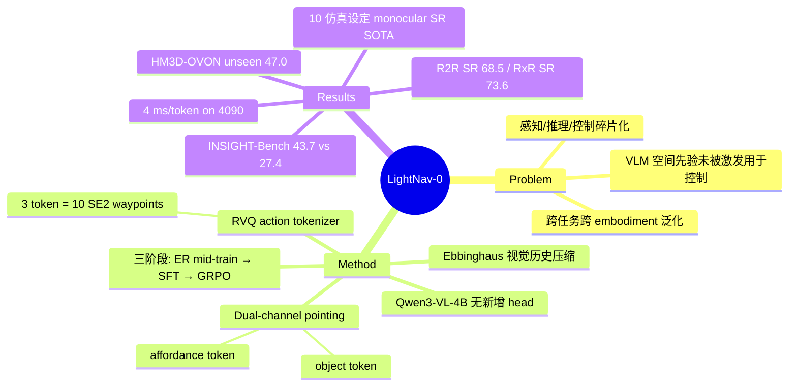

## Summary

LightNav-0 是一个 4B 的 generalist 导航模型：直接从 Qwen3-VL-4B-Instruct 实例化、不加任何 task-specific head，用 dual-channel pointing（affordance + object 两族 point token）显式激发 VLM 的空间先验，再用 3-token residual VQ 把 10 步 SE(2) waypoint 轨迹并入同一自回归词表。经 embodied-reasoning mid-training → SFT → GRPO 在线 RL 三阶段训练后，在 10 个公开导航仿真设定（instruction following / open-vocab ObjectNav / visual tracking）上取得 monocular success rate 的 SOTA。

## Problem & Motivation

具身导航要求把多样的目标（语言指令、物体类别、跟踪对象）和视觉观测翻译成跨任务、跨环境、跨机器人平台的动作。现有系统把感知、推理、控制拆成 task-specific 或 embodiment-specific 组件（waypoint predictor、action head、expert head），泛化受限。作者的核心论点：现代 VLM 在预训练中已编码了 visual grounding 和 pointing 的空间先验，但这些能力"很少被直接激发用于机器人控制"——问题不在于缺能力，而在于缺一个把空间意图与低层轨迹统一进语言 token 空间的接口。

## Method

**架构**：保留 Qwen3-VL-4B-Instruct 原生架构（native-resolution ViT + 36 层 LM），只做 vocabulary extension，无 waypoint predictor、无 task-specific action head、无 embodiment expert。全部输出由单一 causal LM cross-entropy loss 监督。

**四个关键组件**：

1. **时序感知的视觉历史压缩**：近期帧高采样率 + 细空间分辨率，旧帧指数级更强池化，形式上遵循 Ebbinghaus forgetting curve（采样率 f_s(i)=f_s^max·exp(−ΔT_i/τ_s)，池化 stride 随时距指数增长）。
2. **Dual-channel pointing 作为潜在空间推理**：两族 token 共享一个 image-grid 坐标格——affordance channel ⟨apos_i⟩ 指示可行局部方向 / free-space waypoint，object channel ⟨opos_i⟩ 定位任务目标。空间决策先以"指点"形式显式化，再接动作。
3. **Residual VQ action tokenizer**：10 个未来 SE(2) waypoint 用 3 个 level-specific codebook（各 256 codewords）层级量化，距离度量为 ADE + λ|Δθ| 的 Jacobian 加权轨迹距离（λ=0.3）。3 个 token 复原 10 waypoints，平均位移误差 0.72 cm（对比 K=4096 的 VADv2 式单层量化为 2.48 cm）。SE(2) 几何动作空间与 embodiment 解耦，支撑跨平台迁移。
4. **统一自回归序列**：导航输出序列化为 [⟨apos⟩, ⟨opos⟩, ⟨act_L0⟩, ⟨act_L1⟩, ⟨act_L2⟩]，pointing 与 action 在同一序列内先推理后行动。

**三阶段训练**：
- **Stage 1 ER mid-training**（~170 H100 GPU-hours）：36 个数据源（pointing 35.14%、单图 VQA 25.05%、video reasoning 19.81%、abstract reasoning 20%），产出 LightNav-ER checkpoint。
- **Stage 2 SFT**（~950 H100 GPU-hours）：77.6% navigation-action 监督 + 22.4% ER/VQA rehearsal；16 个导航源（R2R/RxR/ScaleVLN、PIRLNav、HM3D-OVON、EVT-Bench 等）；相机随机化（FOV 90–130°、高度 0.5–1.5 m、pitch ±15°）+ DAgger 样本缩小 train-deployment gap。
- **Stage 3 在线 RL**：GRPO，group size G=8、每次更新 B=32 seeds 共 256 episodes，单节点 8×H100，按任务设 terminal reward。

**数据**：导航语料 2K+ 场景、4K+ 小时轨迹。另自建 **INSIGHT-Bench**（1,683 训练场景 / 53,090 episodes + 210 评测场景 / 1,097 episodes）：Molmo2 开放集 pointing 预标注 + 多视角一致性 gate（≥2 视角支持、spread <0.6 m）+ 两阶段指令生成；诊断分类 5 场景类型 × 5 指令类型（base/direction/relation/extremum/ordinal）。

## Key Results

- **Embodied reasoning（8 benchmark macro avg）**：LightNav-ER 67.4% vs Qwen3-VL-4B 基座 63.1%（+4.3 pts），其中 Where2Place 76.6%、RefSpatial 57.4% 提升最大。
- **R2R Val-Unseen（monocular）**：NE 3.91 m、OS 73.7%、SR 68.5%、SPL 62.8%。
- **RxR Val-Unseen**：NE 3.66 m、SR 73.6%、SPL 64.5%、nDTW 67.4%——nDTW 仍低于 DualVLN 的 70.0，成功率优势没有均匀转化为轨迹保真度。
- **闭集 ObjectNav（monocular）**：MP3D SR 53.3%/SPL 21.2%；HM3D v1 SR 74.5%/SPL 43.9%；HM3D v2 SR 79.5%/SPL 43.7%。
- **开放词表 ObjectNav（HM3D-OVON）**：unseen split SR 47.0%/SPL 24.1%，超过此前开源最好 Uni-NaVid（39.5%/19.8%）。
- **INSIGHT-Bench**：SR 43.7%/SPL 41.5%，比最好开源 baseline JanusVLN（27.4%/24.0%）高 16.3 SR；按指令类型递降（base 53.1% → ordinal 32.6%），细粒度空间指令仍是短板。
- **部署**：推理约 4 ms/token（RTX 4090）。论文另在 EVT-Bench 上评测 visual tracking 并报告真机 zero-shot 泛化（跨 embodiment / 场景 / 动静态目标），具体真机数字本次抓取未逐表核对。

## Evidence Ledger

| Claim ID | Claim | Type | Source locator | Evidence excerpt | Status |
|:--|:--|:--|:--|:--|:--|
| C1 | 从 Qwen3-VL-4B-Instruct 实例化，无 task-specific head，仅 vocabulary extension | benchmark-setting | Sec. III Model Architecture | "no waypoint predictor, task-specific action head, or embodiment-specific expert" | source-verified |
| C2 | RVQ：3 codebook × 256；3 token 解码 10 SE(2) waypoints，ADE 0.72 cm | number | Sec. III action tokenizer | "average displacement error of 0.72 cm" (vs 2.48 cm, K=4096) | source-verified |
| C3 | ER mid-training 使 8-benchmark macro avg 63.1→67.4 | number | Table II | "highest complete-set average of 67.4" | source-verified |
| C4 | R2R Val-Unseen monocular：NE 3.91/OS 73.7/SR 68.5/SPL 62.8 | number | Table III R2R | "NE 3.91, OS 73.7, SR 68.5, SPL 62.8" | source-verified |
| C5 | RxR：SR 73.6/SPL 64.5/NE 3.66/nDTW 67.4；nDTW 低于 DualVLN 70.0 | number/comparison | Table III RxR | "Its nDTW of 67.4 remains below DualVLN's 70.0" | source-verified |
| C6 | 闭集 ObjectNav：MP3D 53.3/21.2；HM3D v1 74.5/43.9；HM3D v2 79.5/43.7 | number | Table IV | MP3D 53.3/21.2; HM3D v1 74.5/43.9; HM3D v2 79.5/43.7 | source-verified |
| C7 | HM3D-OVON unseen：47.0/24.1，prior 开源最好 Uni-NaVid 39.5/19.8 | number/comparison | open-vocab ObjectNav table | "SPL increases from 19.8 to 24.1"; prior best = Uni-NaVid | source-verified |
| C8 | INSIGHT-Bench：43.7/41.5 vs JanusVLN 27.4/24.0（+16.3 SR） | comparison | Table VI | LightNav-0 SR 43.7/SPL 41.5; JanusVLN SR 27.4/SPL 24.0 | source-verified |
| C9 | INSIGHT-Bench：1,683 训练场景 + 210 评测场景；5×5 诊断分类 | number | Sec. IV INSIGHT-Bench | "1,683 scenes and 53,090 training episodes … 210 scenes and 1,097 evaluation episodes" | source-verified |
| C10 | Stage 1 ~170 / Stage 2 ~950 H100 GPU-hours；SFT 77.6% nav + 22.4% ER | number | Sec. V training details | "77.6% … navigation-action supervision and 22.4% rehearse … ER mid-training" | source-verified |
| C11 | GRPO：G=8、256 episodes/update、8×H100 单节点 | benchmark-setting | Sec. V Stage 3 | "G=8 and each iteration draws B=32 seeds, giving 256 episodes per update" | source-verified |
| C12 | 导航语料 2K+ 场景、4K+ 小时 | number | Sec. IV data | "The navigation corpus spans 2K+ scenes and 4K+ hours of embodied trajectories" | source-verified |
| C13 | 推理约 4 ms/token（RTX 4090） | number | deployment section | "approximately 4 ms per generated token on an NVIDIA GeForce RTX 4090" | source-verified |
| C14 | 10 个公开仿真设定上的 SOTA（限定 monocular success rates） | sota-novelty | abstract/intro | "state-of-the-art monocular success rates across all 10 public navigation simulation settings" | source-verified |
| C15 | 代码 GitHub lightorigins/LightNav-0，权重 HF LightOriginsHQ/LightNav-0 | license-code | first page footnote | GitHub + HF links in footnote | source-verified |
| C16 | 视觉历史压缩遵循 Ebbinghaus forgetting curve 形式 | causal-mechanism | method section | "follows the qualitative form of the Ebbinghaus forgetting curve" | source-verified |
| C17 | Dual-channel pointing = affordance token 族 + object token 族，共享 image grid | causal-mechanism | method section | "affordance point indicates a feasible direction … object point localizes the task goal" | source-verified |

## Strengths & Weaknesses

**亮点**
- **接口设计而非架构堆叠**：全部贡献集中在"把空间意图和轨迹并入 LM 词表"这一个接口上——pointing token 显式化空间推理、RVQ token 压缩连续轨迹，单一 CE loss 端到端。相比给 VLM 挂 waypoint head 的路线，这是更 simple & scalable 的 formulation，且 ablation（ER 初始化 +4.3 macro avg）支持"先激发空间先验、再学控制"的因果顺序。
- **SE(2) waypoint 的 embodiment 解耦**：几何动作空间不绑定任何平台，3 token / 10 waypoints / 0.72 cm 的压缩率-精度权衡有具体数字支撑。
- **4B 规模 + 4 ms/token 推理**，是少数认真报告部署延迟的导航模型；代码与权重开源。
- **INSIGHT-Bench 的诊断分类学有信息量**：按指令类型分解暴露了 relation/extremum/ordinal（32–35%）远低于 base（53.1%），指出细粒度空间语言 grounding 是当前瓶颈——这比 aggregate SOTA 数字更有价值。

**局限**
- **SOTA 限定词不可忽略**：原文声明是 "monocular success rates" 的 SOTA；RxR nDTW（67.4 vs DualVLN 70.0）说明成功率高不等于轨迹忠实执行指令，路径质量维度尚未赢。
- **INSIGHT-Bench 既是训练源又是评测集**（1,683 训练场景与 210 评测场景出自同一 Molmo2 预标注 pipeline），LightNav-0 相对 zero-shot baseline（JanusVLN/NaVid）的 +16.3 SR 中有多少来自 pipeline 分布内优势，论文未做拆解——【推测】该对比对 baseline 偏严。
- **RL 阶段的量化收益未见独立报告**（本次抓取未找到 SFT-only vs +RL 的逐 benchmark delta），三阶段中 Stage 3 的必要性证据链最弱。
- **真机证据以 zero-shot 泛化展示为主**，具体机器人平台与真机成功率未在本次抓取中逐表核对，跨 embodiment 声明的量化边界【不确定】。

## Mind Map

## Notes

- INSIGHT-Bench 的指令类型分解（ordinal/extremum ~33%）与 vault 中 spatial-reasoning 方向的"关系性空间语言是 VLM 短板"的跨论文 pattern 一致，可作为 survey 证据点。
- RVQ action token 与 VLA 方向的 action tokenization 工作（FAST 等）同构，但用在 SE(2) 导航空间且只需 3 token，值得与 manipulation 侧的 tokenizer 对比压缩率。
- 待跟进：GitHub repo 若含 tokenizer 训练与 GRPO 环境代码，属于 repo-digest 候选（系统/基建贡献在实现里）。
