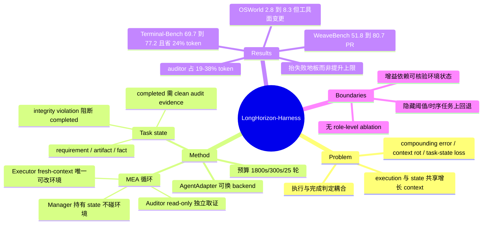

## Summary

LongHorizon-Harness 把 long-horizon 执行重构成 task-state management 问题：task state 显式维护在执行之外，只用独立核验过的环境事实更新，由 Manage-Execute-Audit (MEA) 循环驱动——manager 从 audited state 派下一个 subtask contract，fresh-context executor 执行，read-only auditor 直接查环境判定完成与完整性。在 Qwen 3.7-Plus 上，WeaveBench PassRate 从 51.8% 升到 80.7%，Terminal-Bench 2.1 从 69.7% 升到 77.2%，OSWorld 2.0 binary 从 2.8% 升到 8.3%。核心机制主张是"executor 的完成声明不进 state，只有 auditor 从环境取到的证据才进"，但全文没有任何 role-level ablation，OSWorld 上的增益还叠加了 GUI-only → GUI+CLI 的工具面变更。

## Problem & Motivation

论文把 long-horizon 执行的困难归为三条：compounding errors / goal drift、context rot、task-state loss。真正的论点在第二层——现有 harness（Claude Code、Codex CLI、OpenClaw）已经支持 planning、decomposition、subagent，却仍有两个**结构性**缺陷：(i) task execution 与 task-state management 共享同一个持续增长的 context，执行历史越长 state 越难追踪；(ii) 执行与完成判定耦合，agent 自己干完自己判完成，错误判定会被写进 state 并成为后续决策的前提。

这个 formulation 是本文最值得注意的部分：它不把 long-horizon 失败归因于模型能力或 context 长度，而归因于 harness 的**权限与信息分配**——谁能改环境、谁能判完成、什么东西被允许跨轮持久化。这是一个可证伪的机制假设，也解释了论文为什么把 auditor 的 read-only 与 fresh-context 当作硬约束而非工程细节。

## Method

**MEA 循环。** 给定任务 T 与计算机环境，第 i 轮：manager 由 (T, S_i, V_i) 产出 (S_{i+1}, q_{i+1}, c_{i+1})，其中控制决策 q ∈ {execute, done, blocked, ask}；executor 执行 contract c_i，把环境从 e_{i-1} 变到 e_i 并返回执行报告 o_i；auditor 从 e_i 独立取证产出 audit report v_i。跨轮持久化的只有 task state 与 audit reports，executor 的原始 trajectory 每轮丢弃。

**Manager（不接触环境）。** 无法观察或修改环境，只能读 task state 与历史 audit report。Task state 是结构化记录集合：requirement（目标/约束）、artifact（产出物）、fact（后续轮需要的环境信息），每条标记为 completed / pending / blocked / untrusted 并挂上支撑它的 audit evidence。关键规则是 **executor 的声明不直接改状态**——一条记录只有在 clean audit evidence 支撑下才能标为 completed。Contract 包含即时目标、acceptance criteria、边界约束，以及执行与核验所需的相关历史记录。

**Executor（唯一可改环境的角色）。** 每轮是一次 fresh、budget-bounded 的 episode，只拿本轮供给的信息，不继承历史原始 trajectory；episode 结束后原始轨迹与内部推理丢弃，只有 o_i 送去审计。GUI executor 拿 screenshot + pyautogui 类动作，CLI executor 拿 shell / 文件编辑 / 编码 / 测试；harness 只暴露被选中角色的接口，角色外能力默认不可用。

**Auditor（read-only）。** 从排除了 executor 原始轨迹的 fresh context 起步，可以用 o_i 定位文件/窗口/日志，但完成判定必须由自己对照 contract 的 acceptance criteria 独立比对环境得出。它可以改变观察视角但不能改动任务相关状态；harness 全程监控 workspace 与 artifact，**任何被检出的 mutation 记为 integrity violation，该报告即不能支撑 completed 记录**。审计报告给两组状态：completion ∈ {complete, incomplete, blocked}，integrity ∈ {clean, suspect, violation}，外加本轮支持的 state 更新提案（由 manager 决定是否采纳）。

**AgentAdapter。** 统一接口把已有 backend（Claude Code、Codex CLI、OpenClaw、Hermes Agent）作为一次 bounded episode 拉起，保留其原生 agent loop，harness 只控制供给的 context、可用工具、环境权限、执行预算与返回报告。

**预算。** executor 每轮 1800s，manager 与 auditor 各 300s，单任务最多 25 个 MEA 轮。

## Key Results

**主结果（Qwen 3.7-Plus，LH-Harness 以 Claude Code 为 executor backend）**

| Benchmark | 指标 | Baseline | LH-Harness | 对照是否 matched |
|:--|:--|:--|:--|:--|
| WeaveBench (114) | PassRate / Overall | 51.8 / 0.702 | 80.7 / 0.835 | 是（作者自跑同 backbone + Claude Code） |
| Terminal-Bench 2.1 | 三次平均成功率 | 69.7% | 77.2% | 是（作者自跑） |
| OSWorld 2.0 (108) | Binary / Partial | 2.8 / 21.5 | 8.3 / 35.2 | **否**（见下） |
| OSWorld 2.0 子集 (34, Opus 4.7) | Binary / Partial | 20.6 / 55.8 | 35.3 / 66.9 | **否** |

WeaveBench 八个 domain 的 PassRate 全部上升，最大增益在 Design（20.0→80.0，+60.0 pt）与 Spatial/3D（16.7→66.7，+50.0 pt），基线已达 83.3 的 Desktop 只 +5.6 pt。附录 Table 6 补充了一个正文没强调的细节：**mean score 只在八个 domain 中的七个上升**，Desktop 的 pass rate 升了但 mean score 反而微降（0.8671→0.8465）——额外的核验与修复步骤会轻微伤害本来就很强的轨迹。Table 1 中官方报告的最强结果是 Claude Opus 4.7 + Claude Code 的 41.2 PassRate，但作者自己声明其自跑使用 VM 内 root 权限而官方结果用普通用户账号，因此官方行只作参考点、主结论建立在 matched 的 Claude Code 对照上。

**OSWorld 的对照不是 tool-matched。** Table 2 的所有灰行（含 Qwen 3.7-Plus 的 2.8 / 21.5）都是 OSWorld 2.0 原论文报告的官方结果，走 single-action / batched-action 的 GUI 路线；黑行是作者自建的 hybrid GUI+CLI tool pool。附录 A.2 明确说 "Unlike the main official baselines, which typically rely only on GUI actions, LongHorizon-Harness uses a hybrid tool pool"；B.1 对 Opus 34 任务子集说得更直白："The baseline uses the standard single-action GUI setting, while LongHorizon-Harness uses our hybrid GUI+CLI tool pool."

> [证据边界] 论文对 108 任务全集的措辞是 hedged 的 "typically rely only on GUI actions"，unhedged 的 "standard single-action GUI setting" 只出现在描述 34 任务子集的 B.1。因此"全集 baseline 完全无 CLI"这一点只能从 A.2 的一般性陈述推断，不能算被逐任务确认。

> [论文内部不一致] Abstract 与 Introduction 报告 Opus 4.7 子集为 20.0% → 34.3%，Table 3 与附录 B.1 报告为 binary 20.6% → 35.3%。二者不可同时为真；本笔记正文一律采用表格与附录的数字。

**成本结构。** Manager 只占总 token 的 2.8% / 2.0% / 8.1%（WeaveBench / OSWorld / Terminal-Bench），auditor 占 19.4% / 24.8% / 38.1%——显式 state 维护几乎免费，独立核验才是主要新增开销。总量变化则完全不是固定倍率：WeaveBench 2.3×、OSWorld output token 3.6×，而 Terminal-Bench **反而少用 24% token 且成功率更高**。

**Table 4（WeaveBench Games 17 任务）是全文信息量最高的一张表。** LH-Harness 把 Opus 4.7 均分从 0.680 抬到 0.809、Qwen 3.7-Plus 从 0.524 抬到 0.733；Qwen 基线得分 ≤0.04 的 6 个任务全部回到 0.30–0.92，即增益主要来自抬高失败地板而非提升上限。同时 token 走势相反：Qwen 10.7M→34.3M，Opus 16.5M→11.1M——更强的模型用更少的 audit-replan 轮就能满足 contract。Qwen + LH-Harness 的 0.733 超过 Opus + 原生 Claude Code 的 0.680，作者据此论证 agent capability 是 model–harness 系统属性。

**边界条件（作者自己给出）。** OSWorld 按 capability tag 拆分时最大增益在 streaming interaction（baseline 0.000 → 0.500，n=6）、human-in-the-loop 与 tutorial-following；Terminal-Bench 上 system administration 从 0.593 升到 0.889，但 mteb、data-science、video-processing 等 tag 出现回退。附录 B.2 的归纳是：增益集中在"progress 能被表示为可核验环境状态"的任务；当成功条件依赖隐藏阈值、排序语义、时序定位时，"a misinterpreted contract can still lead to a confidently verified wrong answer"。

## Evidence Ledger

| Claim ID | Claim | Type | Source locator | Evidence excerpt | Status |
|:--|:--|:--|:--|:--|:--|
| C1 | WeaveBench Qwen 3.7-Plus：Claude Code 51.8 PR / 0.702 → LH-Harness 80.7 / 0.835 | number | Table 1；§3.2 | "achieves a PassRate of 51.8% and a mean task score of 0.702" | source-verified |
| C2 | Terminal-Bench 2.1：69.7%→77.2%（Qwen+Claude Code）；Codex+GPT-5.6 Luna 达 83.1% | number | §3.2 Generalization；Fig. 3 caption | "from 69.7% to 77.2%. With Codex ... reaches 83.1% using GPT-5.6 Luna" | source-verified |
| C3 | OSWorld 2.0 全集 108 任务：binary 2.8→8.3，partial 21.5→35.2 | number | Table 2；§3.2 | "increases binary completion from 2.8% to 8.3% and partial score from 21.5% to 35.2%" | source-verified |
| C4 | C3 的对照非 tool-matched：baseline 为官方 GUI-only 结果，LH 行用作者 hybrid GUI+CLI 工具池 | benchmark-setting | Table 2 caption；App A.2 ¶2 | "Unlike the main official baselines, which typically rely only on GUI actions, LongHorizon-Harness uses a hybrid tool pool" | source-verified（全集措辞为 hedged，unhedged 版仅见于 B.1 子集） |
| C5 | Opus 4.7 34 任务子集数字论文内部不一致：Abstract/Intro 20.0→34.3，Table 3/App B.1 20.6→35.3 | number | Abstract；§1 ¶5；Table 3；App B.1 | B.1: "binary accuracy from 20.6% to 35.3%" | source-verified |
| C6 | WeaveBench PassRate 定义不一致：正文"fully passed tasks"，附录"score at least 0.8" | benchmark-setting | §3.1 vs App A.1 | A.1: "PassRate, defined as the fraction of tasks with score at least 0.8" | source-verified |
| C7 | Table 1 官方行非 matched：自跑用 VM root 权限，官方结果用普通用户；官方最强 41.2 PR | benchmark-setting | Table 1 caption + row 1 | "Our runs use root privileges inside the task virtual machine, whereas the official results use a regular user account" | source-verified |
| C8 | Manager 占 2.8/2.0/8.1%，auditor 占 19.4/24.8/38.1%；总量 2.3× / 3.6× / 少 24% | number | §3.3 Computation across roles；Fig. 5 | "manager accounts for only 2.8%, 2.0%, and 8.1% ... auditor ... 19.4%, 24.8%, and 38.1%" | source-verified |
| C9 | Games 17 任务：Opus 0.680→0.809（token 16.5M→11.1M），Qwen 0.524→0.733（10.7M→34.3M） | number | Table 4 Mean 行；§3.3 | "improves the mean score of Opus from 0.680 to 0.809 and that of Qwen from 0.524 to 0.733" | source-verified |
| C10 | 预算：executor 1800s/轮，manager 与 auditor 各 300s，最多 25 轮 | benchmark-setting | §3.1 Implementation；App A.1 | "the executor is limited to 1800 seconds per round, while both the manager and the auditor are limited to 300 seconds" | source-verified |
| C11 | Auditor read-only 且 fresh context 排除 executor 轨迹；检出 mutation 记为 integrity violation 且不能支撑 completed | causal-mechanism | §2.4 三小节 | "any detected mutation is recorded as an integrity violation, and the resulting report cannot support a completed task-state record" | source-verified |
| C12 | WeaveBench 上作者额外引入原 benchmark 接口没有的 save_screenshot 工具 | benchmark-setting | App A.1 ¶3 | "we introduce a restricted evidence-preservation tool, save_screenshot" | source-verified |
| C13 | 全文（含附录）无任何 role-level ablation，"ablation" 一词不出现 | benchmark-setting | §3.1–3.4、App A/B/C 全文检索 | 仅有成本分解："Fig. 5 decomposes the token consumption ... across the manager, executor, and auditor" | source-verified |
| C14 | 公开代码库 github.com/AMAP-ML/LongHorizon-Harness 与站点 lh-harness.pages.dev | license-code | 首页 metadata 块 | "[Github] https://github.com/AMAP-ML/LongHorizon-Harness [Website] https://lh-harness.pages.dev" | source-verified |
| C15 | 三个 benchmark 使用三个不同 Claude Code 版本：2.1.76 / 2.1.176 / v2.1.211 | benchmark-setting | App A.1 ¶2；A.2 ¶2；A.3 ¶2 | A.1 "claude-code 2.1.76"；A.2 "claude-code 2.1.176"；A.3 "v2.1.211" | source-verified |
| C16 | WeaveBench 八个 domain 的 PassRate 全升，但 mean score 只在七个上升，DSK 微降 | number | App B.2.1 ¶1；Table 6 | "improves the mean score in seven of the eight domains ... Desktop (DSK), where the mean score slightly decreases despite a higher pass rate" | source-verified |
| C17 | Terminal-Bench system-administration 0.593→0.889；mteb / data-science / video-processing 为负向 tag | number | Table 9；App B.2.3 ¶3；Table 11 | "Negative tags such as mteb, data-science, and video-processing expose a different limitation" | source-verified |
| C18 | 作者单位为 Alibaba Group DreamX Team | metadata | 首页 affiliation 脚注 | "DreamX Team, Alibaba Group" | source-verified |
| C19 | 域级最大增益 Design +60.0 pt（20.0→80.0）、Spatial/3D +50.0 pt（16.7→66.7）；Desktop +5.6 pt | number | §3.3 Task-dependent；Table 1 | "Design and Spatial/3D obtain the largest PassRate improvements of 60.0 and 50.0 points" | source-verified |
| C20 | OSWorld 按 tag 最大增益在 streaming interaction：baseline 0.000 → 0.500 | number | App B.2.2 ¶1；Table 8 | "streaming interaction tasks, where the baseline score is zero and LH-Harness reaches 0.500 on average" | source-verified |

## Strengths & Weaknesses

**Strengths**

- **问题 formulation 抓在了对的层面。** 把 long-horizon 失败归因于 harness 的权限与信息分配（谁能改环境、谁能判完成、什么被允许跨轮持久化），而不是 context 长度或模型能力，这是一个可证伪、可设计的机制假设。"executor 的完成声明不进 state" 是一条简洁到可以直接复用的设计规则。
- **两个真正 matched 的对照。** WeaveBench 与 Terminal-Bench 的 baseline 都是作者用同 backbone、同 Claude Code 自跑的，比多数 harness 论文"我们 vs leaderboard"的比法可信得多；而且作者主动披露 root 权限差异并据此把官方行降格为参考点，这个处理是诚实的。
- **Terminal-Bench 是全文最有信息量的结果。** 纯 CLI、无视觉、无 GUI/CLI 路由，收益仍在（69.7→77.2）**且 token 少 24%**。这同时否证了两个常见怀疑：收益不能被简单归给"多给了工具"，"更多验证必然更贵"也不成立。
- **Table 4 报告的是分布而非均值。** Qwen 基线 ≤0.04 的 6 个任务全部回到 0.30–0.92，说明增益的形状是抬失败地板；Opus 上 token 反降、Qwen 上 token 暴涨这一对相反走势，为"弱模型需要更多 audit-replan 轮"给出了独立于均分的旁证。这类"机制留下的指纹"比 SOTA 数字有价值。
- **成本归因分离得很干净。** Manager 2–8%、auditor 19–38%——显式 state 维护便宜，独立核验贵。这直接告诉后续工作该优化哪一块。

**Weaknesses**

- **没有任何 role-level ablation，这是最大的方法学缺口。** 全文不出现 "ablation"。外置 task state、fresh-context executor、read-only auditor 三者的净贡献完全无法分离。尤其 fresh-context executor 本身就是一个很强的 context-management baseline：**只做每轮 context 重置 + 结构化交接、不加 auditor，能拿到多少？** 这个实验便宜到没有理由不做，不做就使得"独立核验是关键"这一核心主张缺少直接证据。对照之下 [[2607-StateAct]] 做了 ablation 并发现 act-on-state 才是最大单项贡献——本文的主张有可能被同样的拆解削弱。
- **OSWorld 的三倍提升被工具变更污染。** 2.8→8.3 的 baseline 是官方 GUI-only 结果，实验组多了一整套 shell。在 median 1.6 小时的桌面 workflow 上给 agent 加 CLI 本身就是重大能力变更，MEA 与 CLI 各贡献多少无从判断。同样问题适用于 Opus 4.7 的 34 任务子集。而且 8.3% binary 的绝对水平仍然很低，"3.0×" 的表述放大了一个小基数上的变化。
- **34 任务子集的选取规则缺失。** B.1 只称其为 "OSWorld 2.0 Opus 4.7 subset"，未给筛选准则。子集怎么来的不说明，34/108 的结果就不能外推，而这恰恰是全文唯一的 Opus 结果。
- **Abstract/Intro 与表格数字对不上**（20.0→34.3 vs 20.6→35.3），且出现在最容易被二手引用的位置；PassRate 定义在正文与附录之间也不一致（fully passed vs score ≥ 0.8）。这两处都不影响结论方向，但会污染下游引用。
- **增益范围与 benchmark 的可核验性结构耦合。** 附录 B.2 自己承认最大增益都在"progress 能被表示为可核验环境状态"的任务上，而在隐藏阈值、排序语义、时序定位类任务上退化，并明确写出 "a misinterpreted contract can still lead to a confidently verified wrong answer"。这不是瑕疵而是**真正的边界条件**，本该进主结论：MEA 提升的是"把已达成的进展锁住"的能力，不提升"判断什么才算达成"的能力。当 acceptance criteria 本身可能被误解时，独立审计只会把错误固化得更自信。
- **环境一致性问题。** 三个 benchmark 用了三个不同 Claude Code 版本（2.1.76 / 2.1.176 / 2.1.211）；WeaveBench 还额外加了 save_screenshot 工具——作者论证它不增加环境控制能力，但它恰好服务于"截图作为评分 artifact"这一类任务的得分条件。
- **可复现性依赖闭源栈。** 主 backbone Qwen 3.7-Plus 与 Claude Opus 4.7 都是 API 模型，executor backend 是 Claude Code；代码开源不等于结果可复现。

**潜在影响。** 与 [[2607-StateAct]] 构成同期同问题的两条正交路径——StateAct 换 observation interface（program state 取代 screenshot），本文换 control loop（外置 state + 独立审计）——两者从不同角度指向同一结论：当前 CUA 的瓶颈在 long-horizon 状态维护与验证，不在单步 GUI 能力。这条线值得作为 CUA-Survey 中"harness as first-class object"的证据簇来维护。

## Mind Map

## Notes

- **最该做而没做的实验（一句话）**：固定 manager + fresh-context executor，只删掉 auditor（或让 auditor 看得到 executor 轨迹），看 WeaveBench PassRate 掉多少。论文把"auditor 不看 executor 轨迹"当作机制核心，却没给任何对照证据。这一点与 [[2606-CodeSelfReviewCollapse]] 的结论直接呼应：该文证明用模型自身信号做 self-gate 会进入 rubber-stamp regime（通过率上升而正确率下降），稳定的自我改进需要 exogenous verification。LongHorizon-Harness 相当于在 execution 层实现了 exogenous verification 的一个具体形式，但"exogenous 到什么程度才够"仍是空的——auditor 与 executor 在主实验里是**同一个 backbone 模型**，只是 context 不同。
- **OSWorld 的重跑很值得做**：把 baseline 也换成 hybrid GUI+CLI 单轨迹跑一遍，MEA 的净贡献就清楚了。这是当前从这篇论文里最容易提取的一个可发表增量。
- **与库内工作的关系**：benchmark 侧接 [[2606-WeaveBench]]（该文自身的分析指出 outcome-only grading 系统性高估 10–20pp、35.2% 的失败源于 reward hacking——本文用的正是它的 trajectory-aware judge，judge 为 Opus 4.7 而 auditor 为 Qwen 3.7-Plus，二者不同族，这降低了 judge–auditor 偏好相关的风险）与 [[2606-OSWorld2]]；harness 作为研究对象这条线接 [[2607-HarnessHandbook]]；纯 CLI 长任务评测接 [[2607-LongHorizonTerminalBench]]；最直接的同期对照是 [[2607-StateAct]]。
- **一个可以提炼成 survey 论断的观察**：本文与 StateAct 都在 OSWorld 2.0 这个"median 1.6 小时"的量级上把提升做出来，且两者都不改模型。如果把 [[2606-OSWorld2]] 的"最强配置也只有 20.6% binary"作为起点，那么 2026 年下半年 CUA 的进展主线正在从"训更强的 GUI policy"转向"设计更可靠的执行契约"。这条主线值得在 CUA-Survey 里单独立节，并把 harness 层的 verification 结构（谁验、验什么、验证者能看到什么）作为分类轴，而不是按系统名罗列。
- **repo_candidate**: https://github.com/AMAP-ML/LongHorizon-Harness —— 系统/基建类工作，贡献主要在实现（角色权限隔离、integrity 监控、AgentAdapter），值得另起一轮 repo-digest 核查 read-only 强制是怎么落地的（尤其"检出 mutation 即判 violation"的监控粒度）。

## Implementation Analysis

> repo: https://github.com/AMAP-ML/LongHorizon-Harness @ `24ad75c`，分析日期 2026-08-06，静态分析未执行代码。以下结论均为"该 commit 版本实现如此"，不外推为论文结果可由此复现。

**架构**

仓库里并行存在两套 harness，读代码时必须先分清。一套是发布的 pip 包 `src/lh_harness/`（角色名 manager / executor / auditor，MEA 控制流全在 `manager.py:L93-606`，环境只有 `LocalEnvironment`），另一套是 `eval/WeaveBench-harness/` 与 `eval/OSWorldv2-harness/` 里各自 vendored 的 `cua_harness`（角色名 orchestrator / task / verifier）。论文主实验走的是后者：预算、角色权限、完整性监控的真实执行点都在 `eval/WeaveBench-harness/WeaveBench/weavebench/agents/cua_harness_claudecode_agent.py`（997 行），而不是发布包。两套的控制协议也不同——发布包的审计报告有三条控制轴（`src/lh_harness/types.py:L49-62`：status / integrity / contract_audit），eval 版只有两条（`eval/WeaveBench-harness/cua-harness/src/cua_harness/role_prompts.py:L116-137`），contract-audit 轴是发布包相对论文实验版新增的。角色隔离在发布包里基本靠 prompt，在 eval 版里才有进程级强制。

**论文 ↔ 代码对照**

| 论文 claim | 代码位置 | 一致性 |
|:--|:--|:--|
| C10 预算：executor 1800s、manager/auditor 各 300s、最多 25 轮 | `eval/WeaveBench-harness/WeaveBench/scripts/run_qwen37plus_cua_harness_eval.sh:L80-85` 显式设 `MAX_ROUNDS=25 / TASK_TIMEOUT=1800 / ORCHESTRATOR=300 / VERIFIER=300` | 一致（但仅在这个启动脚本里；发布包默认是 4 轮 + manager/auditor 各 600s，见 `src/lh_harness/types.py:L82-90`；agent 类兜底默认是 30 轮 + `min(timeout,900)`，见 `cua_harness_claudecode_agent.py:L229-234`） |
| §2.4 auditor read-only，"harness 全程监控 workspace 与 artifact" | `cua_harness_claudecode_agent.py:L155-171`（observe_only 角色禁 Write/Edit/NotebookEdit）+ `L173-189`（导出 `WEAVEBENCH_VERIFIER_READ_ONLY=1` 与 PATH/PYTHONPATH/NODE_OPTIONS 守卫）+ `L524-832`（三层运行时 guard）+ `L835-878`（SHA256 全量快照） | eval 路径一致；发布包不一致——`src/lh_harness/adapters/claude_code.py:L48-55` 对所有角色（含 auditor）都拼 `--dangerously-skip-permissions`，read-only 只由 prompt 声明（`src/lh_harness/prompt_texts.py:L179-214`） |
| C11 "任何被检出的 mutation 记为 integrity violation，该报告即不能支撑 completed 记录"（§2.4） | `src/lh_harness/auditor_agent.py:L74-140` 有三条分支，只有 `restore_on_mutation` 为真的分支置 violation（`L119`）；`restore_on_mutation` 为假走归档分支，`L134` 明写"该归档不自动废弃本轮审计报告"，status / integrity 都不改。而 WeaveBench 的元数据生产者把它固定为假：`cua_harness_claudecode_agent.py:L891 "verifier_workspace_restore_on_mutation": False` | **不一致**（双边证据齐）：论文的"任何 mutation → violation"在论文所用的 WeaveBench 配置下不成立，检出的 mutation 只被追加成一段说明文字 |
| §2.3 "harness 只暴露被选中角色的接口，角色外能力默认不可用" | `src/lh_harness/prompt_texts.py:L74`（EN）与 `L109`（ZH）写的是 "Tools are not the routing boundary." / "路由不是工具权限隔离。"；`cua_harness_claudecode_agent.py:L305` 与 `L311` 把 gui_task 与 cli_task **都**构造为 `gui=True`，即两个 executor 角色都能调 `mcp__weavebench_computer__computer` | **不一致**（双边证据齐）：GUI/CLI 是提示词层面的职责路由，不是工具权限隔离；真正被工具面裁剪的只有 orchestrator（`L299` `gui=False` + `L450-453` 额外禁 `Bash,Write,Edit,NotebookEdit`）与两个 verifier（`L317`/`L323` `computer_observe_only=True`） |
| §2.3 manager 无法观察或修改环境，只读 task state 与历史 audit report | `src/lh_harness/role_prompts.py:L42-56` manager prompt 只拼 `format_verified_intermediate_context`；后者（`L495-522`）只放 auditor 报告原文与对应子任务，executor 输出不进入。含 executor 输出的 `format_management_history`（`L538-566`）只在 `manager.py:L596` 生成日志 transcript 时调用 | 一致 |
| §2.4 auditor 从排除 executor 原始轨迹的 fresh context 起步，但可用 o_i 定位 | `src/lh_harness/role_prompts.py:L189-233` auditor prompt 确实包含 `executor_output`（`L225`，裁剪上限 `types.py:L94` = 24k），而该字段是 `manager.py:L942-956` `_visible_output` 解码出的"可见输出"，stream-json 原始轨迹另存不入 prompt（`manager.py:L993-996` 注释） | 一致（论文排除的是 raw trajectory，不是执行报告） |
| §2.4 审计报告给两组状态（completion / integrity） | `src/lh_harness/types.py:L49-62` 是三组，多一条 `contract_audit_status`；manager 的完成闸门要求三者同时满足（`manager.py:L295` → `L872-884` complete + clean + aligned） | 代码严于论文；不算不一致，属论文未写的实现细节 |
| C12 引入受限的 `save_screenshot` 证据保全工具 | `eval/WeaveBench-harness/WeaveBench/weavebench/assets/weavebench_computer_mcp/server.py:L662-716` 实现，并写 `.meta.json` sidecar（`L694` `capture_source: "real_screen"`，另含 sha256 / capture_time / resolution / active_window）；`L786` 的 OBSERVE_ONLY 白名单只允许 `screenshot`/`cursor_position`/`wait`，因此 `L794` 的 `save_screenshot` 分支对 verifier 不可达 | 一致，且比论文所述更强——截图证据只能由 executor 产生，verifier 只能读取和校验 |
| §2.5 AgentAdapter 统一接口，保留后端原生 loop | `src/lh_harness/adapters/cli_agent.py:L44-113` `run_episode(prompt, env, budget) -> EpisodeResult`；环境侧 `src/lh_harness/environment/base.py:L8-21` `Environment` Protocol | 一致 |

**论文没写的实现细节**

- **read-only 是三层进程级强制，不是单一开关**（`cua_harness_claudecode_agent.py:L524-832`）：PATH 前置目录里放约 34 个写类命令的拦截 shim（`L616-673`，命中即报错退出）；`sitecustomize.py` 猴补 Python 侧写接口（`L675-783`）；Node 侧用 `--require` 注入 fs guard（`L785-822`）。这是论文完全没提、但决定 "auditor read-only" 是否真成立的部分。
- **auditor 有一条特许写通道**：`cua_verifier_delete` 二进制（`L528-614`），要求 `--path --sha256 --reason` 三参数，禁删前缀含 `ROOT/.harness/_screenshots/.cua_harness_claudecode/gt`，每次删除追加到 `verifier_deletions.jsonl`（`L542`）。发布包侧对应 `src/lh_harness/auditor_agent.py:L617-645` `_allowed_auditor_delete_paths`，命中时走 `L82-97` 分支——只在报告尾部追加"删除记录"，**不置 violation**。即 read-only 的语义实际是"不得新增或修改，但可在留痕前提下删除被判伪造的产物"。
- **完整性快照只覆盖 auditor，不覆盖 executor**：`L426-429` 与 `L469-470` 显示 before/after 快照只在 `computer_observe_only` 为真时采集。executor 对 workspace 的任何改动都不进入 hash 比对。
- **ground truth 目录被排除在监控之外**：快照排除 `.harness` / `_screenshots` / `.cua_harness_claudecode` / `gt`（`L835-878`），发布包侧 `src/lh_harness/types.py:L101-115` 同样把 `{workspace}/gt` 列入 ignore 前缀。
- **回滚未实现**：`verifier_workspace_restored` 在全库只有消费者（`src/lh_harness/auditor_agent.py:L77`、`L635`、`L771` 及两个 eval `verifier_agent.py`），没有任何生产者。`L98-124` 分支里"harness restored the workspace snapshot"这句提示文本因此在当前代码路径下永远走不到 restored 为真的分支。
- **控制头是真正的机器接口**：auditor 输出的前三行非空行被当作 Status / Integrity / Contract audit 解析（`src/lh_harness/auditor_agent.py:L262-309`），解析失败直接降级为 blocked / suspect / unknown（`L312-322`），另有一次格式修复提示（`src/lh_harness/role_prompts.py:L264-302`）。论文把它描述为"报告给出两组状态"，没有说明这是一个会因格式错误而判负的协议。
- **human-in-the-loop 通道**：`RoleNextStep` 含 `"ask"`（`src/lh_harness/types.py:L17`），落地为 `manager.py:L632-701` `_human_gate`，论文只在 q ∈ {execute, done, blocked, ask} 里一笔带过。
- **完成权归属被写死**：`manager.py:L918` 最终报告固定标 `"completion_authority": "manager_with_role_auditors"`。
- **发布包路径上完整性监控恒为空**：`_workspace_mutation_detected`（`manager.py:L988-990`）只读 metadata 里的 `verifier_workspace_mutation_detected`，而发布包的 adapter 产出的 metadata 不含任何 `verifier_workspace_*` 字段（`src/lh_harness/adapters/cli_agent.py:L99-112`）；全库唯一的生产者是 `cua_harness_claudecode_agent.py:L881-902`。用 `uv tool install lh-harness` 装到的版本没有完整性监控。

**复现路径**

发布包依赖极轻——`pyproject.toml` 声明 Python ≥3.10、运行时依赖只有 `packaging` 与 `tomli`、MIT 许可，入口 `lh-harness = lh_harness.cli:main`（`src/lh_harness/cli.py:L92`）；README `L146-180` 的流程是 `uv tool install lh-harness` → `doctor` → `init` → `run --task`。但可选后端只有 codex 与 claude_code 两种 CLI（`cli.py:L625-665`），环境只有 `local`（`cli.py:L617-623`），因此本地跑通只验证控制流，跑不出论文数字。论文的 WeaveBench 结果需要走 `eval/WeaveBench-harness/`：启动脚本 `WeaveBench/scripts/run_qwen37plus_cua_harness_eval.sh`（预算见 `L80-85`）、agent 类 `weavebench/agents/cua_harness_claudecode_agent.py`（`L221-222` 强制要求 `gui=True`），依赖带桌面的 VM、`weavebench_computer` MCP server、Claude Code CLI 与 API backbone。OSWorld 侧参数表在 `eval/OSWorldv2-harness/docs/EXPERIMENT_PARAMETERS.zh-CN.md:L138-143`，环境适配器为 `eval/OSWorldv2-harness/cua-harness/src/cua_harness/integrations/vm.py:L22-76`。**Terminal-Bench 的评测代码没有随仓库发布**：`eval/` 下只有 `OSWorldv2-harness/` 与 `WeaveBench-harness/` 两棵树，全库对 terminal-bench 的引用只出现在 `README.md` 与 `README.zh-CN.md` 的结果表里。因此笔记正文认定"信息量最高"的那条结果（C2，唯一 tool-matched 的纯 CLI 对照）恰恰是三个 benchmark 里唯一无法从本仓库复跑的。仓库不含模型权重，backbone 为闭源 API 模型，"可复现性依赖闭源栈"这一判断在代码层面成立。

**Affordance 面**

- **暴露给 agent 的接口**：只有各后端 CLI 自带的工具面（Bash / Read / Write / Edit / computer MCP 等），由 harness 通过 `--disallowedTools` 做减法（`cua_harness_claudecode_agent.py:L155-171`、`L450-459`）。harness 自身不向 agent 暴露任何"task state 读写""申请核验""重置环境"之类的一等接口——task state 全程以自然语言块的形式在 prompt 里流转（`src/lh_harness/role_prompts.py:L42-56`），agent 影响状态的唯一途径是输出被 `extract_role_task_state` / 控制头解析器接住的文本。
- **只暴露给 harness（trainer/evaluator 侧）的接口**：`Environment` Protocol 的 `exec` / `screenshot` / `upload` / `download`（`src/lh_harness/environment/base.py:L8-21`）；快照与差分 `_workspace_snapshot` / `_workspace_snapshot_diff`（`cua_harness_claudecode_agent.py:L835-878`、`L881-902`）；guard 安装 `_install_verifier_guard`（`L524-832`）；完成闸门 `_latest_auditor_is_clean_complete`（`src/lh_harness/manager.py:L872-884`）。这些都在 agent 进程之外调用，agent 无法触发也无法读取其输出。
- **verifier 的实现方式是 LLM judge + 后验哈希对账，没有 programmatic predicate**。判定主体是一个跑同样 CLI 后端的 LLM，被要求把结论压进前三行控制头（`src/lh_harness/prompt_texts.py:L179-214`）；harness 只做协议校验与哈希比对，不对任务语义做任何程序化断言。精度边界在代码里是可见的：解析失败 → blocked/suspect/unknown（`auditor_agent.py:L312-322`）；complete 但存在阻断约束 → 降级 incomplete（`L145-146`、`L170-171`）；mutation 的三条分支各自的后果（`L74-140`）。也就是说误判的兜底全是"降级"，没有任何"升级"或复核路径。
- **不存在 reset / fork / snapshot 能力**——对任何一方都不存在。`Environment` Protocol 里没有（`environment/base.py:L8-21`），全库 `def snapshot` 只有 `src/lh_harness/dashboard/state.py:L382` 一处，那是 dashboard 的 JSON 状态导出，与环境状态无关。`_workspace_snapshot` 是只读的 SHA256 清点，用于事后对账，不能回放。所以 MEA 的"重来"只能靠下一轮 executor 自己修复。
- **观察类接口带 provenance**：`save_screenshot` 会写同名 `.meta.json` sidecar，记录 `capture_source: "real_screen"`、`capture_time`、`sha256`、`resolution`、`active_window`、`producer`（`weavebench_computer_mcp/server.py:L662-716`），auditor 的提示词明确要求核对该 sidecar（`src/lh_harness/prompt_texts.py:L183`、`L191`）。这是全仓库唯一带来源与新鲜度标注的观察通道；`exec` 与 `screenshot` 的返回值都不带。
- **角色权限隔离的具体机制**（按强度排序）：① CLI 层 `--disallowedTools` 黑名单（`L155-171`、`L450-459`）；② 环境变量开关 `WEAVEBENCH_VERIFIER_READ_ONLY` / `WEAVEBENCH_COMPUTER_OBSERVE_ONLY`（`L173-189`），被 MCP server 在 `L786` 读取用于收窄动作白名单；③ PATH shim + Python sitecustomize + Node fs guard 三层运行时拦截（`L616-673`、`L675-783`、`L785-822`）；④ 事后 SHA256 快照差分兜底（`L835-878`）。四层全部作用于 verifier 一个角色；executor 侧没有任何隔离，orchestrator 侧只有第 ① 层。
