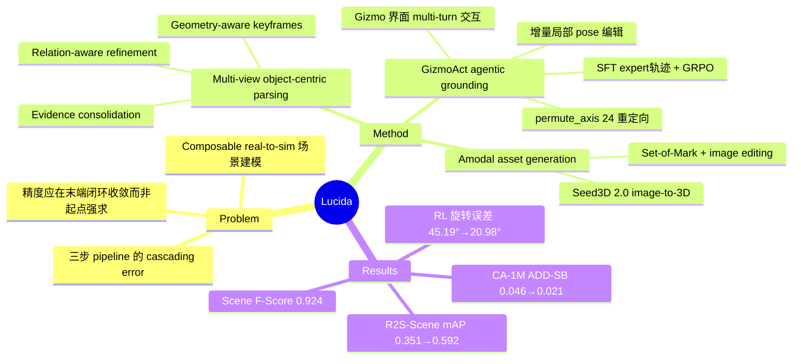

## Summary

Lucida 做 composable real-to-sim 室内场景建模（把真实场景恢复为可单独编辑的 object assets），保留 parse–generate–place 三步顺序但重新分配每步对输入的要求，使各阶段只消费真实拍摄可靠提供的信息；核心是 GizmoAct——把 9-DoF object placement 重构为 multi-turn gizmo 界面交互的 VLM policy（SFT + GRPO 训练），通过闭环视觉反馈增量修正 pose。在自建 R2S-Scene 上检测 mAP 从 Boxer 的 0.351 提到 0.592、场景重建 F-Score 达 0.924（SAM 3D 0.794），pose 估计在 R2S-Object / CA-1M / ADT 三个数据集上一致超过 RecGen 等 baseline。

## Problem & Motivation

现有 composable scene modeling 把重建拆为 parse（解析实例）→ generate（生成资产）→ place（放回场景），但每一步都要求真实杂乱拍摄很难提供的输入：精确的 instance geometry、无遮挡视角、与观测精确匹配的资产——上游误差会级联放大，精度被要求在流程起点就达到。作者的观察是：人类建模师不这么工作，他们先看素材识别物体、再建模或检索、最后通过闭环视觉反馈增量调整摆放——"Precision is reached at the end of this process, not demanded at its start"。Lucida 把这个 closed-loop 理念工程化到 pipeline 的最后一步。

## Method

**Stage 1 — Multi-View Object-Centric Scene Parsing**：
- *Geometry-aware keyframe selection + object discovery*：按 covisibility 与时间间隔选稀疏 keyframes，VLM 做实例识别、3D detector 出 box，跨帧按语义与几何一致性分组；
- *Full-sequence evidence consolidation*：为每个 object 选 representative 3D box，投影到全序列作为 per-frame 估计的 prompt，配合 video segmentation/tracking 找回更多观测，并按几何一致性过滤；
- *Relation-aware scene refinement*：跨物体比对外观/几何纠正错误分组，推断 support/containment/adjacency 空间关系，为缺失的支撑物补搜视角。
输出：scene graph + 每实例 evidence bundle（多视角观测、mask/box、partial point cloud、representative 3D box、类别描述）。

**Stage 2 — Amodal Object Asset Generation**：从 evidence bundle 选互补视角（清晰可见 + 视点多样），Set-of-Mark prompting 组织多视图，VLM 产出编辑指令，image-editing 模型合成完整、孤立的物体图像，再由 Seed3D 2.0 image-to-3D 转成资产；用 representative box 粗初始化，交给 GizmoAct 精修。

**Stage 3 — Agentic 3D Grounding（GizmoAct）**：把 placement 建模为 multi-turn GUI 式交互而非一次性 6/9-DoF pose 回归。状态 x_t = (p_t, R_t, s_t)。
- *观测界面*：渲染场景点云 + 3D 模型叠加 + 黄色 3D box + 暴露 object 局部坐标系的 RGB gizmo 轴；主视图（输入 + 渲染）、辅助视图（多视角证据）、正交视图三路互补；遮挡区域覆半透明绿色做深度消歧。
- *动作空间*：`update_pose` 在 gizmo frame 下做增量编辑（"the policy never predicts an absolute pose"）——平移/缩放相对当前物体尺寸表达，免去 metric scale 估计，旋转用 ZXY Euler delta；`switch_obs` 切换到沿六个 signed axes 的正交渲染；`permute_axis` 一步在 24 种 axis-aligned reorientation 中选择（主视图很少暴露资产朝向，大旋转残差用 Euler delta 修有 gimbal lock 风险，故离散化粗旋转）；`stop`。动作以 XML tag + JSON payload 写出，每轮恰一个，非法 payload 由环境拒绝。
- *训练*：(1) SFT 于合成 expert trajectories，三个数据源——Populated 3D-FRONT（干净几何 + 密集桌面摆放）、FoundationPose 风格重贴纹理资产（随机光照 + 重遮挡）、CA-1M objects（生成资产，几何从精确到明显失配）；privileged expert 掌握目标 pose，按 rotation → translation/scale 顺序修复；rollout 中注入损坏的 update_pose 与错误/跳过的 permutation（仅当 expert 仍能到达目标时保留），loss 中 mask 掉注入错误。(2) GRPO RL：reward 按 generalized 3D IoU（档位边界 0.75/0.85/0.925）与 geodesic rotation error（30°/10°/5°）两轴各量化四档组合；K=8 rollouts + dynamic sampling（剔除结果全同的 group）；DAPO 式 token-level clipped objective（asymmetric clipping + truncated importance sampling），无 KL penalty。

**Stage 4 — Scene Composition**：物体组装为完整场景，输出 object-centric scene graph（资产、pose、scale、类别、空间关系）；可选 postprocessing 精修 support/collision/contact 一致性。

## Key Results

- **场景级 3D 检测**（Table 1，class-agnostic AP @ IoU 0.05–0.50 平均）：R2S-Scene all protocol 上 Lucida mAP 0.592 vs Boxer 0.351（≈69% 相对提升；Boxer 取其最优的 all-prompt-frames 配置）；CA-1M all 上 0.180 vs 0.171，四种 protocol 全部最高。
- **Object pose 估计**（Table 2）：CA-1M 上 GizmoAct（max 4 views）ADD-SB 0.021 / ADD-SB@0.05 83.4% / 3D IoU 0.607，对比 RecGen（2 views）的 0.046 / 57.3% / 0.400；R2S-Object 上 0.017 / 92.0% / 0.719；ADT 上 0.021 / 90.0% / 0.670，三个数据集一致领先。
- **初始化鲁棒性**（Table 3）：同一个 policy 不需 retraining 即可适配 Boxer / Any6D* / SAM 3D 三种 initialization；noisy depth（R2S-Object、CA-1M）下 Boxer 初始化最好，exact depth（ADT）下 Any6D*/SAM 3D 更优。
- **场景重建**（Table 4，R2S-Scene）：scene CD 0.010 / F-Score 0.924 / BBox IoU 0.495，对比 SAM 3D 的 0.022 / 0.794 / 0.396 与 SceneGen 的 0.428 / 0.351 / 0.092；object-level F-Score 0.704 → 0.736。
- **Parsing ablation**（Table 5，注意在 R2S-Scene 的一个 subset 上评测，full model F-Score 0.831 与 Table 4 的 0.924 不直接可比）：uniform keyframe sampling 使 mAP 0.597 → 0.516；去掉 evidence consolidation 使 F-Score 降至 0.734、GT-to-pred CD 0.011 → 0.025；去掉 relation refinement 使 mAP 降至 0.526。
- **SFT vs RL**（appendix companion table，110 个 asymmetric objects 的 hard subset）：RL 把 rotation error 从 SFT 的 45.19° 降到 20.98°，Rotation@5° 从 52.7% 升到 67.3%；RL 训练时把初始 pose 分布对齐 Boxer 输出（而非随机扰动）在所有指标上更好。
- **自建 benchmark**：R2S-Scene（真实场景重建评测）与 R2S-Object（125 objects / 64 categories，对齐 LiDAR 点云的人工 9-DoF pose 标注）均为本文新建。

## Evidence Ledger

| Claim ID | Claim | Type | Source locator | Evidence excerpt | Status |
|:--|:--|:--|:--|:--|:--|
| C1 | R2S-Scene all protocol：Lucida mAP 0.592 vs Boxer 0.351 | number/comparison | Table 1 | "Boxer (all) 0.351 … Lucida (key) 0.592" | source-verified |
| C2 | R2S-Scene 重建：F-Score 0.924 vs SAM 3D 0.794 / SceneGen 0.351；CD 0.010 vs 0.022 | number/comparison | Table 4 | "SAM 3D CD 0.022, F-Score 0.794; Ours CD 0.010, F-Score 0.924" | source-verified |
| C3 | CA-1M：GizmoAct ADD-SB 0.021 / @0.05 83.4% vs RecGen(2v) 0.046 / 57.3% | number/comparison | Table 2 | "RecGen (2 views) 0.046 / 57.3% … GizmoAct (max 4 views) 0.021 / 83.4%" | source-verified（原稿 57.8% 系 1-view 行，已修正） |
| C4 | placement 建模为 multi-turn gizmo 交互：局部增量编辑 + switch_obs + permute_axis(24) | causal-mechanism | Method §GizmoAct | "every update is an incremental edit … the policy never predicts an absolute pose" | source-verified |
| C5 | SFT（3 数据源 + privileged expert + error injection masking）→ GRPO（两轴四档 reward、K=8、无 KL） | mechanism | Method §2.3.4–2.3.5 | "quantized into four levels … g=0.75, 0.85, 0.925, eR=30°, 10°, 5°" | source-verified |
| C6 | hard subset（110 asymmetric objects）：RL 旋转误差 45.19°→20.98°，@5° 52.7%→67.3% | number | appendix companion table（未编号） | "SFT 45.19°/52.7% → RL 20.98°/67.3%" | source-verified |
| C7 | uniform keyframe sampling 使 mAP 0.597→0.516 | number | Table 5 | "uniform sampling reduces mAP from 0.597 to 0.516" | source-verified |
| C8 | R2S-Scene/R2S-Object 为本文新建；R2S-Object 125 objects / 64 categories，人工 9-DoF 标注 | benchmark-setting | Experiments §benchmark | "125 objects from 64 categories … manually annotate a 9-DoF pose" | source-verified |
| C9 | 单一 policy 免 retraining 适配 Boxer/Any6D*/SAM 3D 初始化 | comparison | Table 3 | "one GizmoAct policy adapts to different pose initializations without retraining" | source-verified |
| C10 | limitation：parsing 漏检无法被下游找回；agentic refinement 仅在最后 placement 步 | limitation | Conclusion | "objects that remain missing after scene parsing cannot be recovered" | source-verified |
| C11 | 机构：ByteDance Seed、Peking University、Zhejiang University | metadata | author block | "ByteDance Seed; Peking University; Zhejiang University" | source-verified |
| C12 | Table 5 full model F-Score 0.831 与 Table 4 的 0.924 差异来自 subset 设置 | consistency | Table 4 vs Table 5 正文 | "scene reconstruction on an R2S-Scene subset after the same downstream … pipeline" | source-verified |
| C13 | image-to-3D 用 Seed3D 2.0；GizmoAct base VLM 名称/大小全文未披露 | license-code | §2.2 / acknowledgments | "we generate object models with Seed3D 2.0 (Gu et al., 2026)" | source-verified |
| C14 | 项目页 https://lucida-r2s.github.io/ ；截至 2026-09-02 未发布代码 | license-code | abs 页 comments + 项目页 | comments: "Project Page: this https URL"（项目页无 GitHub 链接） | source-verified |

## Strengths & Weaknesses

**亮点**
- **责任重分配的 pipeline 哲学**：不追求每步一次到位，而是让 parse 只产出真实拍摄可靠提供的 evidence bundle，把精度收敛推迟到有闭环反馈的 placement 环节——这是对 cascading error 问题的 formulation 级回应，而非在单点模块上加补丁。
- **GizmoAct 的问题重构有普适启发**：把连续 9-DoF 回归改写为 multi-turn 界面交互，三个设计各自消掉一类难点——局部增量编辑消掉绝对 metric scale 估计、相对尺寸表达消掉单位歧义、permute_axis 用 24 离散重定向消掉大旋转的 gimbal lock。这实质是把 GUI agent 的"渲染观测 + 离散化动作 + 可执行语法"范式移植到 3D 空间任务。
- **训练配方完整且有证据**：privileged expert + error injection（教会修错而非只学干净轨迹）+ 两轴量化 reward 的 GRPO；RL 对旋转的提升（45.19°→20.98°）和"训练初始分布对齐部署初始化"的增益都有 ablation 支撑。
- 单一 policy 跨三种 initializer、三个数据集免调优，泛化证据比常见 pose refinement 工作扎实。

**局限**
- **可复现性弱**：base VLM 名称与参数量全文未披露（acknowledgments 仅感谢提供 pretrained VLM），资产生成依赖闭源 Seed3D 2.0，且截至笔记日无代码发布——核心贡献 GizmoAct 目前无法被外部复现。
- **自建 benchmark 既当运动员又当裁判**：最强的提升（mAP +69%）在自建 R2S-Scene 上，规模也小（R2S-Object 仅 125 objects）；在第三方 CA-1M 上检测提升要小得多（0.171→0.180，all protocol）。
- **闭环只覆盖最后一步**：作者自认 parsing 漏检的物体下游无法找回；parse 与 generate 阶段仍是开环，cascading error 只被缓解在 placement 环节。
- 重建指标是几何层面的（CD/F-Score/IoU）；正文未见对仿真物理可用性（碰撞体、质量、摩擦等）的评估——"simulation-ready" 的主张目前只在几何摆放意义上成立（推测：物理属性需另行赋予）。

## Mind Map

## Notes

- GizmoAct 与 GUI agent 研究的接口值得关注：它本质是把"screenshot 观测 + 结构化动作语法 + multi-turn RL"的 computer-use 训练范式用于 3D 空间任务，reward 却来自几何 ground truth 而非任务完成判定——是 GUI 交互范式向非 GUI 任务外溢的一个数据点（但它不研究真实 UI，故未挂 gui-agent umbrella tag）。
- Table 5 ablation 的 F-Score（0.831）在 R2S-Scene subset 上评测，与 Table 4 主结果（0.924）不可直接比较，引用时注意。
- 项目页：https://lucida-r2s.github.io/（无代码）。若后续放出 GizmoAct 代码，可考虑 repo-digest 深挖交互环境实现。
