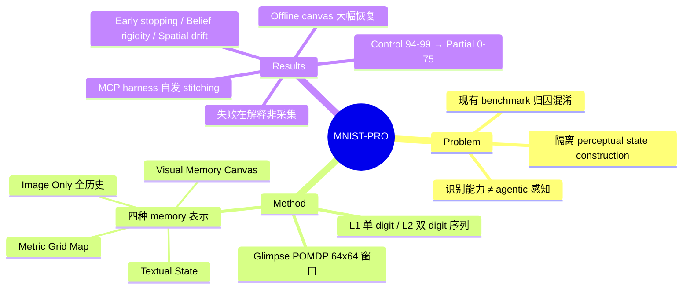

## Summary

把 MNIST 改造成 glimpse 式 POMDP 探索环境（agent 每步只看到 224×224 / 224×448 画布上的一个 64×64 局部窗口），在剥离 low-level control 干扰的最小视觉域里单独测量 multimodal agent 的 perceptual state construction 能力。对 10 个模型 × 4 种 memory 表示的评测显示：full observability 下 94-99% 的识别准确率在 partial observability 下崩到 0-75%，且事后把同一轨迹的 glimpse 拼成 offline canvas 就能大幅恢复——错误主要出在对已采集证据的组织与解释，而非证据采集本身。

## Problem & Motivation

现有 benchmark 无法干净地归因"感知状态构建"失败：标准多模态 benchmark（MMBench、MMMU）把全部视觉输入连同问题一次性给出，不要求推理期间主动收集证据；active vision 类 benchmark（ActiView、ActiveVision）不区分"维护 task-relevant perceptual state 的 agent"与"靠反复重访/保留低层视觉观测的 agent"；embodied 3D benchmark（ALFRED 等）的模拟导航与物体交互引入 low-level execution failure，使失败无法归因到 perception / memory / planning / control 中的哪一环。作者的核心观察：MNIST 上强大的静态识别能力并不能转化为有效的 agentic perception——agent 必须随时间主动收集、整合、保留并解释观测。

## Method

**POMDP 环境**。State 为全局画布 I 与 glimpse 窗口位置 p_t 的笛卡尔积；Level 1 画布 224×224（单个居中 digit），Level 2 画布 224×448（两个 digit 水平拼接，需按序识别）。Observation 为默认 64×64 的局部窗口，窗口外像素被 mask 成灰色。Action 为 {up, down, left, right} 移动（步长 δ=32 像素，位置 clip 在画布内）加终止预测。Step budget 由画布尺寸/步长的 ceiling 乘积决定：Level 1 为 36 步，Level 2 为 78 步。数据来自标准 MNIST（反色、上采样到 224×224、阈值 200 二值化）。

**Agentic loop 的因子化**。显式区分 perceptual state 的构建 z_t = F(z_{t-1}, o_t, p_t)、解释 r_t = R(z_t)、预测与动作选择，从而把"construction"与"interpretation"分开诊断。

**四种 memory 表示**（核心自变量）：
1. **Image Only**（ℋ=∞）：保留全部 glimpse 视觉历史 + 动作日志，无需书面状态；
2. **Textual State**（ℋ=1）：每步生成 free-form 文本 thought，零视觉回看；
3. **Metric Grid Map**（ℋ=1）：结构化空间记忆，以起点为原点做 in-context path integration（x_t = x_{t-1} + Δ(a_{t-1})），输出 JSON 格式的 thought/action/spatial_map；
4. **Visual Memory Canvas**：环境程序化地把 glimpse 按坐标整合进一张画布；online 版每步同步更新并随观测一起给 agent，offline 版从已记录轨迹事后重建，仅用于反事实诊断。

**评测对象**：8 个专有模型（Gemini-3.1-Pro-Preview、Gemini-3.6-Flash、Gemini-3.7-Flash、Claude-5-Sonnet、Claude-5-Opus、Claude-5-Fable、GPT-5.6-Terra、GPT-5.6-Sol）+ 2 个开源模型（Qwen-3.8-27B、GLM-4.6V）。

## Key Results

- **识别 ≠ agentic 感知**（Table 1）：Gemini-3.7-Flash control（全图）98.0/97.0（L1/L2）→ multi-turn partial observability 75.0/47.0；Claude-5-Sonnet 94.0/90.0 → 23.0/0.0。多数模型 Level 2 直接归零。
- **无 memory 表示一致胜出**（Table 2）："no single representation consistently dominating across multimodal agents"——textual / grid map / image-only 的排序随模型与任务级别翻转。
- **错误在解释而非采集**（Table 3）：把同一探索轨迹事后拼成 offline canvas 再让模型判读，Claude-5-Opus L1 41.0→76.0、L2 13.0→67.0。作者据此把大部分错误定位到"对已积累观测的组织与解释"，而非证据获取。
- **三类失败模式**（Sec 3.4.1）：(1) **early stopping**——Level 2 有 323 个 prediction 只报一个 digit，其中 238 个从未探索过另一个 digit 的任何像素；(2) **belief rigidity**——抽查 39 个案例中 17 例把错误 digit identity 写入 textual state，其中 15 例保留到最终预测，无视后续反证；(3) **spatial drift**——书面状态声称在探索新区域，实际动作却在重访旧位置。
- **覆盖率与准确率脱节**（Fig 3c）：最小 digit 覆盖率 ≤25% 时 accuracy 仅 1.0%，但覆盖率 >75% 时也只有 26.0%——"看到"不是主要瓶颈，失败发生在 working memory 的组织/存储/解释。
- **Agentic harness 能部分补救**（Table 4）：给 Gemini-3.7-Flash 配 agentic MCP harness（可写代码），L1 88.0%、L2 63.0%，探索步数约 2.8×（15.67 vs 5.56）；模型自发写出 stitch.py 等脚本做 visual stitching。加 persistent memory 反而不增益（88.0/63.0 → 85.0/62.0）。
- **Ablation**：视觉历史从 ℋ=1 放开到 ∞，Gemini-3.7-Flash Textual State L1 54→64、L2 6→23（Table 7）；glimpse 窗口从 32×32 增大到 128×128，L2 Image Only 从 3% 升到 74%（Table 8）——任务难度对观测窗口尺寸高度敏感。
- **拓扑复杂度效应**（Table 6，定性）：简单笔画 digit（1、4、7）最容易，闭环 digit（0、6、8、9）最难；metric grid map 改善曲线类 digit（Gemini-3.7-Flash curves 36.7→56.7）但损害闭环类（loops 57.5→45.0）。

## Evidence Ledger

| Claim ID | Claim | Type | Source locator | Evidence excerpt | Status |
|:--|:--|:--|:--|:--|:--|
| C1 | POMDP 设定：画布 224×224 (L1) / 224×448 (L2)，glimpse 64×64，δ=32，budget 36/78 步 | benchmark-setting | Sec 2 (environment/POMDP) | "224×224 pixels"; "224×448 pixels"; "64×64 pixels"; "δ=32 pixels"; "36 steps"; "78 steps" | source-verified |
| C2 | 评测 10 个模型（8 专有 + 2 开源）× 4 种 memory 表示 | benchmark-setting | Experimental setup | "Gemini-3.1-Pro-Preview, Gemini-3.6-Flash, Gemini-3.7-Flash, Claude-5-Sonnet... Qwen-3.8-27B and GLM-4.6V" | source-verified |
| C3 | Gemini-3.7-Flash control 98.0/97.0 vs multi-turn 75.0/47.0；Claude-5-Sonnet 94.0/90.0 vs 23.0/0.0 | number | Table 1 | Gemini-3.7-Flash 98.0/97.0 control vs 75.0/47.0 multi-turn; Claude-5-Sonnet 94.0/90.0 vs 23.0/0.0 | source-verified |
| C4 | Offline canvas 使 Claude-5-Opus L1 41.0→76.0、L2 13.0→67.0；错误归因于证据组织/解释 | number / causal-mechanism | Table 3 及正文 | "gains localize much of the error downstream of evidence acquisition, to the organization and/or interpretation of accumulated observations" | source-verified |
| C5 | Level 2 有 323 个 prediction 只报一个 digit，其中 238 个从未探索另一 digit 的像素 | number | Sec 3.4.1 | "323 of the predictions predicted just one digit"; "238... never explored any pixel of the other digit" | source-verified |
| C6 | Belief rigidity：39 个抽查案例中 17 例出现错误 belief，其中 15 例保留至最终预测 | number | Sec 3.4.1 | "We examined 39 such cases and found that this occurred in 17 cases. Of these 17 cases, 15 retained the incorrect identity" | source-verified |
| C7 | 覆盖率 ≤25% 时 accuracy 1.0%，>75% 时仅 26.0%；失败在 working memory | number / causal-mechanism | Fig 3c 及正文 | "exact-sequence accuracy is just 1.0%"; "the failure happens in working memory, where models struggle to organize, store, and interpret" | source-verified |
| C8 | MCP harness 下 Gemini-3.7-Flash L1 88.0 / L2 63.0，步数 2.8×（15.67 vs 5.56）；自发 visual stitching；persistent memory 不增益 | number | Table 4 / harness 节 | "writes programs such as stitch.py and render_mnist.py"; persistent memory 85.0/62.0 vs 88.0/63.0 | source-verified |
| C9 | Glimpse 32×32→128×128 使 Gemini-3.7-Flash L2 Image Only 3%→74% | number | Table 8 | 32×32: "3%"; 64×64: "22%"; 128×128: "74%" | source-verified |
| C10 | 定性排序：strokes (1,4,7) 最易、loops (0,6,8,9) 最难；grid map 改善 curves（36.7→56.7）但损害 loops（57.5→45.0，Gemini-3.7-Flash） | comparison | Table 6 / topology 节 | "Simple strokes like 1, 4, and 7 are the easiest... closed loops like 0, 6, 8, and 9 are the most difficult" | source-verified |
| C11 | 四种 memory 表示无一致赢家 | comparison | Memory-representation 结果节 | "with no single representation consistently dominating across multimodal agents" | source-verified |
| C12 | ℋ=1→∞ 使 Gemini-3.7-Flash Textual L1 54→64、L2 6→23 | number | Table 7 | Textual State ℋ=1→ℋ=∞: 54%→64% (L1), 6%→23% (L2) | source-verified |
| C13 | License CC BY-SA 4.0；正文未给出 GitHub/code URL | license-code | arXiv 页 header / 全文检索 | "License: CC BY-SA 4.0"; no GitHub/code/dataset URL found in body | source-verified |

> 核查备注：C6 原始表述"39 例中 15 例保留错误 identity"经 verifier 更正为完整链条 39 → 17（出现错误 belief）→ 15（保留至终）。C10 原始版本含 "~60%/40%/30%" 聚合成功率，verifier 判 unsupported（该聚合数字不见于原文，且 Table 6 各配置均值下 loops 与 curves 接近），已删除并降级为原文的定性排序 + Table 6 已核实数字。

## Strengths & Weaknesses

**亮点**
- **诊断设计干净**（已知）：用 2D 确定性环境剥离 low-level control 与 3D 感知噪声，把失败严格限定在 perception–memory–interpretation 链条内，正面回应了 ALFRED 类 benchmark 的归因混淆问题。
- **Offline canvas 反事实是全文最聪明的一招**（已知）：同一条探索轨迹，只换证据呈现方式就 +35~54 个百分点，把"采集失败"与"解释失败"干净分离——这是一般 agent benchmark 给不出的归因粒度。
- **失败模式可操作**（已知）：early stopping / belief rigidity / spatial drift 三类都有量化证据，且覆盖率-准确率脱节直接指向 working memory 而非 exploration policy，为后续方法（如程序化 stitching、显式 canvas 记忆）给出明确靶点。

**局限**
- **规模与统计强度**（已知）：每任务 100 个 episode、无 error bar，模型间几个点的差距不可过度解读。
- **外推性存疑**（推测）：二值化 MNIST 是极端简化的视觉域；"canvas 拼接即可恢复"这一结论依赖 glimpse 可无损坐标对齐，自然场景（视角变化、遮挡、光照）下 perceptual state 无法这样程序化整合，结论能否迁移未知。
- **环境完全确定、动作语义已知**（已知）：不考察 agent 对未知 dynamics 的推断；与其说是"world"，更接近一个 2D active perception 探针。
- **代码未见链接**（已知）：正文未给出 repo URL，复现暂依赖论文描述。

**影响**：给 "agent 需要显式 perceptual state / working memory 机制" 这一主张提供了目前最干净的行为学证据；harness 实验（模型自己写 stitch.py 补记忆短板）暗示短期内工具化外置记忆比模型内生记忆更可行。

## Mind Map

## Notes

- 与 vault 中 agent memory / 空间记忆方向的笔记形成互补：本文提供的是"memory 表示选择在最小环境下的受控对照"，而非新记忆机制。
- 正文还报告 online canvas（每步同步整合）不如 offline canvas，作者假设逐步整合会干扰探索本身（此比较未逐项核查，引用时建议回原文确认数字）。
- 开放问题：belief rigidity 是 in-context 现象还是可被 RL 训练修正？本文纯 evaluation，未提供训练侧干预。
