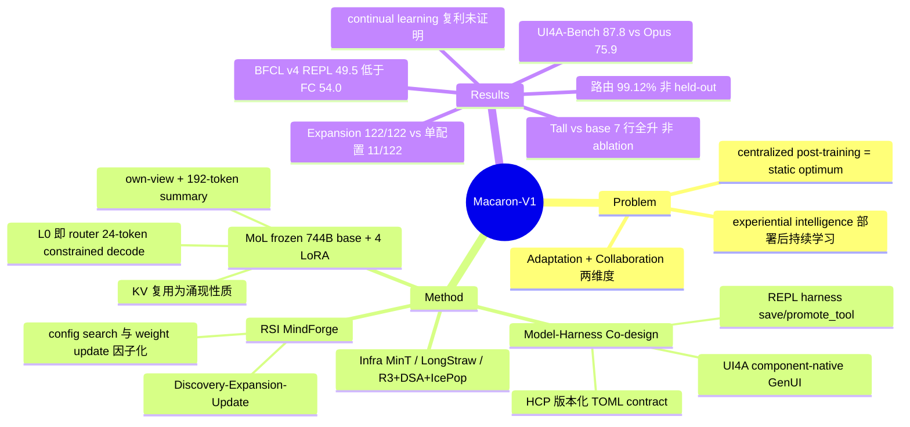

## Summary

Mind Lab(Mindverse)的开放 agent 模型技术报告(49 页,团队署名,附录列 75 位贡献者):用 Mixture-of-LoRA(MoL)在 frozen 744B GLM-5.2 base 上组合四个 specialist LoRA(L0 Chat / L1 Agent / L2 Coding / L3 GenUI),由 L0 兼任 per-turn router;配套 Model–Harness Co-design(UI4A GenUI harness、REPL agent harness、Harness Context Protocol)与 MindForge 三阶段 recursive self-improvement(RSI)循环,以及 MinT / LongStraw 训练基建。主结果:自建 UI4A-Bench Final Score 87.8 大幅领先(Opus 4.8 75.9),内部 Personal Intelligence benchmark 小幅领先;而标题承诺的 continual learning 复利与 collective intelligence,作者自己明确标注为尚未验证的 open question。

## Problem & Motivation

作者的出发点是对 centralized post-training 范式的批评:模型在一个有界的任务/环境快照上优化后固化为 checkpoint 发布,只是逼近 static optimum,而部署后新知识、新工具、新用户需求持续到来,系统缺乏把执行经验转化为系统性改进的机制。他们主张 **experiential intelligence**——从真实环境经验中学习并在部署后持续学习——并将其拆成两个互补维度:

- **Adaptation**:在显式版本化的 model–harness pair 上做递归改进——一个版本产生的经验在外部 contract 下评估,用于构造后继版本;
- **Collaboration**:通过组合表达能力——joint post-training 在共享参数空间可能产生 cross-task interference,因此让 specialist 保持可分离,frozen base + LoRA 组合。

值得注意的边界:论文明确说 cross-task interference 是 MoL 的**设计动机而非本报告的实证发现**——本 release 没有做量化它所需的 budget-matched single-LoRA 对比(C10)。

## Method

**1. Mixture-of-LoRA(MoL)架构**(Section 2)。frozen 744B GLM-5.2 base + 四个 rank-16 / alpha-32 LoRA specialist,每个 adapter 存储值 7,688,042,496(release 标号 748B 只是 label,C1);50B 的 Macaron-V1-Tall(Qwen3.6-35B-A3B base,rank 64)同构。核心设计:
- **L0 即 router,无独立 router 模型**:每个 user turn 走 route(L0 在 24-token 预算下 constrained decoding 出 L0–L3 之一)→ answer(选中 specialist 生成)→ summary(≤192 token,server-side 保存)三段循环;
- **Per-adapter own-view**:每个 specialist 只看到自己的完整历史 + 其他 specialist 每 turn 压缩成的 192-token summary,不泄露他人完整 trace;own-view 确定性重建使 re-entry 产生 byte-identical prefix,engine 原生 prefix cache 自然命中——KV 复用是稳定 prompt 的涌现性质,不需改 vLLM/SGLang;
- **部署账**:MoL 存一份 base + ~30.8B adapter 值(≈774.8B logical params),对比四份 merged base 的 2.976T,存储减少 74.0%(C5)。

**2. Model–Harness Co-design**(Section 3.1)。harness 被当作一等训练对象:**UI4A**(component-native GenUI:模型写普通前端代码,在 runtime-enforced boundary 内,Action contract 带 NoAI visibility 字段);**REPL agent harness**(持久 Python namespace 做 executable composition;save_tool/promote_tool 两段制——helper 先过 held-out 私有验证再晋升共享);**HCP**(版本化 TOML contract,把 prompts/tools/skills/hooks/workspace 变成可移植可审计的 artifact)。base、specialist、harness 三个 release clock 解耦。

**3. Recursive Self-Improvement**(Section 3.2)。策略因子化为 π_φ(a|o;θ,c):θ frozen base、φ 可训 LoRA、c 版本化 harness 配置——**明确区分 weight update(GRPO 训 adapter)与 configuration search(language-space 改 HCP)两条更新路径**。MindForge 管 Discovery(模型自出更难任务)→ Expansion(生产 harness 中执行+审计,搜索配置)→ Update(筛选 trajectory 训 adapter,注册新 HCP)的 lineage。本报告的实验**只隔离 Expansion 阶段**:122 个 TerminalBench 2.1 派生任务(选取标准就是 frozen base 官方 reward 下 0/122 全挂),69 个 job 的自适应配置搜索在**零权重更新**下累计覆盖 122/122,而最好的单配置全集 sweep 只有 11/122(C6)。

**4. Infrastructure**(Section 4)。MinT(adapter revision 与 policy record 分离;10^6 条 adapter catalog 寻址性验证,C14);LongStraw(response-only 长上下文 GRPO:prompt 无 autograd 捕获、response 逐条 replay,2,097,152-token 级 execution receipt 来自 companion report,C13);sparse base 的 rollout–training mismatch 控制(R3 expert 路由重放 / DSA 实现对齐 / IcePop 式 token 过滤)。

## Key Results

- **路由功能性**(C2, C3):6,448 样本 trace 上 99.12%(Tall 99.04%),但 trace 取自 LoRA 训练数据、非 held-out——是实现诊断不是泛化估计;route+summary 开销约占三 hop 总时长 32%(Venti 0.54s+0.97s)。
- **路由不伤质量**(C4):Vita delivery 三臂(各 5 seed,unpaired):direct 0.636±0.026 / routed KV-off 0.650±0.030 / KV-on 0.632±0.019,未检出退化,但不构成等价性证明。
- **主表**(C7,Table 8,12 行,标星值为公开榜单导入):ChatBench 58.3(GPT-5.5 55.5)、LivingBench 64.0(Opus 4.8 63.8)、UI4A-Bench 87.8(Opus 75.9 / GPT-5.5 72.1)、TerminalBench 2.1 87.6、SWE-Verified 85.6;但 VitaBench 60.0 低于 Qwen 3.7 Max 61.2,ClawGym 77.7 低于 GPT-5.5 82.5,DeepSWE 58.4 低于 GPT-5.5 70.0——优势集中在自建 benchmark 与 terminal。
- **Tall vs base**(C8):7 个共测行点估计全升(+1.3 到 +25.4),但这是 end-to-end 系统对比,非参数匹配 ablation,无法归因。
- **Expansion coverage**(C6):122/122 vs 单配置 11/122——frozen model 下纯 harness/配置搜索把"全挂"集合全部覆盖。
- **UI4A token 效率**(C9):48-case gallery 上 672 vs 1,224 tokens(-45%),描述性对比,不控质量。
- **负面结果**(C11, C15):companion BFCL v4(200 任务)REPL 49.5% < function calling 54.0%(observe-before-commit API 不适合 REPL);Tall 多模态 retention 混合——MME perception 掉 52.99 分;长 session 多次 preference-drift 后有定性的 character stability 退化。

## Evidence Ledger

| Claim ID | Claim | Type | Source locator | Evidence excerpt | Status |
|:--|:--|:--|:--|:--|:--|
| C1 | Venti = frozen 744B GLM-5.2 + 4 个 rank-16/alpha-32 LoRA,每 adapter 7,688,042,496 stored values,748B 为 release label | number | Section 2.2 | "7,688,042,496 stored values per adapter…keep the 748B figure as the release-facing label" | source-verified |
| C2 | L0 即 router;6,448 trace(训练数据、非 held-out)上 6391/6448=99.12%,100% label 合规;Tall 99.04% | number | Section 2.3, Table 2 | "not an independent held-out split…6391/6448=99.12%…100% canonical-label compliance" | source-verified |
| C3 | route 0.54s + summary 0.97s ≈ 三 hop 总时长 32%(48 请求,temp 0) | number | Table 1, Section 2.3 | "Together they are 1.51 s, about 32% of the three-hop total" | source-verified |
| C4 | Vita 三臂:0.636±0.026 / 0.650±0.030 / 0.632±0.019,unpaired 5 seed,不构成等价性 | comparison | Table 3, Section 2.3 | "no detected degradation…do not establish equivalence" | source-verified |
| C5 | MoL ≈774.8B logical vs replicated 2.976T,存储减 74.0% | number | Section 2.6 | "about 26.0% of the replicated layout, a 74.0% reduction in stored parameter values" | source-verified |
| C6 | 122 个 base 全挂任务(29 个 TB2.1 families),69 job/450 attempts 自适应配置搜索零权重更新覆盖 122/122;最好单配置 sweep 11/122 | benchmark-setting | Section 3.2.5, Table 4, Fig 7 | "cumulative coverage of 122/122…the stronger of two full-set single-configuration sweeps reaches 11/122" | source-verified |
| C7 | ChatBench 58.3 / LivingBench 64.0 / UI4A 87.8 / TB2.1 87.6 / SWE-V 85.6;星号为导入值;ChatBench judge 为私有 GLM-5.2(与 base 同族) | benchmark-setting | Table 8, Section 6.2, App B.1 | "privately deployed GLM-5.2 judge…may favor outputs from the same model family" | source-verified |
| C8 | Tall 在 7 个共测行全部高于 Qwen3.6-35B-A3B base(+1.3~+25.4),非参数匹配 ablation | comparison | Table 9, Section 6.2 | "ranging from 1.3 points on Macaron LivingBench to 25.4 on UI4A-Bench…not a parameter-matched ablation" | source-verified |
| C9 | 48-case gallery:UI4A 672 vs raw HTML 1,224 tokens(约 -45%),描述性、不控质量 | number | Section 3.1.1, Fig 11 | "672 tokens and raw HTML 1,224 tokens…does not control for output quality" | source-verified |
| C10 | cross-task interference 是设计动机而非本报告实证;无 budget-matched single-LoRA 对比 | causal-mechanism | Section 2.1 | "a design motivation rather than an empirical finding of this report" | source-verified |
| C11 | companion BFCL v4(200 任务):REPL 49.5% vs FC 54.0%,负面结果 | benchmark-setting | Section 6.3 Remaining failures | "the REPL scores 49.5% versus 54.0% for function calling" | source-verified |
| C12 | harness 开源(MindLab-Research/Mixture-of-LoRA-Harness),Venti 权重在 HuggingFace,CC BY 4.0 | license-code | Section 7.1 + arXiv 页 | "github.com/MindLab-Research/Mixture-of-LoRA-Harness…License: CC BY 4.0" | source-verified |
| C13 | LongStraw 2,097,152-token receipts(Qwen 8×H20 / GLM 32×H20)来自 companion report,非 Macaron 训练证据 | number | Section 4.2, Table 5 | "condensed from the companion report rather than rerun in this paper" | source-verified |
| C14 | MinT 10^6 条 rank-1 adapter catalog 零 build error,为寻址性结果、非百万 adapter 常驻 GPU | number | Section 4.1 | "does not mean that one engine holds one million adapters in GPU memory" | source-verified |
| C15 | Tall(text-only adapter)多模态 retention:4 项点估计升、MME perception -52.99;无方差无 ablation | benchmark-setting | Table 10, Section 6.2 | "lower by 52.99 points on MME perception…do not establish preservation" | source-verified |

## Strengths & Weaknesses

**亮点**:
- **Evidence discipline 在同类技术报告中罕见**。全文系统性地主动划 evidence boundary:748B 是 label 不是 stored count、routing accuracy 明说非 held-out、122/122 明说是 adaptive coverage ceiling 不是单配置泛化、基建数字明说来自 companion report、导入值全部标星。对照多数厂商报告的 overclaim 习惯,这份报告本身可当负责任写作的样板。
- **Section 3.2.5 是最有信息量的实验**:122 个"frozen base 官方 reward 下全挂"的任务,零权重更新、纯 harness/配置搜索全部覆盖,而最好的单配置只能过 9%。这说明该 benchmark 切片上大量 failure 是 **elicitation failure 而非 capability failure**——对 harness 归因方向是一个强数据点(尽管作者也承认 adaptive search 的 coverage 不等于任何单配置的能力)。
- **MoL 的工程简洁性**:orchestration over merging——adapter selection 做成显式、可观察、可日志归因的 per-turn 动作;own-view 的确定性重建让 per-adapter KV 复用成为涌现性质而非引擎补丁。routing 开销(32% 三 hop)与质量三臂对比都有实测。
- 把 config search(language space)与 weight update(parameter space)在 π_φ(a|o;θ,c) 中因子化,并用 MindForge lineage 把两者绑成可审计的版本对,是对 self-evolving agent 文献中两条常被混谈路径的干净形式化。

**局限与边界**:
- **标题承诺的两件事都还没被证明**。continual learning 的跨代复利(RSI 的 Update 阶段没有在本报告中跑通并测量 transfer 泛化)与 collective intelligence(只测了自家 4 个 specialist,无跨团队/跨用户组合)均被作者自己列为 open question——本 release 是"一个快照 + 一套执行检查",不是 compounding 的证据。
- **内部 benchmark 有循环性**:ChatBench/LivingBench 与 RSI loop 共享 source domains 与 failure taxonomy,ChatBench judge 是 GLM-5.2(与 Venti base 同族,作者自认可能偏向 GLM 系输出);Personal Intelligence 领先幅度小(0.2~2.8 分)且无区间估计。外部 benchmark 上 Venti 在 VitaBench/ClawGym/DeepSWE/SWE Atlas 均非最高。
- **归因缺失**:MoL 的核心动机 cross-task interference 未量化(C10);Tall vs base 的全线提升无法拆到 specialization / routing / harness 任何一个组件;gains 来源"remains open and is not resolved by any controlled experiment in this release"(作者原话)。
- **数据治理与可复现性**:de-identified 产品对话的 consent 基础、去识别审计、per-specialist 训练规范均未记录,无独立 safety/red-team 评估——作者列为 material limitation。
- 路由假设每 turn 单 intent;多 intent 分解的 orchestrator 只有探索分支未上线。routing accuracy 在训练数据 trace 上测,部署分布下 L0/L1 边界(语义最近的两类)错误率未知。

**影响**:对 agent 系统方向,MoL 是"frozen base + composable specialists + 显式路由"这条路线目前最完整的开放工程实例(harness 开源、权重公开);RSI 部分更多是框架描述与单阶段测量。它对 harness 研究的间接贡献(3.2.5 + HCP 的配置可审计化)可能比其 continual learning 叙事本身更有引用价值。

## Mind Map

## Notes

- **与 harness 归因方向直接相关**:3.2.5 的"0/122 → 122/122 纯配置搜索"结果是 [[Harness-Component-Attribution]] 与 [[AgentHarness-Design]] 关心的核心问题(harness 分量在 agent 性能中的占比)迄今较强的数据点之一;HCP 把 prompts/tools/hooks 变成可版本化搜索空间的做法,与 [[2607-HarnessBank]]、[[2607-HarnessHandbook]] 的 harness 自进化路线可对照。
- **REPL harness** 与 [[2605-CodeAgentHarness]] survey 的 code-as-harness 视角一致;其 BFCL v4 负面结果(observe-before-commit API 上 REPL 反而更差)给出了该范式的适用边界,比多数只报正面结果的工作诚实。
- **与 [[2608-ZerothOrderSelfEvolve]] 对照**:两者都在 self-evolution 的信号来源上做文章——Macaron 的 AutoResearch 在 language/config space 搜索(不越过 base 能力边界,3.2.5 证明能"解锁"未激发能力),ZO 在参数空间搜索(试图越过边界)。Macaron 的 config-search/weight-update 因子化可作为 [[SelfEvolvingAgents-Survey]] 的一个分类维度并入。
- 开放疑问:(1) RSI Update 阶段的 transfer 泛化要等下一代 release 才有数据;(2) own-view 的 192-token summary 压缩在长 horizon 任务中丢多少信息,论文只有 5-seed Vita 的间接证据;(3) 四个 specialist 全部 rank 16 是否够用,论文未报告 rank ablation。
- 代码库为系统/基建类(serving harness),含 Proxy 路由、own-view 重建、KV overlay 实现,若 Supervisor 认为 MoL 工程细节值得深挖可另起 repo-digest:https://github.com/MindLab-Research/Mixture-of-LoRA-Harness
