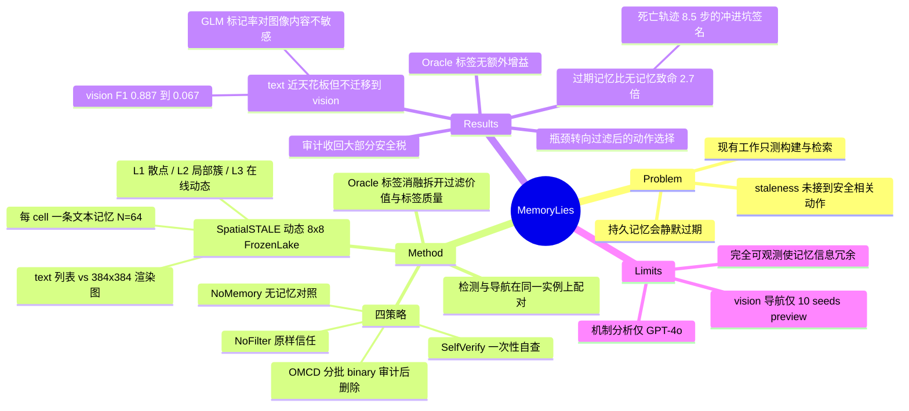

## Summary

在动态 FrozenLake 上把 spatial memory 的 staleness 检测与下游导航配对测量，发现 text 模式下接近满分的检测能力并不迁移到图像（vision F1 从 Qwen 的 0.887 一路跌到 GLM-5.1 的 0.067），而未经审计地信任过期记忆会把 GPT-4o 的死亡率从 28.0%（无记忆）推到 74.4%。读时过滤（OMCD）能收回 text 模式下的大部分安全损失，但把学得的 stale 标签换成 oracle 标签不再带来可检出的增益——瓶颈已经从"检测过期"移到"拿着过滤后的记忆做动作选择"。

## Problem & Motivation

持久记忆已经是 agent 的标配设计（Voyager 的 skill library、GITM 的层级轨迹记忆、Reflexion 的失败反馈、MemGPT 的分页上下文），但这些工作评测的是记忆的**构建、检索与复用**，没有一条链路去问：一条已经写下的空间断言，会不会在 agent 用它之前就悄悄失效？

相邻的两条线各自缺一半。文本事实的时效性研究（temporal validity 基准、weight editing）处理的是语言知识，不接动作；空间推理与幻觉基准（SpatialVLM、SpatialRGPT、POPE、HallusionBench）测的是**静态**观测下的表现，环境不变。缺的正是交叉点：一条与当前观测冲突的空间记忆，agent 在做出安全相关动作之前能不能发现冲突。

作者把这件事定义成一个安全问题而非精度问题——判断标准不是"检测 F1 多高"，而是"错过一条 stale 记忆会不会直接把 agent 送进坑里"。

## Method

**SpatialSTALE 环境**。8×8 FrozenLake 变体，约 25% 的格子是 hole。先在原始网格 g₀ 上生成一份持久记忆，每个 cell 一条自然语言断言（如 `SAFE at (2,5): Frozen ice, safe to walk`），覆盖固定为一 cell 一条、N=64。随后环境翻转非终止的 F/H 格子（保证仍存在通路），记忆保持不变。

**staleness 的形式化避开了语义匹配**。定义 hazard map h(H)=1、h(F)=h(S)=h(G)=0，条目 i 在时刻 t 为 stale 当且仅当 h(原始类型) ≠ h(当前类型)。于是 SAFE 条目 stale ⟺ 当前是 H，DANGER 条目 stale ⟺ 当前是 F，标注无需主观判断。

**三种 change regime**（Table 1）：L1 随机散点（请求翻转 5–7 格，实测 stale 率 9.4±1.1%）、L2 局部簇（12–16 格，14.1±1.4%）、L3 在线动态（每次事件 2 格，14.3±2.8%）。L1/L2 在导航前一次性检测，L3 每次真实发生事件后在下一个决策点重新检测。

**两种模态共享同一网格**。text 模式给坐标标注列表，vision 模式给 384×384 彩色渲染图，记忆两边都是文本。这是本文最关键的控制变量：同一份 ground truth，只换观测的呈现方式。

**四种记忆策略**（外加 Oracle 消融）：
- `NoMemory` — 提示中不含记忆，只看当前观测。这是测量"记忆税"必需的对照组。
- `NoFilter` — 64 条原始条目原样喂给导航器，不做一致性检查。
- `SelfVerify` — 导航前一次性把整个记忆库和当前观测放进一次查询，让模型自行剔除不一致条目。
- `OMCD` — 本文的受控干预：把 64 条按 B=10 分批，每批连同当前观测送给模型返回 binary `is_stale` 判断与简短理由，被判 stale 的条目直接从导航提示中移除；L3 下每次真实事件后重审。
- `Oracle` — 用 ground-truth stale 标签走 OMCD 的同一条过滤通道，用来把"过滤本身的价值"和"学得标签的质量"拆开。

两个设计细节值得记：用 binary 而非连续分数，是因为跨模型的分数校准不一致（同一个 s=0.6 对 GPT-4o 约对应 80% 真 stale 率，对 Claude 只有 35%，不存在通用阈值）；B=10 是成本/质量折中点。

## Key Results

**text 可解不等于 vision 可解。** text 模式下三个 closed-source 模型加 GLM-5.1 的平均检测 F1 都在 0.88 以上（两个小 InternVL3 checkpoint 例外：2B 约 0.22、8B 约 0.31）。换成同一批网格的渲染图，Qwen 基本不掉（ΔF1 = −0.011，不显著），Claude 中度退化（−0.134），GPT-4o 严重退化（−0.598），GLM-5.1 直接崩掉（−0.830），最好与最差之间差 13 倍（0.887 vs 0.067）。

作者对"是不是图根本读不了"做了两道排除。其一，Qwen 在**完全相同**的 384×384 渲染上保持了 text 级精度，说明输入本身可读。其二，Figure 4 给出一个内建的知觉对照：GLM 把一条 memory-safe 条目标为 stale 的比例，在 cell 真安全和 cell 实为致命 hole 两种情况下几乎一样（5.0% vs 4.5%，不显著，基于每模型 6,400 条 L1+L2 判断），而 Claude 把这两类分得很开（92.5% vs 1.4%）。一个**随图像内容反转而纹丝不动**的标记率，指向的是一条以记忆为准、对图像基本不敏感的规则，而不是识别能力缺失。GLM 的推理串里既无拒答也无"cannot / uncertain"这类不确定标记——流畅的推理文本完全不能作为视觉审计已经落地的证据。

GPT-4o 的失败形态与 GLM 不同：约 30% 的 L1 vision 回复出现"I cannot reliably determine the color at that coordinate"一类的回避，加上邻近 cell 的 F/H 标签系统性互换，结果是 precision 尚可但 stale recall 掉了约 3 倍。

**未经审计的过期记忆是净负资产。** GPT-4o L2 text 上，NoFilter 成功率 14.4%、死亡率 74.4%；同一个导航器完全不给记忆（NoMemory）反而是 28.8% / 28.0%。带着过期记忆比没有记忆致命 2.7 倍。轨迹形状证实了机制：GPT-4o 与 Claude 的 NoFilter 死亡分别终止在 8.5 步和 7.8 步，只有它们成功轨迹（14.5 / 14.6 步）的一半——这是"照着记忆冲进坑里"的签名，不是探索事故。反向的例子同样清楚：Claude 的 NoMemory 死亡是所有策略里最长的 16.1 步，属于探索到最后撞上一个没看到的洞。

**审计能收回大部分损失，但收不满。** OMCD 在 GPT-4o 的每个 regime 上都优于 NoFilter 和 SelfVerify，相对 NoFilter 的成功率增益从 L1 的 14.4 pp 涨到 L3 的 24.4 pp（p<0.001）；另外三个模型相对 NoFilter 的平均死亡率降幅是 Claude 38%、GLM 45%、Qwen 43%。但把过滤标签换成 Oracle 后，相对 OMCD 在任何 regime 都测不出差异（abs(Δ)≤0.02，p>0.2）——作者明确把这读作"在当前样本量下没检出增益"，而不是"两者等价"。

**瓶颈已经不在检测。** 两条独立证据指向同一结论。一是上面的 Oracle 空档；二是 GPT-4o text 上 per-seed 检测 F1 与 OMCD 成功率几乎零相关（Pearson r 在 +0.005 到 +0.060 之间，p 全部 >0.67），尽管 L1/L2 的 F1 已在 0.91 以上。更直接的证据是：所有 OMCD 在 L2 踩 stale cell 而死的案例，都发生在 F1 > 0.9 的 run 里——那条记忆**已经被检出并移除了**，agent 还是踩了上去。

**当视觉审计不可靠时，过滤不再有稳定收益。** vision 导航（Table 2，10 seeds × 3 episodes 的探索性 preview）里 GPT-4o、Claude、GLM 的成功率都很低，OMCD 没有一致改善；只有 vision 检测本就可靠的 Qwen 维持高成功率，但也没剩多少过滤空间。

**NoMemory 不是稻草人。** 在 Claude 和 Qwen 上，无记忆基线常常持平甚至优于 OMCD（如 Claude L1：NoMemory 68.8%/16.0% vs OMCD 60.0%/20.8%）。作者据此明确声明不主张 OMCD 普遍优于 memoryless reasoning，只主张"一旦你必须消费一个持久记忆库，逐条审计比原样信任更安全"。

## Evidence Ledger

| Claim ID | Claim | Type | Source locator | Evidence excerpt | Status |
|:--|:--|:--|:--|:--|:--|
| C1 | detection 总计 1,800 runs = 6 models × 50 seeds × 3 regimes × 2 modalities | number | §5.1 Setup, "Scale" | "Detection covers 6 models × 50 seeds × 3 regimes × 2 modalities, totaling 1,800 runs." | source-verified |
| C2 | text-mode navigation 共 12,000 episodes，每个 model–strategy–regime cell 聚合 250 episodes | number | §5.1 Setup, "Scale" | "50 shared seeds × 3 regimes × 4 strategies × 5 episodes per model, so every model–strategy–regime cell aggregates 250 episodes" | source-verified |
| C3 | 6 个受测模型 = 3 closed-source（GPT-4o / Claude-Sonnet-4.6 / Qwen3.6-Plus）+ 3 open-weight（GLM-5.1 / InternVL3-2B / InternVL3-8B）；text 导航只用其中 4 个 | benchmark-setting | §5.1 Setup; Table 3 | "three closed source models (GPT-4o, Claude-Sonnet-4.6, Qwen3.6-Plus) and three open weight VLMs (GLM-5.1, InternVL3-2B, InternVL3-8B)" | source-verified |
| C4 | text 模式下 3 个 closed-source 与 GLM-5.1 平均 F1 > 0.88；InternVL3-2B 约 0.22、8B 约 0.31 | number | §5.2, Figure 3 | "all achieve average text F1 above 0.88 … the 2B checkpoint averages about 0.22 F1 in text and the 8B about 0.31" | source-verified |
| C5 | vision 检测 F1 跨度 0.887（Qwen）至 0.067（GLM-5.1），相差 13 倍 | number | §5.2 | "The best and worst vision models differ by a factor of thirteen (Qwen 0.887 versus GLM 0.067)." | source-verified |
| C6 | vision 相对 text 的 ΔF1：Qwen −0.011（不显著）、Claude −0.134、GPT-4o −0.598、GLM-5.1 −0.830 | number | §5.2 | "Qwen preserves text-level accuracy (ΔF1 = −0.011, not significant), Claude degrades moderately (ΔF1 = −0.134, p<1e-7)" | source-verified |
| C7 | GPT-4o L2 text：NoFilter 14.4% SR / 74.4% death，NoMemory 28.8% / 28.0%，即 2.7 倍致命 | number | §5.3, Table 3 | "trusting stale memory achieves 14.4% success and 74.4% death, while discarding memory entirely achieves 28.8% success and 28.0% death" | source-verified |
| C8 | GPT-4o OMCD L2 为 32.8% / 31.6%；OMCD 在每个 regime 均优于 NoFilter 与 SelfVerify，SR 增益 14.4 pp（L1）→ 24.4 pp（L3） | number | §5.3, Table 3 | "success gains over NoFilter that grow from 14.4 pp on L1 to 24.4 pp on L3 (all p<0.001)" | source-verified |
| C9 | 相对 NoFilter 的平均死亡率降幅：Claude 38%、GLM 45%、Qwen 43% | number | §5.3 | "average death-rate reductions relative to NoFilter of 38% (Claude), 45% (GLM), and 43% (Qwen)" | source-verified |
| C10 | 把 OMCD 学得标签换成 Oracle 标签在任何 regime 均无可检出差异；Oracle 相对 NoFilter 提升 L2/L3 成功率 18–24 pp | number | §5.3, Figure 5 | "Replacing OMCD's learned text labels with Oracle labels, however, produces no detectable difference in any regime" | source-verified |
| C11 | GPT-4o text 上 per-seed 检测 F1 与 OMCD 成功率几乎零相关（Pearson r 在 +0.005 至 +0.060，p 全 >0.67） | causal-mechanism | §5.4; Appendix H.3, Figure 9 | "In the primary GPT-4o text study, per-seed detection F1 and OMCD success are essentially uncorrelated" | source-verified |
| C12 | 所有 OMCD L2 踩 stale cell 的死亡都发生在 F1 > 0.9 的 run 中，即条目已被检出并移除仍踩坑 | causal-mechanism | §5.4（引 Appendix H） | "every OMCD L2 death on a stale cell occurs in a run with F1 above 0.9 … yet the agent still stepped onto the hole" | source-verified |
| C13 | vision 导航结果仅为 10 seeds × 3 episodes 的探索性 preview，其中 OMCD 无一致改善 | benchmark-setting | §5.2, Table 2 | "we evaluate 10 seeds × 3 episodes per cell in Table 2 … OMCD provides no consistent improvement" | source-verified |
| C14 | Claude vision L2：thaw（F→H）recall 94.5%（N=436）vs freeze（H→F）63.6%（N=121），差 30.9 pp | number | §5.2; Appendix H.2, Figure 8 | "on L2, recall is 0.945 for thaw (N=436) versus 0.636 for freeze (N=121)" | source-verified |
| C15 | 每模型 6,400 条 L1+L2 vision 判断中，GLM 对真安全 / 真致命 cell 的 stale 标记率为 5.0% vs 4.5%（不显著），Claude 为 92.5% vs 1.4% | number | Figure 4 caption; §5.2 | "Claude flags deadly-stale entries at 92.5% versus 1.4% for correct safe entries, whereas GLM … at nearly the same rate" | source-verified |
| C16 | GPT-4o / Claude 的 NoFilter 死亡轨迹为 8.5 / 7.8 步，成功轨迹为 14.5 / 14.6 步；Claude NoMemory 死亡最长 16.1 步 | number | §5.4, Figure 6; Appendix F, Table 6 | "NoFilter deaths terminate in 8.5 and 7.8 steps, sharply shorter than successful trajectories on the same runs (14.5 and 14.6 steps)" | source-verified |
| C17 | B=10 相对 per-entry 查询减少 9× 推理调用，代价 2.7 pp F1（B=1 为 .941，B=10 为 .914） | number | §4.2; Appendix E, Table 5 | "B=10 reduces inference calls by 9× relative to per-entry querying at a 2.7 pp F1 cost" | source-verified |
| C18 | SpatialSTALE 为 8×8 FrozenLake，约 25% holes，一 cell 一条记忆（N=64）；stale 率 L1 9.4±1.1 / L2 14.1±1.4 / L3 14.3±2.8 | benchmark-setting | §3.2; Table 1 | "The original grid contains approximately 25% holes"; "it fixes coverage at one entry per cell (N=64)" | source-verified |
| C19 | 论文声明释出 code / 50 组 seed map / 全部 traces，但全文未出现作者自己的代码仓库 URL | license-code | §1 contributions; Appendix B | "We release the code, all 50 seed map sets, full model traces, and reproducibility pipelines to support follow-up work." | source-verified |
| C20 | 在 Claude / Qwen 上 NoMemory 常持平或优于 OMCD，作者明确不主张 OMCD 普遍优于 memoryless reasoning | comparison | Table 3; §6 Scope and limitations | "We therefore do not claim OMCD is universally preferable to memoryless reasoning" | source-verified |
| C21 | 两位作者标注 equal contribution，全文唯一具名机构为 Tencent LIGHTSPEED（实习）；arXiv v1 提交于 2026-08-05，无 journal-ref 或具名 venue | benchmark-setting | arXiv abs 页; HTML title block | "Work done during Yanjie's internship at Tencent LIGHTSPEED." | source-verified |

> C19 备注：release 声明成立，但论文中唯一的外部仓库链接是引用 gym-minigrid 的那条，作者代码目前不可获取，因此 frontmatter `code` 留空。

## Strengths & Weaknesses

**做对了什么。**

真正的方法论贡献是**把识别和行动拆成两个可分别观测的量，并在同一批实例上配对测量**。绝大多数记忆工作止步于"模型知不知道这条记忆过期了"，本文继续问"知道了之后它会不会改行为"，而 C12 那条证据——条目已被正确移除、agent 依然踩坑——只有在这种配对设计下才可能被看见。这正好补上 [[2606-AlwaysOnAgents]] 里点名的 coupling gap（该 survey 批评 STALE 只问 agent 知不知道值过期，不问它是否因此拒绝了被该值授权的动作）。

跑 NoMemory 这个对照组是本文最有价值的一个决定。记忆类论文习惯性地只比"我的记忆 vs 别人的记忆"，于是"记忆本身是负收益"这个结论根本没有出现的机会。头条数字（74.4% vs 28.0%）完全建立在这个大多数人省略的基线上。

Figure 4 的论证方式值得单独记：用**标记率对图像内容的不敏感性**当作知觉对照，从而在不额外造一个识别基准的前提下，把 GLM 的失败定位到审计阶段而非低层识别。同类思路可以直接搬到别的"模型是不是真看了图"的诊断里。

按结局条件化的轨迹长度（8.5 步的冲进坑 vs 16.1 步的探索至死）把死亡率这个模糊标量拆成了两种机制。这个诊断量便宜、可复用，比再报一个总分有用得多。

分寸感也可以：Oracle–OMCD 的空档被写成"在当前样本量下未检出增益"而非"证明等价"，并明确拒绝主张 OMCD 普遍优于 memoryless。

**边界在哪。**

**任务本身可能过于容易，以至于部分结论近乎构造性成立。** 环境是完全可观测的 8×8 符号网格，记忆是 64 条一格一句、每条都能被当前观测**逐点直接证伪**的命题。在这种设置下，"审计"退化成一次逐 cell 的相等性检查——text F1 接近天花板几乎是必然的，而 vision 的崩塌，更多是在说"模型读不读得懂坐标标注的网格图"，未必等于"空间审计能力"。真实的空间记忆是部分的、聚合的、跨时间摘要的，很少能被单帧观测点对点反驳。

**更要紧的是：当前观测已经包含全部 ground truth，记忆在信息上严格冗余。** 因此"过期记忆比没有记忆更差"在这个环境里部分是设计的产物——记忆只可能加噪。作者用"conditional on using memory"做了限定，但 2.7 倍这个数字很容易被外部引用成一般性结论。要让这个比较真正有力，得在**部分可观测**的环境里重跑：那里记忆有真实的信息价值，安全税和信息收益才会互相拉扯。

**最有意思的那个结论恰恰坐在最薄的证据上。** "视觉审计不可靠时过滤没有稳定收益"来自 Table 2 的 10 seeds × 3 episodes，每格 30 个 episode，作者自己标为 exploratory。而 text 侧是每格 250 个 episode。结论强度与样本量的分配是反过来的。

**正文与表格有一处不一致**：§5.2 称 GPT-4o、Claude、GLM 在 vision 下"reach at most 0.40 success"，但 Table 2 中 Claude L3 SelfVerify = 0.433 已经越过这条线。不影响主结论，但引用该句时需要留意。

**机制分析全部押在 GPT-4o 上。** Oracle 消融、轨迹分解、F1–成功率相关性都只在 GPT-4o 上做。"瓶颈已转移到动作选择"这个本文最有转述价值的判断，因此是单模型观测。Claude 的 thaw/freeze 不对称、GLM 的 memory-dominated 规则同样是单次描述性观察，作者也承认未证明可泛化。

**OMCD 不是方法贡献，但被放进了 contribution list。** 它就是"分批问 LLM 是否 stale，然后删掉被标记的条目"，没有可学习组件、没有机制假设。放在论文里作为**测量仪器**是合理且诚实的；写进贡献清单则容易被读成一个被提出的方案。

**GLM-5.1 的 0.067 需要保留一点解释余地。** open-weight 模型是本地 vLLM 0.6.3 serving 的，图像 token 化路径与 prompt 格式的交互属于这个 serving stack 的特性。作者的知觉对照排除了"图不可读"，但没有完全排除"这套 serving/prompt 组合下的视觉通路本身有问题"。把 0.067 当作 GLM-5.1 的模型属性来引用是有风险的。

**能带走的是什么。** 数字属于玩具世界，协议是可移植的：把 staleness 当作通过下游动作测量的**安全属性**，而不是一个检测精度指标；再加上 detection–navigation 配对 + memoryless 对照 + oracle-label 消融这套三件套。任何"给 agent 加持久记忆"的工作都应该被要求报一次 NoMemory。

## Mind Map

## Notes

**与 vault 的连接。**

- [[2606-AlwaysOnAgents]] 明确点出 STALE 一类基准的 coupling gap——"只问 agent 是否知道值过期，不问它是否因此拒绝了被该 stale 值授权的工具调用"。本文正是在闭这个环，而且第一作者 Y. Sun 与该 survey 引用的 STALE（Chao et al. 2026, arXiv:2605.06527）作者列表重叠，可以看作同一条线上的下一步。同一份 survey 转述的 RECLAIM 结论"保留 stale 结论却丢掉来源的记忆会变得 confidently uncorrectable，且严格劣于空记忆"，与本文的 74.4% vs 28.0% 在文本与空间两个模态上给出了同形状的证据。这是跨论文 pattern，不是单点。
- [[2606-NaiveVisualMemory]] 在 GUI agent 上得到同向结论：朴素堆积的视觉记忆是净负资产。两者放在一起，"记忆默认有益"这个假设在 GUI 与空间两个场景下都被证伪了。
- [[2512-MemoryGraft]] 是对抗版本的同一失败面：投毒经验检索让 agent 持续采信被污染的记忆。自然老化与主动投毒共享同一个下游脆弱点——**agent 在冲突时倾向于相信记忆而非当下观测**。防御侧应当共用同一个 read-time gate 抽象。
- [[2606-SkillMemoryBudget]] 问"记忆模块值不值它花的 token"，本文问"记忆模块值不值它带来的死亡率"。合起来是同一个成本函数的两个分量。

**最该被追的一个空档。** 作者自己指出"aggregate F1 并不记录被漏掉的条目是否落在 agent 的路径上"，然后就停在那里。正确的量显然是**path-conditioned recall**——只统计 agent 实际会经过的那些 cell 上的 stale 检出率。本文那条零相关（C11）很可能主要是聚合口径造成的：绝大多数记忆条目与本次轨迹无关，把它们算进 F1 会把信号稀释掉。用已有的 traces 重算这个量成本极低，而且能直接检验"瓶颈已转移到动作选择"这个结论——如果 path-conditioned recall 与成功率强相关，那结论就得推翻。这是个便宜且可证伪的后续。

**部分可观测才是真正的考场。** 完全可观测把这个问题变成了"记忆 vs 当前观测"的二选一，而 agent 只要无脑相信观测就永远不亏。真实场景里记忆覆盖的是**看不见的地方**，冲突只在少数重叠区域可判，剩下的必须靠推断。在那种设置下，"删掉可疑条目"会连带删掉不可替代的信息，OMCD 这类过滤器的收益曲线大概率非单调。本文的结论在多大程度上跨过这条线，是未知的。

**一个可能的机制假设。** C12 说的是"条目已从提示中删除，agent 仍踩坑"。这有两种解释：一是删除条目并不能删除已经被读进推理的先验（模型在更早的步骤已经把路线规划出来了）；二是过滤留下的**空洞本身**被当成了默认安全（"没有记录 = 没问题"）。这两种解释导向完全不同的修法——前者需要在规划层重新触发，后者只要把删除改成显式的 `UNKNOWN` 标记就够了。论文没有区分它们，但用已有 traces 做一次"删除 vs 替换为 UNKNOWN"的对照就能分开，这是比再加一个检测器有意思得多的实验。
