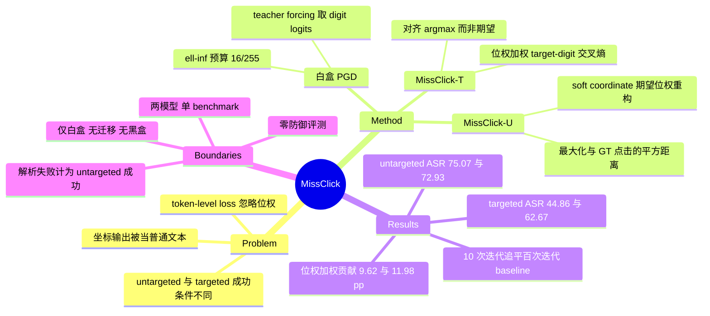

## Summary

GUI grounding 模型把点击坐标输出成 digit token 序列，而解析时每个 digit 带十进制位权——百位改动一次就等于 100 个坐标单位的位移，MissClick 据此把"坐标输出不是普通文本"这一点写进攻击目标：untargeted 分支最大化可微 soft-coordinate 与 ground truth 点击的距离，targeted 分支最小化按位权加权的 target-digit 交叉熵。在 ScreenSpot-v2 上以 white-box PGD（ε=16/255，α=1/255，100 iter）攻击 OS-Atlas-Base-7B 与 UGround-V1-7B，untargeted ASR 达 75.07% / 72.93%，targeted 达 44.86% / 62.67%，分别比 representation attack 与 token CE baseline 高 16.62 / 30.72 pp 与 31.73 / 47.06 pp。

## Problem & Motivation

主流 GUI grounding（[[2410-OSAtlas]]、[[2400-NavigatingDigitalWorldAs]] 代表的 UGround 路线）把"点哪里"表述为坐标生成：模型自回归吐出 digit token，字符串再被 parse 成数值、映射成可执行点击。作者的切入点是这条 parse-and-click 通路在既有攻击文献里是空白的——现有针对 GUI grounder 的对抗扰动工作（Zhao et al. 2025, CVPR-W）要么最大化干净图与扰动图的 image embedding 距离，要么最大化目标坐标序列的生成概率，两者都停在 token 层，没有建模 digit 如何被组装成数值。

这个空白之所以重要，来自十进制记数法的一条直白性质：坐标分量 c_k = Σ a_{k,j} d_{k,j}，其中 a_{k,j} = 10^(m_k − j) 是位权。同样是"某个 digit 改动 1"，发生在百位就是 100 个单位的坐标位移，发生在个位只有 1 个单位。token-level 的 loss 对所有位置一视同仁，因此把优化预算浪费在几乎不影响落点的低位上。

第二个观察是 untargeted 与 targeted 的成功条件根本不同——前者只要点击离开 ground-truth box，后者必须落进攻击者指定的 box——所以它们不应共用一个目标函数。这条在实验里被证成，也是本文信息量最高的部分。

## Method

**威胁模型（决定了这篇工作的适用边界）。** 完全 white-box：攻击者掌握 victim 模型的架构与权重、能对输入截图求梯度；不改模型参数、不改任务指令，只在截图像素上加 ℓ∞ 有界扰动。所有实验的默认预算是 ε=16/255，PGD 步长 α=1/255，随机初始化，N=100 次迭代。论文没有讨论这个扰动在真实部署中经由什么通道注入。

**可微化。** 自回归生成里 argmax 选 token 不可导，所以攻击时对 (截图, 指令, 参考答案序列) 做一次 teacher-forced forward，取每个坐标 digit 位置的 next-token logits，截到 10 个 digit token 上做 softmax 得到 p_{k,j}(v)。untargeted 的参考序列用 ground-truth 坐标，targeted 用目标坐标。teacher forcing 只在优化时用；评测一律是无参考序列的贪心自回归生成。

**MissClick-U（untargeted）。** 用期望 digit 值构造 soft coordinate：d̃_{k,j} = Σ_v v·p_{k,j}(v)，c̃_k = Σ_j a_{k,j} d̃_{k,j}，得到从扰动图到 soft 点击的可微通路，目标是最大化 L_U = ‖r(c̃) − u_gt‖²。r(·) 对 bbox 输出取框心、对 point 输出取自身，因此同时覆盖两类输出格式。

**MissClick-T（targeted）。** 作者先论证 soft-coordinate 目标不适合 targeted：期望值等于目标 digit 并不蕴含目标 digit 是 argmax。论文给的反例很干净——p(1)=0.48, p(8)=0.16, p(9)=0.36 期望正好是 5，但 argmax 是 1。既然 targeted 的成败由离散 argmax 决定，就该直接抬高目标 digit 的概率：L_T 是逐位 target-digit 交叉熵按位权 a_{k,j} 加权后再归一化，让优化集中在贡献最大的高位。

**目标区域选取。** 对每个 targeted 任务，从与 ground-truth box IoU 为 0 的标注元素中**均匀采样**一个作为 B_tgt，没有合法候选的任务剔除。

## Key Results

评测集是 ScreenSpot-v2（1,272 任务，覆盖 desktop / web / mobile）。ASR 的分母是 victim 模型在干净截图上就 grounding 正确的任务（OS-Atlas 1,071，UGround 1,123；targeted 分别为 769 / 801，来自构造的 896 任务子集），所以"未攻击"的 baseline 按定义是 0%，真正的免费下限是 random noise 的 10.46% / 3.21%。

| 设置 | OS-Atlas-Base-7B | UGround-V1-7B |
|:--|:--|:--|
| Untargeted — Random noise | 10.46% | 3.21% |
| Untargeted — Token CE | 37.91% | 27.07% |
| Untargeted — Representation attack | 58.45% | 42.21% |
| **Untargeted — MissClick-U** | **75.07%** | **72.93%** |
| Targeted — Token CE | 13.13% | 15.61% |
| Targeted — Digit CE（均匀权重） | 35.24% | 50.69% |
| **Targeted — MissClick-T（位权加权）** | **44.86%** | **62.67%** |

三个值得单独拎出来的结果：

1. **目标函数的交叉验证（Table 2）比主表更有信息量。** soft-coordinate distance 在 untargeted 下最优（75.07% / 72.93%），但换到 targeted 就掉到 15.73% / 27.59%，反而低于朴素 Digit CE 的 35.24% / 50.69%。这条负结果与 Eq. (11) 的 argmax/期望反例互相印证，是全文最扎实的一处论证。
2. **位权加权本身的贡献可分离。** 同为 target-digit 交叉熵，加位权把 targeted ASR 从 35.24% 抬到 44.86%（OS-Atlas，+9.62 pp）、从 50.69% 抬到 62.67%（UGround，+11.98 pp）。
3. **攻击成本低。** 迭代预算分析里，UGround 上 MissClick-U 跑 10 次迭代就到 42.48%，已超过 representation attack 跑满 100 次的 42.21%；四个设置下 MissClick 都在 10–30 次迭代内追平对应 baseline。

预算敏感性另在两组固定分层的 300 任务子集上测（因此数字与主表不可直接对齐）：UGround 上 MissClick-U 在 ε=4/255 就有 54.34%，超过 representation attack 在 ε=16/255 的 39.25%。但也应看到攻击对预算相当敏感——OS-Atlas 上 targeted ASR 从 ε=16 的 46.47% 掉到 ε=4 的 24.91%。

**评测协议中的一个关键约定**：解析不出合法坐标的输出被计为 untargeted 成功、targeted 失败。

## Evidence Ledger

| Claim ID | Claim | Type | Source locator | Evidence excerpt | Status |
|:--|:--|:--|:--|:--|:--|
| C1 | 威胁模型为完全 white-box：可访问架构与权重、对输入截图求梯度，不改模型参数与任务指令 | benchmark-setting | Sec. 3.1 | "the adversary has full access to the victim model's architecture and weights and can compute gradients with respect to the input screenshot" | source-verified |
| C2 | 扰动为截图像素上的 ℓ∞ 有界扰动，默认 ε=16/255，PGD α=1/255，N=100，随机初始化 | benchmark-setting | Sec. 4.1 (Attack setting); Eq. (2) | "all methods use ε=16/255; iterative gradient-based attacks use random initialization, a step size of α=1/255, and N=100 iterations" | source-verified |
| C3 | 被攻击的 victim 模型恰为两个：OS-Atlas-Base-7B（bbox 输出）与 UGround-V1-7B（point 输出） | benchmark-setting | Sec. 4.1 (Victim models) | "OS-Atlas-Base-7B ... outputs bounding-box coordinates ... and UGround-V1-7B ... outputs point coordinates (x,y)" | source-verified |
| C4 | 数据集 ScreenSpot-v2（1,272 任务）；untargeted ASR 分母 1,071 / 1,123，targeted 分母 769 / 801（出自构造的 896 任务子集） | benchmark-setting | Sec. 4.1 (Dataset, Metrics) | "Untargeted ASR is computed over all correctly grounded tasks (1,071 for OS-Atlas, 1,123 for UGround)" | source-verified |
| C5 | MissClick-U untargeted overall ASR 75.07% / 72.93%，对应 representation attack 的 58.45% / 42.21% | number | Table 1; Sec. 4.2 | "MissClick-U obtains overall ASRs of 75.07% and 72.93% ... compared with 58.45% and 42.21% for Representation attack" | source-verified |
| C6 | MissClick-T targeted overall ASR 44.86% / 62.67%，对应 Token CE 的 13.13% / 15.61% | number | Table 1; Sec. 4.2 | "MissClick-T obtains overall ASRs of 44.86% and 62.67% ... compared with 13.13% and 15.61% for Token CE" | source-verified |
| C7 | Random noise untargeted ASR 为 10.46% / 3.21%；ASR 只在干净截图上已 grounding 正确的任务上计算，故未攻击基线按定义为 0% | number | Table 1; Sec. 4.1 (Metrics) | "We evaluate only tasks correctly grounded by the victim model on the unperturbed screenshot" | source-verified |
| C8 | 解析不出合法坐标的输出计为 untargeted 成功、targeted 失败 | benchmark-setting | Sec. 4.1 (Metrics); Sec. 3.1 | "an unparseable output counts as a successful untargeted attack and a failed targeted attack" | source-verified |
| C9 | 位权加权使 targeted ASR 由 Digit CE 的 35.24%→44.86%（+9.62 pp）、50.69%→62.67%（+11.98 pp） | number | Sec. 4.4; Table 2 | "improves from 35.24% to 44.86% on OS-Atlas ... and from 50.69% to 62.67% on UGround" | source-verified |
| C10 | targeted 设置下 soft-coordinate distance 明显弱于 digit 类目标（15.73% / 27.59% vs 35.24% / 50.69%） | comparison | Table 2; Sec. 4.3 | "Soft-coordinate distance is less effective than the digit-based objectives under the targeted setting, achieving 15.73% and 27.59%" | source-verified |
| C11 | 论文未评估任何防御方法，防御被列为 future work | benchmark-setting | Sec. 5 | "Future work will ... investigate defenses that account for the different coordinate displacements caused by changes at digit positions" | source-verified |
| C12 | 论文无 transferability、无 black-box / query-based 实验；white-box 被明确列为 limitation | benchmark-setting | Sec. 5 | "we assume white-box access"; "investigate transferability and query-based black-box attacks" | source-verified |
| C13 | ε=4/255 时 MissClick-U 在 UGround 达 54.34%，超过 representation attack 在 ε=16/255 的 39.25%；该表在另一组 300 任务固定分层子集上测得，与主表不同分母 | number | Table 3; Sec. 4.5 | "MissClick-U at ε=4/255 exceeds the Representation attack at ε=16/255 on UGround (54.34% vs. 39.25%)" | source-verified |
| C14 | UGround 上 MissClick-U 迭代 10 次达 42.48%，超过 representation attack 迭代 100 次的 42.21% | number | Sec. 4.5; Fig. 2 | "MissClick-U achieves 42.48% ASR after 10 iterations, compared with 42.21% for the Representation attack after 100 iterations" | source-verified |
| C15 | 目标区域从与 ground-truth box IoU 为 0 的标注元素中均匀采样，无合法候选的任务剔除 | benchmark-setting | Sec. 4.1 (Target region selection) | "we uniformly sample B_tgt from annotated elements whose bounding boxes have zero IoU with B_gt" | source-verified |
| C16 | 论文未提供代码库或 project URL | license-code | 全文 + arXiv abs 元数据 | 全文与 arXiv 元数据中均未出现 code / project / repository 链接（否定性核查，依据为缺失） | source-verified |
| C17 | 论文明确把 coordinate-free grounding（如 GUI-Actor）排除在适用范围外，理由是它不暴露 coordinate-digit 接口 | benchmark-setting | Sec. 2 (GUI visual grounding) | "coordinate-free heads do not expose the coordinate-digit interface required by MissClick and therefore fall outside the scope" | source-verified |
| C18 | 论文自陈 digit token 的数值/位权结构已被 training-time 工作研究过（NTL、Fei et al.、DIST2Loss、Phi-Ground），本文贡献是把它带到攻击目标设计 | sota-novelty | Sec. 2 (Numerical structure of digit tokens) | "These works study numerical structure as a training-time modeling problem. In contrast, we study ... from an adversarial security perspective" | source-verified |

## Strengths & Weaknesses

**亮点。** 观察本身是对的，且从观察到目标函数的推导干净利落——不需要额外训练、不改模型，增量只是给交叉熵乘一个 10^(m−j)。targeted 上 31.73 / 47.06 pp 的提升幅度大到不可能是噪声。真正让我觉得这篇有价值的是 Table 2 的交叉验证：soft-coordinate distance 在 untargeted 最优、在 targeted 却输给朴素 Digit CE，作者用 Eq. (11) 的期望-argmax 反例（p(1)=0.48, p(8)=0.16, p(9)=0.36，期望 5 而 argmax 1）解释了为什么。一个带机制解释的负结果，比主表多出来的百分点信息量高得多。迭代效率（10 步追平 baseline 的 100 步）也是有实际意义的量——攻击成本决定威胁能否规模化。作者的 scoping 也算诚实：coordinate-free 头、非 per-digit tokenization、white-box 假设都写进了 limitation。

**威胁模型是最薄弱的一环。** 论文全程没有说这个扰动经由什么通道进入 agent 看到的截图。要在整张截图的每个像素上写入任意 ±16/255，攻击者实际上已经站在了截屏或渲染管线里面；到了那一步，直接改写模型的坐标输出比跑 100 步 PGD 便宜得多。真正对应现实威胁的版本——扰动被限制在攻击者能控制的区域（一个广告位、一个自己托管的页面、一张用户上传的图），中间还要过浏览器渲染、缩放和模型自己的 resize/patchify——一个都没测。论文把这归入"transferability 是 future work"，但这不是同一个问题：可迁移性问的是换个模型还灵不灵，扰动通道问的是这个攻击面是否存在。

**"小扰动"的措辞在承担过多重量。** ε=16/255 是整张截图每像素最多 ±6.3% 动态范围的噪声。GUI 截图大面积是纯色背景，这种量级的噪声对人眼是可感知的，而论文没有报告任何隐蔽性度量（LPIPS、人类判别实验都没有）。预算敏感性表也显示攻击对预算相当敏感：OS-Atlas 的 targeted ASR 从 ε=16 的 46.47% 掉到 ε=4 的 24.91%。

**untargeted 数字被评测协议抬高，且不检验论文自己的机制。** 解析失败计为成功（C8），但论文没给出成功案例里有多少是格式崩坏、多少是受控位移。更关键的是 untargeted 的成功条件只要求点击离开 ground-truth box——把一个小按钮的点击挤偏 5 个像素，和跳出 300 个坐标单位，在指标上完全等价。而全文论点恰恰是"高位 digit 带来大位移"。所以 75.07% 这个数并不支撑机制叙事，真正相关的是 targeted 的 44.86%（OS-Atlas 上不到一半）。

**机制证据是端到端的，不是直接的。** "高位重要 → 给高位加权"这个因果链，全部证据来自 ASR 的消融（+9.62 / +11.98 pp）。论文没有测过任何一个直接量：哪些 digit 位置实际被翻转了、位移分布长什么样、加权后高位翻转率是否真的上升。缺了这些，"位权加权有效"也可以有另一个平凡解释——它把梯度预算集中到更少、更易优化的位置上，与十进制语义无关。一张位移直方图或逐位翻转率就能把这个歧义解掉。

**覆盖面。** 两个 victim 模型、一个 benchmark、都是 7B。论文未报告两者的 backbone；若二者共享同一 VLM 底座（需另行核实，本文无据），"两个代表性模型"的实际覆盖会比字面窄。更新的 grounding 模型（UI-TARS、Qwen-CUA 系）与使用特殊坐标 token 而非 per-digit 十进制的模型都未涉及——后者恰恰是判断这个漏洞是接口固有还是实现偶然的关键对照。

**零防御评测。** 最便宜的几项检查（JPEG 重编码、随机缩放/裁剪、模型自身预处理里的 resize）一个都没做。GUI 截图本来就要过缩放和 patchify，扰动能否活过这条流水线是审稿人会问的第一个问题。

**目标选取不面向危害。** B_tgt 是从零-IoU 元素里均匀采样的，不是按攻击者收益挑的，也没有 ASR-对-目标距离的曲线。Figure 1 的 teaser（把点击从数量输入框引到 checkout 按钮）暗示了危害，但 62.67% 这个聚合数字度量的不是危害，而是"能否命中一个随机的别的元素"。

**对领域的意义在结论之外。** 我认为可迁移的教训不是这个攻击，而是这个接口：per-digit 十进制序列化给出了一个**非均匀的误差曲面**，一个 token 控制 100 个单位。这既是对抗攻击的杠杆，也意味着任何噪声源（量化、采样温度、解码扰动）在高位上的一次失误都会造成大位移。它与训练侧文献（NTL、Phi-Ground 的位权重加权、DIST2Loss）在同一个观察上收敛，而论文自己也承认了这一点（C18）——所以本文的 novelty 是把已知的训练侧观察搬到攻击侧，属于扎实但增量的贡献。

## Mind Map

## Notes

**同周的镜像工作（尚未消化，勿建 wikilink）。** arXiv 2608.03471 "Hi-Token: Hierarchical Coordinate Tokenization for Generative Visual Grounding" 与本文出自同一个观察——box/point 坐标是以带位权的 digit token 发出的——但方向相反：Hi-Token 用这个结构去**改进** grounding，MissClick 用它去**攻击**。同一周、同一前提、相反用途，这个配对本身就说明"坐标数字化接口"正在成为一个被独立发现的结构性问题，而不是某一篇的巧思。等 Hi-Token 落库后应当把两篇并读，重点看：分层/位权感知的 tokenization 是否顺带削弱了 MissClick 的 ASR——如果是，那么这个漏洞的修复代价可能几乎为零，本文的威胁叙事就要打折；如果不是，说明脆弱性在表示之外。

**论文回避掉的两个关键实验。**
1. 位权感知的**训练**（Phi-Ground 式的十进制位重加权、DIST2Loss）能否降低 MissClick 的 ASR。这是把攻击与既有训练侧文献接上的最直接一步，论文引了那批工作却没做这个对照。
2. coordinate-free grounding（[[2500-GuiActorCoordinateFree]]）是真的更鲁棒，还是只是把脆弱性从 digit 挪进了 attention 头。论文用"不暴露 coordinate-digit 接口"把它定义性地排除（C17），恰好绕开了最有意思的比较——排除的是攻击的适用性，不是安全性的结论。

**与 vault 的连接。** 两个 victim 模型都有笔记：[[2410-OSAtlas]]、[[2400-NavigatingDigitalWorldAs]]（UGround）。攻击面上，[[2409-EIA]] 与 [[2608-InvisibleInkThreats]] 走的是指令/环境注入路线——操纵 agent 的**意图**；MissClick 走的是感知路线——意图不变而**落点**被劫持。两条路线的防御位置完全不同：注入类可以靠意图审计与确认门控拦，MissClick 类拦不住，因为 agent 报告的动作语义（"点击提交按钮"）和它实际发出的坐标之间没有一致性检查。这指向一个具体的空白：**动作语义与执行坐标的一致性验证**——例如对最终坐标做一次反向的元素识别，检查落点元素与指令描述是否匹配。这类检查廉价、与攻击类型无关，且现有 CUA 栈里普遍没有。

**与 [[2606-DecodableNotGrounded]] 的张力值得追。** 那篇质疑 VLM 输出的坐标究竟是"视觉 grounding"还是"从先验解码出来的"。MissClick 的证据可以从两个方向读：像素扰动能大幅改写坐标，说明输出确实强依赖视觉输入（支持 grounded）；但 random noise 就能拿到 10.46% 的 untargeted ASR、且高位 digit 如此易翻，也可能说明坐标 head 的决策边界本身很浅。要区分这两种解释，需要的正是论文缺的那个直接测量：受攻击时的位移分布与逐位翻转率。

**GUI survey 归属。** 本篇属于 GUI grounding 可靠性/安全性，应记入 CUA-Survey 的 pending。
