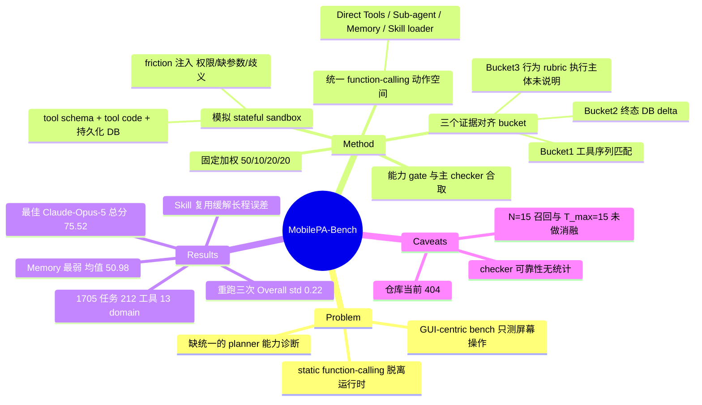

## Summary

MobilePA-Bench 把手机 agent 评测从「点屏幕」和「离线 API 字符串匹配」之间的空档拉出来，改成一个有持久化数据库、会返回结构化运行时反馈的模拟 mobile sandbox，用 1,705 个任务、212 个工具考察中枢 planner 的 Basic Tool Use、Sub-agent Collaboration、Memory Usage、Skill Usage 四项能力。它的评测设计核心是把任务按「什么证据最能证明完成」路由到三个固定的 verification bucket（tool-call 匹配 / DB delta / behavior rubric），并把 memory 检索与 gold-skill 加载做成主 checker 之上的合取 gate。13 个前沿模型横评中最好的 Claude-Opus-5 加权总分仅 75.52%，作者据此论证当前 LLM 离可靠的手机自动化还有距离。

## Problem & Motivation

作者的诊断是现有手机 agent 评测分裂成两个各有盲区的阵营：GUI-centric benchmark（AndroidWorld、OSWorld、MobiBench）只测像素级感知与屏幕操作，看不到后台工具调用和长程规划；static function-calling benchmark（BFCL、DroidCall、AppBench）只做离线 API 匹配，没有活的状态可执行，测不出 agent 如何应对权限拒绝、调用依赖、数据库冲突这类真实运行时异常。

这个诊断本身是站得住的——它对应 vault 里已经反复出现的裂缝（参见 [[Papers/2608-ScreenshotsOrTools]] 讨论的 GUI 与 MCP tool 两条通路）。但作者随后做了一个更强的立场性判断：raw screen manipulation 只是手机智能的一小部分，应当从中枢规划里剥离出去，交给下游 GUI sub-agent，中枢用结构化 API 完成大部分工作。这是一个设计主张，不是被本文验证的结论——论文没有给出任何证据说明真实手机场景中有多大比例的任务能被结构化 API 覆盖。读这篇时需要把「它测得好」和「它测的是对的东西」分开看。

## Method

**环境层**。sandbox 由三层构成：结构化 tool schema（函数名、描述、JSON 参数模式、domain 标签）、tool 实现代码（参数校验、重复实体检查、动态 ID 生成）、共享持久化后端。环境状态建模为 `S_t = <D_t, O_t>`，即活应用数据库加操作日志；每次调用返回 `f_t = <Status, ErrorType, Payload>`。工具目录共 212 个，分布在 13 个 domain（Audio & Entertainment 25 个最多，Security & Privacy 10 个最少）。作者主动在初始状态 `S_0` 里注入 environmental friction——缺参数、权限阻断、实体歧义——逼 planner 读反馈并在线修复计划。

**动作空间**。四类接口都统一成 function calling：Direct Mobile Tools、Sub-agent Entry Tools（路由到 GUI sub-agent 等六个专用 sub-agent）、Memory Tools（`search_user_memory`）、Skill Loading Tools。skill loader 是元接口，调用后动态把该 skill 绑定的具体工具 schema 扩进候选动作集，即 `A_{t+1} = A_t ∪ G(s)`。初始动作集是 top-N 召回的工具加上该 query 可用的 skill loader。

**验证层**（本文最有复用价值的部分）。作者拒绝用单一 metric，理由是 exact-match 轨迹会误杀等价路径、纯终态匹配又测不出决策过程。于是每个 query 在标注阶段被固定路由到三个 bucket 之一：

| Bucket | 判定依据 | 适用任务 |
|:--|:--|:--|
| 1 Tool Call | 工具名、调用顺序、参数字段、归一化参数值与标注一致，且无额外副作用调用 | 确定性、规范步骤唯一 |
| 2 State Change | 终态数据库增量 `D_T − D_0` 与标注目标 delta 比对，拒绝破坏性或无关写入 | 多路径等价、终态唯一 |
| 3 Agent Behavior | 按任务级 rubric 评可观察轨迹，两个指标：Call Sub-agent、Appropriate Follow-up Behavior | 开放式、需委派或澄清 |

Memory 与 Skill 不是独立 checker，而是叠在上述固定主 checker 之上的合取 gate：`Succ_mem = g_mem ∧ C_b(q)`，其中 `g_mem` 要求所有 gold memory ID 都被 memory 搜索返回；`Succ_skill = g_skill ∧ C_b(q)`，要求轨迹中加载过标注的 gold skill。这个「主 checker 固定、能力要求做 gate」的切分是干净的，避免了把检索能力和执行能力揉进同一个分数。

**聚合**。总分固定加权 `0.50 × Basic + 0.10 × Sub-agent + 0.20 × Memory + 0.20 × Skill`，全分母计分，缺失或非法预测一律记失败。

## Key Results

评测 13 个模型，多轮 function calling，候选工具召回 N=15，最大步数 T_max=15，统一 system prompt。任务分布：Basic 1,040、Sub-agent 89、Memory 376、Skill 200。

| Model | Overall | Basic | Sub-agent | Memory | Skills |
|:--|--:|--:|--:|--:|--:|
| Claude-Opus-5 | **75.52** | **83.85** | 62.92 | 58.51 | **78.00** |
| Claude-Fable-5 | 75.31 | 83.37 | 70.79 | 62.50 | 70.25 |
| Kimi-K3 | 73.01 | 77.40 | 62.92 | 63.56 | 76.50 |
| Qwen-3.8-Max | 72.51 | 77.88 | 53.93 | **64.63** | 76.25 |
| Gemini-3.1-Pro | 71.18 | 80.58 | **77.53** | 48.67 | 67.00 |
| GPT-5.6-Sol | 62.68 | 69.81 | 49.44 | 44.15 | 70.00 |
| Kimi-2.6 | 55.63 | 70.38 | 43.82 | 33.78 | 46.50 |

（Table 3 的列序为 Model / Overall / Basic / Sub-agent / Memory / Skills / Avg. Output Tokens，Overall 排在第二列而非末列。）

三个值得记住的数字模式：

**能力维度落差远大于模型落差。** 13 模型 Basic Tool Use 均值 76.58%，Memory 均值只有 50.98%，Skill 均值 66.77%。最强模型在 Basic 上做对 872/1,040，但即便是 Memory 榜首的 Qwen-3.8-Max 也只有 243/376，仍有超过三分之一的个性化任务失败。作者的解读是「检索到」和「正确用上检索结果」是两件事。

**没有全能 planner。** 四个维度的第一名分散在三个模型上：Claude-Opus-5 拿 Basic 与 Skill，Gemini-3.1-Pro 拿 Sub-agent（77.53%）但 Memory 只有 48.67%，Qwen-3.8-Max 拿 Memory。13 个模型里 7 个总分低于 70%。

**Skill 复用确实缓解长程误差累积。** Skill Usage 在多数模型上高于 Memory Usage，最高 78.00%（312/400，因为 200 个任务在 SOR 与 MTSR 两种路由设置下各跑一次）。这是本文少数带机制含义的正面结论：给定预打包的多步过程，比让模型从原子工具从头拼计划更稳。

**稳定性。** 用 Qwen3.6-27B 完整重跑三次，Overall 落在 57.22%–57.63%，标准差 0.22。Sub-agent 波动最大（极差 2.25 点），作者诚实指出这只对应 89 题里两题判定翻转。

## Evidence Ledger

| Claim ID | Claim | Type | Source locator | Evidence excerpt | Status |
|:--|:--|:--|:--|:--|:--|
| C1 | 含 1,705 个真实用户任务、13 个 functional domain、212 个 mobile tool | number | Abstract / §1 | "encapsulates 1,705 real-world user tasks spanning 13 functional domains and 212 realistic tools" | source-verified |
| C2 | 任务分布 Basic 1,040 / Sub-agent 89 / Memory 376 / Skill 200 | number | §4.1 | "1,040 for Basic Tool Use, 89 for Sub-agent Collaboration, 376 for Memory Usage, and 200 for Skill Usage" | source-verified |
| C3 | 总分固定加权 0.50/0.10/0.20/0.20 | benchmark-setting | §3.5 Eq.12 | "0.50 x Score_Basic + 0.10 x Score_SubAgent + 0.20 x Score_Memory + 0.20 x Score_Skill" | source-verified |
| C4 | Claude-Opus-5 总分第一 75.52，Basic 83.85 / Sub-agent 62.92 / Memory 58.51 / Skills 78.00 / 262 tokens | number | Table 3 row 1 | 列序 Model, Overall, Basic, Sub-agent, Memory, Skills, Avg. Output Tokens；行值 75.52, 83.85, 62.92, 58.51, 78.00, 262 | source-verified |
| C5 | 13 个模型中 7 个总分低于 70% | number | §4.2 bullet 1 | "7 of the 13 evaluated models remain below 70%" | source-verified |
| C6 | Memory 区间 33.78–64.63，13 模型均值 50.98，Qwen-3.8-Max 243/376 居首 | number | §4.5 | "ranges from 33.78% to 64.63%, with a 13-model mean of 50.98%. Qwen-3.8-Max leads with 243/376" | source-verified |
| C7 | Basic 区间 68.94–83.85，均值 76.58，最强模型 872/1,040 仍失败 168 题 | number | §4.4 | "leading at 872/1,040 ... The 13-model mean is 76.58% ... fails 168 tasks" | source-verified |
| C8 | Skill 分母为 200 任务 x SOR/MTSR = 400 条轨迹，Claude-Opus-5 312/400，均值 66.77 | number | §4.6 | "yielding a fixed denominator of 400 ... Claude-Opus-5 leads with 312/400 (78.00%)" | source-verified |
| C9 | Sub-agent 区间 43.82–77.53；Gemini-3.1-Pro 领跑 77.53 但 Memory 仅 48.67 | comparison | §4.2 bullets / Table 3 | "Gemini-3.1-Pro leads Sub-agent Collaboration (77.53%) but reaches only 48.67% on Memory Usage" | source-verified |
| C10 | 三个证据对齐 bucket：工具序列匹配 / 终态 DB delta / 行为 rubric，且互不可替换 | benchmark-setting | §3.3.1 | "compares the terminal database transition D_T − D_0 with the annotated target delta"；"task-specific rubrics along two key metrics" | source-verified |
| C11 | 全文未说明 Bucket 3 的 rubric 由谁执行（人 / 程序 / LLM judge）；"judge" 全文仅在 Table 3 caption 出现一次 | benchmark-setting | 全文检索 + Table 3 caption | 全文 judg 仅 1 处："excluding input context, tool responses, judge outputs, and hidden reasoning"；§3.3.1 只称 "the checker" | source-verified |
| C12 | Memory / Skill 成功为主 checker 之上的合取 gate | benchmark-setting | §3.4.3 Eq.8-9 / §3.4.4 Eq.10-11 | "Succ_mem(q) = g_mem(q) AND C_b(q)(H_T, S_T)"；"g_skill(q) = 1[s*_q in K_T]" | source-verified |
| C13 | harness 设置：多轮 function calling、统一 system prompt、召回 N=15、T_max=15、全分母计分 | benchmark-setting | §4.1 / §3.5 | "candidate recall parameter is fixed at N=15"；"missing or invalid predictions count as failures" | source-verified |
| C14 | 稳定性用 Qwen3.6-27B 重跑三次，Overall 57.22–57.63，std 0.22；Sub-agent 极差 2.25 点对应 89 题中两题 | number | §4.3 / Table 4 | "largest peak-to-peak spread (2.25 points), which corresponds to only two differently resolved tasks among its 89 examples" | source-verified |
| C15 | 环境为 tool schema + tool code + 持久化 DB 的模拟 sandbox，作者声称支持确定性执行与轨迹回放；全文只描述 simulated state，未主张真实设备或 emulator | benchmark-setting | §3.2.3 / §3.2.2 | "stateful mobile simulation sandbox"；"query or mutate simulated mobile system states"；"enables high-throughput, deterministic execution and trajectory replay"（真机否定为文义蕴含，非原文明述） | source-verified |
| C16 | 论文声称完全开源全部 1,705 任务、评测数据与 sandbox，并给出 GitHub 链接 | license-code | §1 contribution 3 / 标题脚注 | "We fully open-source our complete infrastructure—including all 1,705 benchmark tasks, evaluation datasets, and the high-throughput sandbox environment" | source-verified |
| C17 | 任务由 human-curated seed 与合成 user profile world 生成，但全文无标注员数量、无标注规范、无 inter-annotator agreement、无 checker 可靠性统计 | benchmark-setting | §3.4.1 / §3.4.3 / 全文检索 | "synthesized from human-curated mobile seeds"；穷举检索 annotator / inter-annotator / agreement / kappa 等均零命中 | source-verified |
| C18 | 1,530 query 的场景 taxonomy 快照是描述性的，论文明确声明它不是 1,705 评测的分母 | number | §3.4 / Fig.6 caption | "This taxonomy visualization is descriptive and is not used as the denominator of the 1,705-task evaluation" | source-verified |
| C19 | Table 1 中仅 MobilePA-Bench 四项属性全打勾；TAU-Bench 有 Stateful DB 但无 Dynamic OS Feedback；AndroidWorld/OSWorld 前两项打勾、后两项打叉 | sota-novelty | Table 1 | 列序 Benchmark, Environment Paradigm, Stateful DB Support, Dynamic OS Feedback, Advanced Capabilities, High-Throughput；Ours 行四勾，TAU-Bench 行 勾/叉/叉/叉 | source-verified |
| C20 | 376 个 Memory 任务 = 176 单轮 + 200 多轮，另按 188 DB-primary + 188 API-primary 划分 | number | §4.5 | "376 tasks: 176 single-turn and 200 multi-turn examples ... contains 188 DB-primary and 188 API-primary tasks" | source-verified |

以下两条观察**未进入本轮独立核查**，由笔者直接读原文/外部检查所得，读者需自行核对：

1. Table 1 把 `BFCL (v1-v4)` 的 Stateful DB Support 标为 ×，而本文自己的 Reference [3] 标题写的是 "Berkeley function calling leaderboard (bfcl) v4: comprehensive multi-turn and stateful api evaluation"。这个 × 至少需要解释。
2. 2026-08-25 笔者实测 `https://github.com/Tongyi-MAI/MobilePA-Bench` 返回 HTTP 404（`Tongyi-MAI` 组织页返回 200），即 C16 承诺的开源在本笔记写作时尚未兑现。

## Strengths & Weaknesses

**值得学的地方**

verification 的分层设计是本文最有迁移价值的部分。「主 checker 按证据类型固定路由 + 能力要求做正交 gate」这个切分，比大多数 agent benchmark 把所有东西塞进一个 success flag 要干净：它让 Memory 分数下降时能追问是没检索到还是检索到没用上，也避免了用 exact-match 误杀等价执行路径。而 Bucket 1 与 Bucket 2 是程序化 checker（工具序列匹配、数据库增量比对），在可靠性上确实优于它所批评的对象。

作者在数字纪律上也比多数 benchmark 论文克制：明确声明 1,530 的 taxonomy 快照不是评测分母（C18），主动做了三次重跑并报出方差来源（C14），Skill 的 400 条轨迹分母来自 200 任务 x 2 种路由设置也交代清楚（C8）。这类交代在 benchmark 论文里并不常见。

**「stateful」这个词承载了什么**

它确实是真的 stateful——终态 DB delta 参与判定（C10 Bucket 2），环境会因调用产生持久变更并写操作日志。但这个 state 是纯模拟数据库，没有真实 Android、没有 emulator、没有第三方 app（C15）。这有一体两面：好处是不会像 AndroidWorld / WebArena 那样随线上服务变更而腐烂，确定性和吞吐都可控，做 agentic RL rollout 也合适；代价是它测的是「工具协议层的状态一致性」，而不是真实系统的不确定性（真机的异步、渲染延迟、跨应用竞态、真实 API 的语义漂移都被抹掉了）。论文用 friction injection（权限阻断、缺参数、实体歧义）来补这一课，但那些 friction 是作者写死的脚本，不是环境自然产生的。

**评测可靠性上有一个不小的窟窿**

论文全文没有说明 Bucket 3 的 rubric 由谁执行（C11）——唯一暗示 judge 存在的痕迹是 Table 3 caption 里排除 token 计数时提到的 "judge outputs" 一词。这不是吹毛求疵：整个 Sub-agent Collaboration 维度（占总分 10%）全部走 Bucket 3。如果这个 rubric 由 LLM 打分，那么它就退回到它批评的那类 benchmark 的可靠性等级，而论文既没报 judge 模型、也没报 judge 与人工的一致率。（另外 §4.5 把 Memory 的 188 个 "API-primary" 任务对应到 "behavior-based assessment"，措辞含糊，无法确定这部分是否也落在 Bucket 3；存疑。）

更根本的是，本文唯一的「稳定性」实验测的是模型采样方差，不是 checker 的正确率（C14 vs C17）。Bucket 1 的 "normalized argument values" 归一化规则、Bucket 2 的 "unrelated write side effects" 判定边界，都会直接决定分数高低，论文没有给出这些规则的定义，也没有给出误判率。全文零 inter-annotator agreement、零标注协议、零人工复核统计（C17）。在代码放出前（见上文第 2 条外部检查），这些全部不可核查。

**模型差距有多少来自 planning、多少来自 harness**

论文的主结论是「前沿 LLM 在手机场景不可靠」，但至少三个 harness 选择会污染这个归因：

- 候选工具召回固定 N=15（C13），论文没有报 recall@15。如果 gold tool 有一定比例不在候选集里，这部分任务对任何模型都不可解，失败却被计进「模型能力」。
- `T_max = 15` 对论文自己强调的 long-horizon composite skill 任务偏紧；步数耗尽的失败与规划错误在分数上无法区分。
- 全部模型共用同一套 standardized system prompt，对 tool-calling 格式偏好差异大的模型（尤其 reasoning 类）可能系统性不利。

另外 Sub-agent 维度只有 89 题（C2），而作者自己的稳定性分析显示两题翻转就是 2.25 点（C14）——这意味着该维度上小于约 10 点的模型差异只等于几道题，排行不宜当结论读。

**任务来源与定位**

Basic Tool Use 来自 "human-curated mobile seeds" 再合成扩展，Memory 来自合成的 user profile world（C17），都不是真实用户日志。标题里的 "Complex Real-World Tasks" 与实际构造方式之间有距离。摘要还把本 benchmark 称为 "an interactive foundation for agentic reinforcement learning"，但全文没有任何 RL 实验，这是一个承诺而非结果。

最后一点定位判断：这篇把 GUI 降级为 sub-agent 的一条路由，是立场而非发现。对 vault 关心的 GUI agent 方向，它的价值在于回答「当结构化 API 可用时，中枢 planner 有多可靠」——75% 的天花板看起来比 OSWorld / AndroidWorld 上的分数高得多，恰恰因为最难的感知部分被拿掉了。把两类分数并列比较是没有意义的。

## Mind Map

## Notes

- **归属**：GUI/mobile 方向，canonical survey 是 [[Topics/CUA-Survey]]。它最适合放进 survey 的 evaluation 一节，作为「tool-centric 与 GUI-centric 评测分裂」的具体案例，与 [[Papers/2608-ScreenshotsOrTools]]（同一裂缝的 method 侧）、[[Papers/2605-MobileGym]]（可验证并行 mobile 仿真）、[[Papers/2510-OSWorldMCP]] 对读。harness 归因问题与 [[Topics/AgentHarness-Design]]、[[Papers/2608-HarnessEvalW]] 关心的预算口径同源。

- **最想看却没有的那个消融**：既然 Memory 与 Skill 都是 `gate ∧ checker` 的合取结构（C12），最有诊断价值的分解就是把失败拆成三类——gate 过 checker 挂、gate 挂 checker 过、两者都挂。论文完全没报。特别是「模型不调 `search_user_memory`、直接靠先验猜对了用户偏好」这种情况会被 gate 判失败，Memory 分数因此可能系统性低估实际任务完成率。这是一个成本极低、信息量很大的补充实验。

- **可复用的设计点**：evidence-aligned bucket routing 值得抄进我们自己的 agent 评测——但要抄就得连带补上论文缺的那部分，即 rubric checker 的执行主体、判定规则和一致性率。否则只是把不透明性藏进了更精致的框架里。

- **repo_candidate**：`https://github.com/Tongyi-MAI/MobilePA-Bench`，2026-08-25 尚为 404。若后续开放，值得跑一轮 `repo-digest` 核对三件事：Bucket 3 checker 是否为 LLM judge、Bucket 1 的参数归一化规则、tool retriever 的 recall@15。这三点决定了本文所有分数怎么解读。
