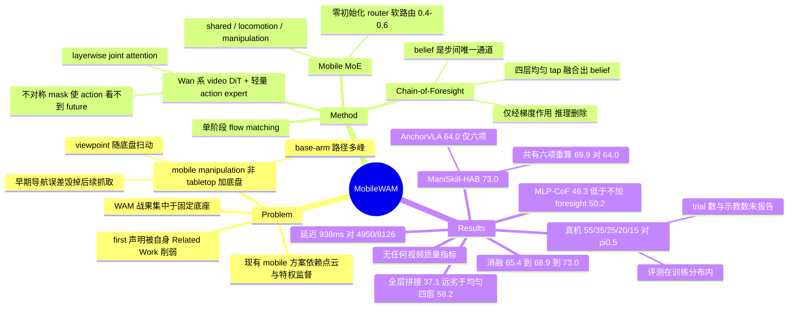

## Summary

把 video-generative World Action Model 这套此前只用于固定底座 tabletop manipulation 的配方搬到 whole-body mobile manipulation：pretrained video diffusion transformer 与轻量 action expert 做 layerwise joint attention，action expert 的每个 FFN 换成 shared / locomotion / manipulation 三专家软路由（Mobile MoE），并加一条训练期专用的 Chain-of-Foresight——RNN 式串行链，第 k 步去噪第 k 个未来 latent 并把 belief 传给第 k+1 步，梯度经四个 backbone tap 层反压主干。ManiSkill-HAB SetTable 七子任务平均 73.0%，真机 ARX Lift2 五任务全面超过同数据微调的 π0.5（55/35/25/20/15% 对 35/25/10/10/0%），推理时 CoF 与 video 分支全部丢弃，单周期 938 ms。

## Problem & Motivation

作者开篇的问题设得不错：mobile manipulation 是不是"tabletop 加个底盘"或"navigation 拼 manipulation"？他们给的否定理由是三条乘性耦合——相机随底盘扫动（viewpoint）、底盘自由使得达成同一目标的 base–arm 路径极多（action 分布多峰）、早期导航误差会静默毁掉后续抓取（causality）。结论是 mobile manipulation 的长程性来自因果深度而非帧数。

由此推出的技术空白是：WAM 这条线（Motus、LingBot-VA、Fast-WAM、GigaWorld-Policy）靠互联网级视频预训练拿到动力学先验，但战果全部集中在固定底座；而 mobile manipulation 侧仍在用 dynamics-blind 编码器加手工协调——AC-DiT 要 3D 点云与两阶段训练，SG-VLA 要 privileged GT segmentation 的辅助 decoder，WEM 预设了 world/ego 流的分离。作者的立场是这些"手工工程出来的时空一致性"本该从视频预训练里继承。

这个 framing 有一处自相矛盾之处值得记下：论文声称是"first systematic adaptation of video-generation WAMs to whole-body mobile manipulation"，但它自己的 Related Work 就写了 ABot-M0.5 "explores WAMs with latent actions"，而后者正是 mobile manipulation 的 WAM（C19）。novelty 的实际边界是"不用 latent action 中间层、不用点云、不用特权监督、单阶段"，不是"第一个"。

## Method

**整体形态.** 观测是 head + wrist 两路 RGB 拼成一张 384×640 复合帧，本体状态 $\boldsymbol{s}_t$ 18 维（目标位置、抓取指示、物体位姿、末端位姿，均在 base 坐标系），输出 13 维 whole-body action（7 关节 + 夹爪 + 头部 pan/tilt + 躯干升降 + 底盘线速度/角速度），chunk 长度 $H{=}4$。训练时联合建模 $p_\theta(\boldsymbol{a}_{t:t+H}, V_{t:t+T} \mid o_t, \boldsymbol{s}_t, \ell)$，部署只采 action 边缘分布。

**World expert.** 30 block、width 3072、FFN 14336、24 头 × dim 128 的 Wan 系 text-and-image-to-video diffusion transformer；causal 3D VAE（48 latent channel，空间 16×、时间 4× 压缩）与 T5 系文本编码器全程冻结。一个 latent tick 恰好覆盖一个 action chunk，视觉时钟与运动时钟对齐——这是让 joint attention 有意义的前提。当前帧以 timestep 0 的 clean latent 进入，后续帧带噪，于是 backbone 做的是"给定现在去噪未来"。

**Action expert 与 Mobile MoE.** 30 block、width 1024、FFN 4096、24 头 × dim 128（每头维度与主干一致，joint attention 可直接拼头）。每层 action token 与 backbone 视觉 token 进同一次 self-attention，mixture-of-transformers 式分离投影。每个 FFN 替换为 shared / locomotion / manipulation 三专家：三者初始都是原 dense 层的克隆，router 是零初始化的线性层，读 mean-pooled 含噪 action embedding，softmax 温度 1.0 出凸组合，无 load-balancing loss。零初始化保证"只有数据要求时才分化"。附录的路由分析显示主导专家权重通常只在 0.4–0.6，无专家塌缩（C27）——即分化是温和的，不是硬开关。

**Chain-of-Foresight.** 取 $\{4,12,20,30\}$ 四个均匀分布的 backbone 层，把当前观测 token 的隐状态拼起来过两层 MLP 得初始 belief $\boldsymbol{h}_0$；深度专属模块 $F_1,\dots,F_K$（各自独立权重，从靠后的 backbone block 循环初始化，每个是三层 transformer block）沿未来 latent 串行展开，第 $k$ 步吃 $(\boldsymbol{h}_{k-1}, \boldsymbol{z}_k^{\tau_k})$，在 block-causal mask 下 cross-attend 到 $(\ell, \boldsymbol{s}_t, o_t)$，输出速度估计与新 belief。belief 是步与步之间**唯一**的通道，逼它压缩演化中的世界状态。foresight 目标用更激进的 noise schedule shift（10 对主分支的 5），链上不加 stop-gradient。

**注意力掩码.** 当前 token 只互看；未来 video token 看所有视觉 token；action token 只看当前 token；**没有任何 video token 看得到 action token**。这条保证当前观测的表示在训练与部署完全一致，于是推理时 backbone 退化为 current-frame encoder：一次前向填满 per-layer KV cache，action 对着 cache 迭代去噪 20 步，未来帧一帧都不实例化。CoF 的梯度经 fusion MLP 流回四个 tap 层，再经 joint attention 影响 action token 读到的表示——它施加的是"把场景动力学编进当前观测表示"的压力，而不是给 action 提供额外输入。

**损失.** video 与 action 都用 flow matching，timestep 独立采样（shift-skewed），使任一分支可单独去噪。$\mathcal{L} = \mathcal{L}_v + \mathcal{L}_a + \lambda \mathcal{L}_{\mathrm{CoF}}$，$\lambda_v{=}\lambda_a{=}1$，$\lambda{=}0.1$，深度衰减 $\boldsymbol{w}=(0.4,0.2,0.1)$，$K{=}3$。单阶段训练，AdamW，lr $10^{-5}$ + cosine + 5% warmup，bf16，global batch 256，两个 expert 全参微调。

## Key Results

**ManiSkill-HAB SetTable（Table 1，成功率 %，三次评测均值±std）**

| 子任务 | ACT | DP | DP3 | RDT | AC-DiT | AnchorVLA | MobileWAM |
|:--|--:|--:|--:|--:|--:|--:|--:|
| Pick Apple | 28.0 | 21.3 | 0.0 | 12.0 | 33.3 | 22.7 | **46.0±0.8** |
| Place Apple | 8.7 | 28.0 | 31.0 | 32.0 | 33.3 | **64.3** | 63.7±3.2 |
| Open Fridge | 2.0 | 7.3 | 0.0 | 82.7 | 90.7 | 88.9 | **99.3±0.5** |
| Pick Bowl | 28.0 | 20.7 | 20.0 | 10.7 | 36.0 | 44.5 | **46.0±2.6** |
| Place Bowl | 13.0 | 69.3 | 32.0 | 18.7 | 17.3 | 63.8 | **64.7±1.2** |
| Open Drawer | 0.0 | 0.0 | 0.0 | 44.0 | 81.3 | – | **91.0±0.8** |
| Close Drawer | 85.7 | 55.0 | 68.0 | **100.0** | 97.3 | **100.0** | **100.0±0.0** |
| Mean | 23.6 | 28.8 | 21.6 | 42.9 | 55.6 | 64.0 | **73.0** |

七子任务领先五项、无一项崩到个位数，是这张表里唯一做到后者的方法；比 AC-DiT 高 17.4 个点（C1、C3）。**可比性边界**：AnchorVLA 的 64.0 只覆盖六个子任务（Open Drawer 未报告），论文正文承认了这点但均值仍按各自可得项算（C2）。按 Table 1 数字自行核算，两者在共有的六项上是 69.9 对 64.0，即 +5.9 而非表头看起来的 +9.0——被略去的 Open Drawer 恰是 MobileWAM 高于自身均值的一项（此为笔记推算，非原文陈述）。Table 1 也从未说明 baseline 数字是本文复跑还是抄自原论文（C24），全文除"≈6.5B"外无任何参数量，baseline 参数量一律缺失（C28）。

**组件消融（Table 2，与主表同协议）**：WAM only 65.4 → +CoF 68.9（+3.5）→ +Mobile MoE 73.0（+4.1）（C5）。CoF 的增益集中在移动视角下的取放（Place Bowl +10.0、Pick Apple +5.0），但 **Open Drawer 反而从 89.7 掉到 87.0**（C6）；MoE 的最大跳变在 Place Apple（+11.4），正是底盘重定位与精确释放交织的那一项。

**CoF 的设计路径（Table 3，5,000 步缩减预算，故绝对值整体偏低，C7）**——这组比主表更有信息量：

| 变体 | Mean S.R. |
|:--|--:|
| WAM only | 50.2 |
| + parallel foresight（并行监督多个未来 chunk，无链） | 52.3 |
| + MLP-style CoF（串行但用 MLP 递归） | **46.3** |
| + Transformer-style CoF | 58.2 |

三条读数：(1) 单纯"多喂未来监督"只值 +2.1，因为并行目标之间没有因果结构，模型可以各拟合各的；(2) **串行化本身不是免费的**——用 MLP 做递归比不加任何 foresight 还差 3.9 个点，作者的解释是瓶颈过粗导致链上表示塌缩，被污染的 belief 再经梯度反噬共享主干；(3) 只有当 belief 的承载力足够（transformer）串行才转正到 58.2（C12）。第二条是这篇最值得带走的负结果。

**belief 从哪来（Table 4）**：均匀取 4 层 58.2 最优，全 30 层拼接崩到 37.1，单区域取样（首 4 层 54.7 / 中 4 层 50.0 / 末 4 层 52.7 / 首尾两层 55.6）都不如均匀 4 层，均匀 12 层 50.8、均匀 20 层 42.7（C9）。作者读作 signal-to-interference 权衡：稀疏跨深度采样覆盖几何到语义的谱，而全层灌入既淹没物理信号又把 30 层的梯度全拖进一个辅助头。

**链长（Table 5）**：$K$ = 1/2/3/4 → 55.7 / 54.6 / 58.2 / 56.3，四者极差 3.6 个点，$K{=}3$ 峰值（C10）。非单调且波动量级与消融噪声相当，"$K{=}3$ 恰好匹配子任务动力学可预测窗口"的解释缺乏独立证据。

**MoE 对硬拆（Table 6）**：三专家软路由 58.2，把 action expert 硬拆成 locomotion / manipulation 两个等大专家后，双向注意 48.8、manip→loco 46.9、loco→manip 44.6（C11）。差距很大，支持"whole-body 各维不是可分离的流而是同一次运动的切面"。

**推理开销（Table 7，NVIDIA A800）**：MobileWAM 938 ms，Motus 4950 ms，LingBot-VA 8126 ms，即 5.3× / 8.7×（C16）。

**真机（Table 8，ARX Lift2，五任务按 horizon 递增）**：MobileWAM 55 / 35 / 25 / 20 / 15%，π0.5 用同一批数据微调后 35 / 25 / 10 / 10 / 0%（C13）。最长程的 $T_e$（开抽屉→取物→放入→关抽屉）π0.5 全败而 MobileWAM 15%。**证据边界**：全文未报告每任务的评测 trial 数，也未报告采集了多少条遥操作示教（C14）；评测 episode 的初始条件是"randomize within the training distribution"（Appendix C），而 abstract 用的措辞是 "with strong generalization"（C15）。部署侧 ≈6.5B 模型跑不动车载算力，实际跑在两张 A800 80GB 的远程服务器上、图像走 Wi-Fi 传输（C17）。

**未量化的部分**：全文没有任何视频预测质量指标（FVD / PSNR / SSIM / LPIPS 一个都没有），与"仅微调 Wan backbone"的未来预测对比只有 Figure 3 的视觉比对——透视一致性与形状保持是肉眼判读（C18）。CoF 声称推理零参数零 FLOPs 成立，但其**训练期**的显存与时间开销全文未测（C26）。

**失败分析（§4.6）**：失败集中在取放，定位误差（抓/放位姿超出容差）约 40%、碰撞干扰约 25%、初次失败后无法恢复约 20%、完成后回不到 rest pose 约 10%、过早松手约 5%（C25）。主导模式聚在工作空间边缘的目标位姿处。

## Evidence Ledger

| Claim ID | Claim | Type | Source locator | Evidence excerpt | Status |
|:--|:--|:--|:--|:--|:--|
| C1 | ManiSkill-HAB SetTable 七子任务均值 73.0%，表内最高；逐项 46.0/63.7/99.3/46.0/64.7/91.0/100.0 | number | Table 1 | "Mean 23.6 28.8 21.6 42.9 55.6 64.0 73.0" | source-verified |
| C2 | Table 1 中 AnchorVLA 的 64.0 只覆盖七项中的六项（Open Drawer 记为 "–"），均值口径不一致 | benchmark-setting | Table 1 caption + §4.2 | "which evaluates only six of the seven subtasks" | source-verified |
| C3 | 比 AC-DiT（55.6）高 17.4 个均值点 | number+comparison | §4.2 / Table 1 | "and +17.4 mean points over AC-DiT" | source-verified |
| C4 | Table 1/2 的 ± 是三次**评测** run 的 std（rollout 级），非独立训练 seed；单次评测的 episode 数全文未给 | benchmark-setting | §4.1 Benchmark / Appendix B | "over three independent evaluation runs" | source-verified（"training seed" 全文未出现；episode 数缺失） |
| C5 | 组件消融：WAM only 65.4 → +CoF 68.9（+3.5）→ +Mobile MoE 73.0（+4.1） | number | Table 2 / §4.3 | "lifts the mean success rate from 65.4% to 68.9% (+3.5)" | source-verified |
| C6 | 同一消融中，加 CoF 使 Open Drawer 从 89.7±2.1 降到 87.0±1.0 | number | Table 2 Open Drawer 行 | "Open Drawer 89.7±2.1 87.0±1.0 91.0±0.8" | source-verified |
| C7 | Table 3–6 用 5,000 步缩减预算，绝对数值因此偏低 | benchmark-setting | §4.1 Training / Appendix A | "Ablations (Tables 3–6) use a reduced 5,000-step budget ... so their absolute numbers are lower" | source-verified |
| C8 | 58.2 同时是 Table 3 "+ Transformer-style CoF"、Table 4 "Uniform 4 layers"、Table 5 K=3、Table 6 "MoE (ours)" 的参照点；原文未说明该缩减预算参照配置是否含 Mobile MoE | benchmark-setting | Tables 3–6 | Table 3 "58.2"；Table 6 "MoE (ours) 58.2" | source-verified（标签互相冲突：Table 3 的递增列暗示不含 MoE，Table 6 的命名暗示含 MoE；原文未澄清） |
| C9 | 取层消融：全 30 层 37.1 / 均匀 20 层 42.7 / 均匀 12 层 50.8 / 均匀 4 层 58.2 / 首尾 55.6 / 末 4 层 52.7 / 中 4 层 50.0 / 首 4 层 54.7 | number | Table 4 | "All 30 layers 37.1 ... Uniform 4 layers 58.2" | source-verified |
| C10 | 链长 K=1/2/3/4 → 55.7/54.6/58.2/56.3，原文称"极差 3.6 点内稳定" | number | Table 5 / §4.3 | "remarkably stable (K=1 to 4 within 3.6 points), peaking at K=3" | source-verified |
| C11 | MoE 58.2 对硬拆双向 48.8 / M→L 46.9 / L→M 44.6，原文称"同参数预算" | number+comparison | Table 6 / §4.3 | "Soft MoE thus outperforms hard architectural splits under the same parameter budget" | source-verified（"same parameter budget" 无参数量数字佐证） |
| C12 | foresight 结构消融：WAM only 50.2 / 并行 52.3 / MLP-CoF 46.3 / Transformer-CoF 58.2 | number | Table 3 Mean 行 | "Mean 50.2 52.3 46.3 58.2" | source-verified |
| C13 | 真机 Ta–Te：MobileWAM 55/35/25/20/15%，π0.5 35/25/10/10/0% | number+comparison | Table 8 | "π0.5 35% 25% 10% 10% 0% / MobileWAM (ours) 55% 35% 25% 20% 15%" | source-verified |
| C14 | 全文未报告真机每任务评测 trial 数，也未报告遥操作示教条数 | benchmark-setting（缺失） | §4.4 / Appendix C | "we collect teleoperated demonstrations covering randomized object placements and robot start poses" | source-verified（正文与附录均无该数字） |
| C15 | 真机评测 episode 在**训练分布内**随机化初始条件，而 abstract 表述为 "with strong generalization" | benchmark-setting | Appendix C vs Abstract | "Evaluation episodes randomize initial conditions within the training distribution" | source-verified |
| C16 | 单周期延迟：MobileWAM 938 ms、Motus 4950 ms、LingBot-VA 8126 ms（5.3× / 8.7×） | number | Table 7 / §4.3 | "This yields 5.3× and 8.7× speedups over Motus and LingBot-VA" | source-verified |
| C17 | ≈6.5B 模型因车载算力不足而部署在远程双 A800 80GB，图像经 Wi-Fi 传输 | benchmark-setting | Appendix C Platform | "the on-board compute of ARX Lift2 is insufficient to run our ≈6.5B-parameter model in real time" | source-verified |
| C18 | 全文无任何视频预测质量量化指标（FVD/PSNR/SSIM/LPIPS）；与"仅微调 Wan backbone"的未来预测对比仅为定性 | number（缺失） | §4.5 / Fig. 3 / Appendix D | "The contrast is stark. Our predictions respect the rules of spatial perception" | source-verified（全文无上述指标字符串） |
| C19 | 自称"据我们所知，首个把 video-generation WAM 系统性适配到 whole-body mobile manipulation"，而同文 Related Work 写 ABot-M0.5 已"explores WAMs with latent actions" | sota-novelty | §1 contributions + §2.2 | "ABot-M0.5 explores WAMs with latent actions (chen2026abot)" | source-verified（两处陈述并存，原文未调和） |
| C20 | 架构：world expert 30 block / width 3072 / FFN 14336 / 24 头 dim 128；3D VAE 48 channel、16× 空间 4× 时间压缩，与 T5 系编码器均冻结；action expert 30 block / width 1024 / FFN 4096；H=4、d_a=13、d_s=18 | benchmark-setting | Appendix A Architecture / §3.1 | "30-block video diffusion transformer (hidden width 3072, feed-forward width 14336, 24 attention heads of dimension 128)" | source-verified |
| C21 | 每子任务 1,000 条过滤后示教 + 100 条验证，来自 benchmark 的 RL+filtering 生成管线；观测为 384×640 复合 RGB，无 depth、无点云、无特权状态 | benchmark-setting | §4.1 Training / Appendix B | "no depth, no point clouds, no privileged states" | source-verified |
| C22 | 单阶段训练，AdamW，lr 1e-5 + cosine + 5% warmup，bf16，global batch 256，两 expert 全参微调，VAE 与文本编码器冻结；λ_v=λ_a=1、λ_CoF=0.1、w=(0.4,0.2,0.1)、K=3；推理 20 步 flow matching，执行满 4 步 chunk 后重规划 | benchmark-setting | §4.1 / Appendix A | "λv=λa=1 and λ=0.1 ... depth decay w=(0.4,0.2,0.1) and K=3" | source-verified |
| C23 | 代码与权重当前未发布，仅承诺录用后开源 | license-code | Abstract | "Code will be released upon acceptance." | source-verified（arXiv abs 页元数据作 "Code will be released soon."；权重从未提及，故 frontmatter `code` 留空） |
| C24 | Table 1 未说明 baseline 数字系本文复跑还是引自原论文 | benchmark-setting（缺失） | Table 1 caption / §4.2 | "Baselines: ACT (zhao2023act); DP (chi2023diffusionpolicy); ..." | source-verified |
| C25 | 失败构成：定位误差 ~40%、碰撞干扰 ~25%、失败后无恢复 ~20%、未回 rest pose ~10%、过早松手 ~5% | number | §4.6 | "localization errors ... account for ∼40%; collision interference ∼25%" | source-verified |
| C26 | CoF 与 video 分支推理时删除，零参数零 FLOPs；但 CoF 引入的**训练期**显存/耗时开销全文未测 | causal-mechanism + 缺失 | §3.5 / Abstract | "The foresight module and fusion MLP are deleted at inference, adding zero parameters or FLOPs." | source-verified（训练开销无任何测量，唯一相关表述是修辞性的 "pays for itself at training time"） |
| C27 | MoE router 为零初始化线性层，读 mean-pooled 含噪 action embedding，softmax 温度 1.0，凸组合，无 balancing loss；路由分析显示主导专家权重通常 0.4–0.6，无专家塌缩 | benchmark-setting | Appendix A Mobile MoE / Appendix E | "dominant expert typically 0.4–0.6), with no expert collapsing to near-zero" | source-verified |
| C28 | 全文除自身 ≈6.5B 外不报告任何 baseline 参数量（π0.5、AnchorVLA、AC-DiT、Motus、LingBot-VA 均无），故各项对比无法确认参数对齐 | benchmark-setting（缺失） | Tables 1/7/8 + Appendix C | 全文唯一参数量："our ≈6.5B-parameter model" | source-verified |

> **Evidence boundary**：C1–C28 由独立 verifier 逐条定位 primary source（含附录 A–E）核查，状态均为 `source-verified`——这只表示原文确实包含该信息，**不表示结果已被独立复现**。全文无独立训练 seed（C4 的 ± 是评测 run 级 std），故任何"更高"的措辞只指数值差，不含统计显著性。表中标注"缺失"者为**否定性核查**：verifier 在全文与附录检索后确认该项不存在，而非未能找到。

## Strengths & Weaknesses

**值得学的地方**

- **Table 3 把设计过程当结果写，而且写出了负结果。** "并行监督 → 串行化 → 换更强的递归模块"三步复盘中，中间那步（MLP 递归 46.3，比完全不加 foresight 的 50.2 还低 3.9）是真正有信息量的：串行化不是免费的正收益，链上表示一旦塌缩，被污染的 belief 会经梯度反噬共享主干。这条对任何想给 backbone 挂辅助递归头的人都适用，比 73.0 这个主表数字有用得多。
- **"训练期消费、推理期删除"这条路线走通了。** 不对称 mask 把 action 对 future token 的可见性彻底切断，于是当前观测的表示在训练与部署严格一致，backbone 退化为可缓存的 current-frame encoder。CoF 只通过梯度施加"把动力学编进当前表示"的压力，从不作为输入。938 ms 对 4950/8126 ms 的差距不是调优出来的，是架构约束的直接后果。
- **Mobile MoE 的对照选得干净。** 直接对比"软路由三专家"与"按动作维度硬拆两专家"（58.2 对 44.6–48.8），而不是只对比"有 MoE / 无 MoE"。附录路由权重 0.4–0.6 无塌缩这条也诚实——它说明分化是温和的，收益不来自"两条独立通路"这种直觉叙事。

**该打折扣的地方**

- **真机那组数字的证据密度太低。** 五个任务的成功率全是 5% 的整数倍（55/35/25/20/15），高度提示每任务 20 次 trial，但论文自始至终没写 trial 数，也没写采集了多少条示教（C14）。20 次 trial 下 15% 与 0% 的差别是 3 次成功对 0 次，Wilson 区间大幅重叠；"优势随 horizon 增长"这个"central claim"目前建在这样的样本量上。这不是数字对不对的问题，是它根本不可核。
- **abstract 的 "strong generalization" 与附录的评测协议对不上。** 附录明写评测 episode 在训练分布内随机化初始条件（C15）。在训练分布内随机初始位姿是标准 IL 评测，不是 generalization。这个词应该删掉。
- **SOTA 声明的口径与覆盖都可打折。** AnchorVLA 的均值只算六项，而被略去的 Open Drawer 恰好是 MobileWAM 高于自身均值的一项；在共有六项上重算是 69.9 对 64.0。更值得注意的是本文在 Related Work 引用了 SG-VLA 却没把它放进 Table 1——SG-VLA 在 ManiSkill-HAB 上报告的平均成功率同样是 0.73（见 [[2603-SGVLA]]，其子任务切分与本文不同：把 Pick/Place 各自聚合、且含本文没有的 Close Fridge，用 multi-view RGB+depth，每任务 30 episode，因此两个 73 不能直接相减）。但一篇声称在该 benchmark 上 SOTA 的论文，把唯一一个数字量级相当且被自己引用的工作排除在主表之外，读者至少有权知道为什么。
- **Table 3–6 的参照配置身份不明。** 58.2 同时被 Table 3 标为"+ Transformer-style CoF"（递增列，暗示不含 MoE）和 Table 6 标为"MoE (ours)"（暗示含 MoE）（C8）。若含 MoE，那 Table 3 的 CoF 增益（50.2→58.2）就混入了 MoE 的贡献；若不含，Table 6 的 MoE 对照就没有 MoE。两种读法给出的归因完全不同，而论文没有澄清。
- **参数量全表缺失。** 除自身 ≈6.5B 外没有任何 baseline 的参数量（C28）。π0.5 与 6.5B 的 Wan 主干在真机上同数据微调，比的到底是"WAM 配方"还是"更大的视频预训练主干"，无法从原文区分。这与 [[2607-STWAM]] 是同一个毛病，看来是当前这批 WAM 论文的共同缺省。
- **视频质量一个指标都没有。** §4.5 那组"我们的预测遵守近大远小、baseline 形变"的对比全靠肉眼（C18）。这里其实不该苛求 FVD——库内已有三条独立证据说明生成保真度不构成 world model 能力验收（[[2607-GigaWorld1]]、[[2607-PhiZero]]、[[2608-WorldExam]]）——但本文用这张定性图去解释"为什么 CoF 有效"，就等于用未测量的中间变量做因果归因。真正能支撑机制的对照是 Table 3，不是 Figure 3。

**对领域的影响判断**：这是一次范式移植而非新机制，"first" 的说法被自己的 Related Work 削弱（C19）。CoF 本身是 Belief State Transformer / next-latent prediction 在 WAM 上的转写，Mobile MoE 是 ABot-M0.5 双分支解耦的软化版。会被后续引用的大概率不是 73.0，而是三条负结果：MLP 递归比不加 foresight 更差、全层拼接（37.1）远劣于稀疏跨深度取样（58.2）、按动作维度硬拆专家显著劣于软路由。三条都在说同一件事——给主干挂辅助监督时，接口的形状比监督量重要。

## Mind Map

## Notes

- **最可迁移的一条是 Table 3 的中间步**：并行未来监督 +2.1，MLP 串行 **−3.9**，transformer 串行 +8.0。这说明"更多未来监督"与"因果链式未来监督"是两回事，而后者的收益完全被递归模块的承载力 gate 住——瓶颈过窄时链上表示塌缩，再经梯度污染共享主干，结果比不加还差。配合 Table 4（全 30 层拼接 37.1 vs 均匀 4 层 58.2），两条指向同一个更一般的命题：辅助头与主干的**接口形状**（哪些层、多宽的瓶颈）比辅助信号的量级更决定成败。这与 [[2607-STWAM]] 的 Q3 负结果（无锚点历史检索 56.5 反而低于不用历史的 66.4）是同一现象的不同实例——都是"额外通道设计错了就是负收益"。
- **与 [[2607-STWAM]] 的具体差别**（后者是库内最近的邻居，同为 WAM + 额外未来预测通道）：STWAM 换的是未来的**表示空间**（在 VAE latent 之外并行预测冻结 DINOv3 的语义未来），瞄准的失效模式是视觉分布偏移下预测未来漂回训练域，评测落点是零样本 LIBERO-Plus 与真机外观扰动；MobileWAM 换的是未来的**时间结构**（同一个 VAE latent 空间内串行链式预测多个未来 chunk，belief 逐步传递），瞄准的失效模式是长程因果深度，评测落点是 mobile manipulation 的多阶段任务。两者的额外分支都在推理时被切掉，都靠 attention mask 保证零开销——这个"训练期消费、推理期删除"的模板在两个月内被两组人独立采用，可以当成 WAM 分支设计的既定套路记下来。差别在于 STWAM 的两条 future 分支是**并行**的（跨空间互相细化），而 MobileWAM 的多个未来是**串行**的（belief 单通道传递）；MobileWAM 的 Table 3 恰好给出了并行对串行的直接对照（52.3 对 58.2），这个对照 STWAM 没做。
- **[[DomainMaps/WorldModel]] 的 "UI/GUI World Model" 路线不受本文影响**——MobileWAM 完全在 robotics 侧，与 MobileDreamer / UISim 那条线没有交集（"Mobile" 指移动底盘不是移动端 UI，容易误归档，值得在归档时留意）。它影响的是 WorldModel 与 EmbodiedAI 的 WAM 分支：此前 [[2607-STWAM]]、[[2607-N0TWAM]] 记录的 pattern 是"给 WAM 加新未来通道，收益未必来自预测那一半"，本文往同一处加了一条更细的刻度——收益不仅未必来自"预测"，还高度取决于**预测目标之间是否有因果结构、以及承载因果的模块是否够宽**。
- **与 [[2607-ABotM05]] 的关系需要盯**：两篇都是 mobile manipulation 的 WAM，ABot-M0.5 走 video → frame-level latent action → executable action 的三级生成链 + Dual-level MoT（mobility/manipulation 双 FFN 分支），MobileWAM 走 video ↔ action 直接 joint attention + 三专家软路由，且用 Table 6 的硬拆对照间接反驳了 ABot-M0.5 那种双分支设计。但两篇不在同一 benchmark 上（ABot-M0.5 在 RoboCasa365，MobileWAM 在 ManiSkill-HAB），无法直接比较，这个分歧目前是悬空的。若要追，最小实验是在 ManiSkill-HAB 上把 latent action 中间层加回 MobileWAM。
- **开放问题**：CoF 的 belief 被声称"承载世界的物理状态前推"，但全文没有任何直接探测 belief 内容的实验（没有从 belief 解码状态、没有 belief 的表示分析）。支撑它的只有下游成功率与那张定性未来预测图。这与 [[2607-STWAM]] 的 entanglement 断言是同一类问题——机制叙事跑在测量前面。一个便宜的验证：从 $\boldsymbol{h}_k$ 线性探测物体位姿或底盘位移，看它是否随 $k$ 增长仍保持可解码。
