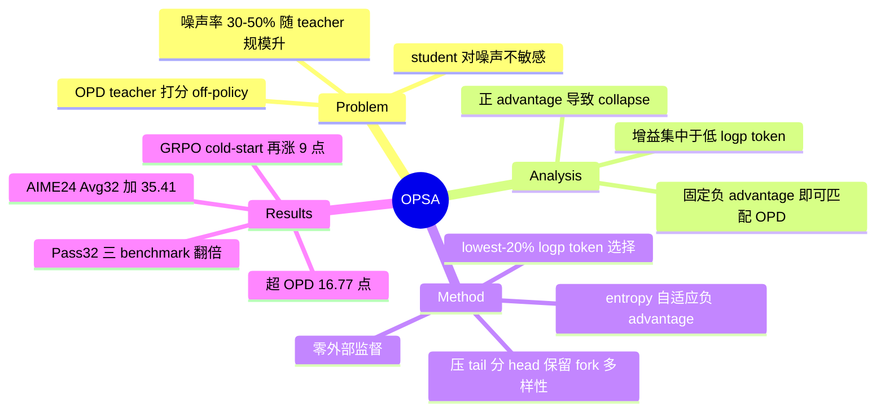

## Summary

本文系统解构 on-policy distillation (OPD) 的增益来源：teacher 对 student 轨迹的 advantage 监督噪声率高达 30.6%-50.6% 且随 teacher 规模增大，但 student 对噪声完全不敏感；进一步消融发现增益集中在低 log-prob token 上，且用一个固定负 advantage 就能复现 OPD 性能——即 OPD 的机制更像"压制自身低概率 token"而非知识蒸馏。据此提出完全无监督（无 teacher、无 reward、无 hint）的 On-Policy Self-Adaptation (OPSA)：只更新每条 rollout 中 logp 最低的 20% token，施加随 token entropy 增大的负 advantage。在 Qwen3-1.7B 上 AIME24 Avg@32 从 13.44 升至 48.85（+35.41，相对 263%），超 OPD 16.77 点，三个数学 benchmark 的 Pass@32 全部翻倍以上。

## Problem & Motivation

RLVR（GRPO/DAPO 等）的 outcome-level reward 对 long-horizon reasoning 过于稀疏，且组内同正误时 normalized advantage 归零。OPD 用强 teacher 在 student 采样轨迹上做 reverse-KL（K1 estimator）提供 token-level advantage 作为替代，但存在一个根本疑问：student 轨迹对 teacher 而言是 off-policy 的，teacher 在这些前缀上给出的监督是否可靠？OPSD 系列用"policy + hint"替代外部 teacher，但保留了同样的 advantage-assignment 范式，问题未解。本文先量化这一监督噪声，再追问 OPD 的性能提升究竟从何而来。

## Method

**诊断链条（三步消融）**：
1. **噪声量化**（Sec 2.2）：以 `\boxed{}` 答案 token 上 advantage 符号与 verifiable reward 是否一致定义 noisy supervision。Qwen3-1.7B student 下，4B teacher 总噪声率 30.6%（20.4% 正确轨迹被判负、40.8% 错误轨迹被判正），30B-A3B 为 34.7%，235B-A22B 达 50.6%——最大 teacher 对 97.8% 的正确答案 token 也给负 advantage，监督几乎与正误无关。作者归因于 student-teacher 分布失配随 teacher 规模增大。
2. **噪声不敏感**（Sec 2.3）：只用含噪声轨迹训练、剔除噪声轨迹训练、标准 OPD 三者以相近步数收敛到相近性能——增益可能不来自 behavior matching。
3. **归因**（Sec 3）：token 侧，29.2% token advantage 恰为零、51.7% 幅值低于 10^-4，集中在 student 高 logp token 上，这些 token 即便换成随机 advantage 也不产生训练效果；信号侧，只训 logp 最低 20% token 且把全部 advantage 换成固定 -0.5 即可匹配标准 OPD，固定 +0.2 则 40 步内 response 长度归零、梯度爆炸（policy collapse）。

**OPSA**（Sec 4）：在"固定负 advantage + lowest-20%-logp token"配方上加 entropy 自适应调制：`A_dyn = -1/2 - (H - H_min) / (2 * (H_max - H_min))`，其中 H_min/H_max 在该 response 的 lowest-20% 位置内归一化，熵越高负信号越强（δ=1 优于 δ=-1 与固定值）。机制分析（Sec 4.3）：负 advantage 压制 tail token 并把概率质量重新分配给 head token——在低熵位置锐化分布、在高熵 fork 位置于 head token 间均匀重分配从而保留探索多样性。无 teacher forward pass，训练开销低于 OPD。

## Key Results

- **主结果**（Table 2，均 non-thinking mode，训练只用 DAPO-17k 的问题不用答案）：Qwen3-1.7B 上 AIME24 Avg@32 13.44→48.85（+35.41，263.5%）、Pass@32 40→80；AIME25 Pass@32 30→66.67；HMMT25 23.33→50。Qwen3-4B AIME24 +38.75；已较强的 Qwen3.5-9B 仍 +11.46（AIME24）/+22.92（HMMT25）。
- **对比基线**（Table 3）：OPSA 48.85 vs OPD 32.08（Qwen3-4B-Instruct teacher）、GRPO 33.96、OPSD 33.33、TTRL 19.90；三个 benchmark 平均超最佳基线 +11.04 Avg@32 / +8.89 Pass@32。TTRL 的 Pass@32 反而从 40 降到 30（self-consistency 训练把分布锐化到局部最优）。
- **效率**（Table 6）：Qwen3-1.7B 每步 46.3s，低于 OPD 61.2s、GRPO 186.2s（无 teacher forward、无组采样）。
- **机制验证**：mask 掉 head-token 集含反思词的 fork 位置后，OPSA 的长度与准确率增益基本消失、约 300 步时长度崩塌（Fig 8）；token-budget 对照（给 GRPO/OPD 续写 "wait" 到 ~23K token）不涨分（32.81/31.67 vs OPSA 48.85，Table 8），排除"变长即变好"；Jaccard distance 显示长文多样性与 base 相当，Pass@32 同步上升即未发生多样性坍缩。
- **附加**：OPSA checkpoint 作 GRPO cold-start 可再涨约 9 点 Avg@4（Fig 12）；OOD 上 MBPP+ 仅 +1.20、GPQA-Diamond +4.48。

## Evidence Ledger

| Claim ID | Claim | Type | Source locator | Evidence excerpt | Status |
|:--|:--|:--|:--|:--|:--|
| C1 | teacher 监督噪声率 30.6%/34.7%/50.6% 随规模升；235B 对 97.8% 正确答案给负 advantage | number | Sec 2.2, Fig 2(a) | "overall noise rate of 30.6%... 34.7% for the 30B-A3B teacher and 50.6% for the 235B-A22B" | source-verified |
| C2 | 只用噪声轨迹训练与标准 OPD 收敛到相近性能 | causal-mechanism | Sec 2.3, Fig 2(b) | "all three settings converge to comparable performance after a similar number of gradient steps" | source-verified |
| C3 | 29.2% token advantage 为零、51.7% 幅值低于 10^-4，集中于高 logp token 且无训练效果 | number | Sec 3.1, Fig 3 | "29.2% of tokens have exactly zero advantage, and 51.7% have advantage magnitude below 10^-4" | source-verified |
| C4 | 固定 -0.5 advantage 匹配 OPD；固定 +0.2 导致 policy collapse | comparison | Sec 3.2, Fig 4 | "the response length progressively decreases to nearly zero while the gradient norm explodes" | source-verified |
| C5 | δ=1 熵自适应负 advantage 达 50.0% avg@4，远超 OPD 的 35.13% | comparison | Sec 4.1, Fig 5 | "ultimately reaching 50.0% and substantially outperforming standard OPD at 35.13%" | source-verified |
| C6 | OPSA 只更新 lowest-20%-logp token，A_dyn 公式如上，零外部监督 | causal-mechanism | Sec 4.2, Eq. 5 | "requires no external supervision of any kind" | source-verified |
| C7 | Qwen3-1.7B AIME24 Avg@32 +35.41（263%），三个 benchmark Pass@32 翻倍以上 | number | Table 2, Sec 5.2 | "improves Avg@32 by 35.41 points on AIME24... more than doubles Pass@32" | source-verified |
| C8 | OPSA 超 OPD 16.77 点；平均超最佳基线 +11.04 Avg@32 / +8.89 Pass@32 | comparison | Table 3, Sec 5.2 | "outperforms OPD by 16.77 points in Avg@32... surpasses the best baseline by 11.04 points" | source-verified |
| C9 | 训练只用 DAPO-17k 问题不用答案；non-thinking mode；slime 框架 8xH100/H200 | benchmark-setting | Sec 5.1, App B | "trained on DAPO-17k... using only the questions, without access to labels" | source-verified |
| C10 | mask 反思词 fork 位置后增益基本消失，约 300 步长度崩塌 | causal-mechanism | Sec 5.3.1, Fig 8 | "masking these fork tokens largely eliminates the increases... collapses at approximately 300 training steps" | source-verified |
| C11 | token-budget 对照下 GRPO/OPD 加长不涨分（32.81/31.67 vs OPSA 48.85） | comparison | App C.3, Table 8 | "GRPO (wait) 23261 32.81; OPD (wait) 23472 31.67; OPSA 23205 48.85" | source-verified |
| C12 | 每步训练时间 OPSA 46.3s vs OPD 61.2s vs GRPO 186.2s | number | App B.3, Table 6 | "Step Time (s)... GRPO 186.2... OPD 61.2... OPSA 46.3" | source-verified |
| C13 | 代码在 GitHub DripNowhy/On-Policy-Self-Adaptation，HF collection 已放出 | license-code | 论文首页 badge 链接 | "github.com/DripNowhy/On-Policy-Self-Adaptation" | source-verified |
| C14 | OOD 增益小：MBPP+ +1.20、GPQA-Diamond +4.48（Qwen3-1.7B） | number | Table 2 | "MBPP+ 58.24 to 59.44, +1.20; GPQAD 27.92 to 32.40, +4.48" | source-verified |
| C15 | TTRL 在 AIME24 上 test-time 训练后 Pass@32 降至 30（低于 base 40） | comparison | Table 3, Sec 5.2 | "self-consistency-based training tends to sharpen the policy distribution... substantially degrading Pass@k" | source-verified |

## Strengths & Weaknesses

**亮点**
- 典型的"解构式"研究：噪声量化 → 噪声不敏感 → token 归因 → 信号符号归因 → entropy 调制，每一步都有受控实验支撑，最后方法只是分析的自然产物。结论"OPD 的增益可在无 teacher 下复现"直接挑战 OPD 的 knowledge-transfer 叙事，是 problem formulation 层面的贡献。
- 机制验证做得扎实：fork-token masking（Fig 8）与 token-budget 对照（Table 8）分别排除了"反思词只是装饰"和"变长即变好"两个最常见的替代解释；Jaccard + Pass@32 双证据回应多样性坍缩质疑。
- 完全无监督（无 reward、teacher、hint）却同时超 GRPO/OPD/OPSD/TTRL/NSR，且训练更快；还能当 GRPO 的免费 cold-start——工程可用性强。
- "teacher 越大监督越 noisy"（235B 时约 50%、几乎与正误无关）对 OPD 实践是直接可操作的警示：teacher-student 分布失配主导了 off-policy 打分。

**局限**
- （作者自认，App A）只做到 9B；机制是重分配已有概率质量，对分布已很 sharp 的重度 post-trained 模型可能失效；thinking-mode 下 Pass@k 提升有限，说明 OPSA 并不扩展探索边界，更像"把已有能力用好"。
- "across model families" 实为 Qwen3 与 Qwen3.5 两代，仍全在 Qwen 家族内（推测：Qwen 系 base 在数学上有较强潜在能力，263% 相对增益的分母 13.44 很低；换 base 家族与非数学任务的可迁移性未知，OOD 仅 +1.2/+4.5 也暗示增益主要在训练同域）。
- 噪声定义只看 `\boxed{}` 答案 token 的 advantage 符号，是必要的 proxy（作者承认 per-token reference 不可得），但不能覆盖中间步监督质量；"OPD 不蒸馏"的强结论应限定在 K1-estimator 版 OPD 上——作者在 Conclusion 也只说 "calls for a reexamination"，对 GKD 等混合采样/其它 divergence 变体不必然成立。
- AIME24/25、HMMT25 各仅 30 题，Pass@32 的量化噪声不小（推测：±1 题即 ±3.33 点）；checkpoint 按验证集 Avg@4 挑选，与基线做法一致但仍属 best-checkpoint 口径。

## Mind Map

## Notes

- 与 [[Papers/2608-TTPO]]（test-time policy optimization）和 TTRL 同属 label-free self-improvement，但本文用 token-level 负信号避开了 trajectory-level 自奖励的 Pass@k 坍缩问题，可作为该谱系里"信号粒度决定坍缩与否"的证据点。
- 与 [[Papers/2608-ROPSD]]（GUI grounding 的 on-policy self-distillation）互补：本文的噪声分析直接适用于其 hint-conditioned teacher 是否可靠的问题。
- 值得追问：OPSA 本质是"温度整形"的训练时版本（压 tail、匀 head），它与 inference-time 的 min-p / top-p 采样调整的增益有多少重叠？论文的 token-budget 对照没有覆盖这个对照条件。
- 噪声随 teacher 规模增大的发现，对 step-level credit assignment 方向（Topics/StepCreditAssignment-Survey）是一个反面约束：用更强模型做 per-token 打分器并不自动更可靠。
