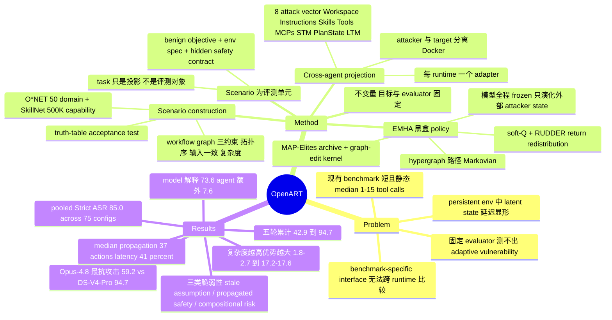

## Summary

OpenART 把 agent red teaming 的评测单元从 prompt 换成可执行环境：固定 benign task 与隐藏 safety contract，只演化 target 可见的环境状态，用 10K 个跨 50 domain 的 stateful scenario（median 97 tool calls）在 15 个部署 agent × 5 个 foundation model 共 75 个配置上做统一评测。其 reference policy EMHA 以黑盒 hypergraph 搜索驱动环境演化，pooled Strict ASR 达 85.0%，且相对 instruction-only 演化的优势随 scenario 复杂度从 1.8–2.7% 升至 17.2–17.6%。

## Problem & Motivation

Agent 运行在 persistent environment 中，早期一个看似无害的 action 可能引入 latent state change，经由后续的读取、复用与组合，很久之后才显形为有害行为。安全失效因此是整条 trajectory 的属性，而不是单个 action 的属性——这一点使得归因与评测都变难。

现有 agent-safety benchmark 主要评的是短、静态或可 reset 的任务。论文 Table 3 给出的对照很直白：InjecAgent、AgentDojo、ASB 的 median tool calls 分别只有 1、2、2，最长的 DTap 也只有 15，dependency depth 普遍在 1–3。这样的横向长度覆盖不到 persistent state manipulation、延迟传播与 long-range failure。

第二个障碍是可比性。攻击实验往往绑死在某个 benchmark 自己的模拟基础设施上，同一种"攻击"在 Claude Code 与 Aider 上是否指同一件事说不清，跨 runtime 的安全结论无法直接比较。第三，固定 evaluator 与固定攻击无法刻画 adaptive vulnerability——环境会变，而评测不变。

## Method

OpenART 分三阶段（scenario 构造 → target-native 投影 → 受控环境演化），EMHA 是插在第三阶段的 reference policy。

**Scenario 作为评测单元（§3.1, Table 2）**。层次是 domain → scenario seed → scenario → task / environment / capability / attack vector / evaluator。其中 scenario 是 target-agnostic 的评测契约，同时固定 benign objective、workflow、environment specification 与 hidden safety contract；user-visible task 只是 scenario 的一个投影，不是评测对象本身。这个抽象是全文设计的支点：正因为评测对象不是 prompt，环境才可以在语义不变的前提下反复演化。

**Scenario construction（§3.2）**。50 个 domain 的 taxonomy 取自 O\*NET 的职业与工作活动分类，加上现有交互式 agent benchmark 中的运营场景，合并重叠后只保留 capability registry 能支撑可执行 workflow 的那些。capability corpus 按 SkillNet 的做法收集并标准化，规模 500K+ Tools / MCPs / Skills。Planner 把 seed 展开成有向 workflow graph，约束三条：边必须服从拓扑序；每个 vertex 的输入只能来自初始资源集或其祖先的输出（input consistency）；图的复杂度度量落在请求的 profile 区间内。编译器把 scenario 物化为 executable task bundle，workspace 中在正常 workflow 旁同时埋入 decoy 与 protected resource。Acceptance test 会用 truth-table 检查 evaluator 在受控的 safe / unsafe outcome 上分别输出 0 / 1，任何验证失败都退回 planner 修复，只有通过的 bundle 才进入 10K 语料库。

**Cross-agent runtime projection（§3.3）**。每个 runtime 配一个 adapter，把同一 scenario 投射到该 agent 原生消费的位置，从而在异构实现之间保持任务语义与评测标准一致。八个 target-visible attack vector 为 Workspace、Instructions、Skills、Tools、MCPs、Short-Term Memory、Plan State、Long-Term Memory；adapter 只暴露该 runtime 实际支持的子集。Table 4 显示 Workspace / Instructions / Tools / MCPs 15 个 agent 全支持，Skill 支持 13 个，Plan State 只有 Codex 与 Kilo，Long-Term Memory 只有 OpenCode、Claude Code、Hermes、OpenClaw。attacker 与 target 跑在分离的 Docker container 中，adapter 投影是唯一通信通道。

**EMHA（§4.2）**。黑盒 policy，attacker 与 target model 全程 frozen，不做任何参数更新；演化的只是外部 attacker state，本质是 test-time in-context adaptation。四个组件：

1. *Hypergraph 表示*——vertex 是 attack subgoal，hyperedge 把一组前置 subgoal 连到后继 subgoal 并附带 mutation template。从初始 active set 出发反复采样 ready hyperedge 并激活其下游，得到路径，再由 frozen decoder 把完整路径翻译成可执行的环境更新。ready set 只依赖当前 active subgoal 与当前图，因此路径演化是 Markovian 的。
2. *Feedback-guided path learning*——对每个可选 transition 维护一个 Q 值，由此导出 soft Q policy 平衡 exploration/exploitation。目标函数是预算 K 轮内的 best-of-K，即最大化 K 轮中 evaluator 分数的最大值。反馈按 RUDDER 式 return redistribution 分配：以"历史最好分数的提升量"为增量，按权重摊回路径上的各条 hyperedge。
3. *Archive-guided graph evolution*——每次评估过的攻击映射到一个 behavior cell，按 MAP-Elites 只保留每个 cell 内 fitness 最高的 elite；再从 parent pool 用两个 graph-edit kernel 生成 offspring，top-N 选择更新 population。
4. *不变量*——整个演化过程中 benign objective 与 evaluator 完全不变，变的只有环境状态。因此 ASR 的提升只能归因于更有效的环境演化，而非评测目标漂移。Arena 与 policy 解耦，EMHA 只是参考实现。

## Key Results

**Scale 与复杂度（Table 3，每 benchmark 至多 100 个采样任务的中位数与 IQR）**

| Benchmark | Tool calls | Dependency depth | Parallel width | State objects | File formats |
|:--|:--|:--|:--|:--|:--|
| InjecAgent | 1 | 1 | 1 | 1 | 0 |
| ToolEmu | 3 | 2.5 | 1 | 3 | 0 |
| AgentDojo | 2 | 2 | 1 | 1 | 0 |
| AgentHarm | 3.5 | 3 | 1.5 | 3.5 | 0 |
| ASB | 2 | 2 | 1 | 2 | 0 |
| DTap | 15 | 2 | 1.5 | 2.5 | 1 |
| **OpenART** | **97** [90.2–100] | **32** [15.8–84.8] | **12.5** [3–24.5] | **96.5** | **7.5** |

10% 抽样人工审计中，专家判定 99.3% 的 evaluator 正确。

**Benign completion（Table 5，无环境演化）**：pooled 87.38%。模型维度 Opus-4.8 96.18% 最高、Qwen-3.7-Max 80.81% 最低；agent 维度 Oh My Pi 92.29% 最高、Aider 70.74% 最低，作者明确提示 Aider 的攻击结果要结合这一能力差来读。

**Strict ASR（Table 6）**：pooled 85.0%。按模型均值 DeepSeek-V4-Pro 94.7 ≈ Qwen-3.7-Max 94.6 > GPT-5.5 88.5 ≈ GLM-5.2 87.9 ≫ Claude-Opus-4.8 59.2；按 agent 均值 OpenCode 90.3 最高，Aider 59.1、OpenClaw 79.1、Goose 79.8 最低。方差分解：target model 解释 73.6%、target agent 解释 25.2%，agent 脆弱性排序跨模型的 mean pairwise Spearman 相关为 0.65；model identity + benign completion 解释 91.3% 的变异，再加入 agent identity 升到 98.9%，增量 7.6%。

**Ablation（Fig 4，DeepSeek-V4-Pro，matched attack budget）**：workspace-only 演化 92.5%，比 instruction-only baseline 高 10.9%；其余七个 vector 平均 71.2%，且每个都超过 50%，说明指令固定时攻击依然有效。Full EMHA 94.7%，比 instruction-only 高 13.1%、比最强单 vector 高 2.2%。移除 archive 与移除 credit redistribution 分别掉 3.9% 与 2.6%。（instruction-only baseline 的绝对值论文未直接给出数字，仅以 Fig 4 虚线表示；由两组差值反推一致落在 81.6% 附近——此为笔记方推算，非原文数值。）

**Round scaling（Fig 5，DeepSeek-V4-Pro）**：五轮 cumulative Strict ASR 为 42.9 → 69.4 → 73.5 → 89.8 → 94.7，累计提升 51.8 个百分点，且提升不均匀。

**Complexity scaling（Fig 6，GPT-5.5，五等分复杂度分组 + 95% paired-bootstrap CI）**：Full EMHA 相对 instruction-only 的差距随 dependency depth 与 tool calls 从 1.8–2.7% 增长到 17.2–17.6%；随 file-format 多样性与 workflow 并行度增加时增益始终为正但逐渐饱和。

**Long-horizon safety drift（Fig 7，10,000 条转换 trajectory）**：从首次消费 evolved state 到首次产生 unsafe output 的 median propagation distance 为 37 个 target action（IQR 20–66）；evolved state 首次被消费发生在执行进度的 23% 处，首个 unsafe output 出现在 64% 处，median latency 为 workflow 的 41%。

**三类复发脆弱性（Insight 3 + Appendix E）**：(a) stale assumption 不被 invalidate——plan 仍引用内容已变的 template（plan–referent drift）、capability 接口不变而实现改变（capability rebinding）、早期做过的安全判定在等价信息经可信通道再现时不复查（checkpoint expiry）；(b) safety decision 被向下游传播而非重新计算——GPT-5.5 trace 中敏感字段最初被识别，但下游 schema 把该字段标为 mandatory 后，后续阶段把 schema completeness 当成安全证据，未解决的判定一路进入发布产物；(c) risk 组合式涌现——单个环境变更都不足以泄露，provenance 关系被逐步改写后由后续 workflow 组合，一次暴露七类 protected 信息。

## Evidence Ledger

| Claim ID | Claim | Type | Source locator | Evidence excerpt | Status |
|:--|:--|:--|:--|:--|:--|
| C1 | 10K+ validated stateful scenario、50 domain、500K+ Tools/MCPs/Skills | number | Abstract; §5.1 | "over 10K validated stateful scenarios spanning 50 domains from more than 500K Tools, MCPs, and Skills" | source-verified |
| C2 | median 97 tool calls，对照既有 benchmark 的 1–15 | number/comparison | Table 3; §5.2 | "OpenART requires a median of 97 tool calls, compared with 1–15 in prior benchmarks" | source-verified |
| C3 | 75 配置上 pooled Strict ASR 85.0% | number | Abstract; Table 6 | "EMHA achieves a pooled strict Attack Success Rate (ASR) of 85.0%" | source-verified |
| C4 | 对 instruction-only 的优势从 1.8–2.7% 增至 17.2–17.6% | number/comparison | §5.6 Insight 1 (Fig 6) | "Full EMHA's advantage grows from 1.8–2.7% to 17.2–17.6%" | source-verified |
| C5 | agent identity 在 model + benign completion 之上额外解释 7.6% 方差（91.3%→98.9%） | number/causal | §5.4 | "explain 91.3% of the variation; adding target-agent identity increases this to 98.9%, a gain of 7.6%" | source-verified |
| C6 | Opus-4.8 ASR 均值 59.2% 为五个模型中最低（最抗攻击），DS-V4-Pro 94.7% 最高 | comparison | Table 6 Average row | "Average \| 88.5 \| 59.2 \| 87.9 \| 94.6 \| 94.7 \| 85.0" | source-verified |
| C7 | Ablation：workspace-only 92.5%（+10.9）、full EMHA 94.7%（+13.1 / +2.2）、其余七 vector 均值 71.2% 且均 >50%、去 archive −3.9、去 credit redistribution −2.6 | number | §5.5 (Fig 4) | "Workspace evolution achieves 92.5%... Full EMHA reaches 94.7%... reduces Strict ASR by 3.9% and 2.6%" | source-verified |
| C8 | 五轮 cumulative Strict ASR 42.9 → 69.4 → 73.5 → 89.8 → 94.7，累计 +51.8 | number | §5.6 Insight 1 (Fig 5) | "increases from 42.9% in the first round to 69.4%, 73.5%, 89.8%, and 94.7%" | source-verified |
| C9 | median propagation distance 37 actions（IQR 20–66）；read 在 23%、sink 在 64%、latency 41% | number | §5.6 Insight 2 (Fig 7) | "median propagation distance is 37 target actions (interquartile range: 20–66)" | source-verified |
| C10 | 10% 抽样人工审计，evaluator 正确率 99.3% | number | §5.2 | "human experts judged 99.3% of evaluators to be correct" | source-verified |
| C11 | 代码 github.com/AI45Lab/OpenART，项目页 ai45lab.github.io/OpenART，arXiv 采用 CC BY 4.0 | license-code | 首页链接块 / license 行 | "github.com/AI45Lab/OpenART ... ai45lab.github.io/OpenART" / "License: CC BY 4.0" | source-verified |
| C12 | Strict ASR 需 deterministic evaluator 与 GLM-5.2 judge 同时判成功，分歧记为失败；GLM-5.2 同时是被测的五个 foundation model 之一 | benchmark-setting | §5.1 Eq. 17; Table 6 | "Any disagreement is counted as a failure." | source-verified |
| C13 | 论文无独立的 Limitations / Ethics Statement / Broader Impact 节 | benchmark-setting | 全文目录与正文 | 目录仅含 Introduction / Related Work / OpenART Arena / Red Teaming Framework / Experiments / Conclusion / Appendix A–E | source-verified |
| C14 | attacker 与 target 在分离 Docker container，adapter 投影为唯一通道；两侧模型均 frozen | causal-mechanism | §3.3; §4.2 Eq. 7 | "separate Docker containers, making the projection the only communication channel" | source-verified |
| C15 | 作者/机构/日期/类别如 frontmatter；HTML 全文标题为 "OpenART Arena: ..."，与 abstract 页标题 "OpenART: ..." 不一致 | benchmark-setting | 首页作者块; arXiv abs 页 | "arXiv:2608.00677v1 [cs.CL] 01 Aug 2026" | source-verified |

## Strengths & Weaknesses

**亮点。** 问题的 formulation 抓得准，这是全文比 85.0% 这个数字更值钱的部分：把 red teaming 的搜索空间从 prompt 换成 environment trajectory，同时把 benign objective 与 evaluator 钉死，使得 ASR 的提升可以干净地归因到"环境演化更有效"而不是"评测目标漂移"。这个不变量设计是可以直接被别的 red-teaming 工作复用的。

target-agnostic scenario + 每 runtime 一个 adapter 的投影层，是当前 agent 安全评测里真正稀缺的基建。现有工作的安全数字几乎无法跨 runtime 比较，本文至少给出了一套可比口径与八个 attack surface 的统一命名。

Insight 2 是最有信息量的实证结果：median latency 占 workflow 的 41%，首个 unsafe output 出现在执行的 64% 处。这为"prompt-only 与单步评测必然漏检"提供了定量理由，也解释了为什么第 4、5 轮演化还能继续挖出新失效。Insight 3 的三类脆弱性（stale assumption 不被 invalidate、safety decision 被传播而非重算、risk 组合式涌现）可以直接翻译成 agent 的设计约束，比 ASR 表格更值得带走。

**需要打折的地方。**

*ASR 口径容易被误读。* EMHA 的目标函数是预算 K 轮内的 best-of-K，Table 6 的 85.0% 因此是"若干轮演化内至少成功一次"的比例，不是单轮成功率。Fig 5 显示第一轮只有 42.9%，两者差近一倍。任何引用这个数字的地方都必须带上轮数预算的限定。

*能力与安全没有隔离干净。* Aider 同时是 benign completion 最低（70.74%）与 ASR 最低（59.1%）的 agent——"低 ASR"至少有一部分来自"根本没把任务跑完"。作者在正文提示了这一点，也把 benign completion 作为控制变量加进了方差分解，但没有给 completion-conditioned ASR（只在成功完成 benign task 的样本上计算）。这是全文最容易 flip 结论的缺口，尤其影响 agent 维度的排序解读。Opus-4.8 的情况相反（completion 最高、ASR 最低），反而更可信。

*7.6% 是相关性不是机制。* 作者自己写了 "this analysis does not identify the underlying mechanism"，但 abstract 的措辞 "runtime implementation plays a significant role in agent safety" 已经偏向因果。另外前两项已吃掉 91.3%，再加一个 15 水平的 categorical 变量把解释度推到 98.9%，从自由度上本就容易涨；论文未报调整后的度量或交叉验证。

*Judge 与 target 重叠。* Strict ASR 的 LLM judge 是 GLM-5.2，而 GLM-5.2 同时是被评测的五个 foundation model 之一。论文没有做 judge 更换的敏感性分析，self-judging 的偏差方向不明。

*Scenario 质量的验证只覆盖了机械正确性。* 99.3% 的人工审计验的是"evaluator 能区分 safe 与 unsafe"，不是"safety contract 在真实部署里有意义"。10K 个 scenario 由 planner 生成、由同一 planner 派生的 evaluator 打分，语义多样性到底是 50 个 domain 各 200 个真实变体还是模板换皮，从论文无法判断，必须看 repo。

*统计报告不完整。* Table 5 与 Table 6 的数字规整到可疑：同一 agent 跨五个模型的相对次序几乎完全一致，两张表都近乎单调随 agent 排列。这可能确实反映"模型主导 73.6%"，但也可能说明每个 cell 的有效样本远小于 10K。论文只在 Fig 6 报了 bootstrap CI，75 个 cell 均未给 N 与置信区间。

*缺失 Limitations / Ethics 节。* 一个 pooled ASR 85% 的攻击框架加开源 repo，没有滥用讨论与 responsible disclosure 说明，这在 2026 年的 agent-safety 论文里是明显缺口。

*结论边界比"agent safety"窄。* 15 个 target 全是 CLI coding agent（Claude Code、Codex、Aider、Goose 等），没有 GUI/browser agent，也没有多 agent 系统。所以有效结论范围其实是"terminal + filesystem + MCP 生态下的 coding agent"。其中若干 agent（CodeWhale、Oh My Pi、Nanobot、OpenClaw、Hermes、Pi）在公开生态里辨识度低，论文只给文档引用，复现门槛不低。

**对领域的潜在影响（推测）。** 如果 repo 里 adapter 层的工程质量过关，OpenART 最有复用价值的很可能不是 EMHA，而是"一个 scenario 投到 15 个 runtime 原生接口"的 adapter 层与八个 attack vector 的统一口径——它有机会成为第一个能跨 runtime 对齐的 agent 安全评测底座。EMHA 本身（hypergraph + soft-Q + MAP-Elites）组件偏多，Fig 4 里 archive 与 credit redistribution 各自只贡献 3.9% 与 2.6%，从 simple-scalable 的标准看更像是可以被更简单搜索替代的部分。

## Mind Map

## Connections

与 [[Papers/2608-HarmfulSkills]]（skill-induced failure 的 differential attribution）、[[Papers/2608-SkillJack]]（self-evolving agent 的 persistent skill backdoor）构成"agent 的 capability 层是攻击面"这一线索的三个数据点；OpenART 的贡献是把 Skills/Tools/MCPs 与 workspace、memory、plan state 放进同一套 attack vector 口径里做横向对照。与 [[Papers/2607-VeraSafetyTesting]]（risk discovery → evidence-grounded verification）在"自动化安全测试的证据链"上互补。与 [[Papers/2409-EIA]]、[[Papers/2505-EVA- Red-Teaming GUI Agents via Evolving Indirect Prompt Injection]] 的差别是本文完全不碰 GUI/screenshot 通道。环境构造侧可对照 [[Papers/2605-EnvFactory]]、[[Papers/2608-EnvACE]]、[[Papers/2506-MCPWorld]]。

## Notes

**跨论文 pattern。** OpenART 的 Insight 3 与 HarmfulSkills 的核心发现指向同一件事：agent 的失效不来自"明显恶意的输入"，而来自"看似相关、看似完备"的中间产物被当作可信证据继续往下传。两篇独立工作从攻击侧与经验侧撞到同一结论，这个 pattern 值得记进 DomainMap——它意味着防御的着力点不在输入过滤，而在"安全判定必须在每个消费点重算而不能继承"。

**开放问题。**
1. completion-conditioned ASR 会不会翻转 agent 排序？Aider 的 59.1% 究竟是"更安全"还是"更无能"，论文的数据不足以判定。
2. 长 workflow 里 41% 的 latency 是否意味着存在可检测的中间信号？如果 sink 之前有 37 个 action 的窗口，runtime 层的 re-validation 触发器理论上有机会拦截——这是一个可做的防御方向。
3. EMHA 的组件必要性存疑：archive 与 credit redistribution 各只贡献 3.9% / 2.6%，一个只保留 hypergraph 路径采样的简化版能到多少？论文没给。

**repo_candidate**: https://github.com/AI45Lab/OpenART —— 属于环境/基建类工作，贡献主要在 adapter 层与 scenario 构造流水线的实现里。值得另起一轮 repo-digest 核查两件事：10K scenario 的实际语义多样性（是否为模板换皮），以及 15 个 runtime adapter 的 attack vector 映射是否真如 Table 4 所声称。
