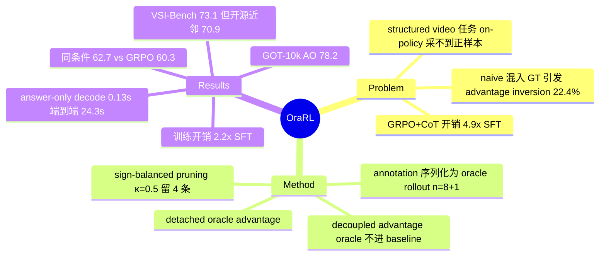

## Summary

OraRL 把 structured video 任务的人工 annotation 序列化成模型 response 格式，作为一条 oracle rollout 追加进 GRPO 的 on-policy group，并用 decoupled advantage estimator 把 oracle 排除在 baseline 之外，避免"加入 GT 反而把 22.4% 的正 advantage rollout 翻成负"的 advantage inversion。配合 sign-balanced pruning（κ=0.5 只反传 4/9 条 rollout），训练开销降到 SFT 的 2.2×（GRPO+CoT 为 4.9×），且全程 answer-only 不生成 CoT。在 Qwen3.5 0.8B-9B 与 Qwen3-VL-8B 上，temporal grounding / tracking / segmentation / spatial 等七类任务全面超过 GRPO（同 4B 设置 62.7 vs 60.3）。

## Problem & Motivation

Video MLLM 的 RL post-training 在 structured 任务（temporal interval、box、mask、trajectory）上样本效率极低：on-policy rollout 几乎采不到与精确 annotation 一致的输出，导致 GRPO 的 group 里缺少可靠的正样本 anchor——annotation 明明在手，却只被当作 reward 的参照物。叠加 CoT 生成的解码开销，GRPO+CoT 的 step time 达到 SFT 的 4.9×。而 naive 的修法（把 GT 直接混进 rollout group 一起算 advantage）会抬高 group baseline：论文量化了这个 failure——22.4% 被 GRPO 判为正 advantage 的 rollout 被翻成负，42.5% 的 group 含至少一次 inversion，8.3% 的 group 失去全部正样本，最终 naive GT injection（55.4）反而低于 GRPO baseline（60.3）。

## Method

核心是三个组件，全部只动 advantage 计算与分组，不改 reward、不加模型：

1. **Annotation as oracle rollout**：每条 annotation 经 task-specific transform `o_gt = T_task(y)` 序列化为模型 response 格式，追加到 n=8 条 on-policy rollout 后构成 9 条的 group；on-policy rollout 全部保留不变。
2. **Decoupled advantage estimator**：on-policy advantage 用 `A_i = r_i − μ_op`（不做方差归一化），baseline 均值 μ_op **只由 on-policy rollout 计算**，oracle 不参与——这是避免 advantage inversion 的关键。高于均值的 rollout 乘一个 directional gain（由 σ_aug/σ_op 决定，clip 到 [1,4]）；oracle 自身拿一条 detached advantage `A_gt = min(2w_q, clip(1.2·A_max⁺, 0.05, 1))`，其中 reward-gap weight w_q 随 oracle 与 on-policy 均值的差距缩放，作为独立优化目标。
3. **Sign-balanced pruning**：每 group 只保留 K=⌊n(1−κ)⌋ 条 rollout 做反传——oracle 恒保留，正负号各半、按 advantage 幅度排序选取，再做 moment correction（零均值 + RMS 尺度匹配）。选择性反传带来 1.48× 加速；κ=0.5 时 step time 从 92.5 s 降到 62.4 s，平均分只降 0.4。

**训练配置**：Qwen3.5（0.8B/2B/4B/9B）与 Qwen3-VL-8B，均从 SFT checkpoint（284,779 prompts）出发，RL 用 100,032 prompts 覆盖七类任务（temporal/highlight grounding、spatial grounding、tracking、video/image segmentation、spatio-temporal grounding、video QA、spatial intelligence），统一接口、answer-only、无 CoT。产出模型命名 Video-ORA。

## Key Results

- **同条件范式对比**（Qwen3.5-4B 同 init/数据/预算，Table 12/13）：OraRL 62.7 > Dr. GRPO 60.7 > GRPO 60.3；LUFFY-style off-policy guidance 54.7、naive GT injection 55.4 均低于 GRPO——说明"专家轨迹不污染 baseline"比"混入专家轨迹"更关键。
- **训练效率**：OraRL 62.4 s/step ≈ 2.2× SFT（27.84 s/step），GRPO+CoT 135.6 s/step ≈ 4.9×；answer-only 下 OraRL 61.4 vs GRPO 58.7（temporal grounding 三集平均，换算 +2.7 点、step time −33.5%）。
- **各任务**（Video-ORA-9B）：GOT-10k tracking AO 78.2（OneThinker-8B 73.0，backbone 46.0）；MeViS J&F 61.3（OneThinker-8B 52.7）；Charades/ActivityNet/QVHighlights mIoU 61.8/63.6/72.5（均超 TimeLens2-8B 与 Gemini-2.5-Pro）；video QA 宏平均 66.8 vs backbone 61.9。
- **VSI-Bench**：宏平均 73.1，表内 GPT-5 55.0、Gemini-3-Pro 55.1、Qwen3.5-9B 57.9——但最强开源 baseline LLaVA-OneVision-2-8B 已 70.9，真实增量 2.2 点；且 MMSI-Bench+MindCube-Tiny 平均 47.7 仍低于 Grok-4 50.7 与 GPT-5 49.1（口径讨论见下节）。
- **推理延迟**：answer-only 使 post-TTFT decode 从 4.78 s（backbone CoT）降到 0.13 s；但 10 分钟视频端到端中位延迟为 24.30 s vs backbone 29.03 s——瓶颈在 video prefill（TTFT ≈ 24.2 s），端到端加速远小于 "130 ms vs 4,780 ms" 的字面印象。
- **数据 scaling**（方向性结论）：6.4k→100k prompts，OraRL 在两个聚合指标上分别 +5.2/+3.6 点，GRPO 为 +2.8/+3.1；曲线端点绝对值仅存在于 Figure 5 图像中，未能核查。

## Evidence Ledger

| Claim ID | Claim | Type | Source locator | Evidence excerpt | Status |
|:--|:--|:--|:--|:--|:--|
| C1 | VSI-Bench 宏平均：Video-ORA-9B 73.1；GPT-5 55.0；Gemini-3-Pro 55.1；Qwen3.5-9B 57.9；LLaVA-OneVision-2-8B 70.9 | comparison | Table 6 | Video-ORA-9B 73.1; GPT-5 55.0; Gemini-3-Pro 55.1; LLaVA-OneVision-2-8B 70.9 | source-verified |
| C2 | 论文未说明 proprietary baseline 分数是自测还是引用、是否启用 thinking/CoT | benchmark-setting | Table 6/8 无脚注；Sec 4.1 setup | "Video-ORA generates answers directly, without chain-of-thought decoding"（仅约束自家模型） | source-verified |
| C3 | 训练开销：OraRL 2.2× SFT step time，GRPO+CoT 4.9×（62.4 / 135.6 / SFT 27.84 s/step） | number | Abstract + Figure 7(a) + Table 11 | "just 2.2x the step time of SFT, less than half the 4.9x required by GRPO with CoT" | source-verified |
| C4 | 130 ms vs 4,780 ms 为 post-TTFT decode 口径；端到端中位 24.30 s（TTFT ≈24.17 s 主导），4.78 s 属 backbone CoT 模式 | benchmark-setting | Abstract + Sec 4.12 + Figure 7(b) | "latency after TTFT rises from 0.13 to 4.78 s"; median 24.30 s | source-verified |
| C5 | naive 混入 annotation 使 22.4% 正 advantage rollout 翻负；8.3% group 失去全部正样本 | number | Table 14 | "42.5% contain at least one inversion and 8.3% lose every positive rollout" | source-verified |
| C6 | annotation 经 T_task 序列化为 response 格式追加为 1 条 oracle rollout（n=8+1）；oracle 排除在 on-policy baseline 外、拿 detached advantage | causal-mechanism | Sec 3 Method | "Appending the oracle...preserves all n on-policy rollouts"; "detached oracle advantage" | source-verified |
| C7 | κ=0.5 剪到 4 条 rollout，step time 92.5→62.4 s，平均仅降 0.4 点 | number | Table 16 | "cuts step time from 92.5 to 62.4 s while lowering the average by 0.4 points" | source-verified |
| C8 | 同 Qwen3.5-4B init/数据/预算：OraRL 62.7 > Dr. GRPO 60.7 > GRPO 60.3 > naive GT injection 55.4、LUFFY-style 54.7 | comparison | Table 12/13 | OraRL 62.7; GRPO 60.3; Dr. GRPO 60.7; LUFFY-style 54.7; naive 55.4 | source-verified |
| C9 | GOT-10k：Video-ORA-9B AO 78.2；OneThinker-8B 73.0；backbone 46.0 | number | Table 4 | AO 78.2 / 73.0 / 46.0 | source-verified |
| C10 | 100k prompts 端点值：OraRL 63.8 vs GRPO 58.7 vs SFT 52.6 | number | Figure 5(a)（曲线图像，正文无数字表） | 正文仅有增量："OraRL gains 5.2 and 3.6 points...compared with 2.8 and 3.1 for GRPO" | not-checkable |
| C11 | MMSI-Bench+MindCube-Tiny 平均：Video-ORA-9B 47.7 < GPT-5 49.1 < Grok-4 50.7 | comparison | Table 8 | 47.7; Grok-4 50.7; GPT-5 49.1 | source-verified |
| C12 | 代码与数据公开：github.com/HVision-NKU/OraRL；HF 数据集 OraRL/OraRL-Data | license-code | HTML 首页 header 链接区 | sourcecode github.com/HVision-NKU/OraRL; data huggingface.co/datasets/OraRL/OraRL-Data | source-verified |
| C13 | answer-only：OraRL 61.4 @62.4 s/step vs GRPO 58.7 @93.9 s/step（+2.7 点 / −33.5% 为换算值） | number | Table 11 + Sec 4.12 | OraRL 61.4 @ 62.4 s vs GRPO answer-only 58.7 @ 93.9 s | source-verified |

## Strengths & Weaknesses

**亮点**

- **问题定位准，方法极简**：抓住 structured video 任务 RL 的真瓶颈——on-policy 采样采不到精确 annotation，group 内无正 anchor。解法只改 advantage 计算与分组，不改 reward、不加模型、不需要 CoT，符合 simple/scalable 品味。
- **Advantage inversion 的量化分析是全文最有信息量的部分**（22.4%/42.5%/8.3%），它直接解释了为什么 naive GT injection（55.4）反而比不加 GT 的 GRPO（60.3）更差——这是"直觉修法为何 break"的干净反例。
- **与 LUFFY-style 的对比（54.7）传递了明确 message**：把 off-policy 专家轨迹混进 group 不是增益来源，让专家轨迹不污染 on-policy baseline 才是。ablation 完整（directional gain −1.5、detached oracle −1.4 等逐项可查）。

**口径审查（headline 数字需打折）**

- **VSI-Bench 73.1 vs GPT-5 55.0 / Gemini-3-Pro 55.1 的对比有三重折扣**：(a) 论文未说明 proprietary 分数来源与是否开 thinking 模式（C2，两轮检索确认无协议说明）；(b) 最强开源近邻 LLaVA-OneVision-2-8B 已 70.9，对开源 SOTA 的真实增量是 2.2 点而非 18 点；(c) 训练任务含 spatial intelligence 类数据而 GPT-5/Gemini 是 zero-shot 通用模型——in-domain post-training 对 zero-shot 的对比口径不对等（推测：训练集与 VSI-Bench 的分布重合程度未核查）。旁证是 out-of-mix 更重 reasoning 的 MMSI/MindCube-Tiny 上仍输 Grok-4 与 GPT-5（47.7 < 50.7/49.1），且 VSI-Bench 内 route planning 单项 47.4 远低于 Gemini-3-Pro 61.9。
- **Latency 宣传口径**："130 ms vs 4,780 ms" 是 post-TTFT decode 延迟，端到端中位只有 24.30 s vs 29.03 s——video prefill 主导时，去掉 CoT 的端到端收益约 16%，与摘要的 37× 字面印象差距很大。
- 2.2×/4.9× 训练开销经核实自洽（SFT 27.84 s/step）。

**适用边界**

- 方法依赖 annotation 可序列化为唯一 response——interval/box/mask/trajectory 天然适配；开放式生成、多解任务无单一 oracle，方法不直接迁移。
- Answer-only 是双刃剑：省掉 CoT 换来效率，但 reasoning-heavy 任务（MMSI、route planning）的短板论文自己的表格就能看到。"什么任务需要 CoT、什么任务只需要精确监督信号"是这篇留下的开放问题。

## Mind Map

## Notes

- 与 vault 内 step-level credit assignment 线索（[[Topics/StepCreditAssignment-Survey]]）相关：OraRL 是"用现成监督信号替代昂贵 rollout"的另一条路径——不反推步级 reward，而是把 GT 本身当作 rollout 注入 group，两者可对照。
- code 已开源（HVision-NKU/OraRL，另有 HF 数据集与模型），属训练方法类而非基建类，暂不标 repo_candidate。
- C10（Figure 5 端点值）如后续需要，可等 GitHub repo 放出 log 或论文 camera-ready 数字表再补核。
