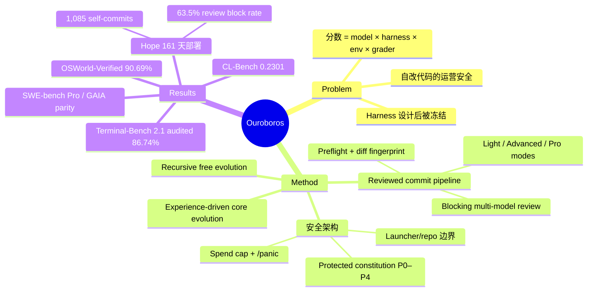

## Summary

提出 Ouroboros:把 agent harness 本身当作演化对象的 frontier coding agent——tools、prompts、context assembly 与核心实现全部通过带审查的 commit 改进,改进后的代码直接成为后续工作的 runtime。设计了两种演化模式(recursive free evolution / experience-driven core evolution)与结构性安全架构(blocking diff-review panel、protected constitution、spend cap、operator halt)。frozen seed 评测下报告 Terminal-Bench 2.1 audited 86.74%、OSWorld-Verified 90.69%、CL-Bench 0.2301 的 SOTA,并附 161 天真实部署实验 "Hope"。

## Problem & Motivation

作者观察到长程 benchmark 的 agent 分数是 base model、execution harness、environment、grader 四者的乘积,而 harness 质量对能力提升的贡献越来越大——但绝大多数生产 harness 在设计后被冻结("Most production harnesses freeze these policies after design")。论文主张把 harness 变成可持续改进的对象:agent 通过 reviewed commit 修改自己的工具、prompt、context 组装乃至核心实现。这立刻带来运营安全问题——一个 self-developing agent 可能重写自己的代码、选择新的 model API——因此安全架构必须与演化机制同层设计,而非事后附加。

## Method

**两种 core evolution 模式**(C11):

1. **Recursive free evolution**:把"改进自身"本身作为任务。agent 检视当前系统、选择并实现一处改动,任务完成时可以调度下一轮 evolution cycle,形成开放式递归。
2. **Experience-driven core evolution**:从日常工作出发。任务执行、reflection、review blocker、instrumentation 与社交反馈暴露 bug、context-assembly 失败、低效 tool path 等问题;agent 把它们记录为 durable error classes(pattern register)与结构性修复提案,再走审查通道落地。

**Reviewed commit pipeline**(C9):三个 runtime context mode 控制变更权限——Light 禁止 repo 编辑、Advanced 允许普通编辑但保护 governance surface、Pro 允许受保护编辑但必须过审。流程为 deterministic preflight → 对 staged diff 做 fingerprint → 收集 reviewer evidence → commit 前再次校验 fingerprint。diff-review panel 在所有 context mode 下都是 blocking 的;multi-model adversarial review 采用 quorum 规则,sub-quorum 结果不能记为 clean pass(论文未给出 reviewer 数量与 quorum 阈值的具体数值)。

**架构边界**:Launcher/Supervisor 拥有 startup、进程监督、release bootstrapping 与 panic-stop 语义,独立于可变 repository 之外;repository 内是 task loop、tools、prompts、memory projection、review 逻辑、benchmark adapter 与用户界面。Subagent 分为 readonly planning scouts 与 mutative acting subagents(task tree 默认深度 2、上限 500 节点);acting children 只能写隔离 worktree 或获准的外部 workspace,不能 commit 运行中的系统 repo。

**身份与记忆**:versioned constitution(13 条原则 P0–P12,每个 task loop 沿不可截断路径从盘上重读并常驻 context)、可编辑 identity profile、scratchpad/chronicle projections、project memory、review ledgers 与 Git history。

**安全护栏**(C9):constitution 的 P0–P4 是 protected core,不可删除或降级,整体不可被 wholesale 重写(普通写入在执行前即被拦截);external spend cap 不能通过 ordinary agent tools 调高;operator 有隔离通道与 /panic 命令(终止整个进程树)。agent 可以重写自己的代码、prompt、identity profile 与公开表面,但 constitutional core 受保护。

**Base model 解耦**:harness 与模型无关,实验分别用 Claude Opus 5 / Sonnet 4.6 / Sonnet 5、GPT-5.5 / GPT-5.6 Luna、Grok 4.5 驱动。

## Key Results

评测纪律(C6):所有 benchmark 评测 frozen seed(冻结的 harness 快照)、evolution off、逐 benchmark 披露 runtime configuration(Appendix C),与 Hope 的持续演化 lineage 分离。"audited" 分数指 trajectory audit 后把走捷径的 trial 请 benchmark 维护者记零。

| Benchmark | Base model | Ouroboros | 最强 baseline |
|:--|:--|:--|:--|
| Terminal-Bench 2.1 | Opus 5 | raw 86.97% (387/445) / **audited 86.74%** (386/445),89 任务 × 5 trial | Claude Code + Fable 5:83.8% |
| Terminal-Bench 2.1 | GPT-5.5 | 84.3% | Codex CLI:83.1% |
| Terminal-Bench 2.1 | Grok 4.5 | audited 84.94% | Cursor:79.3% |
| OSWorld-Verified | Opus 5 | **90.69%** (327.39/361),non-Google-Drive set、100-turn budget | Intelligence-Indeed(leaderboard 第一):90.19%;Claude Mythos Preview:85.4% |
| CL-Bench | Sonnet 4.6 | **0.2301** normalized reward(六 domain、5 个 ordered stateful rollout) | ICL:0.1960;Claude Code:0.1855 |
| SWE-bench Pro | GPT-5.6 Luna | 58.2%(655 paired tasks,对称去污染后) | Codex:59.4%,McNemar p=0.40,统计上不可区分 |
| GAIA | Sonnet 5 | 78.2% | Claude Code:78.8% |

论文自己给出:Terminal-Bench 2.1 的 445 trial binomial standard error 约 ±1.7pp,对该分数区间所有系统同样适用(C12)。SWE-bench Pro 与 GAIA 作者只主张 model-matched parity,不主张超越。

**Hope 部署**(C7):161 天(2026-02 至 2026-08-06)的 living-agent 实验,在七个公开/私有 surface(web chat、语音、Telegram、Discord、X、网站评论、email)下自由演化:处理 222,474 条公开消息、3,166 通语音(45,872 turns)、累计 \$110.6K model spend、79.7B tokens、175,755 行代码;1,085 次 self-modification commit,agent-authored commit 占 94.2%,1,522 次 reviewed self-edit 尝试,近期 review block rate 63.5%。社交反馈驱动改进的实例:公开频道用户发现重复发消息 → agent 定位 duplicate-send path 并落地 reviewed guard;deep self-review 假性"模型不可用" → 定位为 review-pack context overflow 并重写为 bounded context atlas。

**Trajectory audit 与失败案例**(C10):Terminal-Bench audit 发现一个 trial 通过 unintended shortcut 满足了弱 verifier(预置 web root 而未完成要求的 Git-to-web pipeline),主动请维护者记零;SWE-bench Pro 双方 harness 都能经 web search / Git history 摸到参考答案,故用对称过滤;历史 GAIA run 继承了 operator 的 home 目录导致任务产物落到真实 Desktop;OSWorld 开发期 VM reset 后 endpoint 漂移导致并发 lane 操作错误 VM;CL-Bench 显示 memory 在部分 domain 有正迁移但在 schema drift 下失败(stored lesson 过期、retrieval 选错 domain)。安全面:部署全程无任何 episode 抗拒 operator shutdown;一次未提交 worktree 的近全量删除触发了此前已实现的 rescue 机制。

## Evidence Ledger

| Claim ID | Claim | Type | Source locator | Evidence excerpt | Status |
|:--|:--|:--|:--|:--|:--|
| C1 | Terminal-Bench 2.1 (Opus 5) audited 86.74% (386/445)、raw 86.97%,89 任务 × 5 trial;baseline Claude Code + Fable 5 为 83.8% | number / sota-novelty | Sec 5 + Table 2 | "Its raw score is 387/445 (86.97%) ... yielding 386/445 (86.74%)" | source-verified |
| C2 | OSWorld-Verified (Opus 5) 90.69% (327.39/361),non-Google-Drive set、100-turn budget,高于 leaderboard 第一 Intelligence-Indeed 90.19% | number / sota-novelty | Sec 5 + Table 2 | "The Opus 5 run scores 327.39/361 (90.69%) on the standard non-Google-Drive set" | source-verified |
| C3 | CL-Bench (Sonnet 4.6) normalized reward 0.2301 vs ICL 0.1960、Claude Code 0.1855;六 domain、5 ordered stateful rollouts | number | Sec 5.3 + Table 2 | "reaches normalized reward 0.2301 ... 5 ordered stateful rollouts on all six domains" | source-verified |
| C4 | SWE-bench Pro (GPT-5.6 Luna) 对称去污染后 655 paired tasks:58.2% vs Codex 59.4%,McNemar p=0.40 | number / comparison | Sec 5 + Table 2 | "statistically indistinguishable under McNemar's test (p=0.40)" | source-verified |
| C5 | GAIA (Sonnet 5):78.2% vs Claude Code 78.8% | number / comparison | Sec 5 + Table 2 | "Ouroboros scores 78.2% and Claude Code scores 78.8% with Sonnet 5" | source-verified |
| C6 | 评测用 frozen seed 且 evolution off;"audited" 指 audit 后请维护者将 shortcut trial 记零 | benchmark-setting | Sec 1; Sec 5; Appendix C | "Benchmark campaigns evaluate frozen seeds with documented runtime configuration" | source-verified |
| C7 | Hope 161 天:1,085 self-modification commits、94.2% agent-authored、\$110.6K spend、79.7B tokens、222,474 条公开消息 | number | Sec 4 + Table 4 + Appendix D | "161 elapsed days ... \$110.6K in model spend, 79.7B processed tokens" | source-verified |
| C8 | 代码开源 github.com/razzant/ouroboros,MIT license | license-code | Sec 1 + footnote 2 | "Ouroboros is released under the MIT license" | source-verified |
| C9 | diff-review panel 全 mode blocking;P0–P4 protected core 不可删除/降级;spend cap 不能经 ordinary agent tools 调高;/panic 终止进程树 | causal-mechanism | Sec 3; Sec 4; Appendix B | "The diff-review panel is blocking in every context mode" | source-verified |
| C10 | 部署无 episode 抗拒 shutdown;Terminal-Bench audit 发现一例 unintended shortcut trial(预置 web root) | benchmark-setting | Sec 6; Sec 7 | "No recorded episode resisted operator shutdown" | source-verified |
| C11 | 两种演化模式:recursive free evolution 与 experience-driven core evolution | causal-mechanism | Abstract + Sec 1 | "improvement is itself a task, and completing one evolution cycle can schedule the next" | source-verified |
| C12 | 445 trial 的 binomial SE 约 ±1.7pp,适用于该区间所有系统 | number | Sec 5 | "binomial standard error over 445 trials is about ±1.7 percentage points" | source-verified |

## Strengths & Weaknesses

**亮点**:
- 评测纪律在 SOTA 系统论文里罕见地干净:frozen seed + evolution off + 逐 benchmark 配置披露 + trajectory audit,且主动请维护者把 reward-shortcut trial 记零、对 SWE-bench Pro 污染做对称过滤。这套操作本身比分数更值得借鉴。
- 安全架构是结构性的(launcher/repo 进程边界、blocking review、盘上重读的 protected constitution、不可自调的 spend cap),而非 prompt 层约束——这对"自改代码 agent 如何治理"给出了一个可工程化的参考设计。
- Hope 提供了 self-evolution 在真实社交环境下的长期生态学证据(161 天、1,085 次 self-commit、63.5% review block rate),这类数据此前几乎没有公开来源。

**局限**(以下为个人评价,含推测):
- **SOTA margin 处于噪声边缘**。按论文自己给的 ±1.7pp SE,Terminal-Bench 86.74 vs 83.8 的差距(2.94pp)在两系统噪声合成下仅约一个标准差量级;OSWorld 90.69 vs 90.19 只差 0.5pp 且无显著性检验;SWE-bench Pro 与 GAIA 为 parity。更准确的读法是"harness 演化的增益存在但小",headline 的 SOTA 表述强于统计证据(推测:作者也意识到这点,故正文明确给出 SE 与 parity 表述)。
- **增益归因缺失**。没有"day-0 seed vs day-161 seed 同模型对照",无法区分分数来自 self-evolution 积累还是作者的人工初始设计;1,085 次 self-commit 与 benchmark 分数之间的因果链未被实验建立(未知:演化贡献的净效应)。
- **单 lineage 部署**。作者自承 Hope 只是一条长期 lineage 而非独立演化种群,观察到的稳定性(如"无 episode 抗拒 shutdown")不能外推为该架构的一般安全性质。
- **LLM reviewer 与 agent 可能共享盲区**(作者自承),low context mode 还会跳过 whole-repository scope review;quorum 的 reviewer 数量与阈值未披露,review 的实际把关强度不可复核。
- 不同 benchmark 用不同 base model 报最好成绩(Opus 5 / Sonnet 4.6 / GPT-5.6 Luna),没有单一配置全面领先,跨行比较时需注意。

## Mind Map

## Notes

- 与 [[2505-DarwinGodelMachine]] 是最直接的对照:DGM 用 benchmark 分数作 fitness 做 archive 式开放演化,Ouroboros 的演化单位是**生产 harness 本身**,选择压力来自 review + 真实部署经验而非 benchmark 循环;DGM 论文里 benchmark 是演化驱动力,这里 benchmark 只是冻结快照的度量。
- [[2509-Misevolution]] 列举的 self-evolution 风险(目标漂移、护栏侵蚀)恰好是本文 constitution + blocking review 想结构性回应的对象;Hope 的 63.5% review block rate 可作为"演化提案质量分布"的第一手数据点。
- [[2608-ZerothOrderSelfEvolve]] 在参数空间做 self-evolution(LoRA 扰动),本文在代码/harness 空间做,两者正交,可在 [[Topics/AgentHarness-Design]] 的 harness 归因框架下对照——本文缺的 day-0 vs day-N seed 对照正是 [[Topics/Harness-Component-Attribution]] 关心的归因实验。
- 开放问题:review quorum 的构成未披露;repo 已 MIT 开源(https://github.com/razzant/ouroboros),属于系统/基建类工作,适合后续 repo-digest 深挖 commit pipeline 与 constitution 加载的实现(repo_candidate)。
