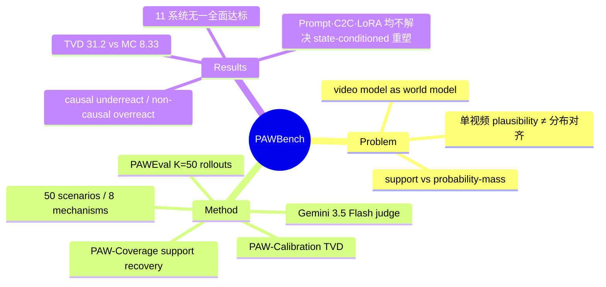

## Summary

提出 "probabilistic alignment" 作为 video world model 的分布级评价标准——模型不仅要生成单条 plausible trajectory，还要在同一初始观测和动作下复现可能行为的正确分布。PAWBench 用 50 个物理场景（25 个有解析参考分布的 PAW-Calibration + 25 个可枚举结局的 PAW-Coverage）和 PAWEval 协议（每场景 K=50 次 rollout 转成经验分布）评测 11 个视频生成系统，没有模型能同时做到概率质量对齐、宽支撑覆盖与跨场景可靠。

## Problem & Motivation

视频生成模型越来越多被当作 world model 使用，但现有评测几乎都在单视频层面打分（plausibility、物理合理性），不检验重复生成是否恢复正确的结果分布。许多物理过程本身是多结局的（抛硬币、Galton board、保龄球），下游 planning 和 decision-making 依赖的恰恰是"哪些结局可能、各自概率多大"。作者把这一分布级要求形式化为两层：**support alignment**（能实现同条件下所有 distinct outcome，不塌缩到子集）与 **probability-mass alignment**（各 outcome 以正确比例出现）——模型可以 diverse 而不 aligned，覆盖所有结局不等于分配了正确概率。

## Method

**Benchmark 结构**：50 个场景、8 组物理机制，分两个互补 track：

| Track | 场景数 | 机制组 | 参考分布 | 指标 |
|:--|:--|:--|:--|:--|
| PAW-Calibration | 25 | Tossing / Rotation / Routing / Draw | 解析指定或对称性导出（硬币、转盘、routing） | TVD×100（↓；70/30 对 50/50 参考记 20 分） |
| PAW-Coverage | 25 | Collision / Stability / Agent / Material | 有效结局可枚举、概率不指定（保龄球、bottle flip） | valid-support recovery %（↑） |

场景由 image model 生成固定源图 + 固定 action prompt，人工筛选保证机制可见、干预原子化、终态可区分。

**PAWEval 协议**：每场景每模型 K=50 次独立 rollout；Gemini 3.5 Flash 按场景专属 rubric 把视频映射到 terminal outcome；≥20/50 rollouts 给出可读、in-schema 结果才通过 outcome-readout gate（通过率记为 SPR）。判定可靠性用人类核验：每视频 7 个独立人类标注，在双方都给出明确终态标签的 888 个视频（全集 1,500）上 PAWEval 与决定性人类标签一致 81.3%（722/888）。

**三类干预实验**（诊断分布失准能否被修正）：语言侧 prompt engineering（含 Oracle 目标注入）、噪声侧 Couple to Control（C2C，对 K=50 个初始噪声引入负相关的 repulsive Gaussian coupling，保持各样本标准 Gaussian marginal）、训练侧 LoRA 分布干预（5 个 Wan2.2 adapter，left-fall pencil 视频比例 0%–100%）。

## Key Results

- **主结果（Table 1，11 系统）**：Calibration 最佳 Cosmos 3 Super I2V（TVD 20.5，SPR 80.0%）；Coverage 最佳 LTX-2.3（71.7%，但其 Calibration SPR 仅 24.0%，且 Coverage 均值只在通过 gate 的 72% 场景上计算）。**没有模型同时做到概率质量对齐、宽支撑恢复与跨场景可靠**——校准最好与覆盖最好的不是同一个模型。
- **差距不是有限采样造成的**：11 个生成器平均观测 TVD 31.2；从参考分布抽 matched 样本的 Monte Carlo 基线平均 TVD 仅 8.33，99% 模拟均值低于 9.22，且每个生成器的观测 TVD 都超过其自身 matched 基线的 99 分位。
- **因果不敏感**：模型对改变物理转移的 causal 干预（pencil tilt）分布偏移不完整或方向错误，对不改变物理的 non-causal 视觉线索（Galton board 上的文字）分布却发生偏移——underreact to causal, overreact to non-causal。
- **语言干预不解决**：VLM 直接预测的 outcome 分布本身也失准（5 个 VLM TVD 34.8–42.3）；即便 Oracle prompt 给出目标 outcome，生成器只实现 37.6–58.1% 的请求结局——controller 选错分布、generator 又执行不到位，两头都有错。
- **噪声耦合只改善探索**：C2C 把 Wan2.2 Coverage 从 63.4% 提到 69.2%、LTX-2.3 从 71.7% 提到 74.8%（Cosmos 55.2→63.9），但只在既有模型分布内更充分采样，不重塑学到的分布。
- **训练干预是全局的、非 state-conditioned**：LoRA 概率偏移随训练比例非线性变化，且 5 个 adapter 没有一个能同时匹配 upright（对称）与 left-leaning 两种场景的参考分布——改训练分布会均匀影响所有场景，缺乏按物理状态自适应的能力。

## Evidence Ledger

| Claim ID | Claim | Type | Source locator | Evidence excerpt | Status |
|:--|:--|:--|:--|:--|:--|
| C1 | 50 场景、8 机制组，25 Calibration（解析/对称参考分布）+ 25 Coverage（可枚举结局） | benchmark-setting | §3.1, Fig. 2 | "PAWBench contains 50 scenarios spanning eight mechanism groups... PAW-Calibration includes 25 scenarios... PAW-Coverage includes 25" | source-verified |
| C2 | PAWEval：K=50 rollouts，Gemini 3.5 Flash 按 rubric 判终态，≥20/50 可读才过 gate | benchmark-setting | §3.3, §4.1, App. B.3 | "we sample K=50 independent rollouts... Gemini 3.5 Flash applies this rubric... at least 20 yield readable, in-schema outcomes" | source-verified |
| C3 | 11 系统；Calibration 最佳 Cosmos 3 Super I2V（20.5, SPR 80.0%）；Coverage 最佳 LTX-2.3（71.7%，Calibration SPR 仅 24.0%） | number | §4.1–4.2, Table 1 | "Cosmos 3 Super I2V 20.5 80.0%... LTX-2.3 30.1 24.0%... 71.7 72.0%" | source-verified |
| C4 | 没有模型同时做到质量对齐、宽支撑恢复、跨场景可靠 | comparison | §4.2 (after Table 1) | "no model combines well-aligned probability mass, broad support recovery, and reliable performance across scenes" | source-verified |
| C5 | 平均观测 TVD 31.2 vs matched Monte Carlo 基线 8.33（99% 模拟 <9.22）；逐模型超自身 99 分位 | number | §4.3, App. B.4, Fig. 12, Table 8 | "observed TVD averages 31.2... average 8.33 TVD, and 99% of the simulated averages remain below 9.22" | source-verified |
| C6 | causal 干预偏移不完整/方向错，non-causal 线索却引起偏移 | causal-mechanism | §4.2, Fig. 4, App. B.5 | "Models underreact to physically causal interventions and overreact to non-causal cues" | source-verified |
| C7 | VLM 自身分布失准（TVD 34.8–42.3）；Oracle prompt 下生成器只实现 37.6–58.1% 请求结局 | number | §5.1, Tables 2–3, Fig. 7 | "GLM-5V Turbo 34.8... GPT-5.5 42.3"; "generators realize only 37.6–58.1% of the requested outcomes" | source-verified |
| C8 | C2C 负相关噪声耦合：Wan2.2 Coverage 63.4→69.2、LTX-2.3 71.7→74.8；不重塑学到的分布 | number | §5.2, Table 4, App. D.2 | "negative dependence among the K=50 initial-noise samples... rather than changing the distribution learned by the model" | source-verified |
| C9 | 5 个 LoRA Wan2.2（left-fall 0–100%）概率偏移非线性，无一同时匹配 upright 与 left-leaning 参考分布 | causal-mechanism | §5.3, Table 5, Fig. 8, App. D.3 | "five LoRA-adapted... left-fall share ranging from 0% to 100%... None of the five adapted models produces both" | source-verified |
| C10 | 每视频 7 人标注；888 个双方明确标注的视频上 PAWEval 与人类一致 722（81.3%） | benchmark-setting | §4.3, App. C, Table 9 | "seven independent human judgments... 888 videos... agrees with the decisive human label on 722 (81.3%)" | source-verified |

## Strengths & Weaknesses

**亮点**

- 问题选得好：把 world model 评测从"单条视频像不像"推进到"重复采样的分布对不对"，这是 planning 下游真正需要的性质，且此前评测基本空白。support / probability-mass 两层拆分干净，Calibration/Coverage 双 track 设计与之一一对应。
- 排除性论证扎实：matched Monte Carlo 基线（8.33 vs 31.2）把"有限采样噪声"这一最直接的替代解释定量排除；causal vs non-causal 对照（pencil tilt vs Galton-board 文字）把失准归因推进到机制层面而非单纯误差。
- 三类干预实验（语言 / 噪声 / 训练）不是附加实验，而是把"失准能否被现有手段修正"作为研究问题本身，结论一致指向：现有控制手段只能在既有分布内移动样本，无法做 state-conditioned 的分布重塑——这为后续训练目标设计留下了明确缺口。

**局限**

- 判定链条依赖 VLM judge：81.3% 的人类一致率只在双方都给出明确标签的 888/1,500 子集上成立，18.7% 的分歧率对 TVD 估计注入的噪声上界论文虽有讨论（"cannot by itself account for the gap"），但 judge（Gemini 3.5 Flash）本身属于被 §5.1 证明分布失准的 VLM 家族，rubric 映射的系统性偏差难以完全排除。
- 口径陷阱：Coverage/TVD 均值只在通过 readout gate 的场景上计算，SPR 差异大时跨模型可比性受损（LTX-2.3 的 71.7% Coverage 建立在 Calibration SPR 24% 之上）；引用单指标排名需带上 SPR。
- 作者自认的边界：只比较 terminal outcome，不覆盖轨迹级动态与中间物理过程；场景是受控、视觉可解析的原子干预，长时程/交互式/具身环境留待未来。Calibration 参考分布依赖对称性假设，真实世界中此类"ground-truth 分布已知"的场景本身稀少，benchmark 的可扩展性受此约束。

## Mind Map

## Notes

- Project page: https://pawbench.github.io（HTML 正文未给 GitHub repo 链接，code 字段留空）。
- 与 [[2604-dWorldEval]] / [[Topics/WorldModel-Survey]] 的评测线索直接相关：现有 world model 评测多在轨迹/帧质量层面，PAWBench 补的是分布层公理（stochasticity 的正确性），可作为 survey 中 "evaluation" 轴的新一格。
- 值得追问：C2C 只改采样端就能提升 Coverage 且 TVD 也普遍下降（Wan2.2 26.3→25.7、LTX-2.3 30.1→19.9），说明部分"失准"其实是采样多样性坍缩而非分布学错——论文对"探索 vs 分布"的切分可以更定量。
- LoRA 干预实验（全局比例 vs state-conditioned 适配）与 world model 可控性方向的 idea 有潜在连接：能否设计以 per-state 分布匹配为目标的 post-training objective 是论文明确留下的 open problem。
