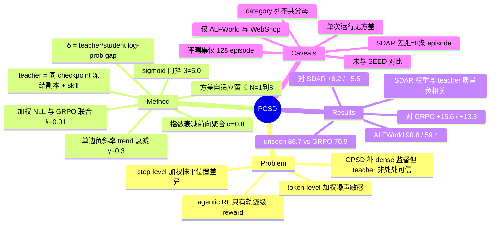

## Summary

PCSD 换掉 on-policy self-distillation 的 token 权重统计量：不用单点 teacher–student log-prob 差，而是用它在前向局部窗口内的**持续性**（指数衰减聚合 + 方差自适应窗长 + 负斜率单边衰减 + sigmoid 门控），加权 NLL 后与 GRPO 联合优化。Qwen2.5-3B-Instruct / Qwen3-1.7B-Instruct 上 ALFWorld Overall 90.6 / 59.4（GRPO 75.0 / 46.1，最强蒸馏基线 SDAR 84.4 / 53.9），WebShop Score 85.0 / 78.9。全部结果为单次运行、无方差报告，评测集为 128 条 episode。

## Problem & Motivation

Agentic RL 的监督是轨迹级的：几十轮交互、几百个 token 只换回一个 terminal scalar，GRPO 把它均匀广播给所有 token，无法区分哪些位置真正导致成败。OPSD（on-policy self-distillation）的补法是引入一个 **privileged teacher**——student 自己的冻结副本，额外看到检索来的 skill——对 student 采出的轨迹逐 token 打分，把 dense 监督补进来。

但 privileged 不等于每个位置都可信：检索不准、上下文有噪声、任务本身歧义时，teacher 会给次优 token 背书，无差别蒸馏就把错误偏好一起传下去。已有的 credibility-aware 加权因此分成两族，各有明确缺口：token-level 方法（SDAR 等）用单个位置的 teacher–student 差值定权重，位置分辨率高但对采样波动敏感——一个大差值既可能是真实优势也可能是瞬时抖动；step-level 方法把整个动作/推理步的差值聚合成共享权重，抗噪但抹平了步内的位置差异。

PCSD 的假设是：**有信息量的 teacher 优势应当在局部邻域内持续存在，孤立尖峰更可能是噪声**。于是不在"单点 vs 整步"里二选一，而是把"持续性"本身当作可信度的度量。

## Method

**信号定义**。token 级 gap `δ_{k,i} = log π_T(y_{k,i} | h^T_{k,i}) − log π_θ(y_{k,i} | h^S_{k,i})`。teacher `π_T` 与 student 从同一 base checkpoint 初始化、全程冻结、不进 optimizer；两者上下文的唯一差别是 teacher 的 prompt 前面拼了关键词匹配检索到的 skill。关键实现细节：teacher 用 **teacher forcing 给 student 自己生成的 token 打分**，不自己采样动作——避免不同 generation 带来的比较偏差。teacher 与 GRPO 的 reference policy 是两个不同的冻结模型。

**四个机制串成权重函数**：

1. **指数衰减前向聚合**：`δ̄^(N)_{k,i} = Σ_j α^j m δ_{k,i+j} / Σ_j α^j m`，α=0.8，窗口不跨 response 边界，末尾截断后按有效 token 重新归一。窗口是前向的，在整条 response 采完后计算，只用于构造训练目标（不影响采样，因此不破坏 on-policy 性）。
2. **方差自适应窗长**：在 `N_max=8` 窗内算局部方差 σ²，线性映射到 `r = clip((σ²−τ_low)/(τ_high−τ_low), 0, 1)`（τ_low=0.05、τ_high=0.5），再在短窗 `N_min=1`（即单点）与长窗 `N_max=8` 的估计之间插值：`δ̄^adaptive = (1−r)·δ̄^(1) + r·δ̄^(8)`。论文在附录里明确说明这是 bias–variance 权衡，**不**把高方差直接当成 teacher 不可信的证据——这个自我克制值得记一笔。
3. **单边 trend modulation**：在 `N_max` 窗内做 mask-aware OLS 斜率，用响应内平均 |δ| 归一化（对 gap 整体尺度近似不变），`η = clip(1 − γ·ReLU(−slope/scale), 0, 1)`，γ=0.3。只衰减不放大：斜率非负时 η=1，避免趋势项自己制造 credit。
4. **连续门控**：`w_{k,i} = σ(β_gate · δ̄^adaptive_{k,i}) · η_{k,i}`，β_gate=5.0。

**训练目标**。`L_PCSD = (1/M) Σ m·w·δ`，teacher log-prob 与权重 w 都 detach，梯度等价于**加权 NLL**——抬高 teacher 持续背书的 token 概率。归一化用有效 token 数 M 而非权重和，因此 w 同时决定"分配"和"总强度"。最终 `L_total = L_GRPO + λ·L_PCSD`，λ=0.01；GRPO 侧是标准的 group-relative advantage + clipped ratio + KL。

8 个超参（N_min / N_max / α / τ_low / τ_high / γ / β_gate / λ）全部手工固定，两个 backbone、两个 benchmark 共用，无 task-specific 调参、也无搜索过程记录。附录给了一个 bias–variance 记账：α=0.8、N=8 时有效样本量 `N_eff ≈ 6.41`，加权时间重心只前移 `d_8 ≈ 2.39` 个 token，即"平滑力度接近 6 个样本，注意力仍集中在最近 2–3 个 token"。

值得注意的是，**SDAR 在超参表里与 PCSD 完全同参**（λ_distill=0.01、β_gate=5.0），两者差别被压缩到唯一一处：sigmoid 里喂的是单点 δ 还是持续性估计 δ̄^adaptive。这是本文实验设计里最干净的一处。

## Key Results

**主表（ALFWorld Overall / WebShop Score-Acc）**

| Backbone | 指标 | Vanilla | GRPO | GRPO+OPSD | RLSD | SDAR | PCSD |
|:--|:--|--:|--:|--:|--:|--:|--:|
| Qwen2.5-3B-Instruct | ALFWorld Overall | 21.9 | 75.0 | 81.2 | 79.7 | 84.4 | **90.6** |
| Qwen2.5-3B-Instruct | WebShop Score / Acc | 6.7 / 0.8 | 79.8 / 63.3 | 77.8 / 66.4 | 84.4 / 66.4 | 83.4 / **67.2** | **85.0** / **67.2** |
| Qwen3-1.7B-Instruct | ALFWorld Overall | 12.5 | 46.1 | 32.0 | 42.2 | 53.9 | **59.4** |
| Qwen3-1.7B-Instruct | WebShop Score / Acc | 46.5 / 4.7 | 67.3 / 38.3 | 70.7 / 38.3 | 74.0 / 50.8 | 76.8 / **58.6** | 78.9 / **58.6** |

- ALFWorld 对 GRPO +15.6 / +13.3，对最强蒸馏基线 SDAR +6.2 / +5.5。WebShop 的 Acc 两个 backbone 上都与 SDAR 并列而非独占第一；1.7B 的 Score 78.9 排第二，低于 Skill-GRPO* 的 80.4（后者评测时仍需外挂 skill 检索，PCSD 不需要）。
- **per-category 并非全面占优**：3B 上 PCSD 的 Clean 82.1 低于 GRPO 的 96.2 与 SDAR / Skill-GRPO* 的 100.0；Look 63.6 低于 GRPO+OPSD 的 82.4。增益集中在 Heat（61.9→83.3）、Cool（65.0→94.4）、Pick2（47.4→100.0）三列。
- **unseen split**：Overall 86.7 vs GRPO 70.9 / SDAR 72.7，评测时同样不需要 privileged skill。

**消融（ALFWorld, Qwen2.5-3B）**

| 变体 | Overall | 折算为 128 条中的成功数 |
|:--|--:|--:|
| 完整 PCSD | 90.6 | 116 |
| Fixed N=4（固定局部窗） | 88.3 | 113 |
| w/o exponential decay（窗内均匀权重） | 85.1 | —（见下方 evidence boundary） |
| w/o trend modulation | 83.6 | 107 |
| Fixed N=1（退化为单点加权） | 82.8 | 106 |

λ 敏感性：0.0 → 75.0、0.005 → 87.5、0.01 → 90.6、0.05 → 83.6，非单调。**λ=0 那一行的六个 category 数值与主表 GRPO 行逐格相同**，即"去掉蒸馏项"就是 GRPO 基线本身，这一行不提供额外信息。

**权重行为诊断（全文最有信息量的部分）**

- *排序鲁棒性*：向随机位置注入幅度 3.0 的 gap 尖峰后，原始/扰动权重排序的 Spearman 相关——1% 扰动下 PCSD 0.985 vs SDAR 0.986（无差别），5% 下 0.934 vs 0.929，10% 下 0.887 vs 0.864。差距很小。
- *与 teacher 质量的方向一致性*：移除检索 skill 或换成打乱的 skill 后，比较 teacher 对专家动作的置信度变化 ΔQ 与权重变化 ΔW 的 Spearman 相关。PCSD 是弱正（ρ=0.174 / 0.052），**SDAR 是负的（ρ=−0.489 / −0.208）**——teacher 变差，SDAR 的权重反而变大。论文自己声明这两个诊断"应被解读为加权行为的分析，而非下游任务表现的直接证据或对单个组件的因果归因"。

**训练动态**：ALFWorld 训练中 20%–28% 的有效 token 拿到 w>0.5，即分配是"集中"而非"硬选择"；teacher–student 平均 gap 全程为负但缓慢上升。

**设置**：8×A100、150 个 update step、AdamW lr 1e-6、KL 系数 0.01、grad clip 1.0；每步 16 tasks × 8 rollouts = 128 条轨迹；ALFWorld 每次验证跑 valid_seen 的 128 episodes（每 episode ≤50 个动作），WebShop 128 条固定验证实例、每实例采 1 条轨迹、temperature 0.4、固定评测 seed。GRPO+OPSD / RLSD / SDAR / PCSD 共享 student、teacher 侧 skill、训练预算与评测协议，只有加权规则不同；SDAR 由作者按原方法重新实现。

## Evidence Ledger

| Claim ID | Claim | Type | Source locator | Evidence excerpt | Status |
|:--|:--|:--|:--|:--|:--|
| C1 | ALFWorld Overall：PCSD 90.6（Qwen2.5-3B）/ 59.4（Qwen3-1.7B），为所比较方法中最高 | number | Table 1 + Main Results | "achieves the highest Overall success rates of 90.6% and 59.4%" | source-verified |
| C2 | GRPO ALFWorld Overall 75.0 / 46.1，PCSD 对其 +15.6 / +13.3 | comparison | Table 1（GRPO 行） | "exceed GRPO by 15.6 and 13.3 percentage points" | source-verified |
| C3 | SDAR ALFWorld Overall 84.4 / 53.9，PCSD 对其 +6.2 / +5.5 | comparison | Table 1（SDAR 行） | "the strongest competing distillation baseline, SDAR, by 6.2 and 5.5 percentage points" | source-verified |
| C4 | WebShop：3B 上 PCSD Score 85.0 最高、Acc 67.2 与 SDAR **并列**最高；1.7B 上 Score 78.9 次于 Skill-GRPO* 的 80.4 | number | Table 1 | "highest Score of 85.0 ... its Score of 78.9 ranks second behind Skill-GRPO*" | source-verified（原始表述"Acc 独占最高"已按 verifier 更正为并列） |
| C5 | ALFWorld unseen split：PCSD 86.7 vs GRPO 70.9 vs SDAR 72.7 | number | Generalization 节正文（Figure 4 为图） | "reaches 86.7%, well above GRPO's 70.9% and SDAR's 72.7%" | source-verified |
| C6 | per-category 非全面占优：3B 上 PCSD Clean 82.1 低于 GRPO 96.2；Look 63.6 低于该列最高的 GRPO+OPSD 82.4 | number | Table 1（Qwen2.5-3B 块） | PCSD "63.6 … 82.1"；GRPO Clean "96.2"；GRPO+OPSD Look "82.4" | source-verified |
| C7 | 全文无多 seed 训练、无标准差、无置信区间、无显著性检验；主表 / unseen / 消融均为单次运行 | benchmark-setting | 主文 + 附录全文检索 | 仅有的 seed 提法是环境初始化与固定评测 seed；唯一 error bar 出现在 Figure 6 的扰动重复抽样 | source-verified |
| C8 | 评测规模：ALFWorld 128 episodes（valid_seen，每 episode ≤50 动作）；WebShop 128 固定实例、每实例 1 条轨迹、temperature 0.4 | benchmark-setting | Appendix > Benchmark Protocols | "each periodic validation run evaluates 128 episodes from valid_seen"；"one sampled trajectory per instance with temperature 0.4" | source-verified |
| C9 | GRPO+OPSD / RLSD / SDAR / PCSD 共享 student、teacher 侧 skill、训练预算与评测协议，只差加权规则；SDAR 由作者重新实现 | benchmark-setting | Experiments > Baselines | "share the student, teacher-side skills, training budget, and evaluation protocol, differing only in their weighting rules" | source-verified |
| C10 | teacher 是与 student 同一 base checkpoint 的冻结副本（非更大/另训模型），只多拿关键词检索的 skill，用 teacher forcing 打分 student 自己生成的 token | causal-mechanism | Preliminaries + Appendix > Teacher construction | "a separate frozen copy of the same base checkpoint used to initialize the student"；"evaluates the same student-generated tokens through teacher forcing" | source-verified |
| C11 | 超参表中 GRPO+OPSD 为 λ_distill=0.01、β_gate=0.0；SDAR 与 PCSD 同为 0.01 / 5.0 | benchmark-setting | Table 4 | GRPO+OPSD "0.01 / 0.0"；SDAR "0.01 / 5.0"；PCSD "0.01 / 5.0" | source-verified |
| C12 | GRPO+OPSD ALFWorld Overall 81.2（3B）/ 32.0（1.7B），后者低于 GRPO 的 46.1 | number | Table 1 | GRPO+OPSD "81.2" / "32.0" vs GRPO "46.1" | source-verified |
| C13 | 组件消融：完整 90.6 / Fixed N=1 82.8 / Fixed N=4 88.3 / w/o trend 83.6 / w/o decay 85.1 | number | Table 2 | "PCSD … 90.6 / Fixed N=1 … 82.8 / Fixed N=4 … 88.3 / w/o trend … 83.6 / w/o decay … 85.1" | source-verified |
| C14 | λ 敏感性 0.0→75.0、0.005→87.5、0.01→90.6、0.05→83.6，且 λ=0 行与主表 GRPO 行逐格相同 | number | Table 3 vs Table 1 | λ=0.0 行 "91.2 / 62.5 / 96.2 / 61.9 / 65.0 / 47.4 / 75.0" 与 GRPO 行逐格一致 | source-verified |
| C15 | 训练设置：8×A100、150 步、lr 1e-6、KL 0.01、grad clip 1.0、16×8=128 轨迹、prompt 2048（ALFWorld）/ 4096（WebShop） | benchmark-setting | Implementation Details + Appendix | "AdamW using a learning rate of 1×10⁻⁶, a KL penalty coefficient of 0.01 … and 150 update steps" | source-verified |
| C16 | ALFWorld 训练中 20%–28% 有效 token 满足 w>0.5 | number | Training Dynamics（Figure 3 讨论） | "20%–28% of valid tokens have w>0.5, indicating concentrated rather than hard-selective distillation" | source-verified |
| C17 | 排序鲁棒性 Spearman：1% 时 PCSD 0.985 / SDAR 0.986；5% 时 0.934 / 0.929；10% 时 0.887 / 0.864 | number | Appendix > Robustness of weight rankings | "0.934 versus 0.929 at 5%, and 0.887 versus 0.864 at 10%" | source-verified |
| C18 | teacher-quality 对齐：PCSD ρ=0.174（去 skill）/ 0.052（打乱），SDAR −0.489 / −0.208；论文自陈这只是加权行为分析、非因果归因 | number | Appendix > Alignment with teacher-quality changes | "ρ=0.174 for skill removal and ρ=0.052 for shuffled skills. In contrast, SDAR produces negative correlations of −0.489 and −0.208" | source-verified |
| C19 | SEED（arXiv:2607.14777）在 Related Work 被引，但未进入任何实验表作为对比基线 | comparison | Related Work + Table 1 baseline 列 | Table 1 基线为 Vanilla / Skill-Prompt* / OPSD / GRPO / Skill-GRPO(*) / GRPO+OPSD / RLSD / SDAR | source-verified |
| C20 | 论文未给出任何代码 / 仓库链接 | license-code | 全文外链枚举 + abs 页 Comments 字段 | （缺席）唯一非 arXiv 外链为 LaTeXML 工具链与 arXiv 捐助方 | source-verified |
| C21 | 论文未报告 teacher 额外 forward 相对 GRPO 的 wall-clock / 显存 / GPU-hour 开销 | benchmark-setting | 主文 + 附录全文检索 | （缺席）"wall-clock"/"overhead"/"training time"/"FLOP"/"latency" 零命中 | source-verified |
| C22 | Jinyang Wu 为本文作者之一 | benchmark-setting | 作者栏 | "Jinyang Wu⁴" | source-verified |
| C23 | 实验只覆盖 ALFWorld 与 WebShop（含 ALFWorld unseen split），无其他 agent benchmark | benchmark-setting | Experiments > Benchmarks + 全部表格 | "We evaluate our method on two widely adopted agent benchmarks: ALFWorld … and WebShop" | source-verified |
| C24 | Discussion 自陈局限：局部聚合与门控超参固定、teacher 全程冻结，牺牲了对轨迹统计与 teacher 可靠性变化的适应 | causal-mechanism | Discussion | "The trade-off is reduced adaptation to evolving trajectory statistics and variations in teacher reliability" | source-verified |
| C25 | 跨论文对照：SEED（arXiv:2607.14777，第一作者 Jinyang Wu 与本文作者同名）在同一 backbone 报 ALFWorld 91.8 / WebShop 88.5，其基线数字（Vanilla 21.9 / GRPO 75.0 / SDAR 84.4 / WebShop GRPO 79.8）与本文逐格相同 | comparison | arXiv:2607.14777 abs 页与 Table 1 | SEED 作者栏首位 "Jinyang Wu"；SEED Table 1：SEED 91.8 / GRPO 75.0 / SDAR 84.4 / Vanilla 21.9 | not-checkable（二手源，超出本次 verifier 的 primary-source 范围） |

> **Evidence boundary**
> 1. C1–C24 由独立 verifier 按 v1 全文（含附录）逐格核对，`source-verified` **只表示原文确实包含该信息**，不表示结果已被独立复现——本文全部性能数字均为单次运行、无方差（C7）。
> 2. **C25 未经独立核验**。verifier 只拿到 PCSD 的 primary source；SEED 一侧的数字与作者栏由本笔记作者自行核对 arXiv 页面，且"同名即同人"是推断而非论文陈述。凡本笔记中依赖该对照的判断（见 Weaknesses 第 3 条）都应按此强度阅读。
> 3. 下文 Strengths & Weaknesses 中的**分母反推、二项标准误、episode 折算**均为笔者基于已核验数字的算术推导，不是论文陈述；论文本身没有报告每类实例数，也没有做任何统计检验。
> 4. Figure 3 / 5 / 6 本身未被独立读图；凡只以图呈现而正文未给数值的结论均未进入本笔记（C5、C16、C17、C18 的数字全部取自正文文字叙述）。
> 5. 消融表中 "w/o decay 85.1" 无法写成任何 x/128（108/128=84.4，109/128=85.2），与该表其余四行不共分母；这可能是排版/四舍五入误差，也可能意味着该行用了不同评测规模。低置信度，仅作记录。

## Strengths & Weaknesses

**Strengths**

- **对照设计的核心一处做得很干净**。SDAR 与 PCSD 在超参表里完全同参（λ=0.01、β_gate=5.0，C11），共享 student、teacher skill、训练预算与评测协议（C9），差别被压缩到 sigmoid 里喂的是单点 δ 还是持续性估计 δ̄。这意味着 84.4 → 90.6 这个对比**确实**只归因于统计量的替换，而不是调参差异。这是本文实验设计里最值得肯定的部分，也是很多同类论文做不到的。
- **权重行为诊断给出了可复用的判据**。扰动 teacher 质量后 SDAR 的权重变化与 teacher 置信度变化呈**负相关**（ρ=−0.489，C18），这是一个关于竞争方法的具体、可迁移的负面发现：**凡是在 token 之间做归一化的加权方案（权重互相竞争），都可能出现"teacher 变差 → 该 token 权重反而变大"**。论文把它解释为"PCSD 的 sigmoid 权重是逐 token 独立算的，归一化加权会引入 token 间竞争"——这个机制解释合理且可检验。作者还主动声明这些诊断只是加权行为分析、不是下游因果归因，态度诚实。
- **信息隔离写得比同类论文细**。skill 只按初始 task instruction 做关键词匹配，明确不含实例解、专家轨迹、目标物位置、未来观测、隐状态；skill repository 构建时不接触 validation 轨迹；student 训练与评测全程不给 skill（C10）。所以"评测不需要外挂检索"是有制度保证的，不是口头声明——对比 Skill-GRPO* 必须在评测时继续喂 skill，这个差别是实在的。
- teacher 用 teacher forcing 打 student 自己的 token 而非自行采样，避免了 generation 分布差异污染比较——这个细节比不少 on-policy distillation 工作干净。

**Weaknesses**

1. **单次运行 + 128 条评测集，主结论落在噪声区间内**。这是最致命的一条。全文无多 seed、无标准差、无置信区间（C7）；Overall 列在两个 backbone 上都唯一相容于分母 128（笔者反推），于是所有差距都可以折算成"128 条里多成功几条"：
   - 3B 上 PCSD − SDAR = 116 − 108 = **8 条**；1.7B 上 76 − 69 = **7 条**。
   - 消融里 Fixed N=4 与完整 PCSD 的差距 = 116 − 113 = **3 条**；λ=0.005 与 λ=0.01 的差距 = **4 条**。

   按 n=128 的二项标准误估算，p≈0.9 时单点 SE≈2.6pp、p≈0.84 时≈3.2pp，两独立比例之差的 SE≈4.1pp——+6.2pp 仅约 **1.5σ**；1.7B 上 +5.5pp 约 **0.9σ**。（诚实的反向修正：两方法评的是同一批实例，配对检验会比独立近似更有效力；但另一方面这个估计**完全没有计入训练侧的 run-to-run 方差**，而 [[2607-TeachStop]] 恰恰证明 agentic RL 的单次训练数字会被 data draw 与 nondeterminism 主导，计入后区间只会更宽。）结论：论文"三个组件互补、完整 PCSD 最优"的措辞，其证据强度远低于文字给人的印象——尤其 Fixed N=4 与完整版差 3 条 episode，实质是无法区分。
2. **per-category 列不共分母，横向比较不成立**。对第一个 backbone 的 Look 列反推：OPSD 的 41.7% 必须是 5/12 的倍数、GRPO+OPSD 的 82.4% 必须是 14/17 的倍数、Vanilla 的 11.1% 必须是 1/9 的倍数、PCSD 的 63.6% 必须是 7/11 的倍数——穷举后**不存在任何 ≤200 的公共分母**（Clean 列同样如此）。也就是说各方法那 128 条 episode 的类别构成并不相同（或 category 与 Overall 用了不同口径），而论文从未给出每类实例数。于是 "Heat 61.9→83.3""Pick2 47.4→100.0" 这类被正文当作亮点的 category 增益，既建立在 7–34 量级的小样本上，又不是同一批实例的对比。**主表六列 category 数字不应被当作证据使用**，只有 Overall 列可比。
3. **最近邻工作被引而不比，且很可能是同一实验设施**。SEED（arXiv:2607.14777）在 Related Work 出现但不在任何实验表里（C19）；本文作者 Jinyang Wu 与 SEED 第一作者同名（C22 / C25），且两篇的基线数字逐格相同（Vanilla 21.9 / GRPO 75.0 / SDAR 84.4 / WebShop GRPO 79.8），几乎必然共享同一套代码与评测脚本。而 SEED 在同一 backbone 报 ALFWorld 91.8、WebShop 88.5，**均高于** PCSD 的 90.6 / 85.0。两篇对该列的称呼不同（PCSD 称 instance-level Overall，SEED 称 average），所以不能直接判定孰优；但在共享设施、共享作者的前提下省略这一对比，abstract 里 "best ALFWorld Overall results among all baselines" 的射程就被限定在自选基线集之内。（本条依赖 C25，未经独立核验。）
4. **方法是启发式堆叠，核心假设本身没有被测量**。四个机制各带超参，共 8 个，全部手工固定、无搜索记录。附录那段 bias–variance 分析是加权平均 MSE 的标准分解——它对**任何**滑动平均都成立，说明的是"长窗降方差增偏差"，并不构成对"持续性 = 可信度"这一假设的支持。真正该做而没做的测量是直截了当的：统计 δ 序列的自相关长度，看"真实 teacher 优势"与"采样噪声"在自相关上是否可分，再把 N_max 定到那个尺度上。`N_max=8` 从哪来，全文无依据；λ 从 0.005 到 0.05 就能造成 7.0pp 的摆动（87.5 → 83.6），与论文声称的组件贡献（2.3–7.8pp）同量级——单个超参的敏感度吞掉了组件归因。
5. **benchmark 场地既饱和又狭窄**。只有 ALFWorld 与 WebShop 两个纯文本环境（C23），最大 3B，episode ≤50 步；无 GUI / 视觉、无长程有状态环境、无 tool-use / search-QA。ALFWorld 3B 上 GRPO 已到 75.0，剩余空间本就不大。方法主张的是通用的 token 级 credit 机制，验证场地却是这条线上最容易的两个——泛化性完全未知。
6. **自蒸馏的固有风险未被讨论，而持续性判据恰恰放大它**。teacher 是 student 自己 + skill 上下文，PCSD 加强的是"student 与自身 skill-conditioned 版本持续一致"的位置。**持续性无法区分"持续正确"与"持续系统性错误"**——随机噪声不持续，系统性偏差恰恰持续。当检索到的 skill 本身错误但内部自洽时，PCSD 会比单点加权更强地把它写进权重。这与 [[2605-AntiSD]] 用 PMI 揭示的现象是同类：self-distillation 会系统性奖励 shortcut token、惩罚 deliberation token。论文自己的 teacher-quality 对齐实验（ρ=0.174 / 0.052，几乎不相关）其实已经暗示了权重与 teacher 真实质量的耦合很弱，但这一点没有被写成 limitation。
7. **失效条件完全没有刻画**。对照 [[2606-TRIAGE]]：那篇给出了增益成立的条件（Cov(c,δ)>0）并用 no-thinking judge 实验证明条件不满足时会**差于 GRPO**。PCSD 只有正面数字，没有任何"什么时候这套加权会伤害训练"的分析。而证据其实就在自己表里：GRPO+OPSD（λ 同为 0.01、β_gate=0.0，即门控退化为常数 0.5——此为笔者按公式的推断）在 3B 上是 +6.2，在 1.7B 上是 **−14.1**（32.0 vs GRPO 46.1，C11 / C12）。同一份 dense 监督在小 backbone 上会严重反伤，PCSD 在同一格却是 +13.3——这是全文最有信息量的对比，论文只用"naive RL-distillation combination can introduce optimization interference"一句带过，没有追问加权究竟修好了什么。
8. 无代码（C20）、无开销报告（C21，teacher 每 token 一次额外 forward + 长窗统计的成本完全不明）、无 limitations 章节（Discussion 只承认"超参固定 + teacher 冻结"一条，C24）。另外超参表列了一个 `Skill-SD`（λ_distill=0.001），但它从未出现在任何结果表里——未加解释的悬空基线。

**对领域的判断（个人观点）**。这条线（GRPO + privileged-context self-distillation 的 token 加权）在 2026 年上半年已经挤了 SDAR / RLSD / SEED / OPID / TCOD 等一批工作，PCSD 是其中"换一个更复杂的权重统计量"的又一次迭代，方法侧的新意有限，且与 vault 的 taste 原则（simple, scalable, generalizable）方向相反——8 个手工超参、四机制串联，复杂度往往是理解不够的信号。真正值得留下来的是**它的诊断而非它的方法**：token 归一化加权会与 teacher 质量反向相关（SDAR ρ=−0.489），这是一个关于整族方法的具体发现，比 +6.2pp 的主结果更有价值。这条线要往前走，缺的不是第五个平滑机制，而是把"teacher 在哪些位置可信"从 log-prob 自洽性换成**环境可接地**的信号——否则加权再精细，度量的仍然是模型与自己的一致性。

## Mind Map

## Notes

- **最该做的一次实验**：把 δ 序列的自相关长度测出来，并把 `N_max` 与它挂钩。论文的整个立论是"有信息的 teacher 优势会持续、噪声不会"，但这个假设从头到尾没有被直接测量过——它是可测的，而且很便宜（训练时已经有全部 δ）。如果真实优势的自相关长度远小于 8，那 PCSD 的增益就不来自"持续性"，而来自"平滑"，方法叙事需要重写。
- **一个可以直接拿走的探针**：附录的 teacher-quality 扰动协议（移除检索 skill / 换成打乱的 skill → 测 ΔQ 与 Δ权重的 Spearman 相关）。它把"这套加权到底有没有在跟踪 teacher 质量"从定性讨论变成一个数，而且成本极低。这个探针应该被用来体检 vault 里所有 teacher-weighted distillation 方法——SDAR 的 ρ=−0.489 说明它能抓到真问题。
- **与 [[2607-SEED]] 的分工**：两篇是同一族的两个正交方向。SEED 改的是**监督内容**（让 skill 随 policy 现场生成、演化），PCSD 改的是**监督分配**（固定 skill repository，改造权重函数）。SEED 的 ablation 显示"静态 skill library"是最大降幅（−7.4），而 PCSD 用的正是静态 repository——两者原则上可以叠加，但也意味着 PCSD 是在一个 SEED 已证明次优的 teacher 配置上做优化。
- **与 [[2606-TRIAGE]] 的真实差别**（不是"粒度不同"这么简单）：TRIAGE 的信号源在**模型之外**——一个 8B judge 按语义角色给 segment 分类，judge 看不到最终 outcome；PCSD 的信号源在**模型之内**——student 与自身 skill-conditioned 版本的 log-prob 差。这决定了两者的失效模式完全不同：TRIAGE 会在 judge 不可靠时反伤（论文实测掉到 GRPO 之下），PCSD 会在 skill 系统性错误时静默放大。TRIAGE 把失效条件写进了理论与实验，PCSD 没有——这是评价上更实质的差距。另外 TRIAGE 的 ablation 发现最大贡献来自"抑制成功轨迹里的 regression 段"，是一个关于**信号位置**的发现；PCSD 的消融只回答了"哪个平滑组件更重要"，信息量层级不同。
- **一个仍未回答的问题**：`L_PCSD` 按有效 token 数 M 归一化而非按权重和归一化，因此 w 同时决定分配与总强度。这与 λ 的作用高度耦合——门控输出的均值一变，等效 λ 就跟着变。论文的 λ 扫描（0.005/0.01/0.05）与"20%–28% token 的 w>0.5"这个统计量之间没有被联系起来，所以无法判断 λ=0.05 的下降究竟是"蒸馏太强"还是"有效步长越界"。这也是 SDAR（归一化加权）与 PCSD（非归一化）的另一处未被讨论的差别。
- **对 vault 里 GUI 线的意义**：[[Ideas/ForkPoint-CreditAssignment-GUI]] 想在 GUI 轨迹里自动定位分叉点来造稠密监督，与 PCSD 属于同一问题的两种解法——PCSD 完全不需要定位"关键决策点"，它用统计持续性代替语义定位。但 PCSD 的信号是 log-prob 自洽性，在 GUI 场景会更弱（视觉观测、动作空间大、失败模式长尾），而 fork-point 路线可以锚定环境状态变化（screenshot differencing）。**这正好是本文最大的结构性短板对应的机会**：把 token 级权重从"模型与自己一致"换成"与环境可验证的状态变化一致"。
