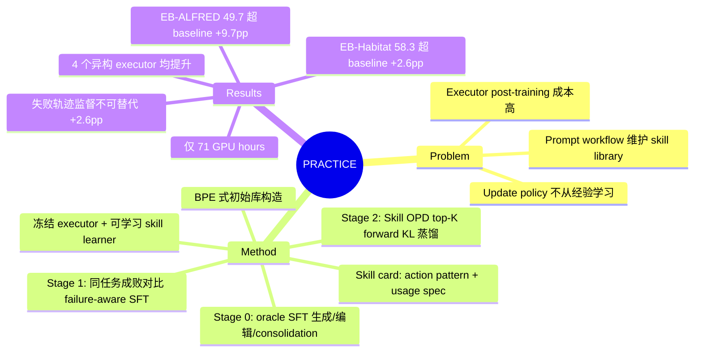

## Summary

针对现有 experience-augmented embodied agent 用固定 prompt workflow 维护 skill library 的局限，Practice 把 library 的 update policy 本身变成可训练对象：冻结 executor，训练一个 8B skill learner 从交互轨迹中产出结构化 batch edits（ADD/REVISE/MERGE/REMOVE）并做层级 consolidation。训练走 oracle SFT → failure-aware SFT → Skill OPD（对 32B teacher 做 top-K forward-KL on-policy 蒸馏）三阶段课程。在 EmbodiedBench 的 EB-ALFRED / EB-Habitat 上分别超最强 experience-augmented baseline 9.7 / 2.6 个百分点，且对 4 个异构 executor 均有提升。

## Problem & Motivation

MLLM executor 做 embodied task planning 时，持续改进的两条路各有短板：post-training executor 需要大量 task-specific 轨迹且要反复更新参数；experience-augmented 方法（memory / skill library）虽然把经验外化，但 library 的生成、合并、删除逻辑几乎全靠人工设计的 prompt workflow——library 内容在演化，**update policy 却不从积累的经验中学习**。作者由此提问：agent 能否不仅学新 skill，还学会"如何生长和精炼 skill"？这与 MemCtrl（学 memory gate）、SkillOS（学 skill curator）同属把维护逻辑变可学习的路线，Practice 的差异在于结构化 skill-edit 输出加渐进式课程训练。

## Method

**Formulation**：系统 = 冻结的 executor π_exec + 持久 skill library V + 可学习 skill learner S。每张 skill card v=(p,u)：p 是参数化 primitive action pattern 序列（如 `(pick_up, object_target)`），u 是 usage specification（适用条件、预期效果、invalid conditions、failure recovery 策略）。每轮：当前库 V_i 引导 executor 产生轨迹 T_i → learner 输出 Δ=S(V,T) 结构化编辑（ADD/REVISE/MERGE/REMOVE）→ Apply 得 V_{i+1}，learner 与 library 耦合演化。

**初始库**：受 BPE 启发——从无 skill 增强的成功轨迹中迭代合并频繁相邻 action 子序列，再由初始 learner 整合成 skill cards（EB-ALFRED 初始 17 张）。

**三阶段课程**：
- **Stage 0（oracle-grounded SFT）**：仅用成功 oracle 轨迹，teacher（Qwen3.7-Max）构造三类监督——空库生成 skill、编辑已初始化的库（学局部编辑而非整库重写）、跨 batch consolidation（去语义重复、调和冲突的 trigger 条件）。
- **Stage 1（failure-aware SFT）**：用 8 个异构 executors（Gemini-2.5/3/3.1/3.5 系、GPT-5.4、Qwen3.5-Flash、Qwen3-VL-8B/32B）在**同一任务**上的成败轨迹组 batch，对比学出 invalid conditions 与 recovery strategies，写入 skill card 对应字段。
- **Stage 2（Skill OPD）**：on-policy distillation——student（8B）在自己的 edit rollout 上采样，冻结的 Qwen3-VL-32B-Instruct teacher 在 student 生成的 prefix 上给 top-K（K=32）token 分布，直接最小化截断 forward KL；**无 task reward、无 policy-gradient**，基于 verl 实现。目的是消除 offline SFT 的 train–inference 分布错配。

**开销**：SFT 合计约 7 GPU hours，OPD 约 64 GPU hours（8×A100-40GB），相当轻量。

## Key Results

- **主结果（Table 1，executor 统一为 Qwen3-VL-32B-Instruct）**：EB-ALFRED avg SR 49.7%（最强 experience-augmented baseline MemCompiler 40.0%，+9.7pp）；EB-Habitat 58.3%（MemCompiler 55.7%，+2.6pp）。EB-ALFRED 上在 Complex/Long 提升最明显；EB-Habitat 的 Base/Long 落后于最强 baseline（作者归因于高度可变的目标位置不适合固定 action pattern）。
- **跨 executor（Table 2，EB-ALFRED）**：同一套流程提升 GPT-5.4 +2.4（65.3→67.7）、GPT-5.2 +30.3（32.0→62.3）、Gemini-3-Flash +15.3（59.0→74.3）、Qwen3-VL-32B +25.4（24.3→49.7）。Practice-GPT-5.4 在 EB-Habitat 达 72.0，为对比方法中最高（作者称 new SOTA）。
- **阶段 ablation（Table 3，EB-ALFRED）**：No Skill 24.3 → BPE 初始库 40.7 → Stage 0 42.3 → Stage 1 45.3 → Stage 2 49.7；OPD 是学习阶段中增益最大的一步（+4.4），库规模也长到 29 张 cards。注意 BPE 初始库本身就贡献了最大单步提升（+16.4）。
- **failure-aware ablation（Table 4）**：只加成功轨迹几乎无用（42.3→42.7），加入失败轨迹对比到 45.3（+2.6 over Succ-Only），Long split 8→14——失败轨迹提供了成功样本无法替代的监督。
- **执行分析（Appendix C）**：无 rejected action 的 episode 从 13.3% 升到 25.7%；提升同时来自事前避错与事后恢复。EB-ALFRED 库 29 skills（16 张复合），EB-Habitat 15 skills，粒度随环境自适应。

## Evidence Ledger

| Claim ID | Claim | Type | Source locator | Evidence excerpt | Status |
|:--|:--|:--|:--|:--|:--|
| C1 | EB-ALFRED 上 Practice 49.7% 超最强 experience-augmented baseline（MemCompiler 40.0%）9.7pp | number | Abstract; Table 1; Sec 4.2 | "outperforms the strongest experience-based baselines by 9.7 and 2.6 percentage points" | source-verified |
| C2 | EB-Habitat 上 Practice 58.3% 超 MemCompiler 55.7% 2.6pp | number | Table 1; Sec 4.2 | "average success rates of 49.7% on EB-ALFRED and 58.3% on EB-Habitat" | source-verified |
| C3 | learner=Qwen3-VL-8B；SFT 监督由 Qwen3.7-Max 构造；OPD teacher=冻结 Qwen3-VL-32B，top-K=32 forward KL，无 reward/policy-gradient | benchmark-setting | Sec 4.1; Appendix B Table 6 | "top-K forward-KL distillation with K=32 and no auxiliary policy-gradient loss" | source-verified |
| C4 | executor 全程冻结；learner 输出 ADD/REVISE/MERGE/REMOVE 结构化编辑 + hierarchical consolidation | causal-mechanism | Sec 3.1; Algorithm 1 line 30 | "the parameters of π_exec remain frozen"; "operations that ADD, REVISE, MERGE, or REMOVE skill cards" | source-verified |
| C5 | 跨 executor 提升：GPT-5.4 +2.4、GPT-5.2 +30.3、Gemini-3-Flash +15.3、Qwen3-VL-32B +25.4 | number | Table 2; Sec 4.3 | "increases the average success rate of GPT-5.4, GPT-5.2, Gemini and Qwen of 2.4, 30.3, 15.3, and 25.4 percentage points" | source-verified |
| C6 | ablation：24.3 → 40.7 (BPE) → 42.3 (S0) → 45.3 (S1) → 49.7 (S2)；终库 29 cards | number | Table 3 | "the number of skill cards in this stage also grows to the greatest one with 29 cards" | source-verified |
| C7 | failure-aware (45.3) 比 succ-only (42.7) 高 2.6pp；Long 8→14 | comparison | Table 4; Sec 4.3 | "outperforming the success-only variant by 2.6 percentage points" | source-verified |
| C8 | 初始库用 BPE 式频繁相邻 action 子序列合并构造 | causal-mechanism | Sec 3.2 | "Frequent adjacent action subsequences are then iteratively merged to discover recurring multi-step patterns" | source-verified |
| C9 | Practice-GPT-5.4 在 EB-Habitat 达 72.0，作者称对比方法中的 new SOTA | sota-novelty | Table 1; Sec 4.2 | "Practice-augmented GPT-5.4 achieves new state-of-the-art performance on EB-habitat benchmarks among all methods" | source-verified |
| C10 | 训练开销：SFT 合计约 7 GPU hours，OPD 约 64 GPU hours | number | Appendix B | "training time for SFT stages are about 7 GPU hours in total and 64 GPU hours for OPD" | source-verified |
| C11 | 评测为 EmbodiedBench 的 EB-ALFRED/EB-Habitat，各 6 splits | benchmark-setting | Sec 4.1 | "Both of them contain 6 splits that assess distinct capability dimensions" | source-verified |
| C12 | Stage 1 数据来自 8 个异构 executors 按同任务分组 | benchmark-setting | Appendix A.1 | "Stage 1 groups trajectories produced by 8 heterogeneous executors according to the task" | source-verified |
| C13 | Practice 在 EB-Habitat 的 Base/Long splits 落后最强 baselines | comparison | Sec 4.2; Table 1 | "Practice trails the strongest baselines on Base and Long in EB-Habitat" | source-verified |
| C14 | Appendix C.2 写 Practice 将成功率从 24.3% 提到 40.0%——与 Table 1/3/7 及 C.3 的 49.7% 内部不一致（疑笔误，原文未解释） | number | Appendix C.2 Fig 8 段 | "Overall, the Practice method improves the task success rate from 24.3% to 40.0%." | source-verified |

## Strengths & Weaknesses

**亮点**

- **问题 formulation 有 taste**：从"library 内容演化但 update policy 不演化"这一观察出发，把 skill 维护从 prompt workflow 升级为 learnable policy，是对 AutoSkill / Trace2Skill 一类方法的正面回应。与 SkillOS（learned curator）同方向，差异化在结构化 batch-edit 表示 + 课程训练 + on-policy 蒸馏。
- **failure-aware 监督设计干净**：用多个 executor 在**同一任务**上的成败轨迹做受控对比，而非随机混合，让行为差异成为 skill 内容的证据；Table 4 证明失败轨迹提供了成功样本无法替代的信号（+2.6pp，Long 翻近一倍）。
- **轻量且 executor-agnostic**：8B learner、71 GPU hours 总开销，冻结 executor 即插即用，对 4 个从弱到强的 executor 均有提升——是"不动基座、只动知识层"路线的有力数据点。
- **附录分析诚实**：paired 分析控制 episode 难度、报 bootstrap 置信区间、明确标注哪些 skill 无稳健提升、失败案例归因到 skill 覆盖 vs executor 侧 grounding，比多数同类工作细致。

**局限**

- **动机与实现之间有落差**（最重要的批评）：论文动机是 update policy 应从"downstream execution outcomes"学习，但三个 stage 的监督信号**全部来自更强的 teacher 模型**（Qwen3.7-Max 构造 SFT 目标、Qwen3-VL-32B 给 OPD soft targets），没有任何 task reward 进入 learner 的优化目标。执行结果只间接通过轨迹内容影响输入分布，update policy 本身从未被下游成功率优化。所谓"learning how to evolve"实际是模仿强模型的 edit 分布（推测：加 execution-outcome reward 的 RL 是自然下一步）。
- **teacher 质量假设未论证**：OPD teacher 是通用 Qwen3-VL-32B-Instruct，并未针对 skill editing 训练过；为什么它的 edit 分布值得 SFT 后的 student 对齐，论文只有 Stage 2 +4.4pp 的间接证据，机制上没有解释。
- **绝对性能有限**：Qwen3-VL-32B + Practice（49.7）仍低于 no-skill 的 GPT-5.4（65.3）和 post-training 的 ELITE（70.8, EB-ALFRED）；EB-Habitat 的 Base/Long 落后于 EmbodiSkill/MemCompiler。BPE 初始库贡献了最大单步提升（+16.4），学习部分合计 +9.0。
- **适用边界**：skill card 是离散 primitive action pattern 序列，依赖 EmbodiedBench 高层动作空间；对连续控制、动作空间不可枚举的场景（低层操作、真实 GUI）不直接适用。终库仅 29/15 张 cards，library 规模化后 consolidation 是否仍可靠未验证。
- **校对粗糙**：Appendix C.2 出现与全文其余部分矛盾的 40.0%（疑似从 Table 2 MemCompiler 行串写），见 C14。

## Mind Map

## Notes

- **与 vault 内 skill-library 线的关系**：[[Papers/2608-SkillZip]]（evaluation-free skill 压缩）、[[Papers/2608-AgentMemoryDistill]]（teacher memory 蒸馏给小模型）、[[Papers/2608-ContinualSkillBench]]（skill 演化评测）同属 self-evolving skill/memory 主题；Practice 的独特位置是把 update policy 本身参数化并用 on-policy 蒸馏训练。它引用的 SkillOS (arXiv 2605.06614)、EmbodiSkill (2605.10332)、MemCompiler (2605.07594) 是最近邻 prior work，vault 尚未消化。
- **值得追问**：如果把 OPD 换成以 execution outcome 为 reward 的 RL（learner 的 edit 好坏由下轮 executor 成功率打分），能否超过模仿 32B teacher 的上限？这是论文 formulation 已铺好但没走的一步。
- 内部数字不一致（C14）已核实原文确为 40.0%；读该附录段落时以 Table 7 的 49.7% 为准。
- 今日同批消化的 [[Papers/2608-OPSA]] 对 OPD 类监督的噪声分析（teacher 越大打分越 noisy）与本文 Stage 2 直接相关：值得追问 32B teacher 在 8B student 的 edit rollout 上给的 top-K 分布有多少是可靠监督。
