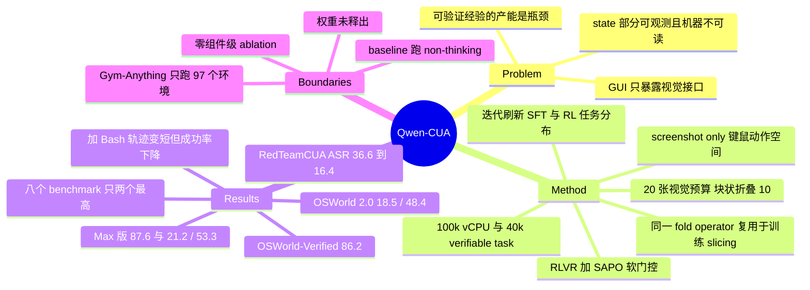

## Summary

Qwen-CUA 是一个 397B-A17B MoE 的 screenshot-only computer-use agent，只看截图、只发键鼠事件，不用 DOM、accessibility tree、shell 或任何 task-specific API。它把 active 视觉历史扩到 20 张截图并以 10 张为块折叠旧截图（同一 fold operator 复用于训练期 trajectory slicing），在近 10 万 vCPU 的 rollout 集群上用约 4 万条 verifiable task 做 RLVR。八个 benchmark 上它在 OSWorld-Verified（86.2）与 MacAgentBench（69.2）取得表中最高分，其余六个仍落后于 GPT-5.5 或 Claude Opus 4.8。

## Problem & Motivation

Agent 触达数字世界有三条路：code、API、和为人设计的图形界面。前两条已被 foundation model 吃得很透，但桌面应用、遗留系统、动态网站、专业软件与个人化工作流大量只暴露视觉接口。Native computer use 想用一个接口覆盖全部——代价是学习难度：GUI state 部分可观测且机器不可读，动作需要像素级 grounding，错误在长流程里累积，证据分散在截图历史中，而可靠监督往往只在终态才出现。

于是瓶颈从"模型能力"移到了"可验证经验的产能"：每一条 rollout 都要占用一个有状态环境和真实交互时间。这篇报告的立场是——这是个工程与规模问题，把环境、可验证任务、rollout 吞吐和长多模态轨迹的学习同时推上去，native interface 本身就够通用。

## Method

**Native 接口。** 每步只观察当前桌面截图，输出键鼠动作。动作空间见 Appendix A：keyboard（key / key down / key up / type）、mouse（move、left/right/middle click、double/triple click、drag、mouse down/up、scroll/hscroll）、control（screenshot、wait、terminate、call user）。刻意不提供 accessibility tree、DOM 或 application-level 快捷通道——凡是能暴露像素之外隐藏状态的入口一律不给。

**长程上下文管理（本文最"方法"的一部分）。** active 视觉预算 B = 20 张截图；一旦超出，folded-prefix 边界一次前进 S = 10 步。边界之后的截图被替换成固定文本占位符，而对应的 reasoning 与 action 原样留在对话里；最近的截图保留原始视觉形式。整个过程确定性，不需要额外的 summarization model。

关键在于**为什么是 10 而不是 1**：逐步折叠会让每次调用都重写 prompt 前缀，直接打穿 KV-cache；块状折叠使第 21–30 步共享同一前缀，只在第 31 步才推进一次。RL 训练复用**同一个 fold operator**——完整 episode 被渲染成多个 context-bounded slice，每个 slice 继承终态 reward，loss mask 只对 model-generated 的 reasoning 与 tool-call token 为 True。这样训练与推理的折叠表示严格一致，也不必设计 step-level reward。

**规模化可验证经验。** rollout 建在 Alibaba Cloud ECS 上，接近 100,000 vCPUs、可支撑上万个并发环境。环境池两条腿：一是自建的 mock web service（保留真实产品的交互流程，但暴露 state injection / inspection / reset / session isolation 的程序化接口），二是铺开到创意、科学、工程等专业与长尾桌面软件。任务约 40,000 条，分三类：

1. **Environment interaction**：从应用功能分类学采样，每条任务配可复现初态 + 可执行 evaluator，并对照 reference outcome 与 agent rollout 审计，剔除歧义、不可行或验证薄弱的实例。
2. **User-interactive**：沿用 OSWorld 2.0 的 simulated-user 设定，user simulator 只持有有界的任务知识且仅在 agent 主动发问时回答。完成度仍由环境终态判定，所以"问用户"只有在导向正确结果时才有收益。
3. **Long-horizon**：把工作流组织成互相依赖的 phase 而非拼接无关子任务；每个 phase 有可验证完成态，验证后该状态可序列化用于初始化下一 phase（phase-state chaining），既便于增量生成与审计，又保留完整链条做端到端 rollout。

此外收集个人化桌面与 CAD / Blender 等专业软件的人类轨迹，并用 model-assisted CoT 补全 step-level rationale（对照观测状态与实际动作做一致性过滤）。

**RLVR + SAPO。** 每个训练实例是 (t, s, r) 三元组，evaluator 检查终态给出 [0,1] 的 outcome reward，支持 partial credit，且不要求匹配参考动作序列。用 Soft Adaptive Policy Optimization：同一 trajectory 的所有 active token 共享 group-relative advantage，token-level importance ratio 不做硬 clip，而是过一个以 on-policy 点为中心的平滑 logistic gate，温度按 advantage 符号取值（τ_pos = 1.0、τ_neg = 1.05——负 advantage 衰减更快，因为它同时抬高大量替代 token，是更不稳定的方向）。

**迭代训练。** 每轮不重跑同一配方：用当前模型找出仍解不出的 SFT query 与弱领域 → 更新 teacher 重生成 demonstration、补人类轨迹、定向补数据 → 重新混合 SFT 数据，且**每次 SFT 都从同一个 mid-training checkpoint 重新起训**而不是在上一代 agent 上继续微调（改进通过数据传递，不继承优化漂移）→ 用新 SFT 模型对候选 RL query 各跑 8 次 trial rollout，只保留 0 < 成功数 < 8 的任务，去掉当前够不着的和已经饱和的。

## Key Results

- **OSWorld-Verified 86.2**（Qwen3.7 73.3 / GPT-5.5 78.7 / Opus-4.8 83.4），360 个任务中 359 个产出完整评测记录，域内最弱的是 Multi-apps（77.9）与 VLC（83.3）。
- **OSWorld 2.0 binary / partial = 18.5 / 48.4**（Qwen3.7 2.5 / 22.5，GPT-5.5 13.9 / 47.5，Opus-4.8 20.3 / 54.8）。binary 上仍不及 Opus-4.8。
- **Qwen-CUA-Max（>1T 总参数）**把上述推到 **87.6** 与 **21.2 / 53.3**，partial completion +4.9 点。
- **RedTeamCUA：ASR 36.6 → 16.4，同时 benign task success 70.5 → 74.0**——两个指标同向改善，排除了"变笨所以不中招"的解释。但 Opus-4.8 是 80.7 / 0.7。
- **其余五个 benchmark 均非最优**：MyPCBench perfect-task 58.7（Opus-4.8 62.0）、Gym-Anything 46.3（Opus-4.8 47.3）、ScienceBoard 64.50（GPT-5.5 65.08 / Opus-4.8 66.80）、WebArena 64.16（GPT-5.5 68.90 / Opus-4.8 65.60）、MacAgentBench 69.2（本表最高）。
- **Token 效率（仅 OSWorld-Verified）**：3,605.8 output tokens/task 拿到 86.2；Opus-4.8 在相近预算下 80.0，用到 21.8K tokens 才 83.3。但同一模型在 OSWorld 2.0 上是 **244,625.5 output tokens/task**，而分数更高的 Qwen-CUA-Max 只用 135,059.6。
- **交互效率**：OSWorld 2.0 上平均 218.9 turns（GPT-5.5 83.5、Opus-4.8 105.7）。论文自陈这不是归一化的 low-level action 效率——两家闭源接口可在一个 turn 内批量发多个动作，Qwen-CUA 每 turn 只发一个。
- **加 Bash 是负结果**：MyPCBench 上平均 turn 数 Qwen3.7 69.3 → 53.4、Qwen-CUA 63.6 → 49.1（约 −23%），但 perfect-task rate 同步 **下降**，51.6 → 41.8 与 58.7 → 55.1。作者判定为"还没学会何时切换"的优化缺口，而非混合接口本身的问题。
- **训练成本**：397B-A17B 的 RL 用 512 张 H200（64 节点，训练/rollout 各半），1,000 次 update 约五天 ≈ 61,440 H200 GPU-hours，同时维持约 2,000 个活跃环境、利用率 75% 以上。RL 阶段 held-out 分数从 0.734 升到 checkpoint 40（update 800）的峰值 0.770，选它做下游评测；跑满 1,000 步的 checkpoint 50 反而回落到 0.762。

## Evidence Ledger

| Claim ID | Claim | Type | Source locator | Evidence excerpt | Status |
|:--|:--|:--|:--|:--|:--|
| C1 | backbone 为 397B-A17B Qwen MoE；Qwen-CUA-Max 总参数 > 1T | number | Abstract; §4.4 | "a native computer-use agent with a 397B-A17B Qwen mixture-of-experts backbone" | source-verified |
| C2 | OSWorld-Verified：86.2 / 73.3 / 78.7 / 83.4 | comparison | Table 1 | "OSWorld-Verified 86.2 73.3 78.7 83.4" | source-verified |
| C3 | OSWorld 2.0 binary/partial：18.5/48.4、2.5/22.5、13.9/47.5、20.3/54.8 | comparison | Table 1; Table 5 | "OSWorld 2.0 18.5 / 48.4 2.5 / 22.5 13.9 / 47.5 20.3 / 54.8" | source-verified |
| C4 | Qwen-CUA-Max 达 87.6 与 21.2 / 53.3 | number | §4.4; Table 5 | "Qwen-CUA-Max improves OSWorld-Verified from 86.2 to 87.6" | source-verified |
| C5 | RedTeamCUA：74.0/16.4 vs 70.5/36.6；Opus-4.8 80.7/0.7 | comparison | Table 2; Table 13 | "task success rises from 70.5 to 74.0, while ASR falls from 36.6 to 16.4" | source-verified |
| C6 | 八个 benchmark 中仅 OSWorld-Verified 与 MacAgentBench 为表中最高分 | comparison | Table 1; §4.1 | "achieving the highest score on OSWorld-Verified and MacAgentBench" | source-verified |
| C7 | Gym-Anything 只评了 97 个环境 / 1,295 任务；另有 22 Windows + 7 Android + 71 Linux 环境未纳入 | benchmark-setting | §D.5; Table 10 | "22 require Windows VM images, seven require Android or AVD images, and 71 Linux environments were unavailable" | source-verified |
| C8 | Qwen-CUA 开启 thinking，而 Qwen3.7 baseline 跑 non-thinking 模式 | benchmark-setting | Table 9; §D 开头 | "Qwen-CUA 150 32,768 Thinking enabled / Qwen3.7 150 32,768 Non-thinking" | source-verified |
| C9 | 接近 100,000 vCPUs；约 40,000 条 verifiable task | number | Abstract; §3.1; §3.2 | "access to nearly 100,000 vCPUs and tens of thousands of concurrent environments" | source-verified |
| C10 | SAPO τ_pos=1.0 / τ_neg=1.05、G=16、oversample 20、1,000 updates、144K context | number | Table 3; §C.2 | "τpos = 1.0 and τneg = 1.05" | source-verified |
| C11 | 512 张 H200，1,000 update 约五天 ≈ 61,440 H200 GPU-hours | number | §C.5 | "A full 1,000-update run takes approximately five days, corresponding to about 61,440 H200 GPU-hours" | source-verified |
| C12 | RL 任务筛选：8 次 trial rollout 保留 0 < c(q) < 8 | causal-mechanism | §3.4; Eq.(2) | "we run eight trial rollouts and retain tasks for which at least one but not all eight attempts succeed" | source-verified |
| C13 | 加 Bash 后两个 Qwen 模型 turn 数下降但 perfect-task rate 同时下降 | number | §4.3; Figure 8 | "average turns decrease from 69.3 to 53.4 ... their task performance also decreases from 51.6 to 41.8" | source-verified |
| C14 | OSWorld-Verified：3,605.8 tokens 达 86.2；Opus-4.8 相近预算 80.0、21.8K 时 83.3 | comparison | §4.1 Efficiency; Figure 6(a) | "reaches 86.2 on OSWorld-Verified with 3,605.8 tokens, whereas Claude Opus 4.8 reaches 80.0 at a similar budget" | source-verified |
| C15 | OSWorld 2.0：218.9 turns vs 83.5 / 105.7，且论文自陈非归一化度量 | benchmark-setting | §4.1 Efficiency | "The turn gap therefore conflates trajectory length with serialized execution and is not a normalized measure" | source-verified |
| C16 | OSWorld 2.0：Qwen-CUA 244,625.5 tokens/task，Qwen-CUA-Max 135,059.6（均为 All 列；Score>0 子集为 161,445.3 / 121,018.3） | number | Table 6 | "Output tokens / task 244,625.5 161,445.3 135,059.6 121,018.3" | source-verified |
| C17 | 全文无组件级 ablation；作者明确警告迭代曲线的斜率不可读作 controlled convergence 或 scaling | causal-mechanism | §3.4 结尾；全文 | "the plotted slopes should not be interpreted as controlled convergence or scaling behavior" | source-verified |
| C18 | MacAgentBench clock 域 12 个任务被判 0.0%，作者怀疑是 evaluator 故障但保留官方分 | benchmark-setting | §D.4; Table 8 | "suggesting an evaluation failure rather than a confirmed capability failure ... we retain the official 0.0%" | source-verified |
| C19 | OSWorld-Verified 上 360 个任务中 359 个有完整评测记录 | number | §D.1; Table 4 | "produces complete evaluation records for 359 of the 360 tasks" | source-verified |
| C20 | 仓库以 Apache-2.0 发布报告与 demo，未在该仓库发布模型权重 | license-code | GitHub repo README lines 118-120；LICENSE；git tree | "This release contains the technical report and reference demo. Model weights are not included in the repository." | source-verified（仅就该仓库；未核查外部 model hub） |
| C21 | MyPCBench：Qwen-CUA rubric 84.3 / perfect 58.7，Opus-4.8 88.8 / 62.0 | comparison | Table 7 | "Overall 84.3 / 58.7 81.5 / 51.6 79.8 / 47.3 88.8 / 62.0" | source-verified |
| C22 | Gym-Anything 用 strict-clean 协议剔除 setup 失败 / API 重试耗尽 / 可识别 verifier noise 的运行 | benchmark-setting | §D.5 | "runs invalidated by setup failures, exhausted API retries, or identifiable verifier noise are removed" | source-verified |
| C23 | 对比模型分数多取自官方报告，作者自跑的部分用 Qwen3.7 non-thinking、GPT-5.5 xhigh、Opus-4.8 max | benchmark-setting | §D 开头 | "Most scores for comparison models are taken from official reports released by the corresponding benchmark or model providers" | source-verified |

## Strengths & Weaknesses

**Strengths**

- **Chunked folding 是这篇里少有的、真正简洁且可迁移的机制。** 它把一个纯工程约束（KV-cache 前缀稳定性）变成了对齐训练与推理的杠杆：同一个 fold operator 既是推理期的上下文管理，也是训练期把长 episode 切成多个 context-bounded 优化单元的手段，于是长轨迹的稀疏终态 reward 被更密集地复用，却不需要引入任何手工 step-level reward。相比"再训一个 summarizer"，这是更符合 simple / scalable 取向的解法。
- **Bash 的负结果被原样报出来，而且是全文信息量最高的一个实验。** 两个 Qwen 模型加上 Bash 后 turn 数都降约 23%，而 perfect-task rate 都掉——作者没有把它藏进附录或改口径，而是明确定性为"尚未学会何时切换"的优化缺口。
- **Gym-Anything 的环境可用性审计罕见地诚实。** 主动公布"71 个 Linux 环境 setup 失败、22 个缺 Windows 镜像、7 个缺 Android 镜像"，甚至写明评测报告说 97 个环境而导出表只有 96 行，是给读者递刀。同样地，MacAgentBench 上 clock 域 12 个任务疑似 evaluator 故障，作者选择保留 0 分而非手工修正。
- 全套评测统一在 screenshot-only、无 shell / 无 accessibility tree 的协议下跑，接口约束写得很死，这让跨 benchmark 的横向读数至少在自家模型内部是自洽的。

**Weaknesses / 证据边界**

以下为我的判断与推断，非论文自身 claim；证据是上述 Evidence Ledger 中的原文定位。

- **最核心的那句 claim 被推理模式污染了。** "outperforms Qwen3.7 on the task metric of all eight benchmarks" 出现在 abstract、intro 和贡献列表里，是整篇的立论基础。但 Appendix D 开头写明作者自跑的对比里 Qwen3.7 用 **non-thinking** 模式，Table 9 又确认 Qwen-CUA 是 **thinking enabled**。也就是说 8/8 这个差距中有多少来自训练配方、多少来自测试时算力，论文没有拆开——而拆开它只需要再跑一遍 thinking 模式的 Qwen3.7。这是全篇最便宜也最关键的缺失 baseline。
- **零 ablation。** 20 张的视觉预算、块大小 10、trajectory slicing、SAPO、迭代刷新——五个设计一起打包交付，只给一个聚合分数。而作者自己声明 Figure 4(b) 的迭代曲线不可读作 controlled convergence 或 scaling，因为 teacher policy、SFT 混合、领域覆盖与 RL 任务分布每轮都在变。这个声明是诚实的，但它也等于说：这篇论文没有为**任何单个设计选择**提供证据。读者能带走的只有"堆规模有用"这个先验。
- **"competitive with leading proprietary systems" 承担了很多重量。** 头条指标上 Qwen-CUA 只在 8 个里赢了 2 个；OSWorld 2.0 binary、MyPCBench、Gym-Anything、ScienceBoard、WebArena、RedTeamCUA 全部落后于 GPT-5.5 或 Opus-4.8。abstract 的措辞本身是准确的，但 Figure 1 的排布与 86.2 的头条容易被读成普遍领先。诚实的一句话总结是：OSWorld-Verified 上明显最强，多数其他场景大致持平，安全性上仍有明显差距。
- **效率论证只在对自己有利的那个 benchmark 上成立。** OSWorld-Verified 上 3,605.8 tokens 打 86.2 对比 Opus-4.8 的 21.8K 打 83.3，确实漂亮。但同一模型在 OSWorld 2.0 上花 244,625.5 output tokens/task，是前者的约 68 倍，而这个 benchmark 上论文没有给出任何 baseline 的 token 开销。"gains are not explained by more verbose reasoning" 因此只在短程 regime 被证成；恰恰是论文自我定位为最难的长程场景，成本侧只报不比。附带一个没被解释的现象：Qwen-CUA-Max 分数更高（21.2/53.3）而 token 更少（135,059.6）。
- **Gym-Anything 上 46.3 vs 47.3 的 1.0 分差不可读。** 只有 97 个环境跑通，71 个 Linux 环境倒在 setup 上；strict-clean 协议还会剔除"可识别的 verifier noise"；Table 11 的 per-environment 分数从 0.0 摆到 100.0。在一个由"哪些环境恰好起得来"决定的任务集上比 1 分，接近抛硬币。另外该 benchmark 对需要视觉判断的任务用 Claude Sonnet 4.6 当 VLM verifier——按 [[Papers/2607-OSReward]] 的证据，passive VLM judge 系统性偏宽松，这部分分数与可执行 verifier 部分不同质，论文未分开报告。
- **安全性：改善是真的，水平不是安全的。** ASR 减半以上且 benign task success 同时上升，这个组合排除了最常见的伪改善解释，值得肯定。但 16.4 意味着大约每六次注入就有一次得手，而 Opus-4.8 是 0.7。论文自己也点明了 Rocket.Chat 的读数陷阱：那里 task success 只有 32.6，低 ASR 有一部分来自执行失败而非稳健拒绝。
- **部署证据是 showcase，不是测量。** §4.2 与 Appendix E 是一条被叙事化的 Chrome 轨迹——在作者自家的 Alibaba Cloud 上买一台 ECS。它演示了消费性操作前的确认门控 UX，但不构成任何成功率证据；论文也没有声称它是。
- 权重未随该仓库释出（README 明确写 "Model weights are not included in the repository"；仓库为 Apache-2.0，只含报告、demo 与素材），demo 走 OpenAI-compatible 端点。我未核查外部 model hub 是否另有发布，因此不断言权重不可得；但可以确定的是，本笔记中的全部分数都只是**对原文做过一致性核查的自报结果**，没有任何一条来自独立复现。

## Mind Map

## Notes

- **与库内工作的关系。** 训练环境与任务设计直接建在 [[Papers/2606-CUAGym]] 上（作者重叠，slicing 视图也明说改编自它）；simulated-user 任务沿用 [[Papers/2606-OSWorld2]] 的设定；人类演示收集这条线接 OpenCUA。可比的同期 recipe 是 [[Papers/2607-SCALECUA]]（verifiable task synthesis + online RL）与 [[Papers/2607-EvoCUA15]] / [[Papers/2601-EvoCUA]]（自演化经验），本文相对它们的差异主要在规模与闭环工程，而非算法。评测侧涉及 [[Papers/2606-MyPCBench]]。
- **一个现成的 evaluator 反例。** MacAgentBench 上 clock 域 12/12 被判 0 分而人工检查显示交互实际完成——这正是 [[Papers/2607-MisScoreCUA]] 量化的 evaluator false negative（其审计得 10.7%）的一个活体样本，且来自完全独立的团队与 benchmark。值得注意的是两边的处置相反：MisScoreCUA 主张把 evaluator 错误从 agent 失败中单列，而本文选择保留官方 0 分不修正。下次 refresh CUA-Survey 的 §8.12 时这条可以并进去，作为"programmatic oracle 偏严"的又一处独立观察点（注意它只是一个 domain 的定性观察，不构成第二次量化）。
- **最有价值的 open problem 是 tool routing，而且它被数据钉死了。** 加 Bash 让轨迹缩短约 23%，同时 perfect-task rate 掉 9.8pp（Qwen3.7）与 3.6pp（Qwen-CUA）。有意思的是**更强的模型损失更小**——如果这个趋势在更多模型上成立，说明"何时该切到 CLI"是一个随能力涌现的可学习决策，而不是接口本身的缺陷。这是一个奖励信号很干净的问题：同一任务两种执行路径，成功与否可验证，代价（turn 数 / token 数）可测量，可以直接构造 routing 的 RL 目标。目前库内没有针对 GUI↔CLI routing 训练的工作。
- 作者列表另有一层 Contributors（Yizhong Cao、Kai Dang、Binyuan Hui、Yuheng Jing、Kaixin Li、Junyang Lin 等 16 人），frontmatter 只收录 Core contributors。
- 未检索到 arXiv 版本（arXiv API 全库检索 "Qwen-CUA" 返回 0 条，2026-08-03），故 `arxiv_id` 留空、`venue` 记为 Tech Report。
