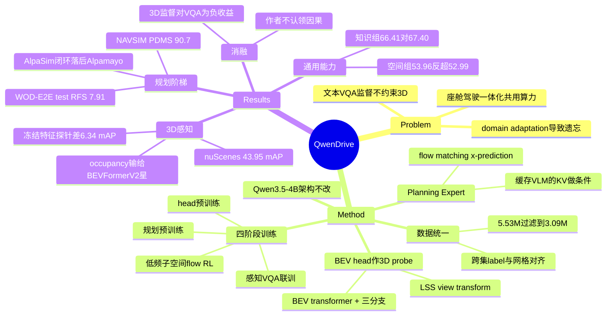

## Summary

Qwen-Drive-1.0 不改 Qwen3.5-4B 的架构，只外挂一个 BEV perception head 与一个 flow-matching Planning Expert，用四阶段配方把 3D 感知、driving VQA 与轨迹规划装进同一个 VLM，并把评测铺满 open-loop / pseudo-closed-loop / closed-loop 三档。比它的 SOTA 数字更有价值的是三条负面证据：冻结的 VLM 表征并不直接暴露 3D 结构（head-only 探针落后同编码器的专用检测器 6.34 mAP），加入 3D 感知监督反而让 driving QA 与 general VQA 各掉 0.64 / 0.92 分，而开环上的领先在 closed-loop AlpaSim 上完全反转（AlpaSim score 0.16 / 0.37，低于 Alpamayo-R1 的 0.36 / 0.58）。

## Problem & Motivation

作者针对 driving VLA 的两个具体缺陷。第一，主流做法把驾驶知识全部经由 VQA 文本监督灌进 VLM，而文本目标既不约束 3D layout、depth、occupancy，也无法直接评估这些量——模型可以把场景描述得很流畅，同时在 3D 空间里很不准。第二，大规模 domain adaptation 会造成 catastrophic forgetting，而任何有限的驾驶数据集都无法穷举部署时遇到的长尾，pretraining 得来的通用知识恰恰是 OOD 推理的依托。

论文还给了一条工程动机，值得单独记：量产车正在走"座舱—驾驶一体化"，智能座舱与智驾系统共用一块算力平台而非两个域控制器，因此同一个模型要同时支撑多轮对话、指令跟随、开放式视觉问答与驾驶感知规划。牺牲通用能力换驾驶分数，就意味着座舱还得再挂一个模型，把整合省下的算力吐回去。这条动机把"保住通用能力"从学术偏好变成了硬约束，是全文最有说服力的问题陈述，也解释了为什么整篇论文围绕"不改架构、不掉通用分"来组织。

由此作者提出三条设计要求：预训练 VLM 架构保持不变；用一个显式的 perception probe 把 3D 信息暴露出来并可被评估，而不是只靠文本空间推理；在获得驾驶能力的同时保住大部分通用能力。

## Method

基座是 natively multimodal 的 Qwen3.5-4B，架构一行不改，只挂两个外部模块。

**输入序列化。** 用普通词表 token 做 view tag（八个方位）与 frame tag，不引入 special token。VQA 用 frame-major 顺序（同一时刻的所有视角相邻），planning 用 view-major 顺序（同一视角的连续帧相邻），理由是后者把同一视角内的时序变化暴露在相邻位置上，对动态环境下的控制更重要。

**BEV perception head。** 读两路互补特征：vision encoder 输出的低层外观特征 `F^v`，以及穿过整个 VLM 后 image token 对应的特征 `F^m`。`F^v` 经一个无深度监督的 per-pixel 深度分布做 LSS 式 view transform，抬成保留高度维的 3D volume `V`；`V` 的 height-collapsed 版本去初始化 query-based BEV transformer 的 query（提供显式几何先验），BEV transformer 再对 `F^m` 展开的 feature pyramid 做 deformable cross-attention。得到的 ego-frame 特征 `B` 供三个分支共用：DETR 式 deformable decoder 做 3D 检测，`B` 沿高度展开后与 `V` 融合再过浅层 3D UNet 做 semantic occupancy，UNet 头做 map segmentation。关键设计是感知 loss 会经 `F^m` 反传，给 vision encoder 在直接通路之外多一条梯度路径。

**Planning Expert。** 32 层 diffusion transformer，hidden 1024，约 1.1B 参数（整机 5.0B）。它不重新编码场景，而是缓存 VLM 八个 grouped-query softmax attention 层在 RoPE 之后的 K/V，每份 cache 条件化连续四层 Planning Expert，轨迹 token 与 cached K/V 拼接做联合 attention；flow time、navigation instruction、current ego state 经共享 adaLN 注入。flow matching 用 **x-prediction**（直接预测干净轨迹端点而非速度或噪声），作者的理由是跨异构数据集录制的轨迹传感器噪声大，端点参数化对噪声更不敏感；为保证 `(τ̂₁-τ_t)/(1-t)` 的换算良态，flow time 采 `Beta(1.5,1.0)` 并截到 0.9。输出 50 waypoints（5 s @ 10 Hz），x/y/θ 分别除以 165 m / 25 m / (π/2) 归一化以便跨数据集联训；loss 在 flow matching 之外加一阶、二阶时间差分的 Huber 正则压抖动。推理用 10 步 Euler。

**四阶段训练。** Stage 1 冻结 VLM 只训新初始化的 BEV head；Stage 2 解冻 vision encoder 与 VLM，感知样本与 VQA 样本混批联训（head 的学习率是 VLM 的 20×，非活跃分支喂 dummy 输入以保持分布式计算图一致）；Stage 3 冻结 VLM 只训 Planning Expert，得到 `-SFT`；Stage 4 仍冻结 VLM，只对 Planning Expert 做 reward 优化，得到 `-RL`。

**Stage 4 的 RL 是全文技术含量最高的部分。** 确定性 Euler 采样一旦初始噪声抽定就没有可微的 transition probability，policy gradient 无从下手。作者的做法有三层：只在最后三步（k∈{7,8,9}）注入随机性，把确定性 flow 变成随机策略——理由是端点参数化下靠近 t=1 的扰动对输出影响最直接，更早的扰动会被后续积分衰减；扰动不加在独立 waypoint 上（那只会产生高频抖动、样本之间无法比较驾驶质量），而是限制在前 M=6 个正交 cosine 模态张成的低频子空间里，从而产生整体平移与弯曲这类有意义的机动多样性，likelihood 也只在这 3M 维模态坐标里算 Gaussian surrogate；再用 Eq. 7 的 Gaussian conditional 构造一个近似 restoring score，把被扰动的中间轨迹拉回预训练 flow 偏好的区域。同组 G=8 个 rollout 共享初始噪声、各自采样低频扰动与 VLM 生成的 reasoning trace，用 GRPO 式 group-relative advantage，按 γ=0.6 给靠近输出的步更大 credit，每组只做一次 on-policy 更新因此不需要 importance correction。作者明确承认这个 score correction 是"approximate restoring correction 而非精确保边缘变换"，因为它是按各向同性扩散推导的、而扰动被限制在低维子空间里——这种自我设限在同类工作里少见。

**数据配方**（披露得相当细，是本文的实质工作量所在）。感知用 nuScenes（28K 训练关键帧，occupancy 标签取自 nuScenes-OccNet）+ OpenScene（自划 16 log 验证集，607K 训练帧），跨数据集把检测统一成 7 类、occupancy 统一成 10 类、map 统一成 6 类，并做离线补标（用 nuPlan 矢量地图给 OpenScene 补 driveable，用 3D box 给 nuScenes 补 generic_object 伪标签）。两个源的 occupancy 网格物理范围、体素尺寸与 LiDAR-to-ego 变换都不同，作者不重采样类别标签（会失真），而是保留各自原生网格、用一次可微 trilinear sampling 把预测特征映过去。VQA 侧聚合 24 个公开 driving 数据集，先用 Qwen3.5-Plus 把 prompt/response 改写成统一对话 schema，再用 Qwen3.5-Flash 判断"改写结果与原标注是否语义一致"做过滤，5.53M → 3.09M（保留 55.9%）。自建三类数据补公开集的空白：Chain-of-Causation planning reasoning（规则分类器从未来轨迹抽出纵横向 maneuver prior，Qwen3.7-Plus 据此生成因果 trace，再走多级 audit——审计用分类问题而非打分，程序化聚合，专门剔除泄露未来信息的 trace）、相机顺序恢复（打乱环视图去掉 view tag，让模型认出前视并恢复顺时针序）、3 万条中国道路的信号灯 grounding 与 3D 检测 QA。Stage 2 混合 1.54M 条（对公开驾驶数据按任务与题型分层抽约 20%），重复后有效配比 12.7% 感知 / 31.0% 通用 VL / 56.3% driving VL。Stage 3 规划数据约 2.83M 条（NAVSIM+OpenScene 890K、WOD-E2E 557K、PAI-AV 1.38M），其中 685K（24.2%）带 reasoning trace 条件。

## Key Results

### 3D 感知：VLM 特征不天然含 3D 结构

nuScenes 上 Qwen-Drive-1.0-SFT 拿到 43.95 mAP / 42.83 NDS / 60.99 map mIoU，OpenScene 上 43.45 mAP / 71.27 map mIoU。但真正有信息量的是几组对照：

- **冻结 VLM 的 head-only 探针只有 35.60 mAP**，落后用同一 SigLIP-Qwen 编码器训练的 BEVFormerV2\* 6.34 mAP、6.91 RayIoU。作者由此得出"vision-language pretraining 提供了好的视觉初始化，但不直接暴露驾驶感知所需的 3D 结构"——这是把 probing 结论量化成数字，比空泛地说"VLM 缺乏 3D 感知"有用。
- **解冻 vision encoder 与 VLM（Stage 2）后 nuScenes mAP 与 map mIoU 各涨 10.46 / 9.84 分**，且 head 在 Stage 1 已收敛，因此增益不能归因于继续优化 head。
- **occupancy 是唯一没赢的任务**：Qwen-Drive-1.0-SFT 的 19.82 Occ mIoU / 37.02 RayIoU 低于同编码器 BEVFormerV2\* 的 25.72 / 43.89。作者归因于 OpenScene 的 occupancy 标签是 LiDAR 聚合自动生成的、带 source-specific 伪影，label unification 与离线补标解决不了体素级的语义歧义。他们把这一点写进正文而非藏起来，值得记一笔。
- 跨数据集迁移很脆：只训 nuScenes 的 head 在 OpenScene 上只有 16.50 NDS，不到自身 nuScenes 34.13 的一半；混源训练把 OpenScene NDS 拉到 41.86，代价是 nuScenes occupancy mIoU 掉 26.6%。

### Driving VQA：涨幅集中在因果推理，但依赖自建 benchmark

Driving QA 六项均值 69.43 vs 未适配的 Qwen3.5-4B 63.52（+5.91）。LingoQA 70.40 → 77.80，SURDS +13.18（相对 +24.9%），Ego3D 距离估计 RMSE 降 40.9% 到 7.78。作者对 RMSE 的解释很克制：不认为 VLM 学到了几何精确表征，而是驾驶场景的物理理解加上保留下来的定量推理能力，让模型能拿路边停车间距、虚线段长这类稳定尺度当隐式参照。

因果推理那一组差距极大：自建 PAI-AV-CoC 三项 + in-house 中文基准的均值 58.30，第二名 Gemma4-12B 只有 22.05；overall accuracy 41.26 是 Cosmos-Reason2-32B（5.73）的七倍多。**这也是全文最需要打折的数字**——benchmark 是作者自建的，judge 是同家族的 Qwen3.5-Plus，训练数据里就有大量自建 CoC trace。作者自己主动指出 Alpamayo-1.5 用了大规模私有 CoC 数据却在这个基准上表现差，"可能反映指令跟随错误与输入格式差异，不应被解读为因果推理弱"，这是一句必要的自我设限。

### 通用能力保持：确实保住了，但机制没被验证

知识/推理/识别十项均值 66.41 vs 基座 67.40（掉不到一分），空间理解/grounding 五项均值 53.96 反超基座 52.99。这是本文最扎实的一条结果，也直接服务于"座舱—驾驶一体化"那条动机。相比之下几个专用模型退化严重：Alpamayo-1.5-10B 在同一协议下 14.65、MiMo-Embodied-7B 26.53。

但要注意这些低分里有相当一部分来自**格式失败被计零**：Table 2/3 把无法解析的回答按 0 计入均值，InternVL3.5-8B 与 MiMo-Embodied-7B 在 PAI-AV-CoC 三项全是"–"，MiMo-Embodied-7B 在 Table 3(a) 三个 benchmark 是"–"。"我方通用能力优于专用模型"这个论断因此部分是评测 harness 的产物而非能力差距——作者提到了格式失败现象，但没有报告排除格式失败后的分数。

### 规划：三档评测的名次反转是全文最有价值的观察

| 层级 | benchmark | Qwen-Drive-1.0 | 相对位置 |
|:--|:--|:--|:--|
| Open-loop | WOD-E2E test RFS | 7.78 (SFT w/ reasoning) → 7.91 (RL) | 高于 RL 版 MindVLA-U1 的 7.87（+0.04） |
| Open-loop | WOD-E2E val RFS | 8.45 (RL) | 超过 human driver 参考 8.13，但 val 标注就是 RL 的 reward 来源，属 in-sample |
| Open-loop | PAI-AV 无泄漏子集 3 s minADE | 0.39 m | 显著差于 Alpamayo-1.5 的 0.17 m |
| Pseudo-closed-loop | NAVSIM v1.1 navtest PDMS | 88.2 (SFT) → 90.7 (RL)，91.4 (oracle best-of-6) | Table 6 所列方法中最高 |
| Closed-loop | AlpaSim score (all / at-fault) | 0.16 / 0.37 | 低于 Alpamayo-R1 的 0.36 / 0.58 与 Alpamayo-1.5 的 0.23 / 0.45 |

**开环与 pseudo-closed-loop 上领先、closed-loop 上落后，是这篇论文提供的最有价值的一条经验证据。** 作者自己对此给了一个具体假说：AlpaSim 频繁短周期重规划，强调对近期视觉变化的快速响应，而 Qwen-Drive 的输入是 1.5 s 内 0.5 s 间隔的四帧，Alpamayo-1.5 用的是密集的 0.4 s 视觉历史——更宽但更稀的历史可能限制了短重规划窗口内的响应速度。

RL 的效果也是有代价的交换：AlpaSim off-road rate 从 24.0% 腰斩到 12.0%（低于两个 Alpamayo 变体），at-fault AlpaSim score 从 0.27 升到 0.37，但 progress 从 54.0% 降到 48.0%，all-event close encounter rate 从 38.0% 升到 41.0%，PAI-AV 开环 ADE 也退化 3–5 cm。方向是"更安全但更保守"。作者还专门论证 AlpaSim score 不能单看：DriveWAM 的 at-fault score 0.53 很高，但 progress 只有 35%，因为它常常几乎不动，而 at-fault score 是行驶距离除以事故数；SimWAM 则相反，激进、progress 62% 但 at-fault CER 22%。这段分析质量很高。

作者对 NAVSIM 也主动降级："PDMS 不应被当作交互式驾驶质量的直接代理，在该基准上限附近，进一步的提升可能越来越多地反映对打分函数的适配。"

### 消融：BEV head 对下游任务是净负收益

Table 8 是全文最诚实的一张表（列：Driving QA Avg / CoC Overall / General VQA Avg / WOD-E2E val RFS）：

| 行 | Stage 2 配置 | Driving QA | CoC | General VQA | RFS |
|:--|:--|:--|:--|:--|:--|
| i | 未适配 Qwen3.5-4B | 63.52 | 2.58 | 62.60 | 7.88 |
| ii | + vision-language | 70.07 | 40.97 | 63.18 | 7.91 |
| iii | + 3D perception | 69.43 | 41.26 | 62.26 | 7.96 |

也就是说：驾驶能力的提升几乎全部来自 vision-language 训练（Driving QA +6.55、CoC 从 2.58 到 40.97）；**加上 3D perception 监督后 Driving QA 掉 0.64、General VQA 掉 0.92（还掉到了基座 62.60 之下），只有 planning RFS 涨 0.05**。作者自己写下"planning 结果支持 Stage 2 配方与后续 Planning Expert 训练兼容，但不能确立显式 3D 监督是提升的来源"。BEV head 的正当性因此只能建立在"显式、可检视的 3D 输出"这一接口与可解释性论证上，而非性能论证——这是论文标题里 "probe" 一词的真实分量，也是它没有过度声称的地方。

RL 消融（Fig. 11）：NAVSIM 单源训练加共享 ADE 项把 PDMS 从 90.4 提到 90.8；三源联训 90.6 / 90.7，说明跨数据集干扰有限。WOD-E2E val 上加 ADE 项会把 RFS 从 8.68 压到 8.45，但把 5 s ADE 从 2.24 m 压到 1.27 m——共享位移奖励把偏好优化锚回录制轨迹附近。规划数据 scaling（Fig. 12，仅 PAI-AV，0.17M → 1.38M）上 5 s ADE 与 FDE 单调下降，标准 split 上 ADE 从 1.34 m 降到 1.05 m，到 1.38M 仍无饱和迹象。

### 论文没有报告的（重要）

- **算力与超参完全缺失**：无 GPU 数量、无 optimizer、无学习率绝对值、无 batch size、无各 stage 的 epoch 数、无训练时长或成本。全文唯一的训练超参披露是"BEV head 学习率是 VLM 的 20×"与"vision-language 样本重复 2–3 个 epoch"。对一篇以 recipe 为核心贡献的 tech report，这是最大的可复现性缺口。
- **无 ego-status 消融**：规划条件里显式包含 current ego state 与 historical ego trajectory，论文没有任何去掉它们的对照。虽然本文明智地避开了已知被 ego-status 捷径污染的 nuScenes 开环 L2/collision 口径（全文不做该评测），但 NAVSIM / WOD-E2E / PAI-AV 的 ADE 类指标同样受益于 ego 运动外推，这条捷径在本文里未被测量。
- **防遗忘机制本身无消融**：全文的核心防遗忘手段是 Stage 2 混入 26%（重复后 31%）通用 VL 数据，但 Table 8 只对比"不训 / 训 VL / 训 VL+3D"，从不单独拆掉通用 VL 那一份。"混通用数据能防遗忘"是配方假设，不是被验证的结论。
- **感知对照不匹配**：Table 1 的 baseline 只在 remapped nuScenes 上训，而 Qwen-Drive 联训 nuScenes + OpenScene（多 607K 帧）；baseline 是 2022–2023 的 single-frame BEVFormerV2 / PETR / PETRv2 复现，没有近两年的专用检测或 occupancy 方法；参数量差距悬殊（ResNet-50/ViT encoder vs 4B VLM）；label space 是作者自定义的 7 类 remap 且 NDS 把 mAAE 置零。因此这些数字与公开 nuScenes leaderboard 完全不可比，"highly competitive with common vision-based 3D detectors"要按这个前提读。
- **Judge 同源**：LingoQA 换掉官方 LingoJudge 改用 Qwen-Plus（作者理由是官方 judge 打分过松且跨场景不一致，并附上官方口径下的 79.4，反而更高，这一处透明度做得好）；但自建 PAI-AV-CoC 由 Qwen3.5-Plus 判分、in-house 中文基准无外部可复核性，而被测模型出自同一 Qwen 家族。没有做 judge 敏感性分析。
- **Table 6 的 NAVSIM 对比表未列 SimWAM、DriveWAM、MiMo-Embodied**，尽管 SimWAM 与 DriveWAM 在本文 Table 5 / Table 7 中就是对比方法、MiMo-Embodied 在 Table 2 中就是对比方法。正文措辞是"among the compared methods"，措辞上守住了，但读者需要自己补这几条线（见 Notes）。
- 跨 rig 迁移只有定性图，作者自己声明"这些数据集没有统一 ground truth，不能确立新相机配置下的 3D 精度"。
- **无真车实验**；closed-loop 全部在 AlpaSim + PAI-AV-NuRec 重建仿真中完成。

## Evidence Ledger

| Claim ID | Claim | Type | Source locator | Evidence excerpt | Status |
|:--|:--|:--|:--|:--|:--|
| C1 | nuScenes 上 Qwen-Drive-1.0-SFT 为 43.95 mAP / 42.83 NDS / 60.99 map mIoU | number | Table 1 | "Qwen-Drive-1.0-SFT, SigLIP-Qwen, 43.95, 42.83, 60.99, 19.82, 37.02"（表行） | source-verified |
| C2 | nuScenes 上其 occupancy（19.82 mIoU / 37.02 RayIoU）低于同编码器 BEVFormerV2\*（25.72 / 43.89） | comparison | Table 1 | "BEVFormerV2\*, SigLIP-Qwen, 41.94, 36.46, 47.76, 25.72, 43.89"（表行） | source-verified |
| C3 | Table 1 baseline 只训 remapped nuScenes（28K 帧），本模型联训 nuScenes+OpenScene（607K 帧） | benchmark-setting | Table 1 caption + §2.3.1 | "Comparison methods are trained only on remapped nuScenes"; "This split provides 607K training frames" | source-verified |
| C4 | Driving QA 均值 69.43 vs 基座 Qwen3.5-4B 63.52，+5.91 | number | Table 2 + §3.2.1 | "improves this average by 5.91 points to 69.43, the highest among all methods" | source-verified |
| C5 | LingoQA 77.80 用 Qwen-Plus 当 judge 而非官方 LingoJudge；官方口径下为 79.4 | benchmark-setting | §3.2.1 footnote 1 | "We use Qwen-Plus as the judge instead of the official LingoJudge… obtains a LingoScore of 79.4" | source-verified |
| C6 | 通用 VLM：知识组 66.41 vs 67.40；空间/grounding 组 53.96 vs 52.99 | number | Table 3 + §3.2.2 | "it averages 66.41 versus 67.40 for Qwen3.5-4B"; "averages 53.96 and even exceeds Qwen3.5-4B at 52.99" | source-verified |
| C7 | NAVSIM navtest PDMS 90.7（RL，单条轨迹）；91.4 来自 oracle best-of-6 按 PDMS 选优 | number | Table 6 + caption | "‡ denotes best-of-N selection with N=6, where the candidate with the highest PDMS is chosen for each scene" | source-verified |
| C8 | WOD-E2E test RFS 7.91（RL），高于 RL 版 MindVLA-U1 的 7.87 | number | Table 4(b) + §3.3 | "raises RFS from 7.78 to 7.91, exceeding the reinforced MindVLA-U1 by 0.04 points" | source-verified |
| C9 | WOD-E2E val RFS 8.45 超过 human driver 8.13，但 val 标注即 RL reward 来源，属 in-sample | number | Table 4(a) + §3.3 | "exceeds the human-driver reference of 8.13. Since these annotations supervise the reward, this in-sample result…" | source-verified |
| C10 | closed-loop AlpaSim：本模型 0.16 / 0.37，低于 Alpamayo-R1 的 0.36 / 0.58 与 Alpamayo-1.5 的 0.23 / 0.45 | comparison | Table 7 + §3.3 | "records lower all-event and at-fault AlpaSim scores of 0.16 and 0.37, compared with 0.23 and 0.45" | source-verified |
| C11 | RL 使 off-road 24.0%→12.0%，progress 54.0%→48.0%，all-event CER 38.0%→41.0% | number | Table 7 + §3.3 | "halves the off-road rate from 24.0% to 12.0%… progress, which decreases from 54.0% to 48.0%" | source-verified |
| C12 | PAI-AV 无泄漏子集 3 s minADE 0.39 m vs Alpamayo-1.5 的 0.17 m | comparison | Table 5 + §3.3 | "Our minADE is 0.39 m versus 0.17 m… candidates remain concentrated around similar motions" | source-verified |
| C13 | 消融：加 3D 感知监督使 Driving QA 70.07→69.43、General VQA 63.18→62.26，RFS 7.91→7.96 | number | Table 8 rows ii/iii | "ii ✓ ✗ 70.07 40.97 63.18 7.91"; "iii ✓ ✓ 69.43 41.26 62.26 7.96"（表行） | source-verified |
| C14 | 作者明言该消融"不能确立显式 3D 监督是提升的来源" | causal-mechanism | §3.4 | "but does not establish explicit 3D supervision as the source of the improvement" | source-verified |
| C15 | Planning Expert 为 32 层 DiT、hidden 1024、约 1.1B 参数；整机 5.0B | number | §2.1 + Table 7 | "The hidden dimension is 1024, yielding ~1.1B parameters" | source-verified |
| C16 | 规划条件显式含 current ego state 与 historical ego trajectory，全文无去掉它们的消融 | benchmark-setting | §2.1 Eq.6 + §2.3.3；消融仅 Tab.8/Fig.11/Fig.12 | "The historical ego trajectory τhist, current ego state e, and navigation instruction n provide the remaining conditions" | source-verified |
| C17 | 全文及附录无 GPU 数、optimizer、学习率绝对值、batch size、训练时长；唯一超参披露为相对 20× 学习率与"重复 2–3 epoch" | number | 全文 + Appendix A–C（无相关命中） | "The BEV perception head uses a learning rate 20× that of the VLM" | source-verified |
| C18 | 公开驾驶 VL 数据 5.53M→3.09M（保留 55.9%）；Stage 2 为 1.54M；Stage 3 约 2.83M，其中 685K（24.2%）带 reasoning trace | number | §2.3.2 + §2.3.3 | "reduces the data from 5.53M to 3.09M samples, corresponding to a retention rate of 55.9%" | source-verified |
| C19 | 代码声明为"will be available"，地址 github.com/QwenLM/Qwen-Drive-1.0；权重列于 HF Qwen/Qwen-Drive-1.0-4B 与 ModelScope | license-code | arXiv abs comments + 论文首页链接块 | "Code will be available at https://github.com/QwenLM/Qwen-Drive-1.0" | source-verified |
| C20 | 规划评测为 WOD-E2E / PAI-AV / NAVSIM / AlpaSim，全文不做 nuScenes 开环 L2 与 collision rate | benchmark-setting | §3.3 Benchmarks（全文无 "L2"/"collision rate"） | "we consider two open-loop benchmarks, one pseudo-closed-loop benchmark, and one closed-loop simulator" | source-verified |
| C21 | 署名机构为 Qwen Team 与 Huazhong University of Science and Technology；基座为 Qwen3.5-4B | number | 作者块 + §1 | "1 Qwen Team 2 Huazhong University of Science and Technology" | source-verified |
| C22 | PAI-AV-CoC 是作者自建 benchmark（源自 PAI-AV 验证集），由 Qwen3.5-Plus 判分 | benchmark-setting | §3.2.1 | "we introduce PAI-AV-CoC, a CoC benchmark derived from the PAI-AV validation split. Qwen3.5-Plus acts as a judge" | source-verified |
| C23 | Table 6（NAVSIM）只列 TransFuser / DRAMA / Hydra-MDP / DiffusionDrive / Epona / ReCogDrive / AutoVLA / SpanVLA / ExploreVLA / EponaV2，不含 SimWAM、DriveWAM、MiMo-Embodied（三者在 Table 2/5/7 中均为对比方法） | benchmark-setting | Table 6 vs Table 2/5/7 | "Table 6 lists TransFuser, DRAMA, Hydra-MDP, DiffusionDrive, Epona, ReCogDrive, AutoVLA, SpanVLA, ExploreVLA, EponaV2" | source-verified |
| C24 | 全文无"移除或改变 Stage 2 中通用 VL 数据比例"的消融；Table 8 只变化 无 / VL / VL+3D 三档 | benchmark-setting | Table 8 + §2.3.2；消融仅 Tab.8/Fig.11/Fig.12 | "row ii introduces vision-language training, and row iii additionally enables 3D perception supervision" | source-verified |
| C25 | Table 2/3 把无法解析的"–"按 0 计入均值：InternVL3.5-8B 与 MiMo-Embodied-7B 在 PAI-AV-CoC 三项全为"–"，MiMo-Embodied-7B 在 Table 3(a) 三项为"–"；Alpamayo-1.5-10B 在 3(a) 仅一项、在 3(b) 三项为"–" | benchmark-setting | Table 2/3 caption + 表行 | "'–' indicates an invalid or unparsable response and is counted as zero in the relevant average" | source-verified |

*核查说明：本 ledger 由独立 verifier 逐条定位原文核对，`source-verified` 仅表示 primary source 确实包含该信息，不表示结果已被独立复现。两条 claim 在初稿中被判 `contradicted` 后按 verifier 给出的原文更正：C2 初稿误引 ResNet-50 版 BEVFormerV2\*（23.39 / 40.69），已改为同编码器 SigLIP-Qwen 版（25.72 / 43.89，差距更大）；C25 初稿把 Alpamayo-1.5-10B 的多处"–"归到 Table 3(a)，实际其中三处在 3(b)。C17、C20、C24 为"论文未报告"型断言，由 verifier 全文检索确认无相关内容，此类否定性结论的强度受检索覆盖度限制。C19 只核实论文声明的 URL，license 条款未核查。*

## Strengths & Weaknesses

**亮点。**

1. **评测阶梯本身就是贡献。** 把同一个模型放在 open-loop（WOD-E2E、PAI-AV）、pseudo-closed-loop（NAVSIM）、closed-loop（AlpaSim）三档上跑，并且如实呈现名次在最后一档反转，比任何单点 SOTA 都更有价值。这条证据可以直接拿去反驳"开环 planning 指标能代表驾驶质量"的默认假设。作者还额外做了一件对的事：对 AlpaSim score 做了行为归因（DriveWAM 几乎不动所以 at-fault score 虚高、SimWAM 过于激进），说明单一分数在闭环里是可被行为策略 game 的。
2. **Probing 结论被量化了。** "冻结 VLM 表征不直接暴露 3D 结构"不是新观点，但用同一编码器下 head-only 落后专用检测器 6.34 mAP、以及解冻后涨 10.46 mAP 这组对照把它钉成了数字。这对所有想"给 VLM 挂个几何头就当空间理解"的工作是一条硬约束。
3. **诚实度显著高于同类 tech report。** 承认 occupancy 输不过 baseline；承认 val RFS 超过人类是 in-sample；承认 PDMS 接近上限后的提升可能是在拟合打分函数；承认 3D 监督不能被认定为 planning 提升的来源；承认 RL 的 score correction 只是近似；承认跨 rig 迁移只有定性证据；甚至替被自己比下去的 Alpamayo-1.5 解释低分可能来自格式问题。Limitations 一节也具体（reasoning trace 与实际轨迹不一致、多时间尺度因果混杂时模型不稳定），不是走过场。
4. **Stage 4 的 RL 设计是有真思考的工程。** "确定性 flow 没有可微 transition"这个障碍，解法是只在末尾几步注入低频子空间噪声——低频约束这一点直击要害：独立 waypoint 噪声只会产生抖动，无法构成可比较的驾驶行为差异。这个技巧对任何"在 flow/diffusion policy 上做 RL"的场景都可迁移，不限于驾驶。
5. **数据管线披露详尽。** 跨数据集 occupancy 的"保留原生网格、对预测特征做可微重采样"这个做法比重采样标签更正确，值得单独记住。

**局限。**

1. **核心架构创新的收益为负。** BEV perception head 是标题和 abstract 的卖点（"probe"、"explicit, inspectable interface"），但 Table 8 显示它让 Driving QA 和 General VQA 各掉 0.64 / 0.92 分，只给 planning 换来 0.05 RFS，而作者自己拒绝认领这 0.05 的因果。剥掉包装，这个模块的实际价值是"多一个可视化/可审查的输出通道"，这是一个部署与可解释性论证，不是能力论证。论文没有把这个 trade-off 摆到 abstract 里。
2. **感知对比不是 matched setting。** baseline 少训 607K 帧、少两个数量级参数、是三年前的方法、label space 由作者重映射、NDS 被改动。在这种条件下的 "+2.01 mAP" 无法支撑"与常用 vision-based 3D detector 高度竞争"这个读者最容易接受的读法。要判断 BEV head 的绝对感知水平，需要在标准 nuScenes 口径下与近期专用方法比，论文没做。
3. **最大的宣称建在自建 benchmark + 同源 judge 上。** causal reasoning 58.30 vs 22.05 这个近 3 倍差距，评测集是作者建的、judge 是同家族的、训练数据里就有同分布的 CoC trace。这不是说结论是假的，而是说它的证据强度远低于 Table 3 那种公开 benchmark 上的一分之差。in-house 中文基准同理。
4. **复现不可能。** 无算力、无优化器、无学习率、无 batch size、无 epoch 数。权重开源（HF/ModelScope）部分补偿了这一点，但"staged training recipe"作为论文声称的核心贡献之一，其可复现性等于零。
5. **防遗忘的机制假设未被检验。** "混 26% 通用 VL 数据能防灾难性遗忘"是全文的组织性主张（也是那条座舱动机的落点），却没有任何去掉/改变这一比例的对照。结果（掉 0.99 分）是可信的，机制归因（是通用数据混合起的作用）是未验证的。
6. **对比表的选择性。** Table 6 漏掉了在 NAVSIM navtest 上报告更高 PDMS 的 SimWAM 与 MiMo-Embodied，而这两者在本文其他表里都是对比方法（SimWAM 还与本文共享核心作者）。正文用"among the compared methods"守住了措辞，但表格边界本身塑造了读者印象。
7. **ego-status 捷径未被测量。** 规划输入含 ego state 与历史轨迹却无对照实验。本文避开了 nuScenes 开环 L2 这个已知重灾区是加分项，但 ADE 类指标同样吃这条捷径。

**对领域的意义。** 这篇论文最可能被引用的不是它的数字，而是它无意中提供的两条边界证据：VLM 的通用视觉预训练不含可直接使用的 3D 几何（需要解冻联训才能激活）；以及开环/伪闭环上的排名不能外推到闭环。对我们关心的 embodied / VLA 方向，第一条直接适用于任何"用 VLM 做空间理解"的方案，第二条则是对 VLA 评测方法论的一般性警告。

## Mind Map

## Notes

**待办：与既有笔记的数字交叉。** 以下比较来自 vault 笔记而非本文原文，标注 grounding：

- 【已核·vault note】[[2608-SimWAM]]（Zongchuang Zhao、Xin Zhou、Dingkang Liang、Xiang Bai 与本文核心作者重叠）报告 NAVSIM navtest **91.5 PDMS**（单前视相机），高于 Qwen-Drive-1.0-RL 的 90.7、也高于其 oracle best-of-6 的 91.4。【已核·primary source】本文 Table 6 未列 SimWAM，但 Table 5 / Table 7 都拿它当对比方法。【推测】两处 NAVSIM 结果的可比性存疑：SimWAM 笔记未记录 NAVSIM 版本号，本文写明 v1.1；不过两篇的 DiffusionDrive 基线均为 88.1，暗示协议一致。下次读 SimWAM 原文时应确认版本与相机配置差异（SimWAM 单前视 vs 本文前视+左右前视×4 帧）。
- 【已核·vault note】[[2511-MiMoEmbodied]] 报告 NAVSIM PDMS **91.0**（RL，接 ReCogDrive 的 IL+DiffGRPO stack）。本文 Table 6 同样未列，但 Table 2 把 MiMo-Embodied-7B 当 VQA 对比方法。
- 上述两条不推翻本文任何断言（正文措辞是 "among the compared methods"），但足以说明"NAVSIM PDMS 最高"这个印象是表格边界造出来的。

**值得追问的问题。**

1. Table 8 的 planning 列只有 15 epoch、只用 WOD-E2E 训的 Planning Expert，RFS 差异（7.88 / 7.91 / 7.96）都在噪声量级。如果换成完整 Stage 3 配方重跑这三行，3D 监督的收益是会放大还是继续消失？论文没做，而这决定了 BEV head 该不该保留。
2. 低频子空间 flow RL（M=6 cosine 模态）是本文最可迁移的技术点。同样的思路能否直接搬到 manipulation 的 diffusion/flow policy 上？那里的"低频"对应什么物理量——末端轨迹的整体平移与旋转？值得单独查一下有没有人做过。
3. 闭环落后被归因于"视觉历史更宽但更稀"（1.5 s 内 4 帧 vs Alpamayo 的 0.4 s 密集历史）。这是一个可证伪的假说但论文没验证。如果成立，说明闭环驾驶对时间分辨率的需求与开环 benchmark 的需求方向相反——这对 VLA 的输入设计是一条通用启示。
4. 一致性过滤扔掉了 44.1% 的公开数据。被扔掉的那部分是随机噪声还是系统性偏向某类任务（比如模板生成的计数题）？如果是后者，"过滤"实际上是在悄悄改变任务分布，而模型在 Ego3D 计数/距离类任务上的表现可能部分由此解释。

**GUI/Agent 方向的迁移点。** 本文"外挂一个可检视的结构化 probe，但不改基座架构"的模式，与 GUI agent 里"给 VLM 加显式 element/accessibility-tree 头"的设想同构。Table 8 的结论值得直接搬过去当先验：这类 probe 更可能是接口收益而非能力收益，且可能以轻微的通用能力退化为代价。相关可对照 [[2503-CosmosReason1]]、[[2606-HybridDriveVLA]]、[[2501-CoVLA]]。
