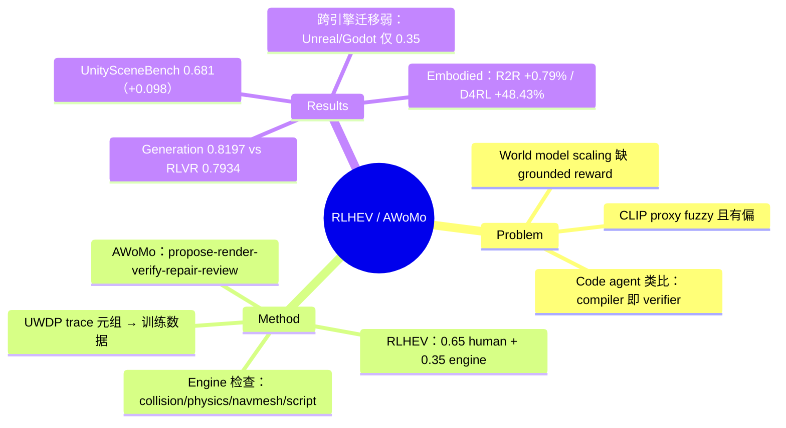

## Summary

主张 scaling world model 的瓶颈不在视频数据和算力，而在缺少像 compiler 之于 code agent 那样的 grounded reward channel；提出把 game development 当作 spatial world model 的可验证 reward 环境，用 RLHEV（Reinforcement Learning with Human-Engine Verification，dense engine 检查 + 开发流程中的隐式 human acceptance）做 RL post-training，并以 AWoMo agent 把 accepted/repaired 的开发 trace 转成训练数据。

## Problem & Motivation

Code agent 成功的关键在于 code 可执行——compiler、test、runtime 提供 dense、低成本的 reward，支撑了 RLVR 式 post-training；而 spatial generation 至今依赖 CLIP score 这类 fuzzy、有偏的 proxy，难以支持 RL post-training。作者的核心论断是"一个领域的进展与其说受限于数据或算力，不如说受限于是否存在可扩展的 feedback channel"。Game engine 里的场景是一份 executable world specification：engine 可以高效检查 collision、physics、navigability、bounded playability，开发者的 accept/reject 决策则天然提供全局验证信号——这正是 spatial 领域缺失的 reward 环境，且游戏开发过程还顺带产出 long-horizon trajectory 数据。

## Method

**RLHEV 目标**（§2, Eq. 2）：max_y U_H(x,y,h) − Σλ_i(h)·φ_i(C_i(x,y)) s.t. G_j(x,y)=1。其中 U_H 是 human utility（来自开发者 acceptance），C_i 是 engine 诊断检查（惩罚项），G_j 是 hard gate（如场景必须可加载）。实验中 full 模型的 reward 权重为 0.65 human + 0.35 engine（§5.2）。

**AWoMo（Agentic World Model）**：一个 world-building agent，执行 propose → render → verify → repair → review 循环——模型提出 scene edit，engine 执行并定位失败，agent 发出 repair，最终由 reviewer 裁决是否接受。engine 侧检查覆盖 geometry/collision、physics stability、navmesh reachability、script execution/soft-lock、bounded reachability probe（§4）。

**UWDP（Unified World-Development Protocol）**：把每步开发 trace 统一编码为元组 u_t = (b, o_t, s_t, a_t, g_t, v_t, h_t, ρ_t)——design intent、对象标识、空间/语义/物理字段、edit action、engine 输出、渲染证据、reviewer 决策、repair 链接（§4）。accepted 或 repaired 的多模态 trace 即成为训练数据，构成"recursive data engine"。

## Key Results

- **UnitySceneBench**（自建 200 例 Unity asset-edit 评测）：Full RLHEV 取得最高 asset classification 表现，best-of-eight primary score 0.681，比最强 non-full baseline 高 +0.098 primary score、+0.120 accuracy/balanced accuracy（Figure 4）。
- **Scaling 对比**（≤720 训练实例，8 seeds mean±std，Figure 5a）：baseline 为 Fuzzy Proxies、SFT、Offline RLHF、Engine-based RLVR（另有 Zero-shot CLIP 作为 fixed reference）；720 实例下 generation 质量 Full RLHEV 0.8197 vs Engine-based RLVR 0.7934（Figure 5b）。
- **OOD / 跨引擎迁移**（Figure 6a，MLLM-as-a-judge 打分 [0,1]）：source 预训练把 Unity distribution shift 从 0.25 提到 0.75；Unity→Unreal 0.25→0.35、Unity→Godot 0.15→0.35——跨引擎有正信号但远弱于同引擎。
- **Embodied 诊断**（Figure 6b）：AWoMo-augmented 训练带来 R2R success +0.79%、Gymnasium MuJoCo rollout return +9.96%、D4RL Gym-MuJoCo normalized score +48.43%。
- 作者自认结果"positive but still diagnostic"，需要更大规模 scaling study 验证（§6）。

## Evidence Ledger

| Claim ID | Claim | Type | Source locator | Evidence excerpt | Status |
|:--|:--|:--|:--|:--|:--|
| C1 | UnitySceneBench（200 例 Unity asset-edit）上 Full RLHEV 最高，primary score 0.681（best-of-eight） | number | Abstract; §5.3 / Fig.4 caption | "Full RLHEV obtains the highest best-of-eight primary score (0.681)" | source-verified |
| C2 | 比最强 non-full baseline 高 +0.098 primary / +0.120 accuracy | comparison | §5.3 | "beating the strongest non-full baseline by +0.098 primary score and +0.120 accuracy/balanced accuracy" | source-verified |
| C3 | 720 实例下 generation 质量 0.8197 vs Engine-based RLVR 0.7934 | number | §5.3 / Fig.5b | "with the full 720-instance training budget, Full RLHEV reaches 0.8197" | source-verified |
| C4 | OOD：Unity shift 0.25→0.75；Unity→Unreal 0.25→0.35；Unity→Godot 0.15→0.35（MLLM-as-a-judge） | number | §5.4 / Fig.6a | "improves the Unity distribution shift from 0.25 to 0.75" | source-verified |
| C5 | Embodied：+0.79% R2R / +9.96% Gym MuJoCo / +48.43% D4RL | number | §5.5 / Fig.6b | "+0.79% on R2R success rate, +9.96% on Gymnasium MuJoCo rollout return, and +48.43% on D4RL" | source-verified |
| C6 | Full reward 权重 0.65 human + 0.35 engine | benchmark-setting | §5.2 | "The full model uses only human+engine reward, 0.65 human + 0.35 engine" | source-verified |
| C7 | Agentic artifacts 开源于 github.com/LanceZPF/cardinal-preview | license-code | Abstract | "Agentic artifacts are released for reproduction" | source-verified |
| C8 | RLHEV = dense engine 信号 + 隐式 human acceptance；形式化为 max U_H − Σλφ(C) s.t. G=1 | causal-mechanism | Abstract; §2 Eq.2; §4 | "combines dense engine signals with implicit human acceptance feedback" | source-verified |
| C9 | baseline 含 Fuzzy Proxies/SFT/Offline RLHF/Engine-based RLVR；≤720 实例、8 seeds | benchmark-setting | §5.3 / Fig.5a caption | "Fuzzy Proxies Baseline, SFT Baseline, Offline RLHF, and Engine-based RLVR"; "mean ± std over eight seeds" | source-verified |
| C10 | 作者自认 engine reward 可被 game、结果属 diagnostic 需更大规模验证 | causal-mechanism | §6; Appendix C.1 | "The engine reward can be gamed too"; "still diagnostic, requiring larger scaling studies" | source-verified |

## Strengths & Weaknesses

**亮点**

- Problem formulation 是本文最有价值的部分：把 "world model 缺什么" 从数据/算力之争重述为 **feedback channel 稀缺**，并给出与 code agent（compiler = dense verifier，developer = global verifier）的精确类比。game engine 作为 executable world specification 提供 collision/physics/navmesh 级 dense 检查，这确实是 CLIP-score proxy 做不到的。
- 双层验证的设计干净：engine 检查提供 dense 局部信号但可被 game，human acceptance 提供稀疏但难 hack 的全局 gate——RLHEV 的 0.65/0.35 混合是对两者互补性的直接操作化。
- Limitation 章节（Appendix C）少见地坦诚，主动列出 sim-to-real gap、engine reward 可被 game、单引擎过拟合等五条反方论点，且承认结果是 diagnostic 而非 scaling 证据。

**局限**

- 实验规模与论断规模严重不对称：标题喊 "scaling world models"，但评测是自建 200 例 benchmark、720 训练实例的 controlled study，且未报告 data engine 实际产出的 trajectory 数据量（全文未给 games/hours/frames 统计）——"data engine" 的 scaling 属性未被验证（推测：目前只有 pipeline 原型）。
- 跨引擎与生成侧评价依赖 MLLM-as-a-judge，作者自己也承认这不是 engine-native scalar；用 fuzzy judge 来论证 "摆脱 fuzzy proxy" 的方法，有循环性隐患。
- Embodied 增益分布可疑：+0.79% R2R 几乎在噪声范围内，+48.43% D4RL normalized score 又大得异常，中间缺少对 baseline 起点和方差的说明，难以判断 AWoMo 数据的真实贡献。
- human acceptance 信号的可扩展性是整个范式的命门——它假设开发工作流里的 review 决策可以廉价、大量地收集，但论文没有量化这条信号的获取成本（不知道）。
- Kaipeng Zhang、Zhenglin Wan 的机构在 HTML 版中未明确标注；InfRec / Cardinal AI Lab 具体实体不明。

**影响**：即使实验只是 diagnostic，"game development = spatial 领域的 RLVR 环境" 这个 framing 对 world model 的 post-training 路线是一个值得认真对待的假设，与 vault 中 verifiable-reward / environment-as-data-engine 线索直接相关。

## Mind Map

## Notes

- 与 [[2608-WorldTrace]]、[[2608-EnvHarness]] 同处 "环境/开发流程作为数据引擎" 线索，可在 WorldModel-Survey 的 reward-grounding 议题下对照：本文的独特点是把 **human review 决策**当作免费的全局 reward，而非只用 engine 可验证信号。
- 关键疑问：engine 检查的是结构正确性（可加载、可通行），human 检查的是语义/审美可接受性——这两个信号加权混合是否掩盖了它们训练出的能力本质不同？paper 没有做 human-only ablation。
- code 指向 cardinal-preview repo，属系统/基建类工作，可作为 repo_candidate 供后续 repo-digest 评估。
