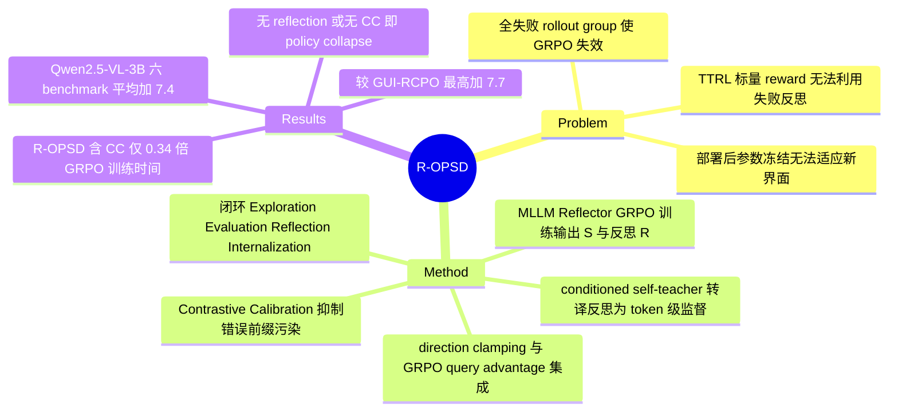

## Summary

提出 Test-Time Self-Evolving 框架，让 GUI grounding 模型部署后在无 ground truth 的界面数据上自我改进：MLLM Reflector 评估每次探索并生成文本反思，Reflection-Guided On-Policy Self-Distillation（R-OPSD）把反思作为 privileged information 条件化出 self-teacher，将其转成坐标 token 级监督；Contrastive Calibration 用 inverse-prompted student 抑制失败探索中错误前缀对监督信号的污染。Qwen2.5-VL-3B 在六个 grounding benchmark 上平均 +7.4（adapt on MMBench-GUI 口径），较 TTRL 基线 GUI-RCPO 最高 +7.7。作者称这是首个把 on-policy self-distillation 用于 GUI grounding test-time adaptation 的工作。

## Problem & Motivation

GUI grounding 模型训练完成后参数冻结，遇到未见过的应用/界面布局无法从交互中改进。已有的 test-time 方案 GUI-RCPO（region consistency + test-time RL）只提供稀疏标量 reward——只说成败、不说为什么错、更不说该怎么改；在 MMBench-GUI 这类困难数据上，rollout group 内全部失败时 GRPO 的相对 reward 直接失效，出现负迁移（Table 1 中 GUI-RCPO adapt on MMG 为 -0.3）。自然的替代是让模型对自己的探索做 reflection——指出目标元素、检查预测位置、诊断失败原因——但自由文本形式的 reflection 无法被标量 reward 的 policy optimization 直接利用。这就是本文要补的缺口：把文本反思变成可优化的信号。

## Method

**闭环四阶段**。Exploration：grounding 模型 pi_G 对 (screenshot I, instruction L) 预测坐标 B。Evaluation & Reflection：MLLM Reflector pi_R 输入 (I, L, B)，经强制 step-by-step 推理（意图分析 → 坐标处元素识别 → 匹配校验 → 结论）输出二值评估 S 与 <think> 中的反思文本 R。Internalization：把 S、R 内化进 pi_G 参数。

**Reflector 训练**。在 GroundCUA 上构造约 10,160 对 prediction-label 数据（base model 温度 1.0 采 8 个预测、按落点是否在 GT bbox 内标注、只保留组内正负混合的 instruction、正负 1:1 平衡采样），用 GRPO + format/binary reward 训 1 epoch；test-time 全程冻结。held-out 1,000 对上二分类 accuracy 89.5%（Qwen2.5-VL-3B）/ 91.7%（Qwen3-VL-2B）。作者还试过 30K 合成推理轨迹的 cold-start SFT，无增益，弃用。

**R-OPSD**。不引入外部 teacher：self-teacher 就是 pi_G 本身，但 prompt 中条件化 privileged information——成功时告知"预测已验证正确"，失败时给出"错误预测 + Reflector 反思 R"再要求输出位置。token-level advantage 取条件化 teacher 与无条件 policy 在每个坐标 token 上的 log-ratio（Eq. 5），乘 stop-gradient 后加权 policy log-prob 优化。这样高层文本反思被转译成生成序列上的稠密逐 token 反馈，而标量 reward RL 做不到这一点。

**Contrastive Calibration（仅用于失败探索）**。auto-regressive 坐标生成中，一旦前缀 token 已错，teacher 条件在错误前缀上的后续概率不再可信。CC 把 advantage 分母从无条件 policy 换成 inverse-prompted student——故意告知"预测是正确的"（Eq. 6）。效果分两段：初始错误 token 处，inverse student 被误导而给高概率、反思引导的 teacher 给低概率，产生强负 advantage 压制该 token；随错误前缀增长，两个分布被同一前缀主导而趋同，advantage 衰减到近零，污染信号不被内化。Fig. 4 定量支撑：初始错误 token 平均 advantage 从 -0.39（w/o CC）变为 -0.97，漂移末端 token 平均绝对 advantage 从 1.34 降到 0.0033。

**稳定化与集成**。Direction-based advantage clamping 强制 token 更新方向与评估结果一致（S=1 只取正、S=0 只取负）；token-level advantage 可与 GRPO query-level advantage 线性集成（lambda=0.2 最优）。实现上 pi_G 与 pi_R 共享同一 base model、靠切换 LoRA adapter 换角色，3B/2B 约 10GB、7B/8B 约 30GB 显存。

## Key Results

六个 benchmark：ScreenSpot、ScreenSpot-v2、ScreenSpot-Pro、MMBench-GUI、OSWorld-G、OSWorld-G-Refine；指标为 Element Accuracy（预测点落入目标元素 bbox）。adaptation 数据取自 SSv2 或 MMG，严格去掉 ground-truth 标注。

- **主结果口径**：+7.4% 指 Qwen2.5-VL-3B 在 MMG 上适应后六 benchmark 平均 50.2 → 57.6；同模型在 SSv2 上适应为 57.4（+7.2）。abstract 未点名配置，Table 1 中唯一产生 +7.4 的就是 adapt-on-MMG 行。
- **对比 GUI-RCPO**：同设置下 GUI-RCPO adapt on SSv2 为 53.4（+3.2）、adapt on MMG 为 49.9（-0.3，负迁移）；"up to +7.7" = 57.6 vs 49.9。
- **强基座增益收窄**：Qwen3-VL-2B 65.7 → 69.4（+3.7，SSv2）/ 70.3（+4.6，MMG）；Qwen2.5-VL-7B adapt on MMG 把 MMG 从 68.2 提到 79.2；Qwen3-VL-8B 增益进一步收窄（如 SSv2 92.9 → 94.5）。
- **消融（Table 2）**：只用评估结果做 privileged information 的朴素 OPSD 灾难性 policy collapse；有 reflection 无 CC 同样 collapse；reflection + CC 后 adapt on MMG 达 MMG 64.3；reflection 本身把 SSP 从 24.6 提到 28.5（adapt on SSv2）；clamping 与 query advantage 各有稳定增量。
- **对比 scalar-reward TTRL（Table 3）**：以聚合 bbox 为伪标签的各种 reward（Binary/IoU/GUI-G2）在 MMG 上负迁移或崩溃；用 Reflector 的 S 做 binary reward 已好于它们，加上反思 R 的完整 R-OPSD 最优——增益来自反思设计而非 OPSD 本身。GUI-SD（把预测框画进图像做 privileged information）严重退化（SSv2 78.5 vs base 80.4，MMG 崩溃）；在本框架中把文本坐标换成画框（Ours + V）同样负迁移。
- **开销（4×A100 40GB, 3B）**：R-OPSD w/ CC 单轨迹即可，151 min ≈ 0.34× GRPO（449 min）；完整版加 query advantage 需回到 K=8 rollout，778 min ≈ 1.73×。
- **延伸**：R-OPSD 当无监督训练算法用（GUI-R1 训练集约 3000 样本、只用图像+指令）也一致超 base（SSv2 87.8 / SSP 29.2 / MMG 67.2）。

## Evidence Ledger

| Claim ID | Claim | Type | Source locator | Evidence excerpt | Status |
|:--|:--|:--|:--|:--|:--|
| C1 | "+7.4% 平均提升"口径 = Qwen2.5-VL-3B adapt on MMG，六 benchmark 平均 50.2→57.6；adapt on SSv2 为 57.4（+7.2） | number | Abstract; Main Results; Table 1 | "our framework achieves performance gains (+7.4% and +4.6%) with MMG" | source-verified |
| C2 | 较 GUI-RCPO 最高 +7.7（57.6 vs 49.9，adapt on MMG；GUI-RCPO 该设置负迁移 -0.3） | comparison | Introduction; Table 1 | "our method achieves an average performance gain up to 7.7%" | source-verified |
| C3 | self-teacher = pi_G 自身条件化 S 与反思 R；token advantage = 条件化 teacher 与无条件 policy 的 log-ratio | causal-mechanism | Methodology Eq. 5 及 teacher prompt template | "construct a self-teacher by utilizing the pi_G itself conditioned on the evaluation result S and reflection R" | source-verified |
| C4 | CC 仅用于失败探索：分母换成被告知"预测正确"的 inverse-prompted student；初始错 token 强负 advantage（-0.97 vs -0.39），漂移末端衰减至近零（0.0033 vs 1.34） | causal-mechanism | Eq. 6; Fig. 3; Fig. 4; Discussion | "without CC, R-OPSD applies a marginal penalty at the initial error and generates corrupted advantages" | source-verified |
| C5 | Reflector 用 GRPO（format+binary reward）在约 10,160 对 GroundCUA 构造数据上训练、test-time 冻结；held-out 1,000 对 accuracy 89.5%（2.5-VL-3B）/ 91.7%（3-VL-2B） | number | Reflector Training; Appendix; Table 4 | "our Reflector achieves an evaluation Accuracy of 89.5% and 91.7%" | source-verified |
| C6 | 作者声称首个把 on-policy self-distillation 用于 GUI grounding test-time adaptation；GUI-SD（Zhang et al. 2026b）已把 OPSD 用于 GUI grounding 但非 test-time（推论自引用关系） | sota-novelty | Abstract; Contributions (c); Related Works | "this is the first work to successfully exploit on-policy self-distillation for test-time adaptation in GUI visual grounding" | source-verified |
| C7 | 六 benchmark 为 SS/SSv2/SSP/MMG/OSW-G/OSW-GR，指标 Element Accuracy；adaptation 用 SSv2 或 MMG 数据、严格去标签 | benchmark-setting | Experimental Setup | "a prediction is correct if the predicted point falls within the bounding box of the target UI element" | source-verified |
| C8 | 无 reflection 或无 CC 的配置灾难性 policy collapse；reflection+CC 后 adapt on MMG 达 64.3；reflection 把 SSP 24.6→28.5 | number | Table 2; Ablation Study | "turning the negative transfer into massive gains, reaching 64.3% on MMG" | source-verified |
| C9 | pi_G 与 pi_R 共享 base model、切换 LoRA adapter；显存约 10GB（2B/3B）/ 30GB（7B/8B） | benchmark-setting | Implementation Details; Fig. 2 caption | "restricts the GPU memory to approximately 10GB for 3B/2B models and 30GB for 7B/8B models" | source-verified |
| C10 | 4×A100 40GB + 3B：GRPO 449 min（1.00×）；R-OPSD w/ CC 151 min（约 0.34×）；加 query advantage 778 min（约 1.73×） | number | Appendix Table 5 | "R-OPSD (w/ CC) 151 ≈0.34x ... (w/ CC & QA) 778 ≈1.73x" | source-verified |
| C11 | Qwen3-VL-2B 平均 65.7→69.4（+3.7）/ 70.3（+4.6）；Qwen2.5-VL-7B adapt on MMG 把 MMG 68.2→79.2 | number | Table 1; Appendix Table 6 | "raises the average accuracy to 69.4% (+3.7%) and 70.3% (+4.6%)" | source-verified |
| C12 | GUI-SD（画框式 privileged information）在此 test-time 设置严重退化（SSv2 78.5 vs base 80.4，MMG 崩溃）；本框架换视觉框提示（Ours+V）同样负迁移（SSv2 77.3） | comparison | Table 3; Appendix Table 8 | "Its severe performance degradation confirms that drawing invalid pseudo-labels directly corrupts the visual context" | source-verified |
| C13 | 代码与 Reflector 训练数据集均"将发布"，全文无具体 URL | license-code | Abstract 末句; Appendix | "The code will be released. ... The constructed Reflector training dataset will be released." | source-verified |

## Strengths & Weaknesses

**Strengths**

- 机制干净且回答了一个真问题：文本 reflection 比标量 reward 信息量大是共识，但"怎么把自由文本变成可优化信号"一直缺解。conditioned self-teacher + log-ratio advantage 的转译方案不需要外部强 teacher，与 policy gradient 形式兼容，是 simple & generalizable 的那类设计（附录已验证可直接当无监督训练算法用）。
- Contrastive Calibration 是对 on-policy distillation 经典 incorrect-prefix 问题的一个巧解：inverse-prompted student 做对比分母，自动实现"初始错 token 强惩罚、前缀漂移后 advantage 归零"两段行为，且有 Fig. 4 的 token 级定量证据（-0.97 vs -0.39；0.0033 vs 1.34），不是纯 story。
- 消融有信息量：无 reflection 或无 CC 都直接 policy collapse（不是掉几个点），说明组件是结构必需而非增量装饰；Table 3 系统排除了"增益来自 OPSD 本身"（GUI-SD 崩）和"增益只来自 Reflector 的 S"（binary-S GRPO 仍差 4+ 点）两个替代解释。
- 对失败模式和开销诚实：明确指出 GRPO 在全失败 rollout group 上失效是 GUI-RCPO 负迁移的原因；附录给出完整训练时间账（含最优配置需 1.73× GRPO 时间的不利数字）。

**Weaknesses**

- "test-time adaptation" 实为 transductive/离线设置：adaptation 数据就是 benchmark 自身去标签（SSv2 或 MMG），训 2 epoch 后再评测，并非流式逐样本 TTA。cross-benchmark 增益（adapt SSv2 → SSP 20.3→30.5）说明学到的不全是 benchmark 记忆，但 in-domain 数字（adapt SSv2 → eval SSv2 88.8）含 transductive 成分，与"部署后遇到未见界面"的动机叙事有距离。
- 整个闭环压在 Reflector 上，而"无需人工标注"只对 test-time 成立：Reflector 本身用带 GT 的 GroundCUA 训练。论文只给了 Reflector accuracy 89.5-91.7% 这一个工作点，没有做"Reflector 准确率降到多少框架失效"的压力测试；声称"不需要完美评估"缺少边界刻画（推测：对分布外 UI 风格 Reflector 会先退化，这正是最需要 adaptation 的场景）。
- 基座越强增益越小（Qwen3-VL-8B 平均只 +1.4~2.0），方法价值集中在中小/弱基座模型；对已接近饱和的 grounding 模型是否还值得付出 1.73× 训练开销，论文未讨论。
- 只测单步 grounding，未验证增益能否传导到 agent 端到端任务成功率。
- 原文内部瑕疵：附录 Table 7 把 91.7 的 Reflector 数字标在 Qwen2.5-VL-3B 名下并据此算出"超 zero-shot 15.2%"，与 Table 4 的归属（91.7 属 Qwen3-VL-2B）冲突，读数时需注意。

## Mind Map

## Notes

- 与 [[2500-TestTimeReinforcementLearning]]（GUI-RCPO）构成直接对照：同一 test-time 设置下，region-consistency 伪标签 + GRPO 在困难数据上负迁移，本文把失败归因到"标量 reward + 全失败 group"并用 token 级反思监督绕开——这是 GUI test-time adaptation 这条线内部的一次方法论迭代。
- 与 [[2608-PCSD]] 是 OPSD token 反馈去噪的两条平行路：PCSD 用 teacher-student log-prob 差的时间持续性统计加权，本文用 inverse-prompted student 做对比分母；都在治 incorrect-prefix/噪声 token 反馈，机制假设不同（统计平滑 vs 前缀状态对比），适合在 survey 中对写。[[2605-AntiSD]] 也属此族。
- 与 [[2608-StepReflect]] 互补：StepReflect 把 reflection 外置为结构化模块服务 online 决策，本文把 reflection 经蒸馏内化进参数——GUI agent reflection 的"用在推理时 vs 写进权重"两种架构位置。
- 与 [[2510-VisualTestTime]]（RegionFocus）对照：同为 test-time 提升 grounding，一个花推理算力不改参数，一个改参数；两者理论上可叠加。
- Reflector 训练数据来自 [[2511-GroundCUA]] 的 Functional Split；OSWorld-G benchmark 出处见 [[2505-Jedi]]。
- 待跟进：code 与 Reflector 数据集"将发布"，无 URL；发布后值得核对 CC 的实现细节（inverse prompt 措辞对行为影响可能不小）。归属 [[Topics/CUA-Survey]]。