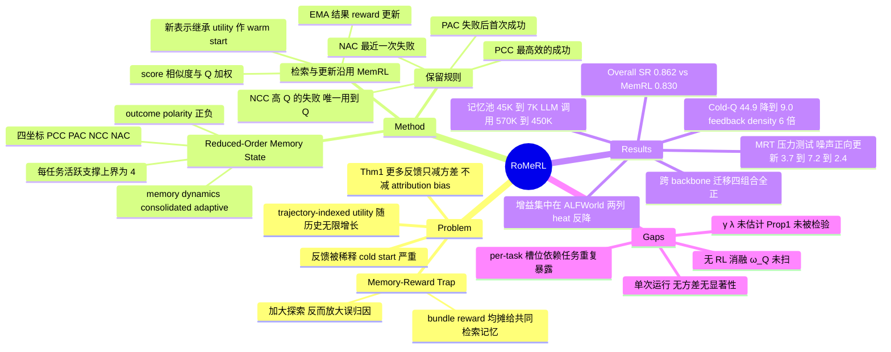

## Summary

RoMeRL 把 self-evolving agent memory 的 RL 状态从"每条轨迹一个 utility"压缩成每个任务固定 4 个语义坐标（正/负 × consolidated/adaptive），让固定的反馈预算集中在有界支撑上。它形式化了 memory-reward trap（MRT）：trajectory 级 reward 被均摊给共同检索的记忆，因此扩大探索会让弱相关记忆拿到无因果贡献的正向更新。在 ALFWorld + LifelongAgentBench 上 overall SR 0.862 vs 最强 baseline MemRL 0.830（+3.2pp），同时记忆池 45K→7K、LLM 调用 570K→450K，backbone 全程冻结。

## Problem & Motivation

端到端 memory 优化方法（MemRL 一类）给每条存储轨迹配一个可学 utility，从下游任务结果更新。随着经验累积，这个 trajectory-indexed 状态维度无限增长，而反馈总量有限——结果是大面积 utility cold start、更新高度集中、feedback density 低。

直觉上的解法是加大探索（UCB），让冷门记忆也拿到反馈。但作者的实验显示：探索确实改善覆盖、缓解 cold start，却让任务性能下降。原因是 reward 在 trajectory 级别被共同检索的记忆瓜分，探索面越宽，越多弱相关记忆被塞进成功上下文并因此获得与贡献不匹配的正向更新。作者把这条 exploration–contamination 两难命名为 **Memory-Reward Trap**。

由此论文提出的问题是：**能不能在不扩大暴露给错误 reward 传播的 utility 支撑的前提下，提高记忆的反馈覆盖？** 答案是不再在增长的空间里更用力地探索，而是换掉 RL 所作用的状态本身。

## Method

**MRT 的形式化（Def. 1-2, Thm. 1）**。定义记忆 m 的 observational utility（bundle-level 观测到的原始回报）与 interventional marginal utility（有无 m 的介入差）。二者之差拆成 task-level baseline 与 observational attribution bias。Theorem 1 是标准 bias–variance 分解：多检索几次只压缩方差项，不消除 baseline 与 attribution bias。MRT 定义为「边际贡献 ≤ 0，但观测回报高于无该记忆的匹配基线」——此时 EMA 更新的期望漂移为正，Q 加权检索会把这条记忆越推越前。

**Reduced-order 状态（Eq. 7-14）**。把每个任务 g 的增长型 utility 空间替换成一个固定 2×2 状态，两个二元轴是 outcome polarity（成功/失败）与 memory dynamics（consolidated/adaptive），笛卡尔积给出 4 个语义坐标，活跃检索支撑满足 `\|A_{g,t}\| ≤ 4`：

| 坐标 | 语义 | 选择规则（Eq. 16-19） | 是否用到学到的 Q |
|:--|:--|:--|:--|
| PCC | 巩固的正例参考 | 成功轨迹中效率最高（arg min ℓ） | 否 |
| PAC | 失败→成功的转折 | 首次失败之后最早的那次成功（arg min t） | 否 |
| NCC | 有下游价值的失败经验 | 失败轨迹中 Q 超过阈值 Q_init⁻ 且 Q 最大 | 是 |
| NAC | 当前失败状态 | 最近一次失败（arg max t） | 否 |

坐标的语义身份固定，内容可被替换；新表示进入坐标时**继承当前 utility 作为 warm start** 并把 post-admission 更新计数清零。占据 NAC 的轨迹在 Q 超过 Q_init⁻ 与现任 NCC 时被晋升到 NCC。

**检索与更新（Eq. 15, 20）**。检索按 score = (1−ω_Q)·cos(e(x), e(m)) + ω_Q·Q 取 TopK；更新是对被检索坐标施加 EMA：Q ← Q + α·(r − Q)，r 为 task-level 结果 reward。这两条式子的函数形式与超参（α=0.3、权重 0.5、逐 benchmark 调的相似度阈值、k1/k2）都与 [[2601-MemRL]] 一致——**真正被替换的是候选集，即哪些记忆有资格作为持久 utility 变量存在，而不是 RL 算法本身**。

**理论（Thm. 2-3, Prop. 1）**。Theorem 2 用 Hoeffding + union bound 给出全池估计所需的反馈预算随维度增长；Theorem 3 是"固定预算 T 摊到 d 个坐标 = T/d"的恒等式，故 d 从 N 降到 4 时人均反馈按 N/4 放大；Proposition 1 在一个通用的 clean↔erroneous 转移模型下给出稳态错误坐标占用上界 d·γ/(γ+λ)。

## Key Results

**主表（Table 1，10 epochs）**。Overall 是 LAB 两个任务 last-epoch SR 加 ALFWorld 六个任务类型 SR 的宏平均。RoMeRL 0.862，最强 baseline MemRL 0.830，+3.2pp。baseline 覆盖 No Memory (0.783)、Pass@10、RAG (0.795)、Mem0 (0.802)、MemP、MemRL——即**无记忆**与**朴素检索式记忆**两个下界都在，但 A-MEM / Reflexion / ExpeL / MemGPT / ReasoningBank / Memory-R1 / MemEvolve 只出现在 Related Work，没有实验对比。

**增益分布（由 Table 1 数字推算）**。8 列的逐列 delta 求和后除以 8 复现出 +3.2pp；其中 ALFWorld P&P（0.908→0.968）与 Examine（0.855→0.957）两列合计贡献约 2.0pp，占总增益约 62%；ALFWorld heat 一列 RoMeRL 反而略低（0.862 vs 0.865）。LAB 侧 OS 0.808→0.824、DB 0.632→0.680。

**MRT 被实测而非仅被断言（Table 2）**。受控压力测试在第一轮把 10% 记忆条目 null 化（保留标题、抹掉 action/reflection 字段，使其仍可被检索到），跑十轮：

| 方法 | Round-10 SR (%) | 噪声条目正向更新数 | Final Noise Ratio (%) |
|:--|:--|:--|:--|
| MemRL | 79.2 | 3.7 | 1.02 |
| MemRL + UCB | 78.4 | 7.2 | 1.20 |
| RoMeRL | 82.0 | 2.4 | 0.15 |

**反馈利用（§6.1，数字取自正文对 Figure 3 的叙述）**。MemRL 的 Cold-Q ratio 从约 29% 升到 44.9%，RoMeRL 从约 28% 降到 9.0%；feedback density 4.96→29.93（6.0×）。伴随记忆池 45K→7K（−84.4%）、LLM 调用 570K→450K（−21.1%）。

**跨模型迁移（Table 3，Validation Score / Average Steps）**。冻结的记忆状态换 backbone 后四种组合全部改善：LAB-OS GPT-5.4-mini 67.0→81.6（+14.6，步数 3.23→2.22）、Gemini-3.5-flash 74.0→81.4（+7.4）；LAB-DB 93.0→96.8（+3.8）、96.2→97.6（+1.4）。

**Q 值质量（Appendix B.6）**。Q 与记忆来源（成功/失败）的 point-biserial 相关从 baseline 的 r=0.493 升到 0.673；仅 5.0% 的 RoMeRL 记忆停留在初始 Q=0.5，baseline 为 47.8%。

**消融（§6.2）**。只做了两项：去 NCC 同时拉低 last-epoch SR 与 CSR（NCC 占 OS 27.14% / DB 42.78% 的坐标）；去 PAC 主要拉低 last-epoch SR、CSR 几乎不变（PAC 仅占 OS 8.21% / DB 5.05%）。

## Evidence Ledger

| Claim ID | Claim | Type | Source locator | Evidence excerpt | Status |
|:--|:--|:--|:--|:--|:--|
| C1 | Abstract 声称 Cold-Q ratio −80.0%、feedback density ≈6.0×、记忆池 −84.4%、LLM 调用 −21.1% | number | Abstract | "reduces the Cold-Q ratio by 80.0%, increases feedback density by approximately 6.0×, reduces the maintained memory size by 84.4%" | source-verified |
| C2 | Overall SR 0.862 vs 最强 baseline 0.830，+3.2pp | number | §6.1 / Table 1 | "achieves the highest overall average success rate of 0.862, outperforming the strongest baseline 0.830, by 3.2 percentage points" | source-verified |
| C3 | 实验 baseline 仅 No Memory / Pass@10 / RAG / Mem0 / MemP / MemRL；A-MEM、Reflexion、ExpeL、MemGPT、ReasoningBank、Memory-R1、MemEvolve 只在 Related Work 出现，无实验对比 | benchmark-setting | Table 1 / §2 | Table 1 方法列：No Memory, Pass@10, RAG, Mem0, MemP, MemRL, RoMeRL (ours) | source-verified |
| C4 | ALFWorld heat 列 RoMeRL 0.862 低于 MemRL 0.865 | number | Table 1 | MemRL Heat=0.865；RoMeRL Heat=0.862 | source-verified |
| C5 | ALFWorld P&P 0.908→0.968、Examine 0.855→0.957 | number | Table 1 | MemRL P&P 0.908 / Examine 0.855；RoMeRL 0.968 / 0.957 | source-verified |
| C6 | MRT 压力测试注入 10% null 化记忆；MemRL 79.2 SR / 3.7 / 1.02%，+UCB 78.4 / 7.2 / 1.20%，RoMeRL 82.0 / 2.4 / 0.15% | number | Table 2 / Appendix B.5 | "replace 10% of the first-round memory entries... set the key action or reflection field to null" | source-verified |
| C7 | reward 为 task-level 结果 r，更新为 EMA Q ← Q + α(r − Q)；检索分 = (1−ω_Q)·cos + ω_Q·Q | causal-mechanism | Eq. 20 / Eq. 15, §5.1 | "score=(1−ω_Q)cos(...)+ω_Q Q"；"Q_{g,t+1}=Q_{g,t}+α·1[·](r_t−Q_{g,t})" | source-verified |
| C8 | α=0.3 全设置统一；ω_Q=0.5 全设置统一；δ=0.50/0.37/0.62；k1=10/10/5；k2=5/5/3；Q_init=0.5/0.5/0.0 | benchmark-setting | Table 5 / Appendix B.2 | "α 0.3 0.3 0.3；ω_Q 0.5 0.5 0.5；δ 0.50 0.37 0.62；Q_init 0.5 0.5 0.0" | source-verified |
| C9 | 消融只覆盖 NCC 与 PAC（OS 任务）；全文无移除学到的 utility / RL 组件的消融（如 ω_Q=0 或纯相似度检索），也无 ω_Q 敏感性分析 | benchmark-setting | §6.2 + 全文检索 | "we ablate NCC... and PAC... on the OS task while retaining PCC and NAC as the basic positive and negative anchors" | source-verified |
| C10 | Table 1-3 无标准差、误差棒、置信区间、显著性检验或多 seed 重复；唯一 seed 是 OS/DB 7:3 划分用的 42 | benchmark-setting | Tables 1-3 / Appendix B.3 | "For benchmarks utilizing random splits (OS, DB), we use a fixed random seed of 42 to ensure reproducibility" | source-verified |
| C11 | PCC/PAC/NAC 的选择规则不含学到的 Q（分别为 arg min 效率、首次失败后 arg min 时间、arg max 时间）；只有 NCC 用 Q | causal-mechanism | Eqs. 16-19, §5.1 | PCC argmin ℓ_i；PAC argmin t_i after first failure；NCC argmax Q_i with Q_i>Q_init⁻；NAC argmax t_i | source-verified |
| C12 | 论文自陈 Prop. 1 的 γ、λ 需要 paired counterfactual rollout 的坐标级因果标签才能估计，全文未给经验估计 | causal-mechanism | §7 / Appendix A.4 | "estimating the transition quantities γ and λ in Proposition 1 requires coordinate-level causal labels from paired counterfactual rollouts" | source-verified |
| C13 | 主实验 backbone：LAB 用 DS-V4-flash、ALFWorld 用 GPT-5.4-mini；全程冻结 LLM 权重 | benchmark-setting | Table 4 / Table 1 / §6 | "DS-V4-flash Used for LifelongAgentBench"；"GPT-5.4-mini Used for ALFWorld"；"using frozen LLM backbones throughout" | source-verified |
| C14 | 跨模型迁移：OS 67.0→81.6（+14.6）、74.0→81.4（+7.4）；DB 93.0→96.8（+3.8）、96.2→97.6（+1.4） | number | Table 3 | "GPT-5.4-mini 67.0 / 3.23 → 81.6 / 2.22 → +14.6 / -1.01" | source-verified |
| C15 | code 为 github.com/YOUNG-fnxm/RoMeRL；arXiv perpetual non-exclusive license；2026-08-03 提交；主分类 cs.LG（cross-list cs.CL）；机构为南京大学/厦门大学/浙江大学 | license-code | Abstract 页脚 / abs 页元数据 | "License: arXiv.org perpetual non-exclusive license"；"arXiv:2608.02508v1 cs.LG 03 Aug 2026" | source-verified |
| C16 | Q 与记忆来源的 point-biserial 相关 r=0.493→0.673；停留在初始 Q=0.5 的比例 47.8%→5.0% | number | Appendix B.6 | "point-biserial Pearson correlation increasing from r=0.493 for the baseline to r=0.673 for RoMeRL" | source-verified |
| C17 | 论文未说明 Table 1 主实验用的是 ALFWorld 哪个 split 或多少条任务；Appendix B.4 只描述了原始 split 规模 | benchmark-setting | §6 / Table 1 / Appendix B.3-B.4 | "The original split provides 3,553 training tasks, 140 validation-seen tasks, and 134 validation-unseen tasks" | source-verified |
| C18 | Table 1 中 MemP 与 MemRL 的 LLM Calls（570K）与记忆池（45K）数值完全相同，RoMeRL 为 450K / 7K | number | Table 1 | MemP 570K / 45K；MemRL 570K / 45K；RoMeRL 450K / 7K | source-verified |
| C19 | Cold-Q ratio：MemRL 约 29%→44.9%，RoMeRL 约 28%→9.0%；feedback density 4.96→29.93 | number | §6.1 / Figure 3 | "MemRL's Cold-Q ratio rises from approximately 29% to 44.9%, whereas RoMeRL reduces it from approximately 28% to 9.0%" | source-verified |
| C20 | Eq. 14 定义的活跃支撑是 per-task 且 `\|A_{g,t}\| ≤ 4`，Eq. 15 在其上取 TopK；§5.1 正文未描述能提供 4 个以上候选的跨任务召回阶段 | causal-mechanism | Eqs. 14-15, §5.1 | "A_{g,t}={...}, `\|A_{g,t}\|` ≤ 4"；"TopK_{k_ret}(A_{g,t}; score_t)" | source-verified |

> Evidence boundary：
> 1. C9 / C10 / C17 / C20 属于「论文中不存在某内容」的核查结论——verifier 报告已按全文加全附录检索确认，但缺席证据的强度天然弱于正面数字核查；若后续版本补上相应实验，这几条需重判。
> 2. C19 的数字取自 §6.1 对 Figure 3 的**文字叙述**，不是从图像坐标读取；Figure 3/4/5/7 本身在本次消化中未被独立读图核对，故凡只以图呈现而正文未给数值的结论（如消融曲线的具体幅度、Appendix C.1 的绝对 token 数）均未进入本笔记。
> 3. 所有 `source-verified` 只表示原文确实包含该信息，不表示结果已被独立复现——本文全部结果均为单次运行、无方差报告（C10）。
> 4. C20 附带一处论文内部记号不一致：超参表的 k1「Cosine Similarity Recall Size」=10/10/5 与 k2=5/5/3 从未在 §5.1 的方程中出现（方程只用 k_ret），且 OS/DB 的 k2=5 大于活跃支撑上界 4。这说明实现中很可能存在正文未写出的跨任务召回阶段，但该阶段无法从论文核实。

## Strengths & Weaknesses

**Strengths**

- **把 convention 打开检验，而不是接受它**。"覆盖不足就加探索"是 RL 侧的默认动作，本文用 UCB 的对照实验指出它在 bundle-level credit 下失效：Theorem 1 说明更多反馈只压方差、不动 attribution bias，Table 2 则测出噪声条目的正向更新从 3.7 翻到 7.2。**机制侧的证据是扎实的**——MRT 不只是 motivation 里的断言，而是被受控注入实验测出来的现象。
- **诊断协议本身可复用**。"第一轮注入 10% null 化但仍可检索的记忆 → 统计噪声条目吃到的正向更新数 + 终轮噪声占比"是一个干净、便宜、可移植的 memory 污染探针。我判断这套协议的复用价值可能高于 RoMeRL 方法本身。
- **正面回应了 vault 里已记下的两条空缺**。[[2601-MemRL]] 笔记当时标出的两个弱点是「trajectory 级 reward 均摊给所有注入记忆，credit assignment 粗糙」与「无写入 gate、memory bank 只增不减」。RoMeRL 恰好同时针对这两条：前者被形式化为 MRT，后者被 4 槽替换机制解决。跨论文的这条 pattern 说明 selection-based memory evolution 的瓶颈已从"检索得准不准"移到"该让哪些记忆有资格持有 utility"。
- **效率是真省，且方向正确**。记忆池 −84.4%、LLM 调用 −21.1%，全程冻结 backbone、无梯度、无 rollout 训练成本——收益不是靠加算力买来的。保留失败经验的 NCC 有独立证据支持（占 OS 27.14% / DB 42.78% 的坐标，消融后 SR 与 CSR 双降），比"只重放成功轨迹"的常见做法更有信息量。

**Weaknesses**

- **RL 的贡献完全没被隔离，这是最大的空缺**。四个坐标里只有 NCC 的选择规则用到 Q（C11）；PCC/PAC/NAC 分别是"最短的成功""失败后第一次成功""最近一次失败"三条纯启发式。学到的 Q 只在检索打分（ω_Q=0.5）与 NCC 晋升两处起作用，而论文没做 ω_Q=0 的消融，也没有 ω_Q 敏感性分析（C9）。因此"reduced-order 结构"与"在其上做 RL"两者的贡献无法区分——完全可能一个纯启发式的 4 槽保留策略 + 纯相似度检索就拿到大部分增益。考虑到检索式与更新式在函数形式和超参上都与 MemRL 一致（C7/C8），本文真正新的东西是**保留策略**而非 RL 算法，标题里的 "RL" 更多是继承而来的语境。
- **headline 数字里有近乎恒等式的成分**。feedback density 4.96→29.93 是 6.0×，记忆池 45K→7K 是 6.4×，两者几乎同比。Theorem 3 说的就是"反馈预算 T 摊到 d 个坐标 = T/d"，所以 6× 的 feedback density 主要是把 d 缩小 6 倍的算术后果，而不是独立的经验发现；Cold-Q ratio 同理是在小得多的分母上算的。缩维一定能提高人均反馈，真正需要证明的是**缩维不损失信息**——而这只能由任务 SR 承担，SR 只给出 +3.2pp。
- **增益高度集中，且没有任何方差支撑**。+3.2pp 里约 62% 来自 ALFWorld 的 P&P 与 Examine 两列，heat 一列反而是负的（C4/C5）。全文无 seed 重复、无标准差、无显著性检验（C10）。这直接影响对 MRT 主张的读法：Table 2 里「探索让噪声吃到更多正向更新」（3.7→7.2，2×）是稳的，但「探索降低性能」只有 79.2→78.4 这 0.8pp 之差，在单次运行下不足以支撑。论文把这两件强度差很远的事一起当作 MRT 的证据，前者应保留、后者应视为暗示。
- **适用边界依赖 per-task 重复暴露**。坐标是**每个任务 g** 一组（C20），而 LAB/ALFWorld 的评测协议是对同一任务集跑 10 epochs——per-task 槽位天然贴合这种重复。一旦任务不重复出现（真正的 open-ended 部署），每个任务只有 ≤4 个坑且大多为空，reduced-order 相对全池的优势基础就消失了，退化成"每任务留一条最好的成功轨迹"。论文在 limitations 里承认未评估 open-ended / longer-horizon，但没有把这条结构性依赖讲出来。
- **可复现性与记账口径的缺口**。Eq. 14-15 的活跃支撑上界是 4，而超参表的 k2 在 OS/DB 是 5，且 k1=10 在正文方程中从未出现（见 Evidence boundary 4）；Table 1 报的 7K 记忆池也与"500 任务 × 4 槽 = 2000"对不上，"memory pool size" 究竟统计全部生成的记忆还是活跃支撑没有定义；MemP 与 MemRL 的 LLM 调用与记忆池数字完全相同（C18）；ALFWorld 主实验用哪个 split、多少条任务未说明（C17）。这些不一定是错误，但都让第三方无法核对效率类主张。
- **理论是记账，不是发现**。Theorem 1 是标准 bias–variance 分解，Theorem 3 是 T/d 恒等式，Theorem 2 是 Hoeffding + union bound 的教科书用法。Proposition 1 提供的"稳态错误占用更低"结论依赖 γ、λ 两个量，而论文自己承认估计它们需要 paired counterfactual rollout，全文没有估过（C12）——所以这条结论在本文数据上是**未被检验的条件命题**，不能读成"已证明 RoMeRL 的污染更少"。Table 2 的噪声占比 0.15% vs 1.02% 是独立的经验证据，与 Prop. 1 无因果连接。

**对领域的影响**（个人判断）。真正有价值的 move 是把 self-evolving memory 的问题从"存什么 / 怎么检索"往前推到"**utility 学习的状态维度该多大**"——这是一个此前没被明确提出的 formulation。但本文给出的答案（固定 4 个语义槽）是一个具体的手工设计，其最优性没有被论证，也没有与"学出来的压缩"（如聚类式 / 可学习槽位分配）对比。若后续工作把 MRT 的诊断协议保留、把 4 槽换成可学习的分配机制，那才是这条线的自然下一步。

## Mind Map

## Notes

- **最该做的一次实验**：把 ω_Q 设为 0，保留四坐标结构与全部替换/晋升规则，用纯余弦相似度检索。如果 SR 掉不到 1pp，本文的 RL 部分就是装饰，贡献应重述为"一种基于结果极性与时序的记忆保留启发式"。这个实验成本极低（超参改一个数），论文没做本身是个信号。
- **一个可以直接用的探针**：Appendix B.5 的 null 化注入协议（保留标题以维持可检索性、抹掉 action/reflection 字段以移除实际效用）+ 两个指标（噪声条目累计正向更新数、终轮噪声占比）。它把"记忆污染"从定性讨论变成两个数。可以拿去测 vault 里其他 memory 方法，也可以和 [[2512-MemoryGraft]] 的投毒攻击面并置——前者是无意污染，后者是有意注入，指标是同一套。
- **与 GUI 线的潜在连接（待验证）**：MRT 的成因是 bundle-level credit，凡是"多条记忆/技能同时注入上下文、只拿到 episode 级 reward"的系统都有同一问题。GUI agent 的 skill library 与 experience replay 属于这一类，但本文只在文本环境（ALFWorld、OS/DB 终端）验证，是否迁移到含视觉观测、动作空间更大且失败模式更长尾的 GUI 场景未知。
- **一个仍未被回答的问题**：4 是"两个二元轴的笛卡尔积"这个论证只说明了 4 是这组区分的最小完备积，没说明这组区分本身是对的。为什么不是三值极性（成功/部分成功/失败）？为什么效率是 PCC 的选择依据而不是鲁棒性？论文的 Theorem 3 对任意 d 成立，这意味着理论并不偏好 4——d 的选择完全是经验的，却没有 d 的扫描实验。
