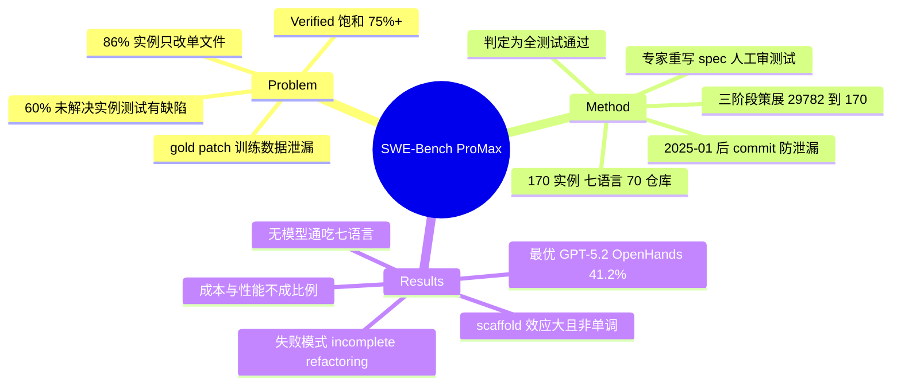

## Summary

SWE-Bench ProMax 是一个专家策展的多语言 code refactoring benchmark：170 个实例、七种语言（Python/Java/TypeScript/Go/C/C++/Rust）、70 个仓库，gold patch 平均修改 11.4 个文件 / 261.6 行代码，要求 agent 完成行为保持（behavior-preserving）的跨文件协调修改。在 mini-swe-agent 与 OpenHands 两个 scaffold 下评测 6 个 frontier 模型，最好成绩是 GPT-5.2 + OpenHands 的 41.2% resolve rate，远低于同类 agent 在 SWE-bench Verified 上 75%+ 的水平。

## Problem & Motivation

论文的出发点是 SWE-bench 系 benchmark 的双重失效：一是**饱和**——frontier agent 在 Verified 上已到 75%+，区分度耗尽；二是**评测质量**——论文转引 OpenAI 的审计（ref [31]，即 OpenAI note "Why SWE-bench Verified no longer measures frontier coding capabilities"）：接近 60% 的未解决 Verified 实例含有缺陷测试（35.5% 过窄测试拒绝正确解、18.8% 过宽测试检查未声明需求），并称这直接导致 OpenAI 弃用该 benchmark；同时 frontier 模型可以从训练数据里逐字复现 gold patch（数据泄漏）。此外任务尺度太小：86% 的 Verified 实例只改单个文件。

作者选 code refactoring 作为替代任务形态的理由：它要求在多文件间做协调一致、行为保持的修改，天然是大尺度长程任务（ProMax 中 30% 实例改 10+ 文件、32% 改 200+ 行），且被现有 benchmark 覆盖不足——RefactorBench 只有单语言，SWE-bench 系不含 refactoring 任务。

## Method

**任务形式**：给 agent 一份重写过的 issue description 和 pre-refactoring commit 处的仓库快照；判定标准是 agent 的修改**通过测试套件中的全部测试**（resolved iff all tests pass）。行为保持只由 test suite 检查——全文未出现 formal equivalence checking 相关表述（此为 absence-based 判断，论文没有显式否认）。

**三阶段构造 pipeline**（29,782 候选 → 170 实例，接收率约 0.57%）：

1. **Data collection**：GitHub API 筛仓库（≥500 stars、approved OSS license、主语言占代码库 ≥80% 且属七种目标语言）；抽取 2025 年 1 月之后、commit message 含 "refactor" 但不含 "bug fix"、且同时修改 test 与 non-test 文件的 commit。时间下限兼作数据泄漏缓解。
2. **Environment construction**：每个候选构建隔离 Docker 环境，在 pre-refactoring commit 装依赖、应用 gold patch、跑完整测试套件；环境或 patch 失败者丢弃。
3. **Filtering & rewriting**：LLM 辅助 commit 分析 → 质量过滤（去单文件任务、复杂度不足、过窄/过宽测试）→ 专家从零重写 issue description（原始 commit message 通常过于简略如 "refactor auth module"）→ 人工终审对齐 description、tests、gold patch。

**数据尺度**（Table 2）：gold patch 平均 11.4 文件（max 182）、261.6 LoC（max 4,503）；issue description 平均 685.3 tokens，gold patch 平均 8,179.5 tokens。

**评测设置**：6 个模型（proprietary：Gemini-3-Pro、Claude Sonnet 4.6、GPT-5.2；open-weight：GLM-5、Kimi-K2.5、Qwen3.5）× 2 个 scaffold（mini-swe-agent：极简 bash 循环；OpenHands：带 sandboxed runtime 的富工具平台）。

## Key Results

**主结果（Table 3，resolve rate / 平均步数 / 平均每实例成本）**：

| Model | mini-swe-agent | OpenHands |
|:--|:--|:--|
| Gemini-3-Pro | 26.5% / 58.0 / \$0.60 | 19.4% / 51.2 / \$1.49 |
| Claude Sonnet 4.6 | 30.6% / 99.5 / \$2.32 | 38.8% / 117.9 / \$4.77 |
| GPT-5.2 | 21.8% / 25.2 / \$0.19 | **41.2%** / 115.1 / \$3.60 |
| GLM-5 | 22.9% / 108.9 / \$0.10 | 36.5% / 114.2 / \$0.24 |
| Kimi-K2.5 | 26.5% / 85.3 / \$0.37 | 32.9% / 99.6 / \$0.72 |
| Qwen3.5 | 20.6% / 155.4 / \$0.93 | 36.5% / 141.2 / \$0.78 |

- **未饱和**：最好成绩 GPT-5.2 + OpenHands 41.2%，论文明言"far below the 75%+ that frontier agents achieve on SWE-bench Verified"。
- **Scaffold 效应巨大且非单调**：除 Gemini-3-Pro 外所有模型换到 OpenHands 后显著提升（GPT-5.2 从 21.8% 翻近一倍到 41.2%），Gemini-3-Pro 反而从 26.5% 掉到 19.4%。作者归因于 richer runtime tooling 对大尺度 refactoring 特别有利，但这是 bundle 级对比，未做组件归因。
- **成本与性能不成比例**：OpenHands 下 Claude Sonnet 4.6 最贵（\$4.77/实例）却以 38.8% 落后于 GPT-5.2（\$3.60、41.2%）；GLM-5 以 \$0.24/实例拿到 36.5%。
- **无模型通吃所有语言**（OpenHands 下各语言最优）：Python GPT-5.2 48.3%、Java GLM-5 34.6%、TypeScript Claude 53.6%、Go Kimi-K2.5 43.5%、C GPT-5.2 75.0%、C++ Qwen3.5 54.5%、Rust Claude 63.6%。
- **主导失败模式是 incomplete refactoring**：gold patch 的累积文件覆盖到 20 个文件左右才达 90%，而 agent（Claude Sonnet 4.6 与 Kimi-K2.5）在约 10 个文件处即达 90%——改了部分受影响文件但未把修改传播到所有需协调更新的位置；失败轨迹消耗更多交互轮数却不扩大修改范围（unproductive exploration cycles）。

## Evidence Ledger

| Claim ID | Claim | Type | Source locator | Evidence excerpt | Status |
|:--|:--|:--|:--|:--|:--|
| C1 | 170 实例 / 七语言 / 70 仓库，自 29,782 候选筛出 | benchmark-setting | §3.2, §6, Table 4 | "170 instances... seven programming languages... 70 repositories, selected from 29,782 initial candidates" | source-verified |
| C2 | gold patch 平均 11.4 文件（max 182）、261.6 LoC（max 4,503） | number | §3.3, Table 2 | "# Files 11.4 182; Lines of code 261.6 4,503" | source-verified |
| C3 | 转引审计：近 60% 未解决 Verified 实例含缺陷测试（35.5% 窄、18.8% 宽），OpenAI 因此弃用；来源为 OpenAI note（ref [31]） | number | §1 + ref [31] | "nearly 60% of unsolved instances—35.5% had narrow tests and 18.8% had broad tests—leading OpenAI to deprecate the benchmark" | source-verified |
| C4 | 最优成绩：GPT-5.2 + OpenHands，41.2% / 115.1 步 / \$3.60 每实例 | number | Table 3, §5.1 | "GPT-5.2 41.2 115.1 $3.60" | source-verified |
| C5 | 除 Gemini-3-Pro（26.5%→19.4%）外，换 OpenHands 均显著提升（GPT-5.2 21.8%→41.2%） | comparison | §5.1, Table 3 | "every model except Gemini-3-Pro improves markedly when moving from mini-swe-agent to OpenHands" | source-verified |
| C6 | 成本不保证性能：Claude \$4.77/38.8% 落后 GPT-5.2 \$3.60/41.2% | comparison | §5.1 cost analysis | "the most expensive model ($4.77 per instance) yet trails GPT-5.2 (41.2% at $3.60)" | source-verified |
| C7 | 构造 pipeline：≥500 stars / OSS license / 主语言≥80%；2025-01 后含 "refactor" 不含 "bug fix" 的 commit；Docker 环境；专家重写 description；人工审测试 | benchmark-setting | §3.2 Stages 1-3 | "at least 500 stars, an approved open-source license... after January 2025... 'refactor' but not 'bug fix'" | source-verified |
| C8 | ProMax 30% 实例改 10+ 文件、32% 改 200+ 行 vs Verified 86% 仅改单文件 | comparison | §1, Figure 1 caption | "30% of our instances modify more than 10 files and 32% require over 200 lines of code" | source-verified |
| C9 | 主导失败模式 incomplete refactoring：gold patch 约 20 文件达 90% 覆盖，agent 约 10 文件即达 90%；失败轨迹多轮数不扩范围 | causal-mechanism | §5.2, Figure 5 | "gold patch CDF reaches 90% only around 20 files, both agents reach 90% by approximately 10 files" | source-verified |
| C10 | 无模型通吃：各语言最优分属 GPT-5.2 / GLM-5 / Claude / Kimi / Qwen | comparison | §5.1, Table 3 | "No single model dominates all languages. Claude Sonnet 4.6 leads on TypeScript (53.6%) and Rust (63.6%)" | source-verified |
| C11 | resolved 判据 = 通过测试套件全部测试；行为保持仅由 test suite 检查 | benchmark-setting | §3.1, §4.1 | "resolved if and only if the agent's modifications pass every test in the suite" | source-verified |
| C12 | 数据集发布于 HuggingFace（swe-bench-promax/SWE-Bench-ProMax）；COLM 2026 | license-code | 题页脚注 | "Published as a conference paper at COLM 2026" | source-verified |
| C13 | 41.2% 远低于 frontier agent 在 Verified 上的 75%+（引 ref [38] = GPT-5 system card） | comparison | §5.1 + ref [38] | "far below the 75%+ that frontier agents achieve on SWE-bench Verified [38]" | source-verified |
| C14 | 6 模型 × 2 scaffold（mini-swe-agent、OpenHands） | benchmark-setting | §4.1-4.2 | "We evaluate six frontier models... under two agent scaffolds" | source-verified |

> Evidence boundary：C11 中"无 formal equivalence checking"是 absence-based——全文未出现相关表述，论文未显式否认使用形式化方法。C3 的 60%/35.5%/18.8% 是论文对 OpenAI note 的**转引**，本笔记只核对了"论文如此引用"，未独立核对 OpenAI 原文。

## Strengths & Weaknesses

**Strengths**

- **问题选得准**：不是又造一个更难的 bug-fix 集，而是换任务形态。refactoring 的"行为保持 + 跨文件协调"天然测出 Verified 测不到的能力（sustained cross-file coordination），且 86% 单文件 vs 平均 11.4 文件的对比给了尺度上的硬理由。
- **直接回应已被文档化的质量缺陷**：从零重写 specification、人工删过窄/过宽测试、2025-01 后 commit 缓解泄漏——每条都对着 OpenAI 审计指出的具体失效模式，而非泛泛地"更严格策展"。
- **双 scaffold 评测暴露 harness 敏感性**：同一模型换 scaffold 可差近 2 倍（GPT-5.2）甚至反向（Gemini-3-Pro），这本身是对"单 scaffold 排行榜"外推有效性的一次否证，与 [[Papers/2607-HarnessEvolution]] 的结论互为印证。
- **失败模式分析有信息量**：incomplete refactoring（文件覆盖 CDF 对比）与 unproductive exploration cycles 把"41.2%"分解成了可操作的瓶颈描述。

**Weaknesses / 适用边界**

- **行为保持的判定上限是测试套件**：通过全部测试 ≠ 行为保持——未被测试覆盖的行为改变检不出来，resolve rate 可能高估真实的 refactoring 正确率；反之人工审测试也可能没删干净过窄测试。论文没有对测试覆盖率与判定可靠性做量化（未知）。
- **实例分布有采样偏置**：只收 commit message 自标 "refactor" 的提交，排除了未标注的事实性 refactoring 与混合型 commit；语言/仓库分布也受 ≥500 stars 门槛影响。
- **每语言样本量小**：由 resolve rate 分母反推各语言约 20-29 个实例（推测，未直接核对 Table 4/5 的逐语言计数），"C 最容易（75%）"这类逐语言结论建立在 ~20 样本上，噪声敏感。
- **泄漏缓解有保质期**：2025-01 的时间下限只对当前一代模型有效，后续模型的训练数据会重新覆盖这些 commit；benchmark 会随时间退化（论文未讨论刷新机制，未知）。
- **scaffold 归因停在 bundle 级**："richer runtime tooling 有利于大尺度 refactoring"是合理推测但未做组件消融，无法回答 OpenHands 的哪个组件（sandbox、编辑工具、还是 prompt 结构）贡献了增益——与 [[Topics/Harness-Component-Attribution]] 记录的系统性缺口同型。

## Mind Map

## Connections

- [[Papers/2607-HarnessEvolution]] — 同一论断的两个方向：HarnessEvolution 固定模型变 harness 版本（resolve rate 无趋势、token +70%），ProMax 固定任务变 scaffold（同一模型差近 2 倍、方向可反转）。两者合起来说明 coding agent 排行榜数字里 harness 的方差份额被系统性低估。
- [[Papers/2511-LiveSWEAgent]] — Verified 饱和的另一面：Live-SWE-agent 在 Verified 单次 77.4%，正是 ProMax 动机中"75%+"的实例；且两者共用 mini-swe-agent 作为极简 scaffold 基线，ProMax 显示该 scaffold 在大尺度 refactoring 上系统性吃亏（最高仅 30.6%）。
- [[Papers/2510-HAL]] — ProMax 的成本-性能非单调（最贵的 Claude 不是最好）是 HAL "最贵模型极少落在 accuracy-cost Pareto 前沿"结论在 refactoring 任务上的又一数据点。
- [[Papers/2604-ClawEval]] — 同属"评测可信度"线：ClawEval 从轨迹审计与 output-only 评测的盲区切入，ProMax 从测试套件与 spec 质量切入；两者都把 benchmark 质量本身当研究对象。
- [[Papers/2605-CHIBench]] — 同一波"未饱和长程 benchmark"（CHI-Bench 最强 28%，ProMax 41.2%）：共同 pattern 是靠任务形态（policy-rich workflow / 跨文件 refactoring）而非难度堆叠拉开区分度。
- [[Topics/Harness-Component-Attribution]] — ProMax 的双 scaffold 对比是该 topic 所记"bundle 报增益、不做组件消融"缺口的新例证；其 Gemini-3-Pro 反向数据点提示 scaffold 增益还与 backbone 交互。

## Notes

- 作者机构块在 arXiv HTML 中未渲染（LaTeX 宏丢失），institute 留空；致谢提及 National Key R&D Program of China、Natural Science Foundation of Shanghai、Hong Kong RGC，提示中国大陆 + 香港团队（推测）。
- 数据集在 HuggingFace（见 code 字段），无独立 GitHub 评测 harness 链接（未在正文检索到，未确认）。benchmark 属系统/环境类工作，dataset 结构（Docker 环境构建、测试注入方式）值得后续 repo-digest 深挖。
- 开放问题：refactoring benchmark 的判定天花板是测试套件——如果给 agent 的修改跑 differential testing 或 property-based testing，resolve rate 会掉多少？这可能是"测出真实行为保持"的下一个增量。