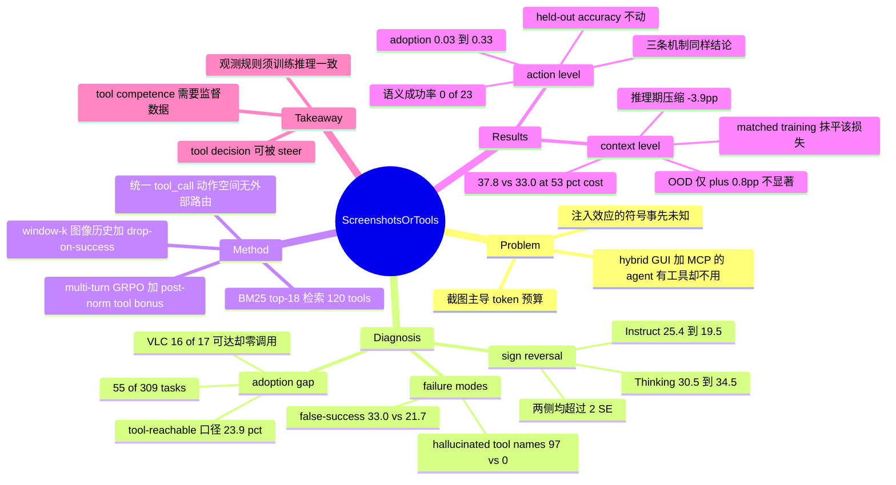

## Summary

在同一套 GUI-MCP harness 下把 Qwen3-VL-8B 的 Thinking 与 Instruct 两个 checkpoint 放到 OSWorld-MCP 的 309 个任务上对比，发现同样的 MCP 工具让 reasoning 模型涨 +4.0pp、让 non-reasoning 模型跌 −5.9pp——工具注入的**符号**由模型的 tool-decision 行为决定，而不由工具本身决定。即便受益的那一侧也只在 55/309 个任务上调用过工具，占 tool-reachable 任务的 23.9%，作者把这个缺口命名为 adoption gap。两个 multi-turn RL probe 进一步把问题拆开：dense tool bonus 能把 adoption 拉高一个数量级却完全不涨精度（瓶颈在 tool-call semantics），而让训练与推理共用同一条 observation 规则，则能把"丢掉工具成功后那张截图"的压缩折扣变成免费的半成本部署点。

## Problem & Motivation

Computer-use agent 有两条动作路径：驱动 GUI（截图 + 坐标点击）通用但昂贵且脆弱——每帧吃掉约 2K vision token，视觉历史随轮次膨胀，坐标在界面变化后失效；调用 text-level 工具（MCP server、CLI、agent skill）便宜且精确，但只覆盖部分应用，且自身不提供视觉确认。

Hybrid agent 把两条路都暴露出来。领域的惯常问题是"工具集够不够好、注入 harness 够不够好"，本文问了一个更靠前的问题：**当一个有用的工具就在手边时，模型会不会决定去用它？** 这个问题的现实意义很直接——OSWorld-MCP 已经报告过即使最强模型的 tool invocation rate 也只有 36.3%，而并发工作 ToolCUA 则报告朴素的 MCP 注入**会伤害** GUI agent。两个观察拼在一起，注入的净效应符号是未知的。

第二层动机来自成本。截图主导 token 预算，所以"每一帧保留还是丢弃"既是行为决策也是经济决策，直接定价一个部署中的 agent。作者据此把同一个问题"screenshots or tools?"提到两个层级：action level（这一步点像素还是调工具）与 context level（工具调成功之后，下一张截图还留不留）。

## Method

**受控对比的设置。** 同一个 8B backbone 的两个 checkpoint——Qwen3-VL-8B-Thinking（有显式 reasoning trace）与 Qwen3-VL-8B-Instruct（无）——除 base model 外全部固定：harness、retriever、prompt template、tool set 一致。benchmark 是 OSWorld-MCP 的 `test_all_no_internet` split（309 任务），MCP 存量为 9 个应用命名空间下的 120 个工具，经 BM25 top-18 检索注入，每步一次调用并回传结构化错误。检索按当前活跃应用重新 keying，所以多应用任务看到的工具集会随应用切换而变。全部评测用 greedy decoding、`max_steps=50`、重复 5 次，显著性门槛设为 2 SE。

**统一动作空间。** GUI 原语与 MCP 工具走同一个调用面：每步模型只输出一个 `<tool_call>`，要么是 `computer_use`（11 个原语：click / double-click / drag / scroll / key / type / wait / terminate 等），要么是某个被检索出的 MCP 工具，两者出现在同一个 `<tools>` 块里。**没有外部 controller 做路由**——选择哪条路径必须发生在同一个 action head 内部。这个设计是全文成立的前提：它把"路由决策"变成模型自己的行为，而不是系统的配置。

**两个 context 旋钮。** 文本动作轨迹全量保留，而像素走深度为 k 的滑动窗口（默认 k=4），于是旧截图会掉出窗口而其语义摘要与工具返回值留下。在此之上加第二个旋钮 drop-on-success：若上一步是执行成功的 MCP 调用，就把本步截图换成一个短文本占位符。关键限定是 `succ_mcp` 只是**执行级**成功（调用被解析、被派发、无错返回），语义成功是另一回事——这个区分在后面反噬了 drop rule。

**Multi-turn GRPO probe。** 每个任务在 96 个并行环境里以 temperature 1.0 采 G=8 条轨迹，回报为 ±1 结果项加上长度与步数上限两个 tie-breaker，组内 z-score 后按 1/T 均匀广播到每一步（Dr.GRPO 式长度去偏）。训练集是从 172 任务池里筛出的 74 个 gradient band 任务（经验通过率落在 0.1 到 0.9 之间，band 外的组内方差为零、不贡献梯度），chrome 与 `multi_apps` 共 89 个任务完全不训练，合计 235 个任务从未被训练。

**关键的工程细节：dense bonus 必须放在归一化之后。** 工具奖励 b_t 若折进轨迹回报 R(τ)，会被轨迹平均、z-scoring 与 1/T 广播稀释到约 1e-4，作者实测是死信号；放在 group normalization 之后（`λ_mcp`=0.1）才比主信号响——因为 A_t 中来自结果项的部分归一化后量级只有约 0.07。bonus 只对"执行成功、非只读、且该 (tool, arguments) 键在本轨迹内首次出现"的调用触发，且不与任务成败挂钩，以此堵住重复调用与无副作用调用的刷分路径。

## Key Results

**1. 符号反转（Table 2, all-309 行）。** 其他一切固定，MCP 注入把 reasoning 模型从 30.5% 抬到 34.5%（+4.0pp），把 non-reasoning 模型从 25.4% 压到 19.5%（−5.9pp），两个 delta 都超过 2 SE。最好的单次 Thinking run 达到 37.9%，但全文报的是 5 次均值。

**2. 差异出在工具行为，不出在能力（Table 3）。** Instruct 侧 hallucinated tool name 有 97 次（集中在 2 个任务）而 Thinking 侧为 0；false-success rate 是 33.0%（102/309）对 21.7%（67/309）。作者自己指出，那 97 次幻觉集中在两个任务里、修掉也几乎不动总分，所以是症状不是病因；真正的读法是缺少显式 deliberation trace 时模型**从不迈出"该不该用工具"这一步**。作者明确把这条写成 association 而非 mechanism，因为两个 checkpoint 的差异不止 reasoning trace 一项。

**3. Adoption gap（Table 3 供给块）。** 309 个任务里 230 个 tool-reachable、79 个纯视觉；Thinking 的任务级 adoption 是 17.8%（55/309），落到 reachable 分母上是 23.9%；Instruct 是 10.4%（32/309）/ 13.9%。步级口径（MCP 步 / 总步）更低：2.8% 对 2.0%。最极端的是 VLC——暴露 12 个原生工具、16/17 任务 tool-reachable，两个模型**一次都没调过**。

值得注意的是 adoption 高也不等于收益高：writer 上有一半任务调了工具，但调了工具的任务成功率 42%，没调的 82%（Appendix E），作者归因于难度自选择与参数写错的混合。

**4. Action-level probe：行为可 steer，能力不可（§5.2）。** dense bonus 在 24 任务子集上 23 个训练步内把 spreadsheet adoption 从 0.03 拉到 0.33，并且迁移进 greedy decoding（0.02 → 0.29），步级使用率涨 4.7 倍。但 48 个 held-out 任务上零次持续的 fail→pass 翻转，7 个 held-out spreadsheet 工具任务精度全程贴在 base 水平。诊断很干脆：调用的 API 成功率有 98–100%，但参数密集型工具的**语义**成功率是零——regex find-and-replace 0/23，格式转换 0/16，server 对零效果调用照样返回 `success:true`。三条互相独立的机制（RL bonus、positive-advantage cloning、推理时注入工具文档）都大幅抬高 adoption，都不动精度。

**5. Context-level：压缩本身不贵，train/inference 失配才贵（§4.2、§5.3）。** 只在推理时套用 window-2 + drop 代价是 −3.9pp（±1.0），但仅 3/309 任务硬翻车，损失集中在预先登记的 13 任务退化子集 D13 上，指向 mis-adaptation 而非能力缺失。让 rollout、评测与部署共用同一条 observation 规则重训之后，step-40 压缩 checkpoint 在全 309 任务上达到 37.8%，对照未压缩基线 33.0%（+4.8pp），输入成本只有 53%、峰值上下文降 37%；D13 的 rich–lean gap 在 step 30 收敛到 0 并在噪声内保持（3.8–5.1pp）。token 侧：累计输入从 337.1K 降到 219.5K，p95 峰值从 11544 降到 7243。

**这一节最该记住的是作者自己给出的减法。** 235 个非训练任务上只有 +0.8pp 且不显著；+4.8pp 里约 4.1pp 来自那 74 个训练任务（55.8% → 72.9%），所以全套数字被作者自己判定为 in-distribution。预先登记的 DiD 判据要求压缩侧增益超出 rich 侧 15pp，实际 step 30 为 +12.8pp、其后 +7.7 到 +9.0pp，**没有任何一个 checkpoint 达标**，作者记为 failed 而不是改阈值重述。匹配的 rich-observation 对照在同一 step-30 上训练带增益近乎两倍（+20.5pp 对 +11.5pp），说明 in-distribution 的上涨是优化 recipe 的性质而非一致性训练的功劳——压缩若有影响，反而是训练期的一道障碍。rich 对照能到 41.0%（step 40），但每任务输出 42.6K token 对压缩侧的 10.7K，总成本约 1.6 倍，两者处在成本-精度前沿上不可直接比较的点。

因此这一节可以被带走的、经得起推敲的结论是"**等精度、半成本**"，而不是"压缩顺带涨点"。

## Evidence Ledger

| Claim ID | Claim | Type | Source locator | Evidence excerpt | Status |
|:--|:--|:--|:--|:--|:--|
| C1 | Thinking 全 309 任务 30.5% (GUI only) → 34.5% (GUI+MCP, window-4)，即 +4.0pp | number | Table 2, all(309) 行 / §3.1 | "the same MCP tools improve a reasoning model by +4.0pp" | source-verified |
| C2 | Instruct 全 309 任务 25.4% → 19.5%，即 −5.9pp | number | Table 2, all(309) 行 / §3.1 | "degrade a non-reasoning model by −5.9pp" | source-verified |
| C3 | 两个 delta 均超过 2 SE；全部评测 5 次重复、greedy decoding、`max_steps=50` | benchmark-setting | §3 Setup | "All evaluations use greedy decoding, max_steps=50, and five repeated runs" | source-verified |
| C4 | Benchmark 为 OSWorld-MCP 的 `test_all_no_internet` split，309 个任务 | benchmark-setting | §3 Setup | "benchmark is test_all_no_internet (309 tasks) from OSWorld-MCP" | source-verified |
| C5 | MCP 存量 120 个工具 / 9 个应用命名空间，BM25 top-18 检索，每步一次调用 | benchmark-setting | §3 Setup | "120 tools in 9 application namespaces, exposed through BM25 top-18 retrieval with one call per step" | source-verified |
| C6 | Thinking 在 55/309 任务上调用工具（17.8%），占 tool-reachable 的 23.9% | number | Table 3, Adoption 行 | "Adoption, task-level 17.8% (55/309)"; "Adoption, reachable (230) 23.9%" | source-verified |
| C7 | 309 任务中 230 个 tool-reachable，79 个纯视觉 | number | Table 3, Supply 块 | "Tool-reachable (supply) 230/309 (79 vision-only)" | source-verified |
| C8 | Instruct adoption 32/309（10.4%），reachable 口径 13.9% | number | Table 3, Adoption 行 | "Adoption, task-level 10.4% (32/309)"; "reachable 13.9%" | source-verified |
| C9 | 步级 TIR（MCP 步 / 总步）Thinking 2.8%、Instruct 2.0% | number | Table 3, TIR 行 | "TIRreal (MCP/steps) 2.8% 2.0%" | source-verified |
| C10 | False-success rate：Thinking 21.7% (67/309)，Instruct 33.0% (102/309) | number | Table 3, Failure modes | "False-success rate 21.7% (67/309) 33.0% (102/309)" | source-verified |
| C11 | Hallucinated tool name：Thinking 0，Instruct 97，且集中在 2 个任务 | number | Table 3 + §3.1 | "Hallucinated tool names 0 97 (2 tasks)"; "hallucinations concentrate in two tasks" | source-verified |
| C12 | VLC 暴露 12 个原生工具、16/17 任务 tool-reachable，两模型均从未调用 | number | Appendix E | "VLC exposes 12 native tools with 16/17 tasks tool-reachable, yet neither model ever calls one" | source-verified |
| C13 | `λ_mcp`=0.1 的 post-norm bonus 在 24 任务子集上 23 步内把 spreadsheet adoption 0.03→0.33，greedy 侧 0.02→0.29 | number | §5.2 + Table 6 | "spreadsheet adoption rises from 0.03 to 0.33 within 23 training steps... transfers to greedy decoding (0.02→0.29)" | source-verified |
| C14 | 48 个 held-out 任务零次持续 fail→pass 翻转；7 个 held-out spreadsheet 工具任务精度保持在 base | number | §5.2 | "zero sustained fail→pass flips... seven held-out spreadsheet tool tasks accuracy stays at the base level" | source-verified |
| C15 | API 执行成功率 98–100%，但参数密集工具语义成功率为零：regex find-replace 0/23、格式转换 0/16 | number | §5.2 Diagnosis | "98–100% API success... 0/23 for regex find-and-replace and 0/16 for format conversion" | source-verified |
| C16 | 仅在推理期启用 window-2 + drop 的代价是 −3.9pp（±1.0） | number | §4.2 | "costs −3.9pp (±1.0)" | source-verified |
| C17 | 累计输入 337.1K → 219.5K，p95 峰值 11544 → 7243 | number | Appendix D, Table 5 | window-4: 337.1K / 11544; window-2+drop: 219.5K / 7243 | source-verified |
| C18 | Step-40 压缩 checkpoint 全套 37.8% 对未压缩基线 33.0%（+4.8pp），输入成本 53%、峰值上下文 −37% | number | §5.3 Deployment headline | "reaches 37.8% against 33.0% for the uncompressed base operating point... 53% of the input cost, with −37% peak context" | source-verified |
| C19 | 235 个非训练任务上仅 +0.8pp，标注为不显著 | number | §5.3 Deployment headline | "+0.8pp, n.s., on the 235 non-training tasks" | source-verified |
| C20 | +4.8pp 中约 4.1pp 来自 74 个训练任务（55.8%→72.9%），作者据此把全套数字判为 in-distribution | causal-mechanism | §5.3 Deployment headline | "~4.1pp of that margin comes from the 74 training tasks (55.8%→72.9%), so we read the full-suite number as in-distribution" | source-verified |
| C21 | D13 的 rich–lean gap 在 step 30 收敛到 0 并在噪声内保持（3.8–5.1pp） | number | §5.3 Degraded subset D13 | "rich–lean gap collapses to 0 at step 30 and stays closed within noise (3.8–5.1pp)" | source-verified |
| C22 | 预登记 DiD 判据要求 ≥15pp，无任何 checkpoint 达标（step 30 为 +12.8pp，其后 +7.7 到 +9.0pp），作者记为 failed | benchmark-setting | §5.3 Degraded subset D13 | "the +15pp bar is met at no checkpoint... we record it as failed" | source-verified |
| C23 | Rich-observation 对照在同一 step-30 训练带增益近乎两倍（+20.5pp 对 +11.5pp），据此归因为 recipe 效应而非一致性训练 | causal-mechanism | §5.3 Scope and attribution | "gains nearly twice as much on the training band (+20.5pp vs. +11.5pp)... a property of the optimization recipe and not of consistency training" | source-verified |
| C24 | Rich 对照 step-40 达 41.0%，但每任务输出 42.6K token 对压缩侧 10.7K，总成本约 1.6× | number | §5.3 Scope and attribution | "reaches 41.0% at step 40, but emits 42.6K output tokens per task against the compressed run's 10.7K" | source-verified |
| C25 | 两个对比 checkpoint 同为 8B backbone（Qwen3-VL-8B-Thinking / -Instruct），harness、retriever、prompt、tool set 固定 | benchmark-setting | §3 Setup | "two checkpoints of the same 8B backbone... Everything else is held fixed: harness, retriever, prompt template, and tool set" | source-verified |
| C26 | Multi-turn GRPO，G=8、temperature 1.0、96 并行环境，训练集为 74 个通过率落在 0.1–0.9 的 gradient band 任务，235 任务从未训练 | benchmark-setting | §5.1 | "G=8 trajectories at temperature 1.0 across 96 parallel environments"; "leaves 235 tasks never trained on" | source-verified |
| C27 | Writer 上调用工具的任务成功率 42%，未调用的 82% | number | Appendix E | "tasks where a tool is invoked succeed 42% of the time versus 82% without a call" | source-verified |
| C28 | `λ_mcp`=0 的 outcome-only RL 在整个 sweep 中均不移动 held-out 与 OOD 精度 | causal-mechanism | §5.1 Outcome-only RL | "With λmcp=0, no swept configuration moves held-out or out-of-distribution accuracy" | source-verified |
| C29 | 论文引用 OSWorld-MCP 报告最强模型工具调用率仅 36.3% | number | §2 Related Work | "reports that even strong models invoke tools on only 36.3% of tasks" | source-verified |
| C30 | 论文引用并发工作 ToolCUA 在 OSWorld-MCP 上达 46.85%，并报告朴素 MCP 注入会伤害 GUI agent | comparison | §2 GUI-tool hybrid agents | "heavy RFT/RL (46.85% on OSWorld-MCP) and reports that naive MCP injection can hurt a GUI agent" | source-verified |
| C31 | 最好的单次 reasoning-model run 达 37.9%，但全文报 5 次均值 | number | §3.1 Overall result | "The best single Thinking run reached 37.9%; we report five-run means throughout" | source-verified |
| C32 | 训练用 1 节点 8×A100 80GB，环境为 96 个并行 Docker VM | benchmark-setting | Appendix F, Hardware | "1 node with 8×A100 (80 GB) GPUs... Environments run in 96 parallel Docker VMs" | source-verified |
| C33 | 论文未给出任何公开代码 / 仓库释出地址 | license-code | 全文检索 | 全文无 github / code available / repository 释出声明 | source-verified |
| C34 | 每步输出长度 Thinking 约 1500 字符、Instruct 约 217 字符，对应 6–7× token 差 | number | Appendix C | "~1500 characters for Thinking... versus ~217 for Instruct, matching the 6–7× token gap" | source-verified |
| C35 | 三条独立机制（outcome-independent bonus、positive-advantage cloning、推理期工具文档注入）都大幅抬高 adoption，都不改变精度 | benchmark-setting | §5.2 Diagnosis | "all raise adoption substantially... and none changes accuracy" | source-verified |
| C36 | 作者机构为 UESTC / 小红书 AI Platform / 人大高瓴 / 北大信息工程学院，投稿日 2026-08-04 | number | PDF p.1 题头 / arXiv abs | "1University of Electronic Science and Technology of China; 2AI Platform, Xiaohongshu Inc." | source-verified |

## Strengths & Weaknesses

**问题选得对。** 把"工具集好不好"换成"模型会不会决定用工具"，并且用一个可测量的量（adoption gap = 调用任务数 / tool-reachable 任务数）把它钉住，这是 problem formulation 层面的贡献而不是方法层面的。领域里"给 agent 挂上 MCP 就会变强"是一条被默认接受的 convention，本文给了它一个受控的反例。

**控制变量的干净程度在 CUA 类论文里少见。** 同一 backbone 两个 checkpoint、harness / retriever / prompt / toolset 全部固定、5 次重复加 2 SE 门槛，Appendix A 还单独论证 harness 正确性（per-window `clip_frac`=0、ratio=1.0 证明 on-policy；checkpoint 与 base 除权重外字节一致以排除配置漂移）。这类论文最常见的失败是把 format 错误当成能力差异，作者显式把这个威胁列出来并逐条排除。

**诚实度高，而且是在对自己不利的地方诚实。** 预登记的 DiD 判据没达标就写 failed，并且说明原阈值是被单次 anchor 高估的基线校准出来的、拒绝按修订阈值重述；+4.8pp 里 4.1pp 来自训练集也自己拆了出来；rich-observation 对照反过来学得更快、压缩其实是训练期的负担，同样照写。这在当下的 agent RL 论文里是稀缺品质。

**最有价值的单条结论是 adoption 与 competence 的解耦。** 三条机制上互不相干的干预（RL 的 outcome-independent bonus、positive-advantage cloning、推理期文档注入）全都能抬 adoption、全都不动精度，再叠加 0/23 与 0/16 的语义成功率，把"这是数据问题不是 reward-design 问题"这一判断顶得相当稳。对任何准备在 GUI-tool 路由上做 reward shaping 的人，这直接省掉一整轮实验。

---

**最锋利的问题：zero-adoption 域的方向性没有被处理干净。** Table 2 里 gimp / thunderbird / vlc / chrome 四个域的 adoption 都是 0%，但 Thinking 侧四个域在加 MCP 后**全部上升**（vlc 24.7→40.0 是全表最大单域跳变），Instruct 侧四个域**全部下降**（gimp 57.7→34.6）。作者把这一块从 per-domain 计数中剔除了，理由正是"没有工具调用，变化只反映 prompt 扰动与 run 间方差"——但这一块仍然留在 all-309 行里，也就是留在 ±4.0 / −5.9 这两个 headline 里。如果零工具调用的域能被 prompt 扰动整体推向与 headline 一致的方向，那么"符号由 tool-decision 行为决定"这条主张就被部分架空：至少一部分符号来自"system prompt 里多了一个 tools 块"本身对两个模型的相反扰动。论文没有给出剔除 zero-adoption 域后的 all 行。〔本条为笔记作者读 Table 2 的推断，未进入本轮独立核查集〕

**两个不同的基线锚被并置。** §5.3 的"37.8% 对 33.0%"用的是同期 greedy×3 anchor，而 Table 2 里同一个 window-4 operating point 的 5 次均值是 34.5%。两个数字在原文各自有据（C1 与 C18 均已核查一致），但如果读者拿 37.8 去比 34.5，得到的是 +3.3pp 而非 +4.8pp。论文没有在任何一处并排提示这两个基线口径不同，摘要与 §5.3 都只带 33.0。

**真正外推得出去的结论比 headline 弱一档。** 235 个 OOD 任务上是 +0.8pp 且不显著，所以可辩护的表述只有"等精度、半成本"。作者在正文里说清楚了，但摘要仍以"37.8% against 33.0%"领衔——这是本文唯一一处口径偏松的地方。

**机制归因只到 association，作者自己也这么说。** 两个 checkpoint 的差异不止 reasoning trace 一项，需要 within-model 的 thinking toggle 才能定论；单 backbone 单尺度（8B）也让"reasoning 能力决定注入符号"无法外推到更大模型。这是一个诚实标注的边界，不是隐藏的缺陷，但它确实意味着标题里的结论目前 n=1。

**drop rule "nearly free" 的措辞略宽松。** Table 2 上 window-4 → window-4+drop 是 34.5 → 32.3（−2.2pp），而 Table 2 未逐格给出 SE；§4.2 给出的配对分析 SE 约 ±1.0。若量级相当，−2.2pp 未必稳落在作者自设的 2 SE 门槛内，"nearly free"这个判断依赖的是一个没有被展示的方差估计。〔笔记作者推断〕

**无代码释出。** harness、retriever、74 任务的 gradient band 清单都不可复现。对一篇核心贡献恰恰是"同一 harness 下的受控对比"的论文，这削弱了它作为后续工作基线的可复用性——别人无法在"同一 harness"下接着做。

**对领域的影响。** 短期最实用的是 context 侧那条便宜的工程结论：train 与 inference 的 observation rule 必须一致，不一致的代价（−3.9pp）看起来像能力损失，其实是分布偏移，重训即可抹平。长期更重要的是它把 hybrid agent 的研究重心从 reward shaping 推向"验证过的 tool trajectory 监督数据"——如果 0/23 这个语义成功率在更大模型上依然成立，那么整个 MCP-for-CUA 方向的瓶颈就不在 agent 侧而在工具调用的正确性监督上。

## Mind Map

## Notes

- **与 [[2510-OSWorldMCP]] 的关系（去重确认）。** 本文不是那个 benchmark 的论文，而是它的使用者：OSWorld-MCP 由 Jia 等人提出（arXiv 2510.24563, ICLR 2026, 361 任务 / 158 工具 / 7 类应用），本文取其 `test_all_no_internet` 的 309 任务子集，工具口径记为 120 tools / 9 namespaces——两边的任务数与工具数口径都不同，引用这两篇的数字时不能混用。更重要的继承关系是问题的传递：OSWorld-MCP 的核心发现是"最强模型 TIR 仅 36.3%"，本文把这个数字当作起点去追问 why，并把它细化成 supply（tool-reachable 230/309）与 decision（reachable 上仍只有 23.9%）两个可分离的损失。
- **环境侧的并列工作。** [[2506-MCPWorld]] 同样做 API / GUI / hybrid 三路评测；[[2508-ComputerRL]] 是 API-GUI 混合动作空间上的大规模在线 RL，本文 Table 1 把它归类为"tool decision 隐式、context 不管"。本文相对它们的差异不在规模而在把 tool decision 单独当变量测。
- **context 压缩这条线在库内已经不薄，但设定不同。** [[2510-ContextFolding]]、[[2512-FoldAct]]、[[2510-MemAct]] 都在纯文本 / search agent 设定下学一个 context policy。本文的两点差异值得记：一是 dual-modality——同一份旧信息既可以是 pixel 也可以是 tool text，压缩变成跨模态的取舍而非文本摘要；二是**刻意把规则固定住不学**，目的是先把 train/inference mismatch 这个混杂因素分离出来，再谈学习。这是库内第一篇把"observation rule 的训练-推理一致性"本身当作实验变量的工作，结论（失配的代价看起来像能力损失、实则可被重训抹平）对上述三篇都适用，值得回头验证它们的压缩收益里有多少是同一个 artifact。
- **与 [[2608-QwenCUA]] 记下的 GUI↔CLI routing 问题是同一类，但本文给了更强的负面证据。** QwenCUA 那边观察到加 Bash 让轨迹缩短约 23% 但 perfect-task rate 下降，问题被表述为"何时切到 CLI"这一 routing 决策没学好。本文把这个诊断往下推了一层：routing **可以**被 RL 轻易 steer（adoption 涨一个数量级且迁移到 greedy），涨了却不涨精度，因为底层的 tool call 本身参数就写不对。也就是说 routing 不是瓶颈，tool-call semantics 才是。这两条放在一起，说明"GUI↔tool routing 的 RL 目标很干净"这个判断需要修正——奖励信号确实干净，但它够不到真正的瓶颈。
- **一个论文提到却没有追下去的线索，可能是最值得做的。** `succ_mcp` 只是执行级成功，server 在零效果调用上照样返回 `success:true`，这同时造成两个后果：喂出 false-success prior（Instruct 侧 33.0% 的假成功率），以及 drop-on-success 恰好把该次失败的**唯一视觉证据**丢掉。两个机制叠加会让 agent 系统性地看不见自己的失败。把 `succ_mcp` 从执行级换成带语义校验的判定（哪怕只是"这次调用是否改变了目标状态"这种廉价 diff），有可能同时修好 adoption 侧的错误先验与 context 侧的 drop 安全性——论文明确指出了这个 gap（§4.2 Scope）但没有实现。这比再加一个 reward 项更接近问题本身。
- 本文对 verified tool trajectory 的监督注入（"from stronger teachers"）只在 Limitations 里提了一句作为 next step，没有实验。如果库内后续要跟进 hybrid GUI-MCP 方向，这是被本文的负面结果直接指定的入口。
- 无代码释出（全文检索无 repository 声明），`code` 字段留空；harness 与 74 任务 gradient band 清单均不可复现。
