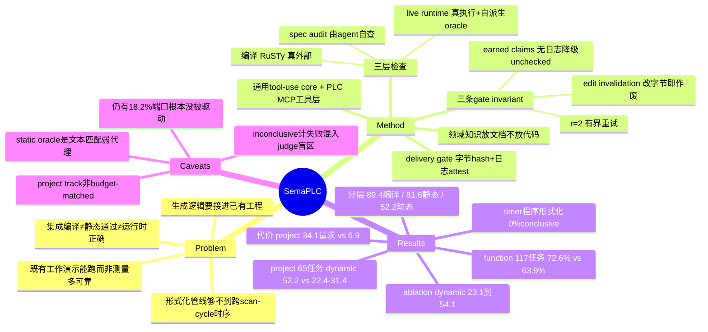

## Summary

SemaPLC 是一个 PLC 代码生成 agent harness，作者明说它的新意不在工具集而在治理工具的 completion discipline——agent 不得自判完成，必须有 spec audit、编译、live runtime 三类**带日志**的检查结果才能交付，任何编辑作废此前全部 verdict，无日志的自称 pass 一律降级为 unchecked。在 117 个 independent-POU 任务上七个 backbone 全部取得最高 strict verified pass rate（均值 72.6%，高于最强 baseline Agents4PLC 的 63.9%）；在 65 个 project-context 任务上 dynamic behavior 均值 52.2，对 baseline 的 22.4–31.4。论文最有迁移价值的发现不是这两个数，而是分层记分揭示的量纲问题：static 分数把三个 baseline 压在 4.0 点之内，runtime 分数把它们拉开到 22.4–31.4 并重新排序。

## Problem & Motivation

工业现场的控制逻辑几乎从不是孤立 POU。论文把部署要求拆成两条：一是 **project grounding**，生成的逻辑要接进已有工程，复用它的模块与 function block，尊重既有变量、类型、接口，遵守 build/reset/初始化与安全约定；二是 **correct runtime behavior**，即便集成后能编译、静态检查也过，程序仍可能把 timer 配错、走错状态转移、漏掉 reset、破坏 interlock，或者用错误时序驱动输出。作者据此主张：集成编译、静态/形式化判定、动态运行时行为是同一个程序的三个互不蕴含的性质。

作者对既有工作的定性很克制也很准：先前系统执行生成的代码是为了**演示它能跑**，不是为了**测量它跑得多可靠**（"Demonstrated, not measured"）。LLM4PLC、AutoPLC、Agents4PLC 都有运行时证据，但基准单元仍以独立 POU 为主，工程集成与运行时行为的报告多停留在有限测试或若干案例。这个 gap 是真实的，且它同时是方法 gap 和测量 gap——所以论文给了一个 harness 加一套配套的分层度量。

值得单独记一笔的动机来自 Table 5：论文自己测了评测侧形式化管线（PLCverif + nuXmv）的覆盖边界，发现带 TON timer 的程序 174 条 property **无一**拿到 conclusive verdict。形式化验证够不着的恰好是跨 scan cycle 的有状态时序，而这正是 runtime validation 能直接激励的部分。用评测工具自身的失效来论证需要另一层证据，这个论证路径比大多数"我们也加了运行时"的说法扎实。

## Method

harness 跑在一个通用 event-driven tool-use core 上（核心不含任何 PLC 逻辑，只走标准 chat-completion 接口），其上组织五个部件：agent core、project/task grounding、PLC skill library、verification processes、verification gate。所有部件通过一个共享的 **PLC MCP tool layer** 作用于环境——同一个 tool server 同时暴露 MCP stdio 接口和等价 CLI，工具覆盖语法检查、编译、部署、运行时状态与日志、活变量读取与强制、trace 采样、脚本化行为检查（Table S1 列 17 个 MCP 工具，Table S2 列 12 个 CLI 入口）。

**领域知识放在文档而非代码里**：一个 rules 文件规定验证顺序、工具用法与 scan-cycle 语义；一个人工整理的 wiki 记录 function-block 签名、控制模式与编译器陷阱；程序化 skill 脚本化多步检查。三个 skill 一层验证：`spec-review`（交付前的需求-逻辑 checklist）、`fix-compile-error`（只修最早那条诊断，至多两轮，然后报 stuck）、`benchmark-verify`（构建可注入测试副本、部署、驱动自派生场景、断言已发布输出）。

### 三个 gate invariant（Algorithm 1 + §4.5）

- **Bounded retries**：每个 check 至多 r=2 轮修复。
- **Edit invalidation**：任何修改作废全部 verdict，所有 check 重跑——verdict 绑定在**确切字节**上。
- **Earned claims**：每个结果是一个 machine-readable sentinel，与 tool-call log 交叉校验；无日志的声称降级为 unchecked。

Appendix D 的 delivery gate 是这两条 invariant 的具体形态，也是全文最硬的一处工程：只有当 (1) 交付文件不含 located address literal（注入只属于测试副本）、(2) 交付字节与最后一次成功编译的输入内容 **hash 相符**、(3) session log 带有部署与强制输入证据，任务才被接纳。

### 这条判定链里，谁在判、agent 能不能影响

这是本文最该拆清的地方。三层"external check"的外部性强度并不一致：

| 检查层 | 执行者 | oracle（期望值）来自哪 | agent 能否影响判定 | 是否参与最终评分 |
|:--|:--|:--|:--|:--|
| spec audit | **agent 自己**（`spec-review` 是 Markdown checklist，由同一个 model 逐条走） | agent 从自然语言 requirement 逐条推导 | 能——判定本身就是 agent 的输出 | 否（Table S4："Agent's own audit feedback / Yes / No"） |
| compilation | RuSTy 编译器（外部程序） | 编译器语义 | 不能，只能改代码 | **是**——integrated compilation C 用的是同一个 RuSTy build |
| live runtime | PLC tool server 驱动真实 runtime（build / deploy / force / trace） | **agent 自己从 task spec 派生**的场景与期望值 | 执行结果无法伪造；期望值由 agent 定 | 否——评分场景与 golden trace 另从 hidden reference 派生，从不暴露 |
| delivery gate | harness 本身（非 model） | 字节 hash + session log | 不能 | 否，是交付前置条件 |

所以更准确的描述是 **execution-grounded, self-oracled**：执行是真外部的，判定标准在 loop 内基本仍是 agent 自己的；真正无条件的外部约束是 delivery gate 那层字节与日志的 attestation。论文对此并不遮掩，§4.4 和 Appendix E 都写明"agent 注入的场景由它自己从 task specification 派生"，两套场景只能通过共享的 requirement 对齐，不通过任何评分工件——但正文用 "external verification results" 统称三层，措辞上抹平了这个梯度。

### 评测的两条 track

**Function track（117 任务）**：来自 Agents4PLC benchmark。主指标 VerifiedPass = 1[V_f ≥ 0.80]，由一个**任何方法都不得查询**的 held-out judge 打分——用 RuSTy 编译，用 PLCverif（nuXmv 后端）model-check 从 requirement 派生的 property。既非 satisfied 也非 violated 的 property（不支持的构造、翻译失败、超时）算 inconclusive 并**计为失败**，生成失败留在分母。注意：**live runtime 完全不在这条判定链里**，function track 的判定 = 编译 + 形式化 model check。

**Project-context track（65 任务）**：来自 Spec2Control 的十个工业装置，控制叙述转成 IEC 61131-3 ST 工程。三个独立指标同用 65 的分母：integrated compilation C（RuSTy 二值 build）；static behavior S（在程序文本上确定性检查，由 substring 有无、必需调用、归一化数值常量、结构引用、any-of 集合构成）；dynamic behavior D（golden-trace differential，候选与参考在**同构 harness** 上跑至多六个场景，每场景记核心输出端口 trace 与参考一致的比例，D 取场景均值；任一侧编译、部署、超时或缺 trace 失败该场景记 0）。

## Key Results

**Function track（Table 1，7 个 backbone：MiniMax-M2.7/M3、Qwen3.5-Plus、DeepSeek-V4-Flash/Pro、GLM-5.2、GPT-5.5）。** SemaPLC 均值 **72.6%**，Agents4PLC 63.9%、AutoPLC 62.4%、LLM4PLC 30.2%、bare 55.3%。七个模型全部第一，包括最强的 GPT-5.5（82.1% vs 79.5%）。SemaPLC 最差的模型（67.5%）高过每个 baseline 的均值；跨模型跨度 14.6 点，baseline 是 25–31 点。

**Harness 本身的贡献（bare → full）。** 每个模型提升 8.5–33.3 点，最弱的模型受益最大（MiniMax-M2.7 +29.9，DeepSeek-V4-Flash +33.3）；跨模型跨度从 37.6 收到 14.6；bare 的编译通过率均值从 85.5% 升到 99.2%；均值 +17.3。作者诚实地指出 bare-vs-full 把陈述性知识（skill 文档）和验证循环混在一起了，所以只把增益归给"harness 整体"，把循环的分解交给 layer ablation。

**Project track（Table 2）。** integrated compilation 89.4（baseline 58.7–81.5）、static behavior 81.6（71.7–75.7，七个模型中五个第一）、dynamic behavior **52.2**（LLM4PLC 22.4 / AutoPLC 31.4 / Agents4PLC 30.3）。dynamic 上七个模型全部第一且从不低于 30，而固定管线在其最差模型上掉到个位数（LLM4PLC 3.0、AutoPLC 4.0、Agents4PLC 4.5）。

**Layer ablation（Table 3，DeepSeek-V4-Flash，65 任务，累加式）。** dynamic 单调上升 23.1 → 30.3（+Spec）→ 43.7（+Compile）→ 54.1（+Runtime）；static 只从 71.5 动到 78.0。编译层给出最大的单层 dynamic 增益（+13.4，因为编不过的程序运行时记 0），runtime 层次之（+10.4）。代价同步爬升：每任务 34k → 129k token、8.9 → 47.8 次模型请求。

**结果分布（Table 4，3,590 个 scenario–port 值检查）。** 结构性失败（未构建 + 端口缺失）从 74.7% 降到 21.5%，完整 harness 下只剩 3.3% 未构建。这 53 点的迁移分成两半：新的正确检查（23.1% → 54.1%）和**新的可观测错值**（2.1% → 24.4%）。作者的解释是对的——检查得先跑起来才可能错，而观测到的错值恰恰是 runtime feedback 能修的东西。残余错值集中在 limit-breach 场景（17.3% vs 正常工况 7.1%）。

**形式化覆盖（Table 5，汇总 SemaPLC 运行交付的 1,293 个程序）。** 无 REAL/timer 组 916 程序 / 4,653 property，conclusive 75.7%；含 REAL 组 345 / 1,845，87.0%；**含 TON timer 组 32 程序 / 174 property，conclusive 0.0%**。

**交互成本（Table 6）。** function track：SemaPLC 6.5 请求/任务 vs Agents4PLC 6.3，墙钟 71s vs 454s（Agents4PLC 每轮都调 PLCverif/nuXmv，墙钟被 model checking 主导）。project track：墙钟相当（347 vs 344s）但请求数 **34.1（16.4–60.4）vs 6.9（6.8–7.0）**。作者明说这是架构差异：Agents4PLC 的固定多 agent 工作流限死迭代数，SemaPLC 的开放循环里每次工具调用都是一次模型决策，gate 会一直逼它交互到检查通过。

## Evidence Ledger

| Claim ID | Claim | Type | Source locator | Evidence excerpt | Status |
|:--|:--|:--|:--|:--|:--|
| C1 | 117 个 independent-POU 任务；SemaPLC 七模型全部最高 strict verified pass rate，均值 72.6%，比最强 baseline Agents4PLC（63.9%）高 8.8 点 | number | §6.1 + Table 1 | "attains the highest strict verified pass rate on all seven models ... mean of 72.6% is 8.8 points above the strongest baseline (Agents4PLC, 63.9%)" | source-verified |
| C2 | 65 任务 project track：dynamic 52.2 vs 22.4/31.4/30.3；integrated compilation 89.4 vs 58.7–81.5；static 81.6 vs 71.7–75.7 | number | Table 2（Mean 列）+ §6.2 | "SemaPLC builds 89.4% of programs on average against 58.7 to 81.5 ... highest mean (81.6 against 71.7 to 75.7)" | source-verified |
| C3 | 主指标 VerifiedPass = 1[V_f ≥ 0.80]，由任何方法不得查询的 held-out judge（RuSTy 编译 + PLCverif/nuXmv）判定；inconclusive 计为失败；生成失败留在分母 | benchmark-setting | §3 (Eq. 1) + §5.4 | "A property whose model check returns neither satisfied nor violated ... is inconclusive and counted as failure, and generation failures stay in the denominator" | source-verified |
| C4 | spec check 由 agent 自己以 checklist skill 执行；agent 迭代所依据的 runtime 场景由它自己从 task spec 派生，评分场景与 golden trace 另从 hidden reference 派生且从不暴露 | causal-mechanism | §4.3、§4.4、Table S3、Table S4 | "the agent derives the scenarios it injects from the task specification itself; the scoring scenarios and golden traces are derived separately from the hidden reference and never exposed" | source-verified |
| C5 | function track 6.5 vs 6.3 请求/任务；project track 34.1（16.4–60.4）vs 6.9（6.8–7.0）；baseline 各按其**已发表**迭代预算运行 | number | Table 6 + §5.3 | "SemaPLC \| 34.1 (16.4 – 60.4) ... Agents4PLC \| 6.9 (6.8 – 7.0)"；"each run at its published iteration budget" | source-verified |
| C6 | layer ablation（DeepSeek-V4-Flash / 65 任务）dynamic 23.1→30.3→43.7→54.1；token 34k→129k；请求 8.9→47.8；static 仅 71.5→78.0 | number | Table 3 + §6.3 | "from 23.1 with generation alone to 30.3, 43.7, and 54.1, while static behavior moves far less (71.5 to 78.0)" | source-verified |
| C7 | 32 个 TON timer 程序 / 174 property conclusive 0.0%；No REAL/timer 组 916/4653 为 75.7%；With REAL 组 345/1845 为 87.0%；汇总 1,293 个交付程序 | number | Table 5 | "No REAL/timer \| 916 \| 4653 \| 75.7 ... With timer (TON) \| 32 \| 174 \| 0.0" | source-verified |
| C8 | GPT-5.5 上 SemaPLC 仅领先 Agents4PLC 1.8 dynamic 点（65.4 vs 63.6），且 static 落后 baseline（84.1 vs 最高 88.8） | number | §6.2 + Table 2 | "on GPT-5.5, SemaPLC leads Agents4PLC by only 1.8 dynamic points (65.4 vs 63.6) and trails the baselines on static behavior (84.1 vs up to 88.8)" | source-verified |
| C9 | bare→full 每模型 +8.5~33.3 点；跨模型跨度 37.6→14.6；bare 编译率 85.5%→99.2%；均值 +17.3 | number | §6.1 + Table 1 + §7 | "every model improves, by 8.5 to 33.3 points ... spread shrinks from 37.6 points bare to 14.6, and bare compile rates rise from an 85.5% mean to 99.2%" | source-verified |
| C10 | 117 任务源自 Agents4PLC benchmark，其 oracle 经 PLC 工程师审计，43/117 确认有缺陷；发布数据修改 53 个样本（46 修 property，7 仅补任务描述），property 数 629→607 | benchmark-setting | §5.2 + Appendix A | "the audit confirmed defects in 43 of the 117 tasks. The released data modifies 53 samples ... 629 to 607" | source-verified |
| C11 | 65 任务源自 Spec2Control 十个装置；转换后工程含 130 个 body 为空的 function-block 实现；63/65 的静态断言自动从语料运行时测试派生，共 502 条、中位数 7 条 | benchmark-setting | §5.2 + Appendix B | "For 63 of the 65 tasks, assertions are derived automatically from the corpus's per-plant runtime tests ... median of 7 and 502 in total" | source-verified |
| C12 | Table 4 分解 3,590 个 golden-reference scenario–port 检查：结构性失败 74.7%→21.5%；full harness 下 3.3% 未构建、18.2% 端口仍缺失；残余错值 breach 17.3% vs 正常 7.1% | number | Table 4 + §6.3 | "structural failures (not built or missing ports) fall from 74.7% to 21.5% ... leaving only 3.3% of checks unbuilt"；"(17.3% vs 7.1% under normal operation)" | source-verified |
| C13 | 三条 gate invariant：r=2 有界重试、edit invalidation（任何修改作废全部 verdict）、earned claims（sentinel 与 tool log 交叉校验，无日志降级 unchecked）；delivery gate 另要求无 located address literal、字节 hash 匹配最后一次成功编译输入、session log 带部署与强制输入证据 | causal-mechanism | §4.5 + Appendix D | "each check allows at most r=2 repair rounds ... any modification voids all prior verdicts ... an unlogged claim is downgraded to unchecked" | source-verified |
| C14 | 开源于 https://github.com/midea-ai/SemaPLC ；arXiv:2608.18565v1 [cs.SE]，2026-08-19，CC BY 4.0；机构含 Midea AIRC、KUKA、SJTU、ZJU | license-code | Abstract + arXiv metadata + 作者块 | "SemaPLC is open-sourced at https://github.com/midea-ai/SemaPLC"；"arXiv:2608.18565v1 [cs.SE] 19 Aug 2026" | source-verified |
| C15 | D 由候选与参考在同构 harness、live runtime 上跑至多六场景得出，每场景记核心输出端口 trace 一致比例（bool/数值精确匹配），D 为场景均值；任一侧编译/部署/超时/缺 trace 失败记 0；三个指标同用 65 分母不丢任务 | benchmark-setting | §5.4 | "candidate and reference run in identical harnesses on a live runtime under up to six scenarios ... failure on either side scores 0" | source-verified |
| C16 | 论文自述两条局限：dynamic 评分只覆盖来自 hidden reference 的有界场景集，未见工况下的行为未被测量；优势在最强模型上收窄 | benchmark-setting | §7 | "dynamic scoring exercises a bounded scenario set from the hidden reference, so behavior under unseen conditions remains unmeasured" | source-verified |
| C17 | 三个 baseline 的 static 均值互相在 4.0 点内（71.7–75.7），dynamic 却散在 22.4–31.4；作者据此断言 runtime 层能分离甚至重排被 static 压平的方法 | causal-mechanism | §6.3 + Table 2 | "the three baselines sit within 4.0 points of one another (71.7 to 75.7) ... the runtime layer separates, and even reorders" | source-verified |
| C18 | static behavior S 在程序文本上确定性检查、不执行，由 substring 有无、必需调用、归一化数值常量、结构引用、any-of 集合构成 | benchmark-setting | §5.4 | "checked deterministically on the program text without executing it (substring presence or absence, required calls, normalized numeric constants, structural references, and any-of sets)" | source-verified |

## Strengths & Weaknesses

### 值得抄走的部分

**把"外部核验"拆成三个正交维度，是这篇论文对 agent runtime 设计最大的贡献，尽管作者自己没这么表述。** 读完 §4.5 和 Appendix D 可以清楚地看到：(1) **执行外部性**——检查是否由 agent 之外的程序真实执行；(2) **oracle 外部性**——期望值是否来自 agent 之外；(3) **声称可证伪性**——agent 报告的 pass 能否被日志与字节独立推翻。SemaPLC 在维度 1 和 3 上做得很硬，维度 2 在 loop 内基本没有。多数号称"verification-gated"的 agent 系统三个维度一个都不占，只是把 LLM 自评换了个名字。这个三分法可以直接搬去审计任意 agent harness 的完成判据。

**delivery gate 的字节级 attestation 是全文最可迁移的一件工程。** "交付字节必须 hash 匹配最后一次成功编译的输入、session log 必须带部署与强制输入证据"——这正面解决了 agent 声称与交付物漂移的问题。它跟 edit invalidation 是一对：verdict 绑定在确切字节上，改一行就全部重跑。[[2607-LongHorizonTerminalBench]] 记录的 14 个 "false finish"（R≥0.75 就自判完成退出、实际没过 hidden verifier）恰好是这套机制针对的失效模式，而那篇论文只能观测到现象、没给机制。两篇放在一起读价值最大。

**用评测工具自身的覆盖失效来论证需要另一层证据。** Table 5 的 timer 组 0% conclusive 不是顺手做的统计，它是论证链条的一环：形式化管线够不着跨 scan-cycle 的有状态时序，而这正是 runtime validation 直接激励的。这比"我们加了运行时所以更好"强得多。

**分层记分让失败停留在它发生的那一层。** 89.4 / 81.6 / 52.2 三个数放在一起，读者立刻知道难的不是工程集成、也不是文本层的结构完整性，而是运行时的时序与状态行为。绝大多数 agent benchmark 只给一个聚合数，失败位置被抹掉。

### 站不住或被低估的部分

**project track 的对照不是 budget-matched，而 dynamic 的领先恰恰发生在这条 track 上。** SemaPLC 34.1 请求/任务，Agents4PLC 6.9——约 5 倍。论文自己承认 "its dynamic lead is paid for in model interactions"，但没有给 baseline 一条等量预算的 arm。所以 52.2 vs 30.3 里有多少来自 verification gate、有多少来自单纯多跑了五倍，**这篇论文无法回答**。Table 3 的 layer ablation 也帮不上忙：加层与加预算是耦合的（8.9 → 47.8 请求同步发生），没有 "None arm 跑满 47.8 请求" 的对照。公允地说，function track 的对照是干净的（6.5 vs 6.3，且论文明确指出"增益不来自更多请求"），所以 72.6% vs 63.9% 这个数字可以按面值接受；但读者不该把 function track 的预算清白挪用给 project track 的结论。

**72.6% 这个数混合了"程序错"和"judge 测不了"。** inconclusive 计为失败，而 VerifiedPass 的阈值是 0.80——意味着任何一个 property 有超过 20% 拿不到 conclusive verdict 的程序，**无论实现是否正确都自动判死**。32 个带 TON timer 的程序 100% inconclusive，即 V_f = 0，必然失败。按 Table 5 三组做加权推算，整体 conclusive 率约 77%（此为笔者从分组数据推算，论文未直接报告该聚合值）。这不是 SemaPLC 的问题——所有方法在同一 judge 下受同样惩罚，横向比较仍然有效——但它是"外部取证式核验"这条路线上最该记住的一课：**外部 oracle 的不完备会被记在 agent 头上，且从聚合分数里看不出来**。任何设计 verifier-gated 系统的人都得同时报告 oracle 的覆盖率，否则分数的分母含义不明。

**"static 评测不够"这个结论的论证有部分循环性。** project track 的 static oracle 是文本模式匹配——substring 有无、必需调用、归一化常量、结构引用、any-of 集合（C18）。这本来就是个弱代理，指望它有区分度是不合理的。用一个弱 static oracle 证明"静态评分压平方法差异"，论证自洽但不能推广成"所有静态评测都不够"。要给作者一点公道：function track 用的是真正的形式化 judge，SemaPLC 在那里也赢，所以核心结论不完全依赖弱 static 层。更诚实的表述应是"文本模式级 static oracle 无区分度"，而论文 §6.3 的措辞（"an evaluation that stops before execution cannot separate reliable methods"）比证据支持的范围更宽。

**GPT-5.5 上的 static 倒挂没有解释。** SemaPLC 84.1 低于 baseline 最高的 88.8，同时 dynamic 只领先 1.8 点。一个合理的怀疑是：为通过 runtime check 所做的修复会偏离文本层断言（改成按 cause 选择输出，可能就不再命中 oracle 期望的 substring 或常量）。若如此，说明 runtime gate 与 static oracle 之间存在真实张力，值得单独做实验。论文只写了 "advantage narrows"，把倒挂一笔带过。

**project grounding 的强度被高估了。** Appendix B 说明转换后的工程含 130 个 **body 为空**的 function-block 实现，任务是"给定 section 叙述、function-block 接口目录与库、一个空的 entry harness"。这是往骨架里填 body，不是往一个活工程里做 brownfield 改动——没有既有实现要保持兼容、没有历史约定要逆向、没有回归风险。论文标题的 "project-grounded" 与 §3 的 "not synthesis of a whole plant from scratch" 都成立，但真实工业场景里最难的那部分（改动既有逻辑而不破坏别处）不在这个 benchmark 里。

**残余失败的形态说明问题还在更前面。** full harness 下仍有 18.2% 的 scenario–port 检查是 "port missing"——生成的程序根本没有驱动那个输出端口。这是**结构性未覆盖需求**，不是数值算错。runtime gate 只能对已经存在的输出做差分，对压根没写出来的输出，它能报的只是"缺失"。spec-review checklist 里的 coverage 条目（每个已发布变量是否有 driver）本该抓这个，但显然没抓住五分之一。这暗示纯 checklist 式的 spec audit——由同一个 model 执行——是三层里最薄弱的一环，而它恰好是 oracle 外部性最低的那一层。两件事很可能是同一回事。

### 域特有 vs 可迁移

**PLC 域红利（不可迁移）**：可确定性重放的 runtime、可强制的 I/O、可采样的 trace、状态空间小、有确定性编译器（RuSTy）做前置 gate、有可信参考实现可做 golden-trace differential。这套执行基底是 SemaPLC 全部结论的物理前提。GUI/web agent 没有其中任何一项——网页状态不可重放、没有 force 输入的协议、没有 golden trace、没有编译器。所以"deploy 到 live runtime 比对 trace"这个具体做法基本不可移植。checklist 里的六条 domain axiom（interlock、fail-safe direction、permissive 不可绕过）同理，是工控安全常识。

**可迁移（且应该迁移）**：edit invalidation、earned claims / 无日志降级 unchecked、delivery gate 的字节 hash + 日志证据、以及分层记分让每层失败可见。这四条不依赖任何 PLC 性质，只依赖"存在某种可留痕的检查"。第五条是方法论层面的：**静态代理指标相近不代表执行行为相近**，任何在真实环境执行前就停止的 agent benchmark 都可能在给一堆不可区分的分数。

## Mind Map

## Notes

- **核心可复用物：把 completion 判据拆成三个维度审计。** 执行外部性 / oracle 外部性 / 声称可证伪性。拿这三条去过一遍 vault 里已有的 harness 类工作，大概率会发现绝大多数只在维度 1 上有一点（跑了测试），维度 3 几乎没人做。这可能是一个值得写成 Topic 的角度。
- **与 [[2607-LongHorizonTerminalBench]] 直接对话**：那篇观测到 14 个 "false finish"（自判完成退出但没过 hidden verifier），并指出 agent 系统性高估完成度、吝于做最终验证。SemaPLC 提供的正是针对这一失效的机制侧答案（edit invalidation + 字节 attest）。缺的实验是：把 SemaPLC 的 gate invariant 移植到 terminal-bench 那类环境，看 false finish 率能压到多少。这个实验没人做过。
- **与 [[2608-EnvACE]] 的记录呼应**：那条笔记指出"靠外部取证 vs 靠内部想象"两条路线在同一 benchmark 上的正面比较尚无人做。SemaPLC 的 Table 3 layer ablation 在形式上接近这个比较（None arm ≈ 内部想象，+Runtime arm ≈ 外部取证），但因为预算不匹配，它不能算作那个缺口的答案。反倒说明：要做这个比较，**必须先把预算固定住**。
- **一个可以立刻用的写作/审稿检查项**：任何报告 verifier-gated 结果的论文，都应同时报告 verifier 自身的 conclusive 率。SemaPLC 报了（Table 5），这是它比同类工作诚实的地方；但它没有把这个覆盖率与主指标的关系算出来（约 23% 的 property 拿不到判定，而阈值是 0.80）。这个关系应该成为标准报告项。
- **待查**：论文只说 "live PLC runtime"，未指明具体 runtime 实现。工具表里有 `genModbusConfig` 和 `plc_forceVariables`，加上引用了 OpenPLC（Alves & Morris 2018），推测是 OpenPLC 系 + Modbus 调试协议，但这是推测，未在文中确认。
- `repo_candidate`: https://github.com/midea-ai/SemaPLC —— 系统/基建类工作，值得另起一轮 repo-digest 核实 delivery gate 与 MCP 工具层的实现细节（本轮不执行，保持原子性）。
