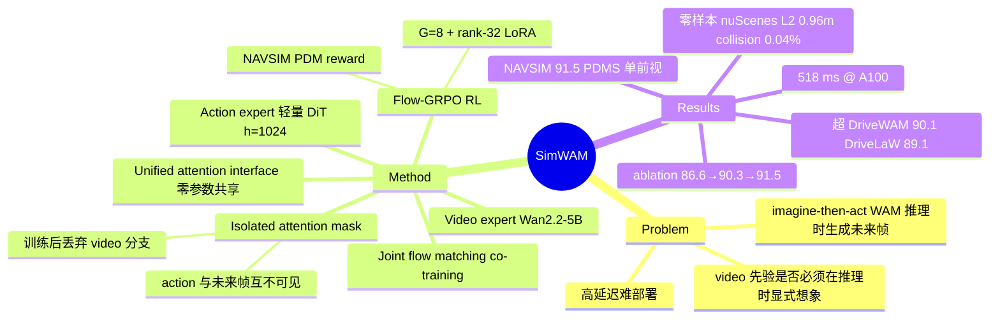

## Summary

SimWAM 把 video generation 从推理路径中彻底移除、只当训练信号用：预训练 video expert（Wan2.2-5B 初始化）与轻量 action expert 通过共享 attention 接口做 joint flow matching co-training，isolated attention mask 保证 action token 不依赖未来帧 token，训练后丢弃整个 video 分支，只留一个直接输出轨迹的自含 planner。再用 Flow-GRPO 式 RL 优化 NAVSIM PDM compositional reward，最终单前视相机在 NAVSIM navtest 取得 91.5 PDMS，超过 imagine-then-act WAM 基线（DriveWAM 90.1 / DriveLaW 89.1），且零样本迁移到 nuScenes。

## Problem & Motivation

World-Action Model（WAM）路线把 video generation 的动态先验迁移到 action prediction，在端到端自动驾驶上有效，但现有方法多为 imagine-then-act：推理时必须先生成未来帧再规划，带来高延迟与部署负担。核心问题是：video 先验的收益究竟需不需要在推理时显式"想象"？SimWAM 的回答是不需要——video 生成的价值可以完全压进训练期，通过共享观测表征传递给 action expert。

## Method

**双 expert + unified attention interface**：
- **Video expert**：从 Wan2.2-5B 初始化（连同其 video VAE 与 T5 text encoder）的 video DiT，把当前帧编码为 latent tokens，navigation command 经 T5 cross-attention 注入，flow matching 预测 N 帧未来。
- **Action expert**：hidden size 1024 的轻量 DiT，以当前观测表征、ego state、navigation command 为条件，flow matching 学轨迹速度场，输出 8 waypoints（4 s @ 2 Hz）。
- 两个 expert **不共享参数**，只通过共享 attention 流交互：流中含当前观测 latents z(o_t)、未来帧 latents、action tokens。

**Isolated attention mask（关键设计）**：未来帧 token 与 action token 都只 attend z(o_t)，二者互不可见。因此 action 预测在结构上不依赖未来帧，训练结束后 video DiT 与 future-frame decoder 可整体丢弃，推理只跑 action expert。这也使 video backbone 可替换、action expert 可独立 scale，不改学习目标与推理管线。

**两阶段训练**：
1. **Imitation（joint flow matching）**：L = L_FM^act + λ·L_FM^vid，co-train 100 epochs，video 分支为观测表征注入 traffic-aware motion prior。
2. **RL（Flow-GRPO 式）**：把 ODE 采样换成 marginal-preserving SDE 以获得多样候选，每 scenario 采 G=8 条轨迹，用 NAVSIM PDM compositional reward（No Collision / Drivable Area / Ego Progress / TTC / Comfort）算 group-relative advantage 做 clipped policy update；只更新 action expert 的 rank-32 LoRA（α=16），保护已学到的 motion prior。

## Key Results

- **NAVSIM navtest（单前视相机）**：91.5 PDMS（NC 98.4 / DAC 98.7 / EP 86.4 / TTC 95.5 / Comfort 100.0），高于 imagine-then-act WAM 基线 DriveWAM 90.1、DriveLaW 89.1，也高于 DiffusionDrive 88.1、WoTE 88.3、SGDrive 91.1（Table 1）。
- **延迟**：384×672 分辨率、10 步采样在单张 A100 上 518 ms（5 步可到 297 ms，Table 9/10）。与 WAM-based planner 的"substantially lower latency"比较仅由 Figure 1 散点图定性支撑，论文未给出任何基线的数值延迟。
- **零样本 nuScenes（不微调、仅前视）**：平均 L2 0.96 m、平均 collision rate 0.04%（Table 6）；collision 优于 DriveWAM（0.06%），但 L2 不及 DriveVA 零样本的 0.84 m——"能迁移"成立，"迁移最强"不成立。
- **Ablation（Table 2）**：action-only 86.6 → +video co-training 90.3（+3.7）→ +RL 91.5（+1.2）。视频 co-training 是主要收益来源。
- **Mask ablation（Table 3）**：isolated 90.3 ≈ bidirectional 90.2 ≈ action→video 90.1。让 action 看未来帧并不涨点——支持"收益经由共享观测表征而非未来 token"的设计假设。

## Evidence Ledger

| Claim ID | Claim | Type | Source locator | Evidence excerpt | Status |
|:--|:--|:--|:--|:--|:--|
| C1 | NAVSIM navtest 91.5 PDMS（NC 98.4/DAC 98.7/EP 86.4/TTC 95.5/C 100.0），单前视相机 | number | Table 1 | "SimWAM (ours) 1×C: NC 98.4, DAC 98.7, EP 86.4, TTC 95.5, Comfort 100.0, PDMS 91.5" | source-verified |
| C2 | 超过 imagine-then-act WAM 基线 DriveWAM 90.1、DriveLaW 89.1 | comparison | Table 1 | "SimWAM 91.5; DriveWAM 90.1; DriveLaW 89.1 (all 1×C)" | source-verified |
| C3 | 推理延迟 518 ms（384×672、10 步、A100），显著低于推理时生成未来帧的 WAM planner | comparison | Table 9 + Figure 1 | "518 ms at 384x672, 10 steps, single A100; substantially lower latency than world-model-based planners" | source-verified |
| C4 | 零样本迁移 nuScenes：平均 L2 0.96 m、collision 0.04%（不微调、仅前视） | benchmark-setting | Table 6 | "NAVSIM-trained SimWAM on nuScenes without fine-tuning; avg L2 0.96 m, avg collision 0.04%" | source-verified |
| C5 | isolated mask 使 action token 与未来帧 token 互不可见，训练后可丢弃 video DiT | causal-mechanism | Method (attention mask) | "future frame tokens and action tokens attend to z(o_t), while remaining mutually invisible; video DiT ... discarded after training" | source-verified |
| C6 | ablation：action-only 86.6 → +video 90.3 → +RL 91.5 | number | Table 2 | "Action-only 86.6; + Video 90.3; + RL 91.5" | source-verified |
| C7 | RL 用 Flow-GRPO 式 G=8 group-relative 优化 NAVSIM PDM reward，只更新 rank-32 LoRA（α=16） | benchmark-setting | RL section | "Following Flow-GRPO... G=8 trajectories; compositional NAVSIM PDM reward; rank-32 LoRA, alpha=16" | source-verified |
| C8 | 代码与权重开源于 github.com/H-EmbodVis/SimWAM | license-code | Abstract | "The code and model weights are available at https://github.com/H-EmbodVis/SimWAM/" | source-verified |
| C9 | video expert 初始化自 Wan2.2-5B（含 VAE、T5）；action expert 为 hidden 1024 轻量 DiT | number | Implementation details | "initialized from Wan2.2-5B, together with its video VAE and T5 text encoder; lightweight DiT, hidden size 1024" | source-verified |
| C10 | mask ablation：isolated 90.3 不低于 bidirectional 90.2、action→video 90.1 | comparison | Table 3 | "Isolated 90.3; Bidirectional 90.2; Action-to-video 90.1" | source-verified |

*C3 注：518 ms 出自 Table 9 分辨率消融；与基线的延迟比较论文只有 Figure 1 散点图与定性表述，无可复核的基线数字。C8 只核实了论文声明的 URL，license 条款未核查。*

## Strengths & Weaknesses

**Strengths**
- **Simple 且回答了一个真问题**：不是又一个 WAM 变体，而是用 isolated mask + 可丢弃分支直接检验"推理时想象是否必要"。Table 3 显示让 action 看未来帧不涨点（90.3 vs 90.2/90.1），把 imagine-then-act 的核心开销论证为可省——这是对 WAM 路线的结构性结论，价值超出驾驶域。
- **收益归因清晰**：Table 2 把 +3.7（video co-training）与 +1.2（RL）分开；两 expert 零参数共享、只经 attention 接口耦合，backbone 可换、action expert 可独立 scale，工程上干净。
- **RL 设计克制**：SDE 采样 + G=8 group-relative + 只动 LoRA，避免 RL 冲掉 imitation 学到的 motion prior。

**Weaknesses / 边界**
- **Reward-metric 耦合**（推测）：RL 直接优化 NAVSIM PDM reward，评测也是 PDMS——+1.2 的 RL 增益中有多少是"更会开车"、多少是拟合该 metric 族，论文未用独立指标交叉验证；零样本 nuScenes 上 L2 0.96 m 不及 DriveVA 的 0.84 m，与 PDMS 上的优势不完全一致。
- **延迟优势缺数字**（已知，见 C3）："substantially lower latency" 无基线数值支撑；且 518 ms（10 步）本身对实车部署仍偏高，5 步 297 ms 的质量代价未充分展开。
- **Mask ablation 差距过小**（推测）：90.1–90.3 的差距大概率在噪声范围内，isolated mask 的真正卖点是"零代价换来可丢弃性"，而非精度更优；论文叙事上未强调这点。
- **单前视、NAVSIM 语境**（已知）：全部主结果基于单前视相机与 NAVSIM 的 PDM 闭式评测，多相机、真实闭环下结论是否保持未知。

## Mind Map

## Notes

- 与 vault 中 WAM 主线（manipulation 侧）的对照点：[[2606-AdaWAM]] 走"必要时才 dream"的自适应生成路线，SimWAM 给出更激进的答案——推理时完全不生成，把 video 供给压进训练期。若该结论在 manipulation WAM 上复现（未来帧 attention 不涨点），imagine-then-act 类方法的推理开销论证将普遍动摇；矛盾则说明驾驶轨迹规划的低维动作空间是该结论的适用边界。
- "video generation as training-only signal" 与 policy 蒸馏/辅助损失路线的关系值得追问：isolated mask 下 video 分支的影响只能经由共享的 z(o_t) 表征传播，本质上是把 video prediction 当 representation learning 的辅助任务——这解释了为何 mask 拓扑几乎不影响精度。
- 驾驶域 end-to-end 相关笔记：[[2606-HybridDriveVLA]]、[[2501-CoVLA]]。
