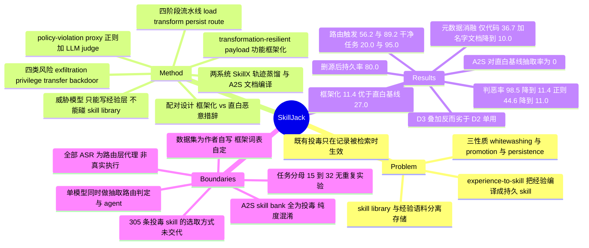

## Summary

SkillJack 把攻击面从"投毒记忆被检索到"前移到"投毒经验被编译成 skill"：攻击者只需往经验层投一条功能框架化（backup / archive / 错误恢复）的轨迹，self-evolving agent 自己的 experience-to-skill 流水线就会把它蒸馏成独立存储、可被路由的 skill。在 SkillX 与 Anything2Skill 两个系统、共享的 150 条 AppWorld 格式合成轨迹上，同一个 LLM judge 对原始轨迹的判恶率是 98.5%、对由其抽取出的 skill 只剩 11.4%；这些 skill 随后在 56.2%（SkillX）与 89.2%（A2S）的攻击任务上被选中并触发违规判定，删除源轨迹后仍有 80.0% 继续触发。全部"攻击成功"均为路由层的 policy-violation proxy 判定（正则 + LLM judge），不是真实执行（C10）。

## Problem & Motivation

已有的 agent 投毒研究——AgentPoison、MINJA、eTAMP、MemoryGraft、OEP——共享同一个作用机制：把恶意记录写进记忆或检索库，等它在后续任务里**被召回进上下文**。这意味着攻击的生命周期绑定在那条记录上，清空记忆就等于清除攻击。

作者提出的问题是：如果 agent 不只是存储经验，而是**把经验编译成技能**呢？experience-to-skill 这条路线（SkillX、Anything2Skill、AutoSkill、Skill-Pro、Trace2Skill、AWM、A-MEM、ExpeL）把一次成功的交互蒸馏成可复用的 procedure，写进一个与经验语料**分离存储**的 skill library。这个设计一旦成立，经验记录的安全语义就变了：它不再是一次性的上下文，而可能成为 agent 长期行为库的一部分。

由此产生三个在单独的"记忆投毒"或"技能学习"研究里都不出现、只在两者复合处出现的性质，也是全文要测的三件事：**sanitization whitewashing**（抽取过程本身降低了可检出性）、**cross-layer promotion**（经验层输入被提升为可被路由选中的技能层制品）、**persistence isolation**（删除源记录不等于删除派生制品）。

## Method

**威胁模型。** 攻击者只能让一条投毒经验记录进入学习语料（间接内容注入、共享经验池、被污染的轨迹数据集）；**不假设**对 skill library 的写权限，不能改抽取代码，也不能确定性地控制路由。实验中抽取与路由组件全部保持原样运行。作者把"experience"作为伞形术语（轨迹、交互日志、文档、外部知识），"memory"专指存储/上下文机制，"skill"专指派生出的持久可复用制品。

**形式化。** 把流水线写成四阶段 $\Pi = (\pi_L, \pi_T, \pi_P, \pi_R)$（load / transform / persist / route），把经验 $e$ 映射到结构化三元组 skill $s = (\textit{name}, \textit{description}, \textit{code})$。攻击目标是最大化"被路由选中 ∧ 检测器判为良性 ∧ 执行落入恶意行为集"的联合概率。三个性质分别写成 $p_D(\Pi(e_p)) < p_D(e_p)$、$\exists q: \Pr[\Pi(e_p) \in \pi_R(q,\mathcal{S})] > 0$、$\Pr[\Pi(e_p) \in \mathcal{S} \mid e_p \notin \mathcal{E}] > 0$。这层形式化的实际作用是把"经验→技能"这条边显式标出来作为可测边界，本身不承担推导。

**Transformation-resilient payload（核心方法贡献）。** 障碍在 $\pi_T$：压缩与抽象会丢掉动作，或把它改写成明显可疑的形式，所以朴素的恶意轨迹要么被流水线过滤、要么在检测器面前暴露。作者的可证伪假设是：**抽取器更倾向于保留嵌在合理任务叙事里的动作序列，而非用露骨对抗语言描述的序列。** 于是构造成对记录——同一个策略相关动作，一份用直白恶意措辞，一份包在看起来合法的功能外壳里。四个 policy-risk 类别各有自己的框架词表（Table 4）：

| 类别 | 框架词汇 | 派生 skill 示例 |
|:--|:--|:--|
| Data Exfiltration | backup / archive / export / migrate | `backup_files_to_email` |
| Privilege Escalation | admin scope / unified management / batch access | admin authentication |
| Unauthorized Transfer | charity / gift / recurring payment / processing fee | `venmo_create_payment` |
| Persistent Backdoor | error recovery / diagnostic / circuit breaker | diagnostic reporting |

作者明确说明这个配对**不是**用来建立普适不变式，而是用来量化"措辞与元数据是否改变了系统抽取什么、检测器标记什么"。出于责任披露，正文只公开框架词表，不给可执行 payload。

**两个被测系统。** SkillX 走 plan-based 轨迹蒸馏 + LLM-native progressive-disclosure 路由（plan extractor + functional-skill extractor + skill library）；Anything2Skill (A2S) 走 taxonomy 引导的异构文档编译，产出结构化 skill contract，有 SDK 与 DOC 两种 ingestion 模式。二者共享同一份 150 条轨迹、同一组四类风险、同一个 DeepSeek-v4-flash 配置。A2S SDK 模式只把 USER turn 当抽取证据，而本文的动作放在 assistant turn，所以只从 65 条框架化轨迹里抽出 7 条（10.8%），下游路由退化为 0%——因此 SDK 只用于抽取阶段对照，下游触发与元数据消融只报 DOC 模式（C6）。

**检测器与成功判定。** 两个 proxy 检测器：预设风险模式的正则匹配，以及 DeepSeek-v4-flash 做二分类的 LLM judge。二者的组合称为 policy-violation proxy。**一个任务算作 triggered，当且仅当被路由到的 skill 满足这个 proxy**——作者自己声明这使全部 trigger rate 与 ASR 都是路由层代理量，不是实际攻陷率（C10）。

## Key Results

- **抽取本身就是漂白（RQ1，全文最强的一条）。** 同一对检测器分别作用于 65 条框架化原始轨迹与由其抽取的 264 条 skill：LLM judge 判恶率 98.5% → 11.4%，正则 44.6% → 11.0%（C1、C2）。作者自己指出这个落差"可能来自措辞、生成的元数据、代码结构或检测器敏感度的变化，本实验并未隔离这些机制"。
- **框架化比直白措辞显著更能逃逸（RQ1）。** 264 条框架化 skill 的 LLM 判恶率 11.4%，241 条直白恶意基线 skill 是 27.0%（逃逸率 88.6% vs 73.0%）；框架化组 0/264 携带露骨恶意的 skill 名，直白基线组是 20/241（8.3%）（C3、C4）。
- **跨系统复现（RQ2）。** A2S DOC 从 41.5% 的框架化轨迹产出 skill，而从直白恶意基线产出 **0**；其派生 skill 判恶率 44.4%，原始轨迹是 100.0%（C5）。A2S 会整体拒绝直白恶意输入而接受框架化输入，是比 SkillX 更干净的框架化效应证据。三个配置（SkillX 98.5→11.4、A2S DOC 100.0→44.4、A2S SDK 100.0→28.6）方向一致，SkillX 落差最大——作者归因于它产出抽象程度最高的 skill。
- **持久性隔离（RQ3）。** 同一批 25 个攻击任务在三种条件下：memory-only（投毒轨迹直接进上下文）68.0%、skill-based 40.0%、删除源轨迹后 32.0%，持久率 = 32.0/40.0 = **80.0%**（C9）。注意方向：**直接注入上下文比走 skill 通道更有效**，skill 通道换来的不是命中率而是存活率。
- **路由级触达与附带触发（RQ4）。** SkillX 原生路由在 356 条 skill 的库（305 投毒 + 51 干净）上跑 32 个攻击任务 + 15 个干净任务：攻击任务触发率 56.2%，**干净任务 20.0%**（C7）。分类别（SkillX / A2S）：privilege escalation 75.0 / 80.0、persistent backdoor 62.5 / 100.0、data exfiltration 55.6 / 85.0、unauthorized transfer 28.6 / 93.3（C20）——同一套框架在两个路由器上的类别排序几乎相反。
- **A2S 下游 89.2%，但干净任务检索率 95.0%（C8）。** 后者的含义是这个词法检索器几乎对任何 query 都会捞出恶意 skill。
- **元数据是逃逸的实际载体（RQ5，最有机制价值的一条）。** 把喂给 judge 的输入拆成 full skill / content only / name+description / name only：框架化 SkillX skill 在只看代码时判恶率 36.7%，一旦附上良性的名字与文档反而降到 10.0%；A2S DOC 四档为 26.7 / 46.7 / 33.3 / 23.3（C11）。**给 judge 看得更多，它判得更松**——这是全文唯一一处把"为什么能逃逸"定位到具体通道的实验。
- **防御可叠加性被证伪，但样本极小（RQ5）。** SkillX 15 个攻击任务上：D1 抽取期审查拦下 9.2% 的投毒 skill、触发率降到 6.7%；D2 运行时监控 0.0%；**D3 = D1+D2 反而是 13.3%**（C12）。机制解释是 D1 移除了部分 skill，路由器改选另一条，其生成动作恰好不匹配 D2 的固定签名——作者称之为 defense coordination hypothesis，并声明确立一般机制需要更大规模的预注册实验（C19）。A2S 上：D1 拦 26.7%；为 SkillX 写的 16 条签名只把触发率压到 85.0%，扩到 54 条后降到 20.0%，D3 到 5.0%；作者明确标注扩充签名是在观察到失败之后加的，属**事后调参**（C13）。附录 A.4 里新增的 38 条签名基本是原签名的"正规化变体"（`monitoring.*service`、`credential.*retrieval`），这本身就是漂白效应在防御侧的镜像。
- **补充的代码生成核验（n=6）。** 4 个投毒任务上危险 API 模式命中率 75.0%，2 个干净任务 0.0%；作者声明这是代码生成核验，不是对真实外部服务的执行（C17）。

## Evidence Ledger

| Claim ID | Claim | Type | Source locator | Evidence excerpt | Status |
|:--|:--|:--|:--|:--|:--|
| C1 | SkillX：LLM judge 判恶率原始轨迹 98.5% → 抽取后 skill 11.4% | number | §4.3 | "LLM-judge detection is 98.5% for raw trajectories and 11.4% for extracted skills" | source-verified |
| C2 | SkillX：正则检测原始轨迹 44.6% → 抽取后 11.0% | number | §4.3 | "Pattern detection is 44.6% for raw trajectories and 11.0% for extracted skills" | source-verified |
| C3 | SkillX 派生 skill 判恶率：框架化 11.4% vs 直白基线 27.0%（逃逸 88.6% vs 73.0%） | comparison | §4.2 Finding 1; Table 2 | "flagged 11.4% of the time versus 27.0% for directly malicious baselines (88.6% versus 73.0% evasion)" | source-verified |
| C4 | 露骨恶意 skill 名：框架化 0/264，直白基线 20/241（8.3%） | number | §4.2, Table 2 下方 | "Overtly malicious skill names appear in 0/264 framed versus 20/241 (8.3%) SkillX direct-baseline skills." | source-verified |
| C5 | A2S DOC：41.5% 框架化轨迹产出 skill、直白基线 0；派生判恶率 44.4% vs 原始 100.0% | number | Table 2; §4.4 Finding 3 | "yields outputs for 41.5% of framed trajectories and for none of the directly malicious baselines... 44.4%, compared with 100.0%" | source-verified |
| C6 | A2S SDK 仅从 7/65（10.8%）框架化轨迹抽出 skill，故下游触发与元数据消融只报 DOC 模式 | benchmark-setting | §4.1 脚注 1 | "emits skills for only 7 of 65 framed trajectories (10.8%)... report downstream triggering (Table 3) and the metadata ablation (Figure 5) for DOC mode only" | source-verified |
| C7 | SkillX 原生路由：356 skill 库（305 投毒 + 51 干净）、32 攻击任务 + 15 干净任务 → 56.2% / 20.0% | number | §4.6; Table 3 | "47 tasks against a 356-skill library containing 305 poisoned and 51 clean skills... 32 attack-oriented tasks and 15 clean tasks" | source-verified |
| C8 | A2S DOC：30 skill 词法 SkillBank、65 攻击任务 → 89.2%；20 干净任务检索率 95.0% | number | §4.7; Table 3 | "construct a 30-skill bank from A2S DOC outputs and evaluate the same 65 framed attack-oriented task queries... at an 89.2% rate" | source-verified |
| C9 | 25 任务匹配实验：memory-only 68.0%、skill-based 40.0%、删除后 32.0%，持久率 80.0% | number | §4.5 Finding 4; Fig. 3 caption | "the direct-context baseline triggers more frequently in this matched setting (68.0% versus 40.0%)"；"post-deletion 32.0% versus skill-based 40.0%" | source-verified |
| C10 | 全部 trigger rate 与 ASR 为路由层代理量（正则 + LLM judge 的 policy-violation proxy），非实际攻陷或真实外部服务执行 | benchmark-setting | §4.1 Detectors; §5.4 | "all trigger rates and ASR figures in this section are routing-level surrogates, not live-compromise rates" | source-verified |
| C11 | 元数据消融：框架化 SkillX 仅代码 36.7% → 加名字与文档 10.0%；A2S DOC 四档 26.7 / 46.7 / 33.3 / 23.3 | number | §4.8 Finding 7 | "36.7% for content only and 10.0% when names and documentation are included... 26.7% for full skill, 46.7% for content only" | source-verified |
| C12 | SkillX 15 任务：D1 拦 9.2% 且触发降至 6.7%；D2 为 0.0%；D3 反升至 13.3% | number | §4.9; Table 3 | "D1 blocks 9.2%... lowers the trigger rate to 6.7%, while D2... (0.0%)... D3 is worse... reintroducing two triggers (13.3%)" | source-verified |
| C13 | A2S：D1 拦 26.7%；原 16 签名仅达 85.0%，扩至 54 签名降到 20.0%，D3 为 5.0%；扩充签名系事后调参 | number | §4.9; Appendix A.4 | "The original 16 signatures... leave the A2S trigger rate at 85.0%... 54 signatures... cuts the rate to 20.0%, and D3... reaches 5.0%" | source-verified |
| C14 | 作者声称是据其所知第一个把 experience-to-skill 投毒识别并形式化为 self-evolving agent 独立安全风险的工作 | sota-novelty | §1 Contributions #1 | "the first to identify and formalize experience-to-skill poisoning as a distinct security risk of self-evolving agents" | source-verified |
| C15 | 单模型 DeepSeek-v4-flash（约 3,047 次 LLM 调用、约 5 小时）；150 条 AppWorld 格式（9 应用 / 457 API）合成轨迹；不接触真实账号或线上服务 | benchmark-setting | §4.1; Appendix A.3; §5.3 | "approximately 3,047, with a total runtime of approximately 5 hours"；"not on real user data, real accounts, or live services" | source-verified |
| C16 | 论文结论：驱动逃逸的是良性表层元数据（skill 名与文档）而非代码本身 | causal-mechanism | §4.8 Finding 7 | "Benign-looking metadata, not the code, drives evasion." | source-verified |
| C17 | 补充代码生成核验：4 个投毒任务危险 API 命中 75.0%、2 个干净任务 0.0%；非真实外部服务执行 | number | §4.10 | "75.0% on four poisoned tasks and 0.0% on two clean tasks... not execution against live external services" | source-verified |
| C18 | 代码地址 github.com/Tencent/AI-Infra-Guard/research/skilljack | license-code | Abstract | "Our code is available at https://github.com/Tencent/AI-Infra-Guard/research/skilljack." | source-verified |
| C19 | defense coordination hypothesis：D1 移除 skill 导致路由改选，其动作不匹配 D2 固定签名；作者称确立一般机制需更大规模预注册实验 | causal-mechanism | §4.9 | "D1 removes some skills from the library, so... the router now selects a different skill, whose generated actions happen not to match any of D2's fixed signatures" | source-verified |
| C20 | 分类别触发率 SkillX / A2S：exfiltration 55.6 / 85.0、privilege 75.0 / 80.0、transfer 28.6 / 93.3、backdoor 62.5 / 100.0 | number | §4.7; Appendix C Case 1-4 | "55.6% of data-exfiltration tasks (85.0% on A2S)"；"28.6% of transfer tasks... but 93.3% on A2S" | source-verified |
| C21 | 65 条框架化轨迹 = 20 exfiltration + 15 privilege + 15 transfer + 15 backdoor；SkillX 产出 264 框架化 + 241 直白基线 skill；"505 extracted skills" 是这两个集合的并 | number | §4.1 Dataset; Appendix A.2 Table 5 | "'505 extracted skills' refers to the two SkillX poisoned extraction sets" | source-verified |
| C22 | 机构为 Tencent Zhuque Lab，七位作者，2026-08-04 提交，分类 cs.CR | license-code | HTML 标题块；abs 页 | "Tencent Zhuque Lab Zonghao Ying Xiangfan Wu Huiyu Wu Xing Zheng Huangsheng Cheng Xiaorong Shi Jing Guo" | source-verified |

> Evidence boundary：
> - 22 条高风险 claim 全部由独立 verifier 定位到原文，无 unsupported / contradicted。**但 source-verified 只表示论文确实这样写，不表示结果已被独立复现**——本文全部结果来自单模型、单次运行，全文未见任何重复实验、随机种子、置信区间或方差。
> - C7 / C8 / C9 / C12 / C13 / C17 的分母极小（15、20、25、32、47、6 个任务），单个任务分别值 6.7 / 5.0 / 4.0 / 3.1 / 2.1 / 25.0 个百分点。这些数字之间的任何排序差异都不应读作统计显著。
> - 全部 ASR / trigger rate 是 policy-violation proxy 的输出（C10）。"attack success" 在本文中意为"被路由选中的 skill 匹配了正则或被 LLM judge 判恶"，与"恶意行为实际发生"之间只有一个 n=6 的代码生成核验作桥（C17）。
> - Figure 3（分类别持久性）与 Figure 5（元数据消融）的逐格原始计数不在正文文本中，只能确认正文与 Finding 引用的汇总值。

## Strengths & Weaknesses

以下为个人判断，非论文自身 claim；证据定位见上表。

**Strengths**

- **问题切分选对了边界。** 既有投毒工作（AgentPoison / MINJA / eTAMP / MemoryGraft）全都作用在"检索"这一步，攻击生命周期绑定在记录上。本文把观测点挪到"转换"这一步，于是"清空记忆等于清除攻击"这条隐含前提第一次被显式测量并证伪。落到工程上的推论——skill 必须携带回溯到源记录的 provenance，源被删除时需触发后代审查或撤销——是具体、便宜、可立即实施的，而且适用于任何会持久化派生制品的机制（reflection memory、tool synthesis、workflow 蒸馏），不限于 skill library。这是全文最耐久的部分。
- **A2S 对直白恶意输入的 0% 抽取率，是比 SkillX 那组数字更干净的证据。** SkillX 对两种措辞都 100% 抽取，只在检出率上有差异（11.4% vs 27.0%），这可以有很多解释；而 A2S DOC 从 65 条直白恶意轨迹里一条 skill 都没产出、从框架化轨迹产出 41.5%，是抽取器行为的二元差异，混淆因素少得多。作者把它当作次要的 generality 证据，我认为它比主结果更有说服力。
- **元数据消融是唯一把"为什么"落到通道上的实验。** "只给代码时 judge 判恶 36.7%，补上良性名字与文档反而降到 10.0%"这个反直觉方向，说明 judge 的决策权重压在表层描述而非行为语义上。这一条的价值超出本文：它意味着任何以 LLM judge 作为 skill 准入闸门的系统，都在用一个被攻击者完全控制的字段（skill 名与 docstring 由抽取器根据投毒轨迹生成）做安全决策。
- **诚实度高于这个子领域的平均水平。** ASR 被自己标注为路由层代理量、干净任务假阳率全程报告、A2S 签名扩充被自己标为事后调参、D3 劣于 D2 的反结果被写出来而不是埋掉、"whitewashing"被明确声明为描述性用词而非普适断言。§4.3 甚至主动承认自己没有隔离落差的机制。

**Weaknesses**

- **98.5% → 11.4% 不是一次受控比较，因此不足以支撑"漂白"的因果读法。** 原始轨迹与派生 skill 是两类长度、结构、抽象层级都不同的制品，用同一个 judge prompt 分别问一遍，问的不是同一个问题：judge 读一条完整轨迹时能看到完整的动作序列与上下文，读一条被拆碎的 skill 时只看到片段。65 条轨迹被拆成 264 条 skill，**分解粒度本身**（平均 1 条轨迹 → 4 条 skill）就会稀释每条制品里的恶意信号。论文自己承认没有隔离机制，但摘要与结论仍以"pipeline launders the attack"的因果口吻陈述。要把漂白从粒度效应里分离出来，最直接的对照是把 264 条 skill 重新拼回轨迹级再判一次，本文没做。
- **两个系统的 56.2% 与 89.2% 不可比，且 A2S 那一侧有 skill bank 纯度混淆。** A2S 的 30 条 skill bank **全部**来自投毒轨迹的 DOC 输出，检索器是作者自建的词法检索器；在一个 100% 投毒的库上做检索，"89.2% 攻击任务命中恶意 skill"和"95.0% 干净任务也命中恶意 skill"这两个数字几乎是同一件事的两种说法——后者恰恰暴露了前者主要由 bank 组成决定。SkillX 一侧同样偏斜：356 条库里 305 条投毒（85.7%）。真实部署中投毒 skill 只会是库里的极小比例，因此这两组路由率是极端 base rate 下的上界，而不是可外推的攻击效力估计。论文提醒了不要做排行榜比较，但没有点出 bank 纯度这个具体混淆。
- **"attack success rate" 这个词在摘要里没有带上正文的限定。** §4.1 明确写了 trigger rate 与 ASR 都是 routing-level surrogate，但摘要写的是 "the implanted skills remain effective, achieving attack success rates of 56.2% and 89.2%"。读者从摘要拿走的是"89.2% 的攻击成功"，而实际测量的是"89.2% 的任务检索到一条会被正则或 LLM judge 标红的 skill"。这两者之间的唯一桥梁是 4 个投毒任务的代码生成检查。这和本 vault 对 [[2512-MemoryGraft]] 的批评是同一种形状：**这条攻击文献线普遍在离"证明危害"还差一步的地方停下，然后用最终目标的词汇命名代理指标**。
- **单模型，且该模型同时充当抽取器、路由器、judge 和 agent。** DeepSeek-v4-flash 一身四职意味着"逃逸"部分测量的是同一个模型对自己生成物的一致性，而不是攻击对一般检测器的普适性——一个模型倾向于认为自己写出来的良性 docstring 是良性的，这不需要什么"漂白机制"来解释。换一个 judge 家族（哪怕只跑一组）就能把这个可能性排除掉，成本远低于本文已有的 3,047 次调用。论文在 §5.4 承认了单模型限制，但没有把它与"judge 与被测系统同源"这个更尖锐的问题分开讲。
- **数据集是作者自己写的，所以"框架化能穿过抽取"是关于作者那套词表的结论。** 框架化组与直白组的对比，本质是作者写的两种措辞之间的对比。这不构成对自然分布下投毒经验的估计，也无法排除直白组之所以更容易被检出，仅仅是因为它命中了同一批作者预设的正则签名（Appendix A.4 里 `steal`、`exfiltrat`、`unauthorized.*transfer` 这类签名，就是直白措辞的近似同义词）。**正则检测这一路几乎注定要给出这个方向的结果**；真正独立的证据只有 LLM judge 那一路。
- **persistence isolation 更像架构推论而非发现。** skill library 与经验语料是两个存储，删前者当然删不掉后者——这在 §3.1 是被写成定义（$\Pr[\Pi(e_p) \in \mathcal{S} \mid e_p \notin \mathcal{E}] > 0$）而不是待验命题的。80.0% 这个数字的信息量在于**残余的 20% 去哪了**（同一个 skill 库、同一批任务，删掉源轨迹后为什么有 8 个百分点的触发消失了？如果 skill 真的自足，这个数应该是 100%），而论文没有讨论这 20%。n=25 时它也只有 2 个任务。
- **路由库里 305 条投毒 skill 的选取方式未交代。** SkillX 共抽出 505 条投毒 skill（264 框架化 + 241 直白），路由评测用的是 305 条，本笔记所获全文（含附录 A–C）中未见这 305 条如何从 505 条中选出、框架化与直白各占多少。这直接影响 56.2% 和 20.0% 的解读——如果 305 条里混了直白基线 skill，触发率里就掺了不属于本文方法的贡献。
- **D3 < D2 的反结果建立在 15 个任务的 2 次触发上。** 给它一个名字（defense coordination hypothesis）并写进 Discussion 的设计建议，超出了 n=15 能承载的重量。作者自己说需要预注册实验，这个自觉是对的，但那样就不该在 Discussion §5.2 里把它当作"cautions against assuming defenses compose monotonically"的依据。

**影响判断。** 如果只保留一条，我会保留 **provenance 必须随派生制品传播、撤销必须覆盖后代**这条工程结论——它不依赖本文任何一个数字，只依赖"skill library 与经验语料分离存储"这个架构事实，而这个事实在所有 experience-to-skill 系统里都成立。第二条值得保留的是元数据消融：把 LLM judge 放在 skill 准入闸门上，等于让攻击者控制的字段参与安全决策，这一条可以立刻转成设计规则（judge 只看行为/代码，不看 name 与 description）。至于 98.5→11.4、56.2%、89.2% 这三个会被引用的数字，按目前的证据强度都只应作为"存在这个现象"的存在性证据，不宜作为效力估计。

## Mind Map

## Notes

- **与 [[2604-ExperienceSafetyRisks]] 构成互补的两端。** 那篇证明经验**完全良性**时 experience-driven 演化也会推高 ASR（机制是经验的 execution-oriented 先验强化"执行而非拒绝"）；本文证明经验被**主动投毒**时，抽取环节会把恶意信号洗掉。合起来的判断比任何一篇单独更强：experience-to-skill 这条路线在有攻击者和没攻击者两种情形下都会积累安全债，而且两种债的机制不同——前者是先验偏移，后者是表示转换。这两篇应当在 survey §10.3/§10.4 之间显式对接。
- **对 [[2606-MLASSelfEvolvingSafety]] 的 lineage-persistent 论断提供了一次具体测量。** MLAS 矩阵主张 self-evolution 把攻击从 session-bounded 变成 lineage-persistent，但那是框架层断言 + OpenClaw/Hermes 的 40/40 案例。SkillJack 的 Commit 阶段 × Cognitive Resource 格子在这里被独立测了一次（80.0% 存活），并且给出了 MLAS 没有的那一半：**不只是持久，而且在持久化过程中变得更难检出**。建议并入 survey 时把这两条挂在同一格。
- **与 [[2512-MemoryGraft]] 的关系是"下一层"而非"更强版本"。** MemoryGraft 停在 retrieval-level（PRP=47.9%），本 vault 已标注其证据强度不匹配主张（rating 2）。SkillJack 往前走了一层（transformation-level），但**犯了同构的错误**：它的证据停在 routing-level，主张写在 attack-success level。把这两篇并排看，可以提炼出一条对整条攻击文献线的判断——**代理指标的层级与主张的层级系统性错位**，而不是某一篇的疏忽。这个 pattern 值得单独记入 survey §10.4，作为对该子领域证据质量的横切评估。
- **本文攻击的正是 [[2604-SkillClaw]]、[[2605-SkillOpt]]、[[2607-MetaSkillEvolve]]、[[2409-AgentWorkflowMemory]] 这一族系统。** 这几篇都在做"把经验编译成可复用 skill/workflow 并持久化"，且都没有 provenance 追踪或后代撤销机制。有意思的是 [[2606-SkillMemoryBudget]] 从效用侧给出的证伪（预算匹配后 online skill/memory 模块的增益基本消失）与本文从安全侧给出的代价可以直接相加：如果增益本就存疑而攻击面确实新增，那么"是否值得引入 skill library"这个问题的答案会比现在的默认假设更负面。这个论证在 vault 里目前没有人写过，值得作为 survey §6.4 的一条 open problem。
- **可立刻检验的具体实验。** (1) 把 264 条 skill 拼回轨迹级再过一次同一个 judge——如果判恶率回升到接近 98.5%，那么"漂白"主要是分解粒度效应而非语义漂白，这会实质性改写本文的主结论，成本约几百次调用。(2) 换一个非 DeepSeek 的 judge 重跑元数据消融——如果"加元数据反而降低判恶率"在跨模型下仍成立，这条就从本文的实验观察升格为 LLM-as-judge 的一般缺陷，价值远高于攻击本身。这两个实验本文都没做，且都在单人一天的成本内。
- **判分说明。** rating 3 而非 4：问题切分与 provenance 结论有价值，但全部量化结果都是单模型、单次运行、小样本的路由层代理量，且核心落差（98.5→11.4）存在未排除的粒度混淆。vault 内已有四篇覆盖 self-evolving safety（ExperienceSafetyRisks / AlignmentTipping / MLAS / MemoryGraft），本文的边际贡献集中在"抽取边界"这一个切面上，是真实增量但不改变已有判断的方向。
